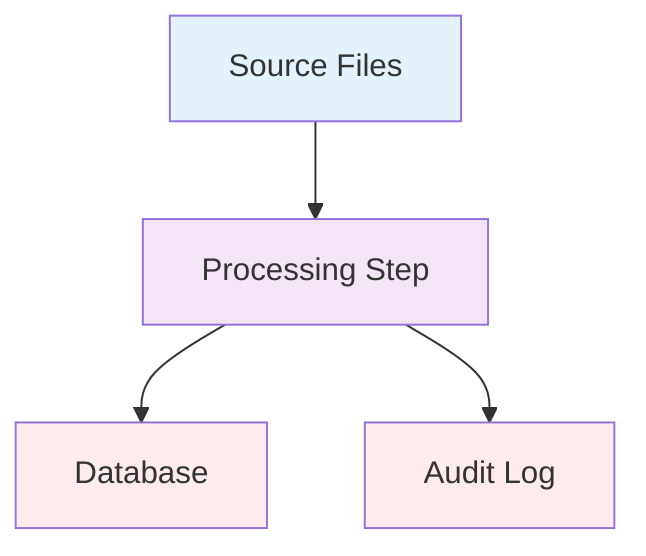
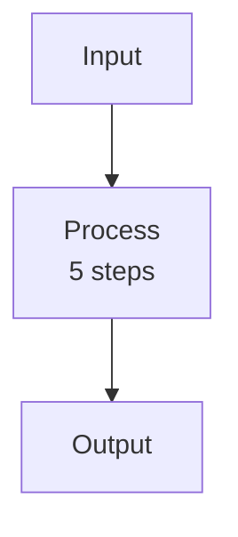

# Document System Component

Please create a comprehensive technical document for **{{COMPONENT_NAME}}** in the ISWC system.

{{#if FOCUS_AREAS}}
**Focus Areas:** {{FOCUS_AREAS}}
{{/if}}

**Output Location:** `docs/work_in_progress/architecture/{{COMPONENT_NAME}}.md`

---

## Sources to Use

**Primary Sources (authoritative - source of truth):**

- Core design documents in `docs/resources/core_design_documents/`
- Search for specifications, guidelines, technical designs related to {{COMPONENT_NAME}}

**Secondary Sources (implementation context):**

- Meeting transcripts in `docs/meetings/`
- Search for implementation details, architecture discussions, current state

**Tertiary Sources (code implementation):**

- Source code in `docs/resources/source-code/ISWC/src/`
- Search for actual implementation files that reference {{COMPONENT_NAME}}

---

## Document Structure Required

### 1. Header Metadata

- Document version (start at 1.0)
- Date (today's date)
- **Sources:** Listed as:
  - **Primary:** [Core design document names]
  - **Secondary:** [Meeting transcript names]
  - **Tertiary:** [Source code references count]
- **Search Terms Used:** List all search terms and aliases used during research (from three-phase search process)

### 2. Overview

- What is {{COMPONENT_NAME}}?
- Include direct quote from core design docs if available
- High-level purpose in the system

### 3. Primary Purpose

- Official purpose from specifications
- Key capabilities and responsibilities
- Role in the ISWC system architecture

### 4. Technical Architecture

- Infrastructure components used
- Technology stack (Azure services, languages, frameworks)
- Storage and data persistence
- Integration points with other components

### 5. How It Works

- Detailed operational description
- **Data flow diagrams using Mermaid** (preferred) or ASCII art as fallback
- Step-by-step processes
- User/agency interaction model (if applicable)

**Diagram Guidelines:**

- **Prefer Mermaid flowcharts** for architecture and workflow diagrams
- Keep diagrams **simple and clean** - avoid complex nested subgraphs
- If a diagram becomes too complex:
  - Split into multiple simpler diagrams
  - Extract detailed steps into numbered/bulleted text sections
  - Use hint text in nodes (e.g., "6 processing steps") with details below
- Use consistent color coding across diagrams
- Add subsection titles like "#### High-Level Workflow" and "#### Detailed Steps"

### 6. File/Data Formats (if applicable)

- Naming conventions
- File types or data structures
- Format specifications from core docs
- Examples with actual patterns

### 7. Integration with Other Components

- **Upstream dependencies:** What this component depends on
- **Downstream dependencies:** What depends on this component
- **Related components:** Components it interacts with
- System architecture position

### 8. Use Cases

- Primary use cases from business perspective
- User/agency workflows
- Real-world scenarios

### 9. Workflow Details (if applicable)

- Process flows
- Error handling mechanisms
- Edge cases and special conditions

### 10. Source Code References

**IMPORTANT:** This section is mandatory and must list ALL source code files that implement or reference this component.

Structure the section as follows:

- Organize files by logical categories (e.g., "C# Framework & Integration Layer", "Python Notebooks & Scripts", "Database Objects", "Documentation & Configuration")
- For each category, create subsections with bold headers
- For each file, provide:
  - Clickable markdown link: `[filename](relative/path/to/file)`
  - Brief description of its role/purpose after the dash
  - Example: `- [DatabricksClient.cs](../../../resources/source-code/ISWC/src/Framework/Databricks/DatabricksClient.cs) - HTTP client for Databricks Jobs API`
- Add a "Key Patterns and Technologies" subsection at the end to document:
  - Technology versions used
  - Common patterns (e.g., "Job Orchestration Pattern")
  - Development approaches
  - Important configuration details

**Finding files:** Use `Grep -i "{{COMPONENT_NAME}}" docs/resources/source-code/ISWC/src` to find all references

See [Databricks.md Source Code References section](./Databricks.md#source-code-references) for a complete example

### 11. Questions for Further Investigation

- Mark answered questions: `- [x] ~~Question?~~ **ANSWERED:** Details`
- Keep open questions for code review
- Add new questions discovered during research

### 12. References

- **Core Design Documents** section with links and descriptions
- **Meeting Transcripts** section with links and dates
- **Key Information Sources** with proper citation format:
  - **Core docs:** `**[Doc Name](path) → Section X.Y "Section Title"** - Brief description`
  - **Meetings:** `**[Meeting Name](path) (Timestamp, Speaker)** - What was discussed`
- **Architecture Diagrams** with section references where they appear

### 13. Document History

- Version table: Version | Date | Author | Changes

### 14. Known Gaps and Contradictions

- Use eye-catching emojis: ⚠️ (warning), 🔔 (important), 🔍 (needs investigation), 🔴 (critical)
- Flag discrepancies between core docs and meeting discussions
- Explain contradictions clearly
- Note resolution needed
- Assess impact level (Low/Medium/High)

---

## Critical Requirements

### ✅ DO

- **Prioritize** core design documents as authoritative source of truth
- **Include direct quotes** with proper attribution format:
  - **For core design docs:** `> **From [Doc Name](path/to/doc.md) → Section X.Y "Section Title":** "Quote"`
  - **For meeting transcripts:** `> **From [Meeting Name](path/to/transcript.txt) (Timestamp HH:MM, Speaker Name):** "Quote"`
  - Always use document links, section breadcrumbs, and section titles (not line numbers)
- **Use eye-catching emojis** to highlight contradictions, important notes, and warnings
- **Provide file references** with paths relative to repo root
- **Create Mermaid diagrams** (preferred) for data flows and architectures - keep them simple and clean
- **Split complex diagrams** into multiple simpler diagrams with text explanations
- **Use proper markdown** with blank lines around lists for linting compliance
- **Cross-reference** related architecture documents with clickable links
- **Be specific** with technical details (exact file names, formats, protocols, endpoints)
- **Note differences** between specification and implementation

### ⛔ DON'T

- Don't guess or infer information not present in sources
- Don't ignore contradictions - flag them prominently
- Don't omit technical details found in core docs
- Don't favor meeting notes over design documents when they conflict
- Don't create vague descriptions - be specific or note "needs investigation"
- Don't use emojis unless explicitly for warnings/contradictions
- Don't create overly complex diagrams with nested subgraphs - split them instead

---

## Search and Research Process

**IMPORTANT:** Follow ALL steps in order. Each phase's steps (a→b→c) must be completed before moving to the next phase.

### Phase 1: Core Design Documents (Steps 1a → 1b → 1c)

**Step 1a: Initial Search** ⚡ REQUIRED

```text
Use Grep tool to search for "{{COMPONENT_NAME}}" in:
- docs/resources/core_design_documents/**/*.md
Look for: specifications, guidelines, technical designs, architecture docs
```

**Step 1b: Extract Aliases and Related Terms** ⚡ REQUIRED

Review the initial findings and identify:

- Alternative names or abbreviations (e.g., "Databricks" → "DBX", "Azure Databricks")
- Related technology terms (e.g., "PySpark", "Delta Lake", "notebook")
- File/folder names mentioned (e.g., "IPI Full Resynch")
- Service/component names (e.g., "Data Factory", "Integration Cluster")

Create a **"Search Terms Used"** subsection in the output document listing all terms.

**Step 1c: Extended Search with Aliases** ⚡ REQUIRED

```text
Run additional Grep searches for EACH identified alias/term:
- docs/resources/core_design_documents/**/*.md
Document any new findings and cross-reference
```

**Example:** If Step 1b found "audit", "Audit", "AuditRequest", search for each term individually.

---

### Phase 2: Meeting Discussions (Steps 2a → 2b → 2c)

**Step 2a: Initial Search** ⚡ REQUIRED

```text
Use Grep tool to search for "{{COMPONENT_NAME}}" in:
- docs/meetings/**/*
Look for: implementation details, discussions, current state, issues
```

**Step 2b: Extract Aliases and Related Terms** ⚡ REQUIRED

Review meeting transcripts for:

- Informal names or nicknames used by team
- Problem descriptions (e.g., "the processing cluster", "the Python jobs")
- Related issues or features mentioned
- Technology stack terms

Add new terms to the **"Search Terms Used"** subsection.

**Step 2c: Extended Search with Aliases** ⚡ REQUIRED

```text
Run additional Grep searches for EACH identified alias/term:
- docs/meetings/**/*
Document any new findings and cross-reference
```

**Example:** If Step 2b found "submission history", "NoSQL", "JSON", search for each term individually.

---

### Phase 3: Source Code References (Steps 3a → 3b → 3c)

**Step 3a: Initial Search** ⚡ REQUIRED

```text
Use Grep tool (case-insensitive) to search for "{{COMPONENT_NAME}}" in:
- docs/resources/source-code/ISWC/src/**/*
Look for: implementation files, classes, configuration, database objects
```

**Step 3b: Extract Aliases and Related Terms** ⚡ REQUIRED

Review code findings for:

- Class names, namespace names (e.g., CosmosDbRepository, IAuditService)
- Configuration keys or connection strings
- File paths and folder structures
- API endpoint names
- Database table/view names

Add new terms to the **"Search Terms Used"** subsection.

**Step 3c: Extended Search with Aliases** ⚡ REQUIRED

```text
Run additional Grep searches for EACH identified alias/term:
- docs/resources/source-code/ISWC/src/**/*
Document any new findings and organize by category
```

**Example:** If Step 3b found "CosmosDbRepository", "IAuditService", "CacheIswc", search for each term individually.

---

### Phase 4: Synthesis (After completing all searches)

**Step 4a: Read and Extract**

- Read all relevant core design documents completely
- Identify section structure and hierarchical organization
- Read relevant sections of meeting transcripts
- Review key source code files to understand implementation
- Extract quotes with proper attribution:
  - **Core docs:** Document name, section breadcrumb (e.g., "Section 3.2"), and section title
  - **Meetings:** Document name, timestamp, and speaker name
  - **Code:** File paths with brief descriptions
- Note contradictions and gaps

**Step 4b: Cross-Reference and Synthesize**

- Identify where sources agree (reinforce these points)
- Highlight where sources contradict (flag with emojis)
- Note where specifications exist but implementation is unclear
- Flag where meetings mention details not in specs
- Document how code implementation aligns with specifications
- Finalize the **"Search Terms Used"** section with all discovered terms

---

## Output Quality Standards

The final document must be:

- **Comprehensive**: Cover all aspects of the component found in sources
- **Accurate**: Distinguish between specification and implementation
- **Well-Structured**: Use the exact section structure above
- **Visual**: Tables, lists, Mermaid diagrams (simple and clean), strategic emoji use
- **Actionable**: Clear questions and gaps for follow-up
- **Traceable**: Every statement attributed to a source
- **Lint-Clean**: Proper markdown with blank lines around lists

---

## Citation Format Examples

### Search Terms Used Section

```markdown
**Search Terms Used:**

- Primary: Databricks, Azure Databricks
- Related technologies: PySpark, Spark, Delta Lake, Notebook
- File/folder names: IPI Full Resynch, Integration Cluster
- Service names: Data Factory, IntegrationCluster
- Code terms: DatabricksClient, IDatabricksClient, databricks-connect
- Database objects: Databricks_Iswc_Data, Databricks_Ipi_Data
```

### Core Design Document Quote

```markdown
> **From [IPI Integration Spec](../../resources/core_design_documents/SPE_20191001_ISWC_IPI_Integration/SPE_20191001_ISWC_IPI_Integration.md) → Section 3.4 "File Processing":** "The relevant information from these IPA transactions will be extracted, as per the mapping above, into a set of files that mirror the IPI tables in the ISWC database."
```

### Meeting Transcript Quote

```markdown
> **From [Workshop 2](../../meetings/20251021-ISWC%20Audit%20-%20Workshop%202%20-%20Documentations%20and%20infrastructure.txt) (1:18:19, Mark Stadler):** "If you dropped a new file into SFTP... there would be a lot of work in processing that file in Databricks."
```

### Reference Section Entry (Core Doc)

```markdown
- **[IPI Integration Spec](../../resources/core_design_documents/SPE_20191001_ISWC_IPI_Integration/SPE_20191001_ISWC_IPI_Integration.md) → Section 3.4-3.6** - File processing workflow and maintenance mode
```

### Reference Section Entry (Meeting)

```markdown
- **[Yann Discussion](../../meetings/20251021-ISWC%20-%20Discussion%20Yann_Guillaume_Bastien.txt) (18:44, Yann Lebreuilly)** - Outdated runtime version and missing features
```

### Mermaid Diagram Example

**Simple workflow diagram:**

````markdown

````

**With text explanations for complex steps:**

````markdown
#### High-Level Workflow



#### Processing Steps (Step B)

1. **Step 1** - Description
2. **Step 2** - Description
3. **Step 3** - Description
4. **Step 4** - Description
5. **Step 5** - Description
````

---

## Workflow Checklist

When executing this command, create todos for ALL these steps:

**Phase 1: Core Design Documents**

- [ ] Step 1a: Initial search in core design documents
- [ ] Step 1b: Extract aliases and related terms from design docs
- [ ] Step 1c: Extended search with all identified aliases in design docs

**Phase 2: Meeting Discussions**

- [ ] Step 2a: Initial search in meeting transcripts
- [ ] Step 2b: Extract aliases and related terms from meetings
- [ ] Step 2c: Extended search with all identified aliases in meetings

**Phase 3: Source Code**

- [ ] Step 3a: Initial search in source code
- [ ] Step 3b: Extract aliases and related terms from code
- [ ] Step 3c: Extended search with all identified aliases in source code

**Phase 4: Synthesis & Documentation**

- [ ] Step 4a: Read and extract information from all sources
- [ ] Step 4b: Cross-reference and synthesize findings
- [ ] Create CosmosDB.md document with all required sections
- [ ] Add Mermaid diagrams (simple and clean)
- [ ] Verify all citations use proper format
- [ ] Verify Source Code References section is complete
- [ ] Final review and formatting check

---

## After Document Creation

1. Save to `docs/work_in_progress/architecture/{{COMPONENT_NAME}}.md`
2. Verify all markdown formatting (run linter if needed)
3. **Verify all quotes use proper citation format** (document link, section/timestamp, no line numbers)
4. **Verify Source Code References section is complete** with all relevant implementation files
5. Summary of what was documented
6. List any critical contradictions found
7. Suggest next steps for investigation

---

**Now please proceed with documenting {{COMPONENT_NAME}}.**
