# Enhance Presentation Part

Improve the visual style of a presentation part markdown file by adding Mermaid diagrams and tables while preserving ASCII versions in speaker notes.

## Task

You are enhancing presentation markdown files to improve their visual appeal and readability for the CISAC ISWC Audit first restitution delivery.

**Target file:** `{{PART_FILE}}`

## Enhancement Guidelines

### 1. Convert ASCII Diagrams to Mermaid

For each ASCII diagram/visualization:

- **Create a Mermaid diagram** using appropriate diagram type:
  - `graph TB/LR` for architecture/flow diagrams
  - `flowchart` for decision flows and processes
  - Use `subgraph` for logical grouping
- **Color coding** (use `style` directive):
  - Red (`#ffcccc`, `#ffe6e6`) for critical issues, blockers
  - Orange (`#fff4cc`, `#ffe6e6`) for warnings, concerns
  - Green (`#ccffcc`, `#e6ffe6`) for positives, successes
  - Blue (`#e6f3ff`) for neutral/informational
- **Preserve ASCII** in `<details>` block within speaker notes:

  ```markdown
  **Speaker Notes:**

  <details>
  <summary>ASCII Diagram (fallback)</summary>

  ```text
  [original ASCII diagram]
  ```

  </details>
  ```

### 2. Convert Text Lists to Tables

For structured data presented as lists:

- **Convert to markdown tables** with clear headers
- **Use `<br/>` for multi-line cells** when needed
- **Add emoji indicators** (✅, ⚠️, 🔴, 🟡) for status/priority
- **Structure:**
  - First column: Category/Item
  - Second column: Status/Value
  - Third column: Details/Description

Example:

```markdown
| Category | Status | Details |
|----------|--------|---------|
| **Item 1** | ✅ GOOD | • Point 1<br/>• Point 2 |
| **Item 2** | ⚠️ WARN | • Point 1<br/>• Point 2 |
```

### 3. Two-Column Comparisons

For pros/cons or strengths/concerns layouts:

- **Convert to side-by-side table**
- **Header row:** `| ✅ Strengths | ⚠️ Concerns |`
- **Each row:** One strength vs one concern
- **Use bold for categories** within cells

Example:

```markdown
| ✅ Strengths | ⚠️ Concerns |
|-------------|-------------|
| **Well-structured**<br/>• Point 1<br/>• Point 2 | **Issue name**<br/>• Point 1<br/>• Point 2 |
```

### 4. Status Dashboards

For status indicators with multiple priority levels:

- **Create priority table** with columns: Priority, Status, Items
- **Add visual Mermaid diagram** showing status breakdown
- **Use color coding** for priority levels

Example Mermaid:

```mermaid
graph LR
    A[Main Topic] --> B[✅ RESOLVED<br/>Description]
    A --> C[⚠️ MEDIUM<br/>Description]
    A --> D[🔴 URGENT<br/>Description]

    style B fill:#ccffcc
    style C fill:#fff4cc
    style D fill:#ffcccc
```



### 5. Preserve Speaker Notes Structure

- **Keep all reference citations** (`**[Reference: ...]**`)
- **Maintain narrative flow** in speaker notes
- **Add ASCII fallbacks** in `<details>` at the start of speaker notes
- **Don't modify substantive content** - only improve visual presentation

## Process

1. **Read the target file** specified in `{{PART_FILE}}`
2. **Identify enhancement opportunities** in each slide:
   - ASCII diagrams → Mermaid
   - Lists → Tables
   - Two-column text → Comparison tables
   - Status indicators → Priority tables + diagrams
3. **Apply enhancements** while preserving:
   - All content and meaning
   - All references and citations
   - Original ASCII in speaker notes
4. **Verify markdown linting** passes:

   ```bash
   npx markdownlint {{PART_FILE}}
   ```

5. **Report changes** made to each slide

## Quality Checklist

- [ ] All ASCII diagrams converted to Mermaid
- [ ] ASCII diagrams preserved in `<details>` blocks in speaker notes
- [ ] Tables used for structured data
- [ ] Color coding applied consistently
- [ ] Speaker notes unchanged (except ASCII preservation)
- [ ] All references preserved
- [ ] Markdown linting passes
- [ ] `<details>` and `<summary>` added to `.markdownlint.json` allowed_elements

## Expected Improvements

**Visual enhancements:**

- Modern Mermaid diagrams with color coding
- Clean markdown tables for data presentation
- Better visual hierarchy and readability
- Professional appearance for client delivery

**Backwards compatibility:**

- ASCII diagrams available in speaker notes for fallback
- No content loss or meaning change
- All citations and references intact

## Example Usage

To enhance part 2:

```bash
/enhance-presentation-part PART_FILE="docs/deliverables/first-restitution-2025-11-24/presentation/part2-executive-summary.md"
```

To enhance part 4:

```bash
/enhance-presentation-part PART_FILE="docs/deliverables/first-restitution-2025-11-24/presentation/part4-governance-findings.md"
```

## Notes

- This command modifies the file in place
- Always read the file first to understand structure
- Don't over-engineer - keep diagrams simple and clear
- Prioritize readability over complexity
- Test Mermaid syntax in your mind before applying
