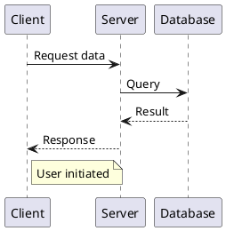
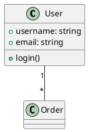
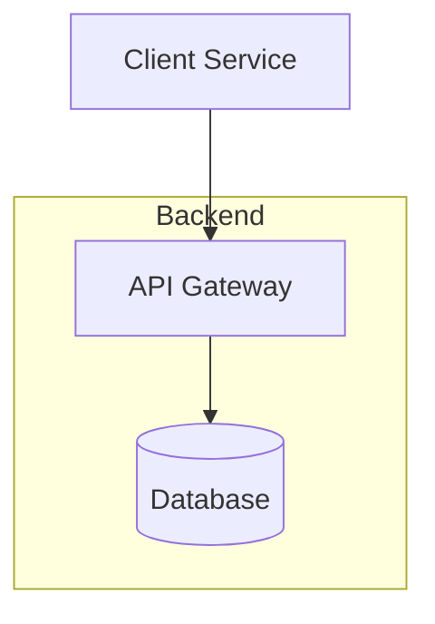
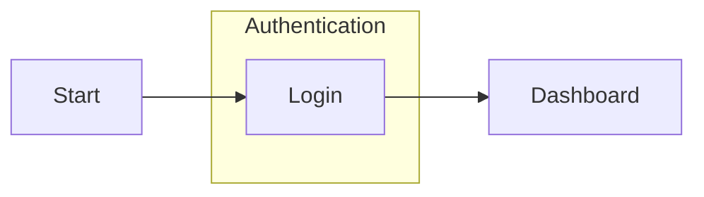

# Diagram Creation Standards

## General Guidelines

1. Keep diagrams simple and focused on a single purpose
2. Use text-based formats for version control compatibility
3. Avoid using icons or images to maintain consistency and simplicity
4. Include clear titles and descriptions in diagram files
5. Add comments to explain complex relationships or flows

## Organization and Management

1. Store diagrams in a dedicated `diagrams/` subdirectory within their respective documentation category

   ```tree
   docs/
   ├── category/
   │   ├── diagrams/
   │   │   ├── 001-diagram-name.{mmd,puml}
   │   │   └── 001-diagram-name.md
   │   └── document.md
   ```

2. Naming conventions:

   - Use numerical prefixes (e.g., `001-`, `002-`) for ordering
   - Use kebab-case for file names
   - Follow pattern: `NNN-category-purpose.{mmd,puml}`
   - Example: `001-auth-login-sequence.puml`
   - Example: `002-system-architecture.mmd`

3. Diagram Documentation:

   - For each diagram, create a companion markdown file with the same name
   - The companion file should include:
      - A description of the diagram
      - The diagram code in a code block
      - A component legend explaining symbols and colors
      - Links to related documentation

4. Referencing diagrams:

   - Use direct links to both the source file and the documentation file
   - In markdown documents, use the following format:

      ```markdown
      ## Diagram

      The diagram is available in the following formats:

      - [View Diagram Source](diagrams/001-diagram-name.mmd) <!-- Example path; replace with actual file location -->
      - [View Diagram with Description](diagrams/001-diagram-name.md) <!-- Example path; replace with actual file location -->
      ```

   - Avoid embedding diagrams directly in markdown files using the `{{...}}` syntax as it may not render properly in all viewers
   - For PlantUML diagrams that have been rendered to images, use standard markdown image syntax:

      ```markdown
      
      ```

## Diagram Type Selection

### Use PlantUML for

1. Sequence Diagrams

   - System interactions
   - API flows
   - Message passing
   - Event sequences

2. Class Diagrams

   - Domain models
   - Class relationships
   - System structure

3. State Diagrams

   - State machines
   - Status transitions
   - Workflow states

4. Component Diagrams
   - System components
   - Module dependencies
   - Service relationships

### Use Mermaid for

1. Architecture Diagrams

   - System architecture
   - Infrastructure layouts
   - Deployment diagrams
   - Network topology

2. User Flows

   - User journeys
   - Navigation paths
   - Process flows
   - Decision trees

3. Entity Relationships
   - Database schemas
   - Data relationships
   - System entities

## PlantUML Standards

### Sequence Diagram Guidelines



### Class Diagram Guidelines



## Mermaid Standards

### Architecture Diagram Guidelines



### User Flow Guidelines



## Component Naming

1. Node/Component naming:
   - Use PascalCase for components
   - Use clear, descriptive names
   - Avoid abbreviations unless common

## Documentation Requirements

1. Each diagram file must include:

   ```frontmatter
   Title: [Diagram Title]
   Description: [Brief description of what the diagram represents]
   Author: [Original author]
   Last Updated: [Date]
   ```

2. Complex diagrams should include:
   - Legend or key
   - Notes explaining non-obvious elements
   - References to related diagrams

## Best Practices

1. Keep diagrams focused:

   - One diagram per file
   - One concept per diagram
   - Split complex diagrams into smaller ones

2. Maintain readability:

   - Limit diagram size
   - Use consistent spacing
   - Align elements properly
   - Use clear directional flow

3. Version control:

   - Include meaningful commit messages
   - Update related documentation
   - Review diagram changes carefully

4. Regular maintenance:

   - Review diagrams periodically
   - Update outdated information
   - Remove obsolete diagrams
   - Keep styling consistent

5. Diagram maintenance:
   - Keep diagrams in their source format (Mermaid, PlantUML)
   - Update both diagram source and its documentation file when making changes
   - Document diagram conventions in diagram file comments
   - Consider adding a README.md in the diagrams directory for complex diagram sets
   - For important diagrams, consider also maintaining a static image version (PNG/SVG)

## Branding and Color Palette for Diagrams

All diagrams must use the official PALO IT branding colors for consistency:

- **Primary Green:** `#008F68`
- **Accent Orange:** `#FF9132`
- **Primary Color (Mermaid):** `#46C864`
- **Primary Text Color:** `#5157DD`
- **Line Color:** `#5E5F5A`
- **Secondary Color:** `#F0EFEB`
- **Tertiary Color:** `#FFF`

### Example: Applying Branding in Mermaid

Add this snippet at the top of your Mermaid diagrams:

```mermaid
%%{
  init: {
    'theme': 'base',
    'themeVariables': {
      'primaryColor': '#46C864',
      'primaryTextColor': '#5157DD',
      'primaryBorderColor': '#008F68',
      'lineColor': '#5E5F5A',
      'secondaryColor': '#F0EFEB',
      'tertiaryColor': '#FFF',
      'fontFamily': 'Montserrat, sans-serif',
      'fontSize': '14px'
    }
  }
}%%
```

For PlantUML, use the following color codes in your skinparam or style blocks:

- Green: `#008F68`
- Orange: `#FF9132`
- Blue: `#5157DD`
- Gray: `#5E5F5A`
