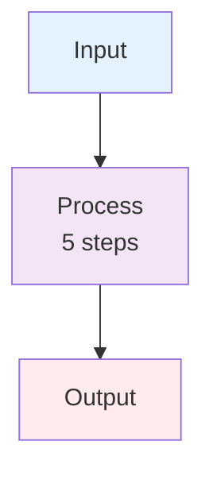

# CLAUDE.md

This file provides guidance to Claude Code (claude.ai/code) when working with code in this repository.

## Project Context

This repository contains documentation for a CISAC ISWC (International Standard Musical Work Code) system audit conducted by Teragone-Factory. The project involves:

- Auditing a complex Azure-based distributed system for music rights management
- Analyzing architecture, infrastructure, source code, and vendor dependencies
- Creating comprehensive technical documentation from specifications, meeting transcripts, and source code
- Providing strategic recommendations for system modernization and vendor independence

**Project Stakeholders:**

- **Client:** CISAC (main contact: Yann Lebreuilly)
- **Vendor:** Spanish Point Technology - original developer and maintainer (main contact: Curnan Reidy)
- **Auditor:** Teragone-Factory (technical consultants: Guillaume Jay and Bastien Gallay)

**Project Timeline:**

- **Budget:** 20 man-days (10 days per consultant)
- **Start date:** October 20, 2025
- **First restitution:** November 14, 2025
- **Final delivery:** November 21, 2025
- **Weekly review meetings:** At least once per week with CISAC to review discoveries, manage blockers, re-adjust priorities, and decide next actions

**Repository Purpose:**

This repository serves as the central workspace for the audit, containing:

- Reference materials provided by CISAC and Spanish Point (READ-ONLY in `resources/`)
- Meeting transcripts and notes (`meetings/`)
- Active analysis and investigation work (`work_in_progress/`)
- Draft documents for the restitution reports
- Final restitution documents (November 14 and November 21 deliveries)
- The original audit proposal (`proposal/`)

## Development Environment

This is a **MkDocs documentation site** using Python 3.12+ with Material theme.

**Notes:** PALO IT is an old branding and the project is now owned by Teragone-Factory

### Setup Commands

```bash
# Create virtual environment (using uv)
uv venv

# Activate virtual environment
source .venv/bin/activate  # macOS/Linux/Git Bash
.venv\Scripts\Activate.ps1  # PowerShell
.venv\Scripts\activate.bat  # Windows CMD

# Install dependencies
uv pip install -r pyproject.toml

# Serve documentation locally (auto-reload enabled)
mkdocs serve
# Opens at http://127.0.0.1:8000
```

### Linting

```bash
# Run markdownlint on all docs
npx markdownlint docs/**/*.md

# Lint specific file
npx markdownlint docs/work_in_progress/Investigation-Planning.md

# Auto-fix issues
npx markdownlint --fix docs/**/*.md
```

**Markdown Linting Rules** (`.markdownlint.json`):

- MD013 (line length) disabled
- MD024 (duplicate headings) allowed if in different sections
- MD033 allows `<br>` and `<a>` tags
- Always use blank lines around lists for proper rendering

## Repository Architecture

### Four-Layer Documentation Structure

1. **`docs/resources/`** - Reference materials (READ-ONLY)
   - `core_design_documents/` - Official specifications (2019-2020) - **source of truth**
   - `source-code/ISWC/src/` - Complete ISWC application source code
   - `performance_proposition/` - Spanish Point upgrade proposals
   - `md/` - Converted PDF documents
   - **CRITICAL:** This directory should NEVER be generated or edited by Claude, except for indexation or format conversion purposes only

2. **`docs/meetings/`** - Meeting documentation
   - Transcripts of workshops and client meetings
   - Meeting summaries and notes
   - Workshop 1 (Oct 20) - Source code access negotiations
   - Workshop 2 (Oct 21) - Infrastructure and documentation review
   - Internal discussions and planning sessions

3. **`docs/work_in_progress/`** - Active audit analyses (private, not in MkDocs nav)
   - `Investigation-Planning.md` - Master audit plan and backlog
   - `architecture/` - Component deep-dives (CosmosDB, Databricks, Portal, etc.)
   - `code_analysis/` - Integration pattern analysis
   - `infra/` - Azure infrastructure inventory (343 resources) + C4 diagrams
   - Draft documents for restitution
   - Status tracking documents

4. **`docs/proposal/`** - Original audit proposal
   - Original proposal documents split into sections
   - Context, governance, planning, and methodology

### MkDocs Navigation

The navigation structure is defined in `mkdocs.yml`. The `work_in_progress/` directory contains draft audit work and is typically not included in the published site navigation.

## Custom Slash Command: `/document-component`

**Purpose:** Create comprehensive technical documentation for ISWC system components by synthesizing specifications, meetings, and source code.

**Usage:**

```plaintext
/document-component COMPONENT_NAME="Databricks" FOCUS_AREAS="IPI processing workflow"
```

**Output:** `docs/work_in_progress/architecture/COMPONENT_NAME.md`

### Three-Phase Research Process (MANDATORY)

The command enforces a rigorous search methodology:

**Phase 1: Core Design Documents** (authoritative source of truth)

1. Initial search for component name
2. Extract aliases and related terms from findings
3. Extended search with all aliases

**Phase 2: Meeting Transcripts** (implementation context)

1. Initial search for component name
2. Extract informal names, problem descriptions, tech stack terms
3. Extended search with all aliases

**Phase 3: Source Code** (actual implementation)

1. Initial case-insensitive search
2. Extract class names, namespaces, config keys, API endpoints
3. Extended search with all code terms

**Phase 4: Synthesis**

- Read complete documents
- Extract quotes with proper attribution
- Flag contradictions with emojis (🔴 ⚠️ 🔍)
- Cross-reference all sources

**All search terms discovered must be documented in "Search Terms Used" section.**

### Documentation Standards

**Required Document Structure (14 sections):**

1. Header Metadata (version, date, sources, search terms)
2. Overview
3. Primary Purpose
4. Technical Architecture
5. How It Works (with Mermaid diagrams)
6. File/Data Formats
7. Integration with Other Components
8. Use Cases
9. Workflow Details
10. **Source Code References** (MANDATORY - all implementation files)
11. Questions for Further Investigation
12. References (core docs, meetings, architecture diagrams)
13. Document History (version table)
14. Known Gaps and Contradictions (with emojis)

**Citation Format Examples:**

Core Design Document:

```markdown
> **From [IPI Integration Spec](../../resources/core_design_documents/SPE_20191001_ISWC_IPI_Integration/SPE_20191001_ISWC_IPI_Integration.md) → Section 3.4 "File Processing":** "Quote text"
```

Meeting Transcript:

```markdown
> **From [Workshop 2](../../meetings/20251021-ISWC%20Audit%20-%20Workshop%202.txt) (1:18:19, Mark Stadler):** "Quote text"
```

Reference Entry:

```markdown
- **[Doc Name](path) → Section X.Y "Section Title"** - Description
- **[Meeting Name](path) (Timestamp, Speaker)** - What was discussed
```

### Diagram Guidelines

**Prefer Mermaid flowcharts** over ASCII art:

- Keep diagrams simple and clean
- Split complex diagrams into multiple views
- Use consistent color coding
- Add subsection titles ("High-Level Workflow", "Detailed Steps")
- For complex processes: show high-level diagram with hint text (e.g., "6 steps"), then list steps in numbered text

Example:



Then explain "5 steps" in numbered list below.

## Source Code Analysis Patterns

When analyzing ISWC source code (`docs/resources/source-code/ISWC/src/`):

**Technology Stack:**

- Frontend: React 16.12.0 + TypeScript 3.7.3 + Redux 4.0.4
- Backend: ASP.NET Core 3.1 (EOL Dec 2022 - flag as technical debt)
- Data Processing: Azure Databricks 10.4 LTS (outdated - flag as technical debt)
- Databases: Azure SQL Server + Cosmos DB (MongoDB API)
- Integration: Matching Engine (external Spanish Point product - REST API)

**Key Search Patterns:**

- Controllers: `*Controller.cs`
- Services: `*Service.cs`, `I*Service.cs`
- Repositories: `*Repository.cs`, `IRepository<T>`
- Clients: `*Client.cs` (HTTP integrations)
- Notebooks: `*.ipynb`, `*.py` (Databricks)
- Pipelines: `deployment/DataFactory/pipeline/*.json`

**When documenting integrations:**

- Identify HTTP clients and endpoints
- Note authentication patterns (OAuth2, JWT, SOAP)
- Document retry policies (Polly)
- Flag synchronous blocking calls (performance coupling)
- Map data flow between components

## Investigation Planning Document

**Master backlog:** `docs/work_in_progress/Investigation-Planning.md`

**Key sections:**

- Table of Contents
- High-Level Audit Priorities (with day allocations)
- Timeline (20 man-days total, 10 days per consultant)
- Out of Scope items with alternatives
- Component Investigation Plan
- Investigation Methodology (4 phases)
- Component-to-Document Mapping (appendix)

**Scope management:**

- Contract/legal review: OUT OF SCOPE (not our expertise)
- Code quality: Targeted review only (critical paths)
- **This plan serves as a backlog** - continuously reviewed with client during weekly meetings
- Regular check-ins to adjust priorities based on findings and manage blockers
- Weekly reviews with CISAC to re-prioritize next actions

**Critical priorities:**

1. Hyperscale proposal validation - €40K project decision
2. IaC & DevOps maturity assessment - validation of implementation estimates
3. Matching Engine technical coupling - performance impact and vendor dependency
4. Technical debt & upgrade path - security vulnerabilities and modernization roadmap
5. Cost optimization opportunities - potential €60-120K/year savings

## Progress Tracking

**Status reports are maintained separately** as dated snapshots in `docs/work_in_progress/`:

- Status documents follow naming pattern: `YYYYMMDD-AuditStatus.md`
- Detailed analyses follow pattern: `YYYYMMDD-AuditStatus-Analysis.md`
- These provide point-in-time snapshots of audit progress, blockers, and discoveries

**Latest status reports:**

- [20251024-AuditStatus.md](docs/work_in_progress/20251024-AuditStatus.md) - Quick status snapshot
- [20251024-AuditStatus-Analysis.md](docs/work_in_progress/20251024-AuditStatus-Analysis.md) - Comprehensive findings and analysis

**When to update status documents:**

- After major milestones or discoveries
- Before weekly CISAC meetings
- When significant blockers are encountered
- After each restitution delivery

## Key Technical Findings

**Architecture Observations:**

- Clean REST API separation for Matching Engine (but synchronous blocking)
- .NET 3.1 EOL since Dec 2022 (security risk)
- Databricks 10.4 LTS outdated (missing modern features)
- Cosmos DB well-architected (XXXDDD partition key: Society Code + Month)

**Performance Proposition (PSA5499):**

- Claimed: €3,300/month savings (Business Critical → Hyperscale)
- Added costs: €1,500/month (WAF, VPN, Data Factory)
- Net impact: €1,800/month savings (needs validation)
- Total project: €40K effort

**Vendor Lock-in Assessment:**

- Matching Engine: External Spanish Point product (proprietary core)
- Integration layer: Clean separation via `IMatchingEngineMatchingService`
- Technical coupling: Synchronous blocking affects performance
- Contractual coupling: Unknown (requires legal review - OUT OF SCOPE)

## Working with Documentation

**Adding new architecture documents:**

1. Use `/document-component` slash command
2. Follow 3-phase search process (core docs → meetings → source code)
3. Document all search terms discovered
4. Include mandatory Source Code References section
5. Flag contradictions with emojis
6. Update `docs/work_in_progress/architecture/index.md`

**Updating Investigation Planning:**

- Keep priorities aligned with 12-day budget
- Mark completed items with ✅
- Track progress weekly
- Adjust scope based on client feedback (Nov 12 review meeting)
- Maintain "Out of Scope" section with alternatives

**Citation rules:**

- Core design docs = authoritative source of truth
- Meeting transcripts = implementation context only
- Source code = actual implementation reality
- Always use document links + section breadcrumbs (NOT line numbers)
- Include speaker name and timestamp for meeting quotes

**Quality checklist:**

- Lint-clean markdown (blank lines around lists)
- All sources cited with proper format
- Contradictions flagged with emojis
- Mermaid diagrams simple and clean
- Cross-references use markdown links
- Technical details specific (no vague descriptions)

## Delivery Timeline

**Project Timeline:** October 20 - November 21, 2025 (20 man-days)

**Key Milestones:**

- **October 20, 2025:** Audit kickoff (Workshop 1)
- **Weekly meetings:** Progress reviews with CISAC to manage priorities and blockers
- **November 12, 2025:** Mid-project review meeting (30 minutes)
- **November 14, 2025:** First restitution to CISAC piloting committee (80% complete)
- **November 21, 2025:** Final delivery

**Phased Approach:**

1. **Discovery Phase (Oct 20 - Nov 1):** Documentation review, access setup, initial architecture analysis
2. **Investigation Phase (Nov 4-15):** Deep-dives on priority areas, source code analysis, cost validation
3. **Synthesis Phase (Nov 18-21):** Consolidation of findings, recommendations, final document preparation

**Note:** Timeline is continuously adjusted based on weekly reviews with CISAC and discovery of blockers or new priorities.
