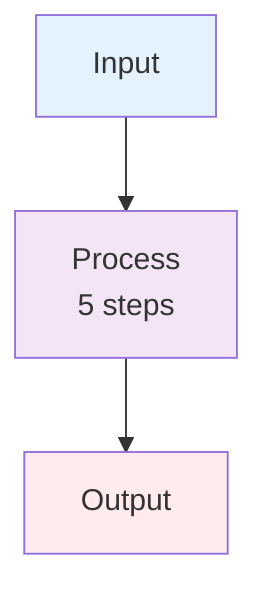

# ISWC Audit Documentation Standards

This document defines the standards and methodologies for creating documentation in the CISAC ISWC System Audit project.

## Index.md Files Policy

**All subfolders in `docs/` must have an `index.md` file for navigation.**

**Requirements:**

- **Very concise** - exist purely for navigation, not documentation
- **Structure:** Brief folder description (1-2 sentences) + simple list of main documents/contents
- **No excessive detail** - just enough to help users find what they need
- **No emojis** unless explicitly requested

**Example format:**

```markdown
# Folder Name

Brief description of folder purpose.

## Contents/Documents

- [Document Name](path) - Short description
- [Subfolder Name](subfolder/) - Short description
```

## Component Documentation Methodology

### /document-component Slash Command

**Purpose:** Create comprehensive technical documentation for ISWC system components by synthesizing specifications, meetings, and source code.

**Usage:**

```plaintext
/document-component COMPONENT_NAME="Databricks" FOCUS_AREAS="IPI processing workflow"
```

**Output:** `docs/work_in_progress/architecture/COMPONENT_NAME.md`

### Three-Phase Research Process (MANDATORY)

The command enforces a rigorous search methodology:

**Phase 1: Core Design Documents** (authoritative source of truth)

1. Initial search for component name
2. Extract aliases and related terms from findings
3. Extended search with all aliases

**Phase 2: Meeting Transcripts** (implementation context)

1. Initial search for component name
2. Extract informal names, problem descriptions, tech stack terms
3. Extended search with all aliases

**Phase 3: Source Code** (actual implementation)

1. Initial case-insensitive search
2. Extract class names, namespaces, config keys, API endpoints
3. Extended search with all code terms

**Phase 4: Synthesis**

- Read complete documents
- Extract quotes with proper attribution
- Flag contradictions with emojis (🔴 ⚠️ 🔍)
- Cross-reference all sources

**All search terms discovered must be documented in "Search Terms Used" section.**

## Required Document Structure

**Component documentation must include these 14 sections:**

1. Header Metadata (version, date, sources, search terms)
2. Overview
3. Primary Purpose
4. Technical Architecture
5. How It Works (with Mermaid diagrams)
6. File/Data Formats
7. Integration with Other Components
8. Use Cases
9. Workflow Details
10. **Source Code References** (MANDATORY - all implementation files)
11. Questions for Further Investigation
12. References (core docs, meetings, architecture diagrams)
13. Document History (version table)
14. Known Gaps and Contradictions (with emojis)

## Citation Formats

### Core Design Document Citation

```markdown
> **From [IPI Integration Spec](../../resources/core_design_documents/SPE_20191001_ISWC_IPI_Integration/SPE_20191001_ISWC_IPI_Integration.md) → Section 3.4 "File Processing":** "Quote text"
```

### Meeting Transcript Citation

```markdown
> **From [Workshop 2](../../meetings/20251021-ISWC%20Audit%20-%20Workshop%202.txt) (1:18:19, Mark Stadler):** "Quote text"
```

### Reference Entry Format

```markdown
- **[Doc Name](path) → Section X.Y "Section Title"** - Description
- **[Meeting Name](path) (Timestamp, Speaker)** - What was discussed
```

## Citation Rules

- **Core design docs** = authoritative source of truth
- **Meeting transcripts** = implementation context only
- **Source code** = actual implementation reality
- Always use document links + section breadcrumbs (NOT line numbers)
- Include speaker name and timestamp for meeting quotes

## Diagram Guidelines

**Prefer Mermaid flowcharts** over ASCII art:

- Keep diagrams simple and clean
- Split complex diagrams into multiple views
- Use consistent color coding
- Add subsection titles ("High-Level Workflow", "Detailed Steps")
- For complex processes: show high-level diagram with hint text (e.g., "6 steps"), then list steps in numbered text

**Example:**



Then explain "5 steps" in numbered list below.

## Source Code Analysis

### Technology Stack

- **Frontend:** React 16.12.0 + TypeScript 3.7.3 + Redux 4.0.4
- **Backend:** ASP.NET Core 3.1 (EOL Dec 2022 - flag as technical debt)
- **Data Processing:** Azure Databricks 10.4 LTS (outdated - flag as technical debt)
- **Databases:** Azure SQL Server + Cosmos DB (MongoDB API)
- **Integration:** Matching Engine (external Spanish Point product - REST API)

### Key Search Patterns

Use these glob patterns when searching the codebase:

- **Controllers:** `*Controller.cs`
- **Services:** `*Service.cs`, `I*Service.cs`
- **Repositories:** `*Repository.cs`, `IRepository<T>`
- **Clients:** `*Client.cs` (HTTP integrations)
- **Notebooks:** `*.ipynb`, `*.py` (Databricks)
- **Pipelines:** `deployment/DataFactory/pipeline/*.json`

### Integration Documentation Checklist

When documenting integrations between components:

- Identify HTTP clients and endpoints
- Note authentication patterns (OAuth2, JWT, SOAP)
- Document retry policies (Polly)
- Flag synchronous blocking calls (performance coupling)
- Map data flow between components

## Quality Checklist

Before finalizing any documentation:

- [ ] Lint-clean markdown (blank lines around lists)
- [ ] All sources cited with proper format
- [ ] Contradictions flagged with emojis
- [ ] Mermaid diagrams simple and clean
- [ ] Cross-references use markdown links
- [ ] Technical details specific (no vague descriptions)

## Adding New Architecture Documents

Process for creating component documentation:

1. Use `/document-component` slash command
2. Follow 3-phase search process (core docs → meetings → source code)
3. Document all search terms discovered
4. Include mandatory Source Code References section
5. Flag contradictions with emojis
6. Update `docs/work_in_progress/architecture/index.md`
