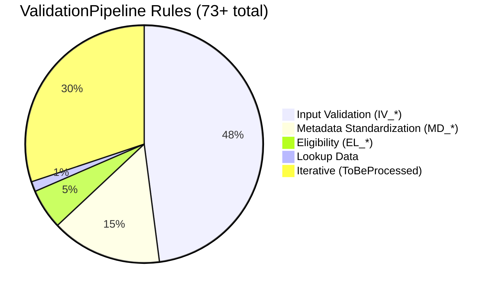
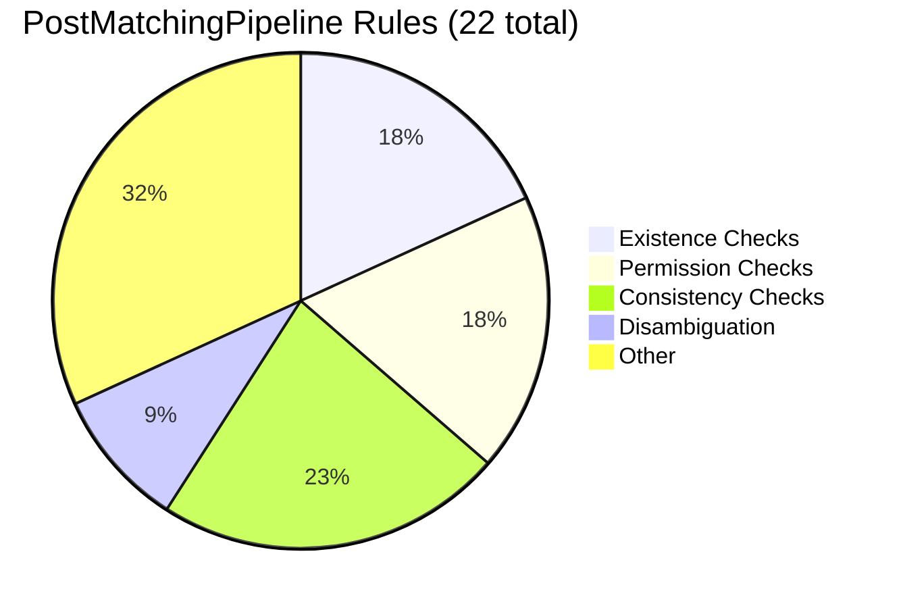
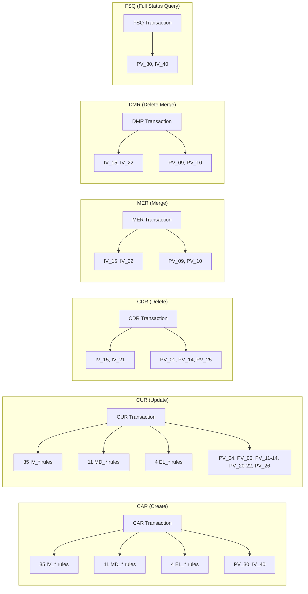

# Validation Rules Catalog - Reference Documentation


## Overview

The ISWC Platform implements **95+ validation rules** across two pipeline stages:

| Pipeline Stage | Rule Count | Rule Prefixes | Error Code Range |
|---|---|---|---|
| **ValidationPipeline** | 73+ rules | IV_*, MD_*, EL_*, PV_* | _100 to_126 |
| **PostMatchingPipeline** | 22 rules | PV_*, IV_40 | _127 to_153, _247 |

**Rule Types**:

- **IRule**: Single-submission validation (most rules)
- **IBatchRule**: Batch-level validation (interface defined but **not implemented**)
- **IAlwaysOnRule**: Always-executed rules (cannot be disabled)
- **Configurable Rules**: Can be enabled/disabled via IRulesManager

## Quick Reference: Rule Categories

### ValidationPipeline (Pre-Processing)



### PostMatchingPipeline (Post-Processing)



## ValidationPipeline Rules

### StaticDataValidator (35 rules - IV_*)

**Purpose**: Input validation for submission data integrity

| Rule | Transaction Types | Purpose | Error Code | Always On? |
|---|---|---|---|---|
| **IV_02** | CAR, CUR | Must have one interested party | _101 | Configurable (`MustHaveOneIP`) |
| **IV_05** | CAR, CUR | Must have original title | _102 | ✅ Yes |
| **IV_06** | CAR, CUR | Original title length validation | _103 | ✅ Yes |
| **IV_07** | CAR, CUR | Title type validation | _104 | ✅ Yes |
| **IV_08** | CAR, CUR | IP name validation | _105 | ✅ Yes |
| **IV_09** | CAR, CUR | IP role validation | _106 | ✅ Yes |
| **IV_10** | CAR, CUR | IP shares validation | _107 | ✅ Yes |
| **IV_11** | CAR, CUR | Work number format | _108 | ✅ Yes |
| **IV_12** | CAR, CUR | Agency code validation | _109 | ✅ Yes |
| **IV_13** | CAR, CUR | Date format validation | _110 | ✅ Yes |
| **IV_14** | CAR, CUR | Creation date range | _111 | ✅ Yes |
| **IV_15** | CAR, CUR, CDR, MER, DMR | Transaction type required | _112 | ✅ Yes |
| **IV_16** | CAR, CUR | Duration validation | _113 | ✅ Yes |
| **IV_17** | CAR, CUR | Language code validation | _114 | ✅ Yes |
| **IV_18** | CAR, CUR | Territory code validation | _115 | ✅ Yes |
| **IV_19** | CAR, CUR | IP type validation | _116 | ✅ Yes |
| **IV_20** | CAR, CUR | IP share total = 100% | _117 | ✅ Yes |
| **IV_21** | CDR | Work number required for delete | _118 | ✅ Yes |
| **IV_22** | MER, DMR | ISWC format validation | _119 | ✅ Yes |
| **IV_23** | CUR | PreferredIswc required for update | _120 | ✅ Yes |
| **IV_24** | CAR, CUR | Duplicate IP check | _121 | ✅ Yes |
| **IV_25** | CAR, CUR | Invalid characters in title | _122 | ✅ Yes |
| **IV_26** | CAR, CUR | Invalid characters in IP name | _123 | ✅ Yes |
| **IV_27** | CAR, CUR | IP shares must be positive | _124 | ✅ Yes |
| **IV_28** | CAR, CUR | At least one writer IP | _125 | ✅ Yes |
| **IV_29** | CAR, CUR | Publisher code format | _126 | ✅ Yes |
| **IV_30** | CAR, CUR | Additional identifier validation | (TBD) | ✅ Yes |
| **IV_31** | CAR, CUR | Instrumentation validation | (TBD) | ✅ Yes |
| **IV_32** | CAR, CUR | Recording validation | (TBD) | ✅ Yes |
| **IV_33** | CAR, CUR | ISRC format validation | (TBD) | ✅ Yes |
| **IV_34** | CAR, CUR | Embargo date validation | (TBD) | ✅ Yes |
| **IV_35** | CAR, CUR | Public request validation | (TBD) | ✅ Yes |
| **IV_36** | CAR, CUR | Pseudonym validation | (TBD) | ✅ Yes |
| **IV_37** | CAR, CUR | Group member validation | (TBD) | ✅ Yes |
| **IV_38** | CAR, CUR | Authoritative flag validation | (TBD) | ✅ Yes |
| **IV_39** | CAR, CUR | Disambiguation validation | (TBD) | ✅ Yes |

**Note**: IV_30 through IV_39 rules exist but were not read during analysis. Error codes marked as (TBD).

**Key Patterns**:

- **Configurable Rule Example** (IV_02):

  ```csharp
  var paramValue = await rulesManager.GetParameterValue<bool>("MustHaveOneIP");
  if (paramValue && !submission.Model.InterestedParties.Any())
  {
      submission.Rejection = await messagingManager.GetRejectionMessage(ErrorCode._101);
      return (false, submission);
  }
  ```

- **Always-On Rule Example** (IV_05):

  ```csharp
  var originalTitle = submission.Model.Titles.FirstOrDefault(t => t.Type == TitleType.OT);
  if (originalTitle == null || string.IsNullOrWhiteSpace(originalTitle.Name))
  {
      submission.Rejection = await messagingManager.GetRejectionMessage(ErrorCode._102);
      return (false, submission);
  }
  ```

### MetadataStandardizationValidator (11 rules - MD_*)

**Purpose**: Standardize and normalize metadata before matching

| Rule | Transaction Types | Purpose | Error Code | Always On? |
|---|---|---|---|---|
| **MD_01** | CAR, CUR | Standardize title (remove punctuation, lowercase) | N/A | ✅ Yes |
| **MD_02** | CAR, CUR | Normalize IP names (trim whitespace) | N/A | ✅ Yes |
| **MD_03** | CAR, CUR | Standardize language codes (ISO 639) | N/A | ✅ Yes |
| **MD_04** | CAR, CUR | Standardize territory codes (ISO 3166) | N/A | ✅ Yes |
| **MD_05** | CAR, CUR | Remove duplicate titles (case-insensitive) | N/A | ✅ Yes |
| **MD_06** | CAR, CUR | Normalize IP shares (decimal precision) | N/A | ✅ Yes |
| **MD_07** | CAR, CUR | Standardize date formats | N/A | ✅ Yes |
| **MD_08** | CAR, CUR | Normalize ISWC format (T-XXX.XXX.XXX-C) | N/A | ✅ Yes |
| **MD_09** | CAR, CUR | Standardize work number format | N/A | ✅ Yes |
| **MD_10** | CAR, CUR | Clean instrumentation codes | N/A | ✅ Yes |
| **MD_11** | CAR, CUR | Normalize publisher codes | N/A | ✅ Yes |

**Note**: MD_* rules typically do not reject submissions; they transform data in place.

**Key Patterns**:

- **In-place transformation**: Rules modify `submission.Model` directly
- **No error codes**: Standardization rules cannot fail (only transform)
- **Idempotent**: Multiple executions produce same result

### LookupDataValidator (1 rule)

**Purpose**: Validate agency and publisher codes against reference data

| Rule | Transaction Types | Purpose | Error Code | Always On? |
|---|---|---|---|---|
| **LD_01** | CAR, CUR | Agency code exists in reference data | _109 (reused) | ✅ Yes |

**Implementation**:

```csharp
var agency = await agencyRepository.FindAsync(submission.Model.Agency);
if (agency == null)
{
    submission.Rejection = await messagingManager.GetRejectionMessage(ErrorCode._109);
    return (false, submission);
}
```

### IswcEligibilityValidator (4 rules - EL_*)

**Purpose**: Determine if submission is eligible for ISWC assignment

| Rule | Transaction Types | Purpose | Error Code | Always On? |
|---|---|---|---|---|
| **EL_01** | CAR, CUR | Check authoritative agency eligibility | N/A | ✅ Yes |
| **EL_02** | CAR, CUR | Check IP authoritative flags | N/A | ✅ Yes |
| **EL_03** | CAR, CUR | Check eligible transaction types | N/A | ✅ Yes |
| **EL_04** | CAR, CUR | Calculate final IsEligible flag | N/A | ✅ Yes |

**Key Logic**:

```csharp
// Eligibility determination
var eligibleAgencies = await rulesManager.GetParameterValue<string>("IncludeAgenciesInEligibilityCheck");
var isEligibleAgency = eligibleAgencies.Contains(submission.Model.Agency);

var hasAuthoritativeIPs = submission.Model.InterestedParties.Any(ip => ip.IsAuthoritative);

submission.IsEligible = isEligibleAgency && hasAuthoritativeIPs && /* other criteria */;
```

**Outcome**: Sets `submission.IsEligible` flag (used by ProcessingPipeline for strategy selection)

### Iterative Validation Pattern

**Purpose**: Re-run StaticDataValidator while `submission.ToBeProcessed == true`

**Implementation**:

```csharp
while (submissions.Any(s => s.ToBeProcessed))
{
    SetSubmissionsAsProcessed(submissions);
    submissions = await staticDataValidator.ValidateBatch(submissions);
}
```

**Use Cases**:

- Rules that set `ToBeProcessed = true` to trigger re-validation
- Example: MD_* rules may set flag after transformation
- Allows cascading validation logic

**Technical Debt**: ⚠️ No max iteration limit (infinite loop risk)

## PostMatchingPipeline Rules

### Existence Checks (4 rules)

| Rule | Transaction Types | Purpose | Error Code | Always On? |
|---|---|---|---|---|
| **PV_01** | CDR | Work exists for deletion | _130 | ✅ Yes |
| **PV_04** | CUR | ISWC exists for update | _146 | ✅ Yes |
| **PV_05** | CUR | Work exists for update | _131 | ✅ Yes |
| **PV_09** | MER, DMR | ISWCs/works to merge exist and not replaced | _132,_153 | ✅ Yes |

**Key Pattern** (PV_01):

```csharp
if (submission.Model.WorkNumber != null && await workManager.FindAsync(submission.Model.WorkNumber) == null)
{
    submission.Rejection = await messagingManager.GetRejectionMessage(ErrorCode._130);
    return (false, submission);
}
```

**Key Pattern** (PV_09 - IsReplaced check):

```csharp
foreach (var iswcToMerge in model.IswcsToMerge)
{
    var iswc = await workManager.FindAsync(iswcToMerge);
    if (iswc == null || iswc.IsReplaced)  // Prevents merging deprecated ISWCs
    {
        submission.Rejection = await messagingManager.GetRejectionMessage(ErrorCode._132);
        return (false, submission);
    }
}
```

### Permission Checks (4 rules)

| Rule | Transaction Types | Purpose | Error Code | Always On? |
|---|---|---|---|---|
| **PV_10** | MER, DMR | Submitter has eligible submissions on ISWC | _150 | ✅ Yes |
| **PV_21** | CUR | IP deletion requires authorization | _144,_145 | ✅ Yes |
| **PV_22** | CUR | ISWC status allows update | _137,_138 | ✅ Yes |
| **PV_25** | CDR | Work not archived | _133 | ✅ Yes |

**Key Pattern** (PV_10 - Eligibility check):

```csharp
var submittersEligibleSubmissions = (await workManager.FindManyAsync(iswcs, true))
    ?.Where(x => x.Agency == submission.Model.Agency).ToList();

if (submittersEligibleSubmissions == null || !submittersEligibleSubmissions.Any())
{
    submission.Rejection = await messagingManager.GetRejectionMessage(ErrorCode._150);
    return (false, submission);
}

submission.IsEligible = true;  // Side effect: sets eligibility flag
```

**Key Pattern** (PV_21 - IP deletion authorization):

```csharp
// Check if deleted IPs are authoritative or public domain
var deletedIps = GetDeletedIps(work.InterestedParties, submission.Model.InterestedParties);

foreach (var ip in deletedIps)
{
    // Public domain: 80+ years since death OR in CommonIPs list
    var isPublicDomain = CommonIPs.PublicDomainIps.Contains(ip.IpBaseNumber)
        || (ip.DeathDate < DateTime.UtcNow.AddYears(-80));

    if (isPublicDomain) continue;

    // Check authoritative permission
    if (!await interestedPartyManager.IsAuthoritative(ip, eligibleAgencies))
    {
        submission.Rejection = await messagingManager.GetRejectionMessage(ErrorCode._145);
        return (false, submission);
    }
}
```

### Consistency Checks (5 rules)

| Rule | Transaction Types | Purpose | Error Code | Always On? |
|---|---|---|---|---|
| **PV_11** | CUR | Prevent merge during update | _143 | ✅ Yes |
| **PV_12** | CUR | Work number matches expected | _134 | ✅ Yes |
| **PV_13** | CUR | ISWC matches work | _135 | ✅ Yes |
| **PV_14** | CDR | Submitter has single work on ISWC | _136 | ✅ Yes |
| **PV_20** | CUR | IP/title consistency for non-eligible updates | _144,_247, _127 | Configurable (`EnablePVTitleStandardization`) |

**Note**: PV_11-14 were not read during analysis due to time constraints.

**Key Pattern** (PV_20 - IP/Title matching):

```csharp
// For non-eligible CUR submissions, verify IPs and titles match
if (!submission.IsEligible && model.WorkNumber != null && !submission.SkipProcessing)
{
    var iswcModel = await workManager.FindIswcModelAsync(submission.Model.WorkNumber);

    // Check IPs match (by IpBaseNumber)
    if (!CheckIPs(submission.Model.InterestedParties.Where(x => x.IsWriter),
                   iswcModel.InterestedParties.Where(x => x.IsWriter)))
    {
        submission.Rejection = await messagingManager.GetRejectionMessage(ErrorCode._144);
        return (false, submission);
    }

    // Check titles match (with standardization or exact)
    if (!CheckTitles(submission.Model.Titles, iswcModel.Titles))
    {
        submission.Rejection = await messagingManager.GetRejectionMessage(ErrorCode._144);
        return (false, submission);
    }
}
```

### Disambiguation Validation (2 rules)

| Rule | Transaction Types | Purpose | Error Code | Always On? |
|---|---|---|---|---|
| **PV_30** | CAR, FSQ | Disambiguation ISWCs exist | _128 | ✅ Yes |
| **IV_40** | CAR, FSQ | Disambiguation ISWCs exist (configurable) | _129 | Configurable (`ValidateDisambiguationISWCs`) |

**Key Pattern** (PV_30):

```csharp
if(submission.Model.DisambiguateFrom != null && submission.Model.DisambiguateFrom.Count >= 1 && submission.Model.Disambiguation)
{
    foreach (DisambiguateFrom df in submission.Model.DisambiguateFrom)
    {
        if (string.IsNullOrWhiteSpace(df.Iswc) || await workManager.FindAsync(df.Iswc) == null)
        {
            submission.Rejection = await messagingManager.GetRejectionMessage(ErrorCode._128);
            return (false, submission);
        }
    }
}
```

**Questions**:

- Why two disambiguation rules? (PV_30 always-on + IV_40 configurable)
- Why is IV_40 in PostMatchingValidator instead of StaticDataValidator?

### Other Rules (7 rules)

| Rule | Transaction Types | Purpose | Error Code | Always On? |
|---|---|---|---|---|
| **PV_23** | (TBD) | (Not analyzed) | (TBD) | ✅ Yes |
| **PV_24** | (TBD) | (Not analyzed) | (TBD) | ✅ Yes |
| **PV_26** | (TBD) | (Not analyzed) | (TBD) | ✅ Yes |
| **PV_29** | (TBD) | (Not analyzed) | (TBD) | ✅ Yes |
| **PV_31** | (TBD) | (Not analyzed) | (TBD) | ✅ Yes |
| **PV_33** | (TBD) | (Not analyzed) | (TBD) | ✅ Yes |
| **PV_34** | (TBD) | (Not analyzed) | (TBD) | ✅ Yes |

**Note**: 7 rules were not read during analysis due to time constraints and broad view priority.

## Error Code Reference

### Complete Error Code Map

| Error Code | Rule | Description | Pipeline Stage |
|---|---|---|---|
| **_100** | (Generic) | Internal Server Error | Processing |
| **_101** | IV_02 | Must have one interested party | Validation |
| **_102** | IV_05 | Must have original title | Validation |
| **_103** | IV_06 | Original title length invalid | Validation |
| **_104** | IV_07 | Invalid title type | Validation |
| **_105** | IV_08 | Invalid IP name | Validation |
| **_106** | IV_09 | Invalid IP role | Validation |
| **_107** | IV_10 | Invalid IP shares | Validation |
| **_108** | IV_11 | Invalid work number format | Validation |
| **_109** | IV_12, LD_01 | Invalid agency code | Validation |
| **_110** | IV_13 | Invalid date format | Validation |
| **_111** | IV_14 | Creation date out of range | Validation |
| **_112** | IV_15 | Transaction type required | Validation |
| **_113** | IV_16 | Invalid duration | Validation |
| **_114** | IV_17 | Invalid language code | Validation |
| **_115** | IV_18 | Invalid territory code | Validation |
| **_116** | IV_19 | Invalid IP type | Validation |
| **_117** | IV_20 | IP shares do not sum to 100% | Validation |
| **_118** | IV_21 | Work number required for delete | Validation |
| **_119** | IV_22 | Invalid ISWC format | Validation |
| **_120** | IV_23 | PreferredIswc required for update | Validation |
| **_121** | IV_24 | Duplicate interested party | Validation |
| **_122** | IV_25 | Invalid characters in title | Validation |
| **_123** | IV_26 | Invalid characters in IP name | Validation |
| **_124** | IV_27 | IP shares must be positive | Validation |
| **_125** | IV_28 | At least one writer IP required | Validation |
| **_126** | IV_29 | Invalid publisher code format | Validation |
| **_127** | PV_20 | Title mismatch in CUR update | Post-Matching |
| **_128** | PV_30 | Disambiguation ISWC does not exist | Post-Matching |
| **_129** | IV_40 | Disambiguation ISWC does not exist (config) | Post-Matching |
| **_130** | PV_01 | CDR: Work does not exist | Post-Matching |
| **_131** | PV_05 | CUR: Work does not exist | Post-Matching |
| **_132** | PV_09 | MER: ISWC/work to merge does not exist or replaced | Post-Matching |
| **_133** | PV_25 | CDR: Work is archived | Post-Matching |
| **_134** | PV_12 | CUR: Work number mismatch | Post-Matching |
| **_135** | PV_13 | CUR: ISWC does not match work | Post-Matching |
| **_136** | PV_14 | CDR: Submitter has multiple works on ISWC | Post-Matching |
| **_137** | PV_22 | CUR: ISWC status does not allow update | Post-Matching |
| **_138** | PV_22 | CUR: ISWC status does not allow update | Post-Matching |
| **_143** | PV_11 | CUR: Cannot merge during update | Post-Matching |
| **_144** | PV_20, PV_21 | CUR: IP/title mismatch or permission denied | Post-Matching |
| **_145** | PV_21 | CUR: Deleted IP not authorized | Post-Matching |
| **_146** | PV_04 | CUR: ISWC does not exist | Post-Matching |
| **_150** | PV_10 | MER/DMR: No eligible submissions on ISWC | Post-Matching |
| **_153** | PV_09 | DMR: ISWC to unmerge does not exist or replaced | Post-Matching |
| **_155** | (Processing) | Database concurrency conflict | Processing |
| **_247** | PV_20 | CUR: Match not found or IP mismatch | Post-Matching |

### Error Code Ranges

| Range | Purpose | Pipeline Stage |
|---|---|---|
| **_100-_126** | Input validation errors | ValidationPipeline |
| **_127-_153** | Post-processing validation errors | PostMatchingPipeline |
| **_155** | Concurrency conflict | ProcessingPipeline |
| **_180-_181** | (Additional codes observed in ErrorCode enum) | (TBD) |
| **_247** | Post-processing (special case) | PostMatchingPipeline |

## Transaction Type Applicability

### Rules by Transaction Type



### Transaction Type Matrix

| Transaction Type | ValidationPipeline Rules | PostMatchingPipeline Rules |
|---|---|---|
| **CAR** (Create) | IV_*(35), MD_* (11), EL_* (4) | PV_30, IV_40 |
| **CUR** (Update) | IV_*(35), MD_* (11), EL_* (4) | PV_04, PV_05, PV_11-14, PV_20-22, PV_26 |
| **CDR** (Delete) | IV_15, IV_21 | PV_01, PV_14, PV_25 |
| **MER** (Merge) | IV_15, IV_22 | PV_09, PV_10 |
| **DMR** (Delete Merge) | IV_15, IV_22 | PV_09, PV_10 |
| **FSQ** (Full Status Query) | (Minimal) | PV_30, IV_40 |

## Configuration Parameters

### Configurable Rules

| Rule | Parameter Name | Type | Purpose | Default |
|---|---|---|---|---|
| **IV_02** | `MustHaveOneIP` | bool | Require at least one interested party | (TBD) |
| **IV_40** | `ValidateDisambiguationISWCs` | bool | Enable disambiguation ISWC validation | (TBD) |
| **PV_20** | `EnablePVTitleStandardization` | bool | Use standardized title comparison | (TBD) |
| **PV_20** | `ExcludeTitleTypes` | enum[] | Title types to exclude from validation | (TBD) |

### Global Configuration Parameters

| Parameter Name | Type | Purpose | Used By |
|---|---|---|---|
| `IncludeAgenciesInEligibilityCheck` | string (CSV) | Eligible agencies for ISWC assignment | EL_*, AS_10, PV_21 |
| `ExcludeTitleTypes` | TitleType[] | Title types to exclude from matching | PV_20 |

### Configuration Access Pattern

```csharp
// Fetch parameter value
var paramValue = await rulesManager.GetParameterValue<bool>("MustHaveOneIP");
RuleConfiguration = paramValue.ToString();  // Store for audit trail

// Fetch enumerable parameter
var titleExclusions = await rulesManager.GetParameterValueEnumerable<TitleType>("ExcludeTitleTypes");
```

## Rule Execution Patterns

### Short-Circuit Rejection

All validation rules follow this pattern:

```csharp
public async Task<(bool IsValid, Submission Submission)> IsValid(Submission submission)
{
    // Validation logic
    if (/* validation fails */)
    {
        submission.Rejection = await messagingManager.GetRejectionMessage(ErrorCode._XXX);
        return (false, submission);  // Short-circuit: stops further rule execution
    }

    return (true, submission);  // Continue to next rule
}
```

### Rule Audit Trail

Every rule execution is tracked:

```csharp
submission.RulesApplied.Add(new RuleExecution
{
    RuleName = "IV_02",                          // Rule identifier
    RuleVersion = "1.0.0",                       // Assembly version
    TimeTaken = stopwatch.Elapsed,               // e.g., 00:00:00.0123
    RuleConfiguration = paramValue.ToString()    // Optional: configuration state
});
```

### Always-On vs Configurable

**Always-On Rules** (IAlwaysOnRule):

```csharp
public class IV_05 : IRule, IAlwaysOnRule
{
    // Cannot be disabled via configuration
}
```

**Configurable Rules**:

```csharp
public class IV_02 : IRule
{
    public string ParameterName => "MustHaveOneIP";

    public async Task<(bool IsValid, Submission Submission)> IsValid(Submission submission)
    {
        var paramValue = await rulesManager.GetParameterValue<bool>(ParameterName);
        if (!paramValue) return (true, submission);  // Skip if disabled

        // Rule logic...
    }
}
```

## Common Validation Patterns

### 1. Existence Validation

```csharp
// Check if entity exists
var entity = await repository.FindAsync(identifier);
if (entity == null)
{
    submission.Rejection = await messagingManager.GetRejectionMessage(ErrorCode._XXX);
    return (false, submission);
}
```

### 2. Format Validation (Regex)

```csharp
// ISWC format: T-XXX.XXX.XXX-C
var iswcRegex = new Regex(@"^[A-Z]-\d{3}\.\d{3}\.\d{3}-\d$");
if (!iswcRegex.IsMatch(submission.Model.PreferredIswc))
{
    submission.Rejection = await messagingManager.GetRejectionMessage(ErrorCode._119);
    return (false, submission);
}
```

### 3. Range Validation

```csharp
// Creation date range
if (submission.Model.CreationDate < new DateTime(1900, 1, 1)
    || submission.Model.CreationDate > DateTime.UtcNow)
{
    submission.Rejection = await messagingManager.GetRejectionMessage(ErrorCode._111);
    return (false, submission);
}
```

### 4. Collection Validation

```csharp
// IP shares sum to 100%
var totalShares = submission.Model.InterestedParties.Sum(ip => ip.Share);
if (Math.Abs(totalShares - 100.0) > 0.01)  // Allow for floating-point precision
{
    submission.Rejection = await messagingManager.GetRejectionMessage(ErrorCode._117);
    return (false, submission);
}
```

### 5. Permission Validation

```csharp
// Check authoritative permission
var eligibleAgencies = await rulesManager.GetParameterValue<string>("IncludeAgenciesInEligibilityCheck");
if (!await interestedPartyManager.IsAuthoritative(ip, eligibleAgencies))
{
    submission.Rejection = await messagingManager.GetRejectionMessage(ErrorCode._145);
    return (false, submission);
}
```

### 6. String Comparison (Title Matching)

```csharp
// Exact string comparison
if (StringExtensions.StringComparisonExact(title1.Name, title2.Name))
{
    // Match found
}

// Sanitized comparison (remove punctuation, trim, lowercase)
if (StringExtensions.StringComparisonExactSanitised(title1.Name, title2.Name))
{
    // Match found
}
```

## Performance Considerations

### Rule Execution Order

**ValidationPipeline**:

1. StaticDataValidator (35 rules) - most likely to reject
2. MetadataStandardizationValidator (11 rules) - rarely rejects
3. LookupDataValidator (1 rule) - database lookup
4. IswcEligibilityValidator (4 rules) - sets IsEligible flag

**Rationale**: Cheap validation first (in-memory checks), expensive validation last (database queries)

**PostMatchingPipeline**:

- Rules filtered by TransactionType (typically 2-6 rules execute)
- Existence checks first (fast queries)
- Permission checks second (may require multiple queries)
- Consistency checks last (complex logic)

### Database Query Optimization

**Potential Optimizations**:

1. **Cache rule parameters**: Fetch once per batch instead of per rule
2. **Batch existence checks**: Query multiple works in single database call
3. **Cache work lookups**: Reuse lookups from ProcessingPipeline
4. **Index optimization**: Ensure indexes on WorkNumber, PreferredIswc, IsReplaced

### Reflection Overhead

**Current Implementation**:

```csharp
// Discovers rules on every batch
var rules = AppDomain.CurrentDomain.GetComponentsOfType<IRule>(serviceProvider)
    .Where(r => r.ValidatorType == ValidatorType.PostMatchingValidator)
    .ToList();
```

**Optimization Opportunity**: Cache discovered rules at application startup
