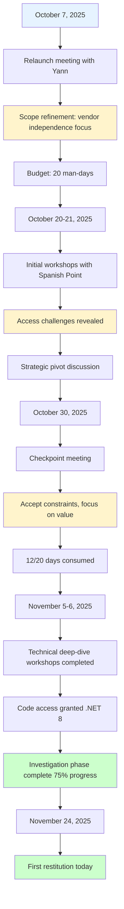

# Part 1: The Journey (5 min, Slides 1-3)

[← Back to Index](../index.md) | [Next: Part 2 - Executive Summary →](part2-executive-summary.md)

## Slide 1: Title Slide

**Visual:** CISAC logo, audit team branding

```text
ISWC System Audit
First Conclusions & Strategic Recommendations

Teragone-Factory
Guillaume Jay & Bastien Gallay

November 24, 2025
```

**Speaker Notes:**

Good morning/afternoon. Thank you for your time today. Over the past six weeks, we've conducted a comprehensive audit of your ISWC system. What started as a technical assessment evolved into something much more strategic - an evaluation of vendor independence and governance.

Today we'll share what we found, what it means, and most importantly, what we recommend CISAC do next.

---

## Slide 2: The Audit Journey - How We Got Here

**Visual:** Timeline infographic with key milestones



**Key Statistics:**

| Metric | Value |
|--------|-------|
| **Budget** | 20 man-days (12 investigation, 8 synthesis) |
| **Workshops** | 6+ sessions with Spanish Point |
| **Azure Resources** | 343 resources analyzed |
| **Code Review** | 42+ files (Matching Engine integration) |
| **Documentation** | 95+ validation rules documented |

**Speaker Notes:**

<details>
<summary>ASCII Timeline (fallback)</summary>

```text
The Audit Evolution

October 7, 2025
├─ Relaunch meeting with Yann
├─ Scope refinement: vendor independence focus
└─ Budget: 20 man-days

October 20-21, 2025
├─ Initial workshops with Spanish Point
├─ Access challenges revealed
└─ Strategic pivot discussion

October 30, 2025
├─ Checkpoint meeting
├─ Accept constraints, focus on value
└─ 12/20 days consumed

November 5-6, 2025
├─ Technical deep-dive workshops completed
├─ Code access granted (.NET 8)
└─ Investigation phase complete (75% progress)

November 24, 2025
└─ First restitution (today)
```

</details>

Our audit journey has been revealing. We started October 7 with what seemed like a straightforward technical assessment - validate the infrastructure upgrade proposal, assess the architecture, identify technical debt.

But in our very first conversation with Yann, something became clear: the real question wasn't "is this system technically sound?" The question was "does CISAC control this system?"

**[Reference: docs/meetings/20251007-recadrage.md - Yann's strategic context]**

This shifted everything. By October 21, after our first workshops with Spanish Point, we had a frank discussion about what CISAC actually needs from this audit. Yann stated it directly:

> "Ma vision moyen terme, c'est de me passer de eux" - "My medium-term vision is to get rid of them."

**[Reference: docs/meetings/20251021-ISWC - Discussion Yann_Guillaume_Bastien.txt, Line 27:54]**

Not because the system is bad - but because CISAC cannot manage a strategic information system without control.

We spent 25% of our audit duration waiting for code access. We encountered systematic questions about "for what purpose?" when requesting information. We documented governance gaps and transparency issues.

On October 30, we made a strategic decision: accept the constraints we cannot change within this audit's scope, and focus on delivering maximum value with the access we have. We stopped trying to run the code locally (too time-intensive), and focused on static analysis, architecture documentation, and strategic assessment.

By November 6, we completed the investigation phase with high confidence in our findings. Today, we share those conclusions.

---

## Slide 3: The Strategic Pivot - What This Audit Became

**Visual:** Two-column comparison

| What We Were Asked To Do | What We Actually Discovered |
|--------------------------|------------------------------|
| ✓ Validate Hyperscale proposal | ⚠️ Cost control gap (€600K/year) |
| ✓ Assess architecture quality | ✓ Platform technically sound |
| ✓ Identify technical debt | ✓ Recently upgraded, well-maintained |
| ✓ Migration roadmap | ⚠️ Governance gaps are the real issue |
| | 🔴 Vendor independence unknown |
| | 🔴 Knowledge transfer HIGH RISK |

**Key Insight Box:**

> "The platform is solid. Control is the problem."

**Speaker Notes:**

<details>
<summary>ASCII Comparison (fallback)</summary>

```text
What We Were Asked To Do          →    What We Actually Discovered

✓ Validate Hyperscale proposal     →    ⚠️  Cost control gap (€600K/year)
✓ Assess architecture quality      →    ✓  Platform technically sound
✓ Identify technical debt          →    ✓  Recently upgraded, well-maintained
✓ Migration roadmap                →    ⚠️  Governance gaps are the real issue
                                   →    🔴 Vendor independence unknown
                                   →    🔴 Knowledge transfer HIGH RISK
```

</details>

Here's what we learned: the ISWC platform is technically sound. The architecture is well-designed. The code quality is reasonable. Auto-scaling is working correctly. Spanish Point upgraded you to .NET 8 just before this audit.

**These are not the problems.**

The problems are:

1. **Governance gaps** - A May 2024 production incident that took 6 months to recover from, caused by POC code accidentally merged to production. No deployment tracking existed until Yann established a CAB in response.

2. **Cost control gap** - €50,000/month cloud spending with no automated correlation between usage and costs. Financial stakeholders cannot explain monthly variations.

3. **Vendor transparency** - Systematic defensive posture, access requests questioned, information shared reluctantly.

4. **Knowledge transfer viability** - Unknown whether another vendor could maintain this system. Minimal code comments, significant duplication, "knowledge locked in people's heads."

5. **Vendor lock-in mechanisms** - Matching Engine (contractual restriction), IaC templates (proprietary library), implicit knowledge (no onboarding process).

**[Reference: Multiple sources - see Annex B for detailed quotes]**

This audit became an assessment of CISAC's ability to control its own strategic infrastructure. Everything we found must be evaluated through that lens.

**Discussion Prompt:** Does this evolution match CISAC's understanding of the situation?

---

[← Back to Index](../index.md) | [Next: Part 2 - Executive Summary →](part2-executive-summary.md)
