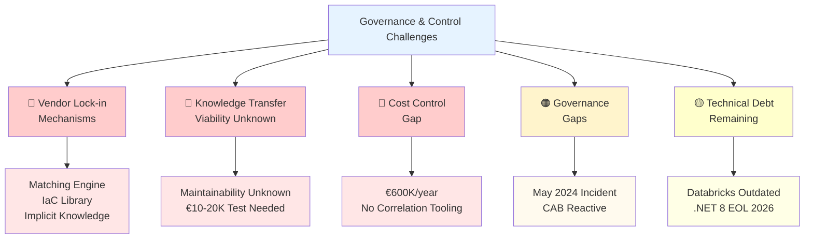
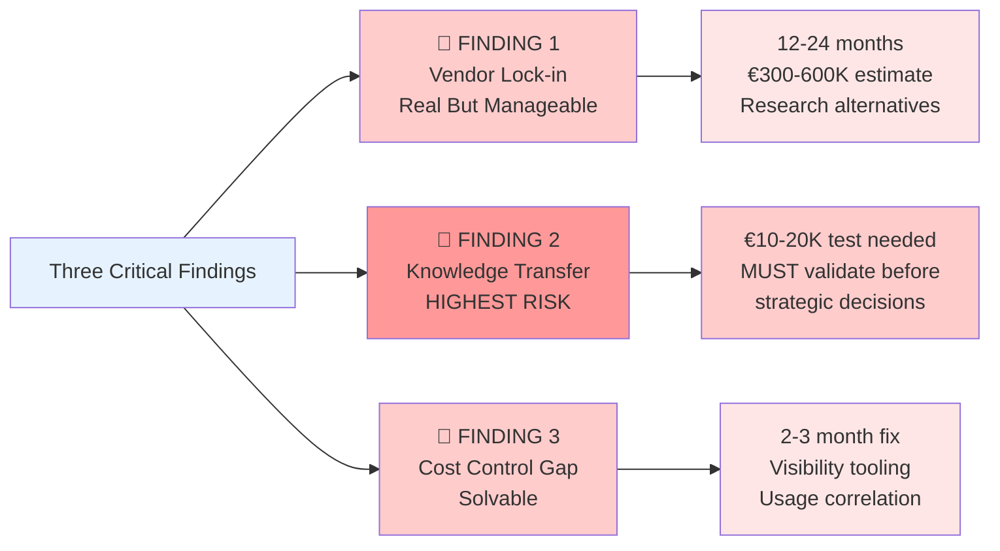

# PART 2: Executive Summary (5 min, Slides 4-6)

[← Back to Index](../index.md) | [← Part 1](part1-the-journey.md) | [Part 3 →](part3-technical-findings.md)

---

## PART 2: Executive Summary (5 min, Slides 4-6)

### Slide 4: The Good News - Platform Technically Sound

**Visual:** Green checkmarks with supporting evidence

| Category | Assessment |
|----------|------------|
| **Architecture** | ✅ Well-designed C4 architecture (12 containers, clean separation)<br/>✅ Matching Engine physically separated (REST API integration)<br/>✅ Azure-native services with industry-standard patterns |
| **Code Quality** | ✅ Well-structured, easy to navigate<br/>✅ Dependency injection, interface abstractions<br/>✅ Clean separation of concerns (Controllers, Services, Repositories) |
| **Recent Upgrades** | ✅ .NET 3.1 → .NET 8.0 (upgraded Nov 4, 2025)<br/>✅ React 16.12 → 18.3.1<br/>✅ TypeScript 3.7.3 → 5.6.3<br/>✅ Entity Framework 3.1 → 8.0<br/>✅ Security vulnerabilities addressed |
| **DevOps Maturity** | ✅ Fully automated CI/CD pipeline (20-30 min build + test + deploy)<br/>✅ 700+ automated tests<br/>✅ Multi-stage deployment (Dev → UAT → Production)<br/>✅ Auto-scaling functioning correctly (cost variations = feature, not bug) |
| **Performance** | ✅ No significant issues reported in past year<br/>✅ Auto-scaling handling load variations<br/>✅ Monitoring alerts configured (CPU >80% = email) |

**Speaker Notes:**

<details>
<summary>ASCII Platform Assessment (fallback)</summary>

```text
✅ Platform Quality Assessment

Architecture
  ✓ Well-designed C4 architecture (12 containers, clean separation)
  ✓ Matching Engine physically separated (REST API integration)
  ✓ Azure-native services with industry-standard patterns

Code Quality
  ✓ Well-structured, easy to navigate
  ✓ Dependency injection, interface abstractions
  ✓ Clean separation of concerns (Controllers, Services, Repositories)

Recent Upgrades
  ✓ .NET 3.1 → .NET 8.0 (upgraded Nov 4, 2025)
  ✓ React 16.12 → 18.3.1
  ✓ TypeScript 3.7.3 → 5.6.3
  ✓ Entity Framework 3.1 → 8.0
  ✓ Security vulnerabilities addressed

DevOps Maturity
  ✓ Fully automated CI/CD pipeline (20-30 min build + test + deploy)
  ✓ 700+ automated tests
  ✓ Multi-stage deployment (Dev → UAT → Production)
  ✓ Auto-scaling functioning correctly (cost variations = feature, not bug)

Performance
  ✓ No significant issues reported in past year
  ✓ Auto-scaling handling load variations
  ✓ Monitoring alerts configured (CPU >80% = email)
```

</details>

Let's start with the good news - and there's a lot of it.

**Architecture:** The system is well-architected. We documented the full C4 model - 12 containers with clear responsibilities, clean separation between components. The Matching Engine, despite being a lock-in concern, is properly separated via REST API (not embedded code). This is good engineering.

**[Reference: docs/work_in_progress/architecture/ - C4 models]**

**Code Quality:** When we finally got access to the code, our first impression was "not bad." The codebase is well-structured, easy to navigate. Bastien and Guillaume both noted it follows good practices - dependency injection, interface abstractions, proper layering.

**Recent Upgrades:** Spanish Point just upgraded the entire platform from .NET 3.1 (which went end-of-life in December 2022) to .NET 8. This is significant - they addressed a major technical debt item. React, TypeScript, Entity Framework all updated to modern versions. Security vulnerabilities from outdated packages addressed.

**[Reference: docs/work_in_progress/code_analysis/iswc-v2-upgrade-analysis-2025-11-04.md]**

**DevOps:** The CI/CD pipeline is fully automated. 700+ tests run on every build. Zero manual deployment steps. Build, test, package, deploy - one click per environment with approval gates. This is mature DevOps.

**[Reference: docs/meetings/20251105-[ISWC Audit]CI_CD Pipeline Deep Dive-transcript.txt]**

**Performance:** Spanish Point claims no significant performance issues in the past year. Auto-scaling is configured and working - the monthly cost variations we see are evidence of this (costs go down in December when usage drops, up in February when agencies upload more files).

**[Reference: docs/meetings/20251106-[ISWC Audit]Cloud Cost Breakdown ＆ Infrastructure Configuration-transcript.txt]**

**The platform works. It's well-built. It's recently upgraded. This is important context for everything that follows.**

---

### Slide 5: The Challenge - Where Control is Missing

**Visual:** Warning indicators with severity levels

| Priority | Challenge | Details |
|----------|-----------|---------|
| 🔴 **CRITICAL** | **Vendor Lock-in Mechanisms** | • Matching Engine source code (contractual restriction - only on termination)<br/>• IaC templates (proprietary Smart AIM library - not included in delivery)<br/>• Implicit knowledge (minimal comments, no onboarding process) |
| 🔴 **CRITICAL** | **Knowledge Transfer Viability Unknown** | • "Even for them, onboarding new developers must be hard"<br/>• Code duplication, minimal documentation<br/>• No local dev environment feasible within audit timeframe<br/>• ⚠️ Cannot confirm another vendor could maintain this |
| 🔴 **CRITICAL** | **Cost Control Gap** | • €600K/year spending (€50K/month average)<br/>• No automated correlation: usage metrics → Azure costs<br/>• Cannot explain monthly variations to stakeholders<br/>• "Noisy neighbor" agencies identified but no allocation model |
| 🟠 **HIGH** | **Governance Gaps** | • May 2024 production incident: 6 months recovery time<br/>• No deployment tracking pre-CAB (May 2024)<br/>• Definition of Done incomplete (docs not updated)<br/>• Transparency issues with vendor relationship |
| 🟡 **MEDIUM** | **Technical Debt Remaining** | • Databricks 10.4 LTS outdated (modern features missing)<br/>• .NET 8 support ends Nov 2026 (only 2 years)<br/>• Pipeline test runner blocked post-upgrade (workaround active)<br/>• Code duplication needs refactoring |



**Speaker Notes:**

<details>
<summary>ASCII Governance Challenges (fallback)</summary>

```text
⚠️  Governance & Control Challenges

🔴 CRITICAL: Vendor Lock-in Mechanisms
   • Matching Engine source code (contractual restriction - only on termination)
   • IaC templates (proprietary Smart AIM library - not included in delivery)
   • Implicit knowledge (minimal comments, no onboarding process)

🔴 CRITICAL: Knowledge Transfer Viability Unknown
   • "Even for them, onboarding new developers must be hard"
   • Code duplication, minimal documentation
   • No local dev environment feasible within audit timeframe
   • WARNING: Cannot confirm another vendor could maintain this

🔴 CRITICAL: Cost Control Gap
   • €600K/year spending (€50K/month average)
   • No automated correlation: usage metrics → Azure costs
   • Cannot explain monthly variations to stakeholders
   • "Noisy neighbor" agencies identified but no allocation model

🟠 HIGH: Governance Gaps
   • May 2024 production incident: 6 months recovery time
   • No deployment tracking pre-CAB (May 2024)
   • Definition of Done incomplete (docs not updated)
   • Transparency issues with vendor relationship

🟡 MEDIUM: Technical Debt Remaining
   • Databricks 10.4 LTS outdated (modern features missing)
   • .NET 8 support ends Nov 2026 (only 2 years)
   • Pipeline test runner blocked post-upgrade (workaround active)
   • Code duplication needs refactoring
```

</details>

Now the challenges. These are not technical failures - they are control gaps.

**Vendor Lock-in (CRITICAL):**

We identified three lock-in mechanisms:

1. **Matching Engine contractual restriction** - The source code is only accessible upon contract termination. This creates a catch-22: you cannot assess alternatives without leaving your current vendor. And as Yann noted, even if you got the code, "we wouldn't be able to maintain it ourselves."

   **[Reference: docs/meetings/20251030-Audit ISWC - Point de passage.txt]**

2. **IaC proprietary library** - The infrastructure-as-code templates and CI/CD pipeline definitions are NOT included in the source code delivery. Spanish Point considers these part of their "Smart AIM library." If you switch vendors, you must either (a) reverse-engineer 343 Azure resources from the portal, or (b) license the Smart AIM library for your new vendor.

   **[Reference: docs/meetings/20251105-[ISWC Audit]CI_CD Pipeline Deep Dive-transcript.txt]**

3. **Implicit knowledge** - Very little code commenting. Significant duplication. No onboarding process. Knowledge locked in developers' heads. Guillaume said it bluntly: "Even for them, onboarding new developers must be hard."

   **[Reference: docs/meetings/20251030-Audit ISWC - Point de passage.txt]**

**Knowledge Transfer Risk (CRITICAL):**

This is the biggest unknown. Can another vendor take over this system? We don't know. The code is readable but under-documented. The architecture is complex ("tentacular" dependencies). Spanish Point themselves warned us: "You're going to be surprised... it's actually very complicated."

**Before CISAC commits to any vendor switch strategy, this must be tested.** We recommend a pilot: assign a small feature to an independent vendor. See if they can deliver with only the handover materials available. This is a €10-20K litmus test for a multi-million-euro strategic decision.

**Cost Control Gap (CRITICAL):**

€600K/year is being spent with no automated correlation between usage and costs. When we asked Spanish Point if there's tooling to correlate monthly cost spikes with usage patterns, Xiyuan said: "Not really... there's no tooling."

**[Reference: docs/meetings/20251106-[ISWC Audit]Cloud Cost Breakdown ＆ Infrastructure Configuration-transcript.txt, Bastien question ~1:15:00]**

Cost investigations require manual support tickets. Spanish Point can dig into specific months, but logs are only kept 3 months. There's no proactive monitoring.

They acknowledged "noisy neighbor" agencies - a few agencies drive most of the costs - but no allocation model exists. All agencies pay flat rates regardless of usage.

**Governance Gaps (HIGH):**

The May-June 2024 production incident speaks volumes. POC code from an unrelated project was merged to the production branch and deployed. It took 6 months to recover. Yann's words: "Six mois de galère, d'incidents incessants" (six months of hell, incessant incidents).

**[Reference: docs/meetings/20251021-ISWC - Discussion Yann_Guillaume_Bastien.txt, Line 41:40]**

Why did this happen? Because there was no deployment tracking, no change control, no governance. Spanish Point "did everything when they wanted without even warning." Yann established the CAB in response - reactively, not proactively.

**[Reference: docs/meetings/20251021-ISWC - Discussion Yann_Guillaume_Bastien.txt, Line 11:00]**

The Definition of Done doesn't include documentation updates. Specs drift from implementation. Knowledge accumulates in people's heads instead of in shared artifacts.

**Discussion Prompt:** Which of these challenges resonates most with your experience?

---

### Slide 6: Three Critical Findings

**Visual:** Three colored boxes with icons

| Finding | Status | Impact | Key Unknown |
|---------|--------|--------|-------------|
| 🔴 **FINDING 1:**<br/>Vendor Lock-in is Real,<br/>But Manageable | Technically separated,<br/>contractually/organizationally<br/>coupled | Vendor switch =<br/>12-24 months,<br/>€300-600K<br/>(preliminary estimate) | Matching Engine<br/>alternatives exist? |
| 🔴 **FINDING 2:**<br/>Knowledge Transfer<br/>Viability is Unknown<br/>**(HIGHEST RISK)** | Cannot confirm<br/>maintainability by<br/>third party | Vendor switch may be<br/>infeasible regardless<br/>of technical quality | Can independent vendor<br/>deliver with available<br/>materials? |
| 🔴 **FINDING 3:**<br/>Cost Control Gap<br/>is Solvable | €600K/year with<br/>no correlation tooling | Cannot explain spending,<br/>cannot forecast,<br/>cannot optimize | What are the actual<br/>cost drivers<br/>month-to-month? |



**Bottom Banner:**

> "Technical quality is good. Governance and control are the gaps."

**Speaker Notes:**

<details>
<summary>ASCII Three Findings (fallback)</summary>

```text
🔴 FINDING 1: Vendor Lock-in is Real, But Manageable
   Status: Technically separated, contractually/organizationally coupled
   Impact: Vendor switch = 12-24 months, €300-600K (preliminary estimate)
   Key Unknown: Matching Engine alternatives exist?

🔴 FINDING 2: Knowledge Transfer Viability is Unknown (HIGHEST RISK)
   Status: Cannot confirm maintainability by third party
   Impact: Vendor switch may be infeasible regardless of technical quality
   Key Unknown: Can independent vendor deliver with available materials?

🔴 FINDING 3: Cost Control Gap is Solvable
   Status: €600K/year with no correlation tooling
   Impact: Cannot explain spending, cannot forecast, cannot optimize
   Key Unknown: What are the actual cost drivers month-to-month?
```

</details>

Let me synthesize this into three critical findings:

**Finding 1: Vendor lock-in is real, but manageable.**

The good news: the Matching Engine is physically separated via REST API. The application code is reasonably structured. A vendor switch is technically possible.

The bad news: it would take 12-24 months and cost an estimated €300-600K. These are preliminary numbers with LOW confidence - we need detailed vendor proposals to validate. The Matching Engine is contractually restricted. IaC must be rebuilt or licensed. Knowledge transfer is unproven.

The key unknown: Do alternative matching engines exist that could replace Spanish Point's solution? We haven't researched the market. This should be CISAC's next step - not to commit to switching, but to understand your options.

**Finding 2: Knowledge transfer viability is unknown - THIS IS THE HIGHEST RISK.**

Everything else we can estimate, analyze, plan for. But we cannot confirm whether another vendor could actually maintain this system.

The code is readable, yes. The architecture is documented, yes. But:

- Minimal code comments mean business logic is implicit
- Significant duplication increases cognitive load
- No local dev environment setup guide
- No "how to contribute" onboarding
- Spanish Point's own warning: "Many developers touched it and modified it"

**Before CISAC makes any strategic decision about vendor independence, you MUST test this.** Assign a small feature to an independent vendor. Give them the source code, documentation, and a feature spec. See if they can deliver. See what questions they ask. See how Spanish Point responds to handover requests.

This is a €10-20K investment to de-risk a potentially multi-million-euro strategic mistake.

**Finding 3: Cost control gap is solvable.**

Unlike the first two findings (which are strategic challenges requiring months to address), the cost control gap can be solved relatively quickly.

The auto-scaling is working correctly. The cost variations are evidence of this - December drops, February peaks match usage patterns. The architecture is cost-efficient.

What's missing: **visibility**. CISAC's financial stakeholders cannot explain why costs went up 10% in February. There's no automated dashboard showing "API calls increased 15%, Cosmos DB throughput scaled up, Databricks processed 20% more files = €5K additional spend."

Spanish Point should provide this. If they won't or can't, CISAC can build it using API Management analytics + Azure Cost Management APIs. This is a 2-3 month development effort, not a multi-year strategic challenge.

**These three findings drive all our recommendations.**

**Discussion Prompt:** Are there other critical findings you expected to see that are missing?

---

[← Back to Index](../index.md) | [← Part 1](part1-the-journey.md) | [Part 3 →](part3-technical-findings.md)
