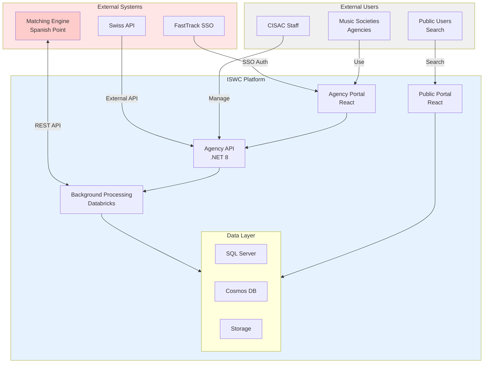
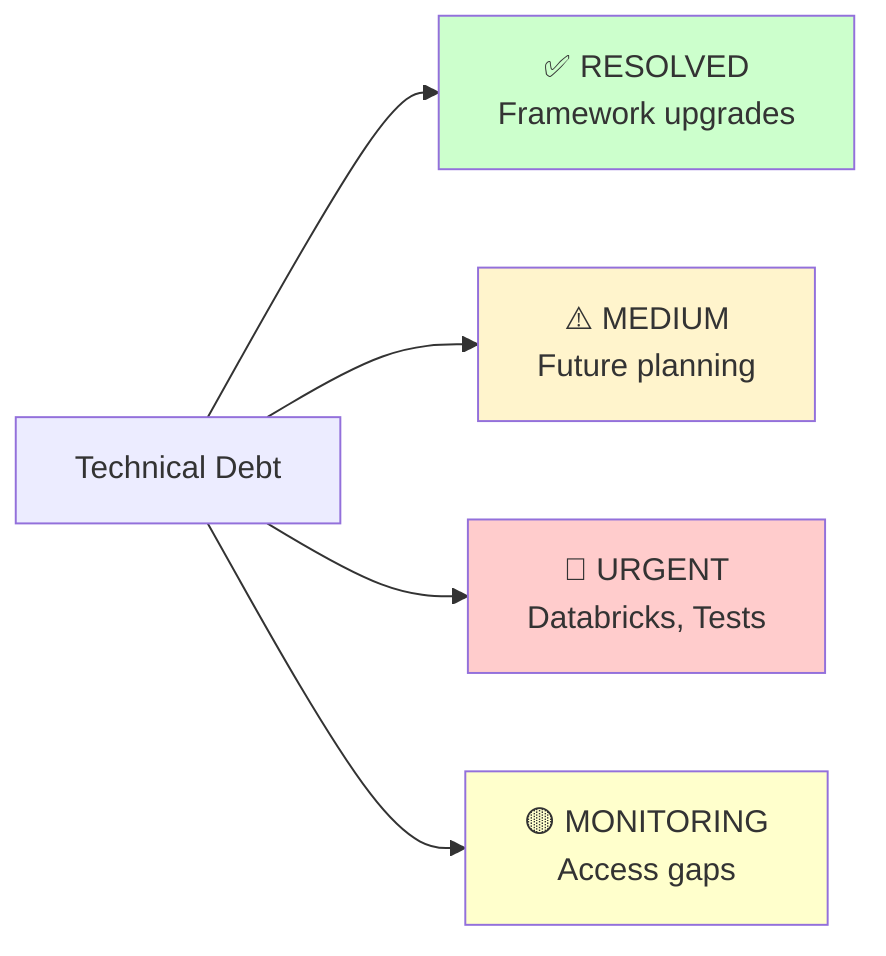
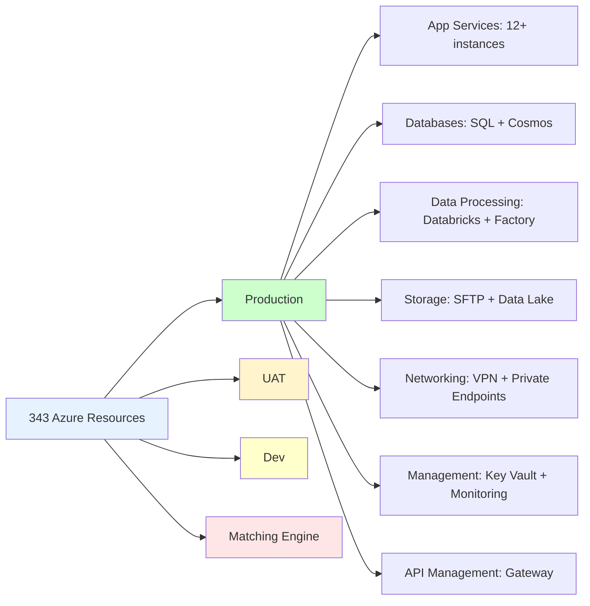
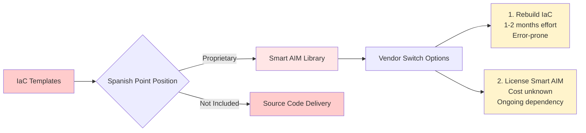
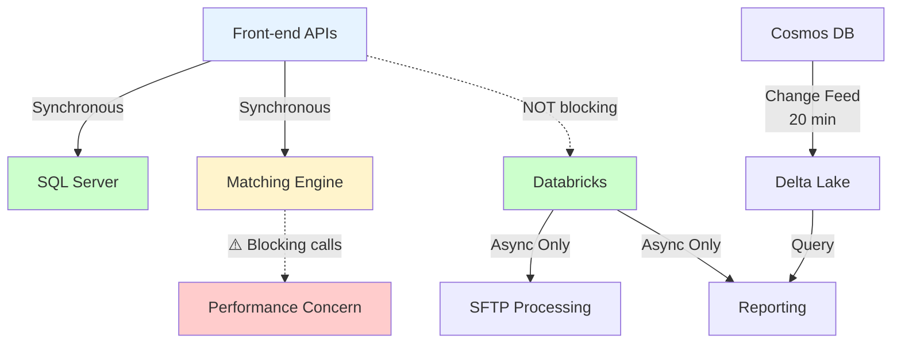
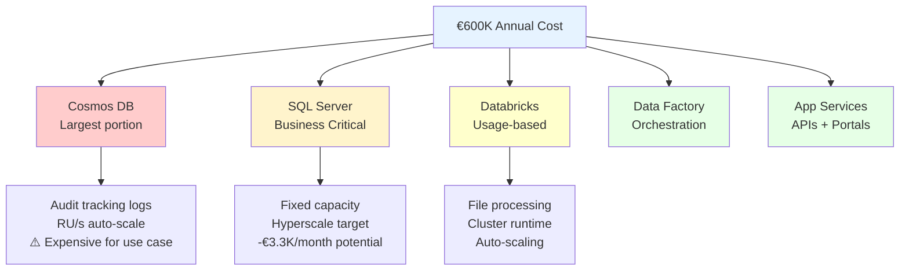
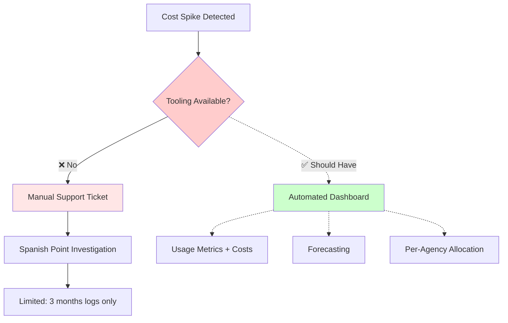

# PART 3: Technical Findings (10 min, Slides 7-12)

[← Back to Index](../index.md) | [← Part 2](part2-executive-summary.md) | [Part 4 →](part4-governance-findings.md)

---

## PART 3: Technical Findings (10 min, Slides 7-12)

### Slide 7: Architecture Assessment - Clean Separation



**Key Architecture Principles:**

| Principle | Status | Details |
|-----------|--------|---------|
| ✅ **Separation of Concerns** | STRONG | UI, API, Processing, Data layers cleanly separated |
| ✅ **Matching Engine Decoupling** | PROPER | Accessed ONLY via REST API (no code coupling) |
| ✅ **Async Processing** | CORRECT | Databricks asynchronous (no front-end blocking) |
| ✅ **Azure Best Practices** | FOLLOWED | Industry-standard services (SQL, Cosmos, Storage, Functions) |

**Speaker Notes:**

<details>
<summary>ASCII Diagram (fallback)</summary>

```text
System Context (C4 Level 1)

External Systems          ISWC Platform          External Users
┌─────────────┐          ┌─────────────┐         ┌──────────────┐
│ FastTrack   │─────────▶│   Agency    │◀────────│   Music      │
│ SSO         │          │   Portal    │         │   Societies  │
└─────────────┘          │   (React)   │         │   (Agencies) │
                         └─────────────┘         └──────────────┘
┌─────────────┐                 │
│ Swiss API   │─────────▶┌─────────────┐         ┌──────────────┐
│ (External)  │          │  Agency API │         │   CISAC      │
└─────────────┘          │  (.NET 8)   │◀────────│   Staff      │
                         └─────────────┘         └──────────────┘
┌─────────────┐                 │
│ Matching    │◀────────┐       │                ┌──────────────┐
│ Engine      │         │       │                │   Public     │
│ (Spanish    │         │       ▼                │   Users      │
│  Point)     │         │  ┌─────────────┐       │   (Search)   │
└─────────────┘         │  │ Background  │       └──────────────┘
                        │  │ Processing  │              │
                        │  │ (Databricks)│              ▼
                        │  └─────────────┘       ┌──────────────┐
                        │       │                │   Public     │
                        │       ▼                │   Portal     │
                        │  ┌─────────────┐       │   (React)    │
                        └──│  SQL Server │       └──────────────┘
                           │  Cosmos DB  │
                           │  Storage    │
                           └─────────────┘
```

</details>

Let's dive into the technical details. Starting with architecture.

We documented the complete C4 model - four levels from system context down to component internals. What you see here is the highest level: how the ISWC platform fits into CISAC's ecosystem.

**[Reference: docs/work_in_progress/architecture/ - Full C4 models available]**

**Key architectural strengths:**

1. **Clean separation of concerns** - UI layer (React portals), API layer (.NET 8 services), processing layer (Databricks + Functions), data layer (SQL + Cosmos + Storage). Each layer has clear responsibilities.

2. **Matching Engine physical separation** - This was one of our key concerns going into the audit. Is the Matching Engine embedded code or properly separated? Answer: **Properly separated.** The integration is via REST API only, with clean interface abstraction (`IMatchingEngineMatchingService.cs`).

   **[Reference: docs/work_in_progress/code_analysis/MatchingEngine_integration.md - 42+ files analyzed]**

   This means replacing the Matching Engine is _technically_ feasible (though strategically complex).

3. **Databricks asynchronous only** - We worried Databricks might be in the critical path for front-end performance. Clarified in the November 5 workshop: Databricks handles ONLY asynchronous file processing (SFTP uploads) and reporting. Front-end APIs don't wait for Databricks.

   **[Reference: docs/meetings/20251105-[ISWC Audit]Production & Performance Data Discussion-transcript.txt]**

4. **Azure-native patterns** - API Management as gateway, Application Insights for monitoring, Key Vault for secrets, managed identities where possible. This follows Microsoft best practices.

**The architecture is sound. No fundamental redesign needed.**

---

### Slide 8: Code Quality - "Not Bad, But..."

**Code Quality Assessment:**

| ✅ Strengths | ⚠️ Concerns |
|-------------|-------------|
| **Well-structured codebase**<br/>• Logical project organization<br/>• Easy to navigate | **Minimal code comments**<br/>• Business logic not documented<br/>• "Locked in people's heads" |
| **Clean separation of concerns**<br/>• Controllers, Services, Repos<br/>• Good layering | **Significant code duplication**<br/>• Repeated patterns across modules<br/>• Maintainability risk |
| **Dependency injection patterns**<br/>• Interface abstractions<br/>• Testability enabled | **No developer onboarding guide**<br/>• Steep learning curve<br/>• No "how to contribute" |
| **Modern .NET 8 patterns**<br/>• Async/await usage<br/>• Entity Framework Core 8.0 | **High implicit knowledge**<br/>• Contextual understanding required<br/>• "Tentacular" dependencies |

**Assessment Quote:**

> "Not bad, well-structured, easy to navigate... Very little commenting and significant code duplication. Even for them, onboarding new developers must be hard."
>
> — Bastien & Guillaume, October 30 checkpoint meeting

**Speaker Notes:**

<details>
<summary>ASCII Layout (fallback)</summary>

```text
✅ Code Quality Strengths          ⚠️  Code Quality Concerns

Well-structured codebase           Minimal code comments
  • Logical project organization     • Business logic not documented
  • Easy to navigate                 • "Locked in people's heads"

Clean separation of concerns       Significant code duplication
  • Controllers, Services, Repos     • Repeated patterns across modules
  • Good layering                    • Maintainability risk

Dependency injection patterns      No developer onboarding guide
  • Interface abstractions           • Steep learning curve
  • Testability enabled              • No "how to contribute"

Modern .NET 8 patterns            High implicit knowledge
  • Async/await usage                • Contextual understanding required
  • Entity Framework Core 8.0        • "Tentacular" dependencies
```

</details>

When we got access to the .NET 8 source code on November 4, our first task was a code quality assessment.

**The good:**

The codebase is well-structured. It's not spaghetti code. It's not a mess. Projects are logically organized. The separation between Controllers (HTTP endpoints), Services (business logic), and Repositories (data access) is clear. Dependency injection is used correctly. Interface abstractions enable testing and swapping implementations.

**[Reference: docs/work_in_progress/code_analysis/ - Code structure analysis]**

Modern .NET 8 patterns are used - async/await for non-blocking operations, Entity Framework Core 8.0 for data access. This is competent, professional code.

**The concerns:**

1. **Minimal code comments** - Business logic is not documented in the code itself. You can read the code and understand _what_ it does, but understanding _why_ it does it requires external context. This knowledge is "locked in people's heads" as Guillaume put it.

2. **Significant code duplication** - We found repeated patterns across modules. Copy-paste-modify appears to be common. This is a maintainability risk - bug fixes must be replicated in multiple places, and it's easy to miss one.

3. **No onboarding process** - There's no "README for developers," no "how to contribute" guide, no onboarding checklist. Spanish Point themselves warned us that the code "has its own life cycles" and "many developers touched it and modified it."

   **[Reference: docs/meetings/20251021-ISWC Audit - Workshop 2 - Documentations and infrastructure.txt, Line 1:32:02]**

4. **High implicit knowledge** - To make even small changes, you need to understand how components interact. Spanish Point said setting up a local development environment wasn't feasible within our audit timeframe. Dependencies are "tentacular."

**Our October 30 assessment: "Even for them, onboarding new developers must be hard."**

**[Reference: docs/meetings/20251030-Audit ISWC - Point de passage.txt]**

This is the source of our "knowledge transfer viability unknown" critical finding. The code quality is acceptable for the current team. But can a new team take over? Unproven.

---

### Slide 9: Technical Debt Status - Mixed Picture

**Technical Debt Assessment:**

| Priority | Status | Items |
|----------|--------|-------|
| ✅ **RESOLVED** | Recently Addressed | • .NET Core 3.1 → 8.0 (EOL Dec 2022 → Active support until Nov 2026)<br/>• React 16.12.0 → 18.3.1 (Modern version)<br/>• TypeScript 3.7.3 → 5.6.3 (Modern version)<br/>• Entity Framework 3.1 → 8.0 (Modern ORM)<br/>• Outdated packages → Security vulnerabilities addressed |
| ⚠️ **MEDIUM** | Plan Required | • .NET 8 support ends Nov 2026 (only 2 years remaining)<br/>• Consider .NET 9/10 for longer support window<br/>• Code duplication needs refactoring (gradual, 6-12 months)<br/>• Documentation drift (specs from 2019-2020) |
| 🔴 **URGENT** | Action Needed | • Databricks 10.4 LTS outdated (unknown EOL, missing modern features)<br/>• Pipeline test runner blocked post-.NET 8 upgrade (workaround active)<br/>• Test stability issues (some tests brittle, 99.5% pass rate) |
| 🟡 **MONITORING** | Watch Closely | • Git commit history not provided (compliance review pending)<br/>• IaC templates not included (proprietary Smart AIM library) |



**Speaker Notes:**

<details>
<summary>ASCII Dashboard (fallback)</summary>

```text
Technical Debt Assessment

✅ RESOLVED (Recently Addressed)
   • .NET Core 3.1 → 8.0 (EOL Dec 2022 → Active support until Nov 2026)
   • React 16.12.0 → 18.3.1 (Modern version)
   • TypeScript 3.7.3 → 5.6.3 (Modern version)
   • Entity Framework 3.1 → 8.0 (Modern ORM)
   • Outdated packages → Security vulnerabilities addressed

⚠️  MEDIUM PRIORITY
   • .NET 8 support ends Nov 2026 (only 2 years remaining)
   • Consider .NET 9/10 for longer support window
   • Code duplication needs refactoring (gradual, 6-12 months)
   • Documentation drift (specs from 2019-2020)

🔴 URGENT
   • Databricks 10.4 LTS outdated (unknown EOL, missing modern features)
   • Pipeline test runner blocked post-.NET 8 upgrade (workaround active)
   • Test stability issues (some tests brittle, 99.5% pass rate)

🟡 MONITORING REQUIRED
   • Git commit history not provided (compliance review pending)
   • IaC templates not included (proprietary Smart AIM library)
```

</details>

Technical debt tells an interesting story.

**The wins (recently addressed):**

Spanish Point upgraded the entire platform from .NET 3.1 to .NET 8 just before our audit started (delivered November 4). This is significant. .NET 3.1 went end-of-life in December 2022 - it's been unsupported for nearly 3 years. Security vulnerabilities were accumulating.

**[Reference: docs/work_in_progress/code_analysis/iswc-v2-upgrade-analysis-2025-11-04.md]**

Yann mentioned in our October 21 discussion that Spanish Point initially wanted to charge separately for this upgrade. His position: "If maintenance doesn't cover framework upgrades, I don't know what to say."

**[Reference: docs/meetings/20251021-ISWC - Discussion Yann_Guillaume_Bastien.txt, Line 18:44]**

Eventually they did the upgrade (presumably included in maintenance after all). React, TypeScript, Entity Framework all modernized. Outdated packages from 2019-2020 updated. This addresses a major technical debt item.

**The medium priorities:**

.NET 8 support ends November 2026 - only 2 years away. This means another upgrade cycle soon. We recommend considering .NET 9 or 10 for longer support windows (3-year LTS cycles).

Code duplication should be refactored gradually over 6-12 months. Not urgent, but will improve maintainability.

Documentation drift is ongoing - specifications from 2019-2020 may not match current implementation. However, when we used LLM-assisted reconciliation against the .NET 3.1 code, we found minimal drift. This suggests the system hasn't evolved much since launch, which has pros and cons.

**The urgent items:**

1. **Databricks 10.4 LTS outdated** - Yann mentioned in October 21 discussion that Databricks is "several versions behind" and they're missing modern AI features.

   **[Reference: docs/meetings/20251021-ISWC - Discussion Yann_Guillaume_Bastien.txt, Line 19:30]**

   We don't know the security implications or upgrade path complexity. This should be prioritized.

2. **Pipeline test runner blocked** - Post-.NET 8 upgrade, the automated test runner in the CI/CD pipeline is blocked. Spanish Point logged a bug. Current workaround: tests run locally and pass, but the automated gate is disabled.

   **[Reference: docs/meetings/20251105-[ISWC Audit]CI_CD Pipeline Deep Dive-transcript.txt]**

   This removes a critical safety net. Needs urgent fix.

3. **Test stability** - Some integration tests are brittle (timeouts, networking issues). The team is aware and mitigating, but there's a risk that test failures become "normal background noise" and mask real problems.

**Discussion Prompt:** Is the Databricks upgrade already planned, or should we prioritize this?

---

### Slide 10: Infrastructure & DevOps - Mature Pipeline, IaC Gap

**Azure Resource Inventory:**



**CI/CD Pipeline Maturity:**

| Stage | Duration | Details | Status |
|-------|----------|---------|--------|
| **Build** | 5-10 min | • Source compilation<br/>• NuGet restore<br/>• React + TypeScript build<br/>• Docker image creation | ✅ Automated |
| **Test** | 10-15 min | • 700+ automated tests<br/>• Unit + Integration + UI<br/>• 99.5% pass rate | ✅ Automated |
| **Deploy** | 5-10 min | • Dev (automatic)<br/>• UAT (approval)<br/>• Production (approval) | ✅ Automated |
| **Total** | **20-30 min** | **Manual Steps: ZERO** | ✅ **Fully Automated** |

**Critical Gap - IaC Not Included:**



**Impact:** Adds 1-2 months to vendor switch timeline + creates dependency risk

**Speaker Notes:**

<details>
<summary>ASCII Overview (fallback)</summary>

```text
Azure Resource Inventory

343 Resources Across 4 Environments
├─ Production (primary)
├─ UAT (user acceptance testing)
├─ Dev (development)
└─ Matching Engine (separate environment)

Resource Categories
┌────────────────────────────────────────────┐
│ App Services        12+ instances          │
│ Databases           SQL Server, Cosmos DB  │
│ Data Processing     Databricks, Data       │
│                     Factory                │
│ Storage             Storage Accounts       │
│                     (SFTP, Data Lake)      │
│ Networking          VPN Gateway, Private   │
│                     Endpoints, DNS         │
│ Management          Key Vault, App         │
│                     Insights, Log Analytics│
│ API Management      Gateway (4 variants)   │
└────────────────────────────────────────────┘
```

</details>

Infrastructure and DevOps show a mixed picture: excellent automation, but a critical lock-in gap.

**The positives:**

The CI/CD pipeline is mature. Fully automated build, test, deploy - zero manual steps. 700+ tests run on every pipeline execution. Multi-stage deployment with approval gates for UAT and Production. Fast (20-30 minutes end-to-end).

**[Reference: docs/meetings/20251105-[ISWC Audit]CI_CD Pipeline Deep Dive-transcript.txt]**

This is professional DevOps. Changes can be deployed quickly and safely. The automation reduces human error.

Azure infrastructure is comprehensive - 343 resources deployed across 4 environments. We inventoried everything: App Services, databases, data processing, storage, networking, management services.

**[Reference: docs/work_in_progress/infra/infrastructure-azure-reference.md - Complete inventory]**

**The critical gap:**

The infrastructure-as-code templates and CI/CD pipeline definitions are **NOT included in the source code delivery.**

In our November 5 workshop, when we asked about IaC access, Spanish Point's position was clear: these are part of their proprietary "Smart AIM library." They have a licensing program for third-party vendors who need access.

**[Reference: docs/meetings/20251105-[ISWC Audit]CI_CD Pipeline Deep Dive-transcript.txt]**

This creates a vendor lock-in. If CISAC switches to a new vendor, that vendor must either:

1. **Rebuild IaC from scratch** - Reverse-engineer 343 Azure resources from the portal or export templates. Estimated 1-2 months effort. Error-prone (configuration drift, missing dependencies).

2. **License the Smart AIM library** - Pay Spanish Point for access to their IaC templates. Cost unknown. Creates ongoing dependency even after vendor switch.

**This is unacceptable for vendor independence.**

Compare this to the environment replication cost issue Yann described in our October 21 discussion:

> "You can't ask me for an environment size extension, 20 days of work... Normally it's done in two hours or half a day."

**[Reference: docs/meetings/20251021-ISWC - Discussion Yann_Guillaume_Bastien.txt, Line 23:10]**

If IaC were properly automated and included in deliverables, environment replication should be 0.5 days, not 20 days. The fact that Spanish Point quotes 20 person-days suggests their IaC automation has gaps OR they're pricing as custom work rather than executing existing scripts.

**Recommendation:** Negotiate IaC template inclusion in source code delivery as part of contract renegotiation. This should be standard deliverable, not proprietary asset.

---

### Slide 11: Performance & Scalability - Auto-Scaling Works

**Performance Assessment:**

| Category | Status | Details |
|----------|--------|---------|
| **Historical Performance** | ✅ STABLE | • No significant issues (past 12 months)<br/>• Auto-scaling handling load variations<br/>⚠️ Exception: ISWCs with 8,000+ works → SQL exceptions<br/>→ Proposed: Pagination for large submissions |
| **Monitoring & Alerts** | ⚠️ PARTIAL | ✅ Azure Monitor configured (platform-native)<br/>✅ Alerts: CPU >80% for 5 min → email<br/>✅ Application Insights available<br/>⚠️ No formal performance SLAs<br/>⚠️ No proactive KPI dashboards |
| **Auto-Scaling** | ✅ WORKING | ✅ App Services: 2-8 instances (CPU/memory)<br/>✅ Cosmos DB: RU/s auto-scale (usage-based)<br/>✅ Databricks: Cluster sizing adjusts<br/>✅ Evidence: Cost variations match usage |

**Architecture Clarifications (Nov 5 Workshop):**



**Performance Concerns:**

- ✓ **Databricks NOT in critical path** (async file processing only)
- ✓ **Cosmos DB NOT bottleneck** (audit logs + change feed to Delta Lake)
- ⚠️ **ISWC API Rate Limiting** (3-5 req/sec claimed - UNVERIFIED, needs Moïse validation)
- ⚠️ **Synchronous Matching Engine calls** (blocking HTTP - queue-based async would improve)

**Speaker Notes:**

<details>
<summary>ASCII Dashboard (fallback)</summary>

```text
Performance Assessment

Historical Performance (Past 12 Months)
✅ No significant issues reported (Spanish Point claim)
✅ Auto-scaling handling load variations
⚠️  One exception: ISWCs with 8,000+ works caused SQL exceptions
   → Proposed solution: Pagination for large submissions

Monitoring & Alerts
✅ Azure Monitor configured (platform-native metrics)
✅ Alerts: CPU >80% for 5 minutes → email to support team
✅ Application Insights available (accessible to audit team)
⚠️  No formal performance SLAs (only incident response time SLAs)
⚠️  No proactive performance dashboards or business KPIs

Auto-Scaling Configuration
✅ App Services: 2-8 instances (CPU/memory-based)
✅ Cosmos DB: Request Units auto-scale (usage-based)
✅ Databricks: Cluster sizing adjusts to workload
✅ Evidence: Monthly cost variations match usage patterns
```

</details>

Performance is where we have mixed data. Spanish Point claims the system performs well. Our analysis suggests they're mostly right, but there are gaps in visibility.

**Historical performance:**

Spanish Point states no significant performance issues in the past year. The one exception: ISWCs with 8,000+ works in a single submission caused SQL exceptions. They've proposed pagination as a solution.

**[Reference: docs/meetings/20251105-[ISWC Audit]Production & Performance Data Discussion-transcript.txt]**

Monitoring is configured - Azure Monitor with CPU >80% alerts, Application Insights for tracing. But there are no formal performance SLAs, only incident response time commitments. No proactive dashboards showing business KPIs like "submission success rate" or "validation failure rate."

**Auto-scaling evidence:**

The monthly cost variations are actually PROOF that auto-scaling is working correctly. Costs drop in December (low usage), peak in February (high usage). If resources were fixed-size, costs would be constant.

**[Reference: docs/meetings/20251106-[ISWC Audit]Cloud Cost Breakdown ＆ Infrastructure Configuration-transcript.txt]**

Spanish Point's Xiyuan explained: "The environment is autoscale... cost is never fixed, it's all based on the amount of workload."

**Key clarifications from workshops:**

1. **Databricks is NOT a bottleneck** - We initially worried Databricks might block front-end performance. Clarified: it's only used for asynchronous SFTP file processing and reporting. Front-end APIs don't wait for it.

2. **Cosmos DB is NOT a query bottleneck** - Primary use is audit tracking (append-only logs). Reporting queries run against Delta Lake in Databricks (replicated every 20 minutes via change feed), not directly against Cosmos DB.

**Performance concerns to investigate:**

1. **ISWC API rate limiting** - Yann mentioned in our October 30 meeting that the API is "limited to 3 to 5 requests per second - that's not much." This wasn't confirmed in our November 5 workshop. We need to validate with Moïse (CISAC's technical expert with operational experience). If true, this could be a bottleneck for high-volume agency integrations.

   **[Reference: docs/meetings/20251030-Audit ISWC - Point de passage.txt]**

2. **Synchronous Matching Engine calls** - Our code analysis found the Matching Engine integration uses synchronous HTTP calls (blocking). This means submission API calls wait for matching to complete before responding. For large submissions (10+ works), this could cause timeouts or poor user experience.

   **[Reference: docs/work_in_progress/code_analysis/MatchingEngine_integration.md]**

   Alternative: A queue-based async pattern (submit works → return immediately → matching happens in background → webhook/polling for results) would decouple submission from matching performance.

**Overall assessment:** Performance appears adequate for current usage. The architecture can scale. But visibility is limited - we're relying on Spanish Point's claims rather than objective metrics shared proactively with CISAC.

**Discussion Prompt:** What performance issues do CISAC staff or agencies complain about? Moïse's operational experience would provide valuable validation.

---

### Slide 12: Cost Analysis - €600K/Year, Visibility Gap

**Annual Cloud Spending: ~€600,000** (~€50K/month average)

**Primary Cost Drivers:**



**Monthly Cost Variation Pattern:**

| Pattern | Observation | Explanation |
|---------|-------------|-------------|
| **Variation** | ±10% month-to-month | December: Lower (holidays)<br/>February: Higher (+10% peak) |
| **Cause** | Auto-scaling | "Cost is never fixed, it's based on workload" (Spanish Point) |
| **Assessment** | ✅ **Working as designed** | Cost variations = feature, not bug |

**Critical Gap - No Cost Correlation Tooling:**



**Impact on CISAC:**

- ❌ Cannot explain monthly variations to stakeholders
- ❌ Cannot forecast spending based on expected usage
- ❌ Cannot identify cost optimization opportunities proactively
- ❌ Financial stakeholders lack visibility

**"Noisy Neighbor" Acknowledgment:**

> "There can be a term called noisy neighbor... That agency or very few model agencies use the system the most. I think that's actually the case."
>
> — Spanish Point (Xiyuan Zeng)

**Finding:** Some agencies drive majority of costs, but no allocation model exists (flat-rate pricing for all)

**Speaker Notes:**

<details>
<summary>ASCII Cost Breakdown (fallback)</summary>

```text
Annual Cloud Spending: ~€600,000 (~€50K/month average)

Primary Cost Drivers (Oct 2024 - Oct 2025)

1. Cosmos DB (Largest portion)
   └─ Use case: Audit tracking container (append-only logs)
   └─ Auto-scaling: Request Units vary with usage
   └─ Concern: Expensive for audit-only use case

2. SQL Server (Business Critical tier)
   └─ Fixed provisioned capacity
   └─ Target of Hyperscale proposal (-€3,300/month potential)

3. Databricks (Usage-based)
   └─ File processing workloads
   └─ Auto-scaling enabled (cluster runtime costs)

4. Data Factory (Pipeline orchestration)
   └─ Activity runs, data movement

5. App Services (APIs, portals)
   └─ Auto-scaling 2-8 instances
   └─ Less expensive than Databricks/Cosmos per unit
```

</details>

Cost is where governance gaps become financially tangible. €600,000 per year is being spent without adequate visibility.

**Cost breakdown:**

We analyzed the Azure Costs spreadsheet (October 2024 - October 2025) and workshop discussions. The primary drivers are:

1. **Cosmos DB** - Largest portion. Used primarily for audit tracking (append-only logs). Auto-scaling RU/s varies with usage. This is expensive for an audit-only use case - we'll discuss optimization opportunities.

2. **SQL Server** - Business Critical tier, fixed provisioned capacity. This is the target of the Hyperscale proposal (potential €3,300/month savings).

3. **Databricks** - Usage-based, cluster runtime costs. Auto-scaling enabled.

4. **Data Factory** - Pipeline orchestration, activity runs.

5. **App Services** - APIs and portals, auto-scaling 2-8 instances.

**[Reference: docs/work_in_progress/infra/ - Azure costs analysis]**

**Cost variation patterns:**

We observed ±10% month-to-month variation. For example, February 2025 peaked about 10% above baseline. In our November 6 workshop, we showed this chart to Spanish Point and asked for explanation.

Xiyuan's response: this is expected because the environment auto-scales. Cost is never fixed - it's based on workload. December drops (holiday period, lower usage), February peaks (higher agency submissions).

**[Reference: docs/meetings/20251106-[ISWC Audit]Cloud Cost Breakdown ＆ Infrastructure Configuration-transcript.txt]**

**This is actually evidence that auto-scaling is WORKING CORRECTLY.** CISAC pays less when usage is lower. This is a feature, not inefficiency.

**The critical gap: No correlation tooling**

Here's where it becomes a problem. When we asked Spanish Point: "Is there somewhere on your side or CISAC's side, something that can summarize usage and correlate with costs in order to automate this?"

Xiyuan's answer: "Not really... There's no tooling going to [correlate] causes because the system has so many components."

**[Reference: Same transcript, ~1:15:00 timestamp]**

The current process:

- Cost spikes require manual support ticket investigation
- Spanish Point can dig into specific months if asked
- Logs are kept only 3 months
- No proactive cost monitoring
- No automated dashboard showing "API calls up 15% → Cosmos DB scaled up → €5K additional spend"

**Impact on CISAC:**

Financial stakeholders cannot explain to leadership why costs went up 10% in February. There's no way to forecast spending based on expected usage patterns (e.g., "If we onboard 10 new agencies, costs will increase by X%"). Cost optimization opportunities are invisible.

This is a **governance failure**. €600K/year spending requires transparency and control.

**"Noisy neighbor" acknowledgment:**

We raised the concept of cost allocation per agency. Xiyuan acknowledged: "You are absolutely correct. There can be a term called noisy neighbor... That agency or very few model agencies use the system the most. I think that's actually the case."

**[Reference: Same transcript]**

So Spanish Point knows that some agencies drive the majority of costs, but no allocation model exists. All agencies pay flat-rate pricing regardless of whether they submit 100 works/month or 10,000 works/month.

CISAC could potentially implement usage-based pricing per agency, but this requires Spanish Point to develop correlation tooling, or CISAC to build it themselves.

**Recommendations for cost control:**

1. **Implement cost correlation tooling** (high priority) - Either Spanish Point develops it, or CISAC builds using API Management analytics + Azure Cost Management APIs. Estimated 2-3 months development, €10-20K.

2. **Reserved instances strategy** - SQL Server already has reservation ✅. Cosmos DB could benefit if workload is stable (Spanish Point recommendation). Databricks should NOT be reserved (only 4-6% savings, risky with variable usage).

3. **Cosmos DB archive policy** - Old audit logs (90+ days) should be archived to cheaper Blob Storage instead of expensive Cosmos DB.

4. **Monthly cost review meetings** - CISAC + Spanish Point review Azure spending monthly, correlate with usage, identify anomalies and optimization opportunities.

**Discussion Prompt:** How do you currently explain cost variations to CISAC financial stakeholders?

---

[← Back to Index](../index.md) | [← Part 2](part2-executive-summary.md) | [Part 4 →](part4-governance-findings.md)
