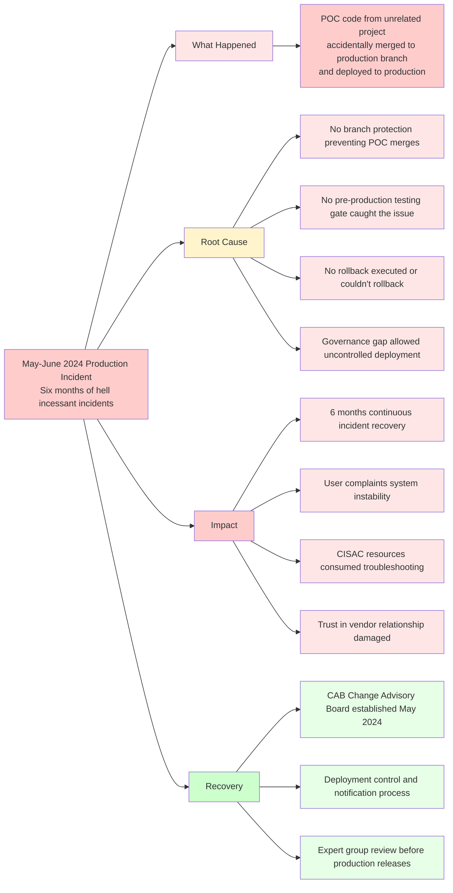
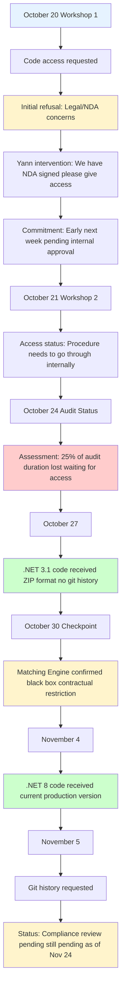

# PART 4: Governance Findings (8 min, Slides 13-17)

[← Back to Index](../index.md) | [← Part 3](part3-technical-findings.md) | [Part 5 →](part5-vendor-lock-in.md)

---

## PART 4: Governance Findings (8 min, Slides 13-17)

### Slide 13: The May 2024 Production Incident - A Wake-Up Call

**Visual:** Timeline of incident



**Yann's Description (Oct 21 Discussion):**

> "On a mis six mois à fixer tous les problèmes qu'il y a eu à ce moment-là. Il y a eu un merge qui a eu lieu avec du code qui était en POC. Un POC sur un autre projet, ça a été mergé avec la branche principale et c'est sorti en prod. Et ça nous a valu pratiquement six mois de galère, d'incidents incessants."
>
> Translation: "It took us six months to fix all the problems that occurred at that time. There was a merge that happened with code that was in POC. A POC on another project was merged with the main branch and went to production. And that caused us almost six months of hell, of incessant incidents."

**Reference:** docs/meetings/20251021-ISWC - Discussion Yann_Guillaume_Bastien.txt, Line 41:40

**Assessment:**
🔴 **This should never have happened with proper governance**
⚠️ **CAB was reactive (post-incident), not proactive**

**Speaker Notes:**

<details>
<summary>ASCII Incident Timeline (fallback)</summary>

```text
May-June 2024 Production Incident
"Six months of hell, incessant incidents"

What Happened:
┌─────────────────────────────────────────────────────────┐
│ POC code from unrelated project accidentally merged to  │
│ production branch and deployed to production            │
└─────────────────────────────────────────────────────────┘

Root Cause:
• No branch protection preventing POC merges
• No pre-production testing gate caught the issue
• No rollback executed (or couldn't rollback)
• Governance gap allowed uncontrolled deployment

Impact:
• 6 months continuous incident recovery
• User complaints, system instability
• CISAC resources consumed troubleshooting
• Trust in vendor relationship damaged

Recovery:
• CAB (Change Advisory Board) established May 2024
• Deployment control and notification process
• Expert group review before production releases
```

</details>

Let's talk about governance. The May-June 2024 production incident is the clearest evidence of governance gaps.

**What happened:**

POC (proof-of-concept) code from an unrelated project was accidentally merged into the production branch and deployed to production. This wasn't a small bug - it was experimental code that had no business being in production.

The result: six months of continuous incident recovery. Yann described it as "six months of hell, incessant incidents."

**[Reference: docs/meetings/20251021-ISWC - Discussion Yann_Guillaume_Bastien.txt, Line 41:40]**

**Why did this happen?**

Process failures at multiple levels:

1. **No branch protection** - Nothing prevented POC branches from being merged to the main production branch. No required approvals, no automated checks.

2. **No pre-production testing gate** - The POC code apparently didn't go through proper UAT. Or if it did, the testing didn't catch that it was experimental code.

3. **No quick rollback** - Six months of recovery suggests either (a) they didn't rollback to the previous stable version, or (b) they couldn't rollback because the deployment process doesn't support it.

4. **Governance gap** - The fundamental issue: there was no change control. Spanish Point was making deployments without oversight.

**The reactive response:**

Yann established a CAB (Change Advisory Board) in May 2024 in response to this incident:

> "J'ai mis en place un CAB pour les déploiements parce qu'il n'y avait rien, il faisait tout quand il voulait sans même prévenir les déploiements."
>
> Translation: "I set up a CAB for deployments because there was nothing, they did everything when they wanted without even warning of deployments."

**[Reference: Same transcript, Line 11:00]**

This is good - but it's reactive, not proactive. The CAB should have existed from day one. Deployment control, change notification, expert review - these are standard governance practices, not optional extras.

**Lesson:** Governance maturity was low before CISAC imposed controls. The vendor was operating without adequate oversight. The CAB stabilized the situation, but it shouldn't have taken a six-month crisis to establish basic change control.

**Discussion Prompt:** Are there other governance incidents we should be aware of from before May 2024?

---

### Slide 14: Before/After CAB - Control Gap Closed (Partially)

**Visual:** Two-column before/after comparison

| Before CAB (Pre-May 2024) | After CAB (Since May 2024) |
|---------------------------|----------------------------|
| ❌ No deployment tracking | ✅ Deployment history tracking |
| ❌ No change notification | ✅ Controlled deployment schedule |
| ❌ No governance oversight | ✅ Expert group review |
| ❌ Uncontrolled production releases | ✅ CAB approval required |
| ❌ "They did everything when they wanted without warning" | ✅ Deployment control process |

**Remaining Gaps:**

| Gap | Description |
|-----|-------------|
| ⚠️ **Definition of Done incomplete** | Documentation updates not required |
| ⚠️ **No Architecture Decision Records (ADR)** | Rationale for decisions not documented |
| ⚠️ **Knowledge management processes undefined** | No capture, organize, share process |
| ⚠️ **Onboarding processes non-existent** | No developer onboarding materials |

**Quote:**

> "J'ai mis en place un CAB pour les déploiements parce qu'il n'y avait rien, il faisait tout quand il voulait sans même prévenir les déploiements."
>
> — Yann Lebreuilly, October 21, 2025

**Translation:** "I set up a CAB for deployments because there was nothing, they did everything when they wanted without even warning of deployments."

**Speaker Notes:**

<details>
<summary>ASCII Before/After CAB (fallback)</summary>

```text
Before CAB (Pre-May 2024)          After CAB (Since May 2024)

❌ No deployment tracking           ✅ Deployment history tracking
❌ No change notification           ✅ Controlled deployment schedule
❌ No governance oversight          ✅ Expert group review
❌ Uncontrolled production releases ✅ CAB approval required
❌ "They did everything when        ✅ Deployment control process
   they wanted without warning"

Remaining Gaps:

⚠️  Definition of Done incomplete (documentation updates not required)
⚠️  No Architecture Decision Records (ADR)
⚠️  Knowledge management processes undefined
⚠️  Onboarding processes non-existent
```

</details>

The CAB implementation in May 2024 was a turning point. It closed the most critical governance gap - uncontrolled deployments.

**Before CAB (Pre-May 2024):**

Spanish Point was deploying to production without notification, without CISAC oversight, without change control. Yann's words: "They did everything when they wanted without even warning."

**[Reference: docs/meetings/20251021-ISWC - Discussion Yann_Guillaume_Bastien.txt, Line 11:00]**

This is unacceptable for a strategic information system. Deployments can introduce bugs, break features, change behavior. CISAC needs visibility and control.

**After CAB (Since May 2024):**

Now there's a controlled process:

- Deployment history is tracked
- Changes are notified in advance
- Expert group reviews changes before production release
- CAB approval required

This is basic governance, but it's a significant improvement from zero governance.

**The remaining gaps:**

The CAB addresses deployment control, but broader governance gaps remain:

1. **Definition of Done incomplete** - Documentation updates aren't required. Yann's position: "A proper DoD must include updating technical and functional documentation."

   **[Reference: Same transcript, Line 03:20]**

   Without this, specifications drift from implementation. Knowledge accumulates in people's heads instead of shared artifacts.

2. **No Architecture Decision Records (ADR)** - When architectural decisions are made, the rationale isn't documented. Future teams won't know WHY decisions were made, making it hard to evolve the system intelligently.

3. **Knowledge management undefined** - There's no process for capturing, organizing, and sharing knowledge. No onboarding process for new developers. No "lessons learned" repository.

**Assessment:** CAB was a good reactive response, but proactive governance is still immature. More work needed to reach industry-standard practices.

**Discussion Prompt:** Has the CAB been effective? What governance improvements have you seen since May 2024?

---

### Slide 15: Access Challenges Timeline - 25% Audit Duration Lost

**Visual:** Timeline showing access delays



**Access Outcome:**

| Status | Item | Details |
|--------|------|---------|
| ✅ **GRANTED** | ISWC application source code | .NET 3.1 and .NET 8 |
| 🔴 **BLOCKED** | Matching Engine source code | Only on contract termination |
| 🟡 **PENDING** | Git commit history | Compliance review ongoing |
| 🔴 **EXCLUDED** | IaC and CI/CD pipeline definitions | Proprietary Smart AIM |

**Pattern Observed:**
Systematic defensive posture → Access requests questioned → Information shared reluctantly

**Speaker Notes:**

<details>
<summary>ASCII Access Timeline (fallback)</summary>

```text
Access Challenges Timeline

October 20, 2025 - Workshop 1
├─ Code access requested
├─ Initial refusal: "Legal/NDA concerns"
├─ Yann intervention: "We have NDA signed, please give access"
└─ Commitment: "Early next week" (pending internal approval)

October 21, 2025 - Workshop 2
└─ Access status: "Procedure needs to go through internally"

October 24, 2025 - Audit Status
└─ Assessment: "25% of audit duration lost waiting for access"

October 27, 2025
└─ .NET 3.1 code received (ZIP format, no git history)

October 30, 2025 - Checkpoint
└─ Matching Engine confirmed "black box" (contractual restriction)

November 4, 2025
└─ .NET 8 code received (current production version)

November 5, 2025
├─ Git history requested
└─ Status: Compliance review pending (still pending as of Nov 24)

Access Outcome:
✅ GRANTED: ISWC application source code (.NET 3.1 and .NET 8)
🔴 BLOCKED: Matching Engine source code (only on contract termination)
🟡 PENDING: Git commit history (compliance review ongoing)
🔴 EXCLUDED: IaC and CI/CD pipeline definitions (proprietary Smart AIM)
```

</details>

The access challenges during this audit reveal a pattern that concerns us.

**Timeline of delays:**

October 20 (Workshop 1) - We requested code access. Initial response: legal/NDA concerns. Yann intervened, confirmed NDA was signed, and explicitly authorized access: "For all the other parts, yes, please give them access."

**[Reference: docs/meetings/20251020-SpanishPoint-AuditRelaunch.md]**

Spanish Point's commitment: "Early next week" pending internal approval process.

October 21 (Workshop 2) - Still pending, "procedure needs to go through internally."

By October 24, we assessed that 25% of our audit duration was lost waiting for access.

**[Reference: docs/project_management/20251024-AuditStatus-Analysis.md]**

October 27 - We received .NET 3.1 code in ZIP format (no git history).

November 4 - We received .NET 8 code (current production version).

November 5 - We requested git commit history. Spanish Point's position: "Source code provided, history is internal working process." Compliance review pending. **Still pending today (Nov 24).**

**[Reference: docs/meetings/20251105-[ISWC Audit]Production & Performance Data Discussion-transcript.txt]**

**Access outcome:**

✅ **GRANTED:** Application source code (.NET 3.1 and .NET 8) - eventually delivered

🔴 **BLOCKED:** Matching Engine source code - contractual restriction (only available upon contract termination)

🟡 **PENDING:** Git commit history - compliance review ongoing for 3+ weeks

🔴 **EXCLUDED:** IaC and CI/CD pipeline definitions - considered proprietary Smart AIM library

**The pattern:**

Every access request was questioned. The rationale evolved as different objections were addressed:

1. First: Legal/NDA concerns
2. Then: Technical difficulties opening access
3. Then: Proprietary code separation
4. Finally: Internal compliance review

Guillaume's observation from the October 21 internal discussion:

> "J'ai pris une telle baffe hier, une telle froideur... eux aussi ils ont plein de trucs hyper propriétaires, mais les gens ils étaient enthousiastes, ils participaient au truc, il y avait un partenariat."
>
> Translation: "I took such a slap yesterday, such coldness... they also have lots of proprietary stuff, but people were enthusiastic, they participated in the thing, there was a partnership."

**[Reference: docs/meetings/20251021-ISWC - Discussion Yann_Guillaume_Bastien.txt, Line 08:14]**

This isn't a partnership attitude. It's a defensive posture. Contrast with Guillaume's experience auditing other vendors with proprietary systems - they were enthusiastic, participatory, collaborative.

**Impact:** 25% of our audit budget lost to access delays. More importantly, this pattern suggests cultural issues in the vendor relationship that go beyond this audit.

**Discussion Prompt:** Have you experienced similar patterns in other interactions with Spanish Point?

---

### Slide 16: Documentation Drift - Specs from 2019

**Visual:** Documentation timeline

**Specification Documents Analysis:**

| Aspect | Finding |
|--------|---------|
| **Last Modified** | 2019-2020 (Original implementation period) |
| **Spec vs. Implementation Delta** | UNKNOWN (Until our LLM-assisted reconciliation) |
| **Volume** | ✅ Extensive (100+ pages of specifications) |
| **Organization** | ⚠️ Disorganized and difficult to navigate |
| **Currency** | ⚠️ Unclear (last modified 2019-2020) |
| **Accuracy** | ✅ LLM-assisted reconciliation: Minimal drift vs .NET 3.1 code |

**Yann's Experience:**

> "La documentation n'est pas disponible quand on le veut, quand on le demande. Il faut que nous repassions derrière le fournisseur pour pouvoir classer notre documentation parce que c'est confus tout ça."
>
> **Translation:** "Documentation is not available when we want it, when we ask for it. We have to go back behind the supplier to be able to classify our documentation because it's all confusing."

**Finding:**

System hasn't evolved much since 2019 launch

- **Pro:** Specifications still mostly accurate
- **Con:** Limited feature development in 5+ years

**Root Cause: Definition of Done Gap**

| Current DoD (Inferred) | Recommended DoD |
|------------------------|-----------------|
| ✓ Feature implemented | ✓ Feature implemented |
| ✓ Tests pass | ✓ Tests written and passing |
| ❌ Technical docs updated | ✓ Technical docs updated |
| ❌ Functional specs updated | ✓ Functional specs updated |
| ❌ Code comments written | ✓ Business logic commented |
| | ✓ Peer review completed |

**Speaker Notes:**

<details>
<summary>ASCII Documentation Status (fallback)</summary>

```text
Documentation Status Assessment

Specification Documents Analysis:
┌─────────────────────────────────────────────────────┐
│ Most specifications last modified: 2019-2020        │
│ (Original implementation period)                    │
│                                                      │
│ Specification vs. Implementation Delta: UNKNOWN     │
│ (Until our LLM-assisted reconciliation)             │
└─────────────────────────────────────────────────────┘

Yann's Experience:
"La documentation n'est pas disponible quand on le veut, quand on le
demande. Il faut que nous repassions derrière le fournisseur pour
pouvoir classer notre documentation parce que c'est confus tout ça."

Translation:
"Documentation is not available when we want it, when we ask for it.
We have to go back behind the supplier to be able to classify our
documentation because it's all confusing."

Our Assessment (Oct 30):
✅ Documentation extensive (100+ pages of specifications)
⚠️  Disorganized and difficult to navigate
⚠️  Currency unclear (last modified 2019-2020)
✅ LLM-assisted reconciliation: Minimal drift vs .NET 3.1 code

Finding:
System hasn't evolved much since 2019 launch
  → Pro: Specifications still mostly accurate
  → Con: Limited feature development in 5+ years

Root Cause: Definition of Done Gap

Current DoD (Inferred):          Recommended DoD:

✓ Feature implemented            ✓ Feature implemented
✓ Tests pass                     ✓ Tests written and passing
❌ Technical docs updated         ✓ Technical docs updated
❌ Functional specs updated       ✓ Functional specs updated
❌ Code comments written          ✓ Business logic commented
                                 ✓ Peer review completed
```

</details>

Documentation drift is a governance symptom, not just a documentation problem.

**The situation:**

Most specification documents were last modified in 2019-2020 during the original implementation. CISAC has a team "tearing their hair out" trying to re-document the system because the existing docs are confusing and disorganized.

Yann's description in our October 21 discussion:

> "La documentation n'est pas disponible quand on le veut... Il faut que nous repassions derrière le fournisseur pour pouvoir classer notre documentation parce que c'est confus tout ça."
>
> Translation: "Documentation is not available when we want it... We have to go back behind the supplier to be able to classify our documentation because it's all confusing."

**[Reference: docs/meetings/20251021-ISWC - Discussion Yann_Guillaume_Bastien.txt, Line 03:20]**

**Our investigation:**

When we finally got access to the code, we used LLM-assisted reconciliation to compare the 2019-2020 specifications against the .NET 3.1 codebase. Result: **minimal drift found.**

**[Reference: docs/meetings/20251030-Audit ISWC - Point de passage.txt]**

This is both good and bad:

**Good:** The specifications are still mostly accurate (they match the code)

**Bad:** This suggests the system hasn't evolved much in 5+ years. Limited feature development since launch. The platform is relatively static.

**The root cause: Definition of Done gap**

Documentation drift happens when the Definition of Done doesn't include documentation updates. Based on Yann's testimony, this appears to be the case.

Yann's position in the October 21 discussion:

> "Donc pour moi, un DoD digne de ce nom doit embarquer la mise à jour des documentations, qu'elles soient techniques ou fonctionnelles."
>
> Translation: "So for me, a proper DoD must include updating technical and functional documentation."

**[Reference: Same transcript, Line 03:20]**

Current DoD (inferred): Feature implemented + tests pass = done

Recommended DoD: Feature implemented + tests written and passing + technical docs updated + functional specs updated + business logic commented + peer review = done

**This isn't optional. It's how you prevent knowledge from being locked in people's heads.**

Without documentation updates in the DoD, every feature delivery increases technical debt. Every bug fix that isn't documented makes the system harder to maintain. Every architectural decision without an ADR makes future changes riskier.

**Recommendation:** Negotiate enhanced Definition of Done as part of contract renegotiation. Make documentation updates non-negotiable for feature delivery.

**Discussion Prompt:** Has documentation improved since May 2024 CAB, or is this still an ongoing issue?

---

### Slide 17: Transparency Issues - Pattern of Defensive Posture

**Visual:** Quotes comparison

| Partnership Attitude | Defensive Posture |
|---------------------|-------------------|
| "Enthusiastic, participatory, collaborative" | "Cold atmosphere"<br/>(Guillaume's impression, Workshop 1) |
| "People participated, there was a partnership"<br/>(Guillaume's other audits) | "When you ask for something, it's always 'for what purpose'"<br/>(Yann's experience) |
| Open information sharing | "Real transparency problem. I've never had a discussion like I'm having with you [audit team], with the [Spanish Point] team."<br/>(Yann, Oct 21) |

**Specific Transparency Gaps:**

| Area | Issues |
|------|--------|
| ❌ **Cost Correlation** | • No automated tooling to explain monthly spending variations<br/>• Manual investigation required via support tickets<br/>• Logs kept only 3 months |
| ❌ **Performance Metrics** | • No proactive dashboard sharing production metrics<br/>• Relies on Spanish Point claims rather than shared objective data<br/>• No formal SLAs for performance |
| ❌ **Git History** | • "Source code provided, history is internal working process"<br/>• 3+ weeks compliance review (still pending) |
| ❌ **IaC Templates** | • Considered proprietary library<br/>• Not included in source delivery<br/>• Creates vendor lock-in |
| ❌ **Access Requests** | • Systematic questions about purpose<br/>• Multiple objections raised sequentially<br/>• Information shared reluctantly |

**Yann's Assessment:**

> "C'est-à-dire qu'il y a un vrai problème de transparence. Je ne peux pas travailler avec des gens en transparence... je n'ai jamais eu de discussion comme j'ai avec vous là, avec l'équipe."
>
> Translation: "There's a real transparency problem. I can't work with people in transparency... I've never had a discussion like I'm having with you, with the team."

**Reference:** docs/meetings/20251021-ISWC - Discussion Yann_Guillaume_Bastien.txt, Line 26:48

**Speaker Notes:**

<details>
<summary>ASCII Transparency Comparison (fallback)</summary>

```text
Partnership Attitude                    Defensive Posture

"Enthusiastic, participatory,          "Cold atmosphere"
collaborative"                          (Guillaume's impression, Workshop 1)

"People participated,                   "When you ask for something,
there was a partnership"                it's always 'for what purpose'"
(Guillaume's other audits)              (Yann's experience)

Open information sharing                "Real transparency problem.
                                       I've never had a discussion like
                                       I'm having with you [audit team],
                                       with the [Spanish Point] team."
                                       (Yann, Oct 21)

Specific Transparency Gaps:

❌ Cost Correlation
   • No automated tooling to explain monthly spending variations
   • Manual investigation required via support tickets
   • Logs kept only 3 months

❌ Performance Metrics
   • No proactive dashboard sharing production metrics
   • Relies on Spanish Point claims rather than shared objective data
   • No formal SLAs for performance

❌ Git History
   • "Source code provided, history is internal working process"
   • 3+ weeks compliance review (still pending)

❌ IaC Templates
   • Considered proprietary library
   • Not included in source delivery
   • Creates vendor lock-in

❌ Access Requests
   • Systematic questions about purpose
   • Multiple objections raised sequentially
   • Information shared reluctantly
```

</details>

Let's address the elephant in the room: the vendor relationship dynamics.

**The contrast:**

Guillaume has audited other complex systems with proprietary components. His observation:

> "I've audited other vendors with lots of proprietary stuff, but people were enthusiastic, they participated in the thing, there was a partnership."

His experience with Workshop 1 (October 20):

> "I took such a slap yesterday, such coldness."

**[Reference: docs/meetings/20251021-ISWC - Discussion Yann_Guillaume_Bastien.txt, Line 08:14]**

This isn't about proprietary code or technical complexity. It's about attitude. Partnership vs. defensive posture.

**Yann's experience:**

Yann described the transparency problem in our October 21 internal discussion:

> "There's a real transparency problem. I can't work with people in transparency... I've never had a discussion like I'm having with you [audit team], with the [Spanish Point] team."

**[Reference: Same transcript, Line 26:48]**

And:

> "When you ask for something, it's always 'for what purpose', etc."

**[Reference: Same transcript, Line 28:07]**

**Specific transparency gaps we observed:**

1. **Cost correlation** - No automated tooling, manual investigation required, 3-month log retention

2. **Performance metrics** - No proactive dashboard, relying on Spanish Point claims

3. **Git history** - "History is internal working process," 3+ weeks compliance review

4. **IaC templates** - Proprietary library, not included in delivery

5. **Access requests** - Systematic questioning, sequential objections, reluctant sharing

**This is a pattern, not isolated incidents.**

**Why does this matter?**

CISAC cannot manage a strategic information system without transparency. You need:

- Cost visibility to explain spending and forecast budgets
- Performance data to validate vendor claims
- Code history to understand evolution and risk
- IaC templates to enable vendor independence
- Open information sharing to make informed decisions

**A healthy vendor relationship provides these proactively.** They don't wait for you to ask. They don't question your purpose. They share information because partnership requires transparency.

**Yann's strategic conclusion:**

> "My medium-term vision is to get rid of them, quite simply. Because I cannot manage an IS that I don't control, and currently I have no control at all."

**[Reference: Same transcript, Line 27:54]**

**Discussion Prompt:** Beyond this audit, what other transparency issues have you encountered?

---

[← Back to Index](../index.md) | [← Part 3](part3-technical-findings.md) | [Part 5 →](part5-vendor-lock-in.md)
