# PART 5: Vendor Lock-in Reality (8 min, Slides 18-21)

[← Back to Index](../index.md) | [← Part 4](part4-governance-findings.md) | [Part 6 →](part6-strategic-recommendations.md)

---

## PART 5: Vendor Lock-in Reality (8 min, Slides 18-21)

### Slide 18: Three Lock-in Mechanisms

**Vendor Lock-in Assessment - Three Distinct Mechanisms:**

**1. Matching Engine** - 🔴 **CRITICAL** (Contractual + Conceptual)

- **Constraints:**
  - 🔴 Source code: Contract termination only
  - ✅ Physical separation: REST API integration
  - ⚠️ "Heart of the product" (Yann)
- **Impact:**
  - Alternative engines unknown
  - Refactoring required if switching
  - Core business logic dependency

**2. Infrastructure-as-Code** - 🔴 **CRITICAL** (Proprietary Library)

- **Constraints:**
  - 🔴 IaC templates: Not included in delivery
  - 🔴 Smart AIM library: Proprietary
  - ⚠️ Options: Rebuild (S effort) or License
- **Impact:**
  - Environment replication blocked
  - 343 Azure resources to reverse-engineer
  - Manual reconstruction error-prone

**3. Knowledge Transfer** - ⚠️ **HIGH RISK** (Implicit Knowledge)

- **Constraints:**
  - ⚠️ Minimal code comments
  - 🔴 No onboarding process
  - ⚠️ Significant duplication
  - ⚠️ "Tentacular" dependencies
- **Impact:**
  - **Viability UNKNOWN** - highest risk
  - Cannot confirm vendor switch feasibility
  - Requires pilot test to validate

---

**Assessment Summary:**

| Coupling Type | Level | Details |
|---------------|-------|---------|
| **Technical coupling** | 🟢 **LOW** | Clean architecture, REST APIs, proper abstractions |
| **Organizational coupling** | 🔴 **HIGH** | Contract terms, knowledge transfer gaps, proprietary IaC |

**Speaker Notes:**

<details>
<summary>ASCII Diagram (fallback)</summary>

```text
Vendor Lock-in Assessment

1. Matching Engine                    2. Infrastructure-as-Code
   (Contractual + Conceptual)            (Proprietary Library)

   🔴 Source code: Contract              🔴 IaC templates: Not included
      termination only                      in source delivery

   ✅ Physical separation: REST API      🔴 Smart AIM library: Proprietary
      integration (good architecture)

   ⚠️  "Heart of the product" (Yann)    ⚠️  Options: Rebuild (S effort)
                                           or License Smart AIM

   Impact: Alternative matching          Impact: Environment replication
   engines unknown, refactoring             impossible without rebuild
   required                                 or licensing

3. Knowledge Transfer
   (Implicit Knowledge)

   ⚠️  Minimal code comments
   🔴 No onboarding process
   ⚠️  Significant duplication
   ⚠️  "Tentacular" dependencies

   Impact: Vendor switch viability
   UNKNOWN (highest risk)
```

</details>

Vendor lock-in has three distinct mechanisms. Let's examine each.

**Mechanism 1: Matching Engine (Contractual + Conceptual)**

The Matching Engine is contractually restricted - source code only accessible upon contract termination. Yann's assessment: "Extrêmement fort. Le cœur de notre produit, c'est leur outil."

**[Reference: docs/meetings/20251021-ISWC - Discussion Yann_Guillaume_Bastien.txt, Line 06:50]**

Translation: "Extremely strong. The heart of our product is their tool."

The good news: The architecture is clean. Matching Engine is physically separated, accessed only via REST API. Our code analysis found proper interface abstraction (`IMatchingEngineMatchingService.cs`).

**[Reference: docs/work_in_progress/code_analysis/MatchingEngine_integration.md - 42+ files analyzed]**

**Technically, the Matching Engine could be replaced** - IF an alternative matching engine exists with compatible API, OR if CISAC builds an adapter/facade layer.

The unknowns:

- Do alternative matching engines exist? (Market research needed)
- What would refactoring effort be? (Depends on alternative chosen)
- Can Spanish Point's Matching Engine be replicated? (IP constraints)

**Mechanism 2: Infrastructure-as-Code (Proprietary Library)**

IaC templates and CI/CD pipeline definitions are NOT included in source code delivery. Spanish Point considers these part of their proprietary "Smart AIM library."

**[Reference: docs/meetings/20251105-[ISWC Audit]CI_CD Pipeline Deep Dive-transcript.txt]**

If CISAC switches vendors, options are:

1. **Rebuild IaC from scratch** - Reverse-engineer 343 Azure resources from portal. Estimated S effort. Error-prone.

2. **License Smart AIM library** - Pay Spanish Point for access. Cost unknown. Creates ongoing dependency even after vendor switch.

This is a **critical blocker** for seamless vendor transition. Environment replication becomes manual effort instead of automated script execution.

**Mechanism 3: Knowledge Transfer (Implicit Knowledge)**

This is the highest risk because it's the hardest to quantify.

- Minimal code comments (business logic not documented)
- No onboarding process or "how to contribute" guide
- Significant code duplication (increases cognitive load)
- "Tentacular" dependencies (Spanish Point's warning)

**Can another vendor maintain this system?** We don't know. The code is readable, but understanding WHY it works this way requires implicit knowledge.

Guillaume and Bastien's assessment: "Even for them, onboarding new developers must be hard."

**[Reference: docs/meetings/20251030-Audit ISWC - Point de passage.txt]**

**Before CISAC commits to vendor independence strategy, this MUST be tested.** Assign a small feature to an independent vendor. See if they can deliver with only the available materials.

**Combined impact:**

Technical coupling: LOW (clean architecture, REST APIs, interface abstractions)

Organizational coupling: HIGH (contract terms, knowledge transfer, proprietary IaC)

Vendor switch is technically possible but organizationally complex and risky. **HIGH uncertainty** - needs detailed vendor proposals.

---

### Slide 19: Matching Engine Deep-Dive - "Heart of the Product"


**Architecture Assessment:**

| Aspect | Status | Details |
|--------|--------|---------|
| ✅ **Separation** | POSITIVE | Clean architectural separation, physically deployed separately |
| ⚠️ **Performance** | CONCERN | Synchronous blocking calls create performance coupling |
| 🔴 **Access** | BLOCKER | Contractual restriction - source code inaccessible |

**Code Analysis Results (42+ files reviewed):**

| Component | Implementation |
|-----------|----------------|
| **Interface** | `IMatchingEngineMatchingService` (proper abstraction) |
| **Implementation** | `MatchingEngineMatchingService.cs` (clean code) |
| **Authentication** | OAuth2 client credentials |
| **HTTP Client** | Factory pattern with proper DI |
| **Error Handling** | Try-catch with comprehensive logging |
| **Timeout Config** | Configurable settings |

**Technical Assessment:**

- ✅ Professional implementation
- ✅ Could be swapped for alternative (technically feasible)
- ⚠️ Synchronous calls = performance coupling
- 🔴 **Unknown:** Alternative matching engines availability

**Yann's Assessment:**

> "Extrêmement fort. Le cœur de notre produit, c'est leur outil. C'est ça la difficulté."
>
> Translation: "Extremely strong. The heart of our product is their tool. That's the difficulty."

**Reference:** docs/meetings/20251021-ISWC - Discussion Yann_Guillaume_Bastien.txt, Line 06:50

**Decoupling Options:**

| Option | Approach | Effort | Feasibility |
|--------|----------|--------|-------------|
| **1** | Find alternative matching engine | Unknown | Market research needed |
| **2** | Build adapter/facade layer | Months | Multi-vendor support possible |
| **3** | Accept lock-in, negotiate terms | Short | ✅ Pragmatic short-term solution |

**Speaker Notes:**

<details>
<summary>ASCII Diagram (fallback)</summary>

```text
Matching Engine Integration Architecture

ISWC Application                    Matching Engine (Spanish Point)
┌────────────────────┐             ┌──────────────────────────────┐
│  Validation        │             │  Matching Engine API         │
│  Pipeline          │    REST     │  (Deployed separately)       │
│                    │◀───HTTP────▶│                              │
│  ┌──────────────┐  │             │  ┌────────────────────────┐  │
│  │IMatchingEngine│  │             │  │ Proprietary Matching   │  │
│  │MatchingService│  │             │  │ Algorithm              │  │
│  │  (Interface)  │  │             │  │                        │  │
│  └──────────────┘  │             │  │ Source Code:           │  │
│         ▲          │             │  │ Contract termination   │  │
│         │          │             │  │ only                   │  │
│  ┌──────────────┐  │             │  └────────────────────────┘  │
│  │MatchingEngine│  │   OAuth2    │                              │
│  │MatchingService│──┼────Auth────▶│  Authentication              │
│  │    (.cs)      │  │             │                              │
│  └──────────────┘  │             │  REST Endpoints:             │
│                    │             │  • POST /match               │
│                    │             │  • GET /results              │
└────────────────────┘             └──────────────────────────────┘

✅ POSITIVE: Clean architectural separation (physically separated)
⚠️  CONCERN: Synchronous blocking calls (performance coupling)
🔴 BLOCKER: Contractual restriction (source code inaccessible)
```

</details>

The Matching Engine deserves special attention - it's both the cleanest technical integration AND the strongest lock-in.

**Clean architecture:**

Our code analysis reviewed 42+ files related to the Matching Engine integration. What we found: proper interface abstraction, OAuth2 authentication, HTTP client factory pattern, error handling, timeout configuration.

**[Reference: docs/work_in_progress/code_analysis/MatchingEngine_integration.md]**

This is professional implementation. Architecturally, the Matching Engine is properly separated - it's deployed as a separate service, accessed only via REST API. There's no embedded code, no direct database coupling.

**Technically, it could be swapped for an alternative** - IF one exists.

**The contractual restriction:**

The source code is only accessible upon contract termination. This creates a catch-22:

- You cannot evaluate alternatives without knowing what the Matching Engine does internally
- You cannot build a replacement without understanding its algorithms
- You cannot even assess the replacement effort

And as Yann noted: even if you got the code, "we wouldn't even be able to maintain it ourselves."

**[Reference: docs/meetings/20251030-Audit ISWC - Point de passage.txt]**

It's complex, proprietary, and central to the business logic.

**Yann's strategic assessment:**

"The heart of our product is their tool. That's the difficulty."

**[Reference: docs/meetings/20251021-ISWC - Discussion Yann_Guillaume_Bastien.txt, Line 06:50]**

The Matching Engine IS the ISWC system's core value - determining if a new work matches existing works in the global database. Without it, you have a data entry system, not a deduplication system.

**Decoupling options:**

1. **Find alternative matching engine** - Does the market offer alternatives? Fuzzy matching algorithms for music works? This requires market research. If alternatives exist, the integration could be swapped (adapter layer needed for different API contracts).

2. **Build adapter/facade layer** - Design the application to support multiple matching engine vendors. Abstract the matching logic behind CISAC-owned interfaces. This allows switching vendors or running multiple engines in parallel for validation.

   Effort: Months (substantial refactoring of validation/processing flows)

3. **Accept lock-in, negotiate better terms** - Pragmatic short-term approach. Acknowledge the Matching Engine lock-in, but use it as leverage to negotiate better transparency, cost control, and governance.

**Our recommendation:** Option 3 short-term (negotiate better terms), while researching Option 1 (alternative vendors) to inform long-term strategy. Option 2 (adapter layer) is a fallback if alternatives exist.

**The key unknown: Do alternative matching engines exist?**

We haven't researched this market. CISAC should. Not to commit to switching - but to know your options. Having alternatives strengthens your negotiating position even if you never switch.

---

### Slide 20: What We Can't Access - Visibility Gaps

**Access Status Matrix** (as of Nov 24, 2025)

| Resource | Status | Impact on Vendor Independence |
|----------|--------|------------------------------|
| ✅ **ISWC Application Source Code** (.NET 8) | **GRANTED** | Can analyze architecture, code quality, integration patterns |
| ⚠️ **Git Commit History** | **PENDING** (3+ weeks) | Cannot analyze evolution, developer turnover, knowledge concentration (bus factor) |
| 🔴 **Matching Engine Source Code** | **BLOCKED** (Contract) | Cannot assess replacement feasibility, build alternative, or evaluate IP constraints |
| 🔴 **IaC Templates & CI/CD Pipeline** | **EXCLUDED** (Proprietary) | Cannot reproduce environments, understand deployment process, or enable new vendor |
| 🟡 **Azure DevOps Board** (Task Mgmt) | **PENDING** (CISAC auth) | Cannot assess velocity, sprint planning, agile maturity |
| 🟡 **Production Performance Metrics** | **LIMITED** | Relies on Spanish Point claims rather than shared dashboards |
| 🟡 **Cost Correlation Data** | **MANUAL** | No automated tooling, support ticket required |

**Access Request Pattern:**


**Examples:**

- **Code access:** Legal → Technical → Proprietary → Compliance review
- **Git history:** "Internal working process" → Compliance review (3+ weeks)
- **IaC templates:** "Proprietary library" → Not included in delivery
- **Cost data:** No tooling → Manual investigation → Limited history

**Impact Analysis:**

```mermaid
graph TD
    A[Access Restrictions] --> B[HIGH IMPACT<br/>Vendor Independence]
    A --> C[MEDIUM IMPACT<br/>Operational Visibility]
    A --> D[LOW IMPACT<br/>Audit Depth]

    B --> B1[🔴 IaC Templates<br/>Critical blocker for vendor switch]
    B --> B2[🔴 Matching Engine<br/>Cannot assess alternatives]
    B --> B3[⚠️ Git History<br/>Cannot analyze evolution]

    C --> C1[🟡 Performance Metrics<br/>Cannot validate claims]
    C --> C2[🟡 Cost Correlation<br/>Cannot explain spending]
    C --> C3[🟡 DevOps Board<br/>Cannot assess velocity]

    D --> D1[Limited access reduced depth<br/>but sufficient for strategic assessment]

    style B fill:#ffcccc
    style C fill:#fff4cc
    style D fill:#e6ffe6
    style B1 fill:#ffe6e6
    style B2 fill:#ffe6e6
    style B3 fill:#fff4e6
```



**Speaker Notes:**

<details>
<summary>ASCII Diagram (fallback)</summary>

```text
Access Status Matrix (as of Nov 24, 2025)

Resource                           Status      Impact on Vendor Independence

✅ ISWC Application Source Code     GRANTED    Can analyze architecture,
   (.NET 8)                                    code quality, integration
                                               patterns

⚠️  Git Commit History              PENDING    Cannot analyze evolution,
                                    (3+ weeks)  developer turnover, knowledge
                                               concentration (bus factor)

🔴 Matching Engine Source Code      BLOCKED    Cannot assess replacement
                                    (Contract)  feasibility, build alternative,
                                               or evaluate IP constraints

🔴 IaC Templates & CI/CD Pipeline   EXCLUDED   Cannot reproduce environments,
                                    (Proprietary) understand deployment process,
                                               or enable new vendor

🟡 Azure DevOps Board (Task Mgmt)   PENDING    Cannot assess velocity,
                                    (CISAC auth) sprint planning, agile
                                               maturity

🟡 Production Performance Metrics   LIMITED    Relies on Spanish Point claims
                                               rather than shared dashboards

🟡 Cost Correlation Data            MANUAL     No automated tooling,
                                               support ticket required
```

</details>

Let's summarize what we could and couldn't access during this audit, and why it matters.

**What we got (✅):**

ISWC application source code (.NET 8 version). This was sufficient to assess architecture, code quality, integration patterns. We could verify the Matching Engine is properly separated, analyze the validation pipeline, document the component structure.

**What's pending (⚠️):**

1. **Git commit history** - We requested this November 5. Spanish Point's position: "Source code provided, history is internal working process." Compliance review pending. **Still pending today, 3+ weeks later.**

   **[Reference: docs/meetings/20251105-[ISWC Audit]Production & Performance Data Discussion-transcript.txt]**

   Impact: We cannot analyze code evolution patterns, developer turnover, commit frequency by component, or knowledge concentration (bus factor analysis). These would inform knowledge transfer risk assessment.

2. **Azure DevOps Board** - Accessible to multiple agencies, requires CISAC authorization for audit team. We weren't granted access.

   Impact: Cannot assess feature delivery velocity, sprint planning maturity, task management processes. These would inform vendor performance evaluation.

**What's blocked (🔴):**

1. **Matching Engine source code** - Contractual restriction. Only accessible upon contract termination.

   Impact: Cannot assess replacement feasibility, build alternative, or evaluate IP constraints. This is the core lock-in.

2. **IaC templates & CI/CD pipeline** - Considered proprietary Smart AIM library. Not included in source code delivery.

   Impact: Cannot reproduce environments, understand deployment automation, or enable new vendor takeover. **Critical blocker for vendor switch.**

**What's limited (🟡):**

1. **Production performance metrics** - No proactive dashboard shared. Relying on Spanish Point claims in workshops.

   Impact: Cannot validate performance assertions independently. Requires trust rather than verification.

2. **Cost correlation data** - No automated tooling. Manual investigation via support ticket required.

   Impact: Cannot explain monthly spending variations to stakeholders. Limits cost control and forecasting.

**The pattern:**

Every access request follows the same cycle:

1. Request made
2. "Why do you need this?" question
3. Multiple objections raised sequentially
4. Information shared reluctantly, if at all

This isn't a security posture - it's a defensive culture.

**Impact on vendor independence:**

The IaC templates and Matching Engine restrictions are **critical blockers** for vendor switch. Without IaC, a new vendor must reverse-engineer 343 Azure resources (S effort, error-prone). Without Matching Engine alternatives, the switch may be infeasible regardless of other factors.

The git history and performance metrics are **visibility gaps** that reduce CISAC's ability to validate vendor claims and assess risk.

**Recommendation:** Negotiate these as contract terms - git history, IaC templates, performance dashboards should be standard deliverables, not optional extras or proprietary assets.

---

### Slide 20.5: Knowledge Transfer - The Critical Unknown for Vendor Switch

**The Challenge: More Than Just Code Access**

Having source code ≠ Ability to maintain the system

**Four Compounding Factors:**

| Factor | Reality | Impact on New Vendor |
|--------|---------|---------------------|
| **🔴 Codebase Complexity** | 76,000+ lines of code<br/>Significant duplication<br/>"Tentacular" dependencies | High cognitive load to understand<br/>Risk of introducing bugs during changes |
| **🔴 Documentation Gaps** | Minimal code comments<br/>No onboarding guide<br/>No architecture decision records (ADRs) | New developers face steep learning curve<br/>Cannot understand "why" decisions were made |
| **🔴 Implicit Knowledge** | Business logic reasoning undocumented<br/>Integration patterns learned over time<br/>Tribal knowledge from original developers | Critical context exists only in Spanish Point team's heads<br/>Lost if team changes or vendor switches |
| **⚠️ Unverified Assumption** | Never tested with independent vendor<br/>Spanish Point's own assessment: onboarding is hard | **Cannot confirm vendor switch is even feasible**<br/>HIGHEST RISK |

**Guillaume & Bastien's Assessment:**

> "Even for them [Spanish Point], onboarding new developers must be hard with this codebase. The duplication alone increases cognitive load significantly."

**Reference:** docs/meetings/20251030-Audit ISWC - Point de passage.txt

**Spanish Point's Warning (CI/CD Workshop):**

> "The dependencies are quite tentacular... significant duplication exists."

**Reference:** docs/meetings/20251105-[ISWC Audit]CI_CD Pipeline Deep Dive-transcript.txt

**The Critical Question:**

**Can an independent vendor maintain this system with only:**

- ✅ Source code access
- ❌ No git history (still pending after 3+ weeks)
- ❌ No onboarding documentation
- ❌ No direct access to original developers
- ❌ No architecture decision records
- ❌ Minimal code comments

**Answer: We don't know.**

And that's the problem.

**Knowledge Transfer Viability Assessment:**


**Before CISAC commits to a vendor switch strategy:**

This assumption **MUST be tested** with a low-cost, low-risk pilot:

1. Select a small, non-critical feature (e.g., add validation rule, modify reporting output)
2. Assign to an independent vendor (not Spanish Point)
3. Provide only: source code, specifications, existing documentation
4. Measure: delivery time, questions asked, quality of implementation
5. Evaluate: Can they deliver without implicit knowledge transfer?

**Estimated pilot cost:** S (1-2 weeks of external vendor time)
**Risk reduced:** Massive (validates or invalidates entire vendor switch strategy)

**This is not optional** - it's a prerequisite for informed decision-making.

**Speaker Notes:**

<details>
<summary>ASCII Diagram (fallback)</summary>

```text
Knowledge Transfer - The Critical Unknown

The Challenge: Having source code ≠ Ability to maintain the system

Four Compounding Factors:

🔴 Codebase Complexity
   • 76,000+ lines of code
   • Significant duplication
   • "Tentacular" dependencies
   → Impact: High cognitive load, risk of bugs

🔴 Documentation Gaps
   • Minimal code comments
   • No onboarding guide
   • No architecture decision records
   → Impact: Steep learning curve, cannot understand "why"

🔴 Implicit Knowledge
   • Business logic reasoning undocumented
   • Integration patterns learned over time
   • Tribal knowledge in original team
   → Impact: Critical context lost if vendor switches

⚠️  Unverified Assumption
   • Never tested with independent vendor
   • Spanish Point's own assessment: onboarding is hard
   → Impact: Cannot confirm vendor switch is feasible

The Critical Question:
Can an independent vendor maintain this with ONLY source code?

Answer: We don't know. MUST TEST with pilot.

Pilot Approach:
1. Small feature (e.g., add validation rule)
2. Independent vendor (not Spanish Point)
3. Only provide: code + specs + docs
4. Measure: time, questions, quality
5. Evaluate: Can they deliver?

Cost: S (1-2 weeks)
Risk Reduced: MASSIVE (validates entire strategy)
```

</details>

This slide bridges the conceptual gap between identifying knowledge transfer as a lock-in mechanism (Slide 18) and presenting vendor switch effort estimates (Slide 21).

**Narrative Flow:**

1. **Slide 18** identifies knowledge transfer as a risk factor
2. **Slide 19** examines Matching Engine technical details
3. **Slide 20** shows access gaps that worsen knowledge transfer
4. **→ Slide 20.5** explains WHY knowledge transfer is the critical blocker for vendor switch and proposes the pilot test solution
5. **Slide 21** presents vendor switch effort estimates (now readers understand why estimates have "LOW CONFIDENCE" and why pilot is essential)

**Key Messaging:**

- Reframes knowledge transfer from abstract risk to concrete blocker
- Introduces the pilot test concept BEFORE the effort estimates
- Provides actionable recommendation (pilot) rather than just identifying problem
- Uses direct quotes from audit team and Spanish Point to validate concerns
- Quantifies the risk reduction value of small pilot investment

---

### Slide 21: Vendor Switch Effort Estimate - Preliminary Assessment

> **⚠️ Disclaimer:** Preliminary estimates with **LOW CONFIDENCE**. Not scoped, no vendor proposals, knowledge transfer untested.

**Effort Breakdown:**

| Component | Effort Estimate | Dependencies & Risks |
|-----------|----------------|----------------------|
| **Application Code Handover** | M | • Knowledge transfer viability **UNKNOWN**<br/>• Minimal documentation<br/>• No onboarding process<br/>• **Recommend:** Pilot test first |
| **IaC Reconstruction** | S | • 343 Azure resources<br/>• Reverse-engineer from portal<br/>• **OR** license Smart AIM library (cost unknown) |
| **Matching Engine Replacement** | L<br/>(if required) | • Alternative vendors **UNKNOWN**<br/>• Substantial refactoring likely<br/>• **OR** accept ongoing lock-in |
| **Knowledge Transfer** (Overlap Period) | L<br/>(parallel run) | • Parallel vendor overlap recommended<br/>• Gradual transition reduces risk |

⚠️ **HIGH uncertainty** on **TIMELINE** and **COSTS** due to unknowns​

**Critical Unknowns:**

- 🔴 Can independent vendor maintain the code? → **Knowledge transfer pilot needed**
- 🔴 Do alternative matching engines exist? → **Market research needed**
- 🔴 What does Smart AIM library license cost? → **Negotiate with Spanish Point**

**Risk Assessment:**


**Strategic Comparison:**

| Criteria | Option A: Vendor Switch | Option B: Improve Current Relationship |
|----------|------------------------|----------------------------------------|
| **Timeline** | XL | Immediate (contract renegotiation) |
| **Cost** | XL | Minimal cost (leverage existing contract) |
| **Risk** | 🔴 HIGH (knowledge transfer) | 🟡 MEDIUM (dependency continues) |
| **Outcome** | Uncertain | ✅ Proven platform (already works) |
| **Independence** | Full independence (if successful) | Better terms, more transparency |

**Recommendation:**

> **Test knowledge transfer BEFORE committing to switch**
>
> Don't decide today. Run the pilot. Research matching engine alternatives. Negotiate better contract terms in parallel. Make the decision when you have data, not guesses.

**Speaker Notes:**

<details>
<summary>ASCII Diagram (fallback)</summary>

```text
Vendor Switch Effort Estimate (Preliminary, LOW Confidence)

Component                    Effort Estimate    Dependencies & Risks

Application Code Handover    M                 • Knowledge transfer viability UNKNOWN
                                              • Minimal documentation
                                              • No onboarding process
                                              • Recommend: Pilot test first

IaC Reconstruction          S                 • 343 Azure resources
                                              • Reverse-engineer from portal
                                              • OR license Smart AIM library (cost unknown)

Matching Engine             L                 • Alternative vendors UNKNOWN
Replacement                 (if required)     • Substantial refactoring likely
                                              • OR accept ongoing lock-in

Knowledge Transfer          L                 • Parallel vendor overlap recommended
 (Overlap Period)           (parallel run)    • Gradual transition reduces risk

───────────────────────────────────────────────────────────────────────────
TOTAL TIMELINE              XL                HIGH uncertainty due to unknowns

ESTIMATED COST              XL                VERY LOW confidence
                                              (educated guess, not scoped)
```

</details>

Let's talk about what it would actually take to switch vendors.

**Important caveat: These are preliminary estimates with LOW confidence.** We haven't scoped detailed requirements. We haven't received vendor proposals. We haven't tested knowledge transfer. Treat these as order-of-magnitude educated guesses, not commitments.

**Application code handover: M effort**

Assuming another vendor can onboard to the codebase, we estimate medium effort for knowledge transfer. This depends entirely on:

- Documentation quality (currently limited)
- New vendor's experience with similar systems
- Spanish Point's cooperation with handover

**But we don't know if this is even feasible.** Hence our strong recommendation for a pilot test.

**IaC reconstruction: S effort**

Reverse-engineering 343 Azure resources from the portal is technically feasible but time-intensive and error-prone. Configuration drift, missing dependencies, undocumented settings - all create risk.

Alternative: License the Smart AIM library from Spanish Point. Cost unknown. This creates ongoing dependency even after vendor switch.

**Matching Engine replacement: L effort (if required)**

IF CISAC decides to replace the Matching Engine, expect substantial refactoring (large effort). The validation and processing flows are deeply integrated with matching concepts.

But we don't know if alternative matching engines exist. Market research needed.

Alternative: Accept ongoing Matching Engine dependency even after switching application maintenance vendor.

**Knowledge transfer overlap: L effort parallel run**

To reduce risk, we recommend large effort where both old and new vendors operate in parallel. Old vendor maintains production, new vendor shadows and learns. Gradual feature transition. This is expensive (paying two vendors) but dramatically reduces risk.

**Total timeline: XL**

Highly uncertain. Could be faster if knowledge transfer goes smoothly and IaC licensing is negotiated. Could be slower if knowledge transfer fails or Matching Engine replacement is required.

**Estimated cost: XL**

Educated guess based on:

- New vendor onboarding
- Parallel vendor overlap at reduced capacity
- IaC reconstruction or licensing
- Potential Matching Engine refactoring

**VERY LOW CONFIDENCE.** This needs detailed scoping and vendor proposals to validate.

**Critical unknowns:**

1. **Can independent vendor maintain the code?** - Unknown. Must test with pilot.
2. **Do alternative matching engines exist?** - Unknown. Market research needed.
3. **What does Smart AIM library license cost?** - Unknown. Negotiate with Spanish Point.

**Risk assessment:**

The highest risk is knowledge transfer viability. Everything else can be quantified, scoped, estimated. But if another vendor can't onboard to the code, the whole strategy fails.

**Mitigation: S-cost pilot test.** Assign a small, low-risk feature to an independent vendor. Give them the source code, documentation, and a feature spec. See if they can deliver. See what questions they ask. See how Spanish Point responds to handover requests.

This is a small investment to de-risk a potentially XL decision.

**Comparison to status quo:**

Option A (Vendor Switch):

- XL timeline
- XL cost
- High risk
- Uncertain outcome
- Full independence (if successful)

Option B (Improve Current Relationship):

- Immediate (contract renegotiation)
- Minimal cost (leverage existing contract)
- Medium risk (dependency continues)
- Proven platform
- Better terms, more transparency

**Our recommendation: Test knowledge transfer BEFORE committing to switch.**

Don't decide today. Run the pilot. Research matching engine alternatives. Negotiate better contract terms in parallel. Make the decision when you have data, not guesses.

---

[← Back to Index](../index.md) | [← Part 4](part4-governance-findings.md) | [Part 6 →](part6-strategic-recommendations.md)
