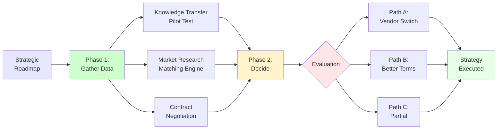
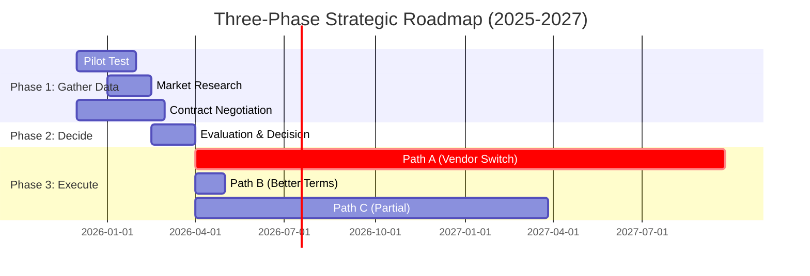
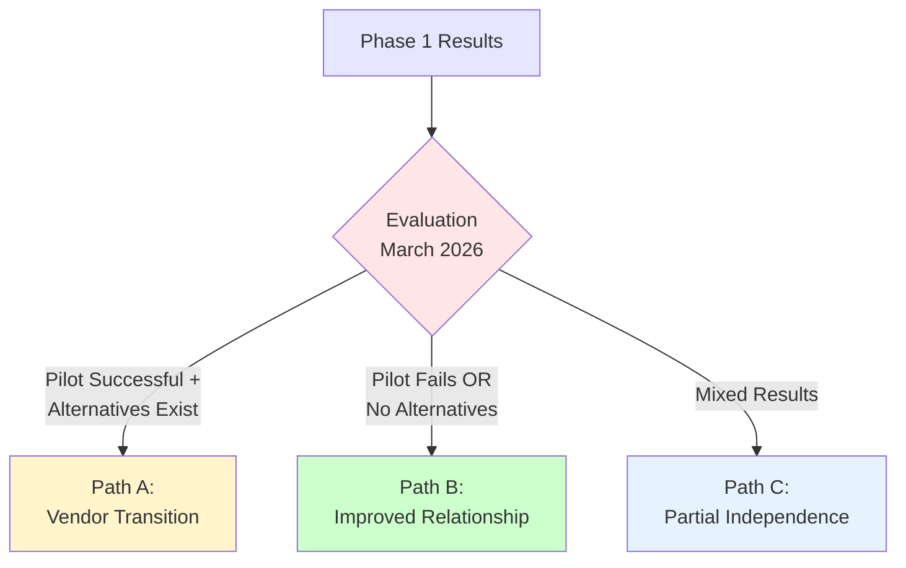
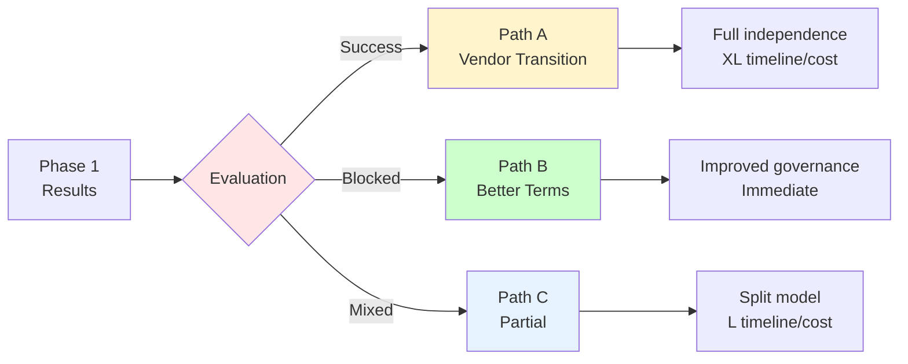

# Part 6: Strategic Recommendations

[← Back to Part 5](./part5-vendor-lock-in-reality.md) | [Part 7: Decision Points →](./part7-decision-points.md)

**Duration:** 10 minutes | **Slides:** 22-26

## PART 6: Strategic Recommendations (10 min, Slides 22-26)

### Slide 22: Our Recommended Strategy - Three-Phase Approach

**Strategic Timeline:** TEST → DECIDE → EXECUTE

**Alternative 1: Mermaid Flowchart**



**Alternative 2: Mermaid Gantt Chart**



**Alternative 3: Simple Markdown Timeline**

| Phase | Period | Focus | Outcome |
|-------|--------|-------|---------|
| **Phase 1:<br/>Gather Data** | Nov/Dec 2025<br/>(S duration) | • Pilot test<br/>• Market research<br/>• Contract negotiation | Data to inform decision |
| **Phase 2:<br/>Decide** | Q1-Q2 2026<br/>(M duration) | • Evaluate results<br/>• Choose strategic path | Path A, B, or C selected |
| **Phase 3:<br/>Execute** | H2 2026+<br/>(L to XL) | • Implement chosen strategy | Vendor independence or better terms |

**Why This Approach?**

| ❌ DON'T | ✅ DO |
|----------|-------|
| Commit to vendor switch before testing feasibility | Gather data first, decide with evidence |
| Accept status quo without negotiating | Use audit findings as leverage |

---

### Slide 22a: Phase 1 - Gather Data (Nov/Dec 2025)

**Objective:** Gather data, reduce uncertainty, establish leverage before major decisions

**Three Parallel Workstreams:**

| # | Action | Details | Investment |
|---|--------|---------|------------|
| **1** | **Knowledge Transfer Pilot Test** | • Assign small feature to independent vendor<br/>• Test maintainability with available materials<br/>• Assess Spanish Point handover cooperation | S |
| **2** | **Matching Engine Market Research** | • Identify alternative matching engine vendors<br/>• Request proposals/demos<br/>• Assess replacement feasibility | XS |
| **3** | **Contract Renegotiation (Parallel)** | • Git history access (immediate)<br/>• IaC templates inclusion in deliverables<br/>• Cost correlation tooling (automated dashboard)<br/>• Performance SLAs and proactive metrics<br/>• Enhanced Definition of Done (docs required) | Unknown |

**Timeline:** S (2-3 months) | **Total Investment:** S (pilot + research)

**Success Criteria:**

- ✅ Pilot test completed with clear feasibility assessment
- ✅ Market research identifies viable alternatives (or confirms none exist)
- ✅ Contract negotiation yields improved terms (at minimum: git history, IaC templates)

---

### Slide 22b: Phase 2 - Decide Based on Results (Q1-Q2 2026)

**Objective:** Based on Phase 1 results, choose strategic path

**Decision Framework:**

**Alternative 1: Simple Three-Path Diagram**



**Alternative 2: Decision Table**

| Scenario | Condition | Path Selected | Next Actions |
|----------|-----------|---------------|--------------|
| ✅ **SUCCESS** | Pilot successful<br/>+ Alternatives exist | **Path A:**<br/>Vendor Transition | • Proceed with vendor transition plan<br/>• Begin detailed RFP process<br/>• Negotiate transition terms |
| 🔴 **BLOCKED** | Pilot fails<br/>OR No alternatives | **Path B:**<br/>Improved Relationship | • Use pilot results as leverage<br/>• Negotiate enhanced governance terms<br/>• Accept lock-in, optimize within constraints |
| ⚠️ **MIXED** | Partial success<br/>Mixed results | **Path C:**<br/>Partial Independence | • Keep Spanish Point for Matching Engine<br/>• New vendor for application maintenance<br/>• Require knowledge transfer improvements |

**Alternative 3: Horizontal Flow**



**Alternative 4: Three Separate Decision Trees**

**Path A: Vendor Transition**

```mermaid
graph TD
    A1{Pilot Successful?} -->|YES| A2{Alternatives Exist?}
    A2 -->|YES| A3[✅ Path A<br/>Vendor Transition<br/>XL timeline/cost]
    A1 -->|NO| A4[❌ Path A Not Viable]
    A2 -->|NO| A4

    style A3 fill:#ccffcc
    style A4 fill:#ffcccc
```



**Path B: Improved Relationship**

```mermaid
graph TD
    B1{Pilot Failed OR<br/>No Alternatives?} -->|YES| B2[✅ Path B<br/>Improved Relationship<br/>Immediate]
    B1 -->|NO| B3[Consider Path A or C]

    style B2 fill:#ccffcc
    style B3 fill:#fff4cc
```



**Path C: Partial Independence**

```mermaid
graph TD
    C1{Mixed Results?} -->|YES| C2[✅ Path C<br/>Partial Independence<br/>L timeline/cost]
    C1 -->|NO| C3[Consider Path A or B]

    style C2 fill:#ccffcc
    style C3 fill:#fff4cc
```



**Timeline:** M (6 months) | **Investment:** Depends on path chosen

**Decision Date:** March 2026

---

### Slide 22c: Phase 3 - Execute Strategy (H2 2026 onwards)

**Objective:** Execute chosen strategy based on Phase 1 evidence

**Three Possible Paths:**

| Path | Description | Timeline | Investment | Key Activities |
|------|-------------|----------|------------|----------------|
| **Path A:<br/>Vendor Transition** | Full vendor switch | XL | XL | • Parallel vendor overlap<br/>• Gradual feature transition |
| **Path B:<br/>Improved Relationship** | Stay with better terms | Immediate | Minimal | • Enhanced contract terms in place<br/>• Better transparency and governance<br/>• Cost optimization implemented<br/>• Continue with Spanish Point under better terms |
| **Path C:<br/>Partial Independence** | Split maintenance model | L | L | • New vendor for app, Spanish Point for Matching<br/>• Clear interface contracts<br/>• Improved knowledge management |

**Timeline:** L to XL (depending on path) | **Investment:** L to XL (depending on path)

**Key Principle:** Don't decide today which path - decide in March 2026 when you have data

**Speaker Notes:**

<details>
<summary>ASCII Three-Phase Roadmap (fallback)</summary>

```text
Recommended Strategy: TEST → NEGOTIATE → DECIDE

Phase 1 (Immediate - Nov/Dec 2025)
┌────────────────────────────────────────────────────────────┐
│ OBJECTIVE: Gather data, reduce uncertainty, establish      │
│            leverage before major decisions                 │
│                                                             │
│ ACTIONS:                                                    │
│ ✓ Knowledge Transfer Pilot Test                            │
│   ├─ Assign small feature to independent vendor           │
│   ├─ Test maintainability with available materials        │
│   └─ Assess Spanish Point handover cooperation            │
│                                                             │
│ ✓ Matching Engine Market Research                          │
│   ├─ Identify alternative matching engine vendors         │
│   ├─ Request proposals/demos                              │
│   └─ Assess replacement feasibility                       │
│                                                             │
│ ✓ Contract Renegotiation (Parallel)                        │
│   ├─ Git history access (immediate)                       │
│   ├─ IaC templates inclusion in deliverables              │
│   ├─ Cost correlation tooling (automated dashboard)       │
│   ├─ Performance SLAs and proactive metrics              │
│   └─ Enhanced Definition of Done (docs required)          │
│                                                             │
│ TIMELINE: S                                                │
│ INVESTMENT: S (pilot + research)                          │
└────────────────────────────────────────────────────────────┘

Phase 2 (Q1-Q2 2026 - M timeline)
┌────────────────────────────────────────────────────────────┐
│ OBJECTIVE: Based on Phase 1 results, choose strategic path │
│                                                             │
│ DECISION POINT:                                             │
│                                                             │
│ IF Pilot Successful + Alternatives Exist:                  │
│   → Option A: Proceed with vendor transition plan         │
│   → Begin detailed RFP process                             │
│   → Negotiate transition terms                             │
│                                                             │
│ IF Pilot Fails OR No Alternatives:                         │
│   → Option B: Improve current relationship                │
│   → Use pilot results as leverage                          │
│   → Negotiate enhanced governance terms                    │
│   → Accept lock-in, optimize within constraints            │
│                                                             │
│ IF Pilot Mixed Results:                                    │
│   → Option C: Partial independence strategy               │
│   → Keep Spanish Point for Matching Engine                │
│   → New vendor for application maintenance                │
│   → Require knowledge transfer improvements                │
│                                                             │
│ TIMELINE: M                                                │
│ INVESTMENT: Depends on path chosen                        │
└────────────────────────────────────────────────────────────┘

Phase 3 (H2 2026 onwards - L to XL timeline)
┌────────────────────────────────────────────────────────────┐
│ OBJECTIVE: Execute chosen strategy                         │
│                                                             │
│ Path A (Vendor Transition):                                │
│   ├─ XL timeline                                          │
│   ├─ XL investment                                        │
│   ├─ Parallel vendor overlap                              │
│   └─ Gradual feature transition                           │
│                                                             │
│ Path B (Improved Relationship):                            │
│   ├─ Enhanced contract terms in place                     │
│   ├─ Better transparency and governance                   │
│   ├─ Cost optimization implemented                        │
│   └─ Continue with Spanish Point under better terms       │
│                                                             │
│ Path C (Partial Independence):                             │
│   ├─ Split maintenance model                              │
│   ├─ New vendor for app, Spanish Point for Matching       │
│   ├─ Clear interface contracts                            │
│   └─ Improved knowledge management                        │
│                                                             │
│ TIMELINE: L to XL                                          │
│ INVESTMENT: L to XL (depending on path)                   │
└────────────────────────────────────────────────────────────┘

Why This Approach?
❌ DON'T: Commit to vendor switch before testing feasibility
❌ DON'T: Accept status quo without negotiating better terms
✅ DO: Gather data first, decide with evidence, not assumptions
✅ DO: Use audit findings as leverage for better contract terms
✅ DO: Test knowledge transfer with low-risk pilot
✅ DO: Research alternatives to strengthen negotiating position
```

</details>

Based on everything we've found, here's our recommended strategy.

**The hybrid approach: Test → Negotiate → Decide**

We don't recommend committing to a vendor switch today. We also don't recommend accepting the status quo. We recommend a phased approach that gathers data, reduces uncertainty, and strengthens CISAC's negotiating position before making major decisions.

**Phase 1 (Immediate - Nov/Dec 2025): Gather Data**

Three parallel workstreams:

1. **Knowledge Transfer Pilot Test** (S investment, S timeline)

   Assign a small, low-risk feature to an independent vendor. For example: "Add a new validation rule" or "Generate a new report format" or "Implement a minor UI enhancement."

   Give them:

   - Source code (.NET 8)
   - Existing documentation
   - Feature specification

   See if they can deliver. See what questions they ask. See if Spanish Point cooperates with handover materials.

   **Success criteria:**

   - Feature delivered correctly
   - Timeline reasonable (not much longer than expected)
   - Independent vendor doesn't require extensive Spanish Point support

   **If pilot fails:** Knowledge transfer viability is low. Vendor switch is high risk. Option B (improve current relationship) becomes preferred.

   **If pilot succeeds:** Knowledge transfer is feasible. Vendor switch is an option. Proceed with detailed RFP.

2. **Matching Engine Market Research** (XS investment, S timeline)

   Research alternative matching engine vendors. Music rights matching is a specialized domain - who else offers this?

   Request proposals, demos, API documentation. Assess:

   - Functionality comparison (do they match Spanish Point's capabilities?)
   - API compatibility (can they replace via adapter layer?)
   - Cost comparison
   - Market maturity and references

   **If alternatives exist:** Vendor switch is more feasible. Use as leverage in negotiations.

   **If no alternatives exist:** Matching Engine lock-in is unavoidable. Accept it, optimize around it.

3. **Contract Renegotiation** (Parallel, ongoing)

   Use audit findings as leverage to negotiate better terms:

   - **Git history access** - Immediate requirement, no longer pending compliance review
   - **IaC templates inclusion** - Standard deliverable, not proprietary asset
   - **Cost correlation tooling** - Automated dashboard, monthly cost reviews
   - **Performance SLAs** - Formal performance commitments (P95 latency, uptime)
   - **Enhanced Definition of Done** - Documentation updates required for all deliveries
   - **Proactive metrics sharing** - Performance dashboards, cost breakdowns

   **Leverage:**

   - CISAC's data is Spanish Point's business model foundation
   - CISAC is volume leader among music societies
   - CISAC's satisfaction impacts Spanish Point's reputation
   - Audit findings document transparency gaps and governance failures

   **Outcome:** Better terms even if you stay with Spanish Point. Reduced lock-in even if you don't switch vendors.

**Phase 2 (Q1-Q2 2026 - 6 months): Decide Based on Results**

After Phase 1, you'll have data:

- Is knowledge transfer feasible? (Pilot results)
- Do alternative matching engines exist? (Market research results)
- Are better contract terms achievable? (Negotiation outcomes)

Three possible paths:

**Option A - Vendor Transition:** IF pilot successful AND alternatives exist, proceed with full vendor switch RFP. XL timeline and investment, high risk but full independence.

**Option B - Improved Relationship:** IF pilot fails OR no alternatives, stay with Spanish Point under better terms. Use pilot results and audit findings as leverage. Lower risk, proven platform, better governance.

**Option C - Partial Independence:** IF pilot shows mixed results, split the model. New vendor for application maintenance, Spanish Point for Matching Engine. Clear interface contracts, improved knowledge management.

**Don't decide today which path.** Decide after you have data.

**Phase 3 (H2 2026 onwards): Execute**

Execute the chosen strategy with confidence, knowing it's based on evidence rather than assumptions.

**Why this approach?**

- ✅ **Reduces risk** - Test before committing
- ✅ **Gathers data** - Decide with evidence, not guesses
- ✅ **Strengthens leverage** - Research alternatives, document findings
- ✅ **Optimizes outcome** - Better terms even if you don't switch

This is how you make a multi-million-euro strategic decision responsibly.

---

### Slide 23: The Knowledge Transfer Test - Small De-Risking Investment

**Visual:** Pilot test framework

**OBJECTIVE:** Validate that independent vendor can deliver with available materials

### Scope: Small, Low-Risk Feature Assignment

| Category | Examples |
|----------|----------|
| **Feature Examples** | • Add new validation rule (e.g., "Work title must not contain special characters")<br/>• Generate new report format (e.g., "Monthly submission statistics by agency")<br/>• Implement minor UI enhancement (e.g., "Add bulk edit capability for work metadata")<br/>• Fix non-critical bug (e.g., "Improve error message clarity for validation failures") |
| **Selection Criteria** | • Well-defined requirements<br/>• Limited scope (XS effort for experienced team)<br/>• Non-critical (failure doesn't impact production)<br/>• Representative complexity (touches multiple layers) |

### Materials Provided to Pilot Vendor

| Status | Material |
|--------|----------|
| ✅ **PROVIDED** | Source code (.NET 8 codebase) |
| ✅ **PROVIDED** | Existing documentation (specifications, architecture docs) |
| ✅ **PROVIDED** | Feature specification (detailed requirements) |
| ✅ **PROVIDED** | Access to UAT environment for testing |
| ❌ **NOT PROVIDED** | Direct Spanish Point development support (handover materials only) |

### Success Criteria

| # | Criterion | Expected Outcome |
|---|-----------|------------------|
| **1** | **Feature Delivered Correctly** | Meets requirements, passes testing |
| **2** | **Reasonable Timeline** | XS effort for experienced vendor (not much longer) |
| **3** | **Independent Delivery** | Minimal questions requiring Spanish Point input |
| **4** | **Code Quality Maintained** | Follows existing patterns, no technical debt |
| **5** | **Documentation Updated** | Tests written, comments added (if missing) |

### Evaluation Dimensions

| Dimension | Evaluation Question |
|-----------|---------------------|
| **Onboarding Time** | How long to become productive? |
| **Question Types** | What knowledge gaps exist? |
| **Spanish Point Cooperation** | Helpful or defensive? |
| **Code Comprehension** | Can they navigate codebase? |
| **Delivery Quality** | Professional vs struggling? |

### Possible Outcomes

| Result | Interpretation | Next Step |
|--------|----------------|-----------|
| ✅ **SUCCESS** | Knowledge transfer feasible<br/>Vendor switch is viable option | Proceed with detailed RFP process |
| ⚠️ **PARTIAL** | Knowledge transfer challenging but possible<br/>Requires improved documentation first | Negotiate knowledge transfer improvements |
| 🔴 **FAILURE** | Knowledge transfer not viable<br/>Vendor switch extremely high risk | Focus on improving current relationship |

**INVESTMENT:** S | **TIMELINE:** S | **RISK:** Very Low

**Alternative: Mermaid Diagram**


**Speaker Notes:**

The knowledge transfer pilot is the single most important recommendation we're making today. Here's why and how.

**Why small investment?**

This is the cost of engaging an independent vendor for a small feature assignment:

- Short development time
- Testing and documentation
- Project management overhead
- Vendor proposal and scoping effort

**Why is this critical?**

Because **everything else depends on this unknown.** You can estimate infrastructure costs. You can scope Matching Engine alternatives. You can negotiate contract terms. But knowledge transfer viability is binary - either another vendor can maintain this code, or they can't.

If they can't, the entire vendor switch strategy is infeasible, regardless of cost or timeline.

**How to structure the pilot:**

1. **Choose a representative feature** - Not trivial (doesn't test real complexity), not critical (failure is low-risk). Examples:

   - Add validation rule (touches validation pipeline, database, business logic)
   - Generate new report (touches data access, Databricks, reporting layer)
   - UI enhancement (touches React, API, state management)

2. **Provide standard materials** - Source code, documentation, feature spec, UAT environment. No special support beyond what would be available in a real vendor transition.

3. **Set clear success criteria**:

   - Feature works correctly
   - Timeline is reasonable (XS effort, not much longer)
   - Vendor doesn't require constant Spanish Point hand-holding
   - Code quality maintained (follows patterns, no shortcuts)

4. **Evaluate multiple dimensions**:
   - **Onboarding time** - How long before they're productive? Days or weeks?
   - **Question types** - Clarifying requirements (good) or basic code comprehension (concerning)?
   - **Spanish Point cooperation** - Helpful with handover or defensive/resistant?
   - **Code comprehension** - Can they navigate and understand the codebase?
   - **Delivery quality** - Professional work or struggling/shortcuts?

**Possible outcomes:**

**SUCCESS** - Feature delivered correctly, timeline reasonable, minimal hand-holding. This proves knowledge transfer is feasible. Vendor switch becomes viable option. Proceed with detailed RFP.

**PARTIAL SUCCESS** - Feature delivered but took longer than expected, or required more Spanish Point support than ideal. Knowledge transfer is challenging but possible with better documentation. Negotiate documentation improvements as contract term.

**FAILURE** - Feature not delivered, or timeline much longer than expected, or quality is poor. Knowledge transfer not viable with current materials. Vendor switch is extremely high risk. Focus on improving current relationship instead.

**Why low risk?**

- Small investment (vs XL full switch cost)
- Non-critical feature (failure doesn't impact production)
- Short timeline (fast feedback)
- Learning value regardless of outcome (either confirms switch viability or proves it's not feasible)

**Recommendation:** Start this pilot IMMEDIATELY (December 2025). Don't wait for Phase 2. This is the data point that drives all other decisions.

**Discussion Prompt:** What feature would be appropriate for pilot testing? What vendors should we approach?

---

### Slide 24: Contract Renegotiation Leverage - CISAC's Strategic Position

**Visual:** Leverage assessment

### CISAC's Strategic Asset: Data Authority

> "Their business model is based on your data. It doesn't exist without your data."
> — Guillaume Jay, Oct 21
>
> "It's the only authoritative and ISO source. We have this unique repository."
> — Yann Lebreuilly, Oct 21

### Five Leverage Factors

| # | Leverage Factor | Description |
|---|-----------------|-------------|
| **1** | **Data Source Authority** | • CISAC holds the authoritative ISO music works database<br/>• Spanish Point's Matching Engine depends on this data<br/>• No CISAC data = No Spanish Point matching business |
| **2** | **Volume Leadership** | • CISAC is Spanish Point's largest Matching Engine client<br/>• Largest deployment, most works, most agencies<br/>• Reference client for sales to other music societies |
| **3** | **Market Influence** | • Other music societies follow CISAC's lead<br/>• CISAC's satisfaction impacts Spanish Point's reputation<br/>• Positive/negative reference affects future sales |
| **4** | **Audit Documentation** | • Governance gaps documented (May 2024 incident)<br/>• Transparency issues documented (access challenges)<br/>• Cost control gaps documented (no correlation tooling)<br/>• Legitimate basis for contract term improvements |
| **5** | **Alternatives Research** | • Pilot test + market research = credible BATNA (Best Alternative To Negotiated Agreement)<br/>• Even if you don't switch, showing you CAN switch strengthens negotiating position |

### Negotiation Objectives

| Priority | Terms | Details |
|----------|-------|---------|
| 🔴 **IMMEDIATE**<br/>(Non-negotiable) | • Git commit history access<br/>• IaC templates inclusion<br/>• Cost correlation tooling | No more compliance delays<br/>In source delivery<br/>Automated dashboard |
| 🟠 **HIGH PRIORITY**<br/>(Strongly push) | • Performance SLAs<br/>• Enhanced Definition of Done<br/>• Proactive metrics sharing<br/>• Monthly cost review meetings | P95 latency, uptime commitments<br/>Docs required<br/>Monthly dashboards<br/>Usage correlation |
| 🟡 **MEDIUM PRIORITY**<br/>(Negotiate) | • Knowledge transfer improvements<br/>• Architecture Decision Records<br/>• Reduced environment setup costs<br/>• Smart AIM library licensing | Onboarding docs<br/>ADR practice<br/>IaC automation<br/>If vendor switch |

### Negotiation Strategy

| Element | Approach | Rationale |
|---------|----------|-----------|
| **TIMING** | Use pilot test period (Dec 2025 - Feb 2026) | "We're testing vendor alternatives while negotiating better terms"<br/>Creates urgency for Spanish Point to improve relationship |
| **FRAMING** | Partnership vs Compliance | "We want partnership, not just contract compliance"<br/>Position improvements as mutual benefit, not demands |
| **EVIDENCE** | Audit findings as basis | Reference specific incidents (May 2024, access delays)<br/>Document cost control gaps, transparency issues<br/>Professional assessment, not emotional complaints |
| **FALLBACK** | Partial improvements acceptable | Not all-or-nothing negotiation<br/>Prioritize critical items (git history, IaC, cost tooling)<br/>Accept incremental progress on medium priorities |

**Alternative: Mermaid Diagram**


**Speaker Notes:**

Let's talk about negotiating leverage. CISAC is not in a weak position here.

**Strategic leverage: CISAC's data**

Guillaume's observation in our October 21 discussion was spot-on:

> "Their business model is based on your data. It doesn't exist without your data."

**[Reference: docs/meetings/20251021-ISWC - Discussion Yann_Guillaume_Bastien.txt, Line 34:17]**

Yann confirmed:

> "It's the only authoritative and ISO source. We have this unique repository."

**[Reference: Same transcript, Line 34:18]**

Spanish Point's Matching Engine business depends on CISAC's authoritative music works database. Without CISAC's data, the matching engine has nothing to match against. This is foundational leverage.

**Five leverage factors:**

1. **Data Source Authority** - CISAC holds the ISO authoritative database. Spanish Point needs this more than CISAC needs Spanish Point.

2. **Volume Leadership** - CISAC is Spanish Point's largest Matching Engine client. Largest deployment, most works processed, most agencies integrated. This is their showcase client.

3. **Market Influence** - Other music societies look to CISAC for vendor recommendations. Yann noted that when other societies consider Spanish Point, they ask CISAC about their experience. CISAC's satisfaction directly impacts Spanish Point's sales pipeline.

   **[Reference: Same transcript, Line 22:00]**

4. **Audit Documentation** - We've documented legitimate governance gaps (May 2024 incident), transparency issues (access challenges timeline), cost control gaps (no correlation tooling). These aren't emotional complaints - they're professional findings from an independent audit. This creates a legitimate basis for contract improvements.

5. **Alternatives Research** - The pilot test and market research create a credible BATNA (Best Alternative To Negotiated Agreement). Even if CISAC ultimately stays with Spanish Point, demonstrating that you CAN switch vendors strengthens negotiating position.

**Negotiation objectives:**

**IMMEDIATE (Non-negotiable):**

- Git history access - no more multi-week compliance reviews
- IaC templates inclusion - standard deliverable, not proprietary
- Cost correlation tooling - automated dashboard for monthly spending visibility

These address critical governance gaps documented in the audit.

**HIGH PRIORITY (Strongly push):**

- Performance SLAs - formal commitments (P95 latency, uptime)
- Enhanced Definition of Done - documentation updates required
- Proactive metrics sharing - monthly dashboards
- Monthly cost review meetings - correlate usage with spending

These address transparency and control gaps.

**MEDIUM PRIORITY (Negotiate):**

- Knowledge transfer improvements - onboarding documentation
- Architecture Decision Records - document rationale for decisions
- Reduced environment setup costs - automate via IaC
- Smart AIM library licensing - if vendor switch becomes necessary

**Negotiation strategy:**

**Timing:** Use the pilot test period (December 2025 - February 2026) as negotiation window. The message: "We're testing vendor alternatives while simultaneously negotiating better terms with you. Show us why we should stay."

This creates constructive urgency for Spanish Point to improve the relationship.

**Framing:** Position as partnership improvement, not compliance demands. "We want to work with you, but we need transparency and control to justify that partnership."

**Evidence:** Reference specific audit findings. The May 2024 incident. The access delays. The cost correlation gap. Professional assessment, not emotional complaints.

**Fallback:** This isn't all-or-nothing. Prioritize the critical items (git history, IaC, cost tooling). Accept incremental progress on medium priorities. The goal is meaningful improvement, not perfection.

**Outcome:** Better terms whether you stay or switch. If you stay, improved governance. If you switch, reduced lock-in eases transition.

**Discussion Prompt:** Which contract terms are most important to CISAC leadership?

---

### Slide 24b: From Vendor to Partnership - Lean Principles Framework _(OPTIONAL)_

**Visual:** Partnership maturity assessment matrix

```text
Evaluating Vendor-to-Partnership Transformation Potential

The Strategic Question: Can Spanish Point Relationship Evolve?

Option B (Stay & Improve) only makes sense if the relationship
can transform from transactional vendor to genuine partnership.

Lean Partnership Principles - Current vs Target State:

┌─────────────────────────────────────────────────────────────────┐
│ PRINCIPLE 1: Respect for People                                │
├─────────────────────────────────────────────────────────────────┤
│ Current: Reactive communication, access delays (2-3 weeks)      │
│ Target:  Proactive transparency, immediate technical access     │
│ Gap:     🔴 SIGNIFICANT - May 2024 incident response was defensive│
└─────────────────────────────────────────────────────────────────┘

┌─────────────────────────────────────────────────────────────────┐
│ PRINCIPLE 2: Transparency (Genchi Genbutsu - "Go and See")     │
├─────────────────────────────────────────────────────────────────┤
│ Current: Code access via zip files, no git history             │
│ Target:  Full repository visibility, real-time collaboration   │
│ Gap:     🔴 CRITICAL - Fundamental trust barrier exists         │
└─────────────────────────────────────────────────────────────────┘

┌─────────────────────────────────────────────────────────────────┐
│ PRINCIPLE 3: Kaizen (Continuous Improvement)                   │
├─────────────────────────────────────────────────────────────────┤
│ Current: .NET 8 upgrade completed during audit (positive!)     │
│         CI/CD pipeline mature, good DevOps practices           │
│ Target:  Proactive technical debt roadmap, shared planning     │
│ Gap:     🟡 MODERATE - Technical capability exists, need process│
└─────────────────────────────────────────────────────────────────┘

┌─────────────────────────────────────────────────────────────────┐
│ PRINCIPLE 4: Long-term Thinking vs. Short-term Profit          │
├─────────────────────────────────────────────────────────────────┤
│ Current: Matching Engine bundling, Smart AIM template lock-in    │
│ Target:  Shared success metrics, investment in CISAC autonomy  │
│ Gap:     🔴 SIGNIFICANT - Economic model favors dependence      │
└─────────────────────────────────────────────────────────────────┘

┌─────────────────────────────────────────────────────────────────┐
│ PRINCIPLE 5: Shared Problem-Solving (not blame)                │
├─────────────────────────────────────────────────────────────────┤
│ Current: May 2024 incident response was defensive              │
│ Target:  Joint root cause analysis, shared accountability      │
│ Gap:     🔴 CRITICAL - Partnership requires mutual trust        │
└─────────────────────────────────────────────────────────────────┘

┌─────────────────────────────────────────────────────────────────┐
│ PRINCIPLE 6: Pull vs. Push (empower client, don't control)     │
├─────────────────────────────────────────────────────────────────┤
│ Current: CISAC must request access, wait for approval          │
│ Target:  CISAC has autonomy, Spanish Point provides support    │
│ Gap:     🔴 SIGNIFICANT - Control dynamics need reversal        │
└─────────────────────────────────────────────────────────────────┘

┌─────────────────────────────────────────────────────────────────┐
│ PRINCIPLE 7: Built-in Quality (Jidoka - stop and fix)          │
├─────────────────────────────────────────────────────────────────┤
│ Current: Pipeline test runner blocked since Nov 4 upgrade      │
│ Target:  Immediate escalation, shared quality ownership        │
│ Gap:     🟡 MODERATE - Process exists, execution inconsistent   │
└─────────────────────────────────────────────────────────────────┘

Partnership Maturity Assessment:
━━━━━━━━━━━━━━━━━━━━━━━━━━━━━━━━━━━━━━━━━━━━━━━━━━━━━━━━━━━━━━━━
Current State: ~30% Partnership Maturity
━━━━━━━━━━━━━━━━━━━━━━━━━━━━━━━━━━━━━━━━━━━━━━━━━━━━━━━━━━━━━━━━

Strengths:
  ✓ Technical capability (DevOps, .NET 8 upgrade)
  ✓ Continuous improvement mindset (Kaizen present)
  ✓ Quality infrastructure (CI/CD, testing)

Critical Gaps:
  ✗ Transparency barriers (no git access, access delays)
  ✗ Trust deficit (defensive incident response)
  ✗ Economic model misalignment (profit from lock-in)
  ✗ Control dynamics (push model, not pull)

The Test: Contract Negotiation as Partnership Diagnostic
════════════════════════════════════════════════════════════════

Phase 1 Strategy tests BOTH technical feasibility AND relationship
transformation potential simultaneously:

Pilot Feature Test (Dec 2025 - Feb 2026):
  ➜ Tests: Can independent vendor deliver with available materials?
  ➜ Reveals: Knowledge transfer viability

Contract Renegotiation (Same Period):
  ➜ Tests: Will Spanish Point embrace transparency?
  ➜ Reveals: Partnership transformation willingness

Five Partnership Test Questions for Negotiation:

1. "Will you provide full git repository access (not just zip exports)?"
   Partnership Response: "Yes, let's set up Azure DevOps read access"
   Vendor Response:      "That's proprietary, we can't risk IP exposure"

2. "Can we establish joint monthly cost review meetings with full data?"
   Partnership Response: "Yes, let's build correlation tooling together"
   Vendor Response:      "Cost management is our responsibility, trust us"

3. "Will you commit to enhanced Definition of Done (ADR, documentation)?"
   Partnership Response: "Yes, let's co-create quality standards"
   Vendor Response:      "That adds cost, current quality is sufficient"

4. "Can we do joint root cause analysis of May 2024 incident?"
   Partnership Response: "Yes, let's learn together and improve"
   Vendor Response:      "That's in the past, we've already addressed it"

5. "Will you support CISAC's goal of eventual vendor independence?"
   Partnership Response: "Yes, our value is expertise, not lock-in"
   Vendor Response:      "That would undermine our business model"

Decision Framework:
━━━━━━━━━━━━━━━━━━━━━━━━━━━━━━━━━━━━━━━━━━━━━━━━━━━━━━━━━━━━━━━━

IF Pilot succeeds (knowledge transfer viable)
   AND Negotiation succeeds (partnership responses)
   ➜ Option B viable: Stay & Improve with confidence

IF Pilot succeeds BUT Negotiation fails (vendor responses)
   ➜ Option A necessary: Switch is feasible AND needed

IF Pilot fails (knowledge transfer not viable)
   ➜ Option A blocked: Must negotiate better OR accept status quo

IF Pilot inconclusive
   ➜ Extend test period, try more complex feature

The Value: This framework gives CISAC clarity on whether
Spanish Point can be a long-term strategic partner vs.
a tactical vendor to be eventually replaced.
```

**Mermaid Alternative:**


**Speaker Notes:**

This optional slide provides a structured framework for evaluating whether the relationship with Spanish Point can evolve from a transactional vendor relationship to a genuine long-term partnership. This is critical because Option B (Stay & Improve) only makes strategic sense if the relationship dynamics can fundamentally change.

**The Lean Partnership Lens:**

The seven Lean principles (Respect, Transparency, Kaizen, Long-term Thinking, Shared Problem-Solving, Pull vs Push, Built-in Quality) provide an objective framework for assessing partnership maturity. Current assessment: ~30% maturity, with critical gaps in transparency, trust, and control dynamics.

**Key Strengths to Acknowledge:**

- Technical capability is real (DevOps maturity, .NET 8 upgrade execution)
- Kaizen mindset exists (continuous improvement culture)
- Quality infrastructure is solid (CI/CD, automated testing)

**Critical Gaps That Block Partnership:**

- Transparency barriers: Git access via zip files, 2-3 week delays for code access
- Trust deficit: May 2024 incident response was defensive, not collaborative
- Economic misalignment: Current model profits from client dependence (Matching Engine bundling, proprietary IaC)
- Control dynamics: CISAC must request and wait, rather than having autonomy with vendor support

**The Strategic Insight:**

Phase 1 (Pilot Test + Contract Renegotiation) is brilliant because it tests BOTH dimensions simultaneously:

1. **Technical Test (Pilot):** Can independent vendor deliver with available materials?

   - Tests knowledge transfer viability
   - Reveals quality of documentation and code clarity
   - Answers: "Is switching technically feasible?"

2. **Relationship Test (Negotiation):** Will Spanish Point embrace transparency and autonomy?
   - Tests transformation willingness
   - Reveals economic and cultural alignment
   - Answers: "Is partnership transformation possible?"

**The Five Test Questions:**

These aren't just negotiation tactics - they're partnership diagnostics. The responses reveal whether Spanish Point views CISAC as a long-term strategic partner or a revenue stream to protect:

1. Git access: Tests transparency commitment
2. Cost review meetings: Tests shared accountability
3. Enhanced DoD: Tests quality investment
4. Joint RCA: Tests trust and learning culture
5. Vendor independence support: Tests economic alignment

**Partnership vs. Vendor Responses:**

- **Partnership mindset:** "Let's co-create," "Our value is expertise, not control," "Yes, transparency builds trust"
- **Vendor mindset:** "That's proprietary," "Trust us," "That adds cost," "That undermines our model"

**Decision Framework Application:**

The four quadrants provide clear strategic guidance:

1. **Feasible + Partnership (Green):** Option B with confidence - best outcome
2. **Feasible + Not Partnership (Yellow):** Option A necessary - switching is both possible and strategically required
3. **Not Feasible + Partnership (Orange):** Negotiate better terms or accept improved status quo
4. **Not Feasible + Not Partnership (Red):** Highest risk scenario - locked-in with transactional vendor

**The Value for CISAC:**

This framework transforms a binary "stay or switch" decision into a structured assessment with clear diagnostic criteria. It gives CISAC leadership objective evidence for decision-making rather than gut feel.

**Facilitation Notes:**

If using this slide, allow 3-5 minutes for discussion. Key questions:

- "Which partnership principles matter most to CISAC leadership?"
- "Have you observed partnership or vendor behaviors in past interactions?"
- "How much relationship transformation are you willing to invest in?"

**Optional Nature:**

This slide can be skipped if time is tight or if the audience prefers to focus on technical findings. However, for strategic leadership discussions, this framework provides valuable clarity on the organizational and relationship dimensions of vendor lock-in beyond just technical factors.

**References:**

- Lean principles adapted from Toyota Production System and Lean Enterprise Institute
- Partnership maturity assessment based on audit findings (May 2024 incident, access delays, git history gaps)
- Test questions derived from transparency gaps identified in audit

**Confidence Assessment:**

- Partnership maturity estimate (~30%): **MEDIUM** - Based on observable behaviors during audit
- Test questions validity: **HIGH** - Directly address identified transparency and control gaps
- Framework applicability: **HIGH** - Proven approach for vendor relationship assessment

---

### Slide 25: Technical Quick Wins - Immediate Improvements

**Visual:** Priority matrix

### 🔴 HIGH IMPACT, LOW EFFORT (Do Immediately)

| # | Quick Win | Status | Impact | Effort | Action |
|---|-----------|--------|--------|--------|--------|
| **1** | **Fix Pipeline Test Runner<br/>(URGENT)** | Blocked since .NET 8 upgrade (Nov 4) | Deployment safety net disabled | Spanish Point bug fix (should be immediate) | Escalate priority demand fix ETA |
| **2** | **Databricks Upgrade Planning** | Version 10.4 LTS outdated | Missing features potential security gaps | Spanish Point upgrade roadmap (XS effort) | Request upgrade plan by end of Dec 2025 |
| **3** | **Monthly Cost Review Meeting** | No regular cost review process | €600K/year spending without visibility | Recurring meeting setup (1 hour/month) | Establish January 2026 invite Finance |

### 🟠 HIGH IMPACT, MEDIUM EFFORT (Plan for Q1 2026)

| # | Quick Win | Status | Impact | Effort | Action |
|---|-----------|--------|--------|--------|--------|
| **4** | **Cost Correlation Tooling** | Manual investigation required | Cannot explain monthly variations | S development effort | Either Spanish Point delivers OR CISAC builds using API Mgmt + Cost Mgmt APIs |
| **5** | **Cosmos DB Archive Policy** | Old audit logs in expensive Cosmos DB | Potential cost savings (estimated) | S implementation | Archive 90+ day logs to Blob Storage |
| **6** | **Performance Validation with Moïse** | Relying on Spanish Point claims | Cannot validate Hyperscale proposal need | XS (meetings with CISAC technical expert) | Gather production metrics user complaints |

### 🟡 MEDIUM IMPACT, LOW EFFORT (Ongoing Improvements)

| # | Quick Win | Status | Impact | Effort | Action |
|---|-----------|--------|--------|--------|--------|
| **7** | **Enhanced Definition of Done** | Documentation updates not required | Prevents knowledge accumulation in heads | Policy change (no dev work) | Negotiate as contract term |
| **8** | **Code Documentation Standards** | Minimal code comments | Knowledge transfer difficulty | Apply incrementally to new features | Mandate comments for business logic |
| **9** | **Architecture Decision Records (ADR)** | No ADR practice | Future teams won't know WHY decisions made | Template creation ongoing practice | Start with next major architectural change |

### Implementation Timeline

| Phase | Actions |
|-------|---------|
| **December 2025** | ✓ Fix pipeline test runner<br/>✓ Establish monthly cost review<br/>✓ Request Databricks upgrade plan |
| **January 2026** | ✓ Meet with Moïse (performance validation)<br/>✓ Implement enhanced DoD |
| **Feb-Mar 2026** | ✓ Cost correlation tooling<br/>✓ Cosmos DB archive policy<br/>✓ Code documentation standards |

**Speaker Notes:**

While strategic decisions (vendor switch vs improve relationship) take months, there are technical quick wins CISAC can demand immediately.

**HIGH IMPACT, LOW EFFORT (Do Immediately):**

1. **Fix Pipeline Test Runner (URGENT)**

   Post-.NET 8 upgrade (November 4), the automated test runner in CI/CD pipeline is blocked. Spanish Point logged a bug. Current workaround: tests run locally.

   **[Reference: docs/meetings/20251105-[ISWC Audit]CI_CD Pipeline Deep Dive-transcript.txt]**

   This removes a critical deployment safety net. Escalate priority with Spanish Point. Demand fix ETA. This should be covered under maintenance - it's a regression from their upgrade.

2. **Databricks Upgrade Planning**

   Databricks 10.4 LTS is outdated. Yann mentioned missing modern AI features. Security patches unknown.

   **[Reference: docs/meetings/20251021-ISWC - Discussion Yann_Guillaume_Bastien.txt, Line 19:30]**

   Action: Request Databricks upgrade roadmap from Spanish Point by end of December 2025. What version, what timeline, what testing, what cost (should be maintenance, not extra).

3. **Monthly Cost Review Meeting**

   €600K/year spending with no regular review process. Establish monthly meeting: CISAC + Spanish Point + Finance stakeholder. Review Azure spending, correlate with usage patterns (manually until tooling exists), identify anomalies.

   Effort: 1 hour/month. Impact: Visibility and accountability.

   Start January 2026.

**HIGH IMPACT, MEDIUM EFFORT (Plan for Q1 2026):**

4. **Cost Correlation Tooling**

   Spanish Point acknowledged no automated tooling exists to correlate usage with costs.

   **[Reference: docs/meetings/20251106-[ISWC Audit]Cloud Cost Breakdown ＆ Infrastructure Configuration-transcript.txt]**

   Options:

   - Spanish Point develops (preferred - they have all the context)
   - CISAC builds using API Management analytics + Azure Cost Management APIs

   Estimated: S development effort. Negotiate as part of contract improvements OR budget for CISAC internal development.

5. **Cosmos DB Archive Policy**

   Audit tracking logs stored indefinitely in expensive Cosmos DB. Implement tiered archival:

   - 0-90 days: Cosmos DB (hot access)
   - 91-365 days: Blob Storage warm tier
   - 365+ days: Blob Storage cool/archive tier

   Estimated savings: Cost reduction anticipated (needs data volume analysis to confirm).

   Effort: S implementation.

6. **Performance Validation with Moïse**

   We haven't validated performance claims with CISAC's operational expert (Moïse - 5+ years experience). Before approving Hyperscale proposal, validate:

   - What are actual user complaints?
   - What are production performance metrics?
   - Is SQL Server actually the bottleneck?
   - What's the ISWC API rate limiting (Yann's Oct 30 claim of 3-5 req/sec)?

   **[Reference: docs/meetings/20251030-Audit ISWC - Point de passage.txt]**

   Effort: 1-2 meetings. Impact: Data-driven Hyperscale decision.

**MEDIUM IMPACT, LOW EFFORT (Ongoing Improvements):**

7. **Enhanced Definition of Done** - Documentation updates required for all feature deliveries. Negotiate as contract term.

8. **Code Documentation Standards** - Business logic must be commented. Apply incrementally to new features (not retroactive refactoring).

9. **Architecture Decision Records** - Document WHY architectural decisions are made. Start with next major change.

**Timeline:** December 2025 → March 2026 for all quick wins.

**These improvements are valuable regardless of vendor strategy decision.** Whether CISAC stays with Spanish Point or switches vendors, better governance, cost visibility, and documentation reduce risk.

---

### Slide 26: Hyperscale Proposal - HOLD Pending Validation (Secondary Priority)

**Visual:** Proposal summary

### Hyperscale Proposal (PSA 5499) - Three Objectives

1. **Networking Security:** Public → Private endpoints
2. **SQL Tier Change:** Business Critical → Hyperscale
3. **Platform Modernization:** Align with Microsoft best practices

### Cost Impact (Spanish Point Claims)

| Component | Monthly Cost | Details |
|-----------|--------------|---------|
| **SQL Hyperscale Migration** | **-€3,300/month** | Business Critical → Hyperscale + reserved instances |
| **Private Networking** | **+€1,500/month** | VPN Gateway Private DNS Private Endpoints WAF |
| **NET SAVINGS** | **-€1,800/month<br/>-€21,600/year** | |

**Migration Investment:** €40,000 (one-time) | **ROI:** ~22 months payback period

### ⚠️ Our Assessment: HOLD Pending Validation

### Validation Questions (UNRESOLVED)

| # | Question | Concerns |
|---|----------|----------|
| **1** | **Is SQL Server actually the bottleneck?** | • No production performance metrics shared<br/>• Spanish Point claims "no issues" but no data<br/>• Need Moïse validation (operational experience) |
| **2** | **Can query optimization achieve similar results?** | • Have indexing caching alternatives been tried?<br/>• Hyperscale may mask inefficient queries<br/>• Cheaper optimization path not explored |
| **3** | **Are cost estimates accurate?** | • Based on single month average (auto-scaling)<br/>• Usage variations may affect savings<br/>• Reserved instance commitment = 1-year lock-in |
| **4** | **Can networking upgrade be decoupled from SQL tier?** | • Private networking (+€1,500/mo) may be valuable<br/>• Hyperscale migration (-€3,300/mo) needs proof<br/>• Decouple = validate each independently |

### Alternative Approach: Query Optimization First

**BEFORE committing €40K + reserved instances:**

| Option | Activities | Cost & Timeline | Outcomes |
|--------|-----------|-----------------|----------|
| **Performance Audit** | • Analyze slow queries (Application Insights)<br/>• Identify missing indexes<br/>• Implement caching where appropriate<br/>• Measure improvement | XS-S cost<br/>S timeline | **IF issues persist:** THEN consider Hyperscale (data-driven decision)<br/>**IF optimization resolves:** Save migration cost + avoid 1-year lock-in |

### Networking Security Component (May Be Valuable Independently)

| Feature | Benefit |
|---------|---------|
| ✓ Private endpoints | Removes public internet exposure |
| ✓ VPN Gateway | Secure admin access |
| ✓ Private DNS zones | Internal resolution |
| ✓ Optional WAF | Layer 7 reverse proxy |

**Cost:** +€1,500/month | **Benefit:** Enhanced security posture (may be justified regardless of SQL tier)

### 🔴 RECOMMENDATION: HOLD Hyperscale Approval

**Actions BEFORE approval:**

1. Meet with Moïse - gather production performance data
2. Validate SQL Server is actual bottleneck (not Matching Engine, not Cosmos DB)
3. Explore query optimization alternatives (XS-S cost vs €40K migration)
4. Separate networking security decision from SQL tier decision

**Timeline:** Jan-Feb 2026 validation → Decision by March 2026

**Priority:** This is SECONDARY - Strategic vendor decisions and governance improvements are MORE IMPORTANT than infrastructure optimization.

**Speaker Notes:**

Let's address the Hyperscale proposal (PSA 5499). Our recommendation: **HOLD pending validation.**

**What Spanish Point proposes:**

Three objectives:

1. Networking security (public → private endpoints)
2. SQL tier change (Business Critical → Hyperscale)
3. Platform modernization (Microsoft best practices)

Net cost: -€1,800/month savings (-€21,600/year)
Migration investment: €40,000 one-time
ROI: ~22 month payback

**[Reference: docs/meetings/20251106-[ISWC Audit]Cloud Cost Breakdown ＆ Infrastructure Configuration-transcript.txt]**

**Why HOLD?**

We haven't validated that SQL Server is actually the performance bottleneck. Spanish Point claims no significant performance issues. So why the urgent need for Hyperscale?

**Four validation questions:**

1. **Is SQL Server the bottleneck?**

   We don't have production performance metrics. Spanish Point claims "no issues" but hasn't shared dashboards or query performance data. We need Moïse's operational perspective: What do users actually complain about? Where are the pain points?

2. **Can query optimization achieve similar results?**

   Hyperscale is expensive (€40K migration + €3,300/month savings requires optimal performance). Have simpler alternatives been tried?

   - Missing indexes identified and added?
   - Inefficient queries optimized?
   - Caching implemented where appropriate?

   Hyperscale may mask inefficient queries rather than fix root causes.

3. **Are cost estimates accurate?**

   Spanish Point's estimates are based on a single month average. But auto-scaling means costs vary month-to-month. Reserved instances commit CISAC to 1-year contract. If usage patterns change, savings may not materialize.

4. **Can networking upgrade be decoupled?**

   Private networking (+€1,500/month) may be valuable for security regardless of SQL tier. Hyperscale migration (-€3,300/month) needs performance justification. Why bundle them? Evaluate each independently.

**Alternative approach: Query optimization first**

BEFORE committing €40K migration:

**Option 1: Performance Audit** (XS-S cost, S timeline)

- Analyze slow queries via Application Insights
- Identify missing indexes
- Implement caching where appropriate
- Measure improvement

**IF optimization resolves issues:**

- Save €40K migration cost
- Avoid 1-year reserved instance commitment
- Keep Hyperscale as future option if needed

**IF issues persist after optimization:**

- THEN consider Hyperscale
- Data-driven decision, not assumption

**Networking security component:**

Private endpoints, VPN Gateway, Private DNS, optional WAF - these may be valuable independently for security posture. Cost: +€1,500/month. This could be approved separately from SQL tier change if security justifies it.

**Our recommendation:**

**HOLD Hyperscale approval.** Take 2 months (Jan-Feb 2026) to:

1. Meet with Moïse - gather production performance data and user complaints
2. Validate SQL Server is actual bottleneck
3. Explore query optimization (XS-S investment)
4. Separate networking security decision from SQL tier decision

Decision by March 2026 with actual data.

**Why this is SECONDARY priority:**

Strategic vendor decisions (pilot test, contract renegotiation, matching engine research) are MORE IMPORTANT than infrastructure optimization. €40K is material, but €300-600K vendor switch decision or €600K/year cost control are bigger strategic priorities.

Don't let Hyperscale distract from the real governance challenges.

**Discussion Prompt:** What performance issues have been reported by users or agencies?

---

[← Back to Part 5](./part5-vendor-lock-in-reality.md) | [Part 7: Decision Points →](./part7-decision-points.md)
