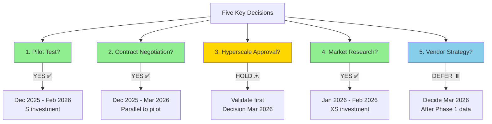
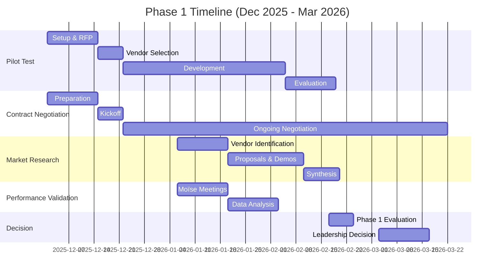

# Part 7: Decision Points & Next Steps

[← Back to Part 6](./part6-strategic-recommendations.md) | [Back to Presentation Index](./index.md)

**Duration:** 5 minutes | **Slides:** 27-29

## PART 7: Decision Points & Next Steps (5 min, Slides 27-29)

### Slide 27: Five Key Decisions for CISAC

**Visual:** Decision matrix

## Strategic Decisions Required (November 2025)

### ✅ DECISION 1: Approve Knowledge Transfer Pilot Test?

| Aspect | Details |
|--------|---------|
| **Investment** | S |
| **Timeline** | December 2025 - February 2026 (S) |
| **Risk** | Very Low (non-critical feature) |
| **RECOMMENDATION** | ✅ **YES (High Priority)** |
| **Rationale** | Single most important data point for vendor independence strategy. Small investment de-risks XL decision. |
| **Action Required** | • Define pilot feature scope<br/>• Identify independent vendors to approach<br/>• Allocate budget approval<br/>• **Timeline:** Start December 2025 |

### ✅ DECISION 2: Initiate Contract Renegotiation?

| Aspect | Details |
|--------|---------|
| **Investment** | Minimal (legal/negotiation time) |
| **Timeline** | December 2025 - March 2026 (parallel to pilot) |
| **Risk** | Low (worst case: status quo continues) |
| **RECOMMENDATION** | ✅ **YES (High Priority)** |
| **Rationale** | Use audit findings as leverage. Better terms achievable whether CISAC stays or switches vendors. |
| **Priority Terms** | • **CRITICAL:** Git history, IaC templates, cost tooling<br/>• **HIGH:** Performance SLAs, enhanced DoD, metrics sharing<br/>• **MEDIUM:** Knowledge transfer docs, ADR practice |
| **Action Required** | • Authorize Yann to lead negotiation<br/>• Define priority vs negotiable terms<br/>• **Timeline:** Initiate December 2025 |

### ⚠️ DECISION 3: Approve Hyperscale Proposal (PSA 5499)?

| Aspect | Details |
|--------|---------|
| **Investment** | €40K migration + €1,800/month savings (Spanish Point proposal) |
| **Timeline** | Migration S after approval |
| **Risk** | Medium (reserved instance = 1-year commitment) |
| **RECOMMENDATION** | ⚠️ **HOLD Pending Validation** |
| **Rationale** | Bottleneck not validated. Query optimization may achieve similar results at lower cost. Secondary priority vs governance issues. |
| **Actions BEFORE Approval** | • Meet with Moïse (production performance data)<br/>• Validate SQL Server bottleneck<br/>• Explore query optimization alternative (XS-S cost)<br/>• Decision by March 2026 with data |

### ✅ DECISION 4: Research Alternative Matching Engine Vendors?

| Aspect | Details |
|--------|---------|
| **Investment** | XS (market research, vendor proposals) |
| **Timeline** | December 2025 - February 2026 (S, parallel) |
| **Risk** | Very Low (research only, no commitment) |
| **RECOMMENDATION** | ✅ **YES (Medium Priority)** |
| **Rationale** | Strengthens negotiating position even if CISAC never switches. Informs long-term strategy. Small cost for high strategic value. |
| **Scope** | • Identify alternative matching engine vendors<br/>• Request proposals and demos<br/>• Assess functionality comparison<br/>• Evaluate API compatibility and integration effort |
| **Action Required** | • Define matching engine requirements spec<br/>• Research music rights technology vendors<br/>• **Timeline:** Start January 2026 |

### ⏸️ DECISION 5: Vendor Relationship Strategy Going Forward?

| Aspect | Details |
|--------|---------|
| **Timeline** | Decision by March 2026 (after Phase 1 results) |
| **Risk** | Depends on path chosen |
| **RECOMMENDATION** | ⏸️ **DEFER Until Phase 1 Complete** |
| **Rationale** | Don't decide today. Wait for:<br/>• Pilot test results (Feb 2026)<br/>• Market research results (Feb 2026)<br/>• Negotiation outcomes (ongoing) |

**Possible Paths (decide with data):**

| Path | Condition | Details |
|------|-----------|---------|
| **Path A: Vendor Transition** | IF: Pilot successful + Alternatives exist | XL timeline, XL cost, high risk, full independence |
| **Path B: Improved Relationship** | IF: Pilot fails OR no alternatives | Immediate, minimal cost, medium risk, better terms |
| **Path C: Partial Independence** | IF: Mixed results | Split model: new vendor (app) + Spanish Point (ME) |

**Decision Timeline:** March 2026 with Phase 1 data

**Alternative: Mermaid Decision Tree**



**Speaker Notes:**

<details>
<summary>ASCII Decision Matrix (fallback)</summary>

```text
Strategic Decisions Required (November 2025)

DECISION 1: Approve Knowledge Transfer Pilot Test?
┌────────────────────────────────────────────────────────┐
│ Investment: S                                           │
│ Timeline: December 2025 - February 2026 (S)            │
│ Risk: Very Low (non-critical feature)                  │
│                                                         │
│ OUR RECOMMENDATION: ✅ YES (High Priority)              │
│                                                         │
│ Rationale: Single most important data point for vendor │
│           independence strategy. Small investment      │
│           de-risks XL decision.                        │
│                                                         │
│ Action Required:                                        │
│ • Define pilot feature scope                           │
│ • Identify independent vendors to approach             │
│ • Allocate budget approval                             │
│ • Timeline: Start December 2025                        │
└────────────────────────────────────────────────────────┘

DECISION 2: Initiate Contract Renegotiation?
┌────────────────────────────────────────────────────────┐
│ Investment: Minimal (legal/negotiation time)           │
│ Timeline: December 2025 - March 2026 (parallel to pilot)│
│ Risk: Low (worst case: status quo continues)          │
│                                                         │
│ OUR RECOMMENDATION: ✅ YES (High Priority)              │
│                                                         │
│ Rationale: Use audit findings as leverage. Better     │
│           terms achievable whether CISAC stays or      │
│           switches vendors.                            │
│                                                         │
│ Priority Terms:                                         │
│ • CRITICAL: Git history, IaC templates, cost tooling  │
│ • HIGH: Performance SLAs, enhanced DoD, metrics sharing│
│ • MEDIUM: Knowledge transfer docs, ADR practice        │
│                                                         │
│ Action Required:                                        │
│ • Authorize Yann to lead negotiation                   │
│ • Define priority vs negotiable terms                  │
│ • Timeline: Initiate December 2025                     │
└────────────────────────────────────────────────────────┘

DECISION 3: Approve Hyperscale Proposal (PSA 5499)?
┌────────────────────────────────────────────────────────┐
│ Investment: €40K migration + €1,800/month savings      │
│            (Spanish Point proposal)                    │
│ Timeline: Migration S after approval                   │
│ Risk: Medium (reserved instance = 1-year commitment)   │
│                                                         │
│ OUR RECOMMENDATION: ⚠️  HOLD Pending Validation        │
│                                                         │
│ Rationale: Bottleneck not validated. Query optimization│
│           may achieve similar results at lower cost.   │
│           Secondary priority vs governance issues.     │
│                                                         │
│ Actions BEFORE Approval:                                │
│ • Meet with Moïse (production performance data)        │
│ • Validate SQL Server bottleneck                       │
│ • Explore query optimization alternative (XS-S cost)   │
│ • Decision by March 2026 with data                     │
└────────────────────────────────────────────────────────┘

DECISION 4: Research Alternative Matching Engine Vendors?
┌────────────────────────────────────────────────────────┐
│ Investment: XS (market research, vendor proposals)     │
│ Timeline: December 2025 - February 2026 (S, parallel)  │
│ Risk: Very Low (research only, no commitment)          │
│                                                         │
│ OUR RECOMMENDATION: ✅ YES (Medium Priority)            │
│                                                         │
│ Rationale: Strengthens negotiating position even if    │
│           CISAC never switches. Informs long-term      │
│           strategy. Small cost for high strategic value.│
│                                                         │
│ Scope:                                                  │
│ • Identify alternative matching engine vendors         │
│ • Request proposals and demos                          │
│ • Assess functionality comparison                      │
│ • Evaluate API compatibility and integration effort    │
│                                                         │
│ Action Required:                                        │
│ • Define matching engine requirements spec             │
│ • Research music rights technology vendors             │
│ • Timeline: Start January 2026                         │
└────────────────────────────────────────────────────────┘

DECISION 5: Vendor Relationship Strategy Going Forward?
┌────────────────────────────────────────────────────────┐
│ Timeline: Decision by March 2026 (after Phase 1 results)│
│ Risk: Depends on path chosen                           │
│                                                         │
│ OUR RECOMMENDATION: ⏸️  DEFER Until Phase 1 Complete   │
│                                                         │
│ Rationale: Don't decide today. Wait for:              │
│           • Pilot test results (Feb 2026)             │
│           • Market research results (Feb 2026)         │
│           • Negotiation outcomes (ongoing)             │
│                                                         │
│ Possible Paths (decide with data):                     │
│                                                         │
│ Path A: Vendor Transition                             │
│   IF: Pilot successful + Alternatives exist           │
│   → XL timeline, XL cost, high risk, full independence│
│                                                         │
│ Path B: Improved Relationship                         │
│   IF: Pilot fails OR no alternatives                  │
│   → Immediate, minimal cost, medium risk, better terms│
│                                                         │
│ Path C: Partial Independence                          │
│   IF: Mixed results                                    │
│   → Split model: new vendor (app) + Spanish Point (ME)│
│                                                         │
│ Decision Timeline: March 2026 with Phase 1 data       │
└────────────────────────────────────────────────────────┘
```

</details>

Let's crystallize the decisions CISAC leadership must make.

**Decision 1: Approve Knowledge Transfer Pilot Test?**

**Our recommendation: ✅ YES (High Priority)**

This is the single most important investment. Small investment to validate the XL vendor switch assumption. Start December 2025.

Actions required:

- Define pilot feature (work with Yann/Moïse)
- Identify independent vendors to approach (French/European .NET shops)
- Allocate budget approval

**Decision 2: Initiate Contract Renegotiation?**

**Our recommendation: ✅ YES (High Priority)**

Use audit findings as leverage. Better terms benefit CISAC whether you stay or switch. Start December 2025, run parallel to pilot test.

Priority terms:

- CRITICAL: Git history access, IaC templates, cost correlation tooling
- HIGH: Performance SLAs, enhanced DoD, proactive metrics
- MEDIUM: Knowledge transfer docs, ADR practice

Action required: Authorize Yann to lead negotiation.

**Decision 3: Approve Hyperscale Proposal?**

**Our recommendation: ⚠️ HOLD Pending Validation**

€40K investment (Spanish Point proposal) + reserved instance commitment requires performance justification we don't have. Validate SQL bottleneck first. Explore query optimization alternative (XS-S cost).

Decision timeline: March 2026 after validation.

This is SECONDARY priority - governance and vendor strategy are more important.

**Decision 4: Research Alternative Matching Engine Vendors?**

**Our recommendation: ✅ YES (Medium Priority)**

Small market research investment. Low cost, high strategic value. Strengthens negotiating position even if CISAC never switches.

Start January 2026.

**Decision 5: Vendor Relationship Strategy Going Forward?**

**Our recommendation: ⏸️ DEFER Until Phase 1 Complete**

Don't decide today. Wait for:

- Pilot test results (February 2026)
- Market research results (February 2026)
- Negotiation outcomes (ongoing through March 2026)

Then decide between Path A (vendor transition), Path B (improved relationship), or Path C (partial independence) with actual data.

Decision timeline: March 2026.

**Summary of Recommendations:**

- ✅ **YES:** Pilot test, contract negotiation, market research
- ⚠️ **HOLD:** Hyperscale proposal (validate first)
- ⏸️ **DEFER:** Final vendor strategy (decide with data in March 2026)

**Discussion Prompt:** Are there other decisions we haven't addressed that CISAC leadership needs to make?

---

### Slide 28: Immediate Next Steps (December 2025 - March 2026)

**Visual:** Action timeline

### DECEMBER 2025 - Launch Phase

#### Week 1-2

| Workstream | Activities |
|------------|------------|
| **Pilot Test Setup** | • Define pilot feature scope (CISAC + Audit Team)<br/>• Identify 3-5 independent vendors (.NET expertise)<br/>• Prepare RFP materials (code, docs, spec)<br/>• Send RFP, collect proposals |
| **Contract Renegotiation Preparation** | • Document audit findings (this presentation + detailed report)<br/>• Prioritize contract terms (critical vs nice-to-have)<br/>• Legal review of current contract<br/>• Schedule negotiation kickoff meeting with Spanish Point |
| **Technical Quick Wins** | • 🔴 **URGENT**: Escalate pipeline test runner fix<br/>• Request Databricks upgrade roadmap (due Dec 31)<br/>• Schedule January cost review meeting |

#### Week 3-4

| Workstream | Activities |
|------------|------------|
| **Pilot Test Launch** | • Select pilot vendor (evaluation of proposals)<br/>• Contract signed, NDA in place<br/>• Kickoff meeting, materials delivered<br/>• Development begins |
| **Contract Negotiation Kickoff** | • Present audit findings to Spanish Point<br/>• Request git history access (immediate priority)<br/>• Request IaC templates inclusion<br/>• Discuss cost correlation tooling options |

### JANUARY 2026 - Execution Phase

#### Week 1-2

| Workstream | Activities |
|------------|------------|
| **Pilot Test Monitoring** | • Weekly check-ins with pilot vendor<br/>• Track questions, challenges, progress<br/>• Document Spanish Point cooperation level |
| **Matching Engine Market Research** | • Identify alternative vendors (music rights tech)<br/>• Request proposals and technical documentation<br/>• Schedule vendor demos/presentations |
| **Performance Validation** | • Meet with Moïse (production metrics, user complaints)<br/>• Review Application Insights data (SQL performance)<br/>• Document actual vs. claimed performance |

#### Week 3-4

| Workstream | Activities |
|------------|------------|
| **Monthly Cost Review (First Meeting)** | • CISAC + Spanish Point + Finance<br/>• Review Dec 2025 spending<br/>• Manually correlate with usage (until tooling exists)<br/>• Identify anomalies, action items |
| **Contract Negotiation Progress** | • Git history access resolved? (should be immediate)<br/>• IaC templates negotiation status<br/>• Cost correlation tooling commitment<br/>• Enhanced DoD discussion |

### FEBRUARY 2026 - Evaluation Phase

#### Week 1-2

| Workstream | Activities |
|------------|------------|
| **Pilot Test Completion** | • Feature delivery deadline<br/>• UAT testing and validation<br/>• Code quality review<br/>• Comprehensive evaluation report |
| **Market Research Synthesis** | • Evaluate alternative matching engine proposals<br/>• Compare functionality, cost, integration effort<br/>• Document feasibility assessment<br/>• Prepare summary for leadership |

#### Week 3-4

| Workstream | Activities |
|------------|------------|
| **Pilot Test Debrief** | • Internal evaluation: Success/Partial/Failure?<br/>• Document lessons learned<br/>• Assess knowledge transfer viability<br/>• Decision: Proceed with RFP or focus on relationship improvement? |
| **Hyperscale Decision Preparation** | • Review Moïse performance validation<br/>• Assess query optimization feasibility (€5-10K alternative)<br/>• Validate SQL bottleneck claim<br/>• Prepare recommendation for leadership |

### MARCH 2026 - Decision Phase

#### Week 1-2

| Workstream | Activities |
|------------|------------|
| **Leadership Decision Meeting** | • Present Phase 1 results (pilot, research, negotiation)<br/>• Recommend Path A/B/C based on data<br/>• Decision: Vendor switch vs improved relationship vs partial independence<br/>• Budget allocation for Phase 2 |
| **Hyperscale Proposal Decision** | • Approve, reject, or modify based on validation<br/>• If approved: Plan migration (Q2 2026)<br/>• If rejected: Implement query optimization alternative<br/>• Decouple networking security if valuable independently |

#### Week 3-4

| Workstream | Activities |
|------------|------------|
| **Phase 2 Planning** | • Based on strategic decision, plan next 6-12 months<br/>• Budget allocation and resource planning<br/>• Vendor engagement (if transition chosen)<br/>• Governance improvement roadmap (if relationship improvement chosen) |

### Responsibilities

| Team | Responsibilities |
|------|------------------|
| **CISAC**<br/>(Yann + Moïse + Finance) | • Pilot feature definition<br/>• Vendor selection and contracting<br/>• Contract negotiation leadership<br/>• Monthly cost review participation<br/>• Performance validation (Moïse operational data)<br/>• Strategic decision making (March 2026) |
| **Spanish Point** | • Git history access delivery (December)<br/>• Databricks upgrade roadmap (December)<br/>• 🔴 Pipeline test runner fix (URGENT)<br/>• Cost correlation tooling discussion<br/>• Contract negotiation participation<br/>• Pilot vendor handover cooperation |
| **Audit Team**<br/>(Teragone-Factory) | • Pilot test RFP preparation<br/>• Market research coordination<br/>• Contract negotiation support (advisory)<br/>• Performance validation analysis<br/>• Final report delivery (end Nov 2025)<br/>• Phase 1 evaluation synthesis (Feb 2026) |

**Alternative: Mermaid Gantt Chart**



**Speaker Notes:**

Let's translate strategy into action. Here's the concrete timeline for the next 4 months.

<details>
<summary>ASCII Timeline (fallback)</summary>

```text
Phase 1 Implementation Timeline (Dec 2025 - Mar 2026)

DECEMBER 2025 - Launch Phase
Week 1-2:
  ☐ Pilot Test Setup
     ├─ Define pilot feature scope (CISAC + Audit Team)
     ├─ Identify 3-5 independent vendors (.NET expertise)
     ├─ Prepare RFP materials (code, docs, spec)
     └─ Send RFP, collect proposals

  ☐ Contract Renegotiation Preparation
     ├─ Document audit findings (this presentation + detailed report)
     ├─ Prioritize contract terms (critical vs nice-to-have)
     ├─ Legal review of current contract
     └─ Schedule negotiation kickoff meeting with Spanish Point

  ☐ Technical Quick Wins
     ├─ URGENT: Escalate pipeline test runner fix
     ├─ Request Databricks upgrade roadmap (due Dec 31)
     └─ Schedule January cost review meeting

Week 3-4:
  ☐ Pilot Test Launch
     ├─ Select pilot vendor (evaluation of proposals)
     ├─ Contract signed, NDA in place
     ├─ Kickoff meeting, materials delivered
     └─ Development begins

  ☐ Contract Negotiation Kickoff
     ├─ Present audit findings to Spanish Point
     ├─ Request git history access (immediate priority)
     ├─ Request IaC templates inclusion
     └─ Discuss cost correlation tooling options

JANUARY 2026 - Execution Phase
Week 1-2:
  ☐ Pilot Test Monitoring
     ├─ Weekly check-ins with pilot vendor
     ├─ Track questions, challenges, progress
     └─ Document Spanish Point cooperation level

  ☐ Matching Engine Market Research
     ├─ Identify alternative vendors (music rights tech)
     ├─ Request proposals and technical documentation
     └─ Schedule vendor demos/presentations

  ☐ Performance Validation
     ├─ Meet with Moïse (production metrics, user complaints)
     ├─ Review Application Insights data (SQL performance)
     └─ Document actual vs. claimed performance

Week 3-4:
  ☐ Monthly Cost Review (First Meeting)
     ├─ CISAC + Spanish Point + Finance
     ├─ Review Dec 2025 spending
     ├─ Manually correlate with usage (until tooling exists)
     └─ Identify anomalies, action items

  ☐ Contract Negotiation Progress
     ├─ Git history access resolved? (should be immediate)
     ├─ IaC templates negotiation status
     ├─ Cost correlation tooling commitment
     └─ Enhanced DoD discussion

FEBRUARY 2026 - Evaluation Phase
Week 1-2:
  ☐ Pilot Test Completion
     ├─ Feature delivery deadline
     ├─ UAT testing and validation
     ├─ Code quality review
     └─ Comprehensive evaluation report

  ☐ Market Research Synthesis
     ├─ Evaluate alternative matching engine proposals
     ├─ Compare functionality, cost, integration effort
     ├─ Document feasibility assessment
     └─ Prepare summary for leadership

Week 3-4:
  ☐ Pilot Test Debrief
     ├─ Internal evaluation: Success/Partial/Failure?
     ├─ Document lessons learned
     ├─ Assess knowledge transfer viability
     └─ Decision: Proceed with RFP or focus on relationship improvement?

  ☐ Hyperscale Decision Preparation
     ├─ Review Moïse performance validation
     ├─ Assess query optimization feasibility (€5-10K alternative)
     ├─ Validate SQL bottleneck claim
     └─ Prepare recommendation for leadership

MARCH 2026 - Decision Phase
Week 1-2:
  ☐ Leadership Decision Meeting
     ├─ Present Phase 1 results (pilot, research, negotiation)
     ├─ Recommend Path A/B/C based on data
     ├─ Decision: Vendor switch vs improved relationship vs partial independence
     └─ Budget allocation for Phase 2

  ☐ Hyperscale Proposal Decision
     ├─ Approve, reject, or modify based on validation
     ├─ If approved: Plan migration (Q2 2026)
     ├─ If rejected: Implement query optimization alternative
     └─ Decouple networking security if valuable independently

Week 3-4:
  ☐ Phase 2 Planning
     ├─ Based on strategic decision, plan next 6-12 months
     ├─ Budget allocation and resource planning
     ├─ Vendor engagement (if transition chosen)
     └─ Governance improvement roadmap (if relationship improvement chosen)

Responsibilities:

CISAC (Yann + Moïse + Finance):
├─ Pilot feature definition
├─ Vendor selection and contracting
├─ Contract negotiation leadership
├─ Monthly cost review participation
├─ Performance validation (Moïse operational data)
└─ Strategic decision making (March 2026)

Spanish Point:
├─ Git history access delivery (December)
├─ Databricks upgrade roadmap (December)
├─ Pipeline test runner fix (URGENT)
├─ Cost correlation tooling discussion
├─ Contract negotiation participation
└─ Pilot vendor handover cooperation

Audit Team (Teragone-Factory):
├─ Pilot test RFP preparation
├─ Market research coordination
├─ Contract negotiation support (advisory)
├─ Performance validation analysis
├─ Final report delivery (end Nov 2025)
└─ Phase 1 evaluation synthesis (Feb 2026)
```

</details>

**December 2025 - Launch Phase:**

Pilot test setup is the priority. Define the feature, identify vendors, send RFPs. Simultaneously, prepare contract renegotiation - document audit findings, prioritize terms, schedule kickoff with Spanish Point.

URGENT: Escalate the pipeline test runner fix. This is blocking since November 4 - unacceptable.

**January 2026 - Execution Phase:**

Pilot vendor begins development. Monitor weekly - track questions, challenges, Spanish Point cooperation.

Start matching engine market research - who else offers music rights matching? Request proposals.

Meet with Moïse - get the operational truth about performance. User complaints, actual metrics, pain points.

First monthly cost review meeting - CISAC + Spanish Point + Finance. Review December spending, correlate with usage manually until tooling exists.

**February 2026 - Evaluation Phase:**

Pilot test completes. Feature delivered, tested, evaluated. Success? Partial? Failure?

Market research synthesized - alternatives exist? Viable? Compatible?

Hyperscale decision preparation - validate SQL bottleneck based on Moïse data and Application Insights analysis.

**March 2026 - Decision Phase:**

Leadership meeting - present Phase 1 results. Recommend Path A/B/C based on evidence, not assumptions.

Hyperscale decision - approve/reject/modify based on validation.

Phase 2 planning - execute the chosen strategy with confidence.

**Responsibilities are clear:**

CISAC leads pilot, negotiation, decisions. Spanish Point delivers fixes and cooperates. Audit team supports with analysis and advisory.

**This is a 4-month sprint to gather the data CISAC needs to make a multi-million-euro strategic decision responsibly.**

---

### Slide 29: Thank You & Discussion

**Visual:** Simple closing slide

## Thank You

## Questions & Discussion

---

### Key Contacts

| Team | Contacts |
|------|----------|
| **Audit Team (Teragone-Factory)** | • Guillaume Jay<br/>• Bastien Gallay |
| **Final Report Delivery** | End of November 2025 |
| **Next Meeting** | TBD (Phase 1 results review - February 2026) |

---

### Today's Key Messages

| Message | Details |
|---------|---------|
| ✅ **Platform is technically solid** | Not the problem |
| 🔴 **Governance and control are the challenges** | The real issues |
| 🧪 **Test knowledge transfer before committing** | €10-20K pilot de-risks €300-600K decision |
| 💪 **Use audit findings as leverage** | Better contract terms achievable |
| 📊 **Decide with data (March 2026)** | Not assumptions (today) |

---

### Open Discussion Topics

| Category | Questions |
|----------|-----------|
| **Pilot Test** | • Which pilot feature makes most sense?<br/>• What vendors should we approach for pilot test? |
| **Contract** | • Which contract terms are highest priority for CISAC? |
| **Performance** | • What performance issues have users actually reported? |
| **Timeline** | • Timeline feasibility - can we execute Phase 1 by March 2026? |
| **Budget** | • Budget allocation - approval for pilot test and market research? |
| **Other** | • Other concerns or questions from CISAC leadership? |

**Speaker Notes:**

<details>
<summary>ASCII Closing Slide (fallback)</summary>

```text
Thank You

Questions & Discussion

───────────────────────────────────────────────────

Key Contacts:

Audit Team (Teragone-Factory):
  Guillaume Jay
  Bastien Gallay

Final Report Delivery: End of November 2025

Next Meeting: TBD (Phase 1 results review - February 2026)

───────────────────────────────────────────────────

Today's Key Messages:

✓ Platform is technically solid - not the problem
✓ Governance and control are the challenges
✓ Test knowledge transfer before committing to vendor switch
✓ Use audit findings as leverage for better contract terms
✓ Decide with data (March 2026), not assumptions (today)

───────────────────────────────────────────────────

Open Discussion Topics:

• Which pilot feature makes most sense?
• What vendors should we approach for pilot test?
• Which contract terms are highest priority for CISAC?
• What performance issues have users actually reported?
• Timeline feasibility - can we execute Phase 1 by March 2026?
• Budget allocation - approval for pilot test and market research?
• Other concerns or questions from CISAC leadership?
```

</details>

Thank you for your time and attention.

We've covered a lot of ground today - from the audit journey to technical findings to strategic recommendations. Let's open the floor for discussion.

**Key messages to remember:**

1. **The platform is technically solid.** Architecture is well-designed, code quality is reasonable, auto-scaling works. These are not the problems.

2. **Governance and control are the challenges.** The May 2024 incident, access delays, cost control gaps, transparency issues - these are organizational and relationship issues, not technical failures.

3. **Test knowledge transfer before committing.** The €10-20K pilot test is the most important investment we're recommending. It de-risks the €300-600K vendor switch decision.

4. **Use audit findings as leverage.** CISAC has negotiating power - use it. Better contract terms are achievable whether you stay or switch.

5. **Decide with data in March 2026, not assumptions today.** Run the pilot. Do the research. Gather the evidence. Then decide.

**Final deliverable:**

We'll deliver the comprehensive final audit report by end of November 2025. It will include all the details, references, and analysis supporting today's presentation.

**Next meeting:**

We propose a Phase 1 results review in February 2026 - evaluate pilot test outcomes, market research findings, and negotiation progress. At that point, we can provide updated recommendations based on actual results.

**Open discussion:**

What questions do you have? What concerns need addressing? What decisions can we help clarify?

---

[← Back to Part 6](./part6-strategic-recommendations.md) | [Back to Presentation Index](./index.md)
