# Timeline Alternatives Preview

This document contains 5 different visual representations of the audit journey timeline for comparison.

---

## Alternative 1: Mermaid Gantt-Style Timeline

---

## Alternative 2: Mermaid Timeline with Event Cards

---

## Alternative 3: Mermaid Roadmap with Phases

```mermaid
graph LR
    subgraph Phase1[" "]
        direction TB
        P1H["Phase 1: Discovery<br/>Oct 7-21"]
        A1["🎯 Relaunch<br/>Oct 7"]
        A2["🤝 Workshops<br/>Oct 20-21"]
        A3["⚠️ Challenges<br/>Revealed"]
        P1H -.-> A1
        A1 --> A2 --> A3
    end

    subgraph Phase2[" "]
        direction TB
        P2H["Phase 2: Strategic Pivot<br/>Oct 30"]
        B1["🔄 Checkpoint<br/>Accept constraints"]
        B2["📊 Status<br/>12/20 days used"]
        P2H -.-> B1
        B1 --> B2
    end

    subgraph Phase3[" "]
        direction TB
        P3H["Phase 3: Investigation<br/>Nov 5-6"]
        C1["🔍 Deep-Dive<br/>Workshops"]
        C2["💻 Code Access<br/>.NET 8"]
        C3["✅ 75% Complete<br/>High confidence"]
        P3H -.-> C1
        C1 --> C2 --> C3
    end

    subgraph Phase4[" "]
        direction TB
        P4H["Phase 4: Synthesis<br/>Nov 24"]
        D1["📊 First<br/>Restitution"]
        P4H -.-> D1
    end

    Phase1 ==> Phase2
    Phase2 ==> Phase3
    Phase3 ==> Phase4

    classDef phase1Style fill:#e6f3ff,stroke:#0066cc,stroke-width:2px
    classDef phase2Style fill:#fff4cc,stroke:#ff9900,stroke-width:2px
    classDef phase3Style fill:#e6ffe6,stroke:#00cc00,stroke-width:2px
    classDef phase4Style fill:#ccffcc,stroke:#009900,stroke-width:3px
    classDef headerStyle fill:#f0f0f0,stroke:#666,stroke-width:1px,color:#333

    class A1,A2,A3 phase1Style
    class B1,B2 phase2Style
    class C1,C2,C3 phase3Style
    class D1 phase4Style
    class P1H,P2H,P3H,P4H headerStyle
```

---

## Alternative 4: HTML Timeline - Version 1 (Linear Layout)

**Design:** Points above cards, horizontal line behind points, all cards aligned below

**[View V1 (Linear) →](timeline-alternative-v1.html)**

**Strengths:**
- Clean, simple linear progression
- Easy to scan top-to-bottom
- Consistent card positioning

---

## Alternative 5: HTML Timeline - Version 2 (Alternating Layout)

**Design:** Cards alternating above/below line, points centered on line, wider cards

**[View V2 (Alternating) →](timeline-alternative-v2.html)**

**Strengths:**
- Dynamic visual balance
- More space for card content (wider cards)
- Professional alternating layout
- Points perfectly aligned on timeline

---

## Alternative 6: SVG Timeline (Compact Modern Design)

**Note:** SVG doesn't render in all markdown viewers.

**[View full SVG version →](timeline-alternative-preview.svg)**

Preview:

---

## Comparison Summary

| Version | Format | Strengths | Weaknesses | Best For |
|---------|--------|-----------|------------|----------|
| **Alt 1** | Mermaid Gantt | Shows duration/overlap, professional | Can feel technical/PM-heavy | Project managers, detailed timeline |
| **Alt 2** | Mermaid Timeline | Clean, modern, easy to read | Less visual flexibility | Quick overview, simple narrative |
| **Alt 3** | Mermaid Roadmap | Shows phases clearly, color-coded | More complex, needs space | Emphasizing project evolution |
| **Alt 4** | HTML V1 (Linear) | Simple, consistent layout | All cards below line | Clean presentation, simple story |
| **Alt 5** | HTML V2 (Alternating) | Dynamic, wider cards, balanced | More complex layout | Maximum visual impact for slides |
| **Alt 6** | SVG | Compact, professional, resolution-independent | Harder to modify manually | Final polished presentation |

## Recommendations

**For presentation slides:** Alternative 5 (HTML V2 - Alternating) for maximum visual impact and content space

**For documentation/markdown:** Alternative 2 (Mermaid Timeline) for simplicity and compatibility

**For emphasizing phases:** Alternative 3 (Mermaid Roadmap) to show strategic evolution

**For simple linear story:** Alternative 4 (HTML V1 - Linear) for clean, easy-to-follow progression
