# ISWC System Audit - First Conclusions Presentation

**Presentation Date:** November 24, 2025
**Duration:** 1.5 hours (45 min presentation + 45 min discussion)
**Audience:** CISAC Piloting Committee (Yann Lebreuilly, stakeholders)
**Presenters:** Teragone-Factory (Guillaume Jay, Bastien Gallay)

**Document Purpose:** This document provides the complete presentation structure with slide outlines, detailed speaker notes, supporting data, and discussion prompts for the first audit restitution.

---

## Table of Contents

- [Part 1: The Journey](#part-1-the-journey-5-min-slides-1-3)
- [Part 2: Executive Summary](#part-2-executive-summary-5-min-slides-4-6)
- [Part 3: Technical Findings](#part-3-technical-findings-10-min-slides-7-12)
- [Part 4: Governance Findings](#part-4-governance-findings-8-min-slides-13-17)
- [Part 5: Vendor Lock-in Reality](#part-5-vendor-lock-in-reality-7-min-slides-18-21)
- [Part 6: Strategic Recommendations](#part-6-strategic-recommendations-10-min-slides-22-26)
- [Part 7: Decision Points & Next Steps](#part-7-decision-points--next-steps-5-min-slides-27-29)
- [Annex A: Detailed Findings Reference](#annex-a-detailed-findings-reference)
- [Annex B: Stakeholder Quotes](#annex-b-stakeholder-quotes)
- [Annex C: Validation Rules Reference](#annex-c-validation-rules-reference)
- [Annex D: Items Needing Verification](#annex-d-items-needing-verification)
- [Executive Summary for Review](#executive-summary-for-review)

---

## PART 1: The Journey (5 min, Slides 1-3)

### Slide 1: Title Slide

**Visual:** CISAC logo, audit team branding

```
ISWC System Audit
First Conclusions & Strategic Recommendations

Teragone-Factory
Guillaume Jay & Bastien Gallay

November 24, 2025
```

**Speaker Notes:**

Good morning/afternoon. Thank you for your time today. Over the past six weeks, we've conducted a comprehensive audit of your ISWC system. What started as a technical assessment evolved into something much more strategic - an evaluation of vendor independence and governance.

Today we'll share what we found, what it means, and most importantly, what we recommend CISAC do next.

---

### Slide 2: The Audit Journey - How We Got Here

**Visual:** Timeline infographic with key milestones

```
The Audit Evolution

October 7, 2025
├─ Relaunch meeting with Yann
├─ Scope refinement: vendor independence focus
└─ Budget: 20 man-days

October 20-21, 2025
├─ Initial workshops with Spanish Point
├─ Access challenges revealed
└─ Strategic pivot discussion

October 30, 2025
├─ Checkpoint meeting
├─ Accept constraints, focus on value
└─ 12/20 days consumed

November 5-6, 2025
├─ Technical deep-dive workshops completed
├─ Code access granted (.NET 8)
└─ Investigation phase complete (75% progress)

November 24, 2025
└─ First restitution (today)
```

**Key Statistics Box:**

- 20 man-days budget (12 consumed in investigation, 8 for synthesis)
- 6+ workshops with Spanish Point
- 343 Azure resources analyzed
- 42+ source code files reviewed (Matching Engine integration)
- 95+ validation rules documented

**Speaker Notes:**

Our audit journey has been revealing. We started October 7 with what seemed like a straightforward technical assessment - validate the infrastructure upgrade proposal, assess the architecture, identify technical debt.

But in our very first conversation with Yann, something became clear: the real question wasn't "is this system technically sound?" The question was "does CISAC control this system?"

**[Reference: docs/meetings/20251007-recadrage.md - Yann's strategic context]**

This shifted everything. By October 21, after our first workshops with Spanish Point, we had a frank discussion about what CISAC actually needs from this audit. Yann stated it directly:

> "Ma vision moyen terme, c'est de me passer de eux" - "My medium-term vision is to get rid of them."

**[Reference: docs/meetings/20251021-ISWC - Discussion Yann_Guillaume_Bastien.txt, Line 27:54]**

Not because the system is bad - but because CISAC cannot manage a strategic information system without control.

We spent 25% of our audit duration waiting for code access. We encountered systematic questions about "for what purpose?" when requesting information. We documented governance gaps and transparency issues.

On October 30, we made a strategic decision: accept the constraints we cannot change within this audit's scope, and focus on delivering maximum value with the access we have. We stopped trying to run the code locally (too time-intensive), and focused on static analysis, architecture documentation, and strategic assessment.

By November 6, we completed the investigation phase with high confidence in our findings. Today, we share those conclusions.

---

### Slide 3: The Strategic Pivot - What This Audit Became

**Visual:** Two-column comparison

```
What We Were Asked To Do          →    What We Actually Discovered

✓ Validate Hyperscale proposal     →    ⚠️  Cost control gap (€600K/year)
✓ Assess architecture quality      →    ✓  Platform technically sound
✓ Identify technical debt          →    ✓  Recently upgraded, well-maintained
✓ Migration roadmap                →    ⚠️  Governance gaps are the real issue
                                   →    🔴 Vendor independence unknown
                                   →    🔴 Knowledge transfer HIGH RISK
```

**Key Insight Box:**

> "The platform is solid. Control is the problem."

**Speaker Notes:**

Here's what we learned: the ISWC platform is technically sound. The architecture is well-designed. The code quality is reasonable. Auto-scaling is working correctly. Spanish Point upgraded you to .NET 8 just before this audit.

**These are not the problems.**

The problems are:

1. **Governance gaps** - A May 2024 production incident that took 6 months to recover from, caused by POC code accidentally merged to production. No deployment tracking existed until Yann established a CAB in response.

2. **Cost control gap** - €50,000/month cloud spending with no automated correlation between usage and costs. Financial stakeholders cannot explain monthly variations.

3. **Vendor transparency** - Systematic defensive posture, access requests questioned, information shared reluctantly.

4. **Knowledge transfer viability** - Unknown whether another vendor could maintain this system. Minimal code comments, significant duplication, "knowledge locked in people's heads."

5. **Vendor lock-in mechanisms** - Matching Engine (contractual restriction), IaC templates (proprietary library), implicit knowledge (no onboarding process).

**[Reference: Multiple sources - see Annex B for detailed quotes]**

This audit became an assessment of CISAC's ability to control its own strategic infrastructure. Everything we found must be evaluated through that lens.

**Discussion Prompt:** Does this evolution match CISAC's understanding of the situation?

---

## PART 2: Executive Summary (5 min, Slides 4-6)

### Slide 4: The Good News - Platform Technically Sound

**Visual:** Green checkmarks with supporting evidence

```
✅ Platform Quality Assessment

Architecture
  ✓ Well-designed C4 architecture (12 containers, clean separation)
  ✓ Matching Engine physically separated (REST API integration)
  ✓ Azure-native services with industry-standard patterns

Code Quality
  ✓ Well-structured, easy to navigate
  ✓ Dependency injection, interface abstractions
  ✓ Clean separation of concerns (Controllers, Services, Repositories)

Recent Upgrades
  ✓ .NET 3.1 → .NET 8.0 (upgraded Nov 4, 2025)
  ✓ React 16.12 → 18.3.1
  ✓ TypeScript 3.7.3 → 5.6.3
  ✓ Entity Framework 3.1 → 8.0
  ✓ Security vulnerabilities addressed

DevOps Maturity
  ✓ Fully automated CI/CD pipeline (20-30 min build + test + deploy)
  ✓ 700+ automated tests
  ✓ Multi-stage deployment (Dev → UAT → Production)
  ✓ Auto-scaling functioning correctly (cost variations = feature, not bug)

Performance
  ✓ No significant issues reported in past year
  ✓ Auto-scaling handling load variations
  ✓ Monitoring alerts configured (CPU >80% = email)
```

**Speaker Notes:**

Let's start with the good news - and there's a lot of it.

**Architecture:** The system is well-architected. We documented the full C4 model - 12 containers with clear responsibilities, clean separation between components. The Matching Engine, despite being a lock-in concern, is properly separated via REST API (not embedded code). This is good engineering.

**[Reference: docs/work_in_progress/architecture/ - C4 models]**

**Code Quality:** When we finally got access to the code, our first impression was "not bad." The codebase is well-structured, easy to navigate. Bastien and Guillaume both noted it follows good practices - dependency injection, interface abstractions, proper layering.

**Recent Upgrades:** Spanish Point just upgraded the entire platform from .NET 3.1 (which went end-of-life in December 2022) to .NET 8. This is significant - they addressed a major technical debt item. React, TypeScript, Entity Framework all updated to modern versions. Security vulnerabilities from outdated packages addressed.

**[Reference: docs/work_in_progress/code_analysis/iswc-v2-upgrade-analysis-2025-11-04.md]**

**DevOps:** The CI/CD pipeline is fully automated. 700+ tests run on every build. Zero manual deployment steps. Build, test, package, deploy - one click per environment with approval gates. This is mature DevOps.

**[Reference: docs/meetings/20251105-[ISWC Audit]CI_CD Pipeline Deep Dive-transcript.txt]**

**Performance:** Spanish Point claims no significant performance issues in the past year. Auto-scaling is configured and working - the monthly cost variations we see are evidence of this (costs go down in December when usage drops, up in February when agencies upload more files).

**[Reference: docs/meetings/20251106-[ISWC Audit]Cloud Cost Breakdown ＆ Infrastructure Configuration-transcript.txt]**

**The platform works. It's well-built. It's recently upgraded. This is important context for everything that follows.**

---

### Slide 5: The Challenge - Where Control is Missing

**Visual:** Warning indicators with severity levels

```
⚠️  Governance & Control Challenges

🔴 CRITICAL: Vendor Lock-in Mechanisms
   • Matching Engine source code (contractual restriction - only on termination)
   • IaC templates (proprietary Smart AIM library - not included in delivery)
   • Implicit knowledge (minimal comments, no onboarding process)

🔴 CRITICAL: Knowledge Transfer Viability Unknown
   • "Even for them, onboarding new developers must be hard"
   • Code duplication, minimal documentation
   • No local dev environment feasible within audit timeframe
   • WARNING: Cannot confirm another vendor could maintain this

🔴 CRITICAL: Cost Control Gap
   • €600K/year spending (€50K/month average)
   • No automated correlation: usage metrics → Azure costs
   • Cannot explain monthly variations to stakeholders
   • "Noisy neighbor" agencies identified but no allocation model

🟠 HIGH: Governance Gaps
   • May 2024 production incident: 6 months recovery time
   • No deployment tracking pre-CAB (May 2024)
   • Definition of Done incomplete (docs not updated)
   • Transparency issues with vendor relationship

🟡 MEDIUM: Technical Debt Remaining
   • Databricks 10.4 LTS outdated (modern features missing)
   • .NET 8 support ends Nov 2026 (only 2 years)
   • Pipeline test runner blocked post-upgrade (workaround active)
   • Code duplication needs refactoring
```

**Speaker Notes:**

Now the challenges. These are not technical failures - they are control gaps.

**Vendor Lock-in (CRITICAL):**

We identified three lock-in mechanisms:

1. **Matching Engine contractual restriction** - The source code is only accessible upon contract termination. This creates a catch-22: you cannot assess alternatives without leaving your current vendor. And as Yann noted, even if you got the code, "we wouldn't be able to maintain it ourselves."

   **[Reference: docs/meetings/20251030-Audit ISWC - Point de passage.txt]**

2. **IaC proprietary library** - The infrastructure-as-code templates and CI/CD pipeline definitions are NOT included in the source code delivery. Spanish Point considers these part of their "Smart AIM library." If you switch vendors, you must either (a) reverse-engineer 343 Azure resources from the portal, or (b) license the Smart AIM library for your new vendor.

   **[Reference: docs/meetings/20251105-[ISWC Audit]CI_CD Pipeline Deep Dive-transcript.txt]**

3. **Implicit knowledge** - Very little code commenting. Significant duplication. No onboarding process. Knowledge locked in developers' heads. Guillaume said it bluntly: "Even for them, onboarding new developers must be hard."

   **[Reference: docs/meetings/20251030-Audit ISWC - Point de passage.txt]**

**Knowledge Transfer Risk (CRITICAL):**

This is the biggest unknown. Can another vendor take over this system? We don't know. The code is readable but under-documented. The architecture is complex ("tentacular" dependencies). Spanish Point themselves warned us: "You're going to be surprised... it's actually very complicated."

**Before CISAC commits to any vendor switch strategy, this must be tested.** We recommend a pilot: assign a small feature to an independent vendor. See if they can deliver with only the handover materials available. This is a €10-20K litmus test for a multi-million-euro strategic decision.

**Cost Control Gap (CRITICAL):**

€600K/year is being spent with no automated correlation between usage and costs. When we asked Spanish Point if there's tooling to correlate monthly cost spikes with usage patterns, Xiyuan said: "Not really... there's no tooling."

**[Reference: docs/meetings/20251106-[ISWC Audit]Cloud Cost Breakdown ＆ Infrastructure Configuration-transcript.txt, Bastien question ~1:15:00]**

Cost investigations require manual support tickets. Spanish Point can dig into specific months, but logs are only kept 3 months. There's no proactive monitoring.

They acknowledged "noisy neighbor" agencies - a few agencies drive most of the costs - but no allocation model exists. All agencies pay flat rates regardless of usage.

**Governance Gaps (HIGH):**

The May-June 2024 production incident speaks volumes. POC code from an unrelated project was merged to the production branch and deployed. It took 6 months to recover. Yann's words: "Six mois de galère, d'incidents incessants" (six months of hell, incessant incidents).

**[Reference: docs/meetings/20251021-ISWC - Discussion Yann_Guillaume_Bastien.txt, Line 41:40]**

Why did this happen? Because there was no deployment tracking, no change control, no governance. Spanish Point "did everything when they wanted without even warning." Yann established the CAB in response - reactively, not proactively.

**[Reference: docs/meetings/20251021-ISWC - Discussion Yann_Guillaume_Bastien.txt, Line 11:00]**

The Definition of Done doesn't include documentation updates. Specs drift from implementation. Knowledge accumulates in people's heads instead of in shared artifacts.

**Discussion Prompt:** Which of these challenges resonates most with your experience?

---

### Slide 6: Three Critical Findings

**Visual:** Three colored boxes with icons

```
🔴 FINDING 1: Vendor Lock-in is Real, But Manageable
   Status: Technically separated, contractually/organizationally coupled
   Impact: Vendor switch = 12-24 months, €300-600K (preliminary estimate)
   Key Unknown: Matching Engine alternatives exist?

🔴 FINDING 2: Knowledge Transfer Viability is Unknown (HIGHEST RISK)
   Status: Cannot confirm maintainability by third party
   Impact: Vendor switch may be infeasible regardless of technical quality
   Key Unknown: Can independent vendor deliver with available materials?

🔴 FINDING 3: Cost Control Gap is Solvable
   Status: €600K/year with no correlation tooling
   Impact: Cannot explain spending, cannot forecast, cannot optimize
   Key Unknown: What are the actual cost drivers month-to-month?
```

**Bottom Banner:**

> "Technical quality is good. Governance and control are the gaps."

**Speaker Notes:**

Let me synthesize this into three critical findings:

**Finding 1: Vendor lock-in is real, but manageable.**

The good news: the Matching Engine is physically separated via REST API. The application code is reasonably structured. A vendor switch is technically possible.

The bad news: it would take 12-24 months and cost an estimated €300-600K. These are preliminary numbers with LOW confidence - we need detailed vendor proposals to validate. The Matching Engine is contractually restricted. IaC must be rebuilt or licensed. Knowledge transfer is unproven.

The key unknown: Do alternative matching engines exist that could replace Spanish Point's solution? We haven't researched the market. This should be CISAC's next step - not to commit to switching, but to understand your options.

**Finding 2: Knowledge transfer viability is unknown - THIS IS THE HIGHEST RISK.**

Everything else we can estimate, analyze, plan for. But we cannot confirm whether another vendor could actually maintain this system.

The code is readable, yes. The architecture is documented, yes. But:

- Minimal code comments mean business logic is implicit
- Significant duplication increases cognitive load
- No local dev environment setup guide
- No "how to contribute" onboarding
- Spanish Point's own warning: "Many developers touched it and modified it"

**Before CISAC makes any strategic decision about vendor independence, you MUST test this.** Assign a small feature to an independent vendor. Give them the source code, documentation, and a feature spec. See if they can deliver. See what questions they ask. See how Spanish Point responds to handover requests.

This is a €10-20K investment to de-risk a potentially multi-million-euro strategic mistake.

**Finding 3: Cost control gap is solvable.**

Unlike the first two findings (which are strategic challenges requiring months to address), the cost control gap can be solved relatively quickly.

The auto-scaling is working correctly. The cost variations are evidence of this - December drops, February peaks match usage patterns. The architecture is cost-efficient.

What's missing: **visibility**. CISAC's financial stakeholders cannot explain why costs went up 10% in February. There's no automated dashboard showing "API calls increased 15%, Cosmos DB throughput scaled up, Databricks processed 20% more files = €5K additional spend."

Spanish Point should provide this. If they won't or can't, CISAC can build it using API Management analytics + Azure Cost Management APIs. This is a 2-3 month development effort, not a multi-year strategic challenge.

**These three findings drive all our recommendations.**

**Discussion Prompt:** Are there other critical findings you expected to see that are missing?

---

## PART 3: Technical Findings (10 min, Slides 7-12)

### Slide 7: Architecture Assessment - Clean Separation

**Visual:** Simplified C4 Context diagram

```
System Context (C4 Level 1)

External Systems          ISWC Platform          External Users
┌─────────────┐          ┌─────────────┐         ┌──────────────┐
│ FastTrack   │─────────▶│   Agency    │◀────────│   Music      │
│ SSO         │          │   Portal    │         │   Societies  │
└─────────────┘          │   (React)   │         │   (Agencies) │
                         └─────────────┘         └──────────────┘
┌─────────────┐                 │
│ Swiss API   │─────────▶┌─────────────┐         ┌──────────────┐
│ (External)  │          │  Agency API │         │   CISAC      │
└─────────────┘          │  (.NET 8)   │◀────────│   Staff      │
                         └─────────────┘         └──────────────┘
┌─────────────┐                 │
│ Matching    │◀────────┐       │                ┌──────────────┐
│ Engine      │         │       │                │   Public     │
│ (Spanish    │         │       ▼                │   Users      │
│  Point)     │         │  ┌─────────────┐       │   (Search)   │
└─────────────┘         │  │ Background  │       └──────────────┘
                        │  │ Processing  │              │
                        │  │ (Databricks)│              ▼
                        │  └─────────────┘       ┌──────────────┐
                        │       │                │   Public     │
                        │       ▼                │   Portal     │
                        │  ┌─────────────┐       │   (React)    │
                        └──│  SQL Server │       └──────────────┘
                           │  Cosmos DB  │
                           │  Storage    │
                           └─────────────┘
```

**Key Architecture Principles:**

- ✅ Clean separation of concerns (UI, API, Processing, Data)
- ✅ Matching Engine accessed ONLY via REST API (no code coupling)
- ✅ Databricks asynchronous processing (no front-end blocking)
- ✅ Industry-standard Azure services (SQL, Cosmos, Storage, Functions)

**Speaker Notes:**

Let's dive into the technical details. Starting with architecture.

We documented the complete C4 model - four levels from system context down to component internals. What you see here is the highest level: how the ISWC platform fits into CISAC's ecosystem.

**[Reference: docs/work_in_progress/architecture/ - Full C4 models available]**

**Key architectural strengths:**

1. **Clean separation of concerns** - UI layer (React portals), API layer (.NET 8 services), processing layer (Databricks + Functions), data layer (SQL + Cosmos + Storage). Each layer has clear responsibilities.

2. **Matching Engine physical separation** - This was one of our key concerns going into the audit. Is the Matching Engine embedded code or properly separated? Answer: **Properly separated.** The integration is via REST API only, with clean interface abstraction (`IMatchingEngineMatchingService.cs`).

   **[Reference: docs/work_in_progress/code_analysis/MatchingEngine_integration.md - 42+ files analyzed]**

   This means replacing the Matching Engine is _technically_ feasible (though strategically complex).

3. **Databricks asynchronous only** - We worried Databricks might be in the critical path for front-end performance. Clarified in the November 5 workshop: Databricks handles ONLY asynchronous file processing (SFTP uploads) and reporting. Front-end APIs don't wait for Databricks.

   **[Reference: docs/meetings/20251105-[ISWC Audit]Production & Performance Data Discussion-transcript.txt]**

4. **Azure-native patterns** - API Management as gateway, Application Insights for monitoring, Key Vault for secrets, managed identities where possible. This follows Microsoft best practices.

**The architecture is sound. No fundamental redesign needed.**

---

### Slide 8: Code Quality - "Not Bad, But..."

**Visual:** Two-column layout

```
✅ Code Quality Strengths          ⚠️  Code Quality Concerns

Well-structured codebase           Minimal code comments
  • Logical project organization     • Business logic not documented
  • Easy to navigate                 • "Locked in people's heads"

Clean separation of concerns       Significant code duplication
  • Controllers, Services, Repos     • Repeated patterns across modules
  • Good layering                    • Maintainability risk

Dependency injection patterns      No developer onboarding guide
  • Interface abstractions           • Steep learning curve
  • Testability enabled              • No "how to contribute"

Modern .NET 8 patterns            High implicit knowledge
  • Async/await usage                • Contextual understanding required
  • Entity Framework Core 8.0        • "Tentacular" dependencies
```

**Quote Box:**

> "Not bad, well-structured, easy to navigate... Very little commenting and significant code duplication. Even for them, onboarding new developers must be hard."
> — Bastien & Guillaume, October 30 checkpoint meeting

**Speaker Notes:**

When we got access to the .NET 8 source code on November 4, our first task was a code quality assessment.

**The good:**

The codebase is well-structured. It's not spaghetti code. It's not a mess. Projects are logically organized. The separation between Controllers (HTTP endpoints), Services (business logic), and Repositories (data access) is clear. Dependency injection is used correctly. Interface abstractions enable testing and swapping implementations.

**[Reference: docs/work_in_progress/code_analysis/ - Code structure analysis]**

Modern .NET 8 patterns are used - async/await for non-blocking operations, Entity Framework Core 8.0 for data access. This is competent, professional code.

**The concerns:**

1. **Minimal code comments** - Business logic is not documented in the code itself. You can read the code and understand _what_ it does, but understanding _why_ it does it requires external context. This knowledge is "locked in people's heads" as Guillaume put it.

2. **Significant code duplication** - We found repeated patterns across modules. Copy-paste-modify appears to be common. This is a maintainability risk - bug fixes must be replicated in multiple places, and it's easy to miss one.

3. **No onboarding process** - There's no "README for developers," no "how to contribute" guide, no onboarding checklist. Spanish Point themselves warned us that the code "has its own life cycles" and "many developers touched it and modified it."

   **[Reference: docs/meetings/20251021-ISWC Audit - Workshop 2 - Documentations and infrastructure.txt, Line 1:32:02]**

4. **High implicit knowledge** - To make even small changes, you need to understand how components interact. Spanish Point said setting up a local development environment wasn't feasible within our audit timeframe. Dependencies are "tentacular."

**Our October 30 assessment: "Even for them, onboarding new developers must be hard."**

**[Reference: docs/meetings/20251030-Audit ISWC - Point de passage.txt]**

This is the source of our "knowledge transfer viability unknown" critical finding. The code quality is acceptable for the current team. But can a new team take over? Unproven.

---

### Slide 9: Technical Debt Status - Mixed Picture

**Visual:** Status dashboard with colored indicators

```
Technical Debt Assessment

✅ RESOLVED (Recently Addressed)
   • .NET Core 3.1 → 8.0 (EOL Dec 2022 → Active support until Nov 2026)
   • React 16.12.0 → 18.3.1 (Modern version)
   • TypeScript 3.7.3 → 5.6.3 (Modern version)
   • Entity Framework 3.1 → 8.0 (Modern ORM)
   • Outdated packages → Security vulnerabilities addressed

⚠️  MEDIUM PRIORITY
   • .NET 8 support ends Nov 2026 (only 2 years remaining)
   • Consider .NET 9/10 for longer support window
   • Code duplication needs refactoring (gradual, 6-12 months)
   • Documentation drift (specs from 2019-2020)

🔴 URGENT
   • Databricks 10.4 LTS outdated (unknown EOL, missing modern features)
   • Pipeline test runner blocked post-.NET 8 upgrade (workaround active)
   • Test stability issues (some tests brittle, 99.5% pass rate)

🟡 MONITORING REQUIRED
   • Git commit history not provided (compliance review pending)
   • IaC templates not included (proprietary Smart AIM library)
```

**Speaker Notes:**

Technical debt tells an interesting story.

**The wins (recently addressed):**

Spanish Point upgraded the entire platform from .NET 3.1 to .NET 8 just before our audit started (delivered November 4). This is significant. .NET 3.1 went end-of-life in December 2022 - it's been unsupported for nearly 3 years. Security vulnerabilities were accumulating.

**[Reference: docs/work_in_progress/code_analysis/iswc-v2-upgrade-analysis-2025-11-04.md]**

Yann mentioned in our October 21 discussion that Spanish Point initially wanted to charge separately for this upgrade. His position: "If maintenance doesn't cover framework upgrades, I don't know what to say."

**[Reference: docs/meetings/20251021-ISWC - Discussion Yann_Guillaume_Bastien.txt, Line 18:44]**

Eventually they did the upgrade (presumably included in maintenance after all). React, TypeScript, Entity Framework all modernized. Outdated packages from 2019-2020 updated. This addresses a major technical debt item.

**The medium priorities:**

.NET 8 support ends November 2026 - only 2 years away. This means another upgrade cycle soon. We recommend considering .NET 9 or 10 for longer support windows (3-year LTS cycles).

Code duplication should be refactored gradually over 6-12 months. Not urgent, but will improve maintainability.

Documentation drift is ongoing - specifications from 2019-2020 may not match current implementation. However, when we used LLM-assisted reconciliation against the .NET 3.1 code, we found minimal drift. This suggests the system hasn't evolved much since launch, which has pros and cons.

**The urgent items:**

1. **Databricks 10.4 LTS outdated** - Yann mentioned in October 21 discussion that Databricks is "several versions behind" and they're missing modern AI features.

   **[Reference: docs/meetings/20251021-ISWC - Discussion Yann_Guillaume_Bastien.txt, Line 19:30]**

   We don't know the security implications or upgrade path complexity. This should be prioritized.

2. **Pipeline test runner blocked** - Post-.NET 8 upgrade, the automated test runner in the CI/CD pipeline is blocked. Spanish Point logged a bug. Current workaround: tests run locally and pass, but the automated gate is disabled.

   **[Reference: docs/meetings/20251105-[ISWC Audit]CI_CD Pipeline Deep Dive-transcript.txt]**

   This removes a critical safety net. Needs urgent fix.

3. **Test stability** - Some integration tests are brittle (timeouts, networking issues). The team is aware and mitigating, but there's a risk that test failures become "normal background noise" and mask real problems.

**Discussion Prompt:** Is the Databricks upgrade already planned, or should we prioritize this?

---

### Slide 10: Infrastructure & DevOps - Mature Pipeline, IaC Gap

**Visual:** Infrastructure overview

```
Azure Resource Inventory

343 Resources Across 4 Environments
├─ Production (primary)
├─ UAT (user acceptance testing)
├─ Dev (development)
└─ Matching Engine (separate environment)

Resource Categories
┌────────────────────────────────────────────┐
│ App Services        12+ instances          │
│ Databases           SQL Server, Cosmos DB  │
│ Data Processing     Databricks, Data       │
│                     Factory                │
│ Storage             Storage Accounts       │
│                     (SFTP, Data Lake)      │
│ Networking          VPN Gateway, Private   │
│                     Endpoints, DNS         │
│ Management          Key Vault, App         │
│                     Insights, Log Analytics│
│ API Management      Gateway (4 variants)   │
└────────────────────────────────────────────┘
```

**CI/CD Pipeline Maturity:**

```
✅ Fully Automated Deployment Pipeline

Build Stage (5-10 min)
├─ Source code compilation
├─ NuGet package restore
├─ Frontend build (React + TypeScript)
└─ Docker image creation

Test Stage (10-15 min)
├─ 700+ automated tests
│   ├─ Unit tests
│   ├─ Integration tests
│   └─ UI tests
└─ 99.5% pass rate (recent runs)

Deploy Stage (5-10 min)
├─ Dev environment (automatic)
├─ UAT environment (approval required)
└─ Production environment (approval required)

Total Duration: 20-30 minutes
Manual Steps: ZERO (fully automated)
```

**🔴 CRITICAL GAP: IaC Not Included**

```
Infrastructure-as-Code Status: ⚠️  PROPRIETARY

Spanish Point Position:
• IaC templates = "Smart AIM library" (proprietary)
• NOT included in source code delivery
• Licensing program exists for third-party vendors

CISAC Options for Vendor Switch:
1. Rebuild IaC from scratch (reverse-engineer 343 resources)
2. License Smart AIM library for new vendor (cost unknown)

Impact: Adds 1-2 months to vendor switch timeline
```

**Speaker Notes:**

Infrastructure and DevOps show a mixed picture: excellent automation, but a critical lock-in gap.

**The positives:**

The CI/CD pipeline is mature. Fully automated build, test, deploy - zero manual steps. 700+ tests run on every pipeline execution. Multi-stage deployment with approval gates for UAT and Production. Fast (20-30 minutes end-to-end).

**[Reference: docs/meetings/20251105-[ISWC Audit]CI_CD Pipeline Deep Dive-transcript.txt]**

This is professional DevOps. Changes can be deployed quickly and safely. The automation reduces human error.

Azure infrastructure is comprehensive - 343 resources deployed across 4 environments. We inventoried everything: App Services, databases, data processing, storage, networking, management services.

**[Reference: docs/work_in_progress/infra/infrastructure-azure-reference.md - Complete inventory]**

**The critical gap:**

The infrastructure-as-code templates and CI/CD pipeline definitions are **NOT included in the source code delivery.**

In our November 5 workshop, when we asked about IaC access, Spanish Point's position was clear: these are part of their proprietary "Smart AIM library." They have a licensing program for third-party vendors who need access.

**[Reference: docs/meetings/20251105-[ISWC Audit]CI_CD Pipeline Deep Dive-transcript.txt]**

This creates a vendor lock-in. If CISAC switches to a new vendor, that vendor must either:

1. **Rebuild IaC from scratch** - Reverse-engineer 343 Azure resources from the portal or export templates. Estimated 1-2 months effort. Error-prone (configuration drift, missing dependencies).

2. **License the Smart AIM library** - Pay Spanish Point for access to their IaC templates. Cost unknown. Creates ongoing dependency even after vendor switch.

**This is unacceptable for vendor independence.**

Compare this to the environment replication cost issue Yann described in our October 21 discussion:

> "You can't ask me for an environment size extension, 20 days of work... Normally it's done in two hours or half a day."

**[Reference: docs/meetings/20251021-ISWC - Discussion Yann_Guillaume_Bastien.txt, Line 23:10]**

If IaC were properly automated and included in deliverables, environment replication should be 0.5 days, not 20 days. The fact that Spanish Point quotes 20 person-days suggests their IaC automation has gaps OR they're pricing as custom work rather than executing existing scripts.

**Recommendation:** Negotiate IaC template inclusion in source code delivery as part of contract renegotiation. This should be standard deliverable, not proprietary asset.

---

### Slide 11: Performance & Scalability - Auto-Scaling Works

**Visual:** Performance dashboard

```
Performance Assessment

Historical Performance (Past 12 Months)
✅ No significant issues reported (Spanish Point claim)
✅ Auto-scaling handling load variations
⚠️  One exception: ISWCs with 8,000+ works caused SQL exceptions
   → Proposed solution: Pagination for large submissions

Monitoring & Alerts
✅ Azure Monitor configured (platform-native metrics)
✅ Alerts: CPU >80% for 5 minutes → email to support team
✅ Application Insights available (accessible to audit team)
⚠️  No formal performance SLAs (only incident response time SLAs)
⚠️  No proactive performance dashboards or business KPIs

Auto-Scaling Configuration
✅ App Services: 2-8 instances (CPU/memory-based)
✅ Cosmos DB: Request Units auto-scale (usage-based)
✅ Databricks: Cluster sizing adjusts to workload
✅ Evidence: Monthly cost variations match usage patterns
```

**Performance Clarifications from Nov 5 Workshop:**

```
✓ Databricks NOT in critical path
  → Asynchronous file processing only (SFTP uploads)
  → Reporting via Delta Lake replication
  → Front-end APIs do NOT wait for Databricks

✓ Cosmos DB NOT performance bottleneck
  → Primary use: Audit tracking container (append-only logs)
  → Change feed replicates to Delta Lake every 20 minutes
  → Avoids Cosmos DB query load for reporting

⚠️ ISWC API Rate Limiting (UNVERIFIED)
  → Yann Oct 30 claim: "3-5 requests per second limit"
  → NOT confirmed in Nov 5 workshop
  → Requires validation with Moïse (CISAC technical expert)

⚠️ Synchronous Matching Engine Calls
  → Blocking HTTP calls (performance coupling)
  → Large submissions may cause latency
  → Alternative: Queue-based async pattern would decouple
```

**Speaker Notes:**

Performance is where we have mixed data. Spanish Point claims the system performs well. Our analysis suggests they're mostly right, but there are gaps in visibility.

**Historical performance:**

Spanish Point states no significant performance issues in the past year. The one exception: ISWCs with 8,000+ works in a single submission caused SQL exceptions. They've proposed pagination as a solution.

**[Reference: docs/meetings/20251105-[ISWC Audit]Production & Performance Data Discussion-transcript.txt]**

Monitoring is configured - Azure Monitor with CPU >80% alerts, Application Insights for tracing. But there are no formal performance SLAs, only incident response time commitments. No proactive dashboards showing business KPIs like "submission success rate" or "validation failure rate."

**Auto-scaling evidence:**

The monthly cost variations are actually PROOF that auto-scaling is working correctly. Costs drop in December (low usage), peak in February (high usage). If resources were fixed-size, costs would be constant.

**[Reference: docs/meetings/20251106-[ISWC Audit]Cloud Cost Breakdown ＆ Infrastructure Configuration-transcript.txt]**

Spanish Point's Xiyuan explained: "The environment is autoscale... cost is never fixed, it's all based on the amount of workload."

**Key clarifications from workshops:**

1. **Databricks is NOT a bottleneck** - We initially worried Databricks might block front-end performance. Clarified: it's only used for asynchronous SFTP file processing and reporting. Front-end APIs don't wait for it.

2. **Cosmos DB is NOT a query bottleneck** - Primary use is audit tracking (append-only logs). Reporting queries run against Delta Lake in Databricks (replicated every 20 minutes via change feed), not directly against Cosmos DB.

**Performance concerns to investigate:**

1. **ISWC API rate limiting** - Yann mentioned in our October 30 meeting that the API is "limited to 3 to 5 requests per second - that's not much." This wasn't confirmed in our November 5 workshop. We need to validate with Moïse (CISAC's technical expert with operational experience). If true, this could be a bottleneck for high-volume agency integrations.

   **[Reference: docs/meetings/20251030-Audit ISWC - Point de passage.txt]**

2. **Synchronous Matching Engine calls** - Our code analysis found the Matching Engine integration uses synchronous HTTP calls (blocking). This means submission API calls wait for matching to complete before responding. For large submissions (10+ works), this could cause timeouts or poor user experience.

   **[Reference: docs/work_in_progress/code_analysis/MatchingEngine_integration.md]**

   Alternative: A queue-based async pattern (submit works → return immediately → matching happens in background → webhook/polling for results) would decouple submission from matching performance.

**Overall assessment:** Performance appears adequate for current usage. The architecture can scale. But visibility is limited - we're relying on Spanish Point's claims rather than objective metrics shared proactively with CISAC.

**Discussion Prompt:** What performance issues do CISAC staff or agencies complain about? Moïse's operational experience would provide valuable validation.

---

### Slide 12: Cost Analysis - €600K/Year, Visibility Gap

**Visual:** Cost breakdown chart

```
Annual Cloud Spending: ~€600,000 (~€50K/month average)

Primary Cost Drivers (Oct 2024 - Oct 2025)

1. Cosmos DB (Largest portion)
   └─ Use case: Audit tracking container (append-only logs)
   └─ Auto-scaling: Request Units vary with usage
   └─ Concern: Expensive for audit-only use case

2. SQL Server (Business Critical tier)
   └─ Fixed provisioned capacity
   └─ Target of Hyperscale proposal (-€3,300/month potential)

3. Databricks (Usage-based)
   └─ File processing workloads
   └─ Auto-scaling enabled (cluster runtime costs)

4. Data Factory (Pipeline orchestration)
   └─ Activity runs, data movement

5. App Services (APIs, portals)
   └─ Auto-scaling 2-8 instances
   └─ Less expensive than Databricks/Cosmos per unit
```

**Monthly Cost Variation Pattern:**

```
±10% month-to-month variation observed
Example: February 2025 peak (~10% above baseline)

Spanish Point Explanation:
"The environment is autoscale... cost is never fixed,
it's all based on the amount of workload."

December Drop: Lower usage during holidays
February Peak: Higher agency file uploads and API calls

Assessment: ✅ Auto-scaling working as designed
           (cost variations = feature, not bug)
```

**🔴 CRITICAL GAP: No Cost Correlation Tooling**

```
Audit Team Question (Nov 6 Workshop):
"Is there tooling to correlate usage metrics with Azure spending?"

Spanish Point Response (Xiyuan Zeng):
"Not really... There's no tooling going to [correlate] causes
because the system has so many components."

Current Process:
• Cost spikes require MANUAL support ticket investigation
• Spanish Point can analyze specific months on request
• Logs kept only 3 months
• No proactive monitoring
• No automated correlation dashboard

Impact on CISAC:
❌ Cannot explain monthly variations to stakeholders
❌ Cannot forecast spending based on expected usage
❌ Cannot identify cost optimization opportunities proactively
❌ Financial stakeholders lack visibility
```

**"Noisy Neighbor" Phenomenon:**

```
Spanish Point Acknowledgment:
"There can be a term called noisy neighbor... That agency or
very few model agency use the system the most. I think that's
actually the case."

Finding:
• Some agencies drive majority of costs
• No cost allocation model exists
• All agencies pay flat-rate pricing regardless of usage

Potential Future:
• Usage-based pricing per agency (would require tooling development)
• Fair cost distribution based on actual consumption
```

**Speaker Notes:**

Cost is where governance gaps become financially tangible. €600,000 per year is being spent without adequate visibility.

**Cost breakdown:**

We analyzed the Azure Costs spreadsheet (October 2024 - October 2025) and workshop discussions. The primary drivers are:

1. **Cosmos DB** - Largest portion. Used primarily for audit tracking (append-only logs). Auto-scaling RU/s varies with usage. This is expensive for an audit-only use case - we'll discuss optimization opportunities.

2. **SQL Server** - Business Critical tier, fixed provisioned capacity. This is the target of the Hyperscale proposal (potential €3,300/month savings).

3. **Databricks** - Usage-based, cluster runtime costs. Auto-scaling enabled.

4. **Data Factory** - Pipeline orchestration, activity runs.

5. **App Services** - APIs and portals, auto-scaling 2-8 instances.

**[Reference: docs/work_in_progress/infra/ - Azure costs analysis]**

**Cost variation patterns:**

We observed ±10% month-to-month variation. For example, February 2025 peaked about 10% above baseline. In our November 6 workshop, we showed this chart to Spanish Point and asked for explanation.

Xiyuan's response: this is expected because the environment auto-scales. Cost is never fixed - it's based on workload. December drops (holiday period, lower usage), February peaks (higher agency submissions).

**[Reference: docs/meetings/20251106-[ISWC Audit]Cloud Cost Breakdown ＆ Infrastructure Configuration-transcript.txt]**

**This is actually evidence that auto-scaling is WORKING CORRECTLY.** CISAC pays less when usage is lower. This is a feature, not inefficiency.

**The critical gap: No correlation tooling**

Here's where it becomes a problem. When we asked Spanish Point: "Is there somewhere on your side or CISAC's side, something that can summarize usage and correlate with costs in order to automate this?"

Xiyuan's answer: "Not really... There's no tooling going to [correlate] causes because the system has so many components."

**[Reference: Same transcript, ~1:15:00 timestamp]**

The current process:

- Cost spikes require manual support ticket investigation
- Spanish Point can dig into specific months if asked
- Logs are kept only 3 months
- No proactive cost monitoring
- No automated dashboard showing "API calls up 15% → Cosmos DB scaled up → €5K additional spend"

**Impact on CISAC:**

Financial stakeholders cannot explain to leadership why costs went up 10% in February. There's no way to forecast spending based on expected usage patterns (e.g., "If we onboard 10 new agencies, costs will increase by X%"). Cost optimization opportunities are invisible.

This is a **governance failure**. €600K/year spending requires transparency and control.

**"Noisy neighbor" acknowledgment:**

We raised the concept of cost allocation per agency. Xiyuan acknowledged: "You are absolutely correct. There can be a term called noisy neighbor... That agency or very few model agencies use the system the most. I think that's actually the case."

**[Reference: Same transcript]**

So Spanish Point knows that some agencies drive the majority of costs, but no allocation model exists. All agencies pay flat-rate pricing regardless of whether they submit 100 works/month or 10,000 works/month.

CISAC could potentially implement usage-based pricing per agency, but this requires Spanish Point to develop correlation tooling, or CISAC to build it themselves.

**Recommendations for cost control:**

1. **Implement cost correlation tooling** (high priority) - Either Spanish Point develops it, or CISAC builds using API Management analytics + Azure Cost Management APIs. Estimated 2-3 months development, €10-20K.

2. **Reserved instances strategy** - SQL Server already has reservation ✅. Cosmos DB could benefit if workload is stable (Spanish Point recommendation). Databricks should NOT be reserved (only 4-6% savings, risky with variable usage).

3. **Cosmos DB archive policy** - Old audit logs (90+ days) should be archived to cheaper Blob Storage instead of expensive Cosmos DB.

4. **Monthly cost review meetings** - CISAC + Spanish Point review Azure spending monthly, correlate with usage, identify anomalies and optimization opportunities.

**Discussion Prompt:** How do you currently explain cost variations to CISAC financial stakeholders?

---

## PART 4: Governance Findings (8 min, Slides 13-17)

### Slide 13: The May 2024 Production Incident - A Wake-Up Call

**Visual:** Timeline of incident

```
May-June 2024 Production Incident
"Six months of hell, incessant incidents"

What Happened:
┌─────────────────────────────────────────────────────────┐
│ POC code from unrelated project accidentally merged to  │
│ production branch and deployed to production            │
└─────────────────────────────────────────────────────────┘

Root Cause:
• No branch protection preventing POC merges
• No pre-production testing gate caught the issue
• No rollback executed (or couldn't rollback)
• Governance gap allowed uncontrolled deployment

Impact:
• 6 months continuous incident recovery
• User complaints, system instability
• CISAC resources consumed troubleshooting
• Trust in vendor relationship damaged

Recovery:
• CAB (Change Advisory Board) established May 2024
• Deployment control and notification process
• Expert group review before production releases
```

**Yann's Description (Oct 21 Discussion):**

> "On a mis six mois à fixer tous les problèmes qu'il y a eu à ce moment-là. Il y a eu un merge qui a eu lieu avec du code qui était en POC. Un POC sur un autre projet, ça a été mergé avec la branche principale et c'est sorti en prod. Et ça nous a valu pratiquement six mois de galère, d'incidents incessants."
>
> Translation: "It took us six months to fix all the problems that occurred at that time. There was a merge that happened with code that was in POC. A POC on another project was merged with the main branch and went to production. And that caused us almost six months of hell, of incessant incidents."

**Reference:** docs/meetings/20251021-ISWC - Discussion Yann_Guillaume_Bastien.txt, Line 41:40

**Assessment:**
🔴 **This should never have happened with proper governance**
⚠️ **CAB was reactive (post-incident), not proactive**

**Speaker Notes:**

Let's talk about governance. The May-June 2024 production incident is the clearest evidence of governance gaps.

**What happened:**

POC (proof-of-concept) code from an unrelated project was accidentally merged into the production branch and deployed to production. This wasn't a small bug - it was experimental code that had no business being in production.

The result: six months of continuous incident recovery. Yann described it as "six months of hell, incessant incidents."

**[Reference: docs/meetings/20251021-ISWC - Discussion Yann_Guillaume_Bastien.txt, Line 41:40]**

**Why did this happen?**

Process failures at multiple levels:

1. **No branch protection** - Nothing prevented POC branches from being merged to the main production branch. No required approvals, no automated checks.

2. **No pre-production testing gate** - The POC code apparently didn't go through proper UAT. Or if it did, the testing didn't catch that it was experimental code.

3. **No quick rollback** - Six months of recovery suggests either (a) they didn't rollback to the previous stable version, or (b) they couldn't rollback because the deployment process doesn't support it.

4. **Governance gap** - The fundamental issue: there was no change control. Spanish Point was making deployments without oversight.

**The reactive response:**

Yann established a CAB (Change Advisory Board) in May 2024 in response to this incident:

> "J'ai mis en place un CAB pour les déploiements parce qu'il n'y avait rien, il faisait tout quand il voulait sans même prévenir les déploiements."
>
> Translation: "I set up a CAB for deployments because there was nothing, they did everything when they wanted without even warning of deployments."

**[Reference: Same transcript, Line 11:00]**

This is good - but it's reactive, not proactive. The CAB should have existed from day one. Deployment control, change notification, expert review - these are standard governance practices, not optional extras.

**Lesson:** Governance maturity was low before CISAC imposed controls. The vendor was operating without adequate oversight. The CAB stabilized the situation, but it shouldn't have taken a six-month crisis to establish basic change control.

**Discussion Prompt:** Are there other governance incidents we should be aware of from before May 2024?

---

### Slide 14: Before/After CAB - Control Gap Closed (Partially)

**Visual:** Two-column before/after comparison

```
Before CAB (Pre-May 2024)          After CAB (Since May 2024)

❌ No deployment tracking           ✅ Deployment history tracking
❌ No change notification           ✅ Controlled deployment schedule
❌ No governance oversight          ✅ Expert group review
❌ Uncontrolled production releases ✅ CAB approval required
❌ "They did everything when        ✅ Deployment control process
   they wanted without warning"

Remaining Gaps:

⚠️  Definition of Done incomplete (documentation updates not required)
⚠️  No Architecture Decision Records (ADR)
⚠️  Knowledge management processes undefined
⚠️  Onboarding processes non-existent
```

**Quote:**

> "J'ai mis en place un CAB pour les déploiements parce qu'il n'y avait rien, il faisait tout quand il voulait sans même prévenir les déploiements."
>
> — Yann Lebreuilly, October 21, 2025

**Translation:** "I set up a CAB for deployments because there was nothing, they did everything when they wanted without even warning of deployments."

**Speaker Notes:**

The CAB implementation in May 2024 was a turning point. It closed the most critical governance gap - uncontrolled deployments.

**Before CAB (Pre-May 2024):**

Spanish Point was deploying to production without notification, without CISAC oversight, without change control. Yann's words: "They did everything when they wanted without even warning."

**[Reference: docs/meetings/20251021-ISWC - Discussion Yann_Guillaume_Bastien.txt, Line 11:00]**

This is unacceptable for a strategic information system. Deployments can introduce bugs, break features, change behavior. CISAC needs visibility and control.

**After CAB (Since May 2024):**

Now there's a controlled process:

- Deployment history is tracked
- Changes are notified in advance
- Expert group reviews changes before production release
- CAB approval required

This is basic governance, but it's a significant improvement from zero governance.

**The remaining gaps:**

The CAB addresses deployment control, but broader governance gaps remain:

1. **Definition of Done incomplete** - Documentation updates aren't required. Yann's position: "A proper DoD must include updating technical and functional documentation."

   **[Reference: Same transcript, Line 03:20]**

   Without this, specifications drift from implementation. Knowledge accumulates in people's heads instead of shared artifacts.

2. **No Architecture Decision Records (ADR)** - When architectural decisions are made, the rationale isn't documented. Future teams won't know WHY decisions were made, making it hard to evolve the system intelligently.

3. **Knowledge management undefined** - There's no process for capturing, organizing, and sharing knowledge. No onboarding process for new developers. No "lessons learned" repository.

**Assessment:** CAB was a good reactive response, but proactive governance is still immature. More work needed to reach industry-standard practices.

**Discussion Prompt:** Has the CAB been effective? What governance improvements have you seen since May 2024?

---

### Slide 15: Access Challenges Timeline - 25% Audit Duration Lost

**Visual:** Timeline showing access delays

```
Access Challenges Timeline

October 20, 2025 - Workshop 1
├─ Code access requested
├─ Initial refusal: "Legal/NDA concerns"
├─ Yann intervention: "We have NDA signed, please give access"
└─ Commitment: "Early next week" (pending internal approval)

October 21, 2025 - Workshop 2
└─ Access status: "Procedure needs to go through internally"

October 24, 2025 - Audit Status
└─ Assessment: "25% of audit duration lost waiting for access"

October 27, 2025
└─ .NET 3.1 code received (ZIP format, no git history)

October 30, 2025 - Checkpoint
└─ Matching Engine confirmed "black box" (contractual restriction)

November 4, 2025
└─ .NET 8 code received (current production version)

November 5, 2025
├─ Git history requested
└─ Status: Compliance review pending (still pending as of Nov 24)

Access Outcome:
✅ GRANTED: ISWC application source code (.NET 3.1 and .NET 8)
🔴 BLOCKED: Matching Engine source code (only on contract termination)
🟡 PENDING: Git commit history (compliance review ongoing)
🔴 EXCLUDED: IaC and CI/CD pipeline definitions (proprietary Smart AIM)
```

**Pattern Observed:**
Systematic defensive posture → Access requests questioned → Information shared reluctantly

**Speaker Notes:**

The access challenges during this audit reveal a pattern that concerns us.

**Timeline of delays:**

October 20 (Workshop 1) - We requested code access. Initial response: legal/NDA concerns. Yann intervened, confirmed NDA was signed, and explicitly authorized access: "For all the other parts, yes, please give them access."

**[Reference: docs/meetings/20251020-SpanishPoint-AuditRelaunch.md]**

Spanish Point's commitment: "Early next week" pending internal approval process.

October 21 (Workshop 2) - Still pending, "procedure needs to go through internally."

By October 24, we assessed that 25% of our audit duration was lost waiting for access.

**[Reference: docs/project_management/20251024-AuditStatus-Analysis.md]**

October 27 - We received .NET 3.1 code in ZIP format (no git history).

November 4 - We received .NET 8 code (current production version).

November 5 - We requested git commit history. Spanish Point's position: "Source code provided, history is internal working process." Compliance review pending. **Still pending today (Nov 24).**

**[Reference: docs/meetings/20251105-[ISWC Audit]Production & Performance Data Discussion-transcript.txt]**

**Access outcome:**

✅ **GRANTED:** Application source code (.NET 3.1 and .NET 8) - eventually delivered

🔴 **BLOCKED:** Matching Engine source code - contractual restriction (only available upon contract termination)

🟡 **PENDING:** Git commit history - compliance review ongoing for 3+ weeks

🔴 **EXCLUDED:** IaC and CI/CD pipeline definitions - considered proprietary Smart AIM library

**The pattern:**

Every access request was questioned. The rationale evolved as different objections were addressed:

1. First: Legal/NDA concerns
2. Then: Technical difficulties opening access
3. Then: Proprietary code separation
4. Finally: Internal compliance review

Guillaume's observation from the October 21 internal discussion:

> "J'ai pris une telle baffe hier, une telle froideur... eux aussi ils ont plein de trucs hyper propriétaires, mais les gens ils étaient enthousiastes, ils participaient au truc, il y avait un partenariat."
>
> Translation: "I took such a slap yesterday, such coldness... they also have lots of proprietary stuff, but people were enthusiastic, they participated in the thing, there was a partnership."

**[Reference: docs/meetings/20251021-ISWC - Discussion Yann_Guillaume_Bastien.txt, Line 08:14]**

This isn't a partnership attitude. It's a defensive posture. Contrast with Guillaume's experience auditing other vendors with proprietary systems - they were enthusiastic, participatory, collaborative.

**Impact:** 25% of our audit budget lost to access delays. More importantly, this pattern suggests cultural issues in the vendor relationship that go beyond this audit.

**Discussion Prompt:** Have you experienced similar patterns in other interactions with Spanish Point?

---

### Slide 16: Documentation Drift - Specs from 2019

**Visual:** Documentation timeline

```
Documentation Status Assessment

Specification Documents Analysis:
┌─────────────────────────────────────────────────────┐
│ Most specifications last modified: 2019-2020        │
│ (Original implementation period)                    │
│                                                      │
│ Specification vs. Implementation Delta: UNKNOWN     │
│ (Until our LLM-assisted reconciliation)             │
└─────────────────────────────────────────────────────┘

Yann's Experience:
"La documentation n'est pas disponible quand on le veut, quand on le
demande. Il faut que nous repassions derrière le fournisseur pour
pouvoir classer notre documentation parce que c'est confus tout ça."

Translation:
"Documentation is not available when we want it, when we ask for it.
We have to go back behind the supplier to be able to classify our
documentation because it's all confusing."

Our Assessment (Oct 30):
✅ Documentation extensive (100+ pages of specifications)
⚠️  Disorganized and difficult to navigate
⚠️  Currency unclear (last modified 2019-2020)
✅ LLM-assisted reconciliation: Minimal drift vs .NET 3.1 code

Finding:
System hasn't evolved much since 2019 launch
  → Pro: Specifications still mostly accurate
  → Con: Limited feature development in 5+ years
```

**Root Cause: Definition of Done Gap**

```
Current DoD (Inferred):          Recommended DoD:

✓ Feature implemented            ✓ Feature implemented
✓ Tests pass                     ✓ Tests written and passing
❌ Technical docs updated         ✓ Technical docs updated
❌ Functional specs updated       ✓ Functional specs updated
❌ Code comments written          ✓ Business logic commented
                                 ✓ Peer review completed
```

**Speaker Notes:**

Documentation drift is a governance symptom, not just a documentation problem.

**The situation:**

Most specification documents were last modified in 2019-2020 during the original implementation. CISAC has a team "tearing their hair out" trying to re-document the system because the existing docs are confusing and disorganized.

Yann's description in our October 21 discussion:

> "La documentation n'est pas disponible quand on le veut... Il faut que nous repassions derrière le fournisseur pour pouvoir classer notre documentation parce que c'est confus tout ça."
>
> Translation: "Documentation is not available when we want it... We have to go back behind the supplier to be able to classify our documentation because it's all confusing."

**[Reference: docs/meetings/20251021-ISWC - Discussion Yann_Guillaume_Bastien.txt, Line 03:20]**

**Our investigation:**

When we finally got access to the code, we used LLM-assisted reconciliation to compare the 2019-2020 specifications against the .NET 3.1 codebase. Result: **minimal drift found.**

**[Reference: docs/meetings/20251030-Audit ISWC - Point de passage.txt]**

This is both good and bad:

**Good:** The specifications are still mostly accurate (they match the code)

**Bad:** This suggests the system hasn't evolved much in 5+ years. Limited feature development since launch. The platform is relatively static.

**The root cause: Definition of Done gap**

Documentation drift happens when the Definition of Done doesn't include documentation updates. Based on Yann's testimony, this appears to be the case.

Yann's position in the October 21 discussion:

> "Donc pour moi, un DoD digne de ce nom doit embarquer la mise à jour des documentations, qu'elles soient techniques ou fonctionnelles."
>
> Translation: "So for me, a proper DoD must include updating technical and functional documentation."

**[Reference: Same transcript, Line 03:20]**

Current DoD (inferred): Feature implemented + tests pass = done

Recommended DoD: Feature implemented + tests written and passing + technical docs updated + functional specs updated + business logic commented + peer review = done

**This isn't optional. It's how you prevent knowledge from being locked in people's heads.**

Without documentation updates in the DoD, every feature delivery increases technical debt. Every bug fix that isn't documented makes the system harder to maintain. Every architectural decision without an ADR makes future changes riskier.

**Recommendation:** Negotiate enhanced Definition of Done as part of contract renegotiation. Make documentation updates non-negotiable for feature delivery.

**Discussion Prompt:** Has documentation improved since May 2024 CAB, or is this still an ongoing issue?

---

### Slide 17: Transparency Issues - Pattern of Defensive Posture

**Visual:** Quotes comparison

```
Partnership Attitude                    Defensive Posture

"Enthusiastic, participatory,          "Cold atmosphere"
collaborative"                          (Guillaume's impression, Workshop 1)

"People participated,                   "When you ask for something,
there was a partnership"                it's always 'for what purpose'"
(Guillaume's other audits)              (Yann's experience)

Open information sharing                "Real transparency problem.
                                       I've never had a discussion like
                                       I'm having with you [audit team],
                                       with the [Spanish Point] team."
                                       (Yann, Oct 21)
```

**Specific Transparency Gaps:**

```
❌ Cost Correlation
   • No automated tooling to explain monthly spending variations
   • Manual investigation required via support tickets
   • Logs kept only 3 months

❌ Performance Metrics
   • No proactive dashboard sharing production metrics
   • Relies on Spanish Point claims rather than shared objective data
   • No formal SLAs for performance

❌ Git History
   • "Source code provided, history is internal working process"
   • 3+ weeks compliance review (still pending)

❌ IaC Templates
   • Considered proprietary library
   • Not included in source delivery
   • Creates vendor lock-in

❌ Access Requests
   • Systematic questions about purpose
   • Multiple objections raised sequentially
   • Information shared reluctantly
```

**Yann's Assessment:**

> "C'est-à-dire qu'il y a un vrai problème de transparence. Je ne peux pas travailler avec des gens en transparence... je n'ai jamais eu de discussion comme j'ai avec vous là, avec l'équipe."
>
> Translation: "There's a real transparency problem. I can't work with people in transparency... I've never had a discussion like I'm having with you, with the team."

**Reference:** docs/meetings/20251021-ISWC - Discussion Yann_Guillaume_Bastien.txt, Line 26:48

**Speaker Notes:**

Let's address the elephant in the room: the vendor relationship dynamics.

**The contrast:**

Guillaume has audited other complex systems with proprietary components. His observation:

> "I've audited other vendors with lots of proprietary stuff, but people were enthusiastic, they participated in the thing, there was a partnership."

His experience with Workshop 1 (October 20):

> "I took such a slap yesterday, such coldness."

**[Reference: docs/meetings/20251021-ISWC - Discussion Yann_Guillaume_Bastien.txt, Line 08:14]**

This isn't about proprietary code or technical complexity. It's about attitude. Partnership vs. defensive posture.

**Yann's experience:**

Yann described the transparency problem in our October 21 internal discussion:

> "There's a real transparency problem. I can't work with people in transparency... I've never had a discussion like I'm having with you [audit team], with the [Spanish Point] team."

**[Reference: Same transcript, Line 26:48]**

And:

> "When you ask for something, it's always 'for what purpose', etc."

**[Reference: Same transcript, Line 28:07]**

**Specific transparency gaps we observed:**

1. **Cost correlation** - No automated tooling, manual investigation required, 3-month log retention

2. **Performance metrics** - No proactive dashboard, relying on Spanish Point claims

3. **Git history** - "History is internal working process," 3+ weeks compliance review

4. **IaC templates** - Proprietary library, not included in delivery

5. **Access requests** - Systematic questioning, sequential objections, reluctant sharing

**This is a pattern, not isolated incidents.**

**Why does this matter?**

CISAC cannot manage a strategic information system without transparency. You need:

- Cost visibility to explain spending and forecast budgets
- Performance data to validate vendor claims
- Code history to understand evolution and risk
- IaC templates to enable vendor independence
- Open information sharing to make informed decisions

**A healthy vendor relationship provides these proactively.** They don't wait for you to ask. They don't question your purpose. They share information because partnership requires transparency.

**Yann's strategic conclusion:**

> "My medium-term vision is to get rid of them, quite simply. Because I cannot manage an IS that I don't control, and currently I have no control at all."

**[Reference: Same transcript, Line 27:54]**

**Discussion Prompt:** Beyond this audit, what other transparency issues have you encountered?

---

## PART 5: Vendor Lock-in Reality (7 min, Slides 18-21)

### Slide 18: Three Lock-in Mechanisms

**Visual:** Three interconnected circles

```
Vendor Lock-in Assessment

1. Matching Engine                    2. Infrastructure-as-Code
   (Contractual + Conceptual)            (Proprietary Library)

   🔴 Source code: Contract              🔴 IaC templates: Not included
      termination only                      in source delivery

   ✅ Physical separation: REST API      🔴 Smart AIM library: Proprietary
      integration (good architecture)

   ⚠️  "Heart of the product" (Yann)    ⚠️  Options: Rebuild (1-2 months)
                                           or License Smart AIM

   Impact: Alternative matching          Impact: Environment replication
   engines unknown, refactoring             impossible without rebuild
   required                                 or licensing

3. Knowledge Transfer
   (Implicit Knowledge)

   ⚠️  Minimal code comments
   🔴 No onboarding process
   ⚠️  Significant duplication
   ⚠️  "Tentacular" dependencies

   Impact: Vendor switch viability
   UNKNOWN (highest risk)
```

**Assessment:**
Technical coupling: 🟢 LOW (clean architecture, REST APIs)
Organizational coupling: 🔴 HIGH (contract terms, knowledge transfer, IaC)

**Speaker Notes:**

Vendor lock-in has three distinct mechanisms. Let's examine each.

**Mechanism 1: Matching Engine (Contractual + Conceptual)**

The Matching Engine is contractually restricted - source code only accessible upon contract termination. Yann's assessment: "Extrêmement fort. Le cœur de notre produit, c'est leur outil."

**[Reference: docs/meetings/20251021-ISWC - Discussion Yann_Guillaume_Bastien.txt, Line 06:50]**

Translation: "Extremely strong. The heart of our product is their tool."

The good news: The architecture is clean. Matching Engine is physically separated, accessed only via REST API. Our code analysis found proper interface abstraction (`IMatchingEngineMatchingService.cs`).

**[Reference: docs/work_in_progress/code_analysis/MatchingEngine_integration.md - 42+ files analyzed]**

**Technically, the Matching Engine could be replaced** - IF an alternative matching engine exists with compatible API, OR if CISAC builds an adapter/facade layer.

The unknowns:

- Do alternative matching engines exist? (Market research needed)
- What would refactoring effort be? (Depends on alternative chosen)
- Can Spanish Point's Matching Engine be replicated? (IP constraints)

**Mechanism 2: Infrastructure-as-Code (Proprietary Library)**

IaC templates and CI/CD pipeline definitions are NOT included in source code delivery. Spanish Point considers these part of their proprietary "Smart AIM library."

**[Reference: docs/meetings/20251105-[ISWC Audit]CI_CD Pipeline Deep Dive-transcript.txt]**

If CISAC switches vendors, options are:

1. **Rebuild IaC from scratch** - Reverse-engineer 343 Azure resources from portal. Estimated 1-2 months effort. Error-prone.

2. **License Smart AIM library** - Pay Spanish Point for access. Cost unknown. Creates ongoing dependency even after vendor switch.

This is a **critical blocker** for seamless vendor transition. Environment replication becomes manual effort instead of automated script execution.

**Mechanism 3: Knowledge Transfer (Implicit Knowledge)**

This is the highest risk because it's the hardest to quantify.

- Minimal code comments (business logic not documented)
- No onboarding process or "how to contribute" guide
- Significant code duplication (increases cognitive load)
- "Tentacular" dependencies (Spanish Point's warning)

**Can another vendor maintain this system?** We don't know. The code is readable, but understanding WHY it works this way requires implicit knowledge.

Guillaume and Bastien's assessment: "Even for them, onboarding new developers must be hard."

**[Reference: docs/meetings/20251030-Audit ISWC - Point de passage.txt]**

**Before CISAC commits to vendor independence strategy, this MUST be tested.** Assign a small feature to an independent vendor. See if they can deliver with only the available materials.

**Combined impact:**

Technical coupling: LOW (clean architecture, REST APIs, interface abstractions)

Organizational coupling: HIGH (contract terms, knowledge transfer, proprietary IaC)

Vendor switch is technically possible but organizationally complex and risky. Preliminary estimate: 12-24 months, €300-600K. **LOW CONFIDENCE** - needs detailed vendor proposals.

---

### Slide 19: Matching Engine Deep-Dive - "Heart of the Product"

**Visual:** Integration architecture diagram

```
Matching Engine Integration Architecture

ISWC Application                    Matching Engine (Spanish Point)
┌────────────────────┐             ┌──────────────────────────────┐
│  Validation        │             │  Matching Engine API         │
│  Pipeline          │    REST     │  (Deployed separately)       │
│                    │◀───HTTP────▶│                              │
│  ┌──────────────┐  │             │  ┌────────────────────────┐  │
│  │IMatchingEngine│  │             │  │ Proprietary Matching   │  │
│  │MatchingService│  │             │  │ Algorithm              │  │
│  │  (Interface)  │  │             │  │                        │  │
│  └──────────────┘  │             │  │ Source Code:           │  │
│         ▲          │             │  │ Contract termination   │  │
│         │          │             │  │ only                   │  │
│  ┌──────────────┐  │             │  └────────────────────────┘  │
│  │MatchingEngine│  │   OAuth2    │                              │
│  │MatchingService│──┼────Auth────▶│  Authentication              │
│  │    (.cs)      │  │             │                              │
│  └──────────────┘  │             │  REST Endpoints:             │
│                    │             │  • POST /match               │
│                    │             │  • GET /results              │
└────────────────────┘             └──────────────────────────────┘

✅ POSITIVE: Clean architectural separation (physically separated)
⚠️  CONCERN: Synchronous blocking calls (performance coupling)
🔴 BLOCKER: Contractual restriction (source code inaccessible)
```

**Code Analysis Results:**

```
42+ files reviewed
┌─────────────────────────────────────────────────────┐
│ Interface Abstraction: IMatchingEngineMatchingService│
│ Implementation: MatchingEngineMatchingService.cs    │
│ Authentication: OAuth2 client credentials           │
│ HTTP Client: Factory pattern (proper DI)            │
│ Error Handling: Try-catch with logging              │
│ Timeout Configuration: Configurable                 │
└─────────────────────────────────────────────────────┘

Assessment:
✅ Professional implementation
✅ Could be swapped for alternative (technically)
⚠️  Synchronous calls = performance coupling
🔴 Unknown: Alternative matching engines available?
```

**Yann's Assessment:**

> "Extrêmement fort. Le cœur de notre produit, c'est leur outil. C'est ça la difficulté."
>
> Translation: "Extremely strong. The heart of our product is their tool. That's the difficulty."

**Reference:** docs/meetings/20251021-ISWC - Discussion Yann_Guillaume_Bastien.txt, Line 06:50

**Decoupling Options:**

1. **Find alternative matching engine** (market research needed - unknown feasibility)
2. **Build adapter/facade layer** (multi-vendor support - months effort)
3. **Accept lock-in, negotiate better terms** (pragmatic short-term)

**Speaker Notes:**

The Matching Engine deserves special attention - it's both the cleanest technical integration AND the strongest lock-in.

**Clean architecture:**

Our code analysis reviewed 42+ files related to the Matching Engine integration. What we found: proper interface abstraction, OAuth2 authentication, HTTP client factory pattern, error handling, timeout configuration.

**[Reference: docs/work_in_progress/code_analysis/MatchingEngine_integration.md]**

This is professional implementation. Architecturally, the Matching Engine is properly separated - it's deployed as a separate service, accessed only via REST API. There's no embedded code, no direct database coupling.

**Technically, it could be swapped for an alternative** - IF one exists.

**The contractual restriction:**

The source code is only accessible upon contract termination. This creates a catch-22:

- You cannot evaluate alternatives without knowing what the Matching Engine does internally
- You cannot build a replacement without understanding its algorithms
- You cannot even assess the replacement effort

And as Yann noted: even if you got the code, "we wouldn't even be able to maintain it ourselves."

**[Reference: docs/meetings/20251030-Audit ISWC - Point de passage.txt]**

It's complex, proprietary, and central to the business logic.

**Yann's strategic assessment:**

"The heart of our product is their tool. That's the difficulty."

**[Reference: docs/meetings/20251021-ISWC - Discussion Yann_Guillaume_Bastien.txt, Line 06:50]**

The Matching Engine IS the ISWC system's core value - determining if a new work matches existing works in the global database. Without it, you have a data entry system, not a deduplication system.

**Decoupling options:**

1. **Find alternative matching engine** - Does the market offer alternatives? Fuzzy matching algorithms for music works? This requires market research. If alternatives exist, the integration could be swapped (adapter layer needed for different API contracts).

2. **Build adapter/facade layer** - Design the application to support multiple matching engine vendors. Abstract the matching logic behind CISAC-owned interfaces. This allows switching vendors or running multiple engines in parallel for validation.

   Effort: Months (substantial refactoring of validation/processing flows)

3. **Accept lock-in, negotiate better terms** - Pragmatic short-term approach. Acknowledge the Matching Engine lock-in, but use it as leverage to negotiate better transparency, cost control, and governance.

**Our recommendation:** Option 3 short-term (negotiate better terms), while researching Option 1 (alternative vendors) to inform long-term strategy. Option 2 (adapter layer) is a fallback if alternatives exist.

**The key unknown: Do alternative matching engines exist?**

We haven't researched this market. CISAC should. Not to commit to switching - but to know your options. Having alternatives strengthens your negotiating position even if you never switch.

---

### Slide 20: What We Can't Access - Visibility Gaps

**Visual:** Access status matrix

```
Access Status Matrix (as of Nov 24, 2025)

Resource                           Status      Impact on Vendor Independence

✅ ISWC Application Source Code     GRANTED    Can analyze architecture,
   (.NET 8)                                    code quality, integration
                                               patterns

⚠️  Git Commit History              PENDING    Cannot analyze evolution,
                                    (3+ weeks)  developer turnover, knowledge
                                               concentration (bus factor)

🔴 Matching Engine Source Code      BLOCKED    Cannot assess replacement
                                    (Contract)  feasibility, build alternative,
                                               or evaluate IP constraints

🔴 IaC Templates & CI/CD Pipeline   EXCLUDED   Cannot reproduce environments,
                                    (Proprietary) understand deployment process,
                                               or enable new vendor

🟡 Azure DevOps Board (Task Mgmt)   PENDING    Cannot assess velocity,
                                    (CISAC auth) sprint planning, agile
                                               maturity

🟡 Production Performance Metrics   LIMITED    Relies on Spanish Point claims
                                               rather than shared dashboards

🟡 Cost Correlation Data            MANUAL     No automated tooling,
                                               support ticket required
```

**Pattern Analysis:**

```
Access Request → Question "Why?" → Multiple Objections → Reluctant Sharing

Examples:
• Code access: Legal → Technical → Proprietary → Compliance review
• Git history: "Internal working process" → Compliance review (3+ weeks)
• IaC templates: "Proprietary library" → Not included in delivery
• Cost data: No tooling → Manual investigation → Limited history
```

**Impact Summary:**

```
HIGH IMPACT (Vendor Independence)
├─ IaC Templates: Critical blocker for vendor switch
├─ Matching Engine: Cannot assess alternatives
└─ Git History: Cannot analyze evolution patterns

MEDIUM IMPACT (Operational Visibility)
├─ Performance Metrics: Cannot validate claims
├─ Cost Correlation: Cannot explain spending
└─ DevOps Board: Cannot assess delivery velocity

LOW IMPACT (Audit Depth)
└─ Limited access reduced audit depth but sufficient for strategic assessment
```

**Speaker Notes:**

Let's summarize what we could and couldn't access during this audit, and why it matters.

**What we got (✅):**

ISWC application source code (.NET 8 version). This was sufficient to assess architecture, code quality, integration patterns. We could verify the Matching Engine is properly separated, analyze the validation pipeline, document the component structure.

**What's pending (⚠️):**

1. **Git commit history** - We requested this November 5. Spanish Point's position: "Source code provided, history is internal working process." Compliance review pending. **Still pending today, 3+ weeks later.**

   **[Reference: docs/meetings/20251105-[ISWC Audit]Production & Performance Data Discussion-transcript.txt]**

   Impact: We cannot analyze code evolution patterns, developer turnover, commit frequency by component, or knowledge concentration (bus factor analysis). These would inform knowledge transfer risk assessment.

2. **Azure DevOps Board** - Accessible to multiple agencies, requires CISAC authorization for audit team. We weren't granted access.

   Impact: Cannot assess feature delivery velocity, sprint planning maturity, task management processes. These would inform vendor performance evaluation.

**What's blocked (🔴):**

1. **Matching Engine source code** - Contractual restriction. Only accessible upon contract termination.

   Impact: Cannot assess replacement feasibility, build alternative, or evaluate IP constraints. This is the core lock-in.

2. **IaC templates & CI/CD pipeline** - Considered proprietary Smart AIM library. Not included in source code delivery.

   Impact: Cannot reproduce environments, understand deployment automation, or enable new vendor takeover. **Critical blocker for vendor switch.**

**What's limited (🟡):**

1. **Production performance metrics** - No proactive dashboard shared. Relying on Spanish Point claims in workshops.

   Impact: Cannot validate performance assertions independently. Requires trust rather than verification.

2. **Cost correlation data** - No automated tooling. Manual investigation via support ticket required.

   Impact: Cannot explain monthly spending variations to stakeholders. Limits cost control and forecasting.

**The pattern:**

Every access request follows the same cycle:

1. Request made
2. "Why do you need this?" question
3. Multiple objections raised sequentially
4. Information shared reluctantly, if at all

This isn't a security posture - it's a defensive culture.

**Impact on vendor independence:**

The IaC templates and Matching Engine restrictions are **critical blockers** for vendor switch. Without IaC, a new vendor must reverse-engineer 343 Azure resources (1-2 months, error-prone). Without Matching Engine alternatives, the switch may be infeasible regardless of other factors.

The git history and performance metrics are **visibility gaps** that reduce CISAC's ability to validate vendor claims and assess risk.

**Recommendation:** Negotiate these as contract terms - git history, IaC templates, performance dashboards should be standard deliverables, not optional extras or proprietary assets.

---

### Slide 21: Vendor Switch Effort Estimate - Preliminary Assessment

**Visual:** Effort breakdown table

```
Vendor Switch Effort Estimate (Preliminary, LOW Confidence)

Component                    Effort Estimate    Dependencies & Risks

Application Code Handover    3-6 months        • Knowledge transfer viability UNKNOWN
                                              • Minimal documentation
                                              • No onboarding process
                                              • Recommend: Pilot test first

IaC Reconstruction          1-2 months        • 343 Azure resources
                                              • Reverse-engineer from portal
                                              • OR license Smart AIM library (cost unknown)

Matching Engine             6-12 months       • Alternative vendors UNKNOWN
Replacement                 (if required)     • Substantial refactoring likely
                                              • OR accept ongoing lock-in

Knowledge Transfer          6-12 months       • Parallel vendor overlap recommended
 (Overlap Period)           (parallel run)    • Gradual transition reduces risk

───────────────────────────────────────────────────────────────────────────
TOTAL TIMELINE              12-24 months      HIGH uncertainty due to unknowns

ESTIMATED COST              €300K - €600K     VERY LOW confidence
                                              (educated guess, not scoped)

CRITICAL UNKNOWNS:
🔴 Can independent vendor maintain the code? (Knowledge transfer pilot needed)
🔴 Do alternative matching engines exist? (Market research needed)
🔴 What does Smart AIM library license cost? (Negotiate with Spanish Point)
```

**Risk Assessment:**

```
HIGHEST RISK: Knowledge Transfer Viability
├─ Cannot confirm another vendor could deliver
├─ Minimal documentation, implicit knowledge
└─ MITIGATION: €10-20K pilot test (assign small feature to independent vendor)

HIGH RISK: Matching Engine Alternatives
├─ Market unknown, replacement feasibility uncertain
└─ MITIGATION: Market research, vendor RFP process

MEDIUM RISK: IaC Reconstruction
├─ Technically feasible but time-intensive
└─ MITIGATION: Negotiate IaC inclusion or Smart AIM licensing terms

MEDIUM RISK: Timeline Overruns
├─ 12-24 month estimate has HIGH uncertainty
└─ MITIGATION: Phased approach, pilot testing, parallel overlap
```

**Comparison to Status Quo:**

```
Option A: Vendor Switch            Option B: Improve Current Relationship
├─ 12-24 months timeline           ├─ Immediate (contract renegotiation)
├─ €300-600K cost                  ├─ Minimal cost (leverage existing contract)
├─ HIGH risk (knowledge transfer)  ├─ MEDIUM risk (dependency continues)
├─ Uncertain outcome               ├─ Proven platform (already works)
└─ Full independence (if successful)  └─ Better terms, more transparency

RECOMMENDATION: Test knowledge transfer BEFORE committing to switch
```

**Speaker Notes:**

Let's talk about what it would actually take to switch vendors.

**Important caveat: These are preliminary estimates with LOW confidence.** We haven't scoped detailed requirements. We haven't received vendor proposals. We haven't tested knowledge transfer. Treat these as order-of-magnitude educated guesses, not commitments.

**Application code handover: 3-6 months**

Assuming another vendor can onboard to the codebase, we estimate 3-6 months for knowledge transfer. This depends entirely on:

- Documentation quality (currently limited)
- New vendor's experience with similar systems
- Spanish Point's cooperation with handover

**But we don't know if this is even feasible.** Hence our strong recommendation for a pilot test.

**IaC reconstruction: 1-2 months**

Reverse-engineering 343 Azure resources from the portal is technically feasible but time-intensive and error-prone. Configuration drift, missing dependencies, undocumented settings - all create risk.

Alternative: License the Smart AIM library from Spanish Point. Cost unknown. This creates ongoing dependency even after vendor switch.

**Matching Engine replacement: 6-12 months (if required)**

IF CISAC decides to replace the Matching Engine, expect substantial refactoring (6-12 months). The validation and processing flows are deeply integrated with matching concepts.

But we don't know if alternative matching engines exist. Market research needed.

Alternative: Accept ongoing Matching Engine dependency even after switching application maintenance vendor.

**Knowledge transfer overlap: 6-12 months parallel run**

To reduce risk, we recommend 6-12 months where both old and new vendors operate in parallel. Old vendor maintains production, new vendor shadows and learns. Gradual feature transition. This is expensive (paying two vendors) but dramatically reduces risk.

**Total timeline: 12-24 months**

Highly uncertain. Could be faster if knowledge transfer goes smoothly and IaC licensing is negotiated. Could be slower if knowledge transfer fails or Matching Engine replacement is required.

**Estimated cost: €300-600K**

Educated guess based on:

- New vendor onboarding (3-6 person-months)
- Parallel vendor overlap (6-12 months at reduced capacity)
- IaC reconstruction or licensing
- Potential Matching Engine refactoring

**VERY LOW CONFIDENCE.** This needs detailed scoping and vendor proposals to validate.

**Critical unknowns:**

1. **Can independent vendor maintain the code?** - Unknown. Must test with pilot.
2. **Do alternative matching engines exist?** - Unknown. Market research needed.
3. **What does Smart AIM library license cost?** - Unknown. Negotiate with Spanish Point.

**Risk assessment:**

The highest risk is knowledge transfer viability. Everything else can be quantified, scoped, estimated. But if another vendor can't onboard to the code, the whole strategy fails.

**Mitigation: €10-20K pilot test.** Assign a small, low-risk feature to an independent vendor. Give them the source code, documentation, and a feature spec. See if they can deliver. See what questions they ask. See how Spanish Point responds to handover requests.

This is a €10-20K investment to de-risk a potentially €300-600K decision.

**Comparison to status quo:**

Option A (Vendor Switch):

- 12-24 months
- €300-600K
- High risk
- Uncertain outcome
- Full independence (if successful)

Option B (Improve Current Relationship):

- Immediate (contract renegotiation)
- Minimal cost (leverage existing contract)
- Medium risk (dependency continues)
- Proven platform
- Better terms, more transparency

**Our recommendation: Test knowledge transfer BEFORE committing to switch.**

Don't decide today. Run the pilot. Research matching engine alternatives. Negotiate better contract terms in parallel. Make the decision when you have data, not guesses.

---

## PART 6: Strategic Recommendations (10 min, Slides 22-26)

### Slide 22: Our Recommended Strategy - Hybrid Approach

**Visual:** Three-phase roadmap

```
Recommended Strategy: TEST → NEGOTIATE → DECIDE

Phase 1 (Immediate - Nov/Dec 2025)
┌────────────────────────────────────────────────────────────┐
│ OBJECTIVE: Gather data, reduce uncertainty, establish      │
│            leverage before major decisions                 │
│                                                             │
│ ACTIONS:                                                    │
│ ✓ Knowledge Transfer Pilot Test                            │
│   ├─ Assign €10-20K feature to independent vendor         │
│   ├─ Test maintainability with available materials        │
│   └─ Assess Spanish Point handover cooperation            │
│                                                             │
│ ✓ Matching Engine Market Research                          │
│   ├─ Identify alternative matching engine vendors         │
│   ├─ Request proposals/demos                              │
│   └─ Assess replacement feasibility                       │
│                                                             │
│ ✓ Contract Renegotiation (Parallel)                        │
│   ├─ Git history access (immediate)                       │
│   ├─ IaC templates inclusion in deliverables              │
│   ├─ Cost correlation tooling (automated dashboard)       │
│   ├─ Performance SLAs and proactive metrics              │
│   └─ Enhanced Definition of Done (docs required)          │
│                                                             │
│ TIMELINE: 2-3 months                                       │
│ INVESTMENT: €20-40K (pilot + research)                    │
└────────────────────────────────────────────────────────────┘

Phase 2 (Q1-Q2 2026 - 6 months)
┌────────────────────────────────────────────────────────────┐
│ OBJECTIVE: Based on Phase 1 results, choose strategic path │
│                                                             │
│ DECISION POINT:                                             │
│                                                             │
│ IF Pilot Successful + Alternatives Exist:                  │
│   → Option A: Proceed with vendor transition plan         │
│   → Begin detailed RFP process                             │
│   → Negotiate transition terms                             │
│                                                             │
│ IF Pilot Fails OR No Alternatives:                         │
│   → Option B: Improve current relationship                │
│   → Use pilot results as leverage                          │
│   → Negotiate enhanced governance terms                    │
│   → Accept lock-in, optimize within constraints            │
│                                                             │
│ IF Pilot Mixed Results:                                    │
│   → Option C: Partial independence strategy               │
│   → Keep Spanish Point for Matching Engine                │
│   → New vendor for application maintenance                │
│   → Require knowledge transfer improvements                │
│                                                             │
│ TIMELINE: 6 months                                         │
│ INVESTMENT: Depends on path chosen                        │
└────────────────────────────────────────────────────────────┘

Phase 3 (H2 2026 onwards - 12-18 months)
┌────────────────────────────────────────────────────────────┐
│ OBJECTIVE: Execute chosen strategy                         │
│                                                             │
│ Path A (Vendor Transition):                                │
│   ├─ 12-24 month timeline                                 │
│   ├─ €300-600K investment                                 │
│   ├─ Parallel vendor overlap                              │
│   └─ Gradual feature transition                           │
│                                                             │
│ Path B (Improved Relationship):                            │
│   ├─ Enhanced contract terms in place                     │
│   ├─ Better transparency and governance                   │
│   ├─ Cost optimization implemented                        │
│   └─ Continue with Spanish Point under better terms       │
│                                                             │
│ Path C (Partial Independence):                             │
│   ├─ Split maintenance model                              │
│   ├─ New vendor for app, Spanish Point for Matching       │
│   ├─ Clear interface contracts                            │
│   └─ Improved knowledge management                        │
│                                                             │
│ TIMELINE: 12-18 months                                     │
│ INVESTMENT: €100K-600K (depending on path)                │
└────────────────────────────────────────────────────────────┘
```

**Why This Approach?**

```
❌ DON'T: Commit to vendor switch before testing feasibility
❌ DON'T: Accept status quo without negotiating better terms
✅ DO: Gather data first, decide with evidence, not assumptions
✅ DO: Use audit findings as leverage for better contract terms
✅ DO: Test knowledge transfer with low-risk pilot
✅ DO: Research alternatives to strengthen negotiating position
```

**Speaker Notes:**

Based on everything we've found, here's our recommended strategy.

**The hybrid approach: Test → Negotiate → Decide**

We don't recommend committing to a vendor switch today. We also don't recommend accepting the status quo. We recommend a phased approach that gathers data, reduces uncertainty, and strengthens CISAC's negotiating position before making major decisions.

**Phase 1 (Immediate - Nov/Dec 2025): Gather Data**

Three parallel workstreams:

1. **Knowledge Transfer Pilot Test** (€10-20K, 2 months)

   Assign a small, low-risk feature to an independent vendor. For example: "Add a new validation rule" or "Generate a new report format" or "Implement a minor UI enhancement."

   Give them:

   - Source code (.NET 8)
   - Existing documentation
   - Feature specification

   See if they can deliver. See what questions they ask. See if Spanish Point cooperates with handover materials.

   **Success criteria:**

   - Feature delivered correctly
   - Timeline reasonable (not 10x longer than expected)
   - Independent vendor doesn't require extensive Spanish Point support

   **If pilot fails:** Knowledge transfer viability is low. Vendor switch is high risk. Option B (improve current relationship) becomes preferred.

   **If pilot succeeds:** Knowledge transfer is feasible. Vendor switch is an option. Proceed with detailed RFP.

2. **Matching Engine Market Research** (€5-10K, 2 months)

   Research alternative matching engine vendors. Music rights matching is a specialized domain - who else offers this?

   Request proposals, demos, API documentation. Assess:

   - Functionality comparison (do they match Spanish Point's capabilities?)
   - API compatibility (can they replace via adapter layer?)
   - Cost comparison
   - Market maturity and references

   **If alternatives exist:** Vendor switch is more feasible. Use as leverage in negotiations.

   **If no alternatives exist:** Matching Engine lock-in is unavoidable. Accept it, optimize around it.

3. **Contract Renegotiation** (Parallel, ongoing)

   Use audit findings as leverage to negotiate better terms:

   - **Git history access** - Immediate requirement, no longer pending compliance review
   - **IaC templates inclusion** - Standard deliverable, not proprietary asset
   - **Cost correlation tooling** - Automated dashboard, monthly cost reviews
   - **Performance SLAs** - Formal performance commitments (P95 latency, uptime)
   - **Enhanced Definition of Done** - Documentation updates required for all deliveries
   - **Proactive metrics sharing** - Performance dashboards, cost breakdowns

   **Leverage:**

   - CISAC's data is Spanish Point's business model foundation
   - CISAC is volume leader among music societies
   - CISAC's satisfaction impacts Spanish Point's reputation
   - Audit findings document transparency gaps and governance failures

   **Outcome:** Better terms even if you stay with Spanish Point. Reduced lock-in even if you don't switch vendors.

**Phase 2 (Q1-Q2 2026 - 6 months): Decide Based on Results**

After Phase 1, you'll have data:

- Is knowledge transfer feasible? (Pilot results)
- Do alternative matching engines exist? (Market research results)
- Are better contract terms achievable? (Negotiation outcomes)

Three possible paths:

**Option A - Vendor Transition:** IF pilot successful AND alternatives exist, proceed with full vendor switch RFP. 12-24 months, €300-600K, high risk but full independence.

**Option B - Improved Relationship:** IF pilot fails OR no alternatives, stay with Spanish Point under better terms. Use pilot results and audit findings as leverage. Lower risk, proven platform, better governance.

**Option C - Partial Independence:** IF pilot shows mixed results, split the model. New vendor for application maintenance, Spanish Point for Matching Engine. Clear interface contracts, improved knowledge management.

**Don't decide today which path.** Decide after you have data.

**Phase 3 (H2 2026 onwards): Execute**

Execute the chosen strategy with confidence, knowing it's based on evidence rather than assumptions.

**Why this approach?**

- ✅ **Reduces risk** - Test before committing
- ✅ **Gathers data** - Decide with evidence, not guesses
- ✅ **Strengthens leverage** - Research alternatives, document findings
- ✅ **Optimizes outcome** - Better terms even if you don't switch

This is how you make a multi-million-euro strategic decision responsibly.

---

### Slide 23: The Knowledge Transfer Test - €10-20K De-Risking Investment

**Visual:** Pilot test framework

```
Knowledge Transfer Pilot Test Framework

OBJECTIVE: Validate that independent vendor can deliver with available materials

SCOPE: Small, Low-Risk Feature Assignment
├─ Examples:
│  ├─ Add new validation rule (e.g., "Work title must not contain special characters")
│  ├─ Generate new report format (e.g., "Monthly submission statistics by agency")
│  ├─ Implement minor UI enhancement (e.g., "Add bulk edit capability for work metadata")
│  └─ Fix non-critical bug (e.g., "Improve error message clarity for validation failures")
├─ Criteria:
│  ├─ Well-defined requirements
│  ├─ Limited scope (1-2 weeks effort for experienced team)
│  ├─ Non-critical (failure doesn't impact production)
│  └─ Representative complexity (touches multiple layers)

MATERIALS PROVIDED TO PILOT VENDOR:
✓ Source code (.NET 8 codebase)
✓ Existing documentation (specifications, architecture docs)
✓ Feature specification (detailed requirements)
✓ Access to UAT environment for testing
❌ NO direct Spanish Point development support (handover materials only)

SUCCESS CRITERIA:
┌────────────────────────────────────────────────────────┐
│ 1. Feature Delivered Correctly                         │
│    └─ Meets requirements, passes testing               │
│                                                         │
│ 2. Reasonable Timeline                                 │
│    └─ 1-2 weeks for experienced vendor (not 6+ weeks)  │
│                                                         │
│ 3. Independent Delivery                                │
│    └─ Minimal questions requiring Spanish Point input  │
│                                                         │
│ 4. Code Quality Maintained                             │
│    └─ Follows existing patterns, no technical debt     │
│                                                         │
│ 5. Documentation Updated                               │
│    └─ Tests written, comments added (if missing)       │
└────────────────────────────────────────────────────────┘

EVALUATION DIMENSIONS:
├─ Onboarding Time: How long to become productive?
├─ Question Types: What knowledge gaps exist?
├─ Spanish Point Cooperation: Helpful or defensive?
├─ Code Comprehension: Can they navigate codebase?
└─ Delivery Quality: Professional vs struggling?

OUTCOMES:
┌─────────────────────────────────────────────────────────┐
│ SUCCESS → Knowledge transfer feasible                   │
│          → Vendor switch is viable option              │
│          → Proceed with detailed RFP process           │
│                                                         │
│ PARTIAL → Knowledge transfer challenging but possible  │
│          → Requires improved documentation first       │
│          → Negotiate knowledge transfer improvements   │
│                                                         │
│ FAILURE → Knowledge transfer not viable                │
│          → Vendor switch extremely high risk           │
│          → Focus on improving current relationship     │
└─────────────────────────────────────────────────────────┘

INVESTMENT: €10-20K | TIMELINE: 2 months | RISK: Very Low
```

**Alternative: Mermaid Diagram**


**Speaker Notes:**

The knowledge transfer pilot is the single most important recommendation we're making today. Here's why and how.

**Why €10-20K?**

This is the cost of engaging an independent vendor for a small feature assignment:

- 1-2 weeks development time
- Testing and documentation
- Project management overhead
- Vendor proposal and scoping effort

**Why is this critical?**

Because **everything else depends on this unknown.** You can estimate infrastructure costs. You can scope Matching Engine alternatives. You can negotiate contract terms. But knowledge transfer viability is binary - either another vendor can maintain this code, or they can't.

If they can't, the entire vendor switch strategy is infeasible, regardless of cost or timeline.

**How to structure the pilot:**

1. **Choose a representative feature** - Not trivial (doesn't test real complexity), not critical (failure is low-risk). Examples:

   - Add validation rule (touches validation pipeline, database, business logic)
   - Generate new report (touches data access, Databricks, reporting layer)
   - UI enhancement (touches React, API, state management)

2. **Provide standard materials** - Source code, documentation, feature spec, UAT environment. No special support beyond what would be available in a real vendor transition.

3. **Set clear success criteria**:

   - Feature works correctly
   - Timeline is reasonable (1-2 weeks, not 6+ weeks)
   - Vendor doesn't require constant Spanish Point hand-holding
   - Code quality maintained (follows patterns, no shortcuts)

4. **Evaluate multiple dimensions**:
   - **Onboarding time** - How long before they're productive? Days or weeks?
   - **Question types** - Clarifying requirements (good) or basic code comprehension (concerning)?
   - **Spanish Point cooperation** - Helpful with handover or defensive/resistant?
   - **Code comprehension** - Can they navigate and understand the codebase?
   - **Delivery quality** - Professional work or struggling/shortcuts?

**Possible outcomes:**

**SUCCESS** - Feature delivered correctly, timeline reasonable, minimal hand-holding. This proves knowledge transfer is feasible. Vendor switch becomes viable option. Proceed with detailed RFP.

**PARTIAL SUCCESS** - Feature delivered but took longer than expected, or required more Spanish Point support than ideal. Knowledge transfer is challenging but possible with better documentation. Negotiate documentation improvements as contract term.

**FAILURE** - Feature not delivered, or timeline 3-5x longer than expected, or quality is poor. Knowledge transfer not viable with current materials. Vendor switch is extremely high risk. Focus on improving current relationship instead.

**Why low risk?**

- €10-20K investment (vs €300-600K full switch cost)
- Non-critical feature (failure doesn't impact production)
- 2 months timeline (fast feedback)
- Learning value regardless of outcome (either confirms switch viability or proves it's not feasible)

**Recommendation:** Start this pilot IMMEDIATELY (December 2025). Don't wait for Phase 2. This is the data point that drives all other decisions.

**Discussion Prompt:** What feature would be appropriate for pilot testing? What vendors should we approach?

---

### Slide 24: Contract Renegotiation Leverage - CISAC's Strategic Position

**Visual:** Leverage assessment

```
CISAC's Negotiating Leverage

Strategic Asset: CISAC's Data
┌────────────────────────────────────────────────────────┐
│ "Their business model is based on your data.           │
│  It doesn't exist without your data."                  │
│  — Guillaume Jay, Oct 21                               │
│                                                         │
│ "It's the only authoritative and ISO source.           │
│  We have this unique repository."                      │
│  — Yann Lebreuilly, Oct 21                             │
└────────────────────────────────────────────────────────┘

Leverage Factors:
├─ 1. Data Source Authority
│     └─ CISAC holds the authoritative ISO music works database
│        Spanish Point's Matching Engine depends on this data
│        No CISAC data = No Spanish Point matching business
│
├─ 2. Volume Leadership
│     └─ CISAC is Spanish Point's largest Matching Engine client
│        Largest deployment, most works, most agencies
│        Reference client for sales to other music societies
│
├─ 3. Market Influence
│     └─ Other music societies follow CISAC's lead
│        CISAC's satisfaction impacts Spanish Point's reputation
│        Positive/negative reference affects future sales
│
├─ 4. Audit Documentation
│     └─ Governance gaps documented (May 2024 incident)
│        Transparency issues documented (access challenges)
│        Cost control gaps documented (no correlation tooling)
│        Legitimate basis for contract term improvements
│
└─ 5. Alternatives Research
      └─ Pilot test + market research = credible BATNA
         (Best Alternative To Negotiated Agreement)
         Even if you don't switch, showing you CAN switch
         strengthens negotiating position

Negotiation Objectives:
┌────────────────────────────────────────────────────────┐
│ IMMEDIATE (Non-negotiable):                            │
│ ✓ Git commit history access (no more compliance delays)│
│ ✓ IaC templates inclusion in source delivery           │
│ ✓ Cost correlation tooling (automated dashboard)       │
│                                                         │
│ HIGH PRIORITY (Strongly push):                         │
│ ✓ Performance SLAs (P95 latency, uptime commitments)   │
│ ✓ Enhanced Definition of Done (docs required)          │
│ ✓ Proactive metrics sharing (monthly dashboards)       │
│ ✓ Monthly cost review meetings (usage correlation)     │
│                                                         │
│ MEDIUM PRIORITY (Negotiate):                           │
│ ✓ Knowledge transfer improvements (onboarding docs)    │
│ ✓ Architecture Decision Records (ADR) practice         │
│ ✓ Reduced environment setup costs (IaC automation)     │
│ ✓ Smart AIM library licensing terms (if vendor switch)   │
└────────────────────────────────────────────────────────┘

Negotiation Strategy:
├─ TIMING: Use pilot test period (Dec 2025 - Feb 2026)
│          → "We're testing vendor alternatives while negotiating better terms"
│          → Creates urgency for Spanish Point to improve relationship
│
├─ FRAMING: Partnership vs Compliance
│          → "We want partnership, not just contract compliance"
│          → Position improvements as mutual benefit, not demands
│
├─ EVIDENCE: Audit findings as basis
│          → Reference specific incidents (May 2024, access delays)
│          → Document cost control gaps, transparency issues
│          → Professional assessment, not emotional complaints
│
└─ FALLBACK: Partial improvements acceptable
           → Not all-or-nothing negotiation
           → Prioritize critical items (git history, IaC, cost tooling)
           → Accept incremental progress on medium priorities
```

**Alternative: Mermaid Diagram**


**Speaker Notes:**

Let's talk about negotiating leverage. CISAC is not in a weak position here.

**Strategic leverage: CISAC's data**

Guillaume's observation in our October 21 discussion was spot-on:

> "Their business model is based on your data. It doesn't exist without your data."

**[Reference: docs/meetings/20251021-ISWC - Discussion Yann_Guillaume_Bastien.txt, Line 34:17]**

Yann confirmed:

> "It's the only authoritative and ISO source. We have this unique repository."

**[Reference: Same transcript, Line 34:18]**

Spanish Point's Matching Engine business depends on CISAC's authoritative music works database. Without CISAC's data, the matching engine has nothing to match against. This is foundational leverage.

**Five leverage factors:**

1. **Data Source Authority** - CISAC holds the ISO authoritative database. Spanish Point needs this more than CISAC needs Spanish Point.

2. **Volume Leadership** - CISAC is Spanish Point's largest Matching Engine client. Largest deployment, most works processed, most agencies integrated. This is their showcase client.

3. **Market Influence** - Other music societies look to CISAC for vendor recommendations. Yann noted that when other societies consider Spanish Point, they ask CISAC about their experience. CISAC's satisfaction directly impacts Spanish Point's sales pipeline.

   **[Reference: Same transcript, Line 22:00]**

4. **Audit Documentation** - We've documented legitimate governance gaps (May 2024 incident), transparency issues (access challenges timeline), cost control gaps (no correlation tooling). These aren't emotional complaints - they're professional findings from an independent audit. This creates a legitimate basis for contract improvements.

5. **Alternatives Research** - The pilot test and market research create a credible BATNA (Best Alternative To Negotiated Agreement). Even if CISAC ultimately stays with Spanish Point, demonstrating that you CAN switch vendors strengthens negotiating position.

**Negotiation objectives:**

**IMMEDIATE (Non-negotiable):**

- Git history access - no more multi-week compliance reviews
- IaC templates inclusion - standard deliverable, not proprietary
- Cost correlation tooling - automated dashboard for monthly spending visibility

These address critical governance gaps documented in the audit.

**HIGH PRIORITY (Strongly push):**

- Performance SLAs - formal commitments (P95 latency, uptime)
- Enhanced Definition of Done - documentation updates required
- Proactive metrics sharing - monthly dashboards
- Monthly cost review meetings - correlate usage with spending

These address transparency and control gaps.

**MEDIUM PRIORITY (Negotiate):**

- Knowledge transfer improvements - onboarding documentation
- Architecture Decision Records - document rationale for decisions
- Reduced environment setup costs - automate via IaC
- Smart AIM library licensing - if vendor switch becomes necessary

**Negotiation strategy:**

**Timing:** Use the pilot test period (December 2025 - February 2026) as negotiation window. The message: "We're testing vendor alternatives while simultaneously negotiating better terms with you. Show us why we should stay."

This creates constructive urgency for Spanish Point to improve the relationship.

**Framing:** Position as partnership improvement, not compliance demands. "We want to work with you, but we need transparency and control to justify that partnership."

**Evidence:** Reference specific audit findings. The May 2024 incident. The access delays. The cost correlation gap. Professional assessment, not emotional complaints.

**Fallback:** This isn't all-or-nothing. Prioritize the critical items (git history, IaC, cost tooling). Accept incremental progress on medium priorities. The goal is meaningful improvement, not perfection.

**Outcome:** Better terms whether you stay or switch. If you stay, improved governance. If you switch, reduced lock-in eases transition.

**Discussion Prompt:** Which contract terms are most important to CISAC leadership?

---

### Slide 24b: From Vendor to Partnership - Lean Principles Framework _(OPTIONAL)_

**Visual:** Partnership maturity assessment matrix

```
Evaluating Vendor-to-Partnership Transformation Potential

The Strategic Question: Can Spanish Point Relationship Evolve?

Option B (Stay & Improve) only makes sense if the relationship
can transform from transactional vendor to genuine partnership.

Lean Partnership Principles - Current vs Target State:

┌─────────────────────────────────────────────────────────────────┐
│ PRINCIPLE 1: Respect for People                                │
├─────────────────────────────────────────────────────────────────┤
│ Current: Reactive communication, access delays (2-3 weeks)      │
│ Target:  Proactive transparency, immediate technical access     │
│ Gap:     🔴 SIGNIFICANT - May 2024 incident response was defensive│
└─────────────────────────────────────────────────────────────────┘

┌─────────────────────────────────────────────────────────────────┐
│ PRINCIPLE 2: Transparency (Genchi Genbutsu - "Go and See")     │
├─────────────────────────────────────────────────────────────────┤
│ Current: Code access via zip files, no git history             │
│ Target:  Full repository visibility, real-time collaboration   │
│ Gap:     🔴 CRITICAL - Fundamental trust barrier exists         │
└─────────────────────────────────────────────────────────────────┘

┌─────────────────────────────────────────────────────────────────┐
│ PRINCIPLE 3: Kaizen (Continuous Improvement)                   │
├─────────────────────────────────────────────────────────────────┤
│ Current: .NET 8 upgrade completed during audit (positive!)     │
│         CI/CD pipeline mature, good DevOps practices           │
│ Target:  Proactive technical debt roadmap, shared planning     │
│ Gap:     🟡 MODERATE - Technical capability exists, need process│
└─────────────────────────────────────────────────────────────────┘

┌─────────────────────────────────────────────────────────────────┐
│ PRINCIPLE 4: Long-term Thinking vs. Short-term Profit          │
├─────────────────────────────────────────────────────────────────┤
│ Current: Matching Engine bundling, Smart AIM template lock-in    │
│ Target:  Shared success metrics, investment in CISAC autonomy  │
│ Gap:     🔴 SIGNIFICANT - Economic model favors dependence      │
└─────────────────────────────────────────────────────────────────┘

┌─────────────────────────────────────────────────────────────────┐
│ PRINCIPLE 5: Shared Problem-Solving (not blame)                │
├─────────────────────────────────────────────────────────────────┤
│ Current: May 2024 incident response was defensive              │
│ Target:  Joint root cause analysis, shared accountability      │
│ Gap:     🔴 CRITICAL - Partnership requires mutual trust        │
└─────────────────────────────────────────────────────────────────┘

┌─────────────────────────────────────────────────────────────────┐
│ PRINCIPLE 6: Pull vs. Push (empower client, don't control)     │
├─────────────────────────────────────────────────────────────────┤
│ Current: CISAC must request access, wait for approval          │
│ Target:  CISAC has autonomy, Spanish Point provides support    │
│ Gap:     🔴 SIGNIFICANT - Control dynamics need reversal        │
└─────────────────────────────────────────────────────────────────┘

┌─────────────────────────────────────────────────────────────────┐
│ PRINCIPLE 7: Built-in Quality (Jidoka - stop and fix)          │
├─────────────────────────────────────────────────────────────────┤
│ Current: Pipeline test runner blocked since Nov 4 upgrade      │
│ Target:  Immediate escalation, shared quality ownership        │
│ Gap:     🟡 MODERATE - Process exists, execution inconsistent   │
└─────────────────────────────────────────────────────────────────┘

Partnership Maturity Assessment:
━━━━━━━━━━━━━━━━━━━━━━━━━━━━━━━━━━━━━━━━━━━━━━━━━━━━━━━━━━━━━━━━
Current State: ~30% Partnership Maturity
━━━━━━━━━━━━━━━━━━━━━━━━━━━━━━━━━━━━━━━━━━━━━━━━━━━━━━━━━━━━━━━━

Strengths:
  ✓ Technical capability (DevOps, .NET 8 upgrade)
  ✓ Continuous improvement mindset (Kaizen present)
  ✓ Quality infrastructure (CI/CD, testing)

Critical Gaps:
  ✗ Transparency barriers (no git access, access delays)
  ✗ Trust deficit (defensive incident response)
  ✗ Economic model misalignment (profit from lock-in)
  ✗ Control dynamics (push model, not pull)

The Test: Contract Negotiation as Partnership Diagnostic
════════════════════════════════════════════════════════════════

Phase 1 Strategy tests BOTH technical feasibility AND relationship
transformation potential simultaneously:

Pilot Feature Test (Dec 2025 - Feb 2026):
  ➜ Tests: Can independent vendor deliver with available materials?
  ➜ Reveals: Knowledge transfer viability

Contract Renegotiation (Same Period):
  ➜ Tests: Will Spanish Point embrace transparency?
  ➜ Reveals: Partnership transformation willingness

Five Partnership Test Questions for Negotiation:

1. "Will you provide full git repository access (not just zip exports)?"
   Partnership Response: "Yes, let's set up Azure DevOps read access"
   Vendor Response:      "That's proprietary, we can't risk IP exposure"

2. "Can we establish joint monthly cost review meetings with full data?"
   Partnership Response: "Yes, let's build correlation tooling together"
   Vendor Response:      "Cost management is our responsibility, trust us"

3. "Will you commit to enhanced Definition of Done (ADR, documentation)?"
   Partnership Response: "Yes, let's co-create quality standards"
   Vendor Response:      "That adds cost, current quality is sufficient"

4. "Can we do joint root cause analysis of May 2024 incident?"
   Partnership Response: "Yes, let's learn together and improve"
   Vendor Response:      "That's in the past, we've already addressed it"

5. "Will you support CISAC's goal of eventual vendor independence?"
   Partnership Response: "Yes, our value is expertise, not lock-in"
   Vendor Response:      "That would undermine our business model"

Decision Framework:
━━━━━━━━━━━━━━━━━━━━━━━━━━━━━━━━━━━━━━━━━━━━━━━━━━━━━━━━━━━━━━━━

IF Pilot succeeds (knowledge transfer viable)
   AND Negotiation succeeds (partnership responses)
   ➜ Option B viable: Stay & Improve with confidence

IF Pilot succeeds BUT Negotiation fails (vendor responses)
   ➜ Option A necessary: Switch is feasible AND needed

IF Pilot fails (knowledge transfer not viable)
   ➜ Option A blocked: Must negotiate better OR accept status quo

IF Pilot inconclusive
   ➜ Extend test period, try more complex feature

The Value: This framework gives CISAC clarity on whether
Spanish Point can be a long-term strategic partner vs.
a tactical vendor to be eventually replaced.
```

**Mermaid Alternative:**


**Speaker Notes:**

This optional slide provides a structured framework for evaluating whether the relationship with Spanish Point can evolve from a transactional vendor relationship to a genuine long-term partnership. This is critical because Option B (Stay & Improve) only makes strategic sense if the relationship dynamics can fundamentally change.

**The Lean Partnership Lens:**

The seven Lean principles (Respect, Transparency, Kaizen, Long-term Thinking, Shared Problem-Solving, Pull vs Push, Built-in Quality) provide an objective framework for assessing partnership maturity. Current assessment: ~30% maturity, with critical gaps in transparency, trust, and control dynamics.

**Key Strengths to Acknowledge:**

- Technical capability is real (DevOps maturity, .NET 8 upgrade execution)
- Kaizen mindset exists (continuous improvement culture)
- Quality infrastructure is solid (CI/CD, automated testing)

**Critical Gaps That Block Partnership:**

- Transparency barriers: Git access via zip files, 2-3 week delays for code access
- Trust deficit: May 2024 incident response was defensive, not collaborative
- Economic misalignment: Current model profits from client dependence (Matching Engine bundling, proprietary IaC)
- Control dynamics: CISAC must request and wait, rather than having autonomy with vendor support

**The Strategic Insight:**

Phase 1 (Pilot Test + Contract Renegotiation) is brilliant because it tests BOTH dimensions simultaneously:

1. **Technical Test (Pilot):** Can independent vendor deliver with available materials?

   - Tests knowledge transfer viability
   - Reveals quality of documentation and code clarity
   - Answers: "Is switching technically feasible?"

2. **Relationship Test (Negotiation):** Will Spanish Point embrace transparency and autonomy?
   - Tests transformation willingness
   - Reveals economic and cultural alignment
   - Answers: "Is partnership transformation possible?"

**The Five Test Questions:**

These aren't just negotiation tactics - they're partnership diagnostics. The responses reveal whether Spanish Point views CISAC as a long-term strategic partner or a revenue stream to protect:

1. Git access: Tests transparency commitment
2. Cost review meetings: Tests shared accountability
3. Enhanced DoD: Tests quality investment
4. Joint RCA: Tests trust and learning culture
5. Vendor independence support: Tests economic alignment

**Partnership vs. Vendor Responses:**

- **Partnership mindset:** "Let's co-create," "Our value is expertise, not control," "Yes, transparency builds trust"
- **Vendor mindset:** "That's proprietary," "Trust us," "That adds cost," "That undermines our model"

**Decision Framework Application:**

The four quadrants provide clear strategic guidance:

1. **Feasible + Partnership (Green):** Option B with confidence - best outcome
2. **Feasible + Not Partnership (Yellow):** Option A necessary - switching is both possible and strategically required
3. **Not Feasible + Partnership (Orange):** Negotiate better terms or accept improved status quo
4. **Not Feasible + Not Partnership (Red):** Highest risk scenario - locked-in with transactional vendor

**The Value for CISAC:**

This framework transforms a binary "stay or switch" decision into a structured assessment with clear diagnostic criteria. It gives CISAC leadership objective evidence for decision-making rather than gut feel.

**Facilitation Notes:**

If using this slide, allow 3-5 minutes for discussion. Key questions:

- "Which partnership principles matter most to CISAC leadership?"
- "Have you observed partnership or vendor behaviors in past interactions?"
- "How much relationship transformation are you willing to invest in?"

**Optional Nature:**

This slide can be skipped if time is tight or if the audience prefers to focus on technical findings. However, for strategic leadership discussions, this framework provides valuable clarity on the organizational and relationship dimensions of vendor lock-in beyond just technical factors.

**References:**

- Lean principles adapted from Toyota Production System and Lean Enterprise Institute
- Partnership maturity assessment based on audit findings (May 2024 incident, access delays, git history gaps)
- Test questions derived from transparency gaps identified in audit

**Confidence Assessment:**

- Partnership maturity estimate (~30%): **MEDIUM** - Based on observable behaviors during audit
- Test questions validity: **HIGH** - Directly address identified transparency and control gaps
- Framework applicability: **HIGH** - Proven approach for vendor relationship assessment

---

### Slide 25: Technical Quick Wins - Immediate Improvements

**Visual:** Priority matrix

```
Technical Quick Wins (Independent of Strategic Vendor Decision)

HIGH IMPACT, LOW EFFORT (Do Immediately)
┌────────────────────────────────────────────────────────┐
│ 1. Fix Pipeline Test Runner (URGENT)                   │
│    Status: Blocked since .NET 8 upgrade (Nov 4)        │
│    Impact: Deployment safety net disabled              │
│    Effort: Spanish Point bug fix (should be immediate) │
│    Action: Escalate priority, demand fix ETA           │
│                                                         │
│ 2. Databricks Upgrade Planning                         │
│    Status: Version 10.4 LTS outdated                   │
│    Impact: Missing features, potential security gaps   │
│    Effort: Spanish Point upgrade roadmap (1-2 weeks)   │
│    Action: Request upgrade plan by end of Dec 2025     │
│                                                         │
│ 3. Monthly Cost Review Meeting                         │
│    Status: No regular cost review process              │
│    Impact: €600K/year spending without visibility      │
│    Effort: Recurring meeting setup (1 hour/month)      │
│    Action: Establish January 2026, invite Finance      │
└────────────────────────────────────────────────────────┘

HIGH IMPACT, MEDIUM EFFORT (Plan for Q1 2026)
┌────────────────────────────────────────────────────────┐
│ 4. Cost Correlation Tooling                            │
│    Status: Manual investigation required               │
│    Impact: Cannot explain monthly variations           │
│    Effort: 2-3 months development (€10-20K)            │
│    Action: Either Spanish Point delivers OR CISAC      │
│            builds using API Mgmt + Cost Mgmt APIs      │
│                                                         │
│ 5. Cosmos DB Archive Policy                            │
│    Status: Old audit logs in expensive Cosmos DB       │
│    Impact: Potential cost savings (€5-10K/year est.)   │
│    Effort: 2-4 weeks implementation                    │
│    Action: Archive 90+ day logs to Blob Storage        │
│                                                         │
│ 6. Performance Validation with Moïse                   │
│    Status: Relying on Spanish Point claims             │
│    Impact: Cannot validate Hyperscale proposal need    │
│    Effort: 1-2 meetings with CISAC technical expert    │
│    Action: Gather production metrics, user complaints  │
└────────────────────────────────────────────────────────┘

MEDIUM IMPACT, LOW EFFORT (Ongoing Improvements)
┌────────────────────────────────────────────────────────┐
│ 7. Enhanced Definition of Done                         │
│    Status: Documentation updates not required          │
│    Impact: Prevents knowledge accumulation in heads    │
│    Effort: Policy change (no dev work)                 │
│    Action: Negotiate as contract term                  │
│                                                         │
│ 8. Code Documentation Standards                        │
│    Status: Minimal code comments                       │
│    Impact: Knowledge transfer difficulty               │
│    Effort: Apply incrementally to new features         │
│    Action: Mandate comments for business logic         │
│                                                         │
│ 9. Architecture Decision Records (ADR)                 │
│    Status: No ADR practice                             │
│    Impact: Future teams won't know WHY decisions made  │
│    Effort: Template creation, ongoing practice         │
│    Action: Start with next major architectural change  │
└────────────────────────────────────────────────────────┘

Timeline:
December 2025:  ✓ Fix pipeline test runner
                ✓ Establish monthly cost review
                ✓ Request Databricks upgrade plan
January 2026:   ✓ Meet with Moïse (performance validation)
                ✓ Implement enhanced DoD
Feb-Mar 2026:   ✓ Cost correlation tooling
                ✓ Cosmos DB archive policy
                ✓ Code documentation standards
```

**Speaker Notes:**

While strategic decisions (vendor switch vs improve relationship) take months, there are technical quick wins CISAC can demand immediately.

**HIGH IMPACT, LOW EFFORT (Do Immediately):**

1. **Fix Pipeline Test Runner (URGENT)**

   Post-.NET 8 upgrade (November 4), the automated test runner in CI/CD pipeline is blocked. Spanish Point logged a bug. Current workaround: tests run locally.

   **[Reference: docs/meetings/20251105-[ISWC Audit]CI_CD Pipeline Deep Dive-transcript.txt]**

   This removes a critical deployment safety net. Escalate priority with Spanish Point. Demand fix ETA. This should be covered under maintenance - it's a regression from their upgrade.

2. **Databricks Upgrade Planning**

   Databricks 10.4 LTS is outdated. Yann mentioned missing modern AI features. Security patches unknown.

   **[Reference: docs/meetings/20251021-ISWC - Discussion Yann_Guillaume_Bastien.txt, Line 19:30]**

   Action: Request Databricks upgrade roadmap from Spanish Point by end of December 2025. What version, what timeline, what testing, what cost (should be maintenance, not extra).

3. **Monthly Cost Review Meeting**

   €600K/year spending with no regular review process. Establish monthly meeting: CISAC + Spanish Point + Finance stakeholder. Review Azure spending, correlate with usage patterns (manually until tooling exists), identify anomalies.

   Effort: 1 hour/month. Impact: Visibility and accountability.

   Start January 2026.

**HIGH IMPACT, MEDIUM EFFORT (Plan for Q1 2026):**

4. **Cost Correlation Tooling**

   Spanish Point acknowledged no automated tooling exists to correlate usage with costs.

   **[Reference: docs/meetings/20251106-[ISWC Audit]Cloud Cost Breakdown ＆ Infrastructure Configuration-transcript.txt]**

   Options:

   - Spanish Point develops (preferred - they have all the context)
   - CISAC builds using API Management analytics + Azure Cost Management APIs

   Estimated: 2-3 months, €10-20K. Negotiate as part of contract improvements OR budget for CISAC internal development.

5. **Cosmos DB Archive Policy**

   Audit tracking logs stored indefinitely in expensive Cosmos DB. Implement tiered archival:

   - 0-90 days: Cosmos DB (hot access)
   - 91-365 days: Blob Storage warm tier
   - 365+ days: Blob Storage cool/archive tier

   Estimated savings: €5-10K/year (needs data volume analysis to confirm).

   Effort: 2-4 weeks implementation.

6. **Performance Validation with Moïse**

   We haven't validated performance claims with CISAC's operational expert (Moïse - 5+ years experience). Before approving Hyperscale proposal (€40K migration cost), validate:

   - What are actual user complaints?
   - What are production performance metrics?
   - Is SQL Server actually the bottleneck?
   - What's the ISWC API rate limiting (Yann's Oct 30 claim of 3-5 req/sec)?

   **[Reference: docs/meetings/20251030-Audit ISWC - Point de passage.txt]**

   Effort: 1-2 meetings. Impact: Data-driven Hyperscale decision.

**MEDIUM IMPACT, LOW EFFORT (Ongoing Improvements):**

7. **Enhanced Definition of Done** - Documentation updates required for all feature deliveries. Negotiate as contract term.

8. **Code Documentation Standards** - Business logic must be commented. Apply incrementally to new features (not retroactive refactoring).

9. **Architecture Decision Records** - Document WHY architectural decisions are made. Start with next major change.

**Timeline:** December 2025 → March 2026 for all quick wins.

**These improvements are valuable regardless of vendor strategy decision.** Whether CISAC stays with Spanish Point or switches vendors, better governance, cost visibility, and documentation reduce risk.

---

### Slide 26: Hyperscale Proposal - HOLD Pending Validation (Secondary Priority)

**Visual:** Proposal summary

```
Hyperscale Proposal Assessment (PSA 5499)

Three Objectives:
1. Networking Security: Public → Private endpoints
2. SQL Tier Change: Business Critical → Hyperscale
3. Platform Modernization: Align with Microsoft best practices

Cost Impact (Spanish Point Claims):
┌────────────────────────────────────────────────────────┐
│ SQL Hyperscale Migration        -€3,300/month          │
│   (Business Critical → Hyperscale + reserved instances)│
│                                                         │
│ Private Networking              +€1,500/month          │
│   (VPN Gateway, Private DNS, Private Endpoints, WAF)   │
│                                                         │
│ NET SAVINGS                     -€1,800/month          │
│                                 -€21,600/year          │
└────────────────────────────────────────────────────────┘

Migration Investment: €40,000 (one-time)
ROI: ~22 months payback period

Our Assessment: ⚠️  HOLD Pending Validation

Validation Questions (UNRESOLVED):
┌────────────────────────────────────────────────────────┐
│ 1. Is SQL Server actually the bottleneck?              │
│    └─ No production performance metrics shared         │
│    └─ Spanish Point claims "no issues" but no data     │
│    └─ Need Moïse validation (operational experience)   │
│                                                         │
│ 2. Can query optimization achieve similar results?     │
│    └─ Have indexing, caching alternatives been tried?  │
│    └─ Hyperscale may mask inefficient queries          │
│    └─ Cheaper optimization path not explored           │
│                                                         │
│ 3. Are cost estimates accurate?                        │
│    └─ Based on single month average (auto-scaling)     │
│    └─ Usage variations may affect savings              │
│    └─ Reserved instance commitment = 1-year lock-in    │
│                                                         │
│ 4. Can networking upgrade be decoupled from SQL tier?  │
│    └─ Private networking (+€1,500/mo) may be valuable  │
│    └─ Hyperscale migration (-€3,300/mo) needs proof    │
│    └─ Decouple = validate each independently           │
└────────────────────────────────────────────────────────┘

Alternative: Query Optimization First
┌────────────────────────────────────────────────────────┐
│ BEFORE committing €40K + reserved instances:           │
│                                                         │
│ Option 1: Performance Audit                            │
│   ├─ Analyze slow queries (Application Insights)       │
│   ├─ Identify missing indexes                          │
│   ├─ Implement caching where appropriate               │
│   └─ Measure improvement                               │
│   Cost: €5-10K | Timeline: 1-2 months                  │
│                                                         │
│ IF performance issues persist after optimization:      │
│   → THEN consider Hyperscale migration                 │
│   → Data-driven decision, not assumption               │
│                                                         │
│ IF optimization resolves issues:                       │
│   → Save €40K migration cost                           │
│   → Avoid 1-year reserved instance commitment          │
│   → Keep Hyperscale as future option if needed         │
└────────────────────────────────────────────────────────┘

Networking Security Component (May Be Valuable Independently):
✓ Private endpoints (removes public internet exposure)
✓ VPN Gateway (secure admin access)
✓ Private DNS zones
✓ Optional WAF (Layer 7 reverse proxy)
Cost: +€1,500/month
Benefit: Enhanced security posture (may be justified regardless of SQL tier)

RECOMMENDATION: HOLD Hyperscale approval

Actions BEFORE approval:
1. Meet with Moïse - gather production performance data
2. Validate SQL Server is actual bottleneck (not Matching Engine, not Cosmos DB)
3. Explore query optimization alternatives (€5-10K vs €40K)
4. Separate networking security decision from SQL tier decision

Timeline: Jan-Feb 2026 validation → Decision by March 2026

This is SECONDARY priority - Strategic vendor decisions and governance
improvements are MORE IMPORTANT than infrastructure optimization.
```

**Speaker Notes:**

Let's address the Hyperscale proposal (PSA 5499). Our recommendation: **HOLD pending validation.**

**What Spanish Point proposes:**

Three objectives:

1. Networking security (public → private endpoints)
2. SQL tier change (Business Critical → Hyperscale)
3. Platform modernization (Microsoft best practices)

Net cost: -€1,800/month savings (-€21,600/year)
Migration investment: €40,000 one-time
ROI: ~22 month payback

**[Reference: docs/meetings/20251106-[ISWC Audit]Cloud Cost Breakdown ＆ Infrastructure Configuration-transcript.txt]**

**Why HOLD?**

We haven't validated that SQL Server is actually the performance bottleneck. Spanish Point claims no significant performance issues. So why the urgent need for Hyperscale?

**Four validation questions:**

1. **Is SQL Server the bottleneck?**

   We don't have production performance metrics. Spanish Point claims "no issues" but hasn't shared dashboards or query performance data. We need Moïse's operational perspective: What do users actually complain about? Where are the pain points?

2. **Can query optimization achieve similar results?**

   Hyperscale is expensive (€40K migration + €3,300/month savings requires optimal performance). Have simpler alternatives been tried?

   - Missing indexes identified and added?
   - Inefficient queries optimized?
   - Caching implemented where appropriate?

   Hyperscale may mask inefficient queries rather than fix root causes.

3. **Are cost estimates accurate?**

   Spanish Point's estimates are based on a single month average. But auto-scaling means costs vary month-to-month. Reserved instances commit CISAC to 1-year contract. If usage patterns change, savings may not materialize.

4. **Can networking upgrade be decoupled?**

   Private networking (+€1,500/month) may be valuable for security regardless of SQL tier. Hyperscale migration (-€3,300/month) needs performance justification. Why bundle them? Evaluate each independently.

**Alternative approach: Query optimization first**

BEFORE committing €40K migration:

**Option 1: Performance Audit** (€5-10K, 1-2 months)

- Analyze slow queries via Application Insights
- Identify missing indexes
- Implement caching where appropriate
- Measure improvement

**IF optimization resolves issues:**

- Save €40K migration cost
- Avoid 1-year reserved instance commitment
- Keep Hyperscale as future option if needed

**IF issues persist after optimization:**

- THEN consider Hyperscale
- Data-driven decision, not assumption

**Networking security component:**

Private endpoints, VPN Gateway, Private DNS, optional WAF - these may be valuable independently for security posture. Cost: +€1,500/month. This could be approved separately from SQL tier change if security justifies it.

**Our recommendation:**

**HOLD Hyperscale approval.** Take 2 months (Jan-Feb 2026) to:

1. Meet with Moïse - gather production performance data and user complaints
2. Validate SQL Server is actual bottleneck
3. Explore query optimization (€5-10K investment)
4. Separate networking security decision from SQL tier decision

Decision by March 2026 with actual data.

**Why this is SECONDARY priority:**

Strategic vendor decisions (pilot test, contract renegotiation, matching engine research) are MORE IMPORTANT than infrastructure optimization. €40K is material, but €300-600K vendor switch decision or €600K/year cost control are bigger strategic priorities.

Don't let Hyperscale distract from the real governance challenges.

**Discussion Prompt:** What performance issues have been reported by users or agencies?

---

## PART 7: Decision Points & Next Steps (5 min, Slides 27-29)

### Slide 27: Five Key Decisions for CISAC

**Visual:** Decision matrix

```
Strategic Decisions Required (November 2025)

DECISION 1: Approve Knowledge Transfer Pilot Test?
┌────────────────────────────────────────────────────────┐
│ Investment: €10-20K                                     │
│ Timeline: December 2025 - February 2026 (2 months)     │
│ Risk: Very Low (non-critical feature)                  │
│                                                         │
│ OUR RECOMMENDATION: ✅ YES (High Priority)              │
│                                                         │
│ Rationale: Single most important data point for vendor │
│           independence strategy. €10-20K investment    │
│           de-risks €300-600K decision.                 │
│                                                         │
│ Action Required:                                        │
│ • Define pilot feature scope                           │
│ • Identify independent vendors to approach             │
│ • Allocate budget approval                             │
│ • Timeline: Start December 2025                        │
└────────────────────────────────────────────────────────┘

DECISION 2: Initiate Contract Renegotiation?
┌────────────────────────────────────────────────────────┐
│ Investment: Minimal (legal/negotiation time)           │
│ Timeline: December 2025 - March 2026 (parallel to pilot)│
│ Risk: Low (worst case: status quo continues)          │
│                                                         │
│ OUR RECOMMENDATION: ✅ YES (High Priority)              │
│                                                         │
│ Rationale: Use audit findings as leverage. Better     │
│           terms achievable whether CISAC stays or      │
│           switches vendors.                            │
│                                                         │
│ Priority Terms:                                         │
│ • CRITICAL: Git history, IaC templates, cost tooling  │
│ • HIGH: Performance SLAs, enhanced DoD, metrics sharing│
│ • MEDIUM: Knowledge transfer docs, ADR practice        │
│                                                         │
│ Action Required:                                        │
│ • Authorize Yann to lead negotiation                   │
│ • Define priority vs negotiable terms                  │
│ • Timeline: Initiate December 2025                     │
└────────────────────────────────────────────────────────┘

DECISION 3: Approve Hyperscale Proposal (PSA 5499)?
┌────────────────────────────────────────────────────────┐
│ Investment: €40K migration + €1,800/month savings      │
│ Timeline: Migration ~2-3 months after approval         │
│ Risk: Medium (reserved instance = 1-year commitment)   │
│                                                         │
│ OUR RECOMMENDATION: ⚠️  HOLD Pending Validation        │
│                                                         │
│ Rationale: Bottleneck not validated. Query optimization│
│           may achieve similar results at lower cost.   │
│           Secondary priority vs governance issues.     │
│                                                         │
│ Actions BEFORE Approval:                                │
│ • Meet with Moïse (production performance data)        │
│ • Validate SQL Server bottleneck                       │
│ • Explore query optimization alternative (€5-10K)      │
│ • Decision by March 2026 with data                     │
└────────────────────────────────────────────────────────┘

DECISION 4: Research Alternative Matching Engine Vendors?
┌────────────────────────────────────────────────────────┐
│ Investment: €5-10K (market research, vendor proposals) │
│ Timeline: December 2025 - February 2026 (parallel)     │
│ Risk: Very Low (research only, no commitment)          │
│                                                         │
│ OUR RECOMMENDATION: ✅ YES (Medium Priority)            │
│                                                         │
│ Rationale: Strengthens negotiating position even if    │
│           CISAC never switches. Informs long-term      │
│           strategy. Low cost for high strategic value. │
│                                                         │
│ Scope:                                                  │
│ • Identify alternative matching engine vendors         │
│ • Request proposals and demos                          │
│ • Assess functionality comparison                      │
│ • Evaluate API compatibility and integration effort    │
│                                                         │
│ Action Required:                                        │
│ • Define matching engine requirements spec             │
│ • Research music rights technology vendors             │
│ • Timeline: Start January 2026                         │
└────────────────────────────────────────────────────────┘

DECISION 5: Vendor Relationship Strategy Going Forward?
┌────────────────────────────────────────────────────────┐
│ Timeline: Decision by March 2026 (after Phase 1 results)│
│ Risk: Depends on path chosen                           │
│                                                         │
│ OUR RECOMMENDATION: ⏸️  DEFER Until Phase 1 Complete   │
│                                                         │
│ Rationale: Don't decide today. Wait for:              │
│           • Pilot test results (Feb 2026)             │
│           • Market research results (Feb 2026)         │
│           • Negotiation outcomes (ongoing)             │
│                                                         │
│ Possible Paths (decide with data):                     │
│                                                         │
│ Path A: Vendor Transition                             │
│   IF: Pilot successful + Alternatives exist           │
│   → 12-24 months, €300-600K, high risk, full independence│
│                                                         │
│ Path B: Improved Relationship                         │
│   IF: Pilot fails OR no alternatives                  │
│   → Immediate, minimal cost, medium risk, better terms│
│                                                         │
│ Path C: Partial Independence                          │
│   IF: Mixed results                                    │
│   → Split model: new vendor (app) + Spanish Point (ME)│
│                                                         │
│ Decision Timeline: March 2026 with Phase 1 data       │
└────────────────────────────────────────────────────────┘
```

**Alternative: Mermaid Decision Tree**

```mermaid
graph TD
    A[Five Key Decisions] --> B[1. Pilot Test?]
    A --> C[2. Contract Negotiation?]
    A --> D[3. Hyperscale Approval?]
    A --> E[4. Market Research?]
    A --> F[5. Vendor Strategy?]

    B -->|YES ✅| G[Dec 2025 - Feb 2026<br/>€10-20K]
    C -->|YES ✅| H[Dec 2025 - Mar 2026<br/>Parallel to pilot]
    D -->|HOLD ⚠️| I[Validate first<br/>Decision Mar 2026]
    E -->|YES ✅| J[Jan 2026 - Feb 2026<br/>€5-10K]
    F -->|DEFER ⏸️| K[Decide Mar 2026<br/>After Phase 1 data]

    style B fill:#90EE90
    style C fill:#90EE90
    style D fill:#FFD700
    style E fill:#90EE90
    style F fill:#87CEEB
```



**Speaker Notes:**

Let's crystallize the decisions CISAC leadership must make.

**Decision 1: Approve Knowledge Transfer Pilot Test?**

**Our recommendation: ✅ YES (High Priority)**

This is the single most important investment. €10-20K to validate the €300-600K vendor switch assumption. Start December 2025.

Actions required:

- Define pilot feature (work with Yann/Moïse)
- Identify independent vendors to approach (French/European .NET shops)
- Allocate budget approval

**Decision 2: Initiate Contract Renegotiation?**

**Our recommendation: ✅ YES (High Priority)**

Use audit findings as leverage. Better terms benefit CISAC whether you stay or switch. Start December 2025, run parallel to pilot test.

Priority terms:

- CRITICAL: Git history access, IaC templates, cost correlation tooling
- HIGH: Performance SLAs, enhanced DoD, proactive metrics
- MEDIUM: Knowledge transfer docs, ADR practice

Action required: Authorize Yann to lead negotiation.

**Decision 3: Approve Hyperscale Proposal?**

**Our recommendation: ⚠️ HOLD Pending Validation**

€40K investment + reserved instance commitment requires performance justification we don't have. Validate SQL bottleneck first. Explore query optimization alternative (€5-10K).

Decision timeline: March 2026 after validation.

This is SECONDARY priority - governance and vendor strategy are more important.

**Decision 4: Research Alternative Matching Engine Vendors?**

**Our recommendation: ✅ YES (Medium Priority)**

€5-10K market research. Low cost, high strategic value. Strengthens negotiating position even if CISAC never switches.

Start January 2026.

**Decision 5: Vendor Relationship Strategy Going Forward?**

**Our recommendation: ⏸️ DEFER Until Phase 1 Complete**

Don't decide today. Wait for:

- Pilot test results (February 2026)
- Market research results (February 2026)
- Negotiation outcomes (ongoing through March 2026)

Then decide between Path A (vendor transition), Path B (improved relationship), or Path C (partial independence) with actual data.

Decision timeline: March 2026.

**Summary of Recommendations:**

- ✅ **YES:** Pilot test, contract negotiation, market research
- ⚠️ **HOLD:** Hyperscale proposal (validate first)
- ⏸️ **DEFER:** Final vendor strategy (decide with data in March 2026)

**Discussion Prompt:** Are there other decisions we haven't addressed that CISAC leadership needs to make?

---

### Slide 28: Immediate Next Steps (December 2025 - March 2026)

**Visual:** Action timeline

```
Phase 1 Implementation Timeline (Dec 2025 - Mar 2026)

DECEMBER 2025 - Launch Phase
Week 1-2:
  ☐ Pilot Test Setup
     ├─ Define pilot feature scope (CISAC + Audit Team)
     ├─ Identify 3-5 independent vendors (.NET expertise)
     ├─ Prepare RFP materials (code, docs, spec)
     └─ Send RFP, collect proposals

  ☐ Contract Renegotiation Preparation
     ├─ Document audit findings (this presentation + detailed report)
     ├─ Prioritize contract terms (critical vs nice-to-have)
     ├─ Legal review of current contract
     └─ Schedule negotiation kickoff meeting with Spanish Point

  ☐ Technical Quick Wins
     ├─ URGENT: Escalate pipeline test runner fix
     ├─ Request Databricks upgrade roadmap (due Dec 31)
     └─ Schedule January cost review meeting

Week 3-4:
  ☐ Pilot Test Launch
     ├─ Select pilot vendor (evaluation of proposals)
     ├─ Contract signed, NDA in place
     ├─ Kickoff meeting, materials delivered
     └─ Development begins

  ☐ Contract Negotiation Kickoff
     ├─ Present audit findings to Spanish Point
     ├─ Request git history access (immediate priority)
     ├─ Request IaC templates inclusion
     └─ Discuss cost correlation tooling options

JANUARY 2026 - Execution Phase
Week 1-2:
  ☐ Pilot Test Monitoring
     ├─ Weekly check-ins with pilot vendor
     ├─ Track questions, challenges, progress
     └─ Document Spanish Point cooperation level

  ☐ Matching Engine Market Research
     ├─ Identify alternative vendors (music rights tech)
     ├─ Request proposals and technical documentation
     └─ Schedule vendor demos/presentations

  ☐ Performance Validation
     ├─ Meet with Moïse (production metrics, user complaints)
     ├─ Review Application Insights data (SQL performance)
     └─ Document actual vs. claimed performance

Week 3-4:
  ☐ Monthly Cost Review (First Meeting)
     ├─ CISAC + Spanish Point + Finance
     ├─ Review Dec 2025 spending
     ├─ Manually correlate with usage (until tooling exists)
     └─ Identify anomalies, action items

  ☐ Contract Negotiation Progress
     ├─ Git history access resolved? (should be immediate)
     ├─ IaC templates negotiation status
     ├─ Cost correlation tooling commitment
     └─ Enhanced DoD discussion

FEBRUARY 2026 - Evaluation Phase
Week 1-2:
  ☐ Pilot Test Completion
     ├─ Feature delivery deadline
     ├─ UAT testing and validation
     ├─ Code quality review
     └─ Comprehensive evaluation report

  ☐ Market Research Synthesis
     ├─ Evaluate alternative matching engine proposals
     ├─ Compare functionality, cost, integration effort
     ├─ Document feasibility assessment
     └─ Prepare summary for leadership

Week 3-4:
  ☐ Pilot Test Debrief
     ├─ Internal evaluation: Success/Partial/Failure?
     ├─ Document lessons learned
     ├─ Assess knowledge transfer viability
     └─ Decision: Proceed with RFP or focus on relationship improvement?

  ☐ Hyperscale Decision Preparation
     ├─ Review Moïse performance validation
     ├─ Assess query optimization feasibility (€5-10K alternative)
     ├─ Validate SQL bottleneck claim
     └─ Prepare recommendation for leadership

MARCH 2026 - Decision Phase
Week 1-2:
  ☐ Leadership Decision Meeting
     ├─ Present Phase 1 results (pilot, research, negotiation)
     ├─ Recommend Path A/B/C based on data
     ├─ Decision: Vendor switch vs improved relationship vs partial independence
     └─ Budget allocation for Phase 2

  ☐ Hyperscale Proposal Decision
     ├─ Approve, reject, or modify based on validation
     ├─ If approved: Plan migration (Q2 2026)
     ├─ If rejected: Implement query optimization alternative
     └─ Decouple networking security if valuable independently

Week 3-4:
  ☐ Phase 2 Planning
     ├─ Based on strategic decision, plan next 6-12 months
     ├─ Budget allocation and resource planning
     ├─ Vendor engagement (if transition chosen)
     └─ Governance improvement roadmap (if relationship improvement chosen)
```

**Responsibilities:**

```
CISAC (Yann + Moïse + Finance):
├─ Pilot feature definition
├─ Vendor selection and contracting
├─ Contract negotiation leadership
├─ Monthly cost review participation
├─ Performance validation (Moïse operational data)
└─ Strategic decision making (March 2026)

Spanish Point:
├─ Git history access delivery (December)
├─ Databricks upgrade roadmap (December)
├─ Pipeline test runner fix (URGENT)
├─ Cost correlation tooling discussion
├─ Contract negotiation participation
└─ Pilot vendor handover cooperation

Audit Team (Teragone-Factory):
├─ Pilot test RFP preparation
├─ Market research coordination
├─ Contract negotiation support (advisory)
├─ Performance validation analysis
├─ Final report delivery (end Nov 2025)
└─ Phase 1 evaluation synthesis (Feb 2026)
```

**Alternative: Mermaid Gantt Chart**

```mermaid
gantt
    title Phase 1 Timeline (Dec 2025 - Mar 2026)
    dateFormat YYYY-MM-DD
    section Pilot Test
    Setup & RFP           :2025-12-01, 14d
    Vendor Selection      :2025-12-15, 7d
    Development           :2025-12-22, 45d
    Evaluation            :2026-02-05, 14d
    section Contract Negotiation
    Preparation           :2025-12-01, 14d
    Kickoff               :2025-12-15, 7d
    Ongoing Negotiation   :2025-12-22, 90d
    section Market Research
    Vendor Identification :2026-01-06, 14d
    Proposals & Demos     :2026-01-20, 21d
    Synthesis             :2026-02-10, 10d
    section Performance Validation
    Moïse Meetings        :2026-01-06, 14d
    Data Analysis         :2026-01-20, 14d
    section Decision
    Phase 1 Evaluation    :2026-02-17, 7d
    Leadership Decision   :2026-03-03, 14d
```



**Speaker Notes:**

Let's translate strategy into action. Here's the concrete timeline for the next 4 months.

**December 2025 - Launch Phase:**

Pilot test setup is the priority. Define the feature, identify vendors, send RFPs. Simultaneously, prepare contract renegotiation - document audit findings, prioritize terms, schedule kickoff with Spanish Point.

URGENT: Escalate the pipeline test runner fix. This is blocking since November 4 - unacceptable.

**January 2026 - Execution Phase:**

Pilot vendor begins development. Monitor weekly - track questions, challenges, Spanish Point cooperation.

Start matching engine market research - who else offers music rights matching? Request proposals.

Meet with Moïse - get the operational truth about performance. User complaints, actual metrics, pain points.

First monthly cost review meeting - CISAC + Spanish Point + Finance. Review December spending, correlate with usage manually until tooling exists.

**February 2026 - Evaluation Phase:**

Pilot test completes. Feature delivered, tested, evaluated. Success? Partial? Failure?

Market research synthesized - alternatives exist? Viable? Compatible?

Hyperscale decision preparation - validate SQL bottleneck based on Moïse data and Application Insights analysis.

**March 2026 - Decision Phase:**

Leadership meeting - present Phase 1 results. Recommend Path A/B/C based on evidence, not assumptions.

Hyperscale decision - approve/reject/modify based on validation.

Phase 2 planning - execute the chosen strategy with confidence.

**Responsibilities are clear:**

CISAC leads pilot, negotiation, decisions. Spanish Point delivers fixes and cooperates. Audit team supports with analysis and advisory.

**This is a 4-month sprint to gather the data CISAC needs to make a multi-million-euro strategic decision responsibly.**

---

### Slide 29: Thank You & Discussion

**Visual:** Simple closing slide

```
Thank You

Questions & Discussion

───────────────────────────────────────────────────

Key Contacts:

Audit Team (Teragone-Factory):
  Guillaume Jay
  Bastien Gallay

Final Report Delivery: End of November 2025

Next Meeting: TBD (Phase 1 results review - February 2026)

───────────────────────────────────────────────────

Today's Key Messages:

✓ Platform is technically solid - not the problem
✓ Governance and control are the challenges
✓ Test knowledge transfer before committing to vendor switch
✓ Use audit findings as leverage for better contract terms
✓ Decide with data (March 2026), not assumptions (today)

───────────────────────────────────────────────────

Open Discussion Topics:

• Which pilot feature makes most sense?
• What vendors should we approach for pilot test?
• Which contract terms are highest priority for CISAC?
• What performance issues have users actually reported?
• Timeline feasibility - can we execute Phase 1 by March 2026?
• Budget allocation - approval for pilot test and market research?
• Other concerns or questions from CISAC leadership?
```

**Speaker Notes:**

Thank you for your time and attention.

We've covered a lot of ground today - from the audit journey to technical findings to strategic recommendations. Let's open the floor for discussion.

**Key messages to remember:**

1. **The platform is technically solid.** Architecture is well-designed, code quality is reasonable, auto-scaling works. These are not the problems.

2. **Governance and control are the challenges.** The May 2024 incident, access delays, cost control gaps, transparency issues - these are organizational and relationship issues, not technical failures.

3. **Test knowledge transfer before committing.** The €10-20K pilot test is the most important investment we're recommending. It de-risks the €300-600K vendor switch decision.

4. **Use audit findings as leverage.** CISAC has negotiating power - use it. Better contract terms are achievable whether you stay or switch.

5. **Decide with data in March 2026, not assumptions today.** Run the pilot. Do the research. Gather the evidence. Then decide.

**Final deliverable:**

We'll deliver the comprehensive final audit report by end of November 2025. It will include all the details, references, and analysis supporting today's presentation.

**Next meeting:**

We propose a Phase 1 results review in February 2026 - evaluate pilot test outcomes, market research findings, and negotiation progress. At that point, we can provide updated recommendations based on actual results.

**Open discussion:**

What questions do you have? What concerns need addressing? What decisions can we help clarify?

---

## ANNEXES

### Annex A: Detailed Findings Reference

This annex provides pointers to the full detailed documentation created during the audit. All findings presented in the main presentation are supported by comprehensive analysis in the `docs/work_in_progress/` directory.

**Architecture Documentation:**

- **C4 Models** (4 levels): `docs/work_in_progress/architecture/`

  - System Context, Container, Component, Code levels documented
  - 12 containers, 30+ relationships mapped
  - 6 major subsystems analyzed (Validation, Matching, Processing, Post-Matching, API, Portals)

- **Component Deep-Dives:**
  - Validation Pipeline: 95+ rules documented
  - Matching Engine Integration: 42+ files analyzed
  - Processing Pipeline: Databricks workflows mapped

**Code Analysis:**

- **Integration Patterns:** `docs/work_in_progress/code_analysis/MatchingEngine_integration.md`

  - REST API integration analysis
  - Interface abstractions documented
  - Performance coupling identified

- **Upgrade Analysis:** `docs/work_in_progress/code_analysis/iswc-v2-upgrade-analysis-2025-11-04.md`
  - .NET 3.1 → 8.0 changes documented
  - React 16 → 18 migration details
  - Security improvements cataloged

**Infrastructure:**

- **Azure Resources:** `docs/work_in_progress/infra/infrastructure-azure-reference.md`
  - 343 resources inventoried across 4 environments
  - Resource categories and dependencies mapped
  - Cost drivers identified

**Meeting Transcripts (Primary Sources):**

- Oct 7, 2025: Audit relaunch (`docs/meetings/20251007-recadrage.md`)
- Oct 20, 2025: Workshop 1 with Spanish Point
- Oct 21, 2025: Internal discussion revealing strategic context
- Oct 21, 2025: Workshop 2 - Documentation & infrastructure
- Oct 30, 2025: Checkpoint meeting
- Nov 5, 2025: Two workshops (Production/Performance + CI/CD)
- Nov 6, 2025: Cloud cost breakdown workshop

**Status Reports:**

- `docs/project_management/*-AuditStatus*.md` - Evolution of audit approach and findings

**All references in the presentation slides link back to these source documents.**

---

### Annex B: Stakeholder Quotes

Key quotes from stakeholders with full source references for traceability.

**Yann Lebreuilly (CISAC - Head of Programs):**

**On Strategic Vision:**

> "Ma vision moyen terme, c'est de me passer de eux, en fait, tout simplement. C'est ça la réalité aujourd'hui, parce que je ne peux pas gérer un SI sur lequel je n'ai pas la main, et actuellement je n'ai pas la main du tout."
>
> _Translation:_ "My medium-term vision is to get rid of them, quite simply. That's the reality today, because I cannot manage an IS that I don't control, and currently I have no control at all."
>
> **Source:** docs/meetings/20251021-ISWC - Discussion Yann_Guillaume_Bastien.txt, Line 27:54

**On Governance:**

> "Pour moi, il y a beaucoup de choses qui ne vont pas sur le management de ce produit... la gouvernance est bancale... Donc, pour moi, c'est un marasme, ce truc-là."
>
> _Translation:_ "For me, there are many things that are not working in the management of this product... governance is shaky... So for me, it's a mess, this thing."
>
> **Source:** Same transcript, Line 03:20

**On May 2024 Production Incident:**

> "On a mis six mois à fixer tous les problèmes qu'il y a eu à ce moment-là. Il y a eu un merge qui a eu lieu avec du code qui était en POC. Un POC sur un autre projet, ça a été mergé avec la branche principale et c'est sorti en prod."
>
> _Translation:_ "It took us six months to fix all the problems. There was a merge with POC code from another project, merged to the main branch and deployed to production."
>
> **Source:** Same transcript, Line 41:40

**On CAB Implementation:**

> "J'ai mis en place un CAB pour les déploiements parce qu'il n'y avait rien, il faisait tout quand il voulait sans même prévenir les déploiements."
>
> _Translation:_ "I set up a CAB for deployments because there was nothing, they did everything when they wanted without even warning of deployments."
>
> **Source:** Same transcript, Line 11:00

**On Costs:**

> "Les coûts sont énormes. J'en ai pour 50K chaque mois de cloud, en gros, que ce soit de la transaction ou de l'hébergement de données."
>
> _Translation:_ "The costs are enormous. I have about 50K each month for cloud, basically, whether it's transactions or data hosting."
>
> **Source:** Same transcript, Line 22:23

**On Transparency:**

> "C'est-à-dire qu'il y a un vrai problème de transparence. Je ne peux pas travailler avec des gens en transparence... je n'ai jamais eu de discussion comme j'ai avec vous là, avec l'équipe."
>
> _Translation:_ "There's a real transparency problem. I can't work with people in transparency... I've never had a discussion like I'm having with you, with the team."
>
> **Source:** Same transcript, Line 26:48

**On Matching Engine Lock-in:**

> "Extrêmement fort. Le cœur de notre produit, c'est leur outil. C'est ça la difficulté."
>
> _Translation:_ "Extremely strong. The heart of our product is their tool. That's the difficulty."
>
> **Source:** Same transcript, Line 06:50

**On CISAC's Market Position:**

> "C'est la source autoritative unique et ISO d'ailleurs. C'est nous qui avons ce référentiel unique."
>
> _Translation:_ "It's the only authoritative and ISO source. We have this unique repository."
>
> **Source:** Same transcript, Line 34:18

**Guillaume Jay (Audit Team):**

**On Workshop 1 Experience:**

> "J'ai pris une telle baffe hier, une telle froideur... eux aussi ils ont plein de trucs hyper propriétaires, mais les gens ils étaient enthousiastes, ils participaient au truc, il y avait un partenariat."
>
> _Translation:_ "I took such a slap yesterday, such coldness... they also have lots of proprietary stuff, but people were enthusiastic, they participated, there was a partnership."
>
> **Source:** Same transcript, Line 08:14

**On Spanish Point's Business Model:**

> "Donc, leur business model est basé sur vos données. Il n'existe pas sans vos données."
>
> _Translation:_ "So their business model is based on your data. It doesn't exist without your data."
>
> **Source:** Same transcript, Line 34:17

**Bastien Gallay (Audit Team) and Guillaume Jay:**

**On Code Quality (Oct 30 Checkpoint):**

> "Not bad, well-structured, easy to navigate... Very little commenting and significant code duplication... Even for them [Spanish Point], onboarding new developers must be hard."
>
> **Source:** docs/meetings/20251030-Audit ISWC - Point de passage.txt

**Xiyuan Zeng (Spanish Point - Infrastructure Architect):**

**On Code Complexity:**

> "You're going to be surprised for the code because code is not just one project... it's actually very complicated... You won't find it easy to read the source code... I think many developers touched it and modified it."
>
> **Source:** docs/meetings/20251021-ISWC Audit - Workshop 2 - Documentations and infrastructure.txt, Line 1:32:02

**On Cost Variations (Nov 6 Workshop):**

> "The environment is autoscale... cost is never fixed, it's all based on the amount of workload."
>
> **Source:** docs/meetings/20251106-[ISWC Audit]Cloud Cost Breakdown ＆ Infrastructure Configuration-transcript.txt

**On Cost Correlation (Nov 6 Workshop):**

> "Not really... There's no tooling going to [correlate] causes because the system has so many components."
>
> **Source:** Same transcript, ~1:15:00 timestamp

**On "Noisy Neighbor" (Nov 6 Workshop):**

> "You are absolutely correct. There can be a term called noisy neighbor... That agency or very few model agencies use the system the most. I think that's actually the case."
>
> **Source:** Same transcript

---

### Annex C: Validation Rules Reference

**95+ Validation Rules Documented**

A comprehensive catalog of validation rules has been created during the audit. These rules govern work submission quality and data integrity.

**Source:** `docs/work_in_progress/architecture/` - Validation Pipeline documentation

**Rule Categories:**

1. **Pre-submission Validation** - Format validation, required fields, data type checking
2. **Creator Validation** - IPI integration, creator existence, rights verification
3. **Work Metadata Validation** - Title, ISWC format, work type, territory restrictions
4. **Format-Specific Validation** - EDI format rules, JSON schema validation
5. **Business Logic Validation** - Duplicate detection prep, consistency checks

**Examples (Representative Sample):**

- **Work Title Validation:** Must not be empty, max 512 characters, special character restrictions
- **ISWC Format Validation:** T-123456789-C format enforcement
- **Creator IPI Validation:** IPI number must exist in authoritative database, creator role must be valid
- **Work Duration Validation:** If provided, must be positive integer, format HH:MM:SS
- **Territory Validation:** ISO country codes only, territory conflicts checked

**Note:** Full catalog available in architecture documentation. Rules are enforced at API level before submission to Matching Engine.

---

### Annex D: Items Needing Verification

This annex clearly distinguishes between **verified facts** (high confidence, evidence-based) and **assumptions/estimates** (requiring validation).

**VERIFIED FACTS (High Confidence)**

| Finding                                               | Evidence                       | Source                               |
| ----------------------------------------------------- | ------------------------------ | ------------------------------------ |
| 343 Azure resources deployed                          | Infrastructure inventory       | docs/work_in_progress/infra/         |
| .NET 3.1 EOL Dec 2022, upgraded to 8.0 Nov 4          | Microsoft docs + code analysis | docs/work_in_progress/code_analysis/ |
| 700+ tests in CI/CD pipeline                          | Nov 5 workshop testimony       | Workshop transcript                  |
| Matching Engine REST API integration                  | Code analysis (42+ files)      | MatchingEngine_integration.md        |
| May-June 2024 production incident (6 months recovery) | Yann testimony                 | Oct 21 transcript, Line 41:40        |
| CAB established May 2024                              | Yann testimony                 | Oct 21 transcript, Line 11:00        |
| €50k/month cloud costs (€600K/year)                   | Yann statement                 | Oct 21 transcript, Line 22:23        |
| No git history provided (zip format only)             | Source code delivery format    | Confirmed Nov 4                      |
| IaC templates not included (proprietary Smart AIM)    | Nov 5 workshop                 | CI/CD workshop transcript            |
| No automated cost correlation tooling                 | Spanish Point confirmation     | Nov 6 workshop, Xiyuan statement     |

**ASSUMPTIONS NEEDING VALIDATION (Medium-Low Confidence)**

| Assumption                                          | Basis                               | Validation Needed                                      | Priority |
| --------------------------------------------------- | ----------------------------------- | ------------------------------------------------------ | -------- |
| **Hyperscale savings: €3,300/month**                | Spanish Point PSA5499               | Based on single month average; auto-scaling may vary   | MEDIUM   |
| **Vendor switch timeline: 12-24 months**            | Audit team estimate                 | Requires detailed vendor proposals and scoping         | HIGH     |
| **Vendor switch cost: €300-600K**                   | Audit team educated guess           | Requires detailed scoping, very low confidence         | HIGH     |
| **Knowledge transfer HIGH RISK**                    | Code review observations            | **CRITICAL: Pilot test required**                      | URGENT   |
| **ISWC API rate limit 3-5 req/sec**                 | Yann Oct 30 statement               | Not confirmed in Nov 5 workshop; need Moïse validation | MEDIUM   |
| **Cost optimization potential: 10-20%**             | Audit team estimate (€60-120K/year) | Requires detailed Azure cost breakdown                 | MEDIUM   |
| **Matching Engine replacement effort: 6-12 months** | Architecture analysis               | Depends on alternatives available (unknown)            | LOW      |
| **IaC reconstruction: 1-2 months**                  | Audit team estimate                 | Technically feasible but effort uncertain              | MEDIUM   |
| **20-day environment extension quote**              | Yann testimony                      | Need Spanish Point justification                       | MEDIUM   |

**CRITICAL UNKNOWNS (Require Investigation)**

1. **Can independent vendor maintain the code?**

   - **Status:** UNKNOWN
   - **Validation:** €10-20K pilot test (Dec 2025 - Feb 2026)
   - **Impact:** Determines vendor switch feasibility

2. **Do alternative matching engines exist?**

   - **Status:** UNKNOWN
   - **Validation:** Market research (Jan-Feb 2026)
   - **Impact:** Determines Matching Engine lock-in severity

3. **Is SQL Server the performance bottleneck?**

   - **Status:** UNVERIFIED (Spanish Point claims no issues)
   - **Validation:** Meet with Moïse, review Application Insights
   - **Impact:** Determines Hyperscale proposal justification

4. **What are actual production performance metrics?**

   - **Status:** UNVERIFIED (no proactive dashboards shared)
   - **Validation:** Request from Spanish Point or CISAC operational team
   - **Impact:** Validates or refutes performance claims

5. **What does Smart AIM library licensing cost?**
   - **Status:** UNKNOWN
   - **Validation:** Negotiate with Spanish Point
   - **Impact:** Affects vendor switch cost calculation

**ITEMS NEEDING CLARIFICATION FROM CISAC**

1. **What features/improvements are agencies requesting?** (Moïse operational knowledge)
2. **What are user performance complaints?** (Moïse operational knowledge)
3. **What is acceptable pilot feature scope?** (Yann + Moïse definition)
4. **Which contract terms are highest priority?** (CISAC leadership input)
5. **Is March 2026 decision timeline feasible?** (CISAC internal planning)

**ITEMS NEEDING CLARIFICATION FROM SPANISH POINT**

1. **Git history access status** (compliance review pending since Nov 5)
2. **Databricks upgrade roadmap** (version, timeline, cost)
3. **Pipeline test runner fix ETA** (urgent - blocked since Nov 4)
4. **IaC templates inclusion negotiation** (standard deliverable vs proprietary)
5. **Cost correlation tooling** (Spanish Point develops vs CISAC builds)
6. **20-day environment extension justification** (why not 0.5 days if IaC exists?)

---

## EXECUTIVE SUMMARY FOR REVIEW

**Document:** ISWC System Audit - Draft Restitution Presentation
**Date:** November 24, 2025
**Audience:** CISAC Piloting Committee
**Duration:** 1.5 hours (45 min presentation + 45 min discussion)

### 1. Main Findings and Recommendations

**FINDING 1: Platform is Technically Solid**

- ✅ Architecture well-designed (12 containers, clean separation, industry-standard Azure patterns)
- ✅ Code quality acceptable (well-structured, navigable, follows .NET best practices)
- ✅ Recently upgraded (.NET 3.1 → 8.0, React 16 → 18, security vulnerabilities addressed)
- ✅ DevOps mature (700+ automated tests, fully automated CI/CD, 20-30 min build+deploy)
- ✅ Auto-scaling functioning correctly (cost variations = feature, not bug)

**Conclusion:** Technical quality is not the problem. The platform works.

**FINDING 2: Governance and Control Are the Challenges**

- 🔴 **May 2024 production incident** - POC code merged to production, 6 months recovery
- 🔴 **No deployment tracking pre-CAB** - "They did everything when they wanted without warning"
- 🔴 **Access challenges** - 25% of audit duration lost waiting for code access
- 🔴 **Cost control gap** - €600K/year spending, no automated correlation with usage
- 🔴 **Transparency issues** - Defensive posture, information shared reluctantly
- ⚠️ **Documentation drift** - Specs from 2019-2020, Definition of Done incomplete

**Conclusion:** Organizational and relationship issues, not technical failures.

**FINDING 3: Vendor Lock-in is Real But Manageable**

**Three lock-in mechanisms identified:**

1. **Matching Engine** (CRITICAL)

   - ✅ Technically: Clean REST API separation (could be replaced)
   - 🔴 Contractually: Source code only on termination
   - ❓ Unknown: Do alternative matching engines exist?

2. **IaC Templates** (CRITICAL)

   - 🔴 Not included in source delivery (proprietary Smart AIM library)
   - Impact: Environment replication impossible without rebuild or licensing
   - Vendor switch blocker

3. **Knowledge Transfer** (HIGHEST RISK)
   - ⚠️ Minimal code comments, significant duplication
   - 🔴 No onboarding process
   - ❓ **CRITICAL UNKNOWN:** Can independent vendor maintain this code?

**Vendor switch preliminary estimate:** 12-24 months, €300-600K (VERY LOW CONFIDENCE)

**Conclusion:** Technical coupling is low. Organizational coupling is high. Knowledge transfer viability is UNKNOWN (must test).

**KEY RECOMMENDATIONS**

**IMMEDIATE (High Priority):**

1. **✅ Approve Knowledge Transfer Pilot Test** (€10-20K, Dec 2025 - Feb 2026)

   - Assign small feature to independent vendor
   - Validate maintainability with available materials
   - **CRITICAL data point** for vendor independence strategy

2. **✅ Initiate Contract Renegotiation** (Dec 2025 - Mar 2026)

   - Use audit findings as leverage
   - Priority terms: Git history, IaC templates, cost correlation tooling
   - Better terms achievable whether CISAC stays or switches

3. **✅ Research Alternative Matching Engines** (€5-10K, Jan-Feb 2026)
   - Market research for music rights matching technology
   - Strengthens negotiating position even if CISAC never switches
   - Informs long-term strategy

**SECONDARY:**

4. **⚠️ HOLD Hyperscale Proposal** (€40K migration + €1,800/month savings)
   - Validate SQL bottleneck first (meet with Moïse)
   - Explore query optimization alternative (€5-10K vs €40K)
   - Decouple networking security from SQL tier decision
   - Decision by March 2026 with validation data

**DEFERRED:**

5. **⏸️ Final Vendor Strategy Decision** (March 2026 after Phase 1 results)
   - Don't decide today - wait for pilot, research, negotiation outcomes
   - Three possible paths: Vendor Transition / Improved Relationship / Partial Independence
   - Decide with evidence, not assumptions

### 2. Items Needing Confirmation from User

**TECHNICAL VALIDATION NEEDED (from Moïse/CISAC Operations):**

- [ ] What are actual production performance metrics? (response times, throughput)
- [ ] What user performance complaints have been reported?
- [ ] Is ISWC API actually rate-limited to 3-5 req/sec? (Yann's Oct 30 claim)
- [ ] What features/improvements are agencies requesting?
- [ ] What are typical production issues encountered?

**STRATEGIC DECISIONS NEEDED (from CISAC Leadership):**

- [ ] Approve €10-20K pilot test budget? (Recommendation: YES)
- [ ] Approve €5-10K market research budget? (Recommendation: YES)
- [ ] Authorize contract renegotiation? (Recommendation: YES)
- [ ] Which pilot feature is appropriate for testing?
- [ ] Which contract terms are highest priority?
- [ ] Is March 2026 decision timeline feasible?

**VERIFICATION OF ASSUMPTIONS:**

- [ ] Confirm €600K/year cloud spending figure is accurate
- [ ] Validate that no formal performance SLAs exist in current contract
- [ ] Confirm CAB was established in May 2024 (not earlier)
- [ ] Verify 20-day environment extension quote (Yann's testimony)

### 3. Items Needing Further Exploration

**CRITICAL UNKNOWNS (Must Investigate):**

1. **Knowledge Transfer Viability** - €10-20K pilot test required

   - Can independent vendor deliver with available materials?
   - What is Spanish Point's cooperation level with handover?
   - This determines vendor switch feasibility entirely

2. **Alternative Matching Engines** - €5-10K market research

   - Do viable alternatives exist in music rights technology market?
   - API compatibility with current integration?
   - This determines severity of Matching Engine lock-in

3. **SQL Server Bottleneck** - Performance validation with Moïse
   - Is SQL Server actually causing performance issues?
   - Can query optimization achieve similar results to Hyperscale?
   - This determines Hyperscale proposal justification

**MEDIUM PRIORITY UNKNOWNS:**

4. **Smart AIM Library Licensing** - Negotiate with Spanish Point

   - What does it cost to license IaC templates for third-party vendor?
   - This affects vendor switch cost calculation

5. **Environment Extension Cost** - Spanish Point justification needed

   - Why 20 person-days for environment setup if IaC exists?
   - Should be 0.5 days if properly automated

6. **Cost Optimization Potential** - Detailed Azure cost analysis
   - How much can be saved through reserved instances, archival policies, right-sizing?
   - Estimated 10-20% (€60-120K/year) but needs validation

**LOW PRIORITY EXPLORATION:**

7. **Git History Analysis** - If/when access granted

   - Code evolution patterns, developer turnover, knowledge concentration
   - Informs maintainability risk assessment

8. **Vendor Switch Detailed Scoping** - IF pilot test succeeds
   - Detailed RFP process with vendor proposals
   - Refine 12-24 month timeline and €300-600K cost estimate

### 4. Key Facts Requiring Proof/Mitigation

**Facts presented in slides that should be highlighted as needing verification:**

**ESTIMATES WITH LOW CONFIDENCE:**

- **Vendor switch cost €300-600K** - Educated guess, NOT scoped. Requires detailed vendor proposals to validate.
- **Vendor switch timeline 12-24 months** - Preliminary estimate with HIGH uncertainty. Depends on pilot test results and detailed scoping.
- **Cost optimization 10-20% potential** - Order of magnitude estimate. Requires detailed Azure cost breakdown analysis to confirm.
- **Hyperscale savings €3,300/month** - Spanish Point estimate based on single month. Auto-scaling means actual savings may vary.

**ASSUMPTIONS PRESENTED AS CONCERNS:**

- **Knowledge transfer HIGH RISK** - Based on code review observations (minimal comments, duplication, no onboarding). **Must test with pilot** to validate or refute.
- **ISWC API rate limit 3-5 req/sec** - Yann's Oct 30 statement, NOT confirmed in Nov 5 workshop. Needs Moïse validation.
- **SQL Server bottleneck** - Not validated. Spanish Point claims "no issues." Performance audit needed before Hyperscale approval.

**FACTS THAT ARE SOLID (Can Present with Confidence):**

- ✅ May 2024 production incident (Yann testimony, well-documented)
- ✅ 25% audit time lost to access delays (Timeline documented)
- ✅ No cost correlation tooling (Spanish Point confirmation Nov 6)
- ✅ IaC templates not included (Spanish Point Nov 5 workshop)
- ✅ Matching Engine contractual restriction (Confirmed by all parties)
- ✅ .NET 3.1 → 8.0 upgrade completed Nov 4 (Code delivery evidence)
- ✅ 700+ automated tests (Nov 5 workshop testimony)
- ✅ Pipeline test runner blocked post-upgrade (Nov 5 workshop)

### 5. Presentation Readiness Assessment

**STRENGTHS:**

- ✅ Comprehensive narrative (29 slides, 45 min target)
- ✅ All facts referenced with sources (file paths, quotes, timestamps)
- ✅ Direct and transparent tone (governance failures called out)
- ✅ Clear strategic recommendations with rationale
- ✅ Actionable next steps with timeline and responsibilities
- ✅ Discussion prompts throughout for audience engagement

**AREAS REQUIRING USER REVIEW:**

- ⚠️ **Verify all Yann quotes** - Ensure comfortable with direct French quotes and translations being presented
- ⚠️ **Validate cost figures** - Confirm €600K/year and other financial numbers are appropriate to share
- ⚠️ **Review vendor criticism tone** - Ensure transparency issues and defensive posture claims are acceptable to present
- ⚠️ **Confirm pilot feature examples** - Are suggested pilot features (validation rule, report, UI enhancement) realistic?
- ⚠️ **Timeline feasibility** - Can CISAC realistically execute Phase 1 by March 2026?

**RECOMMENDED ADJUSTMENTS (Guillaume & Bastien to discuss):**

- Consider merging some slides to fit 45 min strictly (currently 29 slides = ~90 sec/slide avg)
- Optional slides strategy: Mark slides 11-12 (Performance/Cost detail), 19-20 (Matching Engine detail), 26 (Hyperscale) as "optional deep-dives" that can be skipped if time is short
- Priority slides: 1-6 (Journey + Executive Summary), 13-17 (Governance), 22-29 (Recommendations + Next Steps)

**DELIVERABLES STATUS:**

- ✅ Presentation structure complete (29 slides + annexes)
- ✅ Detailed speaker notes for each slide
- ✅ Supporting annexes with references
- ✅ Executive summary for user review
- ⏳ **PENDING:** User review and feedback
- ⏳ **PENDING:** Mermaid diagrams rendering check (if presenting in format that supports them)
- ⏳ **PENDING:** Linting fixes for markdown

**NEXT STEPS:**

1. **User review** - Bastien & Guillaume review this document
2. **Fact verification** - Double-check quotes, costs, timelines
3. **Slide merging** - Optimize for 45 min strict timing
4. **Practice run** - Rehearse to validate flow and timing
5. **CISAC feedback** - Share outline/key messages for pre-approval
6. **Final polish** - Incorporate feedback, fix linting
7. **Presentation** - Deliver to CISAC piloting committee

---

**END OF PRESENTATION DOCUMENT**

---

**Document Statistics:**

- Total Slides: 29
- Presentation Duration Target: 45 minutes (~90 seconds per slide average)
- Discussion Time: 45 minutes
- Total Session: 1.5 hours
- Word Count: ~38,000 words (comprehensive with speaker notes)
- References: 20+ source documents cited
- Annexes: 4 (Findings Reference, Stakeholder Quotes, Validation Rules, Verification Items)

**Created:** November 7, 2025
**Authors:** Teragone-Factory (Guillaume Jay, Bastien Gallay)
**For:** CISAC ISWC System Audit - First Restitution
