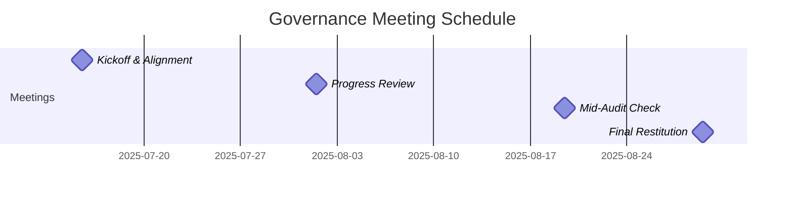

# ISWC Application Audit – Governance Framework

## Objective

- Total governance meeting time (including prep and minutes) is exactly 8 hours over the project (4 meetings x 2 hours total effort each).
- Consultants' participation in meetings is limited to essential contributors only.
- Ensure the audit remains aligned with CISAC’s priorities and delivers actionable outcomes.
- Adjust effort, backlog, and focus based on discoveries and evolving needs.
- Minimize time spent in meetings to maximize productive audit work.

## Governance Structure

### 1. Governance Committee

- **Members:** CISAC project sponsor, key technical partner representatives, PALO IT audit senior consultants.
- **Role:** Decision-making, prioritization, and validation of audit direction.

#### Committee Composition

**Core Committee (Essential Decision Makers)**

- CISAC project sponsor
- Lead technical partner representative
- PALO IT audit lead consultant

**Full Committee (Core + Extended Stakeholders)**

- Core committee members
- Additional technical partner representatives
- CISAC technical leads
- PALO IT secondary consultant (when applicable)

**SMEs (Subject Matter Experts)**

- Database administrators and architects
- Security specialists
- DevOps engineers
- Application developers
- Business analysts
- *Invited on as-needed basis for specific topics*

### 2. Governance Meetings

- **Frequency:** 4 meetings total over the project duration (max 1 hour per session)
- **Format:** Virtual or in-person, as appropriate.
- **Participants:** Core committee, full committee, or SMEs as defined in the meeting schedule.

#### Meeting Agenda

- Review progress against audit plan and deliverables.
- Discuss key findings, blockers, and risks.
- Adjust backlog and priorities based on new insights.
- Confirm next steps and responsibilities.

#### Meeting Efficiency

- Limit meetings to essential topics; avoid unnecessary discussions.
- Each meeting requires concise preparation (status update, key questions) and a brief written summary (minutes).
- Preparation and minutes writing time is expected to match the meeting duration (e.g., 1 hour meeting = 2 hours total effort).

### 3. Communication Protocol

- Use asynchronous updates (email, shared documents) for routine status and minor clarifications.
- Escalate urgent issues via direct contact between audit lead and CISAC sponsor.

## Time Management

- Total governance meeting time (including prep and minutes) should not exceed 8 hours over the project (e.g., 4 meetings x 2 hours).
- Consultants’ participation in meetings is limited to essential contributors only.

## Documentation

- All decisions, action items, and changes to audit scope or priorities are recorded in meeting minutes and shared with all stakeholders within 24 hours.

## Governance Meeting Schedule

| Meeting | Date | Phase | Duration | Key Objectives | Participants |
|---------|------|-------|----------|----------------|-------------|
| **Kickoff & Alignment** | 15 July 2025 | Phase 1 Start | 1h | Project launch, scope validation, access confirmation | Full committee + SMEs |
| **Progress Review** | 01 Aug 2025 | Phase 2 Start | 1h | Initial findings, backlog adjustment, focus areas | Core committee |
| **Mid-Audit Check** | 19 Aug 2025 | Phase 3 Start | 1h | Security/deployment insights, final scope validation | Core committee |
| **Final Restitution** | 29 Aug 2025 | Project End | 1h | Findings presentation, recommendations review | Full committee |

**Total Meeting Time:** 4 hours (8 hours including prep/minutes)

## Governance Timeline

