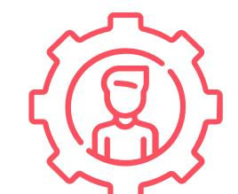

# **Audit Application ISWC**

Architecture Evaluation, Performance, Security

Commercial proposition – June 2025 RICHE Matthieu – mriche@palo-it.com - 06 38 93 94 32

**Crafting tech as a force for good.**

## **SOMMAIRE**

 

# **Key figures WHO WE ARE**

# **WHO WE ARE**

# **Specialised Technical Expertise**

# **Stack Technologique Maîtrisée**

**Azure Cloud Platform** - Native & Hybrid architectures

- **C# .NET Core/Framework** Enterprise applications
- **Python** Analytics & data processing
- **SQL Server & Hyperscale** High

performance database optimization

**Cosmos DB** - NoSQL & multi-model

architectures

**Databricks** - Big Data & Analytics

# **Areas of Expertise**

- **Application architecture**
- **Performance optimization**
- **Cloud security** & DevSecOps practices
- **Application migration & modernization**

# **Our understanding 1** Context & Objectives

## **OUR UNDERSTANDING**

# **Context Introduction for ISWC Application RFP**

The International Standard Musical Work Code (ISWC) is a global identifier for musical works, managed by CISAC to ensure accurate rights management and royalty distribution. The ISWC System, central to the music industry, is undergoing a proposed modernization to enhance performance, scalability, and security by leveraging Microsoft Azure's latest technologies.

This RFP seeks a comprehensive audit and assessment of both the current ISWC application environment and the proposed upgrade, aiming to support a riskmitigated, future-ready transformation. The initiative will strengthen data integrity, operational efficiency, and stakeholder trust across the global music ecosystem. Your expertise is invited to help guide this critical modernization effort.

# **What is CISAC? OUR UNDERSTANDING**

CISAC (International Confederation of Societies of Authors and Composers) is the world's leading network of authors' societies, representing over 5 million creators across 116 countries. Its mission is to protect creators' rights, promote their interests globally, and enable the efficient collective management of copyright.

CISAC sets professional standards, advocates for strong legal protection, and provides the technical infrastructure for international rights management. By fostering collaboration among member societies, CISAC ensures that creators are remunerated, and their works are recognized and protected worldwide.

## **OUR UNDERSTANDING**

# **Functional context**

- **Authoritative database** for allocating ISWC (International Standard Musical Work Code) identifiers
- Used by **every copyright companies in the world**
- **REST API REST** for interacting with the database from the outside
- **Search** by ID or metadata (titles, artists, etc.)
- **Reports generation**: number of database transactions and entries, musical works, etc.

# **Organisational context OUR UNDERSTANDING**

- **Critical Application:** authoritative database for ISWC world-wide
- No technical audit since 2020
- **Need for an independent evaluation** of the partner's work
- Desire to start regular audits

# **Technical issues OUR UNDERSTANDING**

- **Critical Performance**: 3-5 API transactions per seconds
- **Aging Architecture**: 4-5 years without re-evaluation
- **Strategical Evolutions**: Migration to Hyperscale, use a WAF, revisit service exposure
- **DevOps Quality**: Audit of pipelines and practices

# **Methodology 2** 360° approach made by PALO IT

Information Classification: CONFIDENTIAL (sensitive business information, the level of protection is dictated by legal agreements)

# **4 concurrent streams**

Architecture & Code Quality

Performance

Security and Compliance

Deployment & Environments

# **Questions we will try to answer by streams**

# Architecture & Code Quality Performance

Are the code and the architecture relevant for the current business needs?

Can the technical architecture & design evolve and support future needs?

Why is the current system 40x less performant than the legacy application?

Why can't the system reach a higher number (at least 2 digits) of requests per seconds?

What are the benefits of a migration to Hyperscale, as proposed by the current partner?

# **Questions we will try to answer by streams**

# Security Deployment & Environments

Are the systems at risk of being exploited? Is the data at risk of being stolen?

Why would it be so costly to build a new environment?

How does the partner's proposal improve the confidentiality, integrity, and/or availability of the data and systems?

Are the current environments well designed to support development process, deployments and migration ?

# **Our approach**

# **Empiricism**

- Use a Backlog to prioritize our work transparently
- Adapt audit tasks and deliverables along with our discoveries and your business priorities

# **Systemic analysis to adjust our recommendations**

- Explore technical assets
- Develop our understanding of project history, context of past choices and ways of working

# **Our focuses**

# **Performance hotspots analysis**

- Try to identify quickly where are the main bottlenecks
- Evaluate the recommended upgrade in the light of our discoveries

# **Scalability, reliability and suitability for business needs**

- Evaluate architectures relevancy
- Verify code maintainability and ability to integrate new features

|                           | Architecture & Code Quality Performances                                                                                                          | Security Deployment & Environments                   |
|---------------------------|------------------------------------------------------------------------------------------------------------------------------------------------------|---------------------------------------------------------|
| METHODOLOGY               | Strong dependances :                                                                                                                                 | Partner's team CISAC's team                          |
| Backlog                   |                                                                                                                                                      |                                                         |
| Initial workshops         | • Run an event storming workshop • Run a C4 workshop                                                                                        | Overview documentation                               |
| First diagnostics         | • Leverage existing observability data • Minimal security practices code review • Witness the whole "deployment of a feature" process | Breadth first audit report                           |
| Custom diagnostics        | • Add new probes and enable custom audit features • Conduct a static code analysis • Evaluate test practices                          | Focused audit report                                 |
| In depth security audit   | • Run a threat modelling workshop • Conduct an oriented static analysis & software composition analysis                                  | Prioritized results & migrations                     |
| In depth deployment audit | • Analyse current deployment process and tasks • Consult existing documentations                                                            | Proposal to improve reactivity, reliability, cost |

#### Architecture & Code Quality Performances Security Deployment & Environments

## **METHODOLOGY**

# **Deliverables content**

We propose to build deliverables according to our discoveries and focus on most valuable insights for you

Migration scope if relevant Focused scope according to our findings

Evaluation the opportunity of Hyperscale Migration

Comparison Matrix: existing vs proposed architecture

WAF migration relevancy

Focused audit report with areas of code to emphasis on in priority to increase performances, reliability and maintainability

Prioritized results & migrations

Proposal to improve reactivity, reliability & cost

# **Sample of tools and standards we will use**

| Tool & standard      | Description                                                                                                                                               | Scope |
|----------------------|-----------------------------------------------------------------------------------------------------------------------------------------------------------|-------|
| NDepend / Roselyn | Static analysis tools to assists code review, code navigation, browsing code dependencies, estimate technical debt, identify code duplication, etc. |       |
| First Responder Kit  | Set of SQL objects to assess database design, identify bottlenecks, and consuming queries                                                              |       |
| Azure Database Audit | Integrated Azure SQL Audit features to track database events                                                                                        |       |
| OWASP best practices | Top 10 Web Application Security Risks to drive security audit                                                                                          |       |
| Azure best practices | Refer to Azure best practices on each of 4 scopes                                                                                                         |       |

Architecture & Code Quality Performances Security Deployment & Environments

# **Event Storming appendix**

## **Explore and understand your business domain**

The Event Storming workshop is an efficient way to build an understanding of the business domain, by involving both "who know why/what", and "who know how" things are done. This will allow our consultants to quickly upskill about the domain, as well as benefitting from internal CISAC and its partner's knowledge.

## **Build a language to think about your system**

These workshops will also help produce a common lexicon, pertinent to your business, that will be used during the whole audit and serves as a base of any future discussions about the system.

© Alberto Brandolini

# **C4 Appendix**

**Visualize and understand software architecture with the desired level of details.**

# **Model the system at different layers**

At the start of the audit, we collaboratively model the whole system from high-level overview (context), to fine-grained details (code) as needed.

Workshops are run with owning teams, allowing them to describe the current architecture, and explicitly communicate its intent.

# **Cultivate living documentation**

Diagrams will be updated with newly uncovered information during the rest of the audit phases. The different documents produced during the initial workshops and after will be part of the deliverable.

# **Threat Modelling appendix**

**What are we working on? What can go wrong? What are we going to do about that? Did we do a good enough job?**

## **Map services, actors, data flows and storages**

Draw a dataflow diagram of the system under analysis, to understand its features, interactions, and data it involves.

# **Identify risks leveraging the STRIDE model**

From attackers' perspective, hypothesize what could be exploited, and the impact it would have on the systems and the business.

# **Evaluate security controls and mitigations**

From the defenders' point of view, what do we have, or should have to mitigate such issues? What is the associated cost?

# **Key Success Factors 3** Ajouter un sous-titre ici

Information Classification: CONFIDENTIAL (sensitive business information, the level of protection is dictated by legal agreements)

## **KEY SUCCESS FACTOR**

# **Planning 4** Timeline & Key dates

Information Classification: CONFIDENTIAL (sensitive business information, the level of protection is dictated by legal agreements)

#### **MACRO PLANNING**

# Proposed timeline

# **Our Proposition 5** Team, Workload, Budget

Information Classification: CONFIDENTIAL (sensitive business information, the level of protection is dictated by legal agreements)

# Grégory OTT

### **DevOps, Delivery Manager| 15 ans d'expérience**

*"There is a solution to every problem: simple, quick, and wrong."* — *H.L. Mencken*

Greg is a passionate software engineer, deeply focused on understanding problems: starting with "what for" before "how". From DevOps consultant to Delivery Manager, Greg spends all his energy serving his team's impact: shortening cycles, increasing value and quality of deliverables, and improving teams efficiency. During 15 years serving various clients, Greg applied his skills to support different roles within projects: managers, testers, POs, architects, developpers, or business analysts.

Nowadays, Greg also applies his motivation facilitating workshops raising awareness about climate change and digital responsibility.

#### **LAST KEY EXPERIENCES**

● **Lead Developeur | APRIL** *(2025)*

Improve automated triaging of customer forms for a healthcare provider: from 45% to 80% on individuals markets, and from 13% to 50% on collectives markets.

● **Product Owner | Participeo** *(2024)*

Help ownership regain of technical assets and develop a product-focused vision for the company to pivot with a HR solution targetting employees with disabilities. Assist investment decisions, objective, and based on facts.

● **Delivery Manager | Nicomatic** *(2022 - 2024)*

Increase the teams' maturity level on Agile methods, and in particular the SCRUM framework: improve autonomy, conflicts resolution, improving health's metrics, shortening cycles.

● **Hive Master | PALO-IT***(depuis 2022)*

Build and animate a community of practices for PALO IT technical consultants. Co-Develop the PALO gen-e2 method. Increased consultants engagement in the hive from 15% to 65%.

#### ● **Tekigo | DevOps, formateur et consultant usine logicielle Microsoft** *(2012 – 2022-04)*

Train and support clients in their mastery of ALM/DevOps on Microsoft tools.

#### **EXPERTISE & TECHNOLOGY**

- Empiricism, Lean
- Facilitator, workshops instructor
- Agile frameworks and methods (including SCRUM)
- DevOps, ALM, testing strategies
- Azure & Azure DevOps
- Micorosft .NET ecosystem
- SQL Server, ElasticSearch
- C#, PowerShell, Python, JavaScript

#### **CERTIFICATIONS & TALKS**

- GitHub Copilot certified
- « Deviens meilleur leader agile » 10 months Scrum Life 2024
- Pro Scrum Master (PSM1)
- SAFe Agilist 6
- Management 3.0
- ICAgile Product Ownership & Team Facilitation
- MCSD Application Lifecycle Management
- Speaker Microsoft Techdays 2012, 2014
- Speaker MUG Lyon
- Instructor, trainer, animateur 2tonnes
- Climate Fresk and « Bataille de l'IA » facilitator
- Bilan Carbone V8 method Lvl 1

## Xavier MASO

#### **Software and Security Engineer | 10 Years of Experience**

*"Those who do not move, do not notice their chains."*

— *Rosa Luxembourg*

Maker, firm believer in the power of the commons, probably too curious for his own good, Xavier enjoys polishing and sharing his craft and skills. His drive towards expertise led him to wear several hats: full-stack web developer, research aide in CyberSecurity, and Application Security Engineer... amongst others.

#### **LAST KEY EXPERIENCES**

#### **Bain & Company – Empruntis | PALO IT | Developper** *(05 - 06/2025)*

Design and development of an LLM-based application for a mortgage broker.

#### **Oracle NetSuite Application Security Engineer** *(11/2021 - 03/2025)*

Ensured security of code produced at NetSuite. Development of tools for static and dynamic analysis, integration of third-party solutions, training, threat modeling.

#### **Arizona State University (SEFCOM lab) | Research Apprentice** *(04/2019 - 09/2021)*

Academic research. Main focus was on a novel technique for static binary analysis; Also contributed to a prototype and paper about privacy on the web.

#### **Mozilla | Web Security Intern** *(05 – 08/2018)*

Research and development of a solution to record and replay user interactions in the web browser.

#### **RedShield | Full-stack web developer** *(01/2015 - 04/2016)*

Develop features on the security-as-a-service product.

#### **EXPERTISE & TECHNOLOGY**

- Application Security
	- Code analysis
	- Threat Modeling
	- Secure Coding
- Software Development & DevOps
	- TypeScript/Javascript
	- Nix/NixOS
	- Elm-lang
	- Python, Ruby
	- Java
	- C, Rust
	- OCaml

#### **TALKS & PAPERS**

*Security can also « Shift Left »* – AgileTour Bordeaux 2024, et ParisTestConf 2025 *Bits of static binary analysis* – ASU CSE545 guest lecture

*Operation Mango: Scalable Discovery of Taint-Style Vulnerabilities in Binary Firmware Services*  – Usenix 2024 *Unleash the Simulacrum: Shifting Browser Realities for Robust Extension-Fingerprinting* 

*Prevention* – Usenix 2022

# Salaheddine BABOUCHE

**Data Architect | 17 years of experience**

*"To adapt is to succeed." Charles darwin, I think.*

After more than 10 years spent in web development, Salah eddine has specialized himself in Data. As an agilist and software craftsman, he leverages his expertise to help clients succeed in their data projects

#### **LAST KEY EXPERIENCES**

#### **Nicomatic| Data architect** *(since 03/2021)*

Supporting the definition and implementation of a global data strategy aimed at fostering the transition to a data-driven enterprise, following a Data Mesh approach:

- Defined the technical architecture and implemented a data platform.
- Developed a POC for a cross-functional observability solution for the IT system.
- Contributed to defining and promoting development best practices across the team.

#### **Renault Digital | Data engineer** *(01/2019 - 02/2021)*

Traçabilité project - developed of applications to estimate vehicle production costs:

- Built and optimized data pipelines using Spark and Scala.
- Migrated of Oozie-based spark pipelines to Composer and Dataproc on GCP .
- Designed NoSQL data models using HBase.
- Indexed data in Elasticsearch to support search and analytics.

#### **EXPERTISE & TECHNOLOGY**

- Data platform design and development
- Development of data pipelines (batch and streaming): GCP, Dagster, dbt Spark, Scala, Kafka.
- NoSQL Databases modeling: HBase , Cassandra, MongoDB.
- Data indexing: Elasticsearch
- Coaching of junior developers.
- Mastery of agile practices (Scrum, Kanban)
- TDD,BDD,DDD

#### **CERTIFICATIONS & TALKS**

- Machine learning Stanford course certificate.
- Management 3.0 certificate.

# Guillaume JAY

**Senior Technical Consultant |25 years of Experience**

*"*Programming is a social activity" – The Pragmatic Programmer

Guillaume enjoys taking on new challenges, learning new skills, designing elegant architectures, discovering new business areas, and using his expertise to make people's daily lives and work easier. His experience, both technical and human, has enabled him to always place the user at the center of thought and effort, without getting lost in unnecessary technicality.

#### **LAST KEY EXPERIENCES**

#### **Palo IT** *(Depuis 2021)*

Multiple roles as architect, techlead, senior developer at various customers (ReCommerce, SalesScan, ADM, Harvest, April)

#### **Mercuriale | Lead Developer, puis Responsable SI** *(2015-2021)*

Service industrialization, implementation of best practices and delivery of three major projects

#### **SAAQ (Quebec) | Architecte** *(2012-2015)*

Expert .Net, Framework migration management

#### **Cdiscount | Lead Tech** *(2009-2012)*

Middle Office & Customer Area: evolutions & improvements

#### **Campus de Bissy | Responsible SI** *(2001-2008)*

Customized ERP: Digitization of 90% of the company's administrative processes

#### **EXPERTISE & TECHNOLOGIE**

- Mentoring and coaching
- Software architecture
- R&D
- Common sense and pragmatism
- Problem solving
- Microsoft stacks
- ^(T|D)D{2}\$

#### **CERTIFICATIONS & INTERVENTIONS**

Certifications Microsoft Azure & Web Github certified : Foundations, Copilot

# **Estimated Workload**

• 4 man-days of synchronization including : •Kickoff

•follow-up

•Restitution

- 16 man-days for the audit, including : •Report & deliverables writing
	- •Workshops

•Analysis

# **Estimated budget**

## **Team:**

• 2 senior technical consultants

## **Project start date:** 07/15/2025

**Project duration:** 1,5 month – 20 man-days estimated

**Estimated budget:** 15 000€ envelop to be used over the

period.

**Engagement type:** Time & materials

### **MERCI**

# **Nom et prénom**

Titre du poste

Adresse courriel

Numéro de téléphone

Information Classification: CONFIDENTIAL (sensitive business information, the level of protection is dictated by legal agreements)

# **6**

# **References**

Our track record doing audits & Working on your technical stack

# **SACEM – Unified Application Development for OnLine Data Processing**

#### **CHALLENGE**

SACEM, the Society of Authors, Composers and Music Publishers, is a non-profit civil society. Its mission is to collect and distribute copyright royalties, promote and support creators, and defend and protect its members.

In order to solve problems related to data volume, processing delays, and to bring new value to users, SACEM chose PALO IT to help design, validate & implement a Big Data solution dedicated to collecting rights related to online music usage.

#### **APPROACH**

- Study of business processes, technical components of the existing IT system, and data volumes to be processed.
- Definition of a Big Data/NoSQL architecture.
- Implementation of a POC to validate candidate technologies based on typical business use cases.
- Writing of specifications for a Cloud hosting solution tender and support in selecting the service provider.
- Development of components, implementation of data flows between the Cloud and the internal IT system.
- Industrialization of the platform using a DevOps approach to cover automation, provisioning, monitoring, backup, and load testing needs.

#### **METRICS & BENEFITS**

- Creation of a unified application adapted to the new usage patterns of Business teams, facilitating the work of different stakeholders in the OnLine chain.
- Making real-time data available to users.
- Improvement of understanding and monitoring of the processing workflow through Data Visualization.
- Opening of new services for partners.
- Improvement of the organization's image.

#### **TECH STACK**

Java, Hadoop Hortonworks, Spark, Cassandra, ElasticSearch, Kafka.

#### **METHODS**

Lean, Agile (Scrum), DevOps.

Paris

- 1400 Man-Days
- 5 Développeurs, 1 TechLead/Architecte, 1 DevOps.

# **CLP – DEVOPS TRANSFORMATION**

Laying DevOps groundwork within one of the largest power suppliers in Asia

#### **CHALLENGE**

As one of the two main electric suppliers in Asia, China Light and Power (CLP) is responsible for powering homes, businesses and infrastructure in Kowloon and New Territories. As a direct cause of their ever-growing responsibilities—the company has a *robust market position,* but is also at risk of *rigid internal workflows*. PALO IT was approached to overhaul CLP Group IT's communication and technical workflow standards, helping the team to embrace DevOps development methodology; better handle volatility, complexity, and ambiguity; and ultimately improve vendor value streams.

#### **APPROACH**

PALO IT devised a bespoke plan for the multi-national luxury auto-maker. to deliver a range of Agile training programmes across the world. In addition to the trainings, it was also crucial throughout the project to ensure the team was building a long-term Agile community within the business itself. The strength and vision of this *Agile culture* was custom-built to develop skills, leverage the momentum of the initial transformation, and carry the team in the future.

#### **OUTCOME**

Deployment lead time during development phase dropped from an average of **12 hours** to **15 minutes**. Clearer and more open company culture, standardized technology, and a better structure for finding vendors who can fit into CLP's value streams. Put CLP on a clear path towards **CI/CD**, and laid the groundwork for a DevOps reference workflow that can be improved upon moving forward.

Information Classification: CONFIDENTIAL (sensitive business information, the level of protection is dictated by legal agreements)

**TECH STACK Azure DevOps, Azure Data Factory, Azure DataBricks METHODS Agile DevOps Kanban Lean management Value stream optimisation**

**Hong Kong 80 man-days | Oct. 2018 – Feb. 2019**

**2 DevOps Coaches**

# **MPA API Marketplace**

API marketplace for the maritime sector to provide a two-way G2G, G2B, and B2G data exchange capability as well as new API discovery, subscription, and management platform.

#### **Challenge**

The Maritime and Port Authority of Singapore (MPA) sought to accelerate digital transformation in the maritime sector, building on previous initiatives like DigitalPORT@SG and the SG Maritime Data Hub. These efforts had not fully realized the potential of data and API sharing across the ecosystem. MPA envisioned Oceans-X as a global API marketplace to enable secure, scalable, and interoperable data exchange between governments, businesses, and agencies.

#### **Approach**

Key activities included:

- Environment scans, competitor analysis and stakeholder interviews to define and determine platform features
- Development of two core use cases: Port Clearance as a Digital Service and Monetization of Real-Time Datasets
- Execution of a comprehensive GTM strategy including buseinss model proposition, developer surveys, persona mapping, and pricing benchmarks
- Technical architecture design using WSO2, XAPI, Azure Databricks, and Solace
- Creation of a robust governance framework for data and API lifecycle management

#### **Tech stack**

ReactJS, NextJS,, Azure, Databricks, Azure Data Factory, Azure Synapse, Azure Monitor Solace, WSO2 API Manager and Identity Server

#### **Methods**

UI/UX Design, Agile Application Deliver, DevSecOps

- Singapore
- 2025 Mar Present
- Team of 25 consisting of: Delivery Lead, Tech Lead, API Solution Architect, Data Engineers, DevOps Engineers, UX Designer, Business Analyst, GTM Experts

# GEODIS – AUDIT TECHNIQUE ARCHITECTURE & CODE

**Audit technique, stratégique et recommandations d'évolution**

#### CHALLENGE

Dans le cadre du programme de transformation de son Transport Management System, GEODIS, 4ème opérateur européen de transport et logistique, a souhaité étudier l'opportunité de faire l'acquisition d'un progiciel existant. La société a fait appel à PALO IT pour mener un audit technique des solutions ciblées, au niveau du code et de l'architecture afin de les comparer et choisir la plus adaptée. L'audit doit également porté sur une projection du business et sur l'alignement stratégie / produit.

#### APPROCHE POUR CHACUN DES PRODUITS AUDITÉS

- **3 personnes** Etude de l'architecture technique au regard des exigences GEODIS
- Revue de la capacité théorique du progiciel en termes de performance et volumétrie.
- Audit du code du progiciel existant : sécurité, performance, robustesse, maintenabilité, évolutivité, pratiques de développement
- Atelier collaboratif sur la vision métier afin d'aligner besoins business Vs réponses IT
- Travail collaboratif sur la projection du business et l'élaboration d'une roadmap produit intégrant de nouvelles fonctionnalités
- Rapport de mise en conformité et des recommandations.

#### MESURES ET BÉNÉFICES

- **Identification de la meilleure solution**
- **Stratégie d'évolution de l'architecture technique et applicative de la solution retenue**
- **Evolution de l'infrastructure de la solution retenue**
- **Elaboration d'une stratégie aligné IT/Business avec des plans d'actions associés**
- **Recommandation d'évolutions avec plan d'action et coûts associés**

#### **TECH STACK**

Java, JEE, Struts, C#, ASP.NET, Oracle, Sonar, JProfiler, Maven Glassfish, Sun Application Server, IIS, Linux, Windows.

#### **MÉTHODES**

Event Storming, Story Mapping, Diagramme C4, Lecture de code, Innovation Games

**2 mois**

# Daxium – Audit technique - Due Dil IT

#### **Valorisation d'un asset technologique avant cession**

#### CHALLENGE

Daxium est une plateforme SaaS qui permet de créer simplement des applications mobiles métier personnalisables à destination des équipes terrain (BTP, Boutiques, Commerce, etc.). Dans le cadre de la restructuration de son catalogue de produit, le groupe à décider de céder un asset technologique à l'une de ses filiales. Cette transaction a été suivie et accompagnée par un commissaire aux comptes. Daxium a mandaté Palo IT pour auditer cet asset technologique (application) et la valoriser en vue de la cession.

#### APPROCHE

- **3 personnes** Interviews des membres de l'équipe de développement
- Prise de connaissance et lecture de la documentation produit
- Lecture et analyse du code de l'application

#### Analyse de l'architecture (Diagramme C4)

● Calcul de l'investissement pour le développement du produit (nbr de personnes, durée de développement, coût moyen de la journée de travail, etc.)

Ratio entre investissement et coût de la dette technique

● Evaluation du montant de l'asset technologique

#### CONCLUSIONS

- **Investissement intéressant**
- **Base de code fiable et de bonne qualité**
- **Quelques travaux à prévoir sur l'architecture du produit**
- **Valorisation de l'asset**
- **Transaction validée par le commissaire aux comptes**

#### **TECH STACK**

Android, iOS, PHP

#### **MÉTHODES**

Diagramme C4, Lecture de code, interviews

**20 jours**

# **CRÉDIT AGRICOLE S.A. – Technical Audit**

#### **CHALLENGE**

CREDIT AGRICOLE S.A. is the central entity of the CREDIT AGRICOLE group. Responsible for the coherence of its strategic development, it is also its Central Bank. The Application Performance & Quality division of the "Architecture and Methods" service within the Central Functions Studies and Development of Crédit Agricole S.A. wanted to establish a Test-oriented service center to meet the needs of all projects in the Studies Department. PALO IT was selected to respond to this request. Testing was industrialized and defined in work units on behalf of EDC/AM/PQA.

#### **APPROACH**

- Security, performance, maintainability and scalability-oriented code audits.
- Performance audits of various Internet, Intranet, Extranet applications from requirements scoping, scenario definition, test plan implementation, planning and execution of missions, introspection, analysis and improvement recommendations.
- Oracle database analysis.
- Expertise on specific technologies.

#### **OUTPUTS**

- Improvement of application quality.
- Anticipation of application performance issues.

#### **TECH STACK**

Silkperformer, SilkTest, Silk Central, Dynatrace, Java, .NET, PHP, Oracle.

#### **METHODS** Agilité : Scrum

Paris 40 man days 2 Architects

# **CLP - CXT DevSecOps**

Uplift software engineering practices through people engagement & mentoring

#### **Challenge**

The CLP DevSecOps Team needed to gain traction to deliver automated, reliable toolsets in support of multiple software projects by internal and vendor teams. However, they first needed to clarify conflicting areas of responsibility with the security, infrastructure, and support teams.

#### **Approach**

PALO IT experts conducted an assessment which resulted into on-the-job mentoring to consolidate the DevSecOps Team, clarifying roles, responsibilities and stakeholders, and mapping the software development value stream.

#### **Benefits and metrics**

- ➔ Understanding of the maturity of the engineering practices in CLP
- ➔ Value stream map unified the different views of the development process and the value of DevSecOps in regular and frequent software delivery
- ➔ Clear roles & responsibilities paved the way for improved collaboration within the team and with other teams
- ➔ Team cadences strengthened the team's ability to align, prioritize, and act quickly to prevent escalating issues
- ➔ An online Knowledge base created single source of truth for policies and processes.

#### **Tech stack**

Azure DevOps, DataDog, Kubernetes, Microsoft Azure

#### **Methods**

Consultancy, Assessment, Scrum, Collaborative workshops, Change management

Hong Kong

3 months July 2024 – September 2024

1 DevSecOps Lead 1 Change Management

➔ KPIs

# **7 Why PALO IT?**

Information Classification: CONFIDENTIAL (sensitive business information, the level of protection is dictated by legal agreements)

# **Contactez-nous**

### **Australia**

- Greenhouse Climate Tech Hub, Level 1, Salesforce Tower, 180 Georges St., Sydney NSW
- +61 447 350 560
- australia@palo-it.com

### **Brazil**

- Rua Barão de Jundiaí, 523, cxpst 0199, Alto da Lapa, São Paulo/SP, Brazil, CEP 05073-010
- brazil@palo-it.com

## **Colombia**

- Carrera 11B, #99-25, Of 7-113, Bogotá
- +57 302 2338177
- colombia@palo-it.com

### **France**

- 6 rue de l'Amiral de Coligny, 75001 Paris
- +33 (06) 52 43 83 81
- france@palo-it.com

### **Hong Kong**

- The Great Room, 23/F One Taikoo Place 979 King's Road, Quarry Bay, HK
- +852 8417 8116
- hongkong@palo-it.com

## **Mexico**

- Campos Elíseos 385, Polanco, Mexico City CMX 11560, Mexico
- +852 9174 0572
- mexico@palo-it.com

### **Singapore**

- 11 Beach Road #06-01, Singapore 189675
- +65 6250 4620
- singapore@palo-it.com

## **Spain**

- Rambla de Catalunya, 121 08008 Barcelona
- Paseo de la Habana, 11 28036 Madrid
- spain@palo-it.com

## **Thailand**

- 157/39 Serm-Mit Tower, Room 2301, Sukhumvit 21 Rd. (Asoke), Klong Toei Nuea , Wattana Bangkok 10110
- +66 (0) 2 180 6121
- thailand@palo-it.com

## **USA**

- 30 Wall Street, 8th Floor New York, NY 10005-2205
- +1 (646) 859 2021
- usa@palo-it.com

## **WHY PALO IT?**

