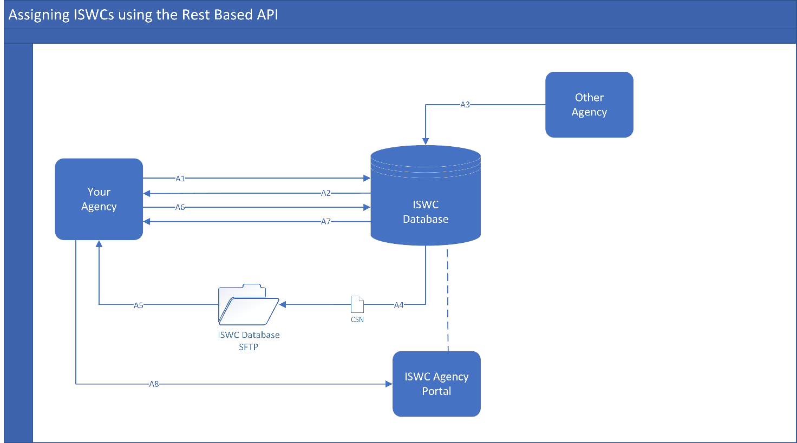
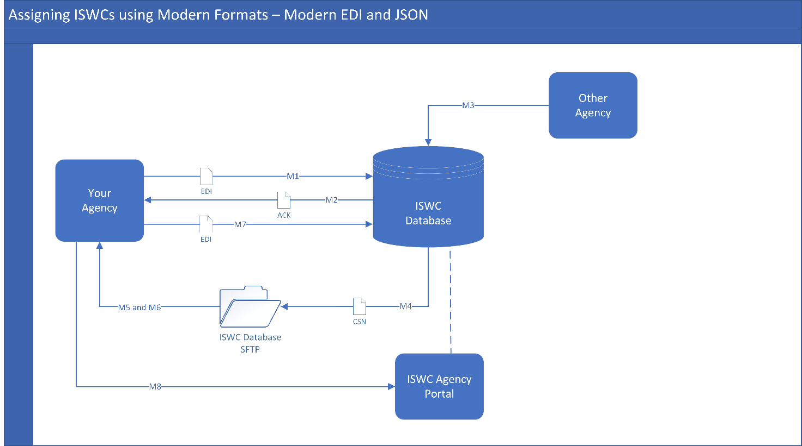
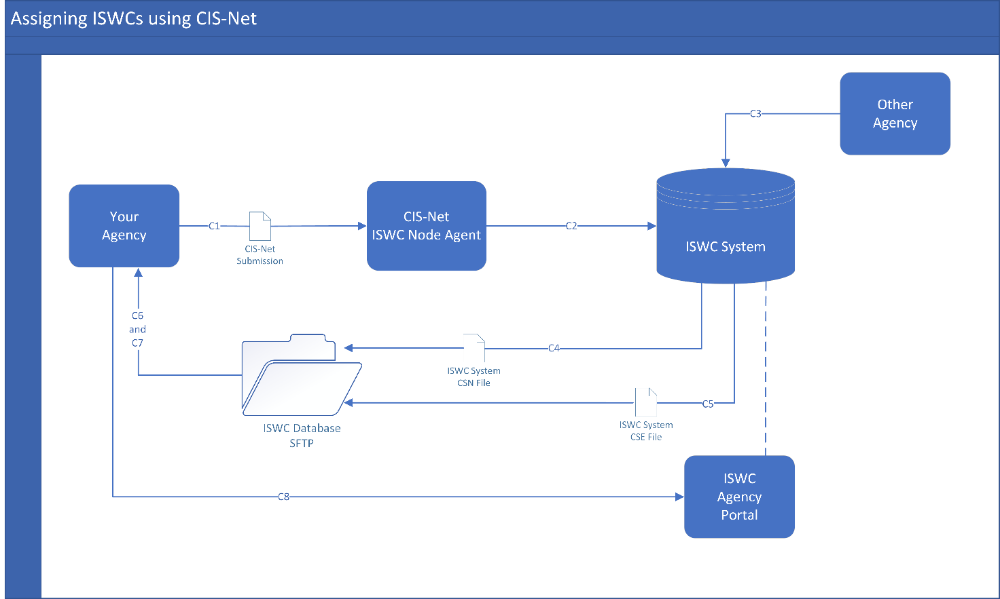
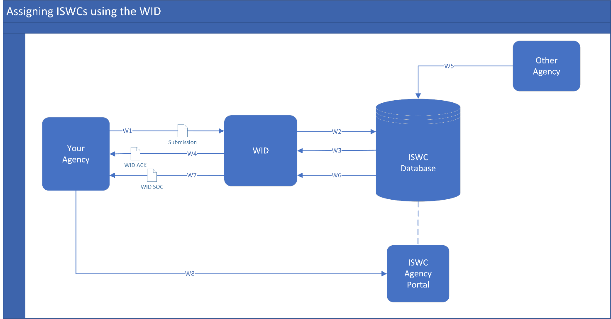
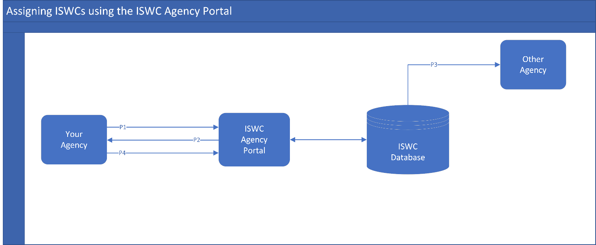
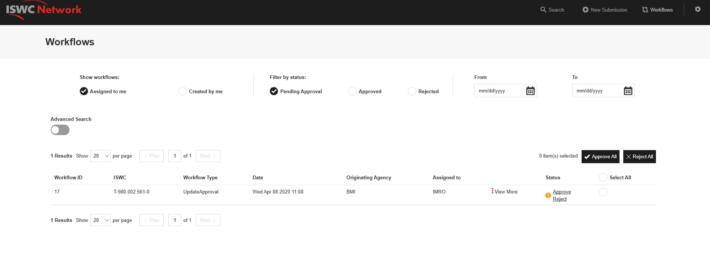
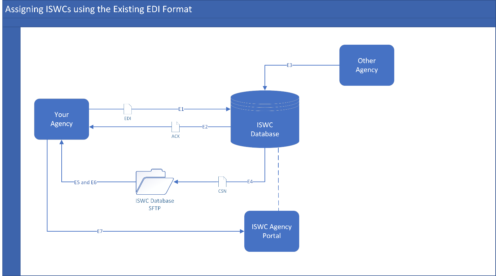

__ISWCIA20\-0312__

Source Language: English

Published on: 18/06/2020

__ISWC Database:__

__Guidelines for handling Acknowledgements, Update Notifications and Workflow Tasks __

ISWC Project Design Team

__Version Control__

This document was edited on the following dates:

__Version__

__Date/Time __

__Body __

__Note __

1\.0

18/06/2020

ISWC Project Design Team

Draft document validated

__Table of Contents__

[1	Introduction	4](#_Toc43736021)

[2	Terminology	4](#_Toc43736022)

[3	Overview of Acknowledgements, Update Notifications and Workflow Items	5](#_Toc43736023)

[4	Assigning ISWCs using the REST Based API	8](#_Toc43736024)

[5	Assigning ISWCs using Modern Formats – Modern EDI and JSON	10](#_Toc43736025)

[6	Assigning ISWCs using CIS\-Net	12](#_Toc43736026)

[7	Assigning ISWCs using WID \(and other Hubs\)	14](#_Toc43736027)

[8	Assigning ISWCs using the ISWC Agency Portal	16](#_Toc43736028)

[9	Assigning ISWCs using Existing EDI Format	17](#_Toc43736029)

[10	Queries	18](#_Toc43736030)

__Table of Figures__

[Figure 1 Assigning ISWCs using the REST Based API	8](#_Toc42603260)

[Figure 2 Assigning ISWCs using the Modern EDI or JSON Format	10](#_Toc42603261)

[Figure 3 Assigning ISWCs using CIS\-Net	12](#_Toc42603262)

[Figure 4 Assigning ISWCs using the WID	14](#_Toc42603263)

[Figure 5 Assigning ISWCs using the ISWC Agency Portal	16](#_Toc42603264)

[Figure 6 Example of workflow tasks viewed via the ISWC Agency Portal	16](#_Toc42603265)

[Figure 7 Assigning ISWCs using the Existing EDI Format	17](#_Toc42603266)

# Introduction

The new ISWC Database launches in July 2020\. It incorporates new functionality, including new messages and workflow tasks for ISWC Agencies\. The purpose of this document is to provide guidelines to Agencies on how to handle these messages and retrieve and process workflow tasks\.

Agencies can submit works for ISWC assignment to the ISWC Database through a number of different channels \- each of which has a dedicated information section in this document:

- Section 4 \- Rest Based API
- Section 5 \- Modern Formats: EDI file and JSON file
- Section 6 \- CIS\-Net
- Section 7 \- WID and other Hubs
- Section 8 \- ISWC Agency Portal 
- Section 9 \- Existing EDI File \(only until July 2021\)

Each section provides an overview of the type and format of the acknowledgement and update notification messages an Agency will receive from the database and how an Agency can retrieve and process workflow tasks\. Agencies need only read the particular section which applies to their process\. For example, if your Agency assigns ISWCs using the REST Based API, you only need to read the terminology and overview sections and Section 4\.

# Terminology

__ISWC Metadata__

The metadata required for \(a\) an ISWC\-Eligible Agency to generate an ISWC or retrieve an existing ISWC and for \(b\) an ISWC\-Ineligible Agency to retrieve an existing ISWC from the ISWC System\. This comprises of:

- Minimum Core ISWC Metadata – agency, source database, agency work code, title\(s\), interested parties, category \(DOM or INT\), disambiguation flag \(true or false\)
- Optional ISWC Metadata – derived work type, derived from ISWCs, performers, instrumentation, BVLTR information
- Additional Disambiguation Metadata \(only in cases where the disambiguation flag is ‘true’\) – disambiguation reason, disambiguate from ISWCs

__ISWC\-Eligible Agency__

An Agency who has a Creator, Original Publisher or Administrator interest in the work\.

__ISWC\-Ineligible Agency__

An Agency who does not have a Creator, Original Publisher or Administrator interest in the work\.

__ACK File__

An acknowledgement returned to an Agency in response to their submission to the ISWC Database\. It acknowledges receipt of the work and indicates what action has been taken by the database\. An ACK file is returned in response to an EDI or JSON file submission to the database\. Acknowledgement messages \(instead of ACK files\) are returned in response to submissions via other formats, such as API, ISWC Agency Portal\.

__CSN File__

A CSN can be used for two different purposes\.

- A notification sent to all Agencies who have ISWC Metadata attached to an ISWC when an ISWC\-Eligible Agency submits a successful transaction for that ISWC to the ISWC Database\.
- A CSN may also include acknowledgements for successful transactions submitted to the ISWC Database via the CIS\-Net ISWC Node Agent by ISWC\-Eligible Agencies\.

Please read the section relevant to your Agency for clarification on what message types will be included in a CSN for your Agency\.

__CSE File__

A file generated for ISWC\-Eligible Agencies who submit to the ISWC Database via the CIS\-Net ISWC Node Agent\. It contains the submissions which were rejected by the ISWC Database and corresponding error codes\. 

__Composite Metadata View__

The metadata view of a work returned to the user by the ISWC Database\. It contains the IP information as submitted by the relevant eligible Societies\. 

Note: this does not always match the metadata submitted by a single Agency\. For example; in the case of split\-copyright works, the database will find the most recent submission from eligible Societies and display the IPs which are affiliated with their Societies\.

__Workflow Task__

A task assigned to an ISWC\-Eligible Agency which is triggered by an update to ISWC Metadata by another ISWC\-Eligible Agency, i\.e\. in the case of a split\-copyright work\.

# Overview of Acknowledgements, Update Notifications and Workflow Items

## Acknowledgements

An acknowledgement is returned in response to an Agency’s submission to the ISWC Database\. There are a number of formats the acknowledgment can be provided in, depending on the submission method used\.   

Below is a description of the acknowledgement messages returned by the ISWC Database to __ISWC\-Eligible__ Agencies:

__Submission Type__

__Description__

__ACK Message__

__CAR__

Add Request

ISWC Database acknowledges receipt of the work and indicates whether or not it has been added to the database\. If it has, an ISWC is returned\.

__CUR__

Update Request

ISWC Database acknowledges receipt of the work and indicates whether or not it has been updated\.

__CDR__

Delete Request

ISWC Database acknowledges receipt of the transaction and indicates whether or not the Agency’s work information has been removed from the ISWC and if the work has been logically deleted\.

__CMQ__

Meta Data Query

ISWC Database acknowledges receipt of the query request and responds with all of the information associated with the work; e\.g\. titles, interested parties, agency work codes, performers etc\.  

__CIQ__

ISWC Query

ISWC Database acknowledges receipt of the query request and responds with the work’s ISWC\.

__MER__

Merge Request

ISWC Database acknowledges receipt of the merge transaction and indicates whether or not it has been carried out successfully\.

Below is a description of the acknowledgement messages returned by the ISWC Database to __ISWC\-Ineligible__ Agencies:

__Submission Type__

__Description__

__ACK Message__

__CAR__

Add Request

ISWC Database acknowledges receipt of the work and indicates whether or not there is an ISWC for the work\.

__CDR__

Delete Request

ISWC Database acknowledges receipt of the transaction and indicates whether or not the Agency’s work information has been removed from the ISWC\.

__CMQ__

Meta Data Query

ISWC Database acknowledges receipt of the query request and responds with all of the information associated with the work; e\.g\. titles, interested parties, agency work codes, performers etc\.  

__CIQ__

ISWC Query

ISWC Database acknowledges receipt of the query request and responds with the work’s ISWC\.

The acknowledgement message will indicate if the transaction has been fully accepted or rejected:

__Status__

__Description__

__Message__

FA

Fully Accepted

Transaction has been processed\. No issues were present\.

RJ

Rejected

Transaction has been rejected\. Rejection reason is provided\.

## Notification of Updates to ISWC Metadata

When an ISWC\-Eligible Agency successfully adds or updates its metadata on an ISWC, the ISWC Database sends a notification of this update in a CSN file to all Agencies who have ISWC Metadata attached to the ISWC\.  The below transactions will trigger a CSN file:

__To the ISWC Database__

__From the ISWC Database__

__ISWC\-Eligible Agency sends:__

__Agencies with metadata attached to the ISWC receive:__

__CAR__

Add Request

A notification from the ISWC Database that work metadata has been added by another Agency\.

__CUR__

Update Request

A notification from the ISWC Database that the work metadata has been updated by another Agency\.

__MER__

Merge Request

A notification from the ISWC Database that the ISWC has been merged into another ISWC\.

A CSN will contain the following key information:

- Title
- ISWC
- Agency work codes
- Original Transaction Type
- \*Workflow Task ID
- \*Workflow Status

*\* Workflow information is included for ISWC\-Eligible Agencies only \(see Section 3\.3\)*

Below is an example of a scenario where an Agency’s transaction triggers a CSN \(notification\); 

A split copyright work, containing IPs from ASCAP and SOCAN, has been assigned an ISWC by the system

There are 10 different Agency submissions attached to the ISWC

- 2 ISWC\-Eligible \(ASCAP and SOCAN\)
- 8 ISWC\-Ineligible

ASCAP make a change to the ISWC Metadata \(through CIS\-Net\) and the transaction is fully accepted

- The 9 other Agencies with submissions attached to the ISWC receive a CSN \(on CISAC’s SFTP\)
	- SOCAN’s CSN includes a Workflow Task ID and Workflow Status \(because they are ‘ISWC\-Eligible’\)

## Workflow Tasks

When an ISWC\-Eligible Agency submits a successful update or merge transaction, the change is immediately applied to its own ISWC Metadata and the composite metadata view for the ISWC\. Where the work is a split\-copyright work, a workflow task which requires approval or rejection of the change is assigned to the other ISWC\-Eligible Agencies who have metadata attached to the ISWC\. 

Workflow tasks are time restricted\. Changes are considered ‘auto\-approved’ by the Agency they are assigned to unless the Agency rejects the change within the timeframe\. If an Agency rejects a workflow task, the update to the metadata is reversed\.

Agencies should endeavour to prevent a ‘workflow loop’ for the same ISWC\. A workflow loop is created when an Agency rejects a workflow task which is then resubmitted for approval but rejected again\. Agencies should have a process in place for communicating with sister Agencies in order to resolve ISWC Metadata\-related conflicts outside of the ISWC Database\. 

Guidelines on how your Agency can retrieve and process its workflow tasks are provided in the relevant section of this document\.

# Assigning ISWCs using the REST Based API

Figure 1 Assigning ISWCs using the REST Based API

## Acknowledgments

When an Agency calls the API \(*A1*\), an acknowledgement is returned in the API response \(*A2*\)\.

### Processing Fully Accepted Transactions

At a minimum, Agencies should ingest the preferred ISWC returned by the ISWC Database\. Additionally, Agencies could ingest other Agency work codes which are returned in the response message\.

### Processing Rejected Transactions

Agencies should have a process in place to deal with rejected transactions, e\.g\.: 

- A process which allows the Agency to capture the error message returned by the ISWC Database for the work
- A report extract from the Agency database which enables Agency personnel to manually review the error and take the appropriate action

A full list of ACK error codes is available in the API specification document which can be found in the Developer Portal\. 

## Notifications of Updates to ISWC Metadata

Where your Agency has ISWC Metadata attached to an ISWC, and an ISWC\-Eligible Agency changes ISWC Metadata on that ISWC *\(A3\)*, the ISWC Database sends a notification of this update in a CSN file to your Agency folder on CISAC’s SFTP *\(A4\)*\.  

Your Agency should retrieve the CSN file from CISAC’s SFTP *\(A5\) *and process it as follows:

__Agency Receives:__

__Agency Action:__

Add 

Notification

*\(metadata has been added by another Agency\)*

__ISWC\-Eligible Agency:__

Ingest the ISWC

Capture and manually review the CSN details for the add notification

Optional: process the ISWC Database workflow task \(Agency can approve or reject\)

__ISWC\-Ineligible Agency:__

Ingest the ISWC

Update notification

*\(metadata has been updated by another Agency*

__ISWC\-Eligible Agency:__

Ingest the ISWC

Capture and manually review the CSN details for the update notification

Optional: process the ISWC Database workflow task \(Agency can approve or reject\)

__ISWC\-Ineligible Agency:__

Ingest the ISWC

Merge notification

*\(the ISWC has been merged into another ISWC\)*

__ISWC\-Eligible Agency:__

Ingest the new Preferred ISWC and record the old ISWC as ‘archived’

Optional: process the ISWC Database workflow task \(Agency can approve or reject\)

__ISWC\-Ineligible Agency:__

Ingest the new Preferred ISWC and record the old ISWC as ‘archived’

## Workflow Tasks

Your Agency can retrieve workflow tasks via the ‘GET’ function on the REST API *\(A6\) *and process these tasks using the ‘PATCH’ operation *\(A7\)*\. 

Alternatively, workflow tasks can also be viewed and processed via the ISWC Agency Portal *\(A8\)*\- see Section 8\.

Your Agency should have a process in place to review and approve or reject workflow tasks\. This may include allowing workflow tasks to ‘auto\-approve’ by not rejecting the tasks within the allocated timeframe\. Workflow tasks associated with merge transactions should be prioritised \- because they affect the preferred ISWC number for a work\.  

# Assigning ISWCs using Modern Formats – Modern EDI and JSON

Figure 2 Assigning ISWCs using the Modern EDI or JSON Format

## Acknowledgments

When an Agency submits an EDI/JSON file to the ISWC Database *\(M1\)*, an ACK file is returned *\(M2\)*\.

### Processing Fully Accepted Transactions

At a minimum, Agencies should ingest the preferred ISWC returned by the ISWC Database\. Additionally, Agencies could ingest other Agency work codes which are returned in the ACK file\.

### Processing Rejected Transactions

Agencies should have a process in place to deal with rejected transactions, e\.g\.: 

- A process which allows the Agency to capture the error message returned by the ISWC Database for the work
- A report extract from the Agency database which enables Agency personnel to manually review the error and take the appropriate action

A full list of ACK error codes is available in the [EDI](https://apimstfop0acm0vf5m3w0rf1.blob.core.windows.net/content/MediaLibrary/Documents/SPE_20190806_ISWC_EDI_FileFormat.pdf) and [JSON](https://apimstfop0acm0vf5m3w0rf1.blob.core.windows.net/content/MediaLibrary/Documents/SPE_20191118_ISWC_JSON_FileFormat.pdf) specifications which can be found in the Developer Portal\. 

## Notifications of Updates to ISWC Metadata

Where your Agency has metadata attached to an ISWC, and an ISWC\-Eligible Agency changes metadata on that ISWC *\(M3\)*, the ISWC Database sends a notification of this update in a CSN file to your Agency folder on CISAC’s SFTP *\(M4\)*\.  

Your Agency should retrieve the CSN file from CISAC’s SFTP *\(M5\) *and process it as follows:

__Agency Receives:__

__Agency Action:__

Add 

Notification

*\(metadata has been added by another Agency\)*

__ISWC\-Eligible Agency:__

Ingest the ISWC

Capture and manually review the CSN details for the add notification

Optional: process the ISWC Database workflow task \(Agency can approve or reject\)

__ISWC\-Ineligible Agency:__

Ingest the ISWC

Update notification

*\(metadata has been updated by another Agency*

__ISWC\-Eligible Agency:__

Ingest the ISWC

Capture and manually review the CSN details for the update notification

Optional: process the ISWC Database workflow task \(Agency can approve or reject\)

__ISWC\-Ineligible Agency:__

Ingest the ISWC

Merge notification

*\(the ISWC has been merged into another ISWC\)*

__ISWC\-Eligible Agency:__

Ingest the new Preferred ISWC and record the old ISWC as ‘archived’

Optional: process the ISWC Database workflow task \(Agency can approve or reject\)

__ISWC\-Ineligible Agency:__

Ingest the new Preferred ISWC and record the old ISWC as ‘archived’

## Workflow Tasks

Your Agency can retrieve workflow tasks via the CSN files which are uploaded to your Agency folder on CISAC’s SFTP *\(M6\) *and process these tasks using the Workflow Task \(WFT\) record in the EDI or the updateWorkflowTasks transaction in the JSON file *\(M7\)*\. 

Workflow tasks can also be retrieved and processed via the ISWC Agency Portal *\(M8\)*\- see Section 8\.

Your Agency should have a process in place to review and approve or reject workflow tasks\. This may include allowing workflow tasks to ‘auto\-approve’ by not rejecting the tasks within the allocated timeframe\. Workflow tasks associated with merge transactions should be prioritised \- because they affect the preferred ISWC number for a work\.  

# Assigning ISWCs using CIS\-Net

Figure 3 Assigning ISWCs using CIS\-Net

## Acknowledgements and Update Notifications

When an Agency submits works to CIS\-Net *\(C1\)*, the new CIS\-Net ISWC Node Agent submits these works to the ISWC Database for ISWC assignment *\(C2\)\. *2 types of files are generated by the ISWC Database and returned to your Agency folder on CISAC’s SFTP; a CSN file*\(C4\)* and a CSE file *\(C5\)*\.

### CSN Files

Your Agency should retrieve its CSN file from CISAC’s SFTP *\(C6\)\. *The CSN file will contain the following message types:

- Acknowledgements \- for successful transactions submitted to the ISWC Database via CIS\-Net for your Agency
- Update notifications \- if your Agency has ISWC Metadata attached to an ISWC, and an ISWC\-Eligible Agency makes an update to that ISWC in the ISWC Database *\(C3\)*, the CSN file will also include a notification of this update\.

At a minimum, Agencies should ingest the preferred ISWC returned in the CSN’s acknowledgement message\. Additionally, Agencies could ingest other Agency work codes which are returned\.

Your Agency should process update notifications from the CSN as follows:

__Agency Receives:__

__Agency Action:__

Add 

Notification

*\(metadata has been added by another Agency\)*

__ISWC\-Eligible Agency:__

Ingest the ISWC

Capture and manually review the CSN details for the add notification

Optional: process the ISWC Database workflow task \(Agency can approve or reject\)

__ISWC\-Ineligible Agency:__

Ingest the ISWC

Update notification

*\(metadata has been updated by another Agency*

__ISWC\-Eligible Agency:__

Ingest the ISWC

Capture and manually review the CSN details for the update notification

Optional: process the ISWC Database workflow task \(Agency can approve or reject\)

__ISWC\-Ineligible Agency:__

Ingest the ISWC

Merge notification

*\(the ISWC has been merged into another ISWC\)*

__ISWC\-Eligible Agency:__

Ingest the new Preferred ISWC and record the old ISWC as ‘archived’

Optional: process the ISWC Database workflow task \(Agency can approve or reject\)

__ISWC\-Ineligible Agency:__

Ingest the new Preferred ISWC and record the old ISWC as ‘archived’

### CSE Files

Your Agency should retrieve its CSE file from CISAC’s SFTP *\(C7\)\. *A CSE file contains details of the work submissions which were rejected by the ISWC Database, including the reason why the submissions were rejected\.

Agencies should have a process in place to deal with rejected transactions, e\.g\.: 

- A process which allows the Agency to capture the error message returned by the ISWC Database for the work
- A report extract from the Agency’s database which enables Agency personnel to manually review the error and take the appropriate action

A full list of CSE error codes is available in the CIS\-Net specification which can be found on CISAC’s website\. 

## Workflow Tasks

Your Agency can retrieve workflow tasks via the CSN files which are uploaded to your Agency folder on CISAC’s SFTP *\(C6\) *or via the Agency Portal *\(C8\)*\. 

Workflow tasks can be processed via the ISWC Agency Portal *\(C8\)*\- see Section 8\.

Your Agency should have a process in place to review and approve or reject workflow tasks\. This may include allowing workflow tasks to ‘auto\-approve’ by not rejecting the tasks within the allocated timeframe\. Workflow tasks associated with merge transactions should be prioritised \- because they affect the preferred ISWC number for a work\.  

# Assigning ISWCs using WID \(and other Hubs\)

Figure 4 Assigning ISWCs using the WID

Note: a similar process flow is in place for other hubs who assign ISWCs on your Agency’s behalf\. Please check the exact process with your hub\.

## Acknowledgments

When an Agency submits works to the WID *\(W1\)*, the WID submits these works to the ISWC Database for ISWC assignment *\(W2\)\. *An acknowledgement is returned from the ISWC Database *\(W3\) *to the Agency via the WID *\(W4\)* in the format of a WID ACK file\.

### Processing Fully Accepted Transactions

At a minimum, Agencies should ingest the preferred ISWC returned in the WID ACK file\. Additionally, Agencies could ingest other Agency work codes which are returned\.

### Processing Rejected Transactions

Agencies should have a process in place to deal with rejected transactions, e\.g\.: 

- A process which allows the Agency to capture the error message returned for the work
- A report extract from the Agency database which enables Agency personnel to manually review the error and take the appropriate action

A full list of ACK error codes is available in the WID specification which can be found on CISAC’s website\. 

## Notifications of Updates to ISWC Metadata

Where your Agency has metadata attached to an ISWC, and an ISWC\-Eligible Agency changes metadata on that ISWC *\(W5\)*, notification of that update is sent from the ISWC Database to your Agency in the WID SOC file *\(W6 and W7\)*\.  

Further detail on WID SOC files can be found in the WID specification\.

## Workflow Tasks

Workflow tasks can be retrieved and processed via the ISWC Agency Portal *\(W8\)*\- see Section 8\.

Your Agency should have a process in place to review and approve or reject workflow tasks\. This may include allowing workflow tasks to ‘auto\-approve’ by not rejecting the tasks within the allocated timeframe\. Workflow tasks associated with merge transactions should be prioritised \- because they affect the preferred ISWC number for a work\.  

# Assigning ISWCs using the ISWC Agency Portal

 

Figure 5 Assigning ISWCs using the ISWC Agency Portal

## Acknowledgments

When an Agency submits a transaction to the Agency Portal *\(P1\)*, the response from the ISWC Database *\(P2\) *is shown on the portal submission page\.

Where the transaction relates to a split\-copyright work, the relevant notification and/or workflow item is sent from the ISWC Database to other Agencies with metadata attached to the work *\(P3\)*\.

## Workflow Tasks

Agencies can identify, retrieve and process workflow tasks through the Agency Portal *\(P4\)*\. An example of the workflow view is provided below:

Figure 6 Example of workflow tasks viewed via the ISWC Agency Portal

Workflow tasks associated with merge transactions should be prioritised \- because they affect the preferred ISWC number for a work\.  

# Assigning ISWCs using Existing EDI Format

Figure 7 Assigning ISWCs using the Existing EDI Format

__*This backwards compatibility option is only available until July 2021\.*__

## Acknowledgments

When an Agency submits an EDI to the ISWC Database *\(E1\)*, an ACK file is returned *\(E2\)*\. 

### Processing Fully Accepted Transactions

At a minimum, Agencies should ingest the preferred ISWC returned by the ISWC Database\. Additionally, Agencies could ingest other Agency work codes which are returned in the ACK file\.

### Processing Rejected Transactions

Agencies should have a process in place to deal with rejected transactions, e\.g\.: 

- A process which allows the Agency to capture the error message returned by the ISWC Database for the work
- A report extract from the Agency database which enables Agency personnel to manually review the error and take the appropriate action

A full list of ACK error codes is available in the EDI specification which can be found on CISAC’s website\. 

## Notifications of Updates to ISWC Metadata

Where your Agency has metadata attached to an ISWC, and an ISWC\-Eligible Agency changes metadata on that ISWC *\(E3\)*, the ISWC Database sends a CSN to your Agency folder on CISAC’s SFTP *\(E4\)*\.  

Your Agency should retrieve the CSN file from CISAC’s SFTP *\(E5\) *and process it as follows:

__Agency Receives:__

__Agency Action:__

Add 

Notification

*\(metadata has been added by another Agency\)*

__ISWC\-Eligible Agency:__

Ingest the ISWC

Capture and manually review the CSN details for the add notification

Optional: process the ISWC Database workflow task \(Agency can approve or reject\)

__ISWC\-Ineligible Agency:__

Ingest the ISWC

Update notification

*\(metadata has been updated by another Agency*

__ISWC\-Eligible Agency:__

Ingest the ISWC

Capture and manually review the CSN details for the update notification

Optional: process the ISWC Database workflow task \(Agency can approve or reject\)

__ISWC\-Ineligible Agency:__

Ingest the ISWC

Merge notification

*\(the ISWC has been merged into another ISWC\)*

__ISWC\-Eligible Agency:__

Ingest the new Preferred ISWC and record the old ISWC as ‘archived’

Optional: process the ISWC Database workflow task \(Agency can approve or reject\)

__ISWC\-Ineligible Agency:__

Ingest the new Preferred ISWC and record the old ISWC as ‘archived’

## Workflow Tasks

Your Agency can retrieve workflow tasks via the CSN files which are uploaded to your Agency folder on CISAC’s SFTP *\(E6\) *or via the Agency Portal *\(E7\)*\. 

Workflow tasks can be processed via the ISWC Agency Portal *\(E7\)*\- see Section 8\.

Your Agency should have a process in place to review and approve or reject workflow tasks\. This may include allowing workflow tasks to ‘auto\-approve’ by not rejecting the tasks within the allocated timeframe\. Workflow tasks associated with merge transactions should be prioritised \- because they affect the preferred ISWC number for a work\.  

# Queries

Queries relating to processing Acknowledgements, CSNs and Workflow Tasks within the ISWC Database, or access to your Agency’s folder on CISAC’s SFTP should be directed to: [iswc\.support@cisac\.org](mailto:iswc.support@cisac.org)\. 

	

