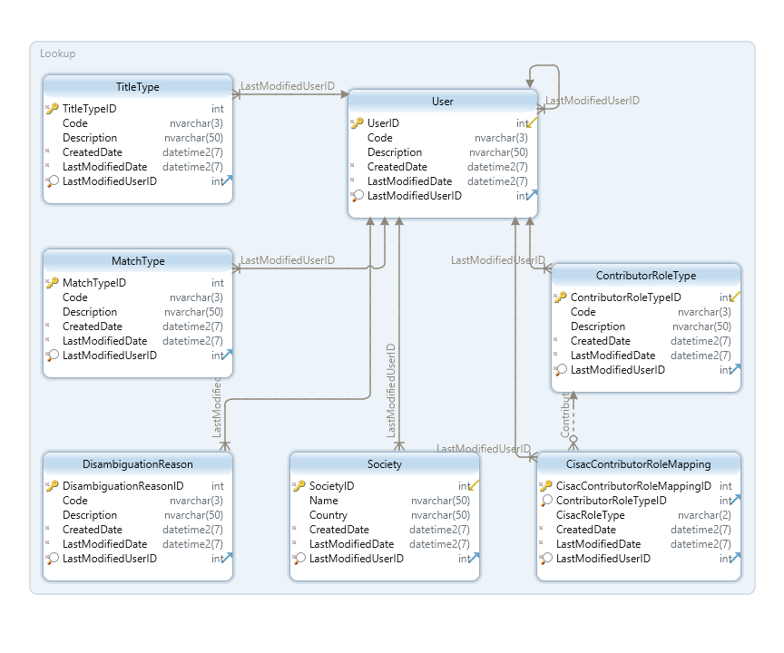

l  

CISAC

ISWC Data Model

# Document Control

## Change Record

Date

Person

Version/Reference

25th Feb 2019

Curnan Reidy

Initial version

1st Mar 2019

Curnan Reidy

First Draft completed

## Reviewers

Stephen Rollins

Peter Klauser

Sylvain Masson

Ed Osanani

Cynthia Lipskier

Vincent Poulain

Henk Dekker

Didier Roy

Hanna Mazur

José Macarro

Sylvain Piat

John Corley

## Distribution

Reviewers

## Approval

This document was approved electronically via email by the following people on the following dates:

Date/Time

Person

Note

# Table of Contents

Document Control	2

Change Record	2

Reviewers	2

Distribution	2

Approval	2

Table of Contents	4

1. Introduction	6

What does this document contain?	6

Who should read this document?	6

Glossary  	6

References	6

1. Overview 	7
	1. Design goals for the new ISWC data model	7
	2. Database Schemas	7
	3. Database Technology	7
	4. Non\-functional characteristics	8
		1. Scalability	8
			1. Core matching and validation	8
			2. Scaling for large data volumes	8
		2. Backup and recovery	8
		3. Access control	9
		4. Scheduled maintenance	9
2. ISWC Schema	10
	1. Work 	11
	2. ISWC 	11
	3. WorkInfo 	12
	4. Title 	13
	5. DisambiguationISWC 	14
	6. Contributor	15
	7. Performer 	16
	8. WorkInfoPerformer	17
3. IPI Schema	18
	1. InterestedParty 	18
	2. Agreement 	19
	3. Name	20
	4. IPNameUsage	20
	5. NameReference	21
	6. Status	21
4. Lookup Schema	22
	1. ContributorRoleType 	22
	2. CisacContributorRoleMapping	23
	3. DisambiguationReason	23
	4. MatchType 	24
	5. Society 	24
	6. TitleType 	24
	7. User 	25
5. Audit Schema	26
	1. Audit	26
	2. AuditRequest	27
	3. AuditRequestTransaction	29
		1. AuditRequestTransactionError object definition	31
		2. AuditRequestWork object definition	31
6. ISWC \(Cosmos DB\)	33
	1. ISWC	33
7. Matching Engine Schema	34
	1. Azure Search Indices	34
		1. Work Numbers 	34
		2. Work Name, Contributors, Performers	34
	2. Matching Settings Database	35

Appendix A – Open and Closed Items	36

1. Introduction

## What does this document contain?

It provides a detailed specification of the ISWC data model\. We expect that the design of the data model will evolve as we work through the next work packages, however this document will give a solid foundation of what the overall design of the data model will be\.

## Who should read this document?

CISAC development and project management personnel\.  Spanish Point development team members\.   

## Glossary  

  

## References

Reference

Description

[https://docs\.microsoft\.com/en\-us/azure/cosmos\-db](https://docs.microsoft.com/en-us/azure/cosmos-db) 

Cosmos DB – based on MongoDB

[https://docs\.microsoft\.com/en\-us/azure/search](https://docs.microsoft.com/en-us/azure/search) 

Azure Search – based on Lucene

[https://www\.mongodb\.com/what\-is\-mongodb](https://www.mongodb.com/what-is-mongodb) 

MongoDB

[http://lucene\.apache\.org/](http://lucene.apache.org/)

Lucene

[https://azure\.microsoft\.com/en\-us/services/key\-vault/](https://azure.microsoft.com/en-us/services/key-vault/) 

Azure Key Vault

1. Overview 

This chapter provides an overview of the Data Model for ISWC\.

## Design goals for the new ISWC data model

The design goals for the ISWC data model are as follows:

- New disambiguation data is accommodated to enable more accurate work matching
- The Audit tables are stored in a more scalable way using Cosmos DB
- Azure Search is used to facilitate scalable matching

## Database Schemas

The following are the database schemas that will comprise the new data model:

- ISWC
- IPI
- Lookup
- Audit
- ISWC \(Cosmos DB\)
- Azure Search Indices
- Matching Settings database

## Database Technology

The main ISWC database will use two Azure SQL databases – a Primary node and a Secondary read\-only replica\.

The Audit records will be stored in an Azure Cosmos DB database\. Azure Cosmos DB is a globally distributed NoSQL database service which is based on MongoDB\.

Azure Search will be used to store the search indices used by the Matching Engine\. Azure Search is a search service providing scalable full text search and querying capability that is based on Apache Lucene\. The data for these indices will be continuously synchronized from the main Azure SQL database

## Non\-functional characteristics

### Scalability

#### Core matching and validation

All core submission matching and validation will be carried out against Azure Search indices which are horizontally scalable\.

#### Scaling for large data volumes

The data volumes for the ISWC, IPI and Lookup schemas are well within the data volumes that can be handled by a RDBMS\. Log data, however, currently has 822 million rows in the existing database and has had to be manually partitioned across multiple tables for performance and maintenance reasons\. In the new solution this audit data will be stored in Cosmos DB using the Society Code and Created Date as a partition key\.

__Initial configuration of SQL Server__

- Managed instance of Azure SQL Server\. This will be initially configured as a Gen 5 Business Critical database \(vCore 24, Memory 122\.4 GB\)
- Secondary read\-only replica will be used for read\-only workloads
- Set number of DTUs that can be scaled up and down based on peak workloads and quiet periods\. 

__Initial config of Cosmos DB__

- An initial value of 1,000 RU \(Request Units\) will be provisioned\.

Note: The config settings will be finalized during the UAT and Integration Testing parts of the project\. 

### Backup and recovery

The following backup strategies will be implemented:

- Azure SQL Databases
	- An automated backup is taken for the Azure SQL databases every 12 hours and transaction log backups every 5\-10 minutes\. The retention policy for these backups is 35 days\. The restoration of the database can be done through the Azure portal in the event of any issues\.
- Cosmos DB
	- Azure Cosmos DB automatically takes a backup of the database every 4 hours and at any one point in time, only the latest 2 backups are stored\. For recovery within the 8 hours, Azure support will be contacted to restore the data from backup\.
- Azure Search
	- Azure do not provide a backup service for Azure Search\. If an issue occurs, we can recreate the Azure Search indices from the main ISWC database\.

### Access control

The following diagram shows the physical architecture of the data model\.

Azure Key Vault will be used to store connection strings and credentials needed to connect to each database\.

### Scheduled maintenance

Scheduled SQL maintenance tasks will be automated via Azure Automation\. This will allow index maintenance stored procedures to be executed on a scheduled basis\. These maintenance tasks are as follows:

- Index optimization on a weekly basis
- Update statistics on all tables daily

1. ISWC Schema

The ISWC schema contains the core ISWC tables\. The following is an ER diagram for the ISWC schema:

The new ISWC schema has largely preserved the Core schema from the existing database, with the addition of the following changes:  

- DisambiguationISWC table to store additional disambiguating ISWCs that are submitted by a society
- Additional fields on the WorkInfo table to store the disambiguation data, including Instrumentation, BVLTR and IPPerformer

The reason for this was to ensure the data conversion process is straightforward while ensuring that the new system benefits from the new functionality\. 

The following are the tables in this schema\. The Descriptions shown will be included in the database schema so can be used for reporting\.

## Work 

The Work table contains the base meta\-data for a work\. The following are the fields in the \[ISWC\]\.\[Work\] table\.

__Column__

__Data Type __

__Required__

__Description__

WorkID

Bigint

Yes

Work identifier

Status

Bit

Yes

Logically deleted status

Concurrency

Timestamp

Yes

Row version field

CreatedDate

Datetime2

Yes

Date that the entity instance was created

LastModifiedDate

Datetime2

Yes

Date of last modification

LastModifiedUserID

Int

Yes

The last modifying user 

Sample record from existing data model:

__WorkID__

__Status__

__CreatedDate__

__LastModifiedDate__

__LastModifiedUserID__

6902258987

1

2019\-01\-14 23:58:46

2019\-01\-14 23:58:46

AGENT

__SELECT__ work\_id__,__ 1 __as__ Status__,__ created\_dt__,__ last\_updated\_dt__,__ last\_updated\_user __FROM__ csi\_works __WHERE__ work\_id__=__6902258987__;__

## ISWC 

The ISWC table contains the ISWC record for a Work\. The following are the fields in the \[ISWC\]\.\[ISWC\] table\.

__Column__

__Data Type __

__Required__

__Description__

IswcID

Bigint

Yes

ISWC unique identifier

Status

Bit

Yes

Logically deleted status

Concurrency

Timestamp

Yes

Row version field

CreatedDate

Datetime2

Yes

Date that the entity instance was created

LastModifiedDate

Datetime2

Yes

Date of last modification

LastModifiedUserID

Int

Yes

The last modifying user 

Iswc

Nvarchar\(11\)

Yes

ISWC code

SocietyID

Int

Yes

CISAC society code reference

WorkID

Bigint

Yes

Work unique identifier reference

Sample record from existing data model including key fields:

__IswcID__

__CreatedDate__

__LastModifiedDate__

__Iswc__

__SocietyID__

__WorkID__

6907676587

2019\-01\-14 23:58:46

2019\-01\-14 23:58:46

T9272914359

315

6902258987

__SELECT__ iswc\_id__,__ created\_dt__,__ last\_updated\_dt__,__ iswc__,__ society\_code__,__ work\_id__ FROM__ csi\_iswc __WHERE__ work\_id__=__6902258987__;__

## WorkInfo 

The WorkInfo table contains the society submitted work records\. The following are the fields in the \[ISWC\]\.\[WorkInfo\] table\.

__Column__

__Data Type __

__Required__

__Description__

WorkInfoID

Bigint

Yes

Work Info identifier

Status

Bit

Yes

Logically deleted status

Concurrency

Timestamp

Yes

Row version field

CreatedDate

Datetime2

Yes

Date that the entity instance was created

LastModifiedDate

Datetime2

Yes

Date of last modification

LastModifiedUserID

Int

Yes

The last modifying user 

WorkID

Bigint

Yes

Work unique identifier reference

ArchivedIswc

Nvarchar\(11\)

No

Archived ISWC

CisnetLastModifiedDate

Datetime2

No

Date of last modification on CIS\-Net

CisnetCreatedDate

Datetime2

No

Date of creation on CIS\-Net

IPCount

Int

Yes

Number of IPs submitted

IsDeleted

Bit

Yes

Flag indicating society posting status

IswcEligible

Bit

Yes

Flag indicating eligibility

MatchTypeID

Int

No

Matching rule applied

MwiCategory

Nvarchar\(5\)

No

Work category from CIS\-Net

SocietyID

Int

Yes

CISAC society code reference

SocietyWorkCode

Nvarchar\(20\)

Yes

CISAC society provided Work Code

SourceDatabase

Int

Yes

Source database

Disambiguation

Bit

Yes

Flag to indicate if disambiguation data was included in the submission

DisambiguationReasonID

Int

No

Disambiguation data type

Instrumentation

Nvarchar\(150\)

No

Instrumentation if provided

BVLTR

Nvarchar\(1\)

No

Background, Logo, Theme, Visual and Rolled Up Cue if provided

IPPerformer

Nvarchar\(150\)

No

IP Performer if provided

Sample record from existing data model including key fields:

__WorkInfoID__

__IPCount__

__IswcEligible__

__SocietyID__

__SocietyWorkCode__

__SourceDatabase__

11886414285

1

Y

21

017417509

21

__SELECT__ work\_info\_id__,__ ip\_count__,__ iswc\_eligible__,__ society\_code__,__ society\_work\_code__,__ source\_db __FROM__ csi\_workinfo __WHERE__ work\_id__=__6902258987__;__

## Title 

The Title table contains any associated titles with a work\. The following are the fields in the \[ISWC\]\.\[Title\] table\.

__Column__

__Data Type __

__Required__

__Description__

TitleID

Bigint

Yes

Title unique identifier reference

Status

Bit

Yes

Logically deleted status

Concurrency

Timestamp

Yes

Row version field

CreatedDate

Datetime2

Yes

Date that the entity instance was created

LastModifiedDate

Datetime2

Yes

Date of last modification

LastModifiedUserID

Int

Yes

The last modifying user 

WorkID

Bigint

Yes

Work identifier reference

WorkInfoID

Bigint

Yes

Work info identifier reference

StandardizedTitle

Nvarchar\(512\)

Yes

Standardized title

Title

Nvarchar\(60\)

Yes

Raw title

TitleTypeID

Int

Yes

Title Type identifier reference

Sample record from existing data model including key fields:

__TitleID__

__WorkID__

__StandardizedTitle__

__Title__

__TitleTypeID__

8628224314

6902258987

THEORIAPRODBYSHELBYANTHONY

THEORIA PROD BY SHELBY ANTHONY

OT

__SELECT__ title\_id__,__ work\_id__,__ work\_info\_id__,__ s\_title__,__ title__,__ type\_code 

__FROM__ csi__\.__csi\_titles __WHERE__ work\_id__=__6902258987__;__

## DisambiguationISWC 

The DisambiguationISWC table contains any disambiguating ISWCs that may be sent by a society during a work submission\. The following are the fields in the \[ISWC\]\.\[DisambiguationISWC\] table\.

__Column__

__Data Type __

__Required__

__Description__

DisambiguationIswcID

Int

Yes

Disambiguation ISWC unique identifier

Status

Bit

Yes

Logically deleted status

Concurrency

Timestamp

Yes

Row version field

CreatedDate

Datetime2

Yes

Date that the entity instance was created

LastModifiedDate

Datetime2

Yes

Date of last modification

LastModifiedUserID

Int

Yes

The last modifying user 

Iswc

Nvarchar\(11\)

Yes

Disambiguation ISWC

WorkInfoID

Bigint

Yes

Work info identifier reference

## Contributor

The Contributor table stores any contributors, either writer or publisher, on a work\. The following are the fields in the \[ISWC\]\.\[Contributor\] table\.

__Column__

__Data Type __

__Required__

__Description__

InterestedPartyID

Int

Yes

Interested party identifier reference

WorkInfoID

Bigint

Yes

Work info identifier reference

Status

Bit

Yes

Logically deleted status

Concurrency

Timestamp

Yes

Row version field

CreatedDate

Datetime2

Yes

Date that the entity instance was created

LastModifiedDate

Datetime2

Yes

Date of last modification

LastModifiedUserID

Int

Yes

The last modifying user 

IsDispute

Bit

Yes

Contributor is in dispute

ContributorRoleTypeID

Int

Yes

Contributor role type

Sample record from existing data model including key fields:

__InterestedPartyID__

__WorkInfoID__

__IsDispute__

__ContributorRoleTypeID__

1

11886414285

N

C 

__SELECT__ 1__,__ w__\.__work\_info\_id__,__ t1__\.__dispute__,__ t1__\.__ip\_role\_code __FROM__ csi\_workinfo w __join__ csi\_workinfo\_ip t1 __on__ w__\.__work\_info\_id __=__ t1__\.__work\_info\_id __WHERE__ work\_id__=__6902258987__;__

## Performer 

The Performer table stores the full list of performers in the database\. The following are the fields in the \[ISWC\]\.\[Performer\] table\.

__Column__

__Data Type __

__Required__

__Description__

PerformerID

Bigint

Yes

Work info performer identifier

Status

Bit

Yes

Logically deleted status

Concurrency

Timestamp

Yes

Row version field

CreatedDate

Datetime2

Yes

Date that the entity instance was created

LastModifiedDate

Datetime2

Yes

Date of last modification

LastModifiedUserID

Int

Yes

The last modifying user 

FirstName

Nvarchar\(50\)

No

First name of performer

LastName

Nvarchar\(50\)

Yes

Last name of performer

Sample record from existing data model including key fields:

__PerformerID__

__FirstName__

__LastName__

27174506

AARON ELIYAH

__select__ perf__\.__perf\_id__,__ perf__\.__fstname__,__ perf__\.__lstname __from__ csi\_workinfo\_performer p

__join__ csi\_workinfo wi __on__ p__\.__work\_info\_id__=__wi__\.__work\_info\_id

__join__ csi\_performer perf __on__ perf__\.__perf\_id__=__p__\.__perf\_id

__where__ work\_id__=__6902258987__;__

## WorkInfoPerformer

The WorkInfoPerformer table stores the link between a work and its associated performers\. The following are the fields in the \[ISWC\]\.\[WorkInfoPerformer\] table\.

__Column__

__Data Type __

__Required__

__Description__

WorkInfoID

Bigint

Yes

Work info unique identifier reference

PerformerID

Bigint

Yes

Performer unique identifier reference

Status

Bit

Yes

Logically deleted status

Concurrency

Timestamp

Yes

Row version field

CreatedDate

Datetime2

Yes

Date that the entity instance was created

LastModifiedDate

Datetime2

Yes

Date of last modification

LastModifiedUserID

Int

Yes

The last modifying user 

1. IPI Schema

The IPI schema contains the SUISA IPI data\. The following is an ER diagram for the ISWC schema:

The following change has been made to the IPI schema from the existing ISWC data model:

- The BirthDate and DeathDate fields have been consolidated from the existing data model, which split out these fields into their constituent parts\.

The following are the tables in this schema:

## InterestedParty 

The InterestedParty table contains the base data for an IP\. The following are the fields in the \[IPI\]\.\[InterestedParty\] table\.

__Column__

__Data Type __

__Required__

__Description__

InterestedPartyID

Int

Yes

Interested party identifier

IPBaseNumber

Nvarchar\(13\)

Yes

Interested party base number

AmendedDateTime

Datetime2

Yes

Amended date/time

BirthDate

Datetime2

No

Birth date

BirthPlace

Nvarchar\(11\)

No

Birth place

BirthState

Nvarchar\(11\)

No

Birth state

DeathDate

Datetime2

No

Death date

Gender

Nvarchar\(1\)

No

Gender

Type

Nvarchar\(1\)

Yes

Interested party type

Sample record from existing data model including key fields:

__InterestedPartyID__

__IPBaseNumber__

__BirthDate__

__DeathDate __

__BirthPlace__

__Gender__

__Type__

1

I\-000000015\-5

1918\-01\-07

2009\-09\-08

F

N

__select__ 1__,__ ipbasenr__,__ make\_date__\(cast\(__birthyy __as__ __int\),__ __cast\(__birthmm __as__ __int\),__ __cast\(__birthdd __as__ __int\)\),__ make\_date__\(cast\(__deathyy __as__ __int\),__ __cast\(__deathmm __as__ __int\),__ __cast\(__deathdd __as__ __int\)\),__ birthplace__,__ gender__,__ iptyp

__FROM__ ipir__\.__ipi\_basedat

__where__ ipbasenr __=__ 'I\-000000015\-5'__;__

## Agreement 

The Agreement table contains the associated agreements with interested parties\. The following are the fields in the \[IPI\]\.\[Agreement\] table\.

__Column__

__Data Type __

__Required__

__Description__

AgreementID

Bigint

Yes

Membership agreements identifier

AmendedDateTime

Datetime2

Yes

Amended date/time

CreationClass

Nvarchar\(2\)

Yes

Creation class

FromDate

Datetime2

Yes

Date/time of commencement

ToDate

Datetime2

Yes

Date/time of termination

InterestedPartyID

Int

Yes

Interested party reference

EconomicRights

Nvarchar\(2\)

Yes

Economic rights

Role

Nvarchar\(2\)

Yes

Role within the creation class

SharePercentage

Decimal\(5,2\)

Yes

Share percentage

SignedDate

Datetime2

No

Agreement date/time of sign off

SocietyID

Int

Yes

Society of membership

## Name

The Name table contains the IPNameNumber and names of interested parties\. The following are the fields in the \[IPI\]\.\[Name\] table\.

__Column__

__Data Type __

__Required__

__Description__

IPNameNumber

Int

Yes

Interested party name number

AmendedDateTime

Datetime2

Yes

Amended date/time

FirstName

Nvarchar\(45\)

No

First name

LastName

Nvarchar\(45\)

No

Last name

CreatedDate

Datetime2

Yes

Date/time the name entry was created

TypeCode

Nvarchar\(2\)

No

Type of name entry

ForwardingNameNumber

Int

Yes

Forwarding name number

## IPNameUsage

The IPNameUsage table contains the role of the interested party, linking the interested party table and the name table\. The following are the fields in the \[IPI\]\.\[IPNameUsage\] table\.

__Column__

__Data Type __

__Required__

__Description__

IPNameNumber

Int

Yes

Interested party name number reference

InterestedPartyID

Int

Yes

Interested party reference

Role

Nvarchar\(2\)

No

Role within the creation class

CreationClass

Nvarchar\(2\)

No

Creation class

## NameReference

The NameReference table contains the link between the interested party table and the name table\. The following are the fields in the \[IPI\]\.\[NameReference\] table\.

__Column__

__Data Type __

__Required__

__Description__

IPNameNumber

Int

Yes

Interested party name number reference

InterestedPartyID

Int

Yes

Interested party reference

AmendedDateTime

Datetime2

Yes

Amended date/time

## Status

The Status table contains the status of the interested party between certain dates\. The following are the fields in the \[IPI\]\.\[Status\] table\.

__Column__

__Data Type __

__Required__

__Description__

StatusID

Int

Yes

Status identifier

InterestedPartyID

Int

Yes

Interested party reference

AmendedDateTime

Datetime2

Yes

Amended date/time

FromDate

Datetime2

Yes

Date/time of commencement

ToDate

Datetime2

Yes

Date/time of termination

ForwardingBaseNumber

Nvarchar\(13\)

Yes

Forwarding base number

StatusCode

Int

Yes

Status of base number

1. Lookup Schema

The Lookup schema contains reference data for the ISWC and IPI database schemas\. The following is an ER diagram for the Lookup schema:

The following are the tables in this schema:

## ContributorRoleType 

The ContributorRoleType tables stores the contributor role types\. The following are the fields in the \[Lookup\]\.\[ContributorRoleType\] table\.

__Column__

__Data Type __

__Required__

__Description__

ContributorRoleTypeID

Int

Yes

Contributor role type identifier

Code

Nvarchar\(3\)

Yes

Entity instance code

Description

Nvarchar\(50\)

Yes

Entity instance description

CreatedDate

Datetime2

Yes

Date that the entity instance was created

LastModifiedDate

Datetime2

Yes

Date of last modification

LastModifiedUserID

Int

Yes

The last modifying user

## CisacContributorRoleMapping

The CisacContributorRoleMapping table stores the mapping between the CISAC contributor roles and the Contributor roles\. The following are the fields in the \[Lookup\]\.\[CisacContributorRoleMapping\] table\.

__Column__

__Data Type __

__Required__

__Description__

CisacContributorRoleMappingID

Int

Yes

CISAC contributor role mapping ID

ContributorRoleTypeID

Int

Yes

Internal CSI role type

CisacRoleType

Nvarchar\(2\)

Yes

CISAC role type

CreatedDate

Datetime2

Yes

Date that the entity instance was created

LastModifiedDate

Datetime2

Yes

Date of last modification

LastModifiedUserID

Int

Yes

The last modifying user

## DisambiguationReason

The DisambiguationReason table stores the possible values for disambiguation reasons\. The following are the fields in the \[Lookup\]\.\[DisambiguationReason\] table\.

__Column__

__Data Type __

__Required__

__Description__

DisambiguationReasonID

Int

Yes

Disambiguation reason identifier

Code

Nvarchar\(3\)

Yes

Entity instance code

Description

Nvarchar\(50\)

Yes

Entity instance description

CreatedDate

Datetime2

Yes

Date that the entity instance was created

LastModifiedDate

Datetime2

Yes

Date of last modification

LastModifiedUserID

Int

Yes

The last modifying user

## MatchType 

The MatchType table stores the possible values for match types\. The following are the fields in the \[Lookup\]\.\[MatchType\] table\.

__Column__

__Data Type __

__Required__

__Description__

MatchTypeID

Int

Yes

Match type identifier

Code

Nvarchar\(3\)

Yes

Entity instance code

Description

Nvarchar\(50\)

Yes

Entity instance description

CreatedDate

Datetime2

Yes

Date that the entity instance was created

LastModifiedDate

Datetime2

Yes

Date of last modification

LastModifiedUserID

Int

Yes

The last modifying user

## Society 

The Society table stores the full list of societies in the database\. The following are the fields in the \[Lookup\]\.\[Society\] table\.

__Column__

__Data Type __

__Required__

__Description__

SocietyID

Int

Yes

Society identifier

Name

Nvarchar\(50\)

Yes

Society name

Country

Nvarchar\(50\)

No

Country

CreatedDate

Datetime2

Yes

Date that the entity instance was created

LastModifiedDate

Datetime2

Yes

Date of last modification

LastModifiedUserID

Int

Yes

The last modifying user

## TitleType 

The TitleType table stores the possible values for title types\. The following are the fields in the \[Lookup\]\.\[TitleType\] table\.

__Column__

__Data Type __

__Required__

__Description__

TitleTypeID

Int

Yes

Title type identifier

Code

Nvarchar\(3\)

Yes

Entity instance code

Description

Nvarchar\(50\)

Yes

Entity instance description

CreatedDate

Datetime2

Yes

Date that the entity instance was created

LastModifiedDate

Datetime2

Yes

Date of last modification

LastModifiedUserID

Int

Yes

The last modifying user

## User 

The User table stores the list of possible users\. The following are the fields in the \[Lookup\]\.\[User\] table\.

__Column__

__Data Type __

__Required__

__Description__

UserID

Int

Yes

User identifier

Code

Nvarchar\(3\)

Yes

Entity instance code

Description

Nvarchar\(50\)

Yes

Entity instance description

CreatedDate

Datetime2

Yes

Date that the entity instance was created

LastModifiedDate

Datetime2

Yes

Date of last modification

LastModifiedUserID

Int

Yes

The last modifying user

1. Audit Schema

The Audit schema contains the audit data and is stored in Cosmos DB\. Data in Cosmos DB is stored as collections of JSON objects\. A collection is the equivalent of a table in an SQL database\. The following is an ER diagram for the logical grouping of the collections:

The following are the collections in this schema:

## Audit

The Audit collection stores the top\-level log data for a submission\. The following are the fields in the \[Audit\] collection\.

__Field__

__Data Type __

__Required__

__Description__

partitionKey

String

Yes

Used to sort the records into partitions\. Will be formatted as XXXDDD where XXX is the SocietyCode and DDD the month of the CreatedDate e\.g\. Society 222 and Created Date in January gives PK = 2221

auditId

Number

Yes

Audit identifier

sessionId

String

Yes

Session identifier

societyCode

Number

Yes

CISAC society identifier

senderName

String

Yes

Internal system sender identifier

createdDate

ISO 8601 String 

Yes

Date that the entity instance was created

lastModifiedDate

ISO 8601 String

Yes

Date of last modification

lastModifiedUser

String

Yes

The last modifying user

Sample record from existing data model including key fields:

__\{__

  "partitionKey"__:__ "351"__,__

  "auditId"__:__ 8700795503__,__

  "sessionId"__:__ "01012019163127\-sync"__,__

  "societyCode"__:__ 35__,__

  "senderName"__:__ "WEBSERVICE"__,__

  "createdDate"__:__ "2019\-01\-01T16:31:27\.000Z"__,__

  "lastModifiedDate"__:__ "2019\-01\-01T16:31:27\.000Z"__,__

  "lastModifiedUser"__:__ "WEBSERVICE"

__\}__

__select__ __\*__ __from__ csi\_audit __where__ audit\_id __=__ 8700795503

## AuditRequest

The AuditRequest collection stores the log data for individual requests\. The following are the fields in the \[AuditRequest\] collection\.

__Field__

__Data Type __

__Required__

__Description__

partitionKey

String

Yes

Used to sort the records into partitions\. Will be formatted as XXXDDD where XXX is the SocietyCode and DDD the month of the CreatedDate e\.g\. Society 222 and Created Date in January gives PK = 2221

requestId

Number

Yes

Request identifier

auditId

Number

Yes

Audit identifier reference

recordId

Number

Yes

Record number in the batch

groupId

Number

Yes

Request group identifier

societyCode

String

Yes

CISAC society identifier

isProcessingFinished

Boolean

No

Flag for processing completion

isProcessingError

Boolean

No

Flag for processing error

processingCompletionDate

ISO 8601 String

No

Date processing completed

createdDate

ISO 8601 String

Yes

Date that the entity instance was created

lastModifiedDate

ISO 8601 String

Yes

Date of last modification

lastModifiedUser

String

Yes

The last modifying user

Sample record from existing data model including key fields:

__\{__

  "partitionKey"__:__ "351"__,__

  "requestId"__:__ 33704768964__,__

  "auditId"__:__ 8700795503__,__

  "recordId"__:__ 1__,__

  "groupId"__:__ 1__,__

  "societyCode"__:__ 35__,__

  "isProcessingFinished"__:__ __true,__

  "isProcessingError"__:__ __true,__

  "processingCompletionDate"__:__ "2019\-01\-01T16:31:27\.000Z"__,__

  "createdDate"__:__ "2019\-01\-01T16:31:27\.000Z"__,__

  "lastUpdatedDate"__:__ "2019\-01\-01T16:31:27\.000Z"__,__

  "lastUpdatedUser"__:__ "WEBSERVICE"

__\}__

__select__ __\*__ __from__ csi\_audit\_req __where__ audit\_id __=__ 8700795503

## AuditRequestTransaction

The AuditRequestTransaction collection stores the log data for individual transactions\. The following are the fields in the \[AuditRequestTransaction\] collection\.

__Field__

__Data Type __

__Required__

__Description__

partitionKey

String

Yes

Used to sort the records into partitions\. Will be formatted as XXXDDD where XXX is the SocietyCode and DDD the month of the CreatedDate e\.g\. Society 222 and Created Date in January gives PK = 2221

requestTransactionId

Number

Yes

Request Transaction identifier

requestId

Number

Yes

Request identifier reference

societyCode

String

Yes

CISAC society identifier

requestType

String

Yes

Request transaction type

createdDate

ISO 8601 String

Yes

Date that the entity instance was created

lastModifiedDate

ISO 8601 String

Yes

Date of last modification

lastModifiedUser

String

Yes

The last modifying user

workIdBefore

Number

No

Work Info identifier reference before transaction completes

workIdAfter

Number

No

Work Info identifier reference after transaction completes

updateReason

Number

No

Update reason

transactionSequence

Number

Yes

Transaction sequence number

transactionErrors

Array of TransactionError

No

Array of any transaction errors

work

AuditRequestWork

Yes

Work details of transaction

Sample record from existing data model including key fields:

__\{__

  "partitionKey"__:__ "351"__,__

  "requestTransactionId"__:__ 888864052__,__

  "requestId"__:__ 33704768964__,__

  "requestType"__:__ "CAR"__,__

  "createdDate"__:__ "2019\-01\-01T16:31:27\.000Z"__,__

  "lastUpdatedDate"__:__ "2019\-01\-01T16:31:27\.000Z"__,__

  "lastUpdatedUser"__:__ "WEBSERVICE"__,__

  "workIdAfter"__:__ __null,__

  "workIdBefore"__:__ __null,__

  "updateReason"__:__ __null,__

  "transactionSequence"__:__ 0__,__

  "transactionErrors"__:__ __\[__

    __\{__

      "errorReasonCode"__:__ "2014\.1000"__,__

      "errorData"__:__ ""__,__

      "createdDate"__:__ "2019\-01\-01T16:31:27\.000Z"__,__

      "lastUpdatedDate"__:__ "2019\-01\-01T16:31:27\.000Z"__,__

      "lastUpdatedUser"__:__ "WEBSERVICE"

    __\}__

  __\],__

  "work"__:__ __\{__

    "societyWorkCode"__:__ "19026297\-001"__,__

    "sourceDb"__:__ 35__,__

    "society"__:__ 35__,__

    "submittedISWC"__:__ ""__,__

    "preferredISWC"__:__ ""__,__

    "category"__:__ "DOM"__,__

    "isDeleted"__:__ __false,__

    "postedDate"__:__ __null,__

    "createdDate"__:__ "2019\-01\-01T16:31:27\.000Z"__,__

    "lastUpdatedDate"__:__ "2019\-01\-01T16:31:27\.000Z"__,__

    "lastUpdatedUser"__:__ "WEBSERVICE"__,__

    "titles"__:__ __\[\],__

    "contributors"__:__ __\[\]__

  __\}__

__\}__

__select__ tx__\.\*,__ er__\.\*,__ w__\.\*__ __from__ csi\_audit\_req req

__join__ csi\_audit\_req\_tx tx __on__ req__\.__req\_id __=__ tx__\.__req\_id

__join__ csi\_audit\_req\_tx\_error er __on__ tx__\.__req\_tx\_id __=__ er__\.__req\_tx\_id

__join__ csi\_audit\_req\_work w __on__ w__\.__req\_tx\_id __=__ tx__\.__req\_tx\_id

__where__ audit\_id __=__ 8700795503

### AuditRequestTransactionError object definition

The following are the fields in the \[AuditRequestTransactionError\] object:

__Field__

__Data Type __

__Required__

__Description__

errorReasonCode

String

Yes

Exception code

errorData

String

No

Associated meta\-data with the error

createdDate

ISO 8601 String

Yes

Date that the entity instance was created

lastModifiedDate

ISO 8601 String

Yes

Date of last modification

lastModifiedUser

String

Yes

The last modifying user

### AuditRequestWork object definition

The following are the fields in the \[AuditRequestWork\] object:

__Field__

__Data Type __

__Required__

__Description__

societyWorkCode

String

No

Submitting society work code

sourceDb

Number

No

Society code for source database

society

Number

No

Submitting society

submittedISWC

String

No

Submitted ISWC 

preferredISWC

String

No

Preferred ISWC at point in time

category

String

No

CIS\-Net work category

isDeleted

Boolean

No

Flag work deletion status of work

postedDate

ISO 8601 String

No

Date that the work was posted in CIS\-Net

createdDate

ISO 8601 String

Yes

Date that the entity instance was created

lastModifiedDate

ISO 8601 String

Yes

Date of last modification

lastModifiedUser

String

Yes

The last modifying user

titles \[\]

JSON

No

Title JSON data

contributors \[\]

JSON

No

Contributor JSON data

1. ISWC \(Cosmos DB\)

The ISWC schema that is stored in Cosmos DB will contain a single collection called ISWC\. This collection will store the next value of the ISWC to be issued\.

## ISWC

The following are the fields in the \[ISWC\] collection\.

__Field__

__Data Type __

__Required__

__Description__

iswc

String

Yes

Next value of ISWC to be issued

1. Matching Engine Schema

The Spanish Point Matching Engine comprises of two schemas: Azure Search Indices and an SQL database\. 

The Core Matching Engine has a work name and connected party index\. This includes titles, creators, publishers and performers and a number index including ISWCs and society work numbers\. Once the business rules are defined, then the exact fields that are synchronized to the index will be finalized\.

## Azure Search Indices

The following are the indices that will be created:

### Work Numbers 

The WorkNumbers index contains all work numbers from the SQL database including ISWCs and Society work numbers\. The following are the fields in this index\.

__Column__

__Data Type __

__Required__

__Description__

GeneratedID

String

Yes

Autogenerated identifier

WorkCode

Int

Yes

Mapped from ISWC\.Work\.WorkID

TypeCode

String

Yes

Mapped from ISWC\.WorkInfo\.SocietyID or “ISWC”

Number

String

Yes

Mapped from ISWC\.WorkInfo\.SocietyWorkCode or ISWC\.ISWC\.Iswc

IsDeleted

Boolean

Yes

Logically deleted status of entity

### Work Name, Contributors, Performers  

The Repertoire\-Work Name, Contributors, Performers index contains all work titles, contributors and performers from the SQL database\. The following are the fields in this index\.

__Column__

__Data Type __

__Required__

__Description__

GeneratedID

String

Yes

Autogenerated identifier

WorkCode

Int

Yes

Mapped from ISWC\.Work\.WorkID

WorkName

String

Yes

Mapped from ISWC\.Title\.Title

WorkNameType

Int

Yes

Mapped from ISWC\.Title\.TitleTypeID

PersonID

Int

Yes

Mapped from either ISWC\.Contributor\.WorkInfoID or ISWC\.Performer\.PerformerID

Name

String

Yes

Mapped from IPI\.Name\.LastName

PersonType

Int

Yes

Mapped from whether the record is a Performer or Contributor Type

ContributorType

Int

Yes

Mapped from ISWC\.Contributor\.ContributorRoleTypeID

IsDeleted

Boolean

Yes

Logically deleted status of entity

IPINumber

String

Yes

Mapped from IPI\.Name\.IPINameNumber

## Matching Settings Database

An SQL Azure database contains the matching rules parameters\. This database contains all configurable rules for the matching engine\. Any updates to this existing schema will be defined after the To Be Business Rules are finalized\.

# Appendix A – Open and Closed Items

This appendix provides a tracking list of specific issues/queries raised by CISAC during the specification process and how they were incorporated or excluded from this specification:

__Open and Closed Items__

__ID__

__Description__

__Response__

__Status__

__Next Action By__

1

In the existing data model, the work contributors for a work are linked to a single record in the csi\_workinfo table\. Is there a reason for this or can we link the work contributors directly to the Work table in the new data model?

Sample query to show the issue: __select__ \* __from__ csi\_workinfo wi

__join__ csi\_workinfo\_ip ip __on__ ip\.work\_info\_id=wi\.work\_info\_id

__where__ work\_id=378

