  

CISAC

MVP Matching Rules – Design 

# Document Control

## Change Record

Date

Person

Version/Reference

24th Apr 2019

John Corley

Initial version

28th May 2019

John Corley

Updates following feedback from first workshop and subsequent reviews

18th Jun 2019

John Corley & Curnan Reidy

Updates from previous workshop \+ completion of Processing pipeline component details

## Reviewers

Zsófia Szöllősi \- ARTISJUS

Nóra Varga \- ARTISJUS

Györgyi Németh \- ARTISJUS

Bolmar Carrasquilla \- ASCAP

Janise Hooper \- BMI

Ed Oshanani \- BMI

José Macarro \- CISAC

Didier Roy \- FastTrack

Hanna Mazur \- FastTrack

Jens Vinsby \- KODA

Katrien Tielemans \- SABAM

Cynthia Lipskier \- SACEM

Xavier Costaz \- SACEM

Declan Rudden \- SaorServices

Niamh McGarry\-SaorServices

Roisin Jones – Saor Services

Curnan Reidy \- SpanishPoint

Peter Klauser \- SUISA

## Distribution

Reviewers

## Approval

This document was approved electronically via email by the following people on the following dates:

Date/Time

Person

Note

# Table of Contents

[Document Control	2](#_Toc11738373)

[Change Record	2](#_Toc11738374)

[Reviewers	2](#_Toc11738375)

[Distribution	3](#_Toc11738376)

[Approval	3](#_Toc11738377)

[Table of Contents	4](#_Toc11738378)

[1	Introduction	7](#_Toc11738379)

[What does this document contain?	7](#_Toc11738380)

[Who should read this document?	7](#_Toc11738381)

[Glossary	7](#_Toc11738382)

[References	7](#_Toc11738383)

[2	Overview	8](#_Toc11738384)

[2\.1 Scope	8](#_Toc11738385)

[2\.2 Matching Rule Configuration	8](#_Toc11738386)

[2\.3 Matching Rule Implementation	8](#_Toc11738387)

[3	ISWC Database Matching Pipeline	10](#_Toc11738388)

[3\.1 Submission Data	12](#_Toc11738389)

[3\.1\.1 POST/submission	12](#_Toc11738390)

[3\.1\.1\.1\. “body” Parameter	12](#_Toc11738391)

[3\.1\.1\.2\. Example “body” Parameter value	14](#_Toc11738392)

[3\.1\.2 PUT/submission	15](#_Toc11738393)

[3\.1\.3 DELETE/submission	15](#_Toc11738394)

[3\.1\.4 POST/iswc/merge	15](#_Toc11738395)

[3\.1\.5 GET /iswc/workflowTasks	16](#_Toc11738396)

[3\.1\.6 PATCH /iswc/workflowTasks	17](#_Toc11738397)

[3\.1\.7 GET /iswc/searchByIswc	18](#_Toc11738398)

[3\.1\.8 GET /iswc/searchByAgencyWorkCode	20](#_Toc11738399)

[3\.1\.9 POST /iswc/searchByTitleAndContributor	21](#_Toc11738400)

[3\.2 Matching Engine API	22](#_Toc11738401)

[3\.3 Matching Engine API	23](#_Toc11738402)

[3\.3\.1 GET/Work/Match	23](#_Toc11738403)

[3\.3\.1\.1\. InputWorkInfo  Parameter	23](#_Toc11738404)

[3\.3\.1\.2\. MatchResult Response	25](#_Toc11738405)

[3\.4 Matching for ISWC Eligible Submitter	26](#_Toc11738406)

[3\.5 Matching for ISWC Non\-Eligible Submitter	27](#_Toc11738407)

[3\.6 Match for Search	28](#_Toc11738408)

[3\.7 Match an Existing Submission for ISWC Eligible Submitter	29](#_Toc11738409)

[3\.8 Match an Existing Submission for ISWC Non\-Eligible Submitter	30](#_Toc11738410)

[3\.9 Rank Results	31](#_Toc11738411)

[3\.9\.1 Initial Ranking	31](#_Toc11738412)

[3\.9\.2  Following “LinkedTo” chain	32](#_Toc11738413)

[3\.10 Match Related ISWCs \(Derived or Merged\)	32](#_Toc11738414)

[3\.11 Alter IPs and then redo matching	33](#_Toc11738415)

[4	Matching Rule Configuration	35](#_Toc11738416)

[4\.1 Existing Spanish Point Matching Engine Configuration Tool	35](#_Toc11738417)

[4\.2 Key Proposed Matching Settings for CISAC ISWC Database	37](#_Toc11738418)

[4\.2\.1 Configuration for “Eligible” Source	38](#_Toc11738419)

[4\.2\.2 Configuration for “NonEligible” Source	40](#_Toc11738420)

[5	ISWC Processing \(Assignment\) Pipeline	44](#_Toc11738421)

[5\.1 Scenario AS/01 – ISWC Eligible Submission Associated with existing Preferred ISWC	44](#_Toc11738422)

[5\.1\.1 WorkInfo	44](#_Toc11738423)

[5\.1\.2 Title	45](#_Toc11738424)

[5\.1\.3 DisambiguationISWC	45](#_Toc11738425)

[5\.1\.4 DerivedFrom	46](#_Toc11738426)

[5\.1\.5 Creator	46](#_Toc11738427)

[5\.1\.6 Publisher	47](#_Toc11738428)

[5\.1\.7 Performer	47](#_Toc11738429)

[5\.1\.8 WorkInfoPerformer	48](#_Toc11738430)

[5\.1\.9 WorkInfoInstrumentation	48](#_Toc11738431)

[5\.2 Scenario AS/02 – ISWC Ineligible Submission Associated with existing Preferred ISWC	48](#_Toc11738432)

[5\.2\.1 WorkInfo	48](#_Toc11738433)

[5\.3 Scenario AS/03 – ISWC Eligible Submission with new Preferred ISWC level details	49](#_Toc11738434)

[5\.3\.1 ISWC	50](#_Toc11738435)

[5\.3\.2 WorkInfo	50](#_Toc11738436)

[5\.3\.3 Title	51](#_Toc11738437)

[5\.3\.4 DisambiguationISWC	51](#_Toc11738438)

[5\.3\.5 DerivedFrom	52](#_Toc11738439)

[5\.3\.6 Creator	52](#_Toc11738440)

[5\.3\.7 Publisher	53](#_Toc11738441)

[5\.3\.8 Performer	53](#_Toc11738442)

[5\.3\.9 WorkInfoPerformer	54](#_Toc11738443)

[5\.3\.10 WorkInfoInstrumentation	54](#_Toc11738444)

[5\.4 Scenario AS/04 – Update ISWC Eligible Submission with new Preferred ISWC level details	54](#_Toc11738445)

[5\.4\.1 Title	55](#_Toc11738446)

[5\.4\.2 Creator	55](#_Toc11738447)

[5\.4\.3 Publisher	56](#_Toc11738448)

[5\.5 Scenario AS/05 – Update ISWC Eligible Submission with valid Preferred ISWC level details where the Preferred ISWC is different from the current Preferred ISWC	56](#_Toc11738449)

[5\.5\.1 ISWCLinkedTo	57](#_Toc11738450)

[5\.6 Scenario AS/08 – Update ISWC Ineligible Submission with valid Preferred ISWC level details where the Preferred ISWC is different from the current Preferred ISWC	57](#_Toc11738451)

[5\.7 Scenario AS/09 – Delete ISWC Submission	58](#_Toc11738452)

[5\.8 Scenario AS/10 – Recalculating ISWC Eligible and Authoritative flags	58](#_Toc11738453)

[5\.9 Approval Workflow Tasks \(Formerly Known as Corrections Tasks\)	58](#_Toc11738454)

[5\.9\.1 Workflow Types	58](#_Toc11738455)

[5\.9\.2 Workflow Task Data Structure	59](#_Toc11738456)

[5\.9\.3 Adding Update Approval Workflows	61](#_Toc11738457)

[5\.9\.4 Adding Merge Approval Workflows	61](#_Toc11738458)

[5\.9\.5 Retrieving and Actioning Workflow Tasks	61](#_Toc11738459)

[Appendix A – Open and Closed Items	64](#_Toc11738460)

1. Introduction

## What does this document contain?

The purpose of this design document is to take the matching rules agreed in the WBS 1\.2 \(MVP 'To Be' Business Rules\) document and describe in detail how these rules will be implemented in the new ISWC database\.

## Who should read this document?

CISAC development and project management personnel\.  Spanish Point development team members\.   

## Glossary  

  

## References

Reference

Description

SPE\_20190218\_ISWCDataModel\.docx

New ISWC Database Data Model

REQ\_20190212\_MVP To Be Business Rules\.xlsx

‘To Be’ Business Rules 

SPE\_20190424\_MVPValidationRules\.docx

Validation Rules specification

1. Overview  

This chapter provides an overview of the proposed solution for implementing matching rules in the new ISWC Database solution\.

## Scope

This document covers the implementation of the agreed ‘To Be’ business rules as described in the following tabs of the MVP ‘To Be’ Business Rules document \(see references above\):

- Matching
- Processing \(Assignment\)

## Matching Rule Configuration

We propose to use the existing Spanish Point Matching Engine configuration application to support the configuration of matching rules required for the ISWC Database solution\.   The matching engine configuration application and any specific enhancements needed for the ISWC database are described in chapter four of this specification\. 

## Matching Rule Implementation

All matching will be carried out by the Spanish Point Matching Engine\.  The existing matching engine will be extended to cater for rules not currently in place in the matching engine\.  

The following diagram outlines the overall architecture of the new ISWC Database system and indicates where this component fits within that solution\. 

Components tagged in the diagram \(1\-4\) above have more detailed explanations below:

1. The main processing component for the new ISWC database will be a new custom developed REST based Web API\.  This Web API will process both individual transactions and batches of transactions
2. The ISWC Database REST based Web API will use a Validation Pipeline to implement all validation rules\.  This is covered in the MVP Validation Rules specification\.  See the references section of this document for details\. 
3. The ISWC Database Web API will use a Matching Pipeline that will in turn call the Spanish Point Matching Engine through its own web API to carry out all matching tasks\.  This is described in Chapter 3 of this specification document\. 
4. The ISWC Database Web API will update the core ISWC database and assign ISWCs through a custom developed Processing \(Assignment\) pipeline\.  
5. ISWC Database Matching Pipeline

The matching pipeline will be used by the ISWC Database REST based Web API to call the matching engine with the appropriate parameters depending in the type of submission\. 

The matching pipeline consists of a sequence of pipeline components\.  Each pipeline component will be implemented as a \.net core class within the Web API solution and will be loaded dynamically as a distinct versioned \.dll\.  

Each matching pipeline component will call the matching engine using a specific mapping of data from the submission\.  Some pipeline components are only applicable to certain types of submission\.   

All matching pipeline components will use a common error handling framework for identifying error codes and corresponding messages\. It will capture these along with the pipeline component version and rule identifiers in a set of tracking data that will be logged along with the transaction in the system \(stored in the Cosmos DB No SQL database\)\. 

All matching pipeline components will be deployed through an automated Azure Dev Ops pipeline through the different environment tiers \(dev, uat, staging and production\)\.   Each pipeline component will have a comprehensive set of associated unit tests built into them and these unit tests will be automatically executed as part of the automated release process\.   

## Submission Data

The following shows an initial draft of the REST based Web API\.  The full API will be defined in WBS 1\.6\.  The purpose of this initial draft is to define the data fields available in an ISWC submission so that those specific fields can be referenced in the matching pipeline components’ implementation later in this chapter\.   Note: Some of this section is also repeated in the WBS 1\.4 specification document\. 

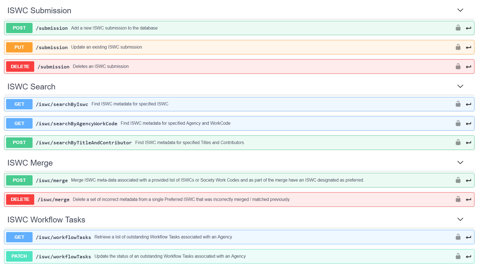

Figure 1 \- Operations used in Web API

Notes: 

1. Not all operations that will be supported are listed above
2. The operations show above deal with individual submission data\.  The full Web API will include the ability to process an array of submissions in a single operation\. 

### POST/submission

This operation represents an add of a new ISWC submission to the database\.  Equivalent of the CAR transaction in EDI\.

#### “body” Parameter

The POST will include the following required “body” parameter:

__Submission\{__

__agency\*__

__string*  
minLength: 3  
maxLength: 3*__

__sourcedb\*__

__integer\($int64\)__

__workcode\*__

__string__

__iswc__

__string*  
pattern: T\[0\-9\]\{9\}10*__

__The submitted ISWC__

__preferredIswc__

__string*  
pattern: T\[0\-9\]\{9\}10*__

__The preferred ISWC__

__category__

__string__

__originalTitle\*__

__string__

__disambiguation__

__boolean__

__disambiguationReason__

__DisambiguationReasonstring__

__Disambiguation Reason Code__

__Enum:  
\[ DIT, DIA, DIE, DIC, DIP, DIV \]__

__disambiguateFrom__

__\[DisambiguateFrom\{__

__iswc__

__string*  
pattern: T\[0\-9\]\{9\}10*__

__title__

__string__

__\}\]__

__bvltr__

__BVLTRstring__

__Background, Logo, Theme, Visual or Roled Up Cue__

__Enum:  
\[ Background, Logo, Theme, Visual, RolledUpCue \]__

__derivedWorkType__

__DerivedWorkTypestring__

__Derived Work Type\- if not provided then this isnt a derived work__

__Enum:  
\[ ModifiedVersion, Excerpt, Composite \]__

__derivedFromIswcs__

__\[DerivedFrom\{__

__iswc__

__string*  
pattern: T\[0\-9\]\{9\}10*__

__title__

__string__

__\}\]__

__otherTitles__

__\[Title\{__

__title\*__

__string__

__Musical work title__

__type\*__

__string__

__CISAC desgned work type__

__Enum:  
Array \[ 14 \]__

__\}\]__

__interestedParties\*__

__\[InterestedParty\{__

__nameNumber\*__

__integer\($int64\)__

__baseNumber__

__string__

__role\*__

__stringEnum:  
Array \[ 14 \]__

__\}\]__

__performers__

__\[Performer\{__

__firstName__

__string__

__lastName\*__

__string__

__\}\]__

__instrumentation__

__\[Instrumentation\{__

__code\*__

__string*  
minLength: 1  
maxLength: 3*__

__\}\]__

__cisnetCreatedDate__

__string\($date\-time\)__

__cisnetLastModifiedDate__

__string\($date\-time\)__

__\}__

#### Example “body” Parameter value

The following shows a simple example body parameter value: 

\{

  "agency": "021",

  "sourcedb": 21,

  "workcode": "17417509",

  "category": " DOM",

  "originalTitle": "YESTERDAY",

  "disambiguation": false,

  "bvltr": "Background",

  "otherTitles": \[

    \{

      "title": "YESYERDAY",

      "type": "AT"

    \}

  \],

  "interestedParties": \[

    \{

      "nameNumber": 17798450,

      "baseNumber": " I\-001652493\-7",

      "role": "CA"

    \}

  \],

  "performers": \[

    \{

      "lastName": "THE BEATLES"

    \}

  \],

  "cisnetCreatedDate": "2019\-05\-13T09:04:47\.833Z",

  "cisnetLastModifiedDate": "2019\-05\-13T09:04:47\.833Z"

\}

### PUT/submission

This operation represents an update of an existing ISWC submission to the database\.  Equivalent of the CUR transaction in EDI\.  The PUT will include the same required “body” parameter as POST above\.

### DELETE/submission

This operation represents the deletion of an existing ISWC submission in the database\.  Equivalent of the CDR transaction in EDI\.  The DELETE operation accepts the following specific parameters:

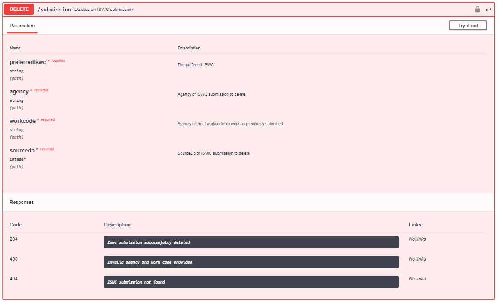

### POST/iswc/merge 

This operation represents the merge of two or more ISWCs together\. 

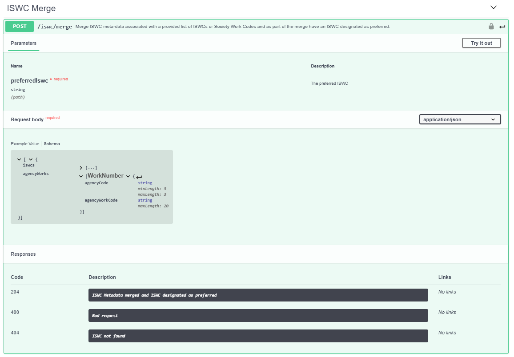

The preferredISWC passed as a parameter into the operation represents the preferredISWC that additional preferred ISWCs will be merged into\.  The request body contains an array of iswcs or agency work codes\.  Each preferred iswc pointed to by each array entry will be merged into the designated preferredISWC\. 

### GET /iswc/workflowTasks 

This operation retrieves all outstanding workflow tasks for an Agency\.  Each task has an associated array of ISWCMetadata objects returned\.  See GET/iswc/searchByIswc at 3\.1\.7 below for info on the metadata returned\.  

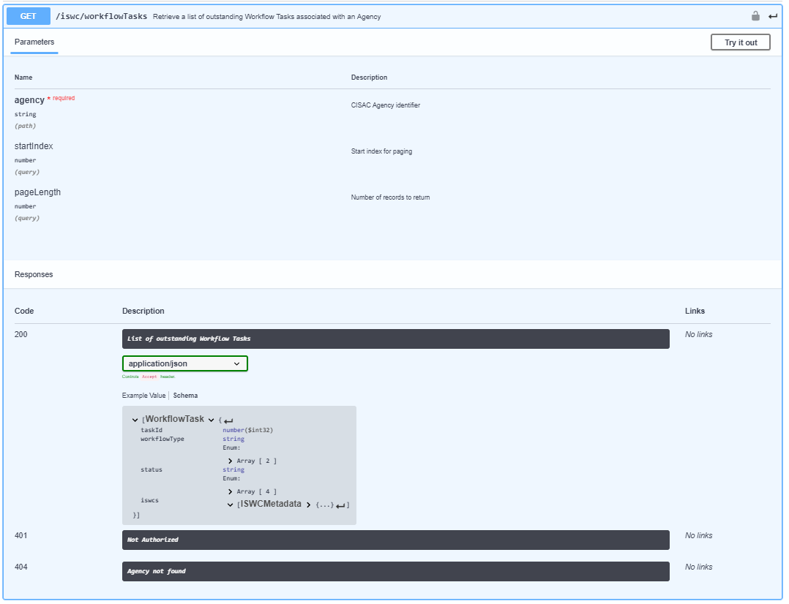

### PATCH /iswc/workflowTasks 

This operation enables an Agency to update the status of a set of outstanding workflow tasks: 

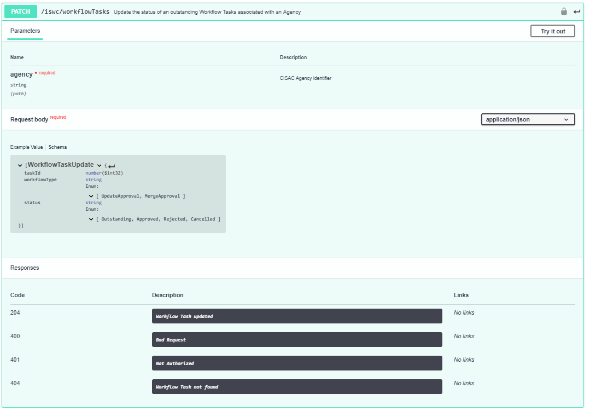

### GET /iswc/searchByIswc 

This operation enables an Agency to find ISWC metadata for a specified ISWC: 

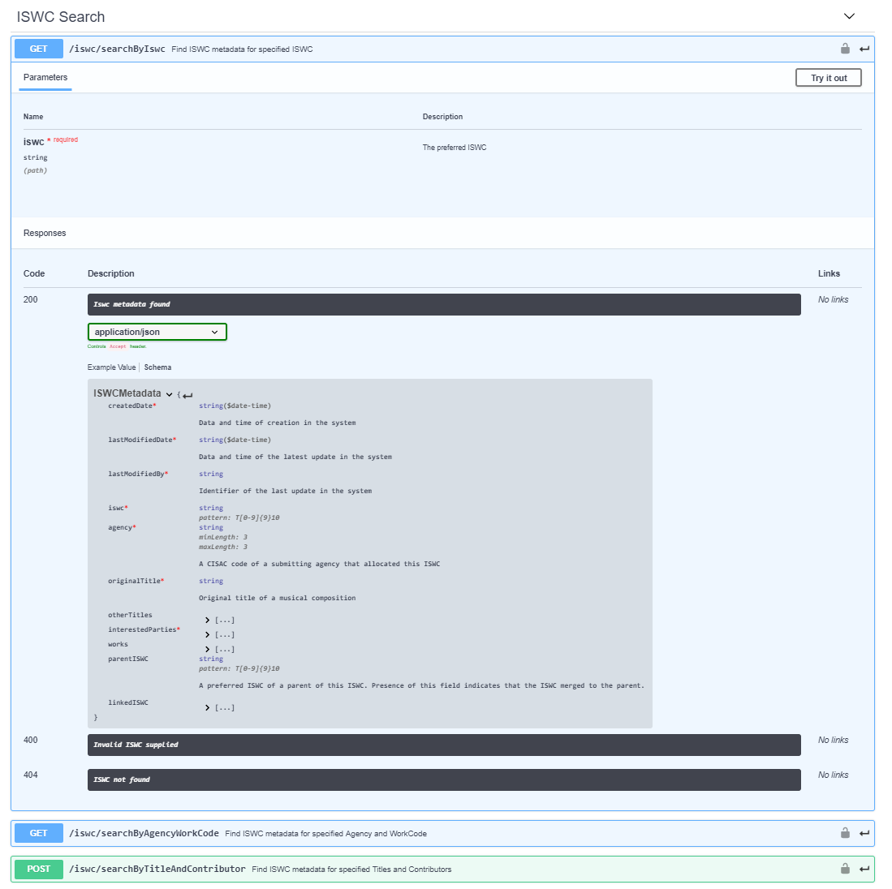

This operation returns its results as an array of ISWCMetadata type objects: 

__ISWCMetadata\{__

__createdDate\*__

__string\($date\-time\)__

__Data and time of creation in the system__

__lastModifiedDate\*__

__string\($date\-time\)__

__Data and time of the latest update in the system__

__lastModifiedBy\*__

__string__

__Identifier of the last update in the system__

__iswc\*__

__string*  
pattern: T\[0\-9\]\{9\}10*__

__agency\*__

__string*  
minLength: 3  
maxLength: 3*__

__A CISAC code of a submitting agency that allocated this ISWC__

__originalTitle\*__

__string__

__Original title of a musical composition__

__otherTitles__

__\[\.\.\.\]__

__interestedParties\*__

__\[\.\.\.\]__

__works__

__\[\.\.\.\]__

__parentISWC__

__string*  
pattern: T\[0\-9\]\{9\}10*__

__A preferred ISWC of a parent of this ISWC\. Presence of this field indicates that the ISWC merged to the parent\.__

__linkedISWC__

__\[__

__All linked preferred ISWCs\. Presence of this field indicates that those ISWCs merged to this ISWC\.__

__string*  
pattern: T\[0\-9\]\{9\}10*\]__

__\}__

### GET /iswc/searchByAgencyWorkCode 

This operation enables an Agency to find ISWC metadata by Agency Work Code \(Society Work Code\): 

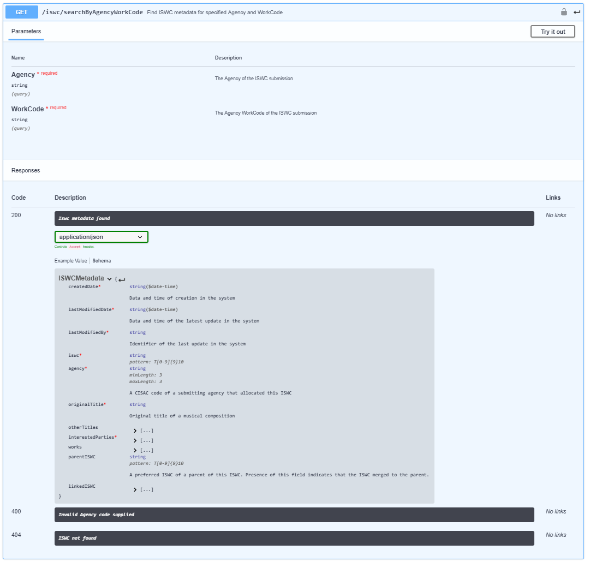 

This operation returns its results as an array of ISWCMetadata type objects as per the previous search operation\. 

### POST /iswc/searchByTitleAndContributor

This operation enables an Agency to find ISWC metadata by a combination of title and contributors: 

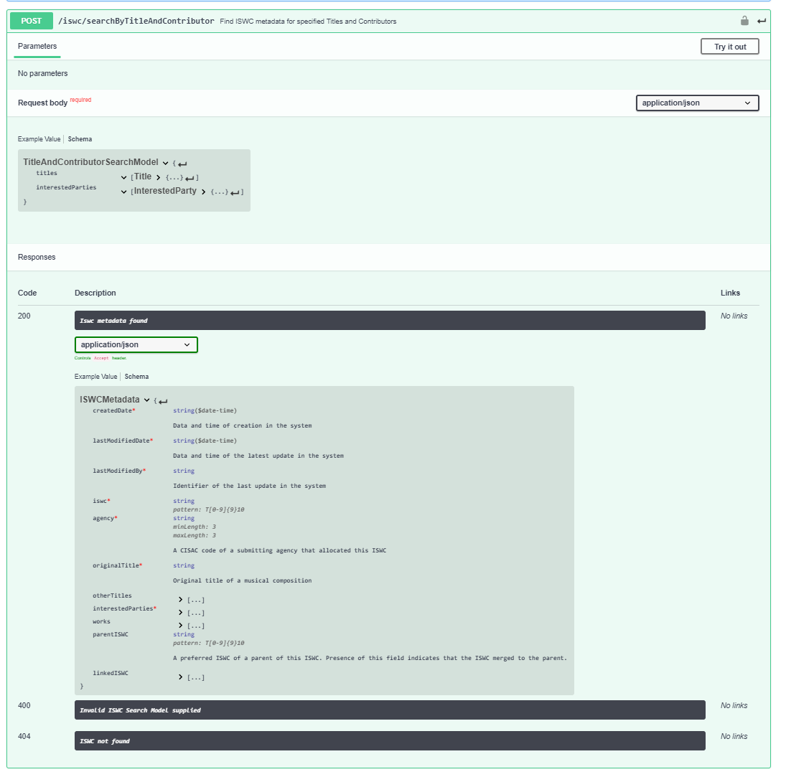

This operation returns its results as an array of ISWCMetadata type objects as per the previous search operation\. 

## Matching Engine API

The Spanish Point Matching Engine provides a REST API which will be used by the matching pipeline components to carry out the matching\. 

The relevant parts of that API are listed below:   

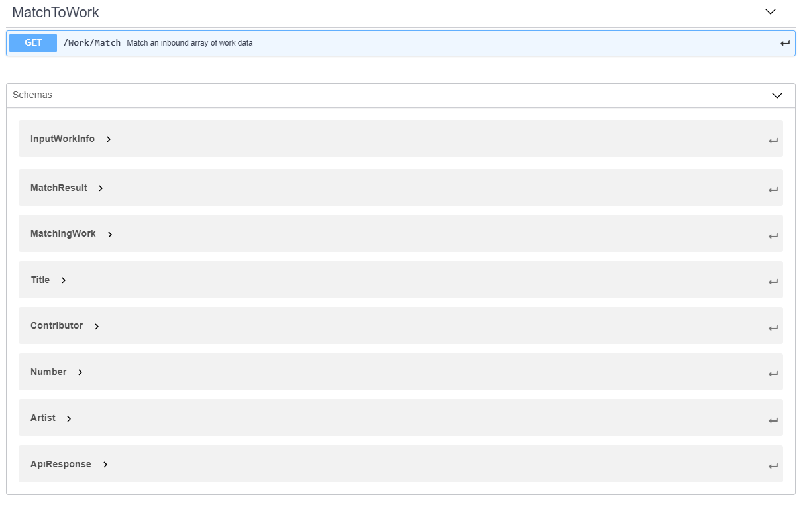

## Matching Engine API

The Spanish Point Matching Engine provides a REST API which will be used by the matching pipeline components to carry out the matching\.   

### GET/Work/Match

This operation represents the retrieval of an array of work matches for an array on input work information\.   It has an input parameter that consists of an array of InputWorkInfo objects\.  It returns an array of MatchResult type objects\.

#### InputWorkInfo  Parameter

The GET will include the following required InputWorkInfo array parameter:

__InputWorkInfo\{__

__id__

__integer\($int64\)__

__source__

__string__

__titles__

__\[Title\{__

__title\*__

__string__

__Musical work title__

__type\*__

__string__

__Title Types__

__Enum:  
Array \[ 14 \]__

__matched__

__string__

__Populated by matching engine as part of match results__

__Enum:  
Array \[ 3 \]__

__\}\]__

__contributors__

__\[Contributor\{__

__name\*__

__string__

__ipiNumber__

__integer\($int64\)__

__ipiBaseNumber__

__string*  
pattern: \[Ii\]\-\[0\-9\]\{9\}\-\[0\-9\]*__

__typeCode\*__

__stringEnum:  
Array \[ 2 \]__

__role__

__stringEnum:  
Array \[ 14 \]__

__matched__

__string__

__Populated by matching engine as part of match results__

__Enum:  
Array \[ 4 \]__

__\}\]__

__artists__

__\[Artist\{__

__firstName__

__string__

__lastName\*__

__string__

__matched__

__string__

__Populated by matching engine as part of match results__

__Enum:  
Array \[ 2 \]__

__\}\]__

__numbers__

__\[Number\{__

__type\*__

__string__

__Number Type\. E\.G\. Code for Society, Publisher, Agency or standard code such as ISWC__

__number\*__

__string__

__Number of the designated type__

__matched__

__string__

__Populated by matching engine as part of match results__

__Enum:  
Array \[ 2 \]__

__\}\]__

__disambiguateFromNumbers__

__\[Number\{__

__type\*__

__string__

__Number Type\. E\.G\. Code for Society, Publisher, Agency or standard code such as ISWC__

__number\*__

__string__

__Number of the designated type__

__matched__

__string__

__Populated by matching engine as part of match results__

__Enum:  
Array \[ 2 \]__

__\}\]__

__workType__

__string__

__\}__

#### MatchResult Response

The GET will return an array of the following MatchResult type objects:

__\[MatchResult\{__

__inputWorkId__

__integer\($int64\)__

__matchTime__

__integer\($int64\)__

__errorMsg__

__string__

__matches__

__\[MatchingWork\{__

__id__

__integer\($int64\)__

__matchType__

__stringEnum:  
\[ Number, Text \]__

__titles__

__\[\.\.\.\]__

__contributors__

__\[\.\.\.\]__

__artists__

__\[\.\.\.\]__

__numbers__

__\[\.\.\.\]__

__\}\]__

__\}\]__

Note: The above existing matching engine API has be extended to support the following ISWC Database specific match related data:

- Disambiguation IDs \(disambiguateFromNumbers\)
- Derived Work Types \(workType\)

## Matching for ISWC Eligible Submitter 

This pipeline component performs the initial matching for an ISWC eligible submission\. 

This pipeline component will be applied to submissions that: 

- Are new submissions to the ISWC Database API \(POST\)
- Submissions that have been determined by the validation pipeline as being valid
- Submissions that have been determined by the validation pipeline as being from an ISWC eligible submitter

It will call the Get/Work/Match REST API using the following mapping of Submission type data to InputWorkInfo type data:

__Source \(Submission\)__

__Destination \(InputWorkInfo\)__

__Mapping Information__

Id

Use an internally generated temporary id to uniquely define this matching request

“Eligible”

Source

Different matching rules will be configured for “Eligible” and “NonEligible” sources in the matching engine\. 

originalTitle

otherTitles\[\]\.title

otherTitles\[\]\.type

titles\[\]\.title

titles\[\]\.type

Original title will be mapped into the titles array with a type of ‘OT’\. otherTitles array will be mapped into titles array

interestedParties\[\]\.baseNumber

interestedParties\[\]\.role

interestedParties\[\]\.validatedRoleType

contributors\[\]\.ipiBaseNumber

contributors\[\]\.typeCode

contributors\[\]\.role

Populate ipiBaseNumber from baseNumber and role from role\.  Populated the role field from the validatedRoleType\.  validatedRoleType is added to the submission by the validation pipeline as part of the validation process\. 

iswc

numbers\[\]\.type

numbers\[\]\.number

If an iswc is provided in the submission:

Set the type to “ISWC”

Set the number to the submission iswc\.

agency

workcode

numbers\[\]\.type

numbers\[\]\.number

Set the type to agency

Set the number to the submission workcode

disambiguateFrom\[\]\.iswc

disambiguateFromNumbers\[\]\.type

disambiguateFromNumbers\[\]\.number

If disambiguateFrom iswcs are provided then map these into the DisambiguateFromNumbers\[\]\.number field\. Set the corresponding type field value to “ISWC” 

derivedWorkType

workType

If a deivedWorkType is provided then populate it into the WorkType field

## Matching for ISWC Non\-Eligible Submitter 

This pipeline component performs the initial matching for an ISWC non\-eligible submission\.

This pipeline component will be applied to submissions that: 

- Are new submissions to the ISWC Database API \(POST\)
- Submissions that have been determined by the validation pipeline as being valid
- Submissions that have been determined by the validation pipeline as being from a non ISWC eligible submitter

It will call the Get/Work/Match REST API using the following mapping of Submission type data to InputWorkInfo type data:

__Source \(Submission\)__

__Destination \(InputWorkInfo\)__

__Mapping Information__

Id

Use an internally generated temporary id to uniquely define this matching request

“NonEligible”

Source

Different matching rules will be configured for “Eligible” and “NonEligible” sources in the matching engine\. 

originalTitle

otherTitles\[\]\.title

otherTitles\[\]\.type

titles\[\]\.title

titles\[\]\.type

Original title will be mapped into the titles array with a type of ‘OT’\. otherTitles array will be mapped into titles array

interestedParties\[\]\.baseNumber

interestedParties\[\]\.role

interestedParties\[\]\.validatedRoleType

contributors\[\]\.ipiBaseNumber

contributors\[\]\.typeCode

contributors\[\]\.role

Populate ipiBaseNumber from baseNumber and role from role\.  Populated the role field from the validatedRoleType\.  validatedRoleType is added to the submission by the validation pipeline as part of the validation process\. 

iswc

numbers\[\]\.type

numbers\[\]\.number

If an iswc is provided in the submission:

Set the type to “ISWC”

Set the number to the submission iswc\.

agency

workcode

numbers\[\]\.type

numbers\[\]\.number

Set the type to agency

Set the number to the submission workcode

disambiguateFrom\[\]\.iswc

disambiguateFromNumbers\[\]\.type

disambiguateFromNumbers\[\]\.number

If disambiguateFrom iswcs are provided then map these into the DisambiguateFromNumbers\[\]\.number field\. Set the corresponding type field value to “ISWC” 

derivedWorkType

workType

If a deivedWorkType is provided, then populate it into the WorkType field

## Match for Search 

This pipeline component performs the initial matching for any of the three supported search operations described at 3\.1\.8, 3\.1\.9 and 3\.1\.10 above\.  

This pipeline component will be applied to submissions that are for the following operations: 

- GET /iswc/searchByIswc
- GET /iswc/SearchByAgencyWorkCode
- POST /iswc/searchByTitleAndContributor

It will call the Get/Work/Match REST API using the following mapping of search parameters type data to InputWorkInfo type data:

__Source \(Submission\)__

__Destination \(InputWorkInfo\)__

__Mapping Information__

Id

Use an internally generated temporary id to uniquely define this matching request

“NonEligible”

Source

We have assumed that the matching settings for search should be the same as the settings for “NonEligible” source\. If needed an additional search specific source could be set up and used instead\.  The source for this pipeline component should be configurable at deployment time \(not at run time\)\. 

originalTitle

otherTitles\[\]\.title

otherTitles\[\]\.type

titles\[\]\.title

titles\[\]\.type

These fields will be mapped for the /iswc/ searchByTitleAndContributor operation only\. 

interestedParties\[\]\.baseNumber

interestedParties\[\]\.role

interestedParties\[\]\.validatedRoleType

contributors\[\]\.ipiBaseNumber

contributors\[\]\.typeCode

contributors\[\]\.role

These fields will be mapped for the /iswc/ searchByTitleAndContributor operation only\.

Populate ipiBaseNumber from baseNumber and role from role\.  Populated the role field from the validatedRoleType\.  validatedRoleType is added to the submission by the validation pipeline as part of the validation process\. 

agency

workcode

numbers\[\]\.type

numbers\[\]\.number

These fields will be mapped for the /iswc/SearchByAgencyWorkCode operation only\. 

Set the type to agency

Set the number to the submission workcode

iswc

numbers\[\]\.type

numbers\[\]\.number

These fields will be mapped for the /iswc/SearchByIswc operation only\. 

Set the type to “ISWC”

Set the number to the submission iswc\.

## Match an Existing Submission for ISWC Eligible Submitter 

This pipeline component performs the initial matching for an update/delete/merge of an existing submission by an eligible submitter\.

This pipeline component will be applied to submissions that: 

- Are update/delete/merges to a previous submission made \(PUT/DELETE\)
- Submissions that have been determined by the validation pipeline as being valid
- Submissions that have been determined by the validation pipeline as being from an ISWC eligible submitter

It will call the Get/Work/Match REST API using the following mapping of Submission type data to InputWorkInfo type data:

__Source \(Submission\)__

__Destination \(InputWorkInfo\)__

__Mapping Information__

Id

Use an internally generated temporary id to uniquely define this matching request

“Eligible”

Source

Different matching rules will be configured for “Eligible” and “NonEligible” sources in the matching engine\. 

originalTitle

otherTitles\[\]\.title

otherTitles\[\]\.type

titles\[\]\.title

titles\[\]\.type

Original title will be mapped into the titles array with a type of ‘OT’\. otherTitles array will be mapped into titles array

interestedParties\[\]\.baseNumber

interestedParties\[\]\.role

interestedParties\[\]\.validatedRoleType

contributors\[\]\.ipiBaseNumber

contributors\[\]\.typeCode

contributors\[\]\.role

Populate ipiBaseNumber from baseNumber and role from role\.  Populated the role field from the validatedRoleType\.  validatedRoleType is added to the submission by the validation pipeline as part of the validation process\. 

agency

workcode

numbers\[\]\.type

numbers\[\]\.number

Set the type to agency

Set the number to the submission workcode

disambiguateFrom\[\]\.iswc

disambiguateFromNumbers\[\]\.type

disambiguateFromNumbers\[\]\.number

If disambiguateFrom iswcs are provided then map these into the DisambiguateFromNumbers\[\]\.number field\. Set the corresponding type field value to “ISWC”

derivedWorkType

workType

If a deivedWorkType is provided then populate it into the WorkType field

## Match an Existing Submission for ISWC Non\-Eligible Submitter 

This pipeline component performs the initial matching for an update/delete/merge of an existing submission by a non\-eligible submitter\.

This pipeline component will be applied to submissions that: 

- Are update/delete/merges to a previous submission made \(PUT/DELETE\)
- Submissions that have been determined by the validation pipeline as being valid
- Submissions that have been determined by the validation pipeline as being from a non  ISWC eligible submitter

It will call the Get/Work/Match REST API using the following mapping of Submission type data to InputWorkInfo type data:

__Source \(Submission\)__

__Destination \(InputWorkInfo\)__

__Mapping Information__

Id

Use an internally generated temporary id to uniquely define this matching request

“NonEligible”

Source

Different matching rules will be configured for “Eligible” and “NonEligible” sources in the matching engine\. 

originalTitle

otherTitles\[\]\.title

otherTitles\[\]\.type

titles\[\]\.title

titles\[\]\.type

Original title will be mapped into the titles array with a type of ‘OT’\. otherTitles array will be mapped into titles array

interestedParties\[\]\.baseNumber

interestedParties\[\]\.role

interestedParties\[\]\.validatedRoleType

contributors\[\]\.ipiBaseNumber

contributors\[\]\.typeCode

contributors\[\]\.role

Populate ipiBaseNumber from baseNumber and role from role\.  Populated the role field from the validatedRoleType\.  validatedRoleType is added to the submission by the validation pipeline as part of the validation process\. 

agency

workcode

numbers\[\]\.type

numbers\[\]\.number

Set the type to agency

Set the number to the submission workcode

disambiguateFrom\[\]\.iswc

disambiguateFromNumbers\[\]\.type

disambiguateFromNumbers\[\]\.number

If disambiguateFrom iswcs are provided then map these into the DisambiguateFromNumbers\[\]\.number field\. Set the corresponding type field value to “ISWC”

derivedWorkType

workType

If a deivedWorkType is provided then populate it into the WorkType field

## Rank Results

This pipeline component analyses the results arising from earlier matching to rank them\.

This pipeline component will be applied to submissions that: 

- Are POST /submission \(Add\)
- Are PUT/submission update\(Update\)
- Are POST /iswc \(Search\)
- Call to the matching engine has resulted in one or more MatchingWork entries being found in the MatchResult object returned\. 

### Initial Ranking

This pipeline component will use the MatchResult object returned by the   Get/Work/Match REST API call made by an earlier pipeline component\. This returned object contains the following information that will be used for ranking:

- MatchingWork\[\]\.MatchType – Indicates if the match was made by number \(ISWC\) or text \(title \+ IPs etc\)
- Each MatchingWork\[\] entry contains the titles, contributors, artists and numbers returned for the matching work as follows:
	- titles\[\]\.matched – Indicates if that specific title was matched with an input title\.  Possible values are: “Not Matched”, “Exact Match”, “Fuzzy Match”
	- contributors\[\]\.matched indicates if that specific contributor was matched with an input contributor\.  Possible values are: “Not Matched”, “Matched Base Number”, ”Matched Name Number”, “Matched Name”
	- artists\[\] match results aren’t relevant for the ISWC database
	- numbers\[\]\.matched – Indicates if that specific number was matched with an input number\. Possible values are: “Not Matched”, “Matched” 

The following formula will be used for calculating a score for each match result:

- Where there is an exact title match

Score = 100 \+ \(10 \* \(\#contributors matching by base number / \#contributors\)\)

- Where there is a fuzzy title match

Score = 90 \+ \(10 \* \(\#contributors matching by base number / \#contributors\)\)

Where there are two match results that have the same highest score then add 1 to the score of the one with the oldest creation date\.  

###  Following “LinkedTo” chain

For the highest ranking match result identify if there are any linkedToISWC items present in the ISWCMetadata returned and if there are retrieve the metadata for the last of the linkedISWC items \(top of the LinkedTo chain\) and use this preferred ISWC as the matched Preferred ISWC\. 

## Match Related ISWCs \(Derived or Merged\)

This pipeline component matches listed DerivedFrom ISWCs or agency work codes / iswcs that are going to be merged into a specific preferred iswc to ensure that they exist in the ISWC database\. 

For DerivedFrom ISWCS this pipeline component will be applied to submissions that: 

- Are POST/submission or PUT/submission for ISWC eligible or ineligible submitters that are flagged with a value in the derviedWorkType field and have one or more values in the derviedFromIswcs\[\]\.iswc field

It will call the Get/Work/Match REST API using the following mapping of Submission type data to InputWorkInfo type data for each source derivedFromIswcs\[\]\.iswc value:

__Source \(Submission\)__

__Destination \(InputWorkInfo\)__

__Mapping Information__

Id

Use an internally generated temporary id to uniquely define this matching request

“Eligible” or “NonEligible”

Source

Different matching rules will be configured for “Eligible” and “NonEligible” sources in the matching engine\. 

derivedFromIswcs\[\]\.iswc

numbers\[\]\.type

numbers\[\]\.number

Set the type to “ISWC”

Set the number to the derviedFromIswcs\[\] \.iswc\.

For merge operations this pipeline component will be applied to submissions that: 

- Are POST/iswc/merge 

It will call the Get/Work/Match REST API using the following mapping of request body information to InputWorkInfo type data for each source iswcs and agencyWorks array entry:

__Source \(Submission\)__

__Destination \(InputWorkInfo\)__

__Mapping Information__

Id

Use an internally generated temporary id to uniquely define this matching request

“Eligible” 

Source

Different matching rules will be configured for “Eligible” and “NonEligible” sources in the matching engine\. 

Iswcs\[\]\.iswc

numbers\[\]\.type

numbers\[\]\.number

Set the type to “ISWC”

Set the number to the derviedFromIswcs\[\] \.iswc\.

__Source \(Submission\)__

__Destination \(InputWorkInfo\)__

__Mapping Information__

Id

Use an internally generated temporary id to uniquely define this matching request

“Eligible” 

Source

Different matching rules will be configured for “Eligible” and “NonEligible” sources in the matching engine\. 

agencyWorks\[\]\.agencyCode

numbers\[\]\.type

agencyWorks\[\]\.agencyWorkCode

numbers\[\]\.number

Each related ISWC \(of any type\) must result in exactly one matching preferred ISWC\. 

## Alter Ips and then redo matching 

This pipeline removes Public Domain Ips from the list of Ips submitted where no match has been found by the previous matching attempt so that matching can be retried with this smaller list of Ips\.

This pipeline component will be applied to submissions that: 

- Are new submissions to the ISWC Database API \(POST\)
- Submissions that have been determined by the validation pipeline as being valid
- Submissions that have no MatchingWork\[\] records after matching was carried out 
- Submissions that have been determined by the validation pipeline as containing at least one non\-Public Domain Ips \(See validation specification rule IV/24 for details\)

If the submission contains one or more of the following Ips then remove them from the InputWorkInfo parameter of the GET/Work/Match operation and then go back to the applicable matching pipeline component \(ISWC Eligible or ISWC Non\-Eligible\) to attempt to match again: 

- Public Domain \(IP Base Number: I\-00\-1635861\-3\) 
- DP \(IP Base Number: I\-001635861\-3\)
- TRAD \(IP Base Number: I\-002296966\-8\)
- Unknown Composer Author \(IP Base Number I\-001635620\-8\)

Otherwise, If the submission contains one or more creator type Ips that are designated as Public Domain due to having a date of death > 80 years \(see validation specification rule IV/24 for details\) then remove these Ips from the InputWorkInfo parameter of the GET/WorkMatch operation and then go back to the applicable matching pipeline component \(ISWC Eligible or ISWC Non\-Eligible\) to attempt to match again\.

 

1. Matching Rule Configuration

This chapter describes how the existing Spanish Point Matching Engine Configuration Tool will be used to configure the required matching rules for the ISWC database\.  In addition, it describes the additional configuration parameters that will be added to the configuration tool and matching engine that are required to support the agreed ISWC database matching rules\.  

## Existing Spanish Point Matching Engine Configuration Tool

The following screenshot shows the configuration tool for the Spanish Point matching engine: 

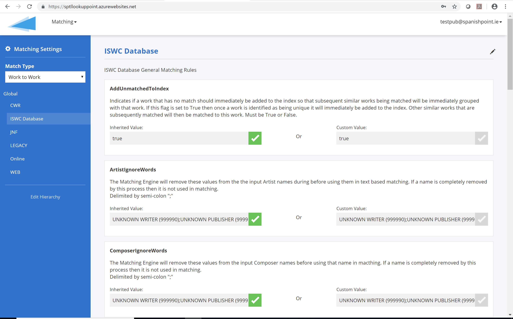

Figure 2 – Matching Engine Config Tool

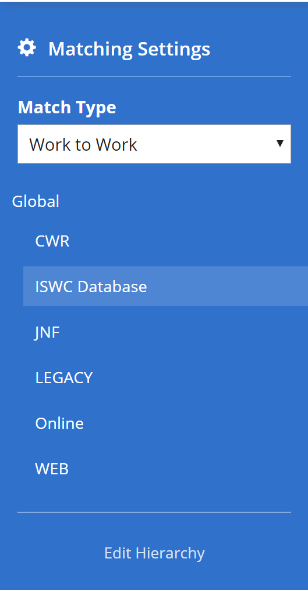Once the “Matching/Settings” top level menu option has been selected then the configuration tool shows the matching settings single page application\. 

The left\-hand panel shows two sections:

- Match Type

This selects the entity types being matched with each other\.  For the ISWC Database, only the “Work to Work” type applies\.  I\.E\. This means match inbound work information with existing work information\.   

Other Match Entity Types, such as “Recording To Recording”, “Recording To Work”, “Usage to Work”, “Usage to Recording” etc\. are not relevant for the ISWC database\.

- Input Data Source Hierarchy

For the match type selected above the panel shows the hierarchy of sources of input information for this match type\.    In the example shown here we have the default “Global” source of data which contains an “ISWC Database” source representing all ISWC Database submissions\. Sub\-Sources for each submitting society could be set up if there were different rule configurations needed for different societies though this is not expected for the ISWC database\. 

The list of matching configuration parameters available for the selected input data source is shown in the main area of the page as per below:

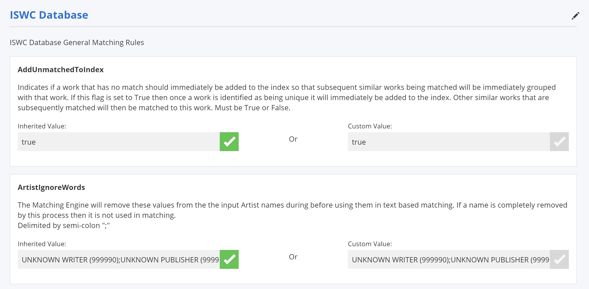

For each parameter available the following information is shown:

- The parameter name\.  This is a unique fixed name given to the parameter that is implemented in the matching engine logic
- Parameter Description\.  This is a description of matching rule that is being configured along with info on the available configuration parameter values for this rule\.  These descriptions are loaded into the system at installation time but can be overwritten / updated on a deployment by deployment basis\. 
- Inherited Value\.  This shows the configuration value\(s\) set for the parameter for the current parameter’s parent input source\.  A green check box for the Inherited Value field means that this parameter’s configuration is inherited from the parent source rather than being uniquely configured for the selected source\.   
- Custom Value\.  This shows the configuration value\(s\) set for the parameter for the selected source\.   If this field is checked it means that a unique value is configured for this parameter for the selected source\.   

## Key Proposed Matching Settings for CISAC ISWC Database

The following key settings will be configured through the configuration tool shown above in order to deliver on the agreed ISWC Database matching rules:

### Configuration for “Eligible” Source

The following table describes the key existing matching engine parameters that will be configured to deliver the agreed matching rules\.  Note: Only key parameters are shown below, parameters that don’t apply to the CISAC database matching have been omitted:

__Parameter__

__Description__

__Configuration__

ComposerMatchWritersOnly

If this flag is set to True then only the writers/composers on the input work must match with a work in the index in order for the work to be determined a match\. I\.E\. Non writer/composer contributors such as publishers will not be taken into account\. 

True or False\.

True

ContributorMatchingAlgorithm

The matching criteria that will be used\. NumberAndText means number based matching will be carried out first and if no match is found then text based matching will be used\.   Number means number based matching will be used only\.  Text means text based matching will be used only\.

Number

EnsureAllContributorsMatch

If this is set to True then in order for a definite match to be identified all contributors \(subject to the ComposerMatchWritersOnly flag\) on the inbound work must match the contributors on the repertoire work\. If this is set to False and there is only one potential match then this potential match will be designated as a definite match\.

True

WorkMatchingAlgorithm

The matching criteria that will be used\. “All” means number based matching will be carried out first and if no match is found then title based matching will be used\.   “Number” means number based matching will be used only\.  “Title” means title based matching will be used only\.

All

WorkTitleSimilarity

Threshold % of similarity between the search string and the returned potential work title\. If the % figure returned >= this threshold value then the title \(and therefore its corresponding work\) will be considered in the bucket of works to be further examined to see if they are a match\.

90

TitleIgnoreWords

The Matching Engine will remove these values from the input title before using that title in text based matching\. This modified title is then used for matching and comparison\. E\.G\. A configuration value of “?” will result in all of the “?” mark characters being removed from an input title before it is used for text based matching\. Note: Any works which don’t have a title after the Ignore Words have been removed will be excluded from further text based matching\. 

Delimited by semi\-colon “;”\.

UNKNOWN;?

WorkSearchDepth

Configures the maximum number of rows that match the text based query that will be returned\. This figure can be configured globally and by Source of the given intray work\.

10000

The following table describes the new matching engine parameters that will be added to the matching engine and configuration tool: 

__Parameter__

__Description__

__Configuration__

TitleFuzzyMatchTypes

When doing fuzzy text matching \(as opposed to exact title matching\), only include the specified title types\.  E\.G\. “OT,AT” means that only OT and AT type titles on the work info to be matched will be matched against OT and AT type titles in the index\. 

Blank

ContributorsMatchCounts

Only works in the index that have the same number of contributors as the input work info will be eligible as matches\.  True or False

True

WorkTypeMustMatch

Only works in the index that have the same type as the input work info will be eligible as matches\.  True or False\. 

False[\[1\]](#footnote-2)

ApplyDisambiguation

If disambiguateFromNumbers are provided in the input work then all works in the index that have matching numbers and number types will be eliminated as possible matches for this input work\.  True or False

True

### Configuration for “NonEligible” Source

The following table describes the key existing matching engine parameters that will be configured to deliver the agreed matching rules\.  Note: Only key parameters are shown below, parameters that don’t apply to the CISAC database matching have been omitted:

__Parameter__

__Description__

__Configuration__

ComposerMatchWritersOnly

If this flag is set to True then only the writers/composers on the input work must match with a work in the index in order for the work to be determined a match\. I\.E\. Non writer/composer contributors such as publishers will not be taken into account\. 

True or False\.

True

ContributorMatchingAlgorithm

The matching criteria that will be used\. NumberAndText means number based matching will be carried out first and if no match is found then text based matching will be used\.   Number means number based matching will be used only\.  Text means text based matching will be used only\.

NumberAndText

EnsureAllContributorsMatch

If this is set to True then in order for a definite match to be identified all contributors \(subject to the ComposerMatchWritersOnly flag\) on the inbound work must match the contributors on the repertoire work\. If this is set to False and there is only one potential match then this potential match will be designated as a definite match\.

True

MinMatchingWriters

The minimum number of writers on the input work that must match with a work in the index in order for the work to be determined a match\.  Note: The exact type of match \(potential or definite\) is determined by the EnsureAllContributorsMatch parameter setting\.

1

WorkMatchingAlgorithm

The matching criteria that will be used\. “All” means number based matching will be carried out first and if no match is found then title based matching will be used\.   “Number” means number based matching will be used only\.  “Title” means title based matching will be used only\.

All

WorkTitleSimilarity

Threshold % of similarity between the search string and the returned potential work title\. If the % figure returned >= this threshold value then the title \(and therefore its corresponding work\) will be considered in the bucket of works to be further examined to see if they are a match\.

90

TitleIgnoreWords

The Matching Engine will remove these values from the input title before using that title in text based matching\. This modified title is then used for matching and comparison\. E\.G\. A configuration value of “?” will result in all of the “?” mark characters being removed from an input title before it is used for text based matching\. Note: Any works which don’t have a title after the Ignore Words have been removed will be excluded from further text based matching\. 

Delimited by semi\-colon “;”\.

UNKNOWN;?

WorkSearchDepth

Configures the maximum number of rows that match the text based query that will be returned\. This figure can be configured globally and by Source of the given intray work\.

10000

The following table describes the new matching engine parameters that will be added to the matching engine and configuration tool: 

__Parameter__

__Description__

__Configuration__

TitleFuzzyMatchTypes

When doing fuzzy text matching \(as opposed to exact title matching\), only include the specified title types\.  E\.G\. “OT,AT” means that only OT and AT type titles on the work info to be matched will be matched against OT and AT type titles in the index\. 

Blank

ContributorsMatchCounts

Only works in the index that have the same number of contributors as the input work info will be eligible for matching\.  True or False

True

WorkTypeMustMatch

Only works in the index that have the same type as the input work info will be eligible as matches\.  True or False\. 

False

ApplyDisambiguation

If disambiguateFromNumbers are provided in the input work then all works in the index that have matching numbers and number types will be eliminated as possible matches for this input work\.  True or False

True

MinMatchingWritersByNumberPct

The minimum number of writers on the input work \(expressed as a % of the total number of writers on the input work\) that must match with a work in the index by IP Number in order for the work to be determined a match\.  Note: The exact type of match \(potential or definite\) is determined by the EnsureAllContributorsMatch parameter setting\.

60%

1. ISWC Processing \(Assignment\) Pipeline

This chapter lists the implementation for processing transaction scenarios in the MVP version of the ISWC database after all matching and validation has taken place\.

	

## Scenario AS/01 – ISWC Eligible Submission Associated with existing Preferred ISWC

An ISWC eligible society submission with valid new WorkInfo details that should be associated with a found Preferred ISWC\. The ISWC database mapping for this will be as follows:

### WorkInfo 

A single record will be added to the ISWC\.WorkInfo table using the following mapping:

Column

Source \(Submission\)

WorkInfoID

N/A

Status

1

Concurrency

N/A

CreatedDate

Current Timestamp

LastModifiedDate

Current Timestamp

LastModifiedUserID

WEBSERVICE

IswcID

preferredIswc

ArchivedIswc

iswc

CisnetLastModifiedDate

cisnetLastModifiedDate

CisnetCreatedDate

cisnetCreatedDate

IPCount

Count of interestedParties\[\]

IsDeleted

0

IswcEligible

*For details see: Scenario AS/10*

MatchTypeID

MatchingWork\.MatchType

MwiCategory

category

AgencyID

agency

AgencyWorkCode

workcode

SourceDatabase

sourcedb

Disambiguation

disambiguation

DisambiguationReasonID

disambiguationReason

BVLTR

bvltr

DerivedWorkTypeID

derivedWorkType

### Title 

A record will be added to the ISWC\.Title table for the Submission\.originalTitle field and a record for each of the items in the Submission\.otherTitles array using the following mapping:

Column

Source \(Submission\)

TitleID

N/A

Status

1

Concurrency

N/A

CreatedDate

Current Timestamp

LastModifiedDate

Current Timestamp

LastModifiedUserID

WEBSERVICE

IswcID

N/A

WorkInfoID

N/A

StandardizedTitle

originalTitle / otherTitles\.title

Title

originalTitle / otherTitles\.title

TitleTypeID

OT / otherTitles\.type

### DisambiguationISWC 

A record will be added to the ISWC\.DisambiguationISWC table for each record in the Submission\.disambiguateFrom array using the following mapping:

Column

Source \(Submission\.disambiguateFrom\)

DisambiguationIswcID

N/A

Status

1

Concurrency

N/A

CreatedDate

Current Timestamp

LastModifiedDate

Current Timestamp

LastModifiedUserID

WEBSERVICE

Iswc

iswc

WorkInfoID

N/A

### DerivedFrom 

A record will be added to the ISWC\.DerivedFrom table for each record in the Submission\.derivedFromIswcs array using the following mapping:

Column

Source \(Submission\.derivedFromIswcs\)

DerivedFromID

N/A

Status

1

Concurrency

N/A

CreatedDate

Current Timestamp

LastModifiedDate

Current Timestamp

LastModifiedUserID

WEBSERVICE

Iswc

iswc

Title

title

WorkInfoID

N/A

### Creator 

A record will be added to the ISWC\.Creator table for each record in the Submission\.interestedParties array that is a Creator type using the following mapping:

Column

Source \(Submission\.interestedParties\)

IPBaseNumber

baseNumber

WorkInfoID

N/A

Status

1

Concurrency

N/A

CreatedDate

Current Timestamp

LastModifiedDate

Current Timestamp

LastModifiedUserID

WEBSERVICE

IsDispute

False

Authoritative

*For details see: Scenario AS/10*

RoleTypeID

role

IswcID

N/A

IPNameNumber

nameNumber

### Publisher 

A record will be added to the ISWC\.Publisher table for each record in the Submission\.interestedParties array that is a Publisher type using the following mapping:

Column

Source \(Submission\.interestedParties\)

IPBaseNumber

baseNumber

WorkInfoID

N/A

Status

1

Concurrency

N/A

CreatedDate

Current Timestamp

LastModifiedDate

Current Timestamp

LastModifiedUserID

WEBSERVICE

RoleTypeID

role

IswcID

N/A

IPNameNumber

nameNumber

### Performer

A record will be added to the ISWC\.Performer table for each record in the Submission\.performers array using the following mapping if a matching record does not already exist:

Column

Source \(Submission\.performers\)

PerformerID

N/A

Status

1

Concurrency

N/A

CreatedDate

Current Timestamp

LastModifiedDate

Current Timestamp

LastModifiedUserID

WEBSERVICE

FirstName

firstName

LastName

lastName

### WorkInfoPerformer 

A record will be added to this table for each Performer record created to link to the WorkInfo table\.

### WorkInfoInstrumentation 

A record will be added to the ISWC\.WorkInfoInstrumentation table for each record in the Submission\.instrumentation array using the following mapping:

Column

Source \(Submission\.instumentation\)

WorkInfoID

N/A

InstrumentationID

code

Status

1

Concurrency

N/A

CreatedDate

Current Timestamp

LastModifiedDate

Current Timestamp

LastModifiedUserID

WEBSERVICE

## Scenario AS/02 – ISWC Ineligible Submission Associated with existing Preferred ISWC

An ISWC eligible society submission with valid new WorkInfo details that should be associated with a found Preferred ISWC\. The ISWC database mapping for this will be the same as Scenario AS/01 except for the WorkInfo table:

### WorkInfo 

A single record will be added to the ISWC\.WorkInfo table using the following mapping:

Column

Source \(Submission\)

WorkInfoID

N/A

Status

1

Concurrency

N/A

CreatedDate

Current Timestamp

LastModifiedDate

Current Timestamp

LastModifiedUserID

WEBSERVICE

IswcID

preferredIswc

ArchivedIswc

iswc

CisnetLastModifiedDate

cisnetLastModifiedDate

CisnetCreatedDate

cisnetCreatedDate

IPCount

Count of interestedParties\[\]

IsDeleted

IswcEligible

*For details see: Scenario AS/10*

MatchTypeID

MatchingWork\.MatchType

MwiCategory

category

AgencyID

agency

AgencyWorkCode

workcode

SourceDatabase

sourcedb

Disambiguation

disambiguation

DisambiguationReasonID

disambiguationReason

BVLTR

bvltr

DerivedWorkTypeID

derivedWorkType

## Scenario AS/03 – ISWC Eligible Submission with new Preferred ISWC level details

This scenario represents the assignment of a new Preferred ISWC and the addition of this new ISWC along with its other Preferred ISWC level information to the ISWC database by a society that is ISWC eligible for this submission\. The ISWC database mapping for this will be as follows:

### ISWC

A single record will be added to the ISWC\.ISWC table using the following mapping\. The Iswc value will be taken from iswc field in the Cosmos DB ISWC collection\.

Column

Source 

IswcID

N/A

Status

1

Concurrency

N/A

CreatedDate

Current Timestamp

LastModifiedDate

Current Timestamp

LastModifiedUserID

WEBSERVICE

Iswc

iswc \(Cosmos DB\)

AgencyID

agency

### WorkInfo 

A single record will be added to the ISWC\.WorkInfo table using the following mapping:

Column

Source \(Submission\)

WorkInfoID

N/A

Status

1

Concurrency

N/A

CreatedDate

Current Timestamp

LastModifiedDate

Current Timestamp

LastModifiedUserID

WEBSERVICE

IswcID

preferredIswc

ArchivedIswc

iswc

CisnetLastModifiedDate

cisnetLastModifiedDate

CisnetCreatedDate

cisnetCreatedDate

IPCount

Count of interestedParties\[\]

IsDeleted

IswcEligible

*For details see: Scenario AS/10*

MatchTypeID

MatchingWork\.MatchType

MwiCategory

category

AgencyID

agency

AgencyWorkCode

workcode

SourceDatabase

sourcedb

Disambiguation

disambiguation

DisambiguationReasonID

disambiguationReason

BVLTR

bvltr

DerivedWorkTypeID

derivedWorkType

### Title 

A record will be added to the ISWC\.Title table for the Submission\.originalTitle field and a record for each of the items in the Submission\.otherTitles array using the following mapping:

Column

Source \(Submission\)

TitleID

N/A

Status

1

Concurrency

N/A

CreatedDate

Current Timestamp

LastModifiedDate

Current Timestamp

LastModifiedUserID

WEBSERVICE

IswcID

N/A

WorkInfoID

N/A

StandardizedTitle

originalTitle / otherTitles\.title

Title

originalTitle / otherTitles\.title

TitleTypeID

OT / otherTitles\.type

### DisambiguationISWC 

A record will be added to the ISWC\.DisambiguationISWC table for each record in the Submission\.disambiguateFrom array using the following mapping:

Column

Source \(Submission\.disambiguateFrom\)

DisambiguationIswcID

N/A

Status

1

Concurrency

N/A

CreatedDate

Current Timestamp

LastModifiedDate

Current Timestamp

LastModifiedUserID

WEBSERVICE

Iswc

iswc

WorkInfoID

N/A

### DerivedFrom 

A record will be added to the ISWC\.DerivedFrom table for each record in the Submission\.derivedFromIswcs array using the following mapping:

Column

Source \(Submission\.derivedFromIswcs\)

DerivedFromID

N/A

Status

1

Concurrency

N/A

CreatedDate

Current Timestamp

LastModifiedDate

Current Timestamp

LastModifiedUserID

WEBSERVICE

Iswc

iswc

Title

title

WorkInfoID

N/A

### Creator 

A record will be added to the ISWC\.Creator table for each record in the Submission\.interestedParties array that is a Creator type using the following mapping:

Column

Source \(Submission\.interestedParties\)

IPBaseNumber

baseNumber

WorkInfoID

N/A

Status

1

Concurrency

N/A

CreatedDate

Current Timestamp

LastModifiedDate

Current Timestamp

LastModifiedUserID

WEBSERVICE

IsDispute

False

Authoritative

*For details see: Scenario AS/10*

RoleTypeID

role

IswcID

N/A

IPNameNumber

nameNumber

### Publisher 

A record will be added to the ISWC\.Publisher table for each record in the Submission\.interestedParties array that is a Publisher type using the following mapping:

Column

Source \(Submission\.interestedParties\)

IPBaseNumber

baseNumber

WorkInfoID

N/A

Status

1

Concurrency

N/A

CreatedDate

Current Timestamp

LastModifiedDate

Current Timestamp

LastModifiedUserID

WEBSERVICE

RoleTypeID

role

IswcID

N/A

IPNameNumber

nameNumber

### Performer

A record will be added to the ISWC\.Performer table for each record in the Submission\.performers array using the following mapping if a matching record does not already exist:

Column

Source \(Submission\.performers\)

PerformerID

N/A

Status

1

Concurrency

N/A

CreatedDate

Current Timestamp

LastModifiedDate

Current Timestamp

LastModifiedUserID

WEBSERVICE

FirstName

firstName

LastName

lastName

### WorkInfoPerformer 

A record will be added to this table for each Performer record created to link to the WorkInfo table\.

### WorkInfoInstrumentation 

A record will be added to the ISWC\.WorkInfoInstrumentation table for each record in the Submission\.instrumentation array using the following mapping:

Column

Source \(Submission\.instumentation\)

WorkInfoID

N/A

InstrumentationID

code

Status

1

Concurrency

N/A

CreatedDate

Current Timestamp

LastModifiedDate

Current Timestamp

LastModifiedUserID

WEBSERVICE

## Scenario AS/04 – Update ISWC Eligible Submission with new Preferred ISWC level details

An ISWC eligible society submission with valid Preferred ISWC level details and the Preferred ISWC indicated in the submission is the same as the current Preferred ISWC for the Society Code, Source DB Code and Society Work Code designated in the submission\. This scenario represents an update of the core existing Preferred ISWC data\. The ISWC database mapping for this will be as follows:

### Title 

A record will be added to the ISWC\.Title table for the Submission\.originalTitle field and a record for each of the items in the Submission\.otherTitles array and does not already exist using the following mapping\. If a record already exists, it should be updated using the following mapping\.

Column

Source \(Submission\)

TitleID

N/A

Status

1

Concurrency

N/A

CreatedDate

Current Timestamp

LastModifiedDate

Current Timestamp

LastModifiedUserID

WEBSERVICE

IswcID

N/A

WorkInfoID

N/A

StandardizedTitle

originalTitle / otherTitles\.title

Title

originalTitle / otherTitles\.title

TitleTypeID

OT / otherTitles\.type

### Creator 

A record will be added to the ISWC\.Creator table for each record in the Submission\.interestedParties array that is a Creator type and does not already exist using the following mapping\. If a record already exists, it should be updated using the following mapping\.

Column

Source \(Submission\.interestedParties\)

IPBaseNumber

baseNumber

WorkInfoID

N/A

Status

1

Concurrency

N/A

CreatedDate

Current Timestamp

LastModifiedDate

Current Timestamp

LastModifiedUserID

WEBSERVICE

IsDispute

False

Authoritative

*For details see: Scenario AS/10*

RoleTypeID

role

IswcID

N/A

IPNameNumber

nameNumber

### Publisher 

A record will be added to the ISWC\.Publisher table for each record in the Submission\.interestedParties array that is a Publisher type and does not already exist using the following mapping\. If a record already exists, it should be updated using the following mapping\.

Column

Source \(Submission\.interestedParties\)

IPBaseNumber

baseNumber

WorkInfoID

N/A

Status

1

Concurrency

N/A

CreatedDate

Current Timestamp

LastModifiedDate

Current Timestamp

LastModifiedUserID

WEBSERVICE

RoleTypeID

role

IswcID

N/A

IPNameNumber

nameNumber

## Scenario AS/05 – Update ISWC Eligible Submission with valid Preferred ISWC level details where the Preferred ISWC is different from the current Preferred ISWC

An ISWC eligible society submission with valid Preferred ISWC level details and the Preferred ISWC indicated in the submission is different from the current Preferred ISWC for the Society Code, Source DB Code and Society Work Code designated in the submission\.  This scenario represents the merging of two pre\-existing Preferred ISWCs in the ISWC Database\. The ISWC database mapping for this will be as follows:

### ISWCLinkedTo 

A record will be created in the ISWCLinkedTo table to store the reference between the source “Preferred ISWC” and the destination “Preferred ISWC” using the following mapping:

Column

Source 

IswcLinkedToID

N/A

Status

1

Concurrency

N/A

CreatedDate

Current Timestamp

LastModifiedDate

Current Timestamp

LastModifiedUserID

WEBSERVICE

IswcID

Source “Preferred ISWC” IswcID

LinkedToIswc

Destination “Preferred ISWC” Iswc code

## Scenario AS/08 – Update ISWC Ineligible Submission with valid Preferred ISWC level details where the Preferred ISWC is different from the current Preferred ISWC

This scenario represents a move of WorkInfo information from one Preferred ISWC \(source\) to another Preferred ISWC \(destination\) by an ISWC ineligible submitter\.  It essentially represents the changing of the Preferred ISWC that a submitters WorkInfo \(Agency Work Code, Archived ISWC\) should be associated with to a different existing Preferred ISWC by an ISWC ineligible submitter\. The IswcID value in the following database tables will be changed from the existing Preferred ISWC value to the new Preferred ISWC value:

- WorkInfo
- Title
- DisambiguationISWC
- DerivedFrom
- Creator
- Publisher
- WorkInfoPerfomer
- WorkInfoInstrumentation

The WorkInfo\.IswcEligible flag will be also recalculated as per Scenario AS/10\.

## Scenario AS/09 – Delete ISWC Submission 

This scenario represents a request to delete an ISWC Submission\. The WorkInfo record identified in the matching phase will be logically deleted for ISWC eligible submissions\.  For ISWC ineligible submissions the WorkInfo record identified will be physically deleted\. 

If there are ISWC eligible WorkInfo records from another society associated with the Preferred ISWC identified, then the corrections process as per AS/07 will be triggered\.

If there are no remaining WorkInfo records from ISWC eligible submitters left on the source Preferred ISWC after the deletion then all remaining associated Title, Creator and Publisher records associated with that ISWC record should be logically deleted\.  All WorkInfo records from non ISWC eligible societies remaining on the source Preferred ISWC will be physically deleted\. 

## Scenario AS/10 – Recalculating ISWC Eligible and Authoritative flags 

This scenario represents the need to recalculate the ISWC Eligible flag and Authoritative flag when adding or updating WorkInfo records\. 

The ISWC Eligible flag will be set to True if the submitter is deemed to be ISWC eligible for the work based on rules EL/01, EL/02 and EL/03\.  The ISWC Eligible flag will be set to False if the submitter is deemed not to be ISWC eligible based on the same rules\.  

The Authoritative flag for each associated Creator should be set to True if the creator is a member of the submitting society at the date of submission of the transaction for a musical work related agreement\. 

## Approval Workflow Tasks \(Formerly Known as Corrections Tasks\)

Multiple assignment/processing actions require the generation of approval workflow tasks\.  This section describes how approval workflow tasks will be implemented\. 

### Workflow Types

The types of workflow and the sources of each workflow type are listed below:

Workflow Type

Description

Sources

Update Approval

Update of core existing Preferred ISWC data where there are one or more additional ISWC eligible submitters for the work

AS/04 – Update to core existing Preferred ISWC data

Merge Approval

Merge of two or more existing Preferred ISWCs where there are one or more additional ISWC eligible submitters for any of the works being merged

AS/05 – Merge two pre\-existing Preferred ISWCs

Demerge Approval

Deletion of a LinkedTo record where there are one or more additional ISWC eligible submitters for the work being demerged\.

Demerge two pre\-existing Preferred ISWCs

### Workflow Task Data Structure

__WorkflowInstance__

The WorkflowInstance table stores information about each instance of a workflow\.  For example, an Update Approval Workflow\. 

Column

Data Type 

Required

Description

WorkflowInstanceID

Bigint

Yes

Unique auto generated identifier for the workflow instance

WorkflowType

Int

Yes

1 \(Update Approval\), 2 \(Merge Approval\)

WorkInfoID

Bigint

No

Unique ID for related WorkInfo record that contains the modified data\.  Must be populated if the WorkflowType is 1\.

MergeRequestID

Bigint

No

Unique ID for related MergeRequest record that contains the requested merge info\.  Must be populated if the WorkflowType is 2\.

CreatedDate

Datetime2\(0\)

Yes

Date/time that the WorkflowInstance was created

LastModifiedDate

Datetime2\(0\)

Yes

Date/time that the WorkflowInstance was last modified

LastModifiedUserID

Int

Yes

The last modifying user

InstanceStatus

Int

Yes

0 \(Outstanding\), 1 \(Approved\), 2 \(Rejected\), 3 \(Cancelled\)

IsDeleted

Bit

Yes

Logically deleted flag

__WorkflowTask__

The WorkflowTask table stores each approval task associated with an instance of a workflow\.  

Column

Data Type 

Required

Description

WorkflowTaskID

Bigint

Yes

Unique auto generated identifier for the workflow task

WorkflowInstanceID

Bigint

Yes

Unique ID for related WorkflowInstance record 

LastModifiedDate

Datetime2\(0\)

Yes

Date/time that the WorkflowInstance was last modified

AssignedAgencyID

Char\(3\)

Yes

ID of related Agency record for the agency to which the approval task is assigned\. 

LastModifiedUserID

Int

Yes

The last modifying user

TaskStatus

Int

Yes

0 \(Outstanding\), 1 \(Approved\), 2 \(Rejected\), 3 \(Cancelled\)

IsDeleted

Bit

Yes

Logically deleted flag

### Adding Update Approval Workflows

A WorkflowInstance record should be created for a set of updates captured in an associated WorkInfo record if any WorkflowTasks need to be created\. 

A WorkflowTasks should be created for each Agency, excepting the agency carrying out the update, that has a WorkInfo record associated with the ISWC being updated, that is flagged as ISWC Eligible\. In addition, the following criteria should be met:

- The update must have altered the list of creator Ips associated with ISWC \(added or removed at least one creator IP\) OR
- Have altered the original title of the ISWC 

### Adding Merge Approval Workflows

A WorkflowInstance record should be created for a merge request if any WorkflowTasks need to be created\. 

A WorkflowTasks should be created for each Agency, excepting the agency carrying out the merge, that has a WorkInfo record associated with any of the ISWCs being merged from, that are flagged as ISWC Eligible\. 

### Retrieving and Actioning Workflow Tasks

Societies will be able to retrieve a list of outstanding workflow approval tasks and provide updates on those tasks using any of the following methods:

- REST API \(GET iswc/WorkflowTasks / PATCH iswc/WorkflowTasks\) as outlined in 3\.1 above
- Modern EDI Messaging \(will be specified as part of WBS 1\.7 \) 
- New ISWC Database Portal \(will be specified as part of WBS 1\.8\)  

## Implementing Merge transactions through LinkedTo Information 

Merges of two or more existing Preferred ISWCs can be carried out through explicit merge transactions or through updates of ISWC metadata as per section 5\.5 above\. 

In these instances, the Preferred ISWC\(s\) being merged into a target Preferred ISWC will have ISWCLinkedTo records created for them to implement the merge \(and an associated header MergeRequest record\)\. During regular transaction processing time limited Approval Workflow Tasks may also be generated as per section 5\.9 above\. 

ISWCLinkedTo records will have a status values that correspond to the following: \(Active, Pending, Deleted\) and the parent MergeRequest record will have MergeStatus values that correspond to Pending or Complete\.  

In addition to the above, draft merge requests will be created by the post migration data cleanup process\. This will be covered by a sperate specification\.  This post migration data cleanup process can create Pending \(Draft\) merge requests that can be confirmed in bulk by societies with or without time limited workflows depending on the rules agreed\.   These Pending merge requests will have associated ISWCLinkedTo records that are at status Pending until confirmed by societies\.  

## Note on Multilingual Titles and Matching 

The REST based services and underlying ISWC database are designed to cater for multi\-lingual character sets \(Unicode\)\.  It is expected that societies will continue to transliterate original titles but can now submit additional titles that are in languages other than English\.

The Azure Search Index will contain both the standardized titles and the titles without standardization\. All matching activities \(as per 3\.4,3\.5,3\.6,3\.7 and 3\.8 above\) will be carried out against both the standardized and non\-standardized titles\. 

The Azure Search Index will use the default Apache Lucene Standard Analyzer\.  This general\-purpose analyzer performs well for most languages and scenarios\.    For more information on this analyzer[\[2\]](#footnote-3) see [https://unicode\.org/reports/tr29/](https://unicode.org/reports/tr29/)

The Spanish Point Matching Engine uses a general\-purpose language independent similarity calculation algorithm that works well with most common languages\. 

				

 

# Appendix A – Open and Closed Items

This appendix provides a tracking list of specific issues/queries raised by CISAC during the specification process and how they were incorporated or excluded from this specification:

__Open and Closed Items__

__ID__

__Description__

__Response__

__Status__

__Next Action By__

1

MVP Business rule AS/06 was not signed off as part of that document\.  Need to sign off the business requirement for this rule during this specification as per note from SG Meeting on 20th April 2019\.

Details of how the workflow tasks will be generated updated have been included in this specification\.  See 3\.1\.5, 3\.1\.6 and 5\.9

Closed

Design Team to review

2

Chapter covering assignment pipeline component to be added 

Closed

3

“Match Derived from ISWCs” and “ 

Added this to section 3\.9 

Closed

4

Addition of disambiguation list configuration parameter for matching to be added in Chapter 4

I’ve enhanced the matching engine API to cater for this data \(see 3\.2\), updated the mapping to map the submission data into these new fields \(see 3\.4, 3\.5, 3\.6 and 3\.7\) and added two additional matching rules that are specific to the ISWC Database at 4\.2\.1 and 4\.2\.2\.

Closed

5

Need to confirm that MAT/42 is still required\.  

“MAT/42 – After the initial matching carried out at MAT/03, MAT/04 or MAT/41:

\- Remove any IP’s for the purposes of further matching that have a YOD \(as per IPI info\) that is more than 80 years past

\- Redo phases 1 & 2 of matching as per MAT/03 above using this reduced list of contributors”

New section 3\.11 added that reflects the agreed revised logic\. 

Closed 

6

Need to confirm the initial configuration of the WorkTypeMustMatch flag 

Originally, in the MVP Business Rules document this rule was agreed to be in place\. However, we propose to carry out initial UAT testing with the rule switched off given the high volume of data without DerivedFrom information available in CIS\-Net\.  Based on the results of this testing we propose to issue a recommending for the flags setting for production use\. 

Open 

UAT team to revisit after UAT\.

7

Need to clarify a\) if it will be possible to merge derived and non\-derived works together and b\) what affect this will have on the matching\. 

For matching an inbound submission to an existing Preferred ISWC the proposal is as follows:

If the WorkTypeMustMatch matching parameter is set to False then it will be possible for a derived work to match, and therefore merge, with a non\-derived work and vice versa\.  If the WorkTypeMustMatch parameter is set to True then it wont be possible for a derived work to match, and therefore merge, with a non\-derived work and vice versa\.

For merging two existing Preferred ISWCs together it will be possible to merge a derived work with a non\-derived work\.   If, say a derived work is merged into \(linked to\) a non\-derived work then incoming submissions can still match to either the derived work or the non\-derived work depending on their metadata and the configuration of the WorkTypeMustMatch flag but any matches to the original derived work will be promoted up \(through the linked to structure\) to the non\-derived work\.

   

Closed 

8

Need to define in a separate specification the background job that will run and auto accept workflow tasks that are outstanding beyond a specified time frame

Will be catered for through a separate specification

Open

9

Open Item: In the case of the 3\.11 \(Alter Ips and then redo matching\) we will test the ranking logic as defined and may decide to enhance it so that it rejects rather than picks the first where more than one matches have been found or that we just return all equally ranked items with no definite selected\. 

Decision will be made after initial UAT of MVP

Open

10

Need to walk\-through and confirm how the LinkedTo construct will be used for three different scenarios \(to be listed by Ed\)

Action: John C to document that linkedTo records can be created at Draft \(Potential\) status as part of the post go live data clean\-up\.  Once that is done this functionality is ok to get signed off\.  

Added section 5\.10 to take this into account now\.  

Closed

11

Need to document summary of multi\-lingual capability that is included in the above design\.  Also, for UAT, need to include societies that use different character sets

I’ve added section 5\.11 above to describe this\. 

Closed 

1.  Initially in the MVP Business Rules it was envisaged that this rule would be enabled but we are proposing to first test the system with the rule switched off\.  See open items section in Appendix A for more information\.   [↑](#footnote-ref-2)

2.  An analyzer is a component of the full text search engine responsible for processing text in query strings and indexed documents\. Different analyzers manipulate text in different ways depending on the scenario\. [↑](#footnote-ref-3)

