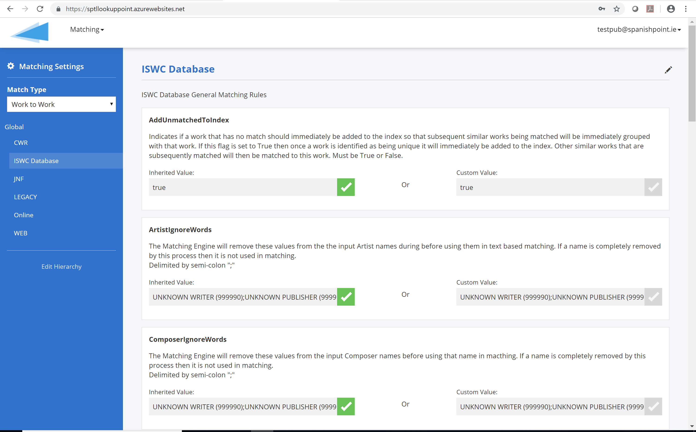
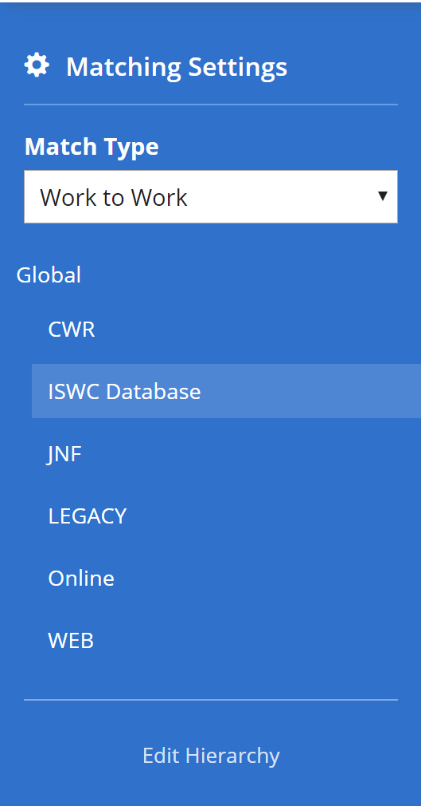
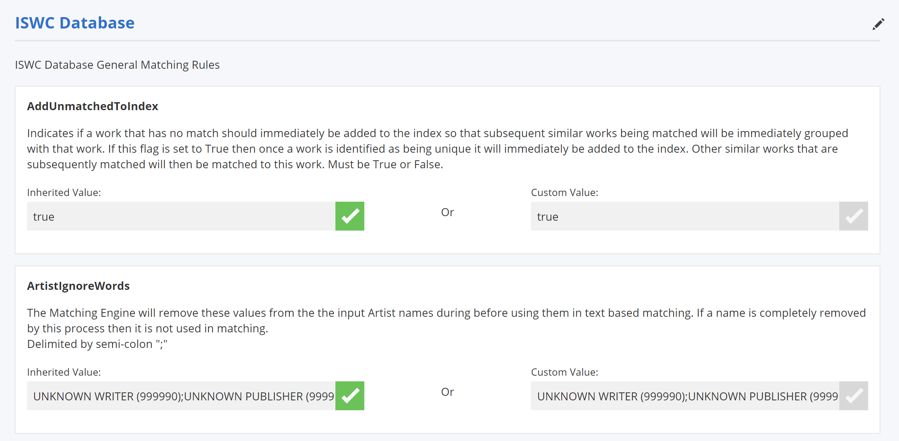
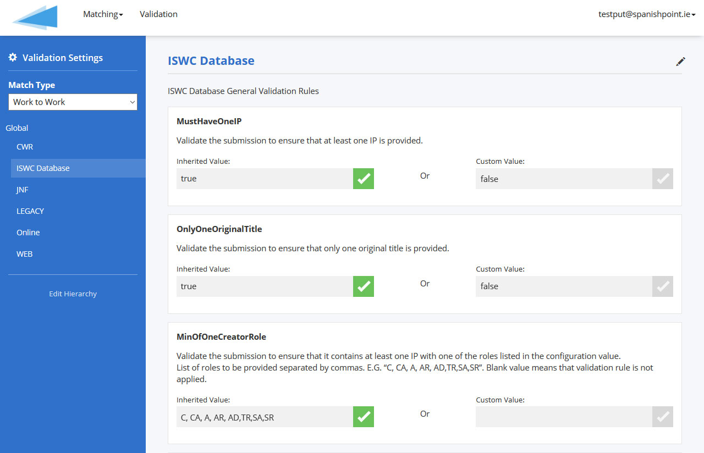

  

CISAC

MVP Validation Rules – Design 

# Document Control

## Change Record

Date

Person

Version/Reference

24th Apr 2019

John Corley

Initial version

14th May 2019

John Corley

Reviewers added and draft posted for review by design team

24th May 2019

John Corley

Incorporated feedback from first workshop

17th Jun 2019

John Corley

Incorporate feedback from previous workshop and finalize document ready for sign off\. 

2nd July 2019 

John Corley

Addressed Open Items added by SG at sign off workshop in NY

29th July 2019

John Corley

Reflecting sign off apart from open item \#3

## Reviewers

Zsófia Szöllősi \- ARTISJUS

Nóra Varga \- ARTISJUS

Györgyi Németh \- ARTISJUS

Bolmar Carrasquilla \- ASCAP

Sylvain Masson \- BMI

Ed Oshanani \- BMI

José Macarro \- CISAC

Didier Roy \- FastTrack

Hanna Mazur \- FastTrack

Katrien Tielemans \- SABAM

Cynthia Lipskier \- SACEM

Xavier Costaz \- SACEM

Declan Rudden \- SaorServices

Niamh McGarry\-SaorServices

Roisin Jones – Saor Services

Curnan Reidy \- SpanishPoint

Brigitte Kueng – SUISA

## Distribution

Reviewers

## Approval

This document was approved electronically via email by the following people on the following dates:

Date/Time

Person

Note

Steering Group

# Table of Contents

[Document Control	2](#_Toc11664286)

[Change Record	2](#_Toc11664287)

[Reviewers	2](#_Toc11664288)

[Distribution	2](#_Toc11664289)

[Approval	2](#_Toc11664290)

[Table of Contents	3](#_Toc11664291)

[1	Introduction	5](#_Toc11664292)

[What does this document contain?	5](#_Toc11664293)

[Who should read this document?	5](#_Toc11664294)

[Glossary	5](#_Toc11664295)

[References	5](#_Toc11664296)

[2	Overview	6](#_Toc11664297)

[2\.1\. Scope	6](#_Toc11664298)

[2\.2\. Validation Rule Configuration	6](#_Toc11664299)

[2\.3\. Rule Implementation	6](#_Toc11664300)

[3	ISWC Database Validation Pipeline	8](#_Toc11664301)

[3\.1\. Submission Data	10](#_Toc11664302)

[3\.1\.1\. POST/submission	11](#_Toc11664303)

[3\.1\.1\.1\. “body” Parameter	11](#_Toc11664304)

[3\.1\.1\.2\. Example “body” Parameter value	12](#_Toc11664305)

[3\.1\.2\. PUT/submission	13](#_Toc11664306)

[3\.2\. Static Data Validator Pipeline Component	14](#_Toc11664307)

[3\.3\. Metadata Standardization Validator Pipeline Component	31](#_Toc11664308)

[3\.4\. Lookup Data Validator Pipeline Component	42](#_Toc11664309)

[3\.5\. ISWC Eligibility Validator Pipeline Component	43](#_Toc11664310)

[3\.6\. Post Matching Validator Component	47](#_Toc11664317)

[4	Validation Rule Configuration	58](#_Toc11664318)

[4\.1\. Existing Spanish Point Matching Engine Configuration Tool	58](#_Toc11664319)

[4\.2\. Proposed Changes to Support CISAC Validation Rule Configuration	60](#_Toc11664320)

[Appendix A – Open and Closed Items	62](#_Toc11664321)

[Appendix B – Miscellaneous Queries etc	65](#_Toc11664322)

1. Introduction

## What does this document contain?

The purpose of this design document is to take the validation rules agreed in the WBS 1\.2 \(MVP 'To Be' Business Rules\) document and describe in detail how these rules will be implemented in the new ISWC database\.

## Who should read this document?

CISAC development and project management personnel\.  Spanish Point development team members\.   

## Glossary  

  

## References

Reference

Description

SPE\_20190218\_ISWCDataModel\.docx

New ISWC Database Data Model

REQ\_20190212\_MVP To Be Business Rules\.xlsx

‘To Be’ Business Rules 

1. Overview  

This chapter provides an overview of the proposed solution for implementing validation rules in the new ISWC Database solution\.

## Validation Rule Configuration

We propose to extend the existing Spanish Point Matching Engine configuration application to support the configuration of the validation rules required\.    Details of how this will be done is included in Chapter four of this document including a quick overview of the matching engine solution and its architecture\. 

## Scope

This document covers the implementation of the agreed ‘To Be’ business rules as described in the following tabs of the MVP ‘To Be’ Business Rules document \(see references above\):

- Initial Validation
- Standardize Metadata
- Post\-Match Validation
- Determine Eligibility for ISWC

## Rule Implementation

All validation rules will be implemented through a custom developed validation pipeline\.  Chapter three of this document provides the detailed design of this system component\. 

The following diagram outlines the overall architecture of the new ISWC Database system and indicates where this component fits within that solution\. 

Components tagged in the diagram \(1\-4\) above have more detailed explanations below:

1. The main processing component for the new ISWC database will be a new custom developed REST based Web API\.  This Web API will process both individual transactions and batches of transactions
2. The ISWC Database REST based Web API will use a Validation Pipeline to implement all validation rules\.  The validation pipeline is the main component covered by this specification and is described in detail in Chapter 3 of this document and its configuration capability is described in Chapter 4\.
3. The ISWC Database Web API will call the Spanish Point Matching Engine through its own web API to carry out all matching tasks\.  This functionality will be described in a separate specification \(WBS 1\.5\)
4. The ISWC Database Web API will update the core ISWC database and assign ISWCs through a custom developed Processing \(Assignment\) pipeline\.  This functionality will be described in a separate specification \(WBS 1\.5\)  
5. ISWC Database Validation Pipeline

The validation pipeline will be used by the ISWC Database REST based Web API to validate ISWC database transactions before and after matching\.  

The validation pipeline consists of a sequence of pipeline components\.  Each pipeline component will be implemented as a \.net core validator class within the Web API solution and will be loaded dynamically as a distinct versioned \.dll\.  

Each validator pipeline component will implement a defined list of validation rules\.  Each of these rules can be turned off or on as a minimum through configuration and some rules will support more advanced configuration\.  This chapter and chapter four provide more detail of the configuration options available for each rule\. 

All validator pipeline components will use a common error handling framework for identifying error codes and corresponding messages\. It will capture these along with the pipeline component version and rule identifiers in a set of tracking data that will be logged along with the transaction in the system \(stored in the Cosmos DB No SQL database\)\. 

All validation pipeline components will be deployed through an automated Azure Dev Ops pipeline through the different environment tiers \(dev, uat, staging and production\)\.   Each pipeline component will have a comprehensive set of associated unit tests built into them and these unit tests will be automatically executed as part of the automated release process\.  

The benefits of the above approach are:

- Validation rules can be switched on/off and have their parameters configured through a web\-based configuration tool that will take immediate affect
- New rules can be added, or existing rules can be altered, beyond what is possible through the configuration above, by code changes to individual pipeline components\.  

These pipeline components will be automatically regression tested with the unit tests as part of the deployment process between environments\.  This means changes to validation rules can be made quickly, will be automatically regression tested and can be deployed quickly without having to deploy the whole ISWC Database application\.

- All validation rules will have an individual rule identifier as well as having an identifier for the pipeline component that contains it\.  It will be possible to track, for any incoming transaction the following:
	- The rule identifiers for all validation rules that were applied to the transaction
	- The version number of pipeline component for each of these rules
	- The configuration of each rule
	- The outcome of each rule

    

## Submission Data

The following shows an initial draft of the REST based Web API\.  The full API will be defined in WBS 1\.6\.  The purpose of this initial draft is to define the data fields available in an ISWC submission so that those specific fields can be referenced in the validator pipeline components’ implementation of the validation rules later in this chapter\.  

Figure 1 \- Operations & Models used in Web API

Notes: 

1. Not all operations that will be supported are listed above
2. The operations show above deal with individual submission data\.  The full Web API will include the ability to process an array of submissions in a single operation\. 

### POST/submission

This operation represents an add of a new ISWC submission to the database\.  Equivalent of the CAR transaction in EDI\.

#### “body” Parameter

The POST will include the following required “body” parameter:

__Submission\{__

__agency\*__

__string*  
minLength: 3  
maxLength: 3*__

__sourcedb\*__

__integer\($int64\)__

__workcode\*__

__string__

__iswc__

__string*  
pattern: T\[0\-9\]\{9\}10*__

__The submitted ISWC__

__preferredIswc__

__string*  
pattern: T\[0\-9\]\{9\}10*__

__The preferred ISWC__

__category__

__string__

__originalTitle\*__

__string__

__disambiguation__

__boolean__

__disambiguationReason__

__DisambiguationReasonstring__

__Disambiguation Reason Code__

__Enum:  
\[ DIT, DIA, DIE, DIC, DIP, DIV \]__

__disambiguateFrom__

__\[DisambiguateFrom\{__

__iswc__

__string*  
pattern: T\[0\-9\]\{9\}10*__

__title__

__string__

__\}\]__

__bvltr__

__BVLTRstring__

__Background, Logo, Theme, Visual or Rolled Up Cue__

__Enum:  
\[ Background, Logo, Theme, Visual, RolledUpCue \]__

__derivedWorkType__

__DerivedWorkTypestring__

__Derived Work Type\- if not provided then this isnt a derived work__

__Enum:  
\[ ModifiedVersion, Excerpt, Composite \]__

__derivedFromIswcs__

__\[DerivedFrom\{__

__iswc__

__string*  
pattern: T\[0\-9\]\{9\}10*__

__title__

__string__

__\}\]__

__otherTitles__

__\[Title\{__

__title\*__

__string__

__Musical work title__

__type\*__

__string__

__CISAC desgned work type__

__Enum:  
Array \[ 14 \]__

__\}\]__

__interestedParties\*__

__\[InterestedParty\{__

__nameNumber\*__

__integer\($int64\)__

__baseNumber__

__string__

__role\*__

__stringEnum:  
Array \[ 14 \]__

__\}\]__

__performers__

__\[Performer\{__

__firstName__

__string__

__lastName\*__

__string__

__\}\]__

__instrumentation__

__\[Instrumentation\{__

__code\*__

__string*  
minLength: 1  
maxLength: 3*__

__\}\]__

__cisnetCreatedDate__

__string\($date\-time\)__

__cisnetLastModifiedDate__

__string\($date\-time\)__

__\}__

#### Example “body” Parameter value

The following shows a simple example body parameter value: 

\{

  "agency": "021",

  "sourcedb": 21,

  "workcode": "17417509",

  "category": " DOM",

  "originalTitle": "YESTERDAY",

  "disambiguation": false,

  "bvltr": "Background",

  "otherTitles": \[

    \{

      "title": "YESYERDAY",

      "type": "AT"

    \}

  \],

  "interestedParties": \[

    \{

      "nameNumber": 17798450,

      "baseNumber": " I\-001652493\-7",

      "role": "CA"

    \}

  \],

  "performers": \[

    \{

      "lastName": "THE BEATLES"

    \}

  \],

  "cisnetCreatedDate": "2019\-05\-13T09:04:47\.833Z",

  "cisnetLastModifiedDate": "2019\-05\-13T09:04:47\.833Z"

\}

### PUT/submission

This operation represents an update of an existing ISWC submission to the database\.  Equivalent of the CUR transaction in EDI\.  The PUT will include the same required “body” parameter as POST above\.

## Static Data Validator Pipeline Component

This pipeline component performs all static validation of the incoming transaction\. I\.E\. All validation that can be done without retrieving additional data from the ISWC database\.

__Ref__

__Transactions__

__Compatible or Modern?__

__Rule__

__Rule Configuration & Implementation__

IV/01

CAR, CUR, CDR, CMQ, CIQ, MER, COR, COA

BC & Modern

Only one CAR/CUR/CDR/CMQ/CIQ record is allowed per transaction\.

If this check fails then the transaction will be rejected\.  
  
Error Conditions:  
\- 105 \(CSI Unable to process record, please resubmit\)

This rule applies only to the EDI file formats and will be implemented in that specification \(WBS 1\.7\)\.  

IV/02

CAR, CUR, CIQ

BC & Modern

For Add/Update/ ISWC Query transactions \(CAR, CUR, CIQ\) at least one CIP record must be included in each transaction\.

If this check fails, then the transaction will be rejected\.    
  
Error Conditions:  
\- 104 \(At least one I\.P\. is required on a submission\)

__Configuration:__

__Parameter Name:__ MustHaveOneIP

__Possible Parameter Values:__ true, false

__Description:__ Validate the submission to ensure that at least one IP is provided\. 

__Input Data:__

submission/interestedParties array

IV/05

CAR, CUR, CIQ

BC & Modern

For Add/Update/ ISWC Query transactions \(CAR, CUR, CIQ\) at least one Original Title must be included in each transaction\. 

The transaction will be rejected if it's contained work submission doesn’t have an original title\.    
  
Error Conditions:  
\- 109 \(Work Title\(s\) are required\)

This rule applies only to the EDI file formats and will be implemented in that specification \(WBS 1\.7\)\.  I\.E\. In the REST format above it is mandatory so therefore must be provided in order to make a successful POST request\.

IV/06

CAR, CUR, CDR

BC & Modern

If work submission contains more than one original title, transaction is rejected\. \(TR\)

The transaction will be rejected if it's contained work submission has more than one original title\.    
  
Error Conditions:  
\- 110 \(Only one Original Title allowed\)

__Configuration:__

__Parameter Name:__ OnlyOneOriginalTitle

__Possible Parameter Values:__ true, false

__Description:__ Validate the submission to ensure that only one original title is provided\. 

__Input Data:__

submission/originalTitle

submission/otherTitles array

__Additional Information:__

As the originalTitle field is mandatory for the Submission object this validation should ensure that there are no “OT” type titles listed in the otherTitles array\.  

Open Item: Discuss with design team\. We could just remove this from the list of types in the definition of the Titles definition\. 

IV/07

CUR, CDR, CAR

BC & Modern

If work submission does not contain IP with creator role \(role: C, CA, A, AR, AD, TR, SA, SR\) then the transaction is rejected\. \(TR\)

Error conditions:  
\- 111 \(At least one creator I\.P\. is required\)

__Configuration:__

__Parameter Name:__ MinOfOneCreatorRole

__Possible Parameter Values:__ blank or list of comma separated list of roles\.  Will be initially set up with list “C, CA, A, AR, AD, TR, SA, SR”

 

__Description:__ Validate the submission to ensure that it contains at least one IP with one of the roles listed in the configuration value\.  List of roles to be provided separated by commas\.  E\.G\.  “C, CA, A, AR, AD, TR, SA, SR”\.  Blank value means that validation rule is not applied\. 

__Input Data:__

Submission/interestedParties\[\]/role

IV/08

All

BC & Modern

If the request is from a society not on the maintained list of validated submitting societies in the ISWC Database, then the transaction is rejected\. 

Currently the list of societies that are allowed to submit are retrieved from the existing csi\_configuration table \(select distinct society\_code from csi\_configuration\)  
  
Error conditions:   
\- 115 \(Specified source db is not allowed to make a submission for the specified society\)

__Configuration:__

__Parameter Name:__ ValidateSubmittingAgency

__Possible Parameter Values:__ true or false

 

__Description:__ Validate the submitting agency and source database against the list of configured allowed combinations held in the SubmissionSource table in the Lookup schema of the new ISWC Database\. 

__Input Data:__

Submission/agency

Submission/sourcedb

__Additional Information:__

Validate the submitting agency and source database against a list of configured allowed combinations that will be held in a new table \(SubmissionSource\) in the Lookup schema of the new ISWC Database\.

IV/09

All

BC & Modern

The Record Type must be entered and must match a valid request type\. It must be one of the transaction types supported by the ISWC Database\. These are CAR, CUR, CDR, CMQ and CIQ\. Will also include MER, COR and COA

This applies to EDI based transactions only\.    
  
Error Conditions:  
\- No specific error number \- the whole file is rejected

This rule applies only to the EDI file formats and will be implemented in that specification \(WBS 1\.7\)\.  

IV/10

CUR, CDR, CAR

BC & Modern

Society Code must be entered and must match an entry in the Society Code Table\. It is a mandatory field for CAR, CUR and CDR\. \(TR\) 

If this isn't the case, then the transaction will be rejected\.  This applies to EDI and Webservice interfaces\.   
  
Error Conditions:   
\- 103 \(Source Society Code is invalid\)

__Configuration:__

__Parameter Name:__ ValidateAgencyCode

__Possible Parameter Values:__ true or false

 

__Description:__ Validate the submitting agency against the list valid agencies held in the Agency table in the ISWC Database Lookup Schema\.  true or false\. 

__Input Data:__

Submission/agency

__Additional Information:__

Validate against the Agency table\. 

IV/11

CUR, CDR, CAR

BC & Modern

Society Work Code must be entered\. It is a mandatory field for CAR, CUR and CDR\. \(TR\) 

If this isn't the case, then the transaction will be rejected\.  This applies to EDI and Webservice interfaces\.   
  
Error Conditions:    
\- 136 \(Society Work Code is required\)

This rule applies only to the EDI file formats and will be implemented in that specification \(WBS 1\.7\)\.  I\.E\. In the REST format above it is mandatory so therefore must be provided in order to make a successful POST request\. 

IV/12

CUR, CDR, CAR

BC & Modern

Source DB Code must be entered and must match an entry in the Society Code Table\.  It is a mandatory field for CAR, CUR and CDR\. \(TR\) 

If this isn't the case, then the transaction will be rejected\. This applies to EDI and Webservice interfaces\.   
  
Error Conditions:  
\- 105 \(Source Society Database Code is invalid\)

Open Item: This rule looks like it should be covered by IV/08 above coupled with the fact that the sourcedb field is mandatory\. Verify with design team\. 

IV/13

CUR, CDR, CMQ

BC & Modern

Preferred ISWC is a mandatory field for CUR, CDR and CMQ\. \(TR\)

If the preferred ISWC isn't provided, then the transaction will be rejected\.   This applies to EDI and Webservice interfaces\.  The Preferred ISWC submitted must exist in the ISWC database\.   
  
Error Conditions:  
\- 107 \(Preferred ISWC is required\)

__Configuration:__

__Parameter Name:__ PreferredISWCRequiredforUpdate

__Possible Parameter Values:__ true or false

 

__Description:__ Validate that the submission/preferredIswc field is provided for PUT \(update\) and DELETE submissions\.  True or false\. 

__Input Data:__

Submission/preferredIswc

__Additional Information:__

The preferredISWC field is mandatory in the REST definition so it won’t be possible to switch off validation of this for DELETE operations\. 

IV/14 

All

BC & Modern

If provided, the Preferred / Archived ISWC must have length of 11 characters \(TR\), must begin with a "T" and must match the following pattern: \[T\]\[0\-9\]\{10\}

If this isn't the case then the transaction will be rejected\.  
  
Error Conditions:  
\- 110 \(ISWC format error \[T\]\[0\-9\]\{10\}\)

__Configuration:__

__Parameter Name:__ ValidateISWCFormat

__Possible Parameter Values:__ N/A

 

__Description:__ Validate that the submission/preferredIswc field, if provided, conforms to the validation pattern \[T\]\[0\-9\]\{10\}

__Input Data:__

Submission/preferredIswc

Submission/iswc

__Additional Information:__

The format validation is included in the REST definition for the field, so it won’t be possible to switch on/off this validation\.  The error condition/messages have been simplified from the original agreed business rules\.  

IV/15

All

BC & Modern

If provided, the Preferred / Archived ISWC must match valid “check digit" as per Annex B of ISO 15707 standard document\.

If this isn't the case, then the transaction will be rejected\.    
  
  
Error Conditions:  
\- 111 \(ISWC format error – Invalid Check Digit\)

__Configuration:__

__Parameter Name:__ ValidateISWCCheckDigit

__Possible Parameter Values:__ true or false

 

__Description:__ Validate that the submission/preferredIswc field, if provided, has a valid check digit as per the ISO 15707 standard\. 

__Input Data:__

Submission/preferredIswc

Submission/iswc

__Additional Information:__

The check digit calculation is included in format validation is included in section 3\.4 of the ISO document available [here](https://teams.microsoft.com/l/file/ECD7B6C0-A0BC-45AB-9F69-BAF7A40E379F?tenantId=4197e6e7-fe92-417f-8cd8-0997d263db36&fileType=pdf&objectUrl=https%3A%2F%2Fspanishpoint1.sharepoint.com%2Fsites%2FCISACSPISWC%2FShared%20Documents%2FAs%20Is%20System%2FMVP%20To%20Be%20Rules%20Business%20Requrements%2FReference%20Docs%2FISO_15707%3B2001(E)-IS.pdf&baseUrl=https%3A%2F%2Fspanishpoint1.sharepoint.com%2Fsites%2FCISACSPISWC&serviceName=teams&threadId=19:a78725c0b9b4485b86bc40ee740311b2@thread.skype&groupId=eefca450-9bf9-49ac-b171-01fb643f2cb3)\.

IV/44

CMQ

BC & Modern

The Preferred ISWC field is required

For CMQ transactions the preferred ISWC field is required\.  If this isn't the case the transaction will be rejected\.  No Society Code, Source DB Code or Society Work Code values should be provided\.   
  
Error conditions:  
\- 107 \(Preferred ISWC is required\)  
  
See related rule PV/22 \(Preferred ISWC must exist in the ISWC database for CUR, CDR and CMQ transactions\)

IV/19

CAR, CUR and CIQ

BC & Modern

IP Name Number must be entered for CAR, CUR and CIQ transaction \(TR\)

If this isn't the case, then the transaction will be rejected\.  
  
Error Conditions:  
\- 102 \(I\.P\. Name Number is required\)

__Configuration:__

__Parameter Name:__ ValidateIPNameNumberExists

__Possible Parameter Values:__ N/A

 

__Description:__ Validate that each InterestedParty item included in the submission, has a nameNumber field value\. 

__Input Data:__

Submission/interestedParties\[\]\.nameNumber

__Additional Information:__

The field is marked as required in the REST definition for each interestedParty entry, so it won’t be possible to switch on/off this validation\.  

IV/20

All

BC & Modern

If provided, then the IP Name Number must be numeric value\. \(TR\)

If this isn't the case then the transaction will be rejected\.  
  
Error Conditions:  
103 \(I\.P\. Name Number is invalid, must be numeric\)

This rule applies only to the EDI file formats and will be implemented in that specification \(WBS 1\.7\)\.  I\.E\. In the REST format above it is mandatory so therefore must be provided in order to make a successful POST request\.

__Input Data:__

Submission/interestedParties\[\]\.nameNumber

IV/22

All

BC & Modern

Where info for an IP is provided, the IP Role must be entered, and that role must be a valid IPI role code\.

If this isn't the case then the transaction will be rejected\.  
  
Only Writer or Publisher/Admin roles are used by ISWC database for matching \(where relevant\), eligibility, assignment\. Any other IPs with roles that are valid CISAC roles will be ignored, I\.E\. Not saved in core tables, not used for matching, eligibility or assignment\.    
Writer roles: C, CA, A, AR, AD,TR,SA,SR  
Publisher/Admin roles: E, AM   
  
If a role entered does not correspond to a valid CISAC role code then the transaction will be rejected\.  I\.E\. Will only be rejected if the role code isn't one of the valid CISAC role codes\.   
Error Conditions:  
\- 106 \(I\.P\. Role Code is required\)  
\- 107 \(I\.P\. Role Code is invalid\)

This rule applies only to the EDI file formats and will be implemented in that specification \(WBS 1\.7\)\.  I\.E\. In the REST format above it is mandatory so therefore must be provided in order to make a successful POST request\.

__Input Data:__

Submission/interestedParties\[\]\.role

IV/25

CAR, CUR

BC & Modern

CSI Processing of work submissions with Unknown Publisher, IP Name

 Number “I\-001631070\-4”\.  This IP will be ignored by all matching, eligibility and assignment functionality

__Configuration:__

__Parameter Name:__ IgnoreIPsForMatchingAndEligibility

__Possible Parameter Values:__ list of IP Base Numbers separated by “,”\.  E\.G\. I\-001631070\-4

 

__Description:__ Identify Ips that are to be ignored for calculating ISWC Eligibility and matching\. 

__Input Data:__

Submission/interestedParties\[\]\.nameNumber

__Additional Information:__

The validation pipeline will need to load all IPNameNumber values for the IPBaseNumber values configured in this parameter at startup from the IP Schema NameReference table\.   

IV/29

CAR, CUR

BC & Modern

The following IP Base Numbers are not accepted: "I\-000056650\-5", SGAE Participaciones   
"I\-000168343\-6", JASRAC Shares   
"I\-000182275\-7", IMRO Shares   
"I\-000225476\-2", SABAM   
"I\-000477057\-2", STIM Shares   
"I\-000611847\-2", UNKNOWN Source  
"I\-000666471\-5", ASCAP Shares  
"I\-000887841\-7", BMI Shares  
"I\-001172928\-3", APRA Shares   
"I\-001317751\-8", KODA Shares   
"I\-001478936\-5", SIAE Parti  
"I\-001529601\-0", UNKNOWN    \(AV publisher account\)  
"I\-001563734\-8", SUISA Anteile   
"I\-001631070\-4", UNKNOWN Publisher \(note 2\)  
"I\-001635620\-8", UNKNOWN Composer Author \(note 2\)  
"I\-001648303\-5", SACEM Parts    
"I\-001655709\-6", MCPS Shares  
"I\-001656397\-4", PRS Shares  
"I\-001661395\-7", GEMA Anteile  
"I\-001670753\-0", SOCAN Shares   
"I\-002570678\-7"   UNKNOWN SIAE

Note: The transaction will be rejected if a submission contains one or more of these base numbers\.  
  
Error Conditions:   
\- 104 \(At least one I\.P\. is required on a submission\)

__Configuration:__

__Parameter Name:__ RejectIPs

__Possible Parameter Values:__ list of IP Base Numbers separated by “,”\.  E\.G\. I\-000168343\-6", "I\-000182275\-7”

 

__Description:__ Identify Ips that are to be rejected if present in submissions\. 

__Input Data:__

Submission/interestedParties\[\]\.nameNumber

__Additional Information:__

The validation pipeline will need to load all IPNameNumber values for the IPBaseNumber values configured in this parameter at startup from the IP Schema NameReference table\.   

IV/31

CAR, CUR, CIQ

BC & Modern

Title Code must be in the list of valid CISAC Title Codes

Where titles are provided then the associated title type must be provided and that title code must be a valid CISAC title code\.  
The list of valid title codes is: CT,OT,RT,AT,ET,ST,TO,OA,TE,FT,IT,TT,PT,OL,AL  
  
Error Conditions:  
\- 102 \(Work Title Type is required\)  
\- 103 \(Work Title Type is invalid\)

This rule applies only to the EDI file formats and will be implemented in that specification \(WBS 1\.7\)\.  I\.E\. In the REST format above it is mandatory so therefore must be provided in order to make a successful POST request\.

__Input Data:__

Submission/otherTitles\[\]\.title

Submission/otherTitles\[\]\.type

IV/34

CAR, CUR

Modern

If an ISWC is allocated to a modified version, the ISWC of the original work that was modified or the Title of the original work that was modified should be provided where available\.  
  
Specifically, this rule applies to submissions that have the new "Derived Work Type" field set to  "Modified Version"\.  These "Modified Version" type derived works should, where possible, also have "Derived From" metadata that includes either ISWCs or Titles of the works that the modified version is derived from\.  

Note: This is currently not implemented in the CSI and there are no metadata fields in the existing EDI or webservice request available to identify modified versions\. This was listed in the AS IS documentation as it was in the ISO standard document but was never implemented\.    The existing messaging \(EDI and web services\) does not support the submission of modified versions of works with this additional metadata\.   
  
If an ISWC is provided in the "Derived From" metadata, then that ISWC must exist as a Preferred ISWC in ISWC database\.     
  
If an ISWC isn't provided, then a title must be provided, if one is available\.    
  
Error Conditions:  
  
\- New \(At least one Derived From \(DF\) record is required for a Derived Work of type "Modified Version"\)  
\- New \(The ISWC provided in the Derived From \(DF\) record is not a valid Preferred ISWC in the ISWC Database\)  
\- New \(Each Derived From \(DF\) record must contain either an ISWC or a Title\)

__Configuration:__

__Parameter Name:__ ValidateModifiedVersions

__Possible Parameter Values:__ none, basic, full\. Initial setting that will be used for testing is basic\. 

 

__Description:__ Applies to submissions with a derivedWorkType value of “ModifiedVersion”\. 

If set to “basic” then a submitted modified version may or may not have at least one derviedFromIswcs entry\.  If an iswc is provided it must follow the valid iswc pattern and must exist in the ISWC database as a Preferred ISWC\. 

If set to “full” then a submitted modified version must have at least one derviedFromIswcs entry that contains either a title or an iswc\.  If an iswc is provided it must follow the valid iswc pattern and must exist in the ISWC database as a Preferred ISWC\. 

If set to “none” then no validation will be carried out on the derivedFromIswcs entry\.   

__Input Data:__

Submission/derivedWorkType

Submission/derivedfromIswcs\[\]\.iswc

Submission/derivedfromIswcs\[\]\.title

__Additional Information:__

Checking the existence of the values should be done as part of the static data validator pipeline\.  

Checking that the provided Submission/derivedfromIswcs\[\]\.iswc values exist as Preferred ISWCs should be done as part of the “Post Matching Validator Component”

IV/36

CAR, CUR

Modern

If an ISWC is allocated to a composite work, the ISWCs of the works that are used in the composite work or their titles must be provided\.   
  
Specifically, this rule applies to submissions that have the new "Derived Work Type" field set to “Composite"\.  These "Composite" type derived works must also have "Derived From" metadata that includes either ISWCs or Titles of the works that the composite work is derived from\.  

Note: This is currently not implemented in the CSI and there are no metadata fields in the existing EDI or webservice request available to identify composite works\. This was listed in the AS IS documentation as it was in the ISO standard document but was never implemented\.  The existing messaging \(EDI and web services\) does not support the submission of composite works with this additional metadata\.   
  
If an ISWC is provided in the "Derived From" metadata, then that ISWC must exist as a Preferred ISWC in ISWC database\.     
  
If an ISWC isn’t provided, then a title must be provided\.   
  
Error Conditions:  
  
\- New \(At least one Derived From \(DF\) record is required for a Derived Work of type " Composite "\)  
\- New \(The ISWC provided in the Derived From \(DF\) record is not a valid Preferred ISWC in the ISWC Database\)  
\- New \(Each Derived From \(DF\) record must contain either an ISWC or a Title\)

__Configuration:__

__Parameter Name:__ ValidateComposite

__Possible Parameter Values:__ true or false

 

__Description:__ Applies to submissions with a derivedWorkType value of “Composite”\.  If enabled \(set to true\) then a submitted composite work must have at least one derviedFromIswcs entry that contains either a title or an iswc\.  If an iswc is provided it must follow the valid iswc pattern and must exist in the ISWC database as a Preferred ISWC\. 

__Input Data:__

Submission/derivedWorkType

Submission/derivedfromIswcs\[\]\.iswc

Submission/derivedfromIswcs\[\]\.title

__Additional Information:__

Checking the existence of the values should be done as part of the static data validator pipeline\.  

Checking that the provided Submission/derivedfromIswcs\[\]\.iswc values exist as Preferred ISWCs should be done as part of the “Post Matching Validator Component”

IV/38

CAR,CUR

Modern

If an ISWC is allocated to a recognised excerpt, the ISWC of the source work\(s\) that are used in the excerpt work or their titles must be provided\.  
  
Specifically, this rule applies to submissions that have the new "Derived Work Type" field set to  "Excerpt"\.  These "Excerpt" type derived works must also have "Derived From" metadata that includes either ISWCs or Titles of the works that the excerpt work is derived from\.  

Note: This is currently not implemented in the CSI and there are no metadata fields in the existing EDI or webservice request available to identify excerpts\. This was listed in the AS IS documentation as it was in the ISO standard document but was never implemented\.    
  
If an ISWC is provided in the "Derived From" metadata, then that ISWC must exist as a Preferred ISWC in ISWC database\.     
  
If an ISWC isn’t provided, then a title must be provided\.   
  
Error Conditions:  
  
\- New \(At least one Derived From \(DF\) record is required for a Derived Work of type "Excerpt"\)  
\- New \(The ISWC provided in the Derived From \(DF\) record is not a valid Preferred ISWC in the ISWC Database\)  
\- New \(Each Derived From \(DF\) record must contain either an ISWC or a Title\)

__Configuration:__

__Parameter Name:__ ValidateExcerpt

__Possible Parameter Values:__ true or false

 

__Description:__ Applies to submissions with a derivedWorkType value of “Excerpt”\.  If enabled \(set to true\) then a submitted excerpt must have at least one derviedFromIswcs entry that contains either a title or an iswc\.  If an iswc is provided it must follow the valid iswc pattern and must exist in the ISWC database as a Preferred ISWC\. 

__Input Data:__

Submission/derivedWorkType

Submission/derivedfromIswcs\[\]\.iswc

Submission/derivedfromIswcs\[\]\.title

__Additional Information:__

Checking the existence of the values should be done as part of the static data validator pipeline\.  

Checking that the provided Submission/derivedfromIswcs\[\]\.iswc values exist as Preferred ISWCs should be done as part of the “Post Matching Validator Component”

IV/40

CAR

Modern

In order for the ISWC Database to assign a new ISWC for a work that has identical ISWC meta\-data, as per the matching rule logic applied in MAT/01, MAT/02, MAT/03 and MAT/04,  to an existing work, the ISWC eligible submitter must populate specific disambiguation metadata\. 

The disambiguation metadata that must be provided is as follows:  
  
1\. A disambiguation reason code\.  The list of valid disambiguation reason codes are listed in Appendix B \- Disambiguation Reason Codes\.  
  
2\. One or more Disambiguation ISWCs\. ISWCs provided must conform to the ISWC format rules as per IV/14 above\.  
  
3\. Zero or more Publisher IPI Name Numbers that must correspond to valid IPI Name Numbers in the replicated copy of the IPI data available to the ISWC Database\.  
  
4\. Zero or more valid instrumentation codes \(as per CISAC SR12\-0569R3 Instruments and Standard Instrumentation Tables data that is loaded into the ISWC Database Lookup schema in the Instrumentation table\)  
  
5\. BLTVR value of Blank, B, L, T, V or R  
  
6\. Zero or more Performer Names\.  First Name is optional, Second Name is mandatory if provided\.   
  
Error Conditions:  
  
\- New \("Invalid Disambiguation ISWC"\)  
\- New \("Invalid disambiguation reason code"\)  
\- New \("One or more Disambiguation ISWCs must be provided"\)  
\- New \("BLTVR must be blank or contain the letters B, L, T, V or R"\)  
\- New \("Performer information must contain a Second Name or a Second Name and a First Name"\)  

__Configuration:__

__Parameter Name:__ ValidateDisambiguationInfo

__Possible Parameter Values:__ true or false

 

__Description:__ Applies to submissions with a disambiguation value of true\.  If this configuration option is enabled \(set to true\) then submissions with their disambiguation value set to true must have a valid disambiguationReason value and have at least one valid entry in the disambiguateFromIswcs list\.

__Input Data:__

Submission/disambiguation

Submission/disambiguationReason

Submission/disambiguateFromIswcs\[\]\.iswc

Submission/disambiguateFromIswcs\[\]\.title

Submission/performers\[\]

Submission/Instrumentation\[\]

__Additional Information:__

If the Submission/disambiguation flag is set to true, then the Submission/disambiguationReason must be populated\.  

Checking that the provided Submission/disambiguateFromIswcs\[\]\.iswc values exist as Preferred ISWCs should be done as part of the “Post Matching Validator Component”

Notes: 

In the REST format above the list of possible values for the reason are enforced directly\.  

The possible valid values for the BLTVR field are enforced in the REST format directly\.

The REST format enforces that any Submission/performers\[\] provided must have at least a lastName value\.

The REST format enforces a three digit instrumentation code for any Submission/instrumentation\[\] items provided\. The validation of these provided codes is carried out in the Lookup Data Validator Pipeline Component\.   

The error conditions envisaged in the agreed business rules have been simplified\. 

Note: The Publisher IPI Name Number validation will be part of Standardization Validator Pipeline Component 

 

## Metadata Standardization Validator Pipeline Component

This pipeline component performs all data standardization of the incoming transaction data\. 

__Ref__

__Transactions__

__Compatible or Modern?__

__Rule__

__Details__

MD/16 & IV/21 & MD/02

All

BC & Modern

Calculate the IPI Base Number for the submitted IPI Name Number if provided\.  The base number will be the one stored and used for matching and ISWC eligibility calculation\. 

Also, where an IP Name Number is provided it must be status 1 ,2 or 3 under limited circumstances and exist in the IPI database\. \(TR\)

1 \(Self Referenced Valid IP\), 2 \(Purchased\)\.  Note This rule does not apply retrospectively as some data exists in the DB that is associated with 3 \(Deletion Cross Reference\)\.  

Where ISWC metadata is submitted for ISWC assignment that contain an IP of status 3 \[deletion with cross reference\]  
then the transaction should be rejected if the submitter is ISWC eligible and authoritative for that IP\.

Note: This rule is applied to CAR and CUR transactions where the submitting society both has an interest in the work submitted \(ISWC Eligible\) and where they don’t have an interest in the work submitted \(Not ISWC Eligible\)\.

Error Conditions:   
137 \(IP Name Number must be status 1 or 2 and exist in the IPI database\)

__Configuration:__

__Parameter Name:__ ResolveIPIBaseNumber

__Possible Parameter Values:__ true or false

 

__Description:__ Calculate IPI Base Number for the submitted IPI Name Number and resolve status 3 IPI Base Numbers where possible\.  Possible configuration values are true or false\.  

__Behavior when configured as True: __

If set to true, then then the validation will follow the chain for status 3 \(Deletion Cross Reference\) IPI Base Numbers in all circumstances\.  

__Behavior when configured as False: __

If set to false, then the validation will follow the chain for status 3 \(Deletion Cross Reference\) IPI Base Numbers where the submitter is not ISWC eligible or where the submitter is ISWC eligible but is not authoritative for the IP in question \(\)\.   In all other cases \(I\.E\. ISWC eligible and authoritative for the IP\) status 3 IPS should be rejected with the error condition as per error condition information below\. 

Note: Rules for determining authoritativeness and ISWC Eligibility are described in the related matching specification section 5\.8\.

__Input Data:__

Submission/interestedParties\[\]\.nameNumber

__Additional Information:__

Lookup the IPNameUsage table to retrieve the IPBaseNumber for the provided IPNameNumber field\.  Lookup the Status of the IPIBaseNumber using the Status table\. If the Status = 3 and the record should be rejected as per the above rule then reject the transaction\.  Any errors should result in error 137\.

__*Open Item:*__ The above approach \(following the chain of IPI Base Numbers\) means that the system will lose a submitted IPI Name Number that can be used as an authoritative name number\.  Instead the ‘PA’ Name number would have to be chosen and saved\.  Need to identify if this rule can be applied going forward given the requirement to return authoritative name numbers from the IPI\. 

MD/17

All

BC & Modern

The IPI Base Number for any Creator’s IP Name Number recorded as part of a Group Pseudonym on the IPI are included as valid Creator IPs\.

This is done through querying the Name table in the IPI Schema and returning the IPI Base Number from the related Interested Party record\.

As per info from SUISA:   
Group pseudonyms \(PG\) are chosen by a group of creators as a generic or collective designation\.  The PG is linked directly to the IP’s\.  The PG's have one IP Name Number and one to many IP Base Numbers, as the PG can be linked to many IP's\.    
  
Rule to be applied:

If an IP Name Number for a creator that is identified as a ‘PG’ is submitted:

Then the system should identify the other IPI Base Numbers associated with that PG Name Number and include those IPI Base Numbers along with their “PA” IP Name Number as valid contributors on the submission\.    
  
See Appendix B \(ref 1\) of this document for sample queries to do this from the existing CSI IPI database\.

__Configuration:__

__Parameter Name:__ ResolveIPIGroupPseudonym

__Possible Parameter Values:__ true or false

Note: This parameter will be configured to true initially\. 

 

__Description:__ When set to “true” group pseudonyms will be saved to the ISWC database along with their contained group member IPs\.  Matching will exclude group pseudonyms – i\.e\. will just use the contained group members\.  When set to false no special logic to explode out group pseudonyms will be applied\.  They will be treated like any other name number type\. 

__Input Data:__

Submission/interestedParties\[\]\.nameNumber

__Additional Information:__

When the parameter is set to true do the following: 

If a group pseudonym is provided in a submission and the submitter is ISWC eligible and authoritative for the ‘PG’ IP then include in the data to be saved in the database the ‘PA’ name number of each IP in the group\.   Mark these added IPs as not authoritative\.  Mark the ‘PG’ IP as authoritative\.  Include the added IPs in the contributor count but exclude the ‘PG’ IP\.  

In all other cases then include in the data to be saved in the database the ‘PA’ name number of each IP in the group\. Mark the ‘PG’ IP as not authoritative\.  Calculate the authoritativeness of the added group members as per standard logic \(see matching specification section 5\.8 for details\)\.   Always exclude PG IPs from the IP count and matching\.  

See the appendix tab \(ref 1\) of the Business rules document for details of how to identify the group member IPs for a PG IP\. 

__*Note: *__ The above approach means that submitted authoritative PGs will be returned as the authoritative IPs by search services \(and therefore services for publishers and DSPs that depend on these search services\)\. 

__*Note:*__ A known risk with this approach is that if the PG members change over time then submissions would no longer match with the original ISWC

MD/17

All 

BC & Modern

Remove any IPs that have a name type of “PG” 

__Configuration:__

__Parameter Name:__ RemoveGroupPseudonyms 

__Possible Parameter Values:__ true or false\. Will be set to __false__ initially\. 

 

__Description:__ If a group pseudonym is provided in a submission then remove this IP from the list of IPs to be considered for ISWC eligibility and matching\. 

__*Note: This rule should be applied before MD/17 above*__

__Input Data:__

Submission/interestedParties\[\]\.nameNumber

__Additional Information:__

ipi\_name table\.  nametyp field value of 'PG'\. See the appendix B for more info on queries and tables etc\. 

MD/01

CAR, CUR

BC & Modern

When provided, the IPI base numbers will be rolled\-up within the following categories:   
Original Authors: C, CA, A  
Musical Arrangers: AR, SR  
Text Arrangers: AD, SA, TR

This rule is about calculating a rolled\-up\-role for creator type contributors that will be used in matching\.  
  
Note: This role mapping is used when matching against the ISWC database and when saving work metadata information to the ISWC database\. It ensures that two submissions for the same work, where one submission has an IP with say a role of "C" and another submission uses a role of say "CA", will be seen as having the same rolled\-up role and therefore will have matching metadata\.   
  
  
Note: IPs with E and AM roles used as part of determining eligibility for ISWC are not saved in the core, ISWC database and are not rolled up by role\.   
  
Note: for CMQ and CDR transactions IP information is ignored if provided\.

__Configuration:__

__Parameter Name:__ CalculateRolledUpRole

__Possible Parameter Values:__ C\(C,CA,A\), MA\(AR,SR\), TA\(AD,SA,TR\), E\(E,AM\)

 

__Description:__ Resolve detailed IPI roles up to an ISWC Database rolled up role\.  Specify each rolled up role in a comma separated list with each role to be rolled up listed in \(\) brackets\.  E\.G\. C\(C,CA,A\), MA\(AR,SR\), TA\(AD,SA,TR\), E\(E,AM\)

__Input Data:__

Submission/interestedParties\[\]\.nameNumber

__Additional Information:__

Where a role that is provided cannot be mapped to a rolled\-up role map it to a default role of X\.  These X role IPs won’t be saved in the ISWC Database\.   All roles that role up to “E” will be saved in the ISWC Database Publisher table while all roles that role up to C, AM or TA will be saved in the Creator table\.  

MD/03

CAR, CUR

BC & Modern

All original and alternates title types are processed \(standardized\) except for Part Titles and Component Titles \(title type PT, CT\)\. 

PT and CT type titles are not standardised and are not saved in the system\.  I\.E\. They are ignored\.    
  
Note: This rule is applied in the findByMetadata webservice operation\.  However, this rule does not apply to CIQ, CMQ and CDR transactions\.

__Configuration:__

__Parameter Name:__ ExcludeTitleTypes

__Possible Parameter Values:__ PT,CT

 

__Description:__ Exclude the title types listed in the parameter value\.  E\.G\. a value of “PT,CT” means that any titles of type PT or CT will not be saved in the core ISWC data structures \(Title Table\) and will not be used for matching\. 

__Input Data:__

Submission/otherTitles\[\]\.title

 

MD/06

CAR, CUR

BC & Modern

Step 1 \- remove special characters \(all characters other than A\-Z, space and 0\-9\)

This is an existing CSI rule\.  Propose that this is kept in place going forward also\. The rule will be configurable so that it can be switched off/on\.

__Configuration:__

__Parameter Name:__ RemoveTitleCharacters

__Possible Parameter Values:__ Any matching regular expression

 

__Description:__ Exclude any character that doesn’t fit the configured regular expression pattern\.  E\.G\. “\[a\-z\]\[A\-Z\]\[0\-9\] “ will remove all characters other that A\-Z, space and 0\-9\. 

__Input Data:__

Submission\.originalTitle

Submission/otherTitles\[\]\.title

__Additional Information:__

This rule is applied when calculating the StandardizedTitle field in the Title table\.  The unstandardized title will still be saved to the database and both the standardized and unstandardized titles will be used in matching \(depending on configuration of matching\)

MD/08

CAR, CUR

BC & Modern

Convert all numbers to their alpha words and insert a space character on either side of number, i\.e\. converting “1” to “ONE“\.

This is an existing CSI rule\.  Propose that this is kept in place going forward also\. The rule will be configurable so that it can be switched off/on\.

__Configuration:__

__Parameter Name:__ ConvertENTitleNumbersToWords

__Possible Parameter Values:__ true or false

 

__Description:__ Convert all numbers to their alpha words and insert a space character on either side of number, i\.e\. converting “1” to “ONE“\.  Will be applied if this parameter is set to true\.  

__Input Data:__

Submission\.originalTitle

Submission/otherTitles\[\]\.title

__Additional Information:__

This rule is applied when calculating the StandardizedTitle field in the Title table\.  The unstandardized title will still be saved to the database and both the standardized and unstandardized titles will be used in matching \(depending on configuration of matching\)

MD/09

CAR, CUR

BC & Modern

Convert specific words in the titles to a standardized spelling\.  A table of common misspellings is referenced for the translation to a standard word\.  The current values for this table is \(csi\_std\_rules\_data\)\.

This is an existing CSI rule\.  Propose that this is kept in place going forward also\. The rule will be configurable so that it can be switched off/on\.

__Configuration:__

__Parameter Name:__ StandardizeTitleWordSpelling

__Possible Parameter Values:__ true or false

 

__Description:__ Convert specific words in the titles to a standardized spelling\.  A table of common misspellings is referenced for the translation to a standard word\.  The current values for this table is \(csi\_std\_rules\_data\)\.  Rule is applied if set to true\. 

__Input Data:__

Submission\.originalTitle

Submission/otherTitles\[\]\.title

__Additional Information:__

This rule is applied when calculating the StandardizedTitle field in the Title table\.  The unstandardized title will still be saved to the database and both the standardized and unstandardized titles will be used in matching \(depending on configuration of matching\)

MD/10

CAR, CUR

BC & Modern

When a word ends in “ING”, the “G” is dropped – so "WHEELING" = "WHEELIN"\.

This is an existing CSI rule\.  Propose that this is kept in place going forward also\. The rule will be configurable so that it can be switched off/on

__Configuration:__

__Parameter Name:__ StandardizeTitleWordEnding

__Possible Parameter Values:__ true or false

 

__Description:__ Standardize the ending of words that end in “ING”  I\.E\. Drop the “G”\.   E\.G\. "WHEELING" becomes "WHEELIN"\.

__Input Data:__

Submission\.originalTitle

Submission/otherTitles\[\]\.title

__Additional Information:__

This rule is applied when calculating the StandardizedTitle field in the Title table The unstandardized title will still be saved to the database and both the standardized and unstandardized titles will be used in matching \(depending on configuration of matching\)

MD/11

CAR, CUR

BC & Modern

When a word end in “S”, that letter is dropped; this often picks up singular/plural discrepancies\.

This is an existing CSI rule\.  Propose that this is kept in place going forward also\.  The rule will be configurable so that it can be switched off/on

__Configuration:__

__Parameter Name:__ StandardizeTitleENPlurals

__Possible Parameter Values:__ true or false

 

__Description:__ Standardize the ending of words that end in “S”  I\.E\. Drop the “S”\.   E\.G\. "BOOKS" becomes "BOOK"\.

__Input Data:__

Submission\.originalTitle

Submission/otherTitles\[\]\.title

__Additional Information:__

This rule is applied when calculating the StandardizedTitle field in the Title table\. The unstandardized title will still be saved to the database and both the standardized and unstandardized titles will be used in matching \(depending on configuration of matching\)

MD/13

CAR, CUR

BC & Modern

Standardize character strings \(“IZE” is considered equal to “ISE”   
“YZE” is considered equal to “YSE”   
 “PART” and “PT” are considered equal \)

This is an existing CSI rule\.  Propose that this is kept in place going forward also\.  The rule will be configurable so that it can be switched off/on

__Configuration:__

__Parameter Name:__ StandardizeTitleZ

__Possible Parameter Values:__ true or false

 

__Description:__ Standardize character strings\.  Map “IZE” to “ISE”, “YZE” to “YSE” and “PART” and “PT” 

__Input Data:__

Submission\.originalTitle

Submission/otherTitles\[\]\.title

__Additional Information:__

This rule is applied when calculating the StandardizedTitle field in the Title table\. The unstandardized title will still be saved to the database and both the standardized and unstandardized titles will be used in matching \(depending on configuration of matching\)

## Lookup Data Validator Pipeline Component

This pipeline component performs validation of data after standardization but before matching\. It includes dynamic, data driven validation\. 

__Ref__

__Transactions__

__Compatible or Modern?__

__Rule__

__Details__

IV/24

CAR, CUR

BC & Modern

If the only creator IP for a submitted work is one or more of:   
\- Public Domain \(IP Base Number: I\-00\-1635861\-3\)   
\- DP \(IP Base Number: I\-001635861\-3\)  
\- TRAD \(IP Base Number: I\-002296966\-8\)  
\- Unknown Composer Author \(IP Base Number I\-001635620\-8\)  
\- If the Year of Death associated with the IPI Base Number is more than 80 years \(to cover the wartime exclusions\)  
then the CSI will reject the record\.

__Configuration:__

__Parameter Name:__ AllowPDWorkSubmissions

__Possible Parameter Values:__ true or false\. true will be the initial setting\. 

 

__Description:__ Allow the submission of a fully public domain work\.  I\.E\. one that contains the any of the following IPs: DP \(IP Base Number: I\-001635861\-3\), TRAD \(IP Base Number: I\-002296966\-8\),  Unknown Composer Author \(IP Base Number I\-001635620\-8\) and contains at least one other IP that has a year of death > 80 years\.  

__Input Data:__

Submission/interestedParties\[\]\.nameNumber

__Additional Information:__

An additional ISWC Eligibility rule has also been added \(see section 3\.5 below\) to support this\.   

If the rule is set to true then a submission will be valid if all of the creator IPs for the submitted work are PD creators as long as at least one of the PD creators is not one of the generic four IPs \(Public Domain, DP, TRAD, Unknown Composer Author\)\.  I\.E\. are other IPs that have a year of death > 80 years\. 

If the rule is set to false then a submission will not be valid if all of the creator IPs for the submitted work are PD creators\.  

Invalid submissions under this rule will all trigger the same error condition for backwards compatibility as per the Error Conditions below: 

  
__Error Conditions:__   
\- 108 \(The IP on the work submission is not a creator affiliated with the source society\)

 

## ISWC Eligibility Validator Pipeline Component

This pipeline component performs determines if the transaction if from an ISWC eligible submitter or not\. 

__Ref__

__Transactions__

__Compatible or Modern?__

__Rule__

__Details__

EL/01

CAR

BC & Modern

A requestor is deemed eligible to __request allocation of a new ISWC__ for a set of provided metadata if:   
\- the requestor has at least one IP specified in the request that is either a creator or an original publisher / administrator\.  If the requestor does not have at least one IP specified in the request that is either a creator or an original publisher/administrator, then they cannot request that an ISWC is generated for that request\.    

In addition, a requestor is deemed eligible to request allocation of new ISWC for a set of provided metadata if all of the creator IPs are public domain IPs and the __AllowPDWorkSubmissions__ configuration parameter is set to true as per related rule IV/24 \(See section 3\.4 above\)

__Configuration:__

__Parameter Name:__ ISWCEligibleRoles

__Possible Parameter Values:__ List of comma separated rolled up IP Roles \(see MD/01 for info\) that will be considered ISWC eligible\. Creator roles will be listed first surrounded by \(\) and then the non\-creator roles will be listed:   Initially configured values will be \(C,MA,TA\),\(E\)

 

__Description:__ 

A submitter is ISWC eligible for a submitted work where:

- The requestor represents at least one IP specified in the request that has one of the configured roles 

__OR__

- The AllowPDWorkSubmissions flag is set to true and all the __creator__ IPs on the work are identified as public domain IPs

Determination of which society represents a given IP is determined by referencing the IPI data for each IP on the request and checking to see if the requesting society ever represented the IP for any right type\.   

EL/03

CUR, CDR, MER

BC & Modern

A requestor is deemed ISWC eligible for a CUR, CDR or MER submission if:   
\- the requestor has at least one IP specified in the request that is either a creator or an original publisher / administrator, otherwise the requestor is deemed ISWC ineligible\. 

In addition, a requestor is deemed eligible to request allocation of new ISWC for a set of provided metadata if all of the creator IPs are public domain IPs and the AllowPDWorkSubmissions configuration parameter is set to true as per related rule IV/24 \(See section 3\.4 above\)  
  
ISWC eligible requests can carry out updates or deletions at the Preferred ISWC level\.  I\.E\. They can update the core details associated with the Preferred ISWC including titles, IPS etc or delete them\.   
  
ISWC ineligible requests can only carry out updates to the requestors previously submitted workinfo data that is associated with the designated Preferred ISWC\.  Specifically an ISWC ineligible request can cause the movement of previously submitted workinfo data from an existing Preferred ISWC to another Preferred ISWC or the deletion of previously submitted workinfo data\.  

__Configuration:__

__Parameter Name:__ ISWCEligibleRoles

__Possible Parameter Values:__ List of comma separated rolled up IP Roles \(see MD/01 for info\) that will be considered ISWC eligible\. Creator roles will be listed first surrounded by \(\) and then the non\-creator roles will be listed:   Initially configured values will be \(C,MA,TA\),\(E\)

 

__Description:__ 

A submitter is ISWC eligible for a submitted work where:

- The requestor represents at least one IP specified in the request that has one of the configured roles 

__OR__

- The AllowPDWorkSubmissions flag is set to true and all the __creator__ IPs on the work are identified as public domain IPs

Determination of which society represents a given IP is determined by referencing the IPI data for each IP on the request and checking to see if the requesting society ever represented the IP for any right type\.  
  
Note: Moving of previously submitted workinfo data is done not by logically deleting and re\-adding but by relinking the workinfo record to a different Preferred ISWC\.  
  
Attempts to update or delete information at the Preferred ISWC or at the workinfo level may be rejected based on validation rules\.  E\.G\. IV/02 \(No IP information provided in submission\),  IV/13 \(Preferred ISWC is a mandatory field for CUR, CDR and CMQ transactions\), PV/22 \(Preferred ISWC must exist in ISWC database\) , PV/23 \(Modification of an Archived ISWC is not permitted\)\.

EL/02

CAR

BC & Modern

If a creator is not a member of a copyright society that is affiliated to an Agency, this creator can request an Agency to allocate ISWCs to works on his behalf

__Configuration:__

__Parameter Name:__ AllowNonAffiliatedSubmissions

__Possible Parameter Values:__ true or false\. Will be set initially to true\. 

 

__Description:__ 

If all the creator IPs \(as per config of ISWCEligibleRoles parameter – see rules above for detail\) on work submission are not affiliated to a society then the submitter will be considered ISWC eligible for the work and an ISWC can be assigned by the system\.    
   
The system determines that an IP is not affiliated to any society by checking to see if there are any entries in the IPI\_AGM table for the IPs base number\.  If there are none then then IP is considered not to be affiliated with any society\.  

EL/04

CAR

Modern?

Responsibility for allocating ISWCs to public domain works may be claimed \- in agreement with the International Agency \- by the appropriate Agency for the creator whose place of birth is determined by existing national borders\. The same applies for recognised excerpts from public domain works\. 

Note: Though this is listed in the AS IS documentation it is our understanding that this rule is not implemented in the existing system\.  Need to define what rule is required in the new system going forward\. Doesn’t seem to be in the To Be scenarios document either\. 

## Post Matching Validator Component

This pipeline component performs the validation needed after the matching engine calls have been made\. 

__Ref__

__Transactions__

__Compatible or Modern?__

__Rule__

__Details__

PV/01

CDR

BC & Modern

If Record Type is equal to CDR, and __the society work number provided does not already exist__ in the ISWC database then this transaction should be rejected\. 

 

PV/02

CAR

BC & Modern

If Record Type is equal to CAR and the__ society work number provided__ __does already exist__ in the ISWC database then mark the CAR transaction in the Audit as converted to CUR, create a new CUR transaction and then finish the processing of this CAR transaction\. ­

Note: The resubmitted CUR transaction will be processed as per regular CUR transactions\.  

PV/03

CUR

BC & Modern

If Record Type is equal to CUR and __the society work number provided does not already exist in the ISWC database__ then mark the CUR transaction in the Audit as converted to CAR, create a new CAR transaction and then finish the processing of this CUR transaction\. 

Note: The resubmitted CAR transaction will be processed as per regular CAR transactions\.  

PV/22

CUR, CDR, CMQ

BC & Modern

Preferred ISWC must exist in the ISWC database for CUR, CDR and CMQ\. \(TR\)

The Preferred ISWC submitted must exist in the ISWC database\.   
  
Also, the Preferred ISWC found in the ISWC Database \(by society, database and society work code\) must match the Preferred ISWC in the submission for CDR transactions\.    
  
Error Conditions:  
\- 117 \(Requested ISWC \(preferred\) does not exist on CSI\)

PV/04

CAR

BC & Modern

For CAR transactions where a single existing Preferred ISWC has been identified by the matching rules MAT/01 and MAT/02 as a match but where the titles and/or IPs don't match \(as per rules MAT/41 or MAT/43\) then the transaction should be rejected\. 

Error Conditions:   
\- 247 Submitted IPs do not match current CSI Documentation

\- \(new\) Submitted titles don’t match current CSI Documentation

PV/05

CUR

BC & Modern

If Record Type is CUR and the workinfo record is “deleted” on CSI, transaction is rejected\. \(TR\)

Note: This existence check is done as per MAT/17 or MAT/18\.

PV/06

CAR

BC

For add transactions archived/preferred ISWC must not point to an existing CSI logical work that already contains active\(not deleted\) submission from the submitting society, transaction is rejected\.   
  
Example:  
ISWC1 in the system was assigned to a work submitted by SOCAN with a SOCAN writer\.  If SOCAN submits a different work with a SOCAN writer, with the same ISWC1, then the transaction is rejected stating that the ISWC1 already exist and attached to a work from SOCAN\. 

This is an existing CSI rule that only applies to ISWC eligible submissions\. __The rule will not be applied in the new ISWC Database for either backwards compatible or modern messaging\.__ The rule is left here so that there is a record of the changed approach\.   
  
The rule is as follows:  
The submitting society can't add a different society work number from one they have previously submitted \(and which is not deleted\) for the same ISWC\.    If this happens the transaction is rejected\.  
  
Error Condition:    
\- 114 \(An existing CSI logical work that already contains active\(not deleted\) submission from the submitting society\)  
  

PV/09

MER

Modern

If Record Type is equal to MER, the Preferred ISWCs specified in the merge must exist in the ISWC database and must not be logically deleted\. The Preferred ISWCs to be merged will be identified by either the Preferred ISWC or the Submitting Society Work Code\.  Where both are provided then the Submitting Society Work Code will be used\. 

Note: The ability to identify the Preferred ISWCs to be merged by Submitting Society Work Code or by ISWC is necessary to support both fully domestic work merges and merges of works with split copyright\.   If one or both of the works to be merged are not found in the ISWC database then the transaction will be rejected\. 

PV/10

MER

Modern

If Record Type is equal to MER record type, the submitter must be ISWC eligible for all of the works to be merged in the submission\.  See rule EL/03 for details of determining ISWC eligibility\.

Note: We have assumed that the IPs associated with the works to be merged will be retrieved from the ISWC database rather than requiring IP information to be provided for all works to be merged in the submission\.  This will be confirmed in the data exchange format design work packages for modern messaging in EDI and webservices\. 

PV/11

COA, COR

Modern

A Participating Society will have an opportunity to reject any proposed changes to existing Preferred ISWC level meta\-data in which it has an interest\.  

 

PV/12

demergeISWCMetadata

Modern

If a Participating Society has not populated the Disambiguation Flag and subsequently discovers that the second submission was in fact a unique work, it can use the De\-Merge process as described in Section 9 of the "To Be" document to ensure the second unique work receives its own ISWC\.

 

PV/13

CDR

Modern

Delete transactions will contain a reason code describing the reason for the deletion e\.g\. fraud, clerical error etc\.

 

PV/14

CDR

BC & Modern

Delete requests of Preferred ISWC level information  controlled by multiple Participating Societies would trigger a Corrections Process\.  Assuming other Participating Societies agree, ISWCs associated with the deleted work code will be logically deleted\.

This applies to ISWC eligible delete submissions\.   ISWC ineligible delete submissions involve the removal of previously submitted workinfo details for a submitter from a Preferred ISWC and wont trigger a corrections process\. 

PV/20

CUR

BC & Modern

For modifications to unique works \(at the Preferred ISWC level as per MAT/17 and MAT/18\) the submitting society may add or update any IPs on a unique work

 

PV/21

CUR

BC & Modern

For modifications to a Preferred ISWC where there are workinfo records from more than one submitter who is ISWC eligible the submitting society may add any Creator IP, however they can only remove \(or delete\) the Creator IPs that they control

 

PV/23

CUR

BC & Modern

Modification of an Archived ISWC is not permitted\. \(TR\)

The Archived ISWC, if provided in an update submission, must match the Archived ISWC found in the retrieved workinfo record \(retrieved using  society, database and society work code\)\.     
  
Error conditions:  
\- 116 \(Modification of an Archived ISWC is not permitted\)  
  
  

PV/24

CAR

BC & Modern

If the work submission contains a Preferred ISWC that does not exist on CSI then the transaction is rejected\.

For a  CAR transaction the Archived ISWC field represents the submitted ISWC field\.  When the submitter includes the Preferred ISWC in the submission then this represents the situation where the submitter wants to add the submitted metadata to the ISWC designated in the Preferred ISWC\.   
  
The __Preferred ISWC submitted must exist as a Preferred ISWC in the ISWC database__\.  If this isn't the case then the transaction is rejected\.  Also, if the __Preferred ISWC does exist__ but __doesn't match the same record found by using the Archived ISWC \(Submitted ISWC\)__, when provided,  then the transaction is also rejected\.    
  
Error conditions:   
\- 117 \(Requested ISWC \(preferred\) does not exist on CSI\)

PV/25

CDR

BC & Modern

The Society Code, Source DB Code, Society Work Code and Preferred ISWC must match the details in the ISWC database\.

The submitted Society Code, Source DB Code and Society Work Code are used to find a matching workinfo record\.   See related rules IV/13 and PV/22 where the provided Preferred ISWC must match a Preferred ISWC in the ISWC database\.   For a CDR transaction the found Preferred ISWC must be the Preferred ISWC associated with the workinfo record found using the Society Code, Source DB Code and Society Work Code\.   
  
Error Conditions:   
\- F103 \(Source Society Code is Invalid\)  
\- 105 \(Source Society Database Code is Invalid\)  
\- T103 \(Requested CSI metadata does not exist for specified Society Work Code, Society Code and Society Database Code\)  
\- 117 \(Requested ISWC \(preferred\) does not exist on CSI\)

PV/26

CUR

BC & Modern

The Society Code, Source DB Code, Society Work Code and Preferred ISWC are required and must exist in the ISWC database

The submitted Society Code, Source DB Code and Society Work Code are used to find a matching workinfo record\. See related rule PV/03 \(If the Society Work Code provided does not exist switch transaction to a CAR transaction\)\.  
  
  
See related rules are IV/13 and PV/22 where the provided Preferred ISWC must match a Preferred ISWC in the ISWC database\.    
  
Note: If the work found by Preferred ISWC is not the same as the work found through the retrieved workinfo record then the update transaction will be taken to mean the moving of the workinfo data from it's current Preferred ISWC to the new Preferred ISWC record\. This move of workinfo will take place if the rest of the metadata matches between the two works found\.   
  
If the rest of the metadata does not match between the two works found then the transaction will be rejected\.  
  
Error conditions:   
\- 116 \(Modification of an Archived ISWC is not permitted\)  
  
See "Matching" rule MAT/17 for details\.

PV/29

CAR

BC & Modern

If the submitted transaction is not ISWC eligible and no matching Preferred ISWC has been found through the matching rules as per MAT/04 then the transaction should be rejected with an error\. 

There are some specific exceptions to this rule as follows:  
  
\- If all the creator role IPs for the work are not affiliated with any society then the transaction will not be rejected\.  See EL/02 for details\.   
  
Error Conditions:    
\- 108 \(The IP on the work submission is not a creator or publisher/administrator affiliated with the source society\)

PV/30

CAR

Modern

If one or more Disambiguation ISWCs are provided then these ISWCs must exist as valid Preferred ISWCs in the ISWC database\.  

Error Conditions:   
\- New \(One or more specified Disambiguation ISWCs are not Preferred ISWCs in the ISWC Database\)

IV/40

CAR

Modern

Where one or more Disambiguation ISWCs were provided\. Each of the ISWCs provided must have a single positive match to a Preferred ISWC as found through matching\.  Error Conditions:  
  
\- New \("Invalid Disambiguation ISWC"\)  

__Configuration:__

__Parameter Name:__ ValidateDisambiguationISWCs

__Possible Parameter Values:__ true or false

 

__Description:__ Applies to submissions with a disambiguation value of true\.  If this configuration option is enabled then provided iswcs in the disambiguateFromIswcs list must all exist in the ISWC database as Preferred ISWCs\.

__Input Data:__

Submission/disambiguateFromIswcs\[\]\.iswc

__Additional Information:__

See section 3\.2 above for additional static validation of this information\.  

1. Validation Rule Configuration

This chapter describes how the existing Spanish Point Matching Engine Configuration Tool will be extended to support the configuration of the CISAC specific validation rules described in Chapter three above\. 

## Existing Spanish Point Matching Engine Configuration Tool

The following screenshot shows the configuration tool for the Spanish Point matching engine: 

Figure 2 \- Matching Engine Config Tool

Once the “Matching/Settings” top level menu option has been selected then the configuration tool shows the matching settings single page application\. 

The left\-hand panel shows two sections:

- Match Type

This selects the entity types being matched with each other\.  For the ISWC Database, only the “Work to Work” type applies\.  I\.E\. This means match inbound work information with existing work information\.   

Other Match Entity Types, such as “Recording To Recording”, “Recording To Work”, “Usage to Work”, “Usage to Recording” etc\. are not relevant for the ISWC database\.

- Input Data Source Hierarchy

For the match type selected above the panel shows the hierarchy of sources of input information for this match type\.    In the example shown here we have the default “Global” source of data which contains an “ISWC Database” source representing all ISWC Database submissions\. Sub\-Sources for each submitting society could be set up if there were different rule configurations needed for different societies though this is not expected for the ISWC database\. 

The list of matching configuration parameters available for the selected input data source is shown in the main area of the page as per below:

For each parameter available the following information is shown:

- The parameter name\.  This is a unique fixed name given to the parameter that is implemented in the matching engine logic
- Parameter Description\.  This is a description of matching rule that is being configured along with info on the available configuration parameter values for this rule\.  These descriptions are loaded into the system at installation time but can be overwritten / updated on a deployment by deployment basis\. 
- Inherited Value\.  This shows the configuration value\(s\) set for the parameter for the current parameter’s parent input source\.  A green check box for the Inherited Value field means that this parameter’s configuration is inherited from the parent source rather than being uniquely configured for the selected source\.   
- Custom Value\.  This shows the configuration value\(s\) set for the parameter for the selected source\.   If this field is checked it means that a unique value is configured for this parameter for the selected source\.   

  

## Proposed Changes to Support CISAC Validation Rule Configuration

The configuration tool for the Spanish Point matching engine will be extended to provide the same type of configuration capability for the validation rules described in this specification\. 

The parameter names, possible configuration values and parameter descriptions are listed in chapter 3 above\.  The new “Validation” settings page will look and behave in the same way as the “Matching” settings page taking this unique list of validation settings into account\.  

A screen mockup of this page is shown below:

# Appendix A – Open and Closed Items

This appendix provides a tracking list of specific issues/queries raised by CISAC during the specification process and how they were incorporated or excluded from this specification:

__Open and Closed Items__

__ID__

__Description__

__Response__

__Status__

__Next Action By__

1

MVP Business rules MD/17, MD/06, IV/24, EL/04 were not signed off as part of that document\.  Need to sign off the business requirement for these rules during this specification as per note from SG Meeting on 20th April 2019\.

MD/17 – Agreed to disallow PG type IPs going forward\.   

MD/06 – Agreed that standardised and non\-standardised titles will be used in matching and this is reflected in the rules above and in the rules in the matching document\. 

IV/24 & EL/04 – Agreed to allow fully PD works as per updates to rules IV/23, EL/01 & EL/03

Closed

2

Katrien T raised a question relating to changes of society work code\.  "We often have works that change society work code, because of merges that are done all the time in the ICE\-database\. Today this seems to cause problems with the ISWC/CSI\.  If I’m not mistaken these works are resent to CIS\-Net as an update \(CUR transaction\) and I noticed that today the work code is being updated in MWI, but not in the CSI\. As a result the metadata linked to the CSI are different from the ones that are displayed in CIS\-Net\."

My understanding of the MVP rules \(which I suspect reflect the current system behavior but Didier will need to confirm this\) for dealing with this scenario are:

Assuming we are talking about an ISWC ineligible submission:

An update \(CUR\) seems like the incorrect type of transaction to use for this scenario\.   CUR and CDR transactions use the society work number as the unique identifier to identify the society submission data to update/delete\.  If you call these operations with a society work number that hasn’t been submitted, then there will be an issue\.   Instead it should be a CDR and then a CAR \(delete then add\) to disassociate the old work number and add the new one\.  If in your internal mergetransaction,n, you keep both the old and the new society work numbers then you could skip the CDR transaction\. 

			

For ISWC eligible submissions it’s the same basic idea\.  The CUR transaction assumes that the society work number provided must exist ISWC database\. If it doesn’t it will be rejected\. 

Note: See rule PV/06 \- Now a society can have multiple different society work codes associated with a single Preferred ISWC \- previously this wasn’t allowed\.

Closed

3

Ed O\., Xavier C and Paul D proposed an enhancement to the rule identified as MD/16 & IV/21 & MD/02 as follows:

Allow the submission of an IP name number linked to a status 3 \(deletion cross reference\) base number in the following circumstances: 

1. Where the submitter is not ISWC eligible or
2. Where the submitter is not authoritative for that IP

In those situations, follow the chain to a status 1 or 2 IP Base Number and choose the ‘PA’ name number type\.

In all other circumstances submitted name numbers linked to a status 3 record will be rejected

John C to update the referenced rule to reflect this\. 

This rule has now been updated to reflect this\. 

Issues raised by Design Team regarding this update and put on agenda for SGM on 30th July

30/07/2019 – SGM – Agreed that the rule would be set to True for initial go live for a time limited period to allow societies to do the data cleansing required to enable this flag to subsequently be set to False 

Closed

4

Issue raised by Andreas: 

What about arrangements of public domain / traditional tunes which are not separate works on their own? Or works that only exist in a version with an arranger share?

 

Should the derived Work Type value then left blank?

 

If set to “modified version” what should be entered in the Derived From field? There is no separate work that could be referenced\.

Agreed the following:

\- The derivedFrom fields will be optional even for derived works

\- A best practice should be that societies submit derivedFrom information where it is known\.  

Rule ref: IV/34 has been updated to reflect this\.  

Closed

5\.

MD/17 – Rejection of ‘PG’ type of name numbers to be revised as follows:

For the purposes of matching ‘PG’ names will always be exploded out and saved in the database\. 

If the submitter is ISWC eligible and authoritative for the “PG” then the “PG” will be saved in the database and will be returned through retrieval services as the authoritative name\.  However, it won’t count towards the contributor count used for matching \(as the individual exploded out IPs are also added\)

 Where an authoritative PG name is stored then the added member IPs will be flagged as not authoritative\.

The once off data migration will apply the same rules above to the existing data to facilitate matching\.  

*Note: A known risk with this approach is that if the PG members change over time then submissions would no longer match with the original ISWC\.*

Original rule MD/17 reinstated and expanded to take into account the agreed solution documented here\.  The simplified version of MD/17 that was in place in the specification has now been struck out\. 

Agreed by Design Team 

Closed

John C\.

# Appendix B – Miscellaneous Queries etc

This appendix provides a list of miscellaneous sql queries etc which are referenced in the main body of the specification

__ID__

__Query__

1

\-\-\- Inbound name number on submission is '274075462'  This is identified as  having a 

\-\-\- nametyp of 'PG'

 

select \* from ipi\_name where ipnamenr = '274075462';  \-\- PG for SONS OF TROUT

 

 

\-\-\-  Find other basenumbers that are also linked to this group

select \* from ipi\_name\_ref where ipnamenr = '274075462';

 

\-\-\- For the base numbers found \- pull back the 'PA' name number and add these in as 

\-\-\- creators for matching and assignment \(if they are not already there\)

select \* from ipi\_name\_ref nr

         inner join ipi\_name na on na\.ipnamenr = nr\.ipnamenr and na\.nametyp = 'PA' 

        where ipbasenr IN \('I\-000056242\-3','I\-002418350\-2'\);

