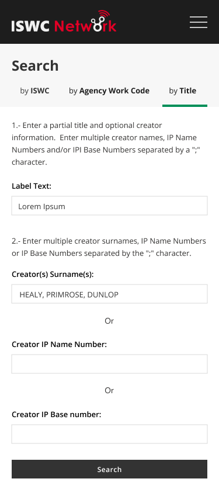

  

CISAC

ISWC Agency Portal 

# Document Control

## Change Record

Date

Person

Version/Reference

6th Aug 2019

John Corley, 

Ana Janeth Villegas Salazar 

V1\.0 / Initial Draft

2nd Sep 2019

John Corley, Ana Janeth Villegas Salazar

V2\.0 / Incorporated feedback from first two workshops

9th Sep 2019

John Corley, Ana Janeth Villegas Salazar

V3\.0 / Incorporated feedback from last design workshop and prepared document for sign off by Steering Group

16th Sep 2019

John Corley

V3\.1 / Added results of usability study to Appendix C

17th Sep 2019

John Corley

V3\.2 / Updated with agreed final changes at Steering Group Meeting and signed off by Steering Group

4th Oct 2019

John Corley, Ana Janeth Villegas Salazar

V4\.0 / Post sign off update to reflect the agreed changes documented in the appendix in the body of the document to make it easier for developers to interpret the specification\. 

## Reviewers

Andreas Thiele

Ulrich Siebert

Katrien Tielemans

Bolmar Carrasquilla 

Ed Osanani 

Bolmar Carrasquilla

Tim Carmichael

Dena Fletcher

Thati Schlesinger 

Didier Roy 

Hanna Mazur 

José Macarro 

Sylvain Piat 

John Corley

Niamh McGarry

Declan Rudden

Curnan Reidy 

## Distribution

Reviewers

## Approval

This document was approved electronically via email by the following people on the following dates:

Date/Time

Person

Note

# Table of Contents

[Document Control	2](#_Toc18997640)

[Change Record	2](#_Toc18997641)

[Reviewers	2](#_Toc18997642)

[Distribution	2](#_Toc18997643)

[Approval	2](#_Toc18997644)

[Table of Contents	4](#_Toc18997645)

[1	Introduction	8](#_Toc18997646)

[What does this document contain?	8](#_Toc18997647)

[Who should read this document?	8](#_Toc18997648)

[References	8](#_Toc18997649)

[2	Overview	10](#_Toc18997650)

[2\.1\. Portal Audience	10](#_Toc18997651)

[2\.2\. User Stories Supported	10](#_Toc18997652)

[2\.3\. Design Process	11](#_Toc18997653)

[2\.4\. Visual Design \(Design Composites\)	14](#_Toc18997654)

[2\.5\. Page Flow	26](#_Toc18997655)

[2\.6\. Navigation	27](#_Toc18997656)

[2\.6\.1\. Global Navigation	27](#_Toc18997657)

[2\.6\.2\. In Page Navigation	28](#_Toc18997658)

[2\.7\. Browser Versions	29](#_Toc18997659)

[2\.8\. Responsive Design	29](#_Toc18997660)

[2\.9\. Language Support	30](#_Toc18997661)

[2\.10\. Authentication & User Access Roles	30](#_Toc18997662)

[3	Search Page	31](#_Toc18997663)

[3\.1\. “Search by” section	31](#_Toc18997664)

[3\.1\.1\. Search by ISWC	32](#_Toc18997665)

[3\.1\.1\.1\. ISWC	32](#_Toc18997666)

[3\.1\.2\. Search by Agency Work Code	33](#_Toc18997667)

[3\.1\.2\.1\. Agency Work Code	33](#_Toc18997668)

[3\.1\.2\.2\. Agency	33](#_Toc18997669)

[3\.1\.2\.3\. Database \(Hub\)	33](#_Toc18997670)

[3\.1\.3\. Search by Title	33](#_Toc18997671)

[3\.1\.3\.1\. Title	34](#_Toc18997672)

[3\.1\.3\.2\. Creator\(s\) Surname\(s\)	34](#_Toc18997673)

[3\.1\.3\.3\. Creator IP Name Number	34](#_Toc18997674)

[3\.1\.3\.4\. Creator IPI Base Number	35](#_Toc18997675)

[3\.1\.3\.5\. Matching Rule Configuration for Search	35](#_Toc18997676)

[3\.2\. “Search Results” section	38](#_Toc18997677)

[3\.2\.1\. Search Results Grid	38](#_Toc18997678)

[3\.2\.1\.1\. Original Title	40](#_Toc18997679)

[3\.2\.1\.2\. Creator Names	40](#_Toc18997680)

[3\.2\.1\.3\. Submitting Agencies	40](#_Toc18997681)

[3\.2\.1\.4\. Original Submission and Last Update dates	40](#_Toc18997682)

[3\.2\.1\.5\. Disambiguated	40](#_Toc18997683)

[3\.2\.2\. Search Results View More Expansion	41](#_Toc18997684)

[3\.2\.2\.1\. Expansion Panel Header	42](#_Toc18997685)

[3\.2\.2\.1\.1\. Original Submission and Last Update dates	42](#_Toc18997686)

[3\.2\.2\.1\.2\. View Submission History	42](#_Toc18997687)

[3\.2\.2\.1\.3\. Update Submission	42](#_Toc18997688)

[3\.2\.2\.1\.4\. Add to “Merge List”	42](#_Toc18997689)

[3\.2\.2\.1\.5\. View “Merge List”	42](#_Toc18997690)

[3\.2\.2\.1\. Titles	42](#_Toc18997691)

[3\.2\.2\.2\. Creators	43](#_Toc18997692)

[3\.2\.2\.2\.1\. Name	43](#_Toc18997693)

[3\.2\.2\.2\.2\. IP Name Number	43](#_Toc18997694)

[3\.2\.2\.2\.3\. Affiliation	43](#_Toc18997695)

[3\.2\.2\.2\.4\. IPI Base Number	43](#_Toc18997696)

[3\.2\.2\.2\.5\. Role	44](#_Toc18997697)

[3\.2\.2\.2\.6\. Authoritative Agency	44](#_Toc18997698)

[3\.2\.3\. Search Results View Submission History Page	44](#_Toc18997699)

[3\.2\.3\.1\. ISWC	45](#_Toc18997700)

[3\.2\.3\.2\. Original Title	45](#_Toc18997701)

[3\.2\.3\.3\. Date	45](#_Toc18997702)

[3\.2\.3\.4\. Type	45](#_Toc18997703)

[3\.2\.3\.5\. Method	45](#_Toc18997704)

[3\.2\.3\.6\. Submitting Agency	45](#_Toc18997705)

[3\.2\.3\.7\. Submitting Agency Work Code	45](#_Toc18997706)

[3\.2\.3\.8\. Creators	45](#_Toc18997707)

[3\.2\.3\.9\. Titles	46](#_Toc18997708)

[3\.2\.3\.10\. Status	46](#_Toc18997709)

[3\.2\.4\. Search Results View Merge List	46](#_Toc18997710)

[3\.2\.4\.1\. ISWC	47](#_Toc18997711)

[3\.2\.4\.2\. Original Title	47](#_Toc18997712)

[3\.2\.4\.3\. Creator Names	47](#_Toc18997713)

[3\.2\.5\. Search Results Demerge Page	48](#_Toc18997714)

[4	New Submission Page	49](#_Toc18997715)

[4\.1\. “Main Details” section 	50](#_Toc18997716)

[4\.1\.1\. IP Look Up	51](#_Toc18997717)

[4\.1\.1\.1\. Name	52](#_Toc18997718)

[4\.1\.1\.2\. Affiliation	52](#_Toc18997719)

[4\.1\.1\.3\. Role	52](#_Toc18997720)

[4\.1\.2\. Update Submission	53](#_Toc18997721)

[4\.2\. “Additional Details” section	55](#_Toc18997722)

[4\.2\.1\. Additional Details Section / Matches Found Panel / Select Preferred ISWC Tab	55](#_Toc18997723)

[4\.2\.2\. Additional Details Section / Matches Found Panel / Disambiguate all ISWCs Tab	56](#_Toc18997724)

[4\.2\.2\.1\. Additional ISWCs to disambiguate	56](#_Toc18997725)

[4\.2\.2\.2\. Reason for disambiguation	57](#_Toc18997726)

[4\.2\.2\.3\. BVLTR	57](#_Toc18997727)

[4\.2\.2\.4\. Performers	57](#_Toc18997728)

[4\.2\.2\.5\. Instrumentation	57](#_Toc18997729)

[4\.2\.3\. Additional Details Section / Preferred ISWC Assigned Panel	57](#_Toc18997730)

[5	Workflows Page	59](#_Toc18997731)

[5\.1\. Workflows / Default Filters	59](#_Toc18997732)

[5\.1\.1\. Show Workflows	60](#_Toc18997733)

[5\.1\.2\. Filter by Status	60](#_Toc18997734)

[5\.1\.3\. Approve or Reject button	60](#_Toc18997735)

[5\.1\.4\. View More	61](#_Toc18997736)

[5\.2\. Workflows / Advance Search	62](#_Toc18997737)

[Appendix A – Open and Closed Items	64](#_Toc18997738)

1. Introduction

## What does this document contain?

It provides a detailed specification and design of the new ISWC Agency portal\.  This new web portal will be used by staff within agencies \(societies\) to search the ISWC database and to carry out key transactions\.  

## Who should read this document?

CISAC development and project management personnel\. Society development and project management personnel\.  Spanish Point development team members\.   

## References

Reference

Description

SPE\_20190218\_ISWCDataModel\.docx

New ISWC Database Data Model

SPE\_20190520\_ISWC SOAP & REST Services\.docx

Specification for the REST based services that will be used by this portal\.

ISWC Database REST OpenAPI Swagger\.yaml

Definition for the new ISWC Database REST based API

SPE\_20190424\_MVPValidationRules\.docx

Detailed Validation Rules Specification for new ISWC Database

SPE\_20190424\_MVPMatchingRules\.docx

Detailed Matching Rules Specification for new ISWC Database

REQ\_20190212\_MVP To Be Business Rules\.xlsx

‘To Be’ Business Rules Requirements

ISWCIA18\-0134\_ISWC\_User Stories\_2018\_03\_20\_EN

CISAC defined user stories

SPE\_20190806\_ISWC\_Portal\_AppendixA\_Wireframes\.pdf

Interactive Wireframe PDF for this specification

ISWC Portal \- Components and Styles Library\.pdf

Visual Design Style Guide for portal

SPE\_20190806\_ISWC\_Portal\_AppendixB\_Usability Testing & Interview Script\.docx

Script for the usability study carried out with community documentation experts

1. Overview  

This chapter provides an overview of the new agency \(society\) focused web portal that will be delivered as part of the new ISWC Database project\.

## Portal Audience

The portal will be used by society \(agency\) staff\.

## User Stories Supported 

The following user stories \(see references section above\) will be supported by this portal:

Ref

Description

Implementation Notes 

2\.1

Assign ISWC to a New Fully Domestic Work \(Where No ISWC exists\)

New Submissions Page 

2\.2

Assign ISWC to a New Fully Domestic Work \(Where the Society is aware an ISWC already exists for the same mandatory metadata\)

New Submission Page

2\.3

Assign ISWC to a New Fully Domestic Work \(Where the Society is not aware an ISWC already exists\)

New Submissions Page

2\.4

Assign ISWC to a New Fully Domestic Work \(Where Multiple ISWCs exist\)

New Submissions Page

2\.5

Assign ISWC to a New Split Copyright Work \(Where no ISWC exists\)

New Submissions Page

2\.6

Assign ISWC to a New Split Copyright Work \(Where the Society is aware an ISWC already exists for the same mandatory metadata\)

New Submissions Page

2\.7

Assign ISWC to a New Split Copyright Work \(Where the Society is not aware an ISWC already exists\)

New Submissions Page

2\.8

Assign ISWC to a New Split Copyright Work \(Where Multiple ISWCs exist\)

New Submissions Page

2\.9

Retrieve ISWC for a Work \(One ISWC available or No ISWC available\)

Search Page

2\.10

Retrieve ISWC for a Work \(Multiple ISWCs available\)

Search Page

2\.11

Update ISWC Metadata \- Title

Search Page followed by New Submissions Page

2\.12

Update ISWC Metadata \- Creators

Search Page followed by New Submissions Page

2\.13

Update ISWC Metadata – Role Code

Search Page followed by New Submissions Page

2\.14

Merge ISWC Metadata – Fully Domestic Work

Search Page followed by Merge and Demerge Page

2\.15

Merge ISWC Metadata – Split Copyright Work

Search Page followed by Merge and Demerge Page

2\.16

De\-Merge ISWC Metadata \- Fully Domestic Work

Search Page followed by Merge and Demerge Page

2\.17

De\-Merge ISWC Metadata \- Split Copyright Work

Search Page followed by Merge and Demerge Page

2\.18

Delete ISWC Metadata \- Fully Domestic Work

Search Page

2\.19

Delete ISWC Metadata \- Split Copyright Work

Search Page

2\.20

Review Corrections by Participating society

Workflow Page

2\.21

Assign ISWC numbers to AV Cues

New Submissions Page

## Design Process

Spanish Point use a specialized version of the widely used User Centered Design process for designing web portals\.   The following provides a brief overview of this process: 

Process Stage

Description

Audience Definition

The audience for the ISWC Agency Portal was defined in the CISAC user story documentation 

Personas 

As per the Interaction Design Foundation: Personas are fictional characters, which you create based upon your research in order to represent the different user types that might use your service, product, site, or brand in a similar way\. Creating personas will help you to understand your users’ needs, experiences, behaviours and goals

Instead of documenting distinct personas we have carried out a UX study with a group of Subject Matter Expert users to inform the design\.  The results of that study are described in Appendix B\. 

User Stories

A user stories document was produced by CISAC\.  We have listed the relevant user stories to this portal in section 2\.2 above\. 

Wireframes

Through wireframes we define the high\-level structure of page layouts, as well as the sites’ flow, behaviour, and organization\.  Wireframes allow us to focus on page content and behaviour independently from the Visual Design\.  Wireframes for each page are included in this document and an interactive wireframe pdf is also attached as an appendix where members of the design team can click through key interactions in pages to understand the proposed behaviour\. 

Review Existing Design Assets 

The following existing CISAC sites were reviewed to examine existing logos, styles and other digital assets:

[https://iswcnet\.cisac\.org/](https://iswcnet.cisac.org/)   

[https://www\.cisac\.org/](https://www.cisac.org/)

Existing Functional Specifications

The following specifications were used as inputs to this design document:

SPE\_20190520\_ISWC SOAP & REST Services\.docx

SPE\_20190424\_MVPValidationRules\.docx

SPE\_20190424\_MVPMatchingRules\.docx

REQ\_20190212\_MVP To Be Business Rules\.xlsx

Design Composites

These are full fidelity image of how a key page in the solution will look based on the agreed wireframe and the proposed visual design\.  It defines the Visual Design for all pages in the application\. See Visual Design section below\.   

Design Document

This document\.  Represents the agreed design for the portal including functional, interaction and visual design\. 

## Visual Design \(Design Composites\)

The following show an initial composite of some elements of the search page\.  These composites are also available to view and interact with online[ [here](https://www.figma.com/proto/9ixJ76G54S6BJQoaHvKnxZ/CISAC-ISWC-System?node-id=96%3A378&viewport=-891%2C-292%2C0.5584732294082642&scaling=min-zoom)](https://www.figma.com/proto/9ixJ76G54S6BJQoaHvKnxZ/CISAC-ISWC-System?node-id=96%3A187&viewport=156%2C358%2C0.2792366147041321&scaling=min-zoom):

Figure 1 \- Search by ISWC, Desktop view\.

  

Figure 2\.2 \- Search by ISWC, Tablet view\.

   

Figure 3\.3 \- Search by ISWC, Mobile view\.

  

Figure 4 \- Search by Agency Work Code, Desktop view\.

  

Figure 5\.2 \- Search by Agency Work Code, Tablet view\.

  

Figure 6\.3 \- Search by Agency Work Code, Mobile view\.

  

Figure 7 \- Search by Title, Desktop view\.

  

Figure 8\.2 \- Search by Title, Tablet view\.

Figure 9\.3 \- Search by Title, Mobile view\.

  

Figure 10 \- Search Results Grid, Desktop view\.

  

Figure 11\.2 \- Search Results Grid, Tablet view\.

Figure 12\.3 \- Search Results Grid, Mobile view\.

  

Figure 5 – Mobile menu Open\.

## Page Flow

The following diagram represents the proposed page flow: 

## Navigation

The portal will use a combination of a global navigation bar \(that will reduce to a hamburger menu on smaller form factor displays\) and “in\-page” navigation for key page\-specific functionality\.

### Global Navigation 

The following global navigation links will be present on each page: 

- Home \(logo\) brings the user to the welcome page
- Search brings the user to the Search page
- New Submission brings the user to the New Submission Page
- Workflows brings the user to the Workflows Page
- Gear Icon brings the user to the settings page 

### In Page Navigation 

Each page will use one or more of the following “in\-page” navigation elements:

- Tabs for switching between different view options \(such as in the search page\)

- View more / View less expansion and contraction buttons to expand and hide additional details

- Action buttons for carrying out key actions

## Browser Versions

The site will be tested using the following browser versions:

OS / Browser / Versions

Windows 10 / Microsoft IE / 11

Windows 10 / Google Chrome / \(Latest version at time of specification 75\.0\.3770\.142\)

Windows 10 / Firefox / \(Latest version at time of specification 68\.0\.1\) 

iPhone 6 & 7 / Safari / Latest version at time of specification iOS 12\.4\)

iPad / Safari / \(Latest version at time of specification iOS 12\.4\)

## Responsive Design 

The portal will implement a responsive design in line with the design composites shown in the Visual Design section of this specification\.  The portal will be tested using the following screen resolutions: 

- Desktop 1600x992px 
- Laptop 1280x802px 
- Tablet 768x1024px 
- Mobile 320x480px     

## Language Support

All labels and error messages will be held in a central resource file such that additional languages can be added in the future\.  The pages will be developed and configured in EN language only\.

## Authentication & User Access Roles

To Do – Discuss with design team\.  The suggestion by Didier is that the new ISWC portal leverages the CIS\-Net authentication system and process for getting a username and password\.  

1. Search Page

The Search page will enable society users to search for ISWCs by ISWC, Agency Work Code and Title\.   To do this it will use the following REST based services with the configured matching rules as per the existing signed off specifications:

- /iswc/searchByIswc
- /iswc/searchByAgencyWorkCode
- /iswc/searchByTitleAndContributor

Note, the following sections include snippets from the full wireframe pdf that is attached as an appendix to this document\.  The pdf is interactive and gives a better idea of the overall interaction design between the pages\.  A good user journey to use to explore the key interactions in the search page is as follows:

- Click on “Agency Work Code” search tab
- Click on “Title” search tab
- Click “Search”
- Click “View more” on the first search result
- Click “More Information” on the Disambiguation panel 
- Click “Less Information” on the Disambiguation panel
- Click “View Submission History” in the ISWC header section   

##  “Search by” section 

The search by section supports searching by one of:

- ISWC
- Agency Work Code
- Title

### Search by ISWC

#### ISWC

The punctuation components of the number will be added automatically by the field validation, if they weren’t added by the user, once the user has typed in the correct number of digits following a T\.  The field will be validated that it conforms to the expected regular expression for an ISWC\.  The check digit check will also be carried out\.

### Search by Agency Work Code

#### Agency Work Code

Free format agency identifier for the work\.  E\.G\. In the PRS case a Tune Code would be used\. No format validation will be carried out\. 

#### Agency

Name from a drop\-down list of agency names\.  Will default to the agency of the currently logged in user\.  User must have a single agency selected\.

 

#### Database \(Hub\)

Name from a drop\-down list of database \(Hub\) names\.  Will default to “All”\.

### Search by Title

#### Title

Free format title that can be used for search\.  As per matching rules for search \(See matching rule configuration for search section below\), this will be matched against the configured title types\.   

The user must enter a title and optionally one of the following: 

- “;” separated list of creator surnames or
- “;” separated list of creator IP Name Numbers or
- “;” separated list of creator IP Base Numbers

#### Creator\(s\) Surname\(s\)

Surname of creators separated by “;”

#### Creator IP Name Number

IP Name Numbers separated by “;”\.  Numbers will be checked to ensure the each are 11 digit numeric\. 

#### Creator IPI Base Number

IPI Base Numbers separated by “;”\.  No specific number format validation will be carried out\. 

#### Matching Rule Configuration for Search 

An additional set of configuration settings for a new “source” called “search” will be set up in the matching engine\.   This was envisaged in the matching specification \(see references\)\.  

This will enable different, more permissive settings to be used for the “search” function\.   

The following describes the search specific settings that will be used\.  Note: The ones that are different from the existing “NonEligible” source are highlighted:

__Parameter__

__Description__

__Configuration__

__Note__

ComposerMatchWritersOnly

If this flag is set to True then only the writers/composers on the input work must match with a work in the index in order for the work to be determined a match\. I\.E\. Non writer/composer contributors such as publishers will not be taken into account\. 

True or False\.

True

ContributorMatchingAlgorithm

The matching criteria that will be used\. NumberAndText means number based matching will be carried out first and if no match is found then text based matching will be used\.   Number means number based matching will be used only\.  Text means text based matching will be used only\.

NumberAndText

EnsureAllContributorsMatch

If this is set to True then in order for a definite match to be identified all contributors \(subject to the ComposerMatchWritersOnly flag\) on the inbound work must match the contributors on the repertoire work\. If this is set to False and there is only one potential match then this potential match will be designated as a definite match\.

True

MinMatchingWriters

The minimum number of writers on the input work that must match with a work in the index in order for the work to be determined a match\.  Note: The exact type of match \(potential or definite\) is determined by the EnsureAllContributorsMatch parameter setting\.

0

This supports searching with no creators supplied

WorkMatchingAlgorithm

The matching criteria that will be used\. “All” means number based matching will be carried out first and if no match is found then title based matching will be used\.   “Number” means number based matching will be used only\.  “Title” means title based matching will be used only\.

All

WorkTitleSimilarity

Threshold % of similarity between the search string and the returned potential work title\. If the % figure returned >= this threshold value then the title \(and therefore its corresponding work\) will be considered in the bucket of works to be further examined to see if they are a match\.

70

This lower threshold enables a more inclusive set of search results

TitleIgnoreWords

The Matching Engine will remove these values from the input title before using that title in text based matching\. This modified title is then used for matching and comparison\. E\.G\. A configuration value of “?” will result in all of the “?” mark characters being removed from an input title before it is used for text based matching\. Note: Any works which don’t have a title after the Ignore Words have been removed will be excluded from further text based matching\. 

Delimited by semi\-colon “;”\.

UNKNOWN;?

WorkSearchDepth

Configures the maximum number of rows that match the text based query that will be returned\. This figure can be configured globally and by Source of the given intray work\.

10000

The following table describes the configuration of the new matching engine parameters that were added as part of the matching specification: 

__Parameter__

__Description__

__Configuration__

__Notes __

TitleFuzzyMatchTypes

When doing fuzzy text matching \(as opposed to exact title matching\), only include the specified title types\.  E\.G\. “OT,AT” means that only OT and AT type titles on the work info to be matched will be matched against OT and AT type titles in the index\. 

Blank

ContributorsMatchCounts

Only works in the index that have the same number of contributors as the input work info will be eligible for matching\.  True or False

False

This enable the user to search with a subset of the work creators

WorkTypeMustMatch

Only works in the index that have the same type as the input work info will be eligible as matches\.  True or False\. 

False

ApplyDisambiguation

If disambiguateFromNumbers are provided in the input work then all works in the index that have matching numbers and number types will be eliminated as possible matches for this input work\.  True or False

True

MinMatchingWritersByNumberPct

The minimum number of writers on the input work \(expressed as a % of the total number of writers on the input work\) that must match with a work in the index by IP Number in order for the work to be determined a match\.  Note: The exact type of match \(potential or definite\) is determined by the EnsureAllContributorsMatch parameter setting\.

0%

This enable name only searches

#### Filtering out of any items that have been merged from the search results

Search results should not follow the chain of Linked To items in results\.  I\.E\. If an ISWC matches the search criteria but that ISWC has been merged \(linked to \) another ISWC then don’t show that now merged ISWC in the search results\.  

### Search by IP Number

#### Creator IP Name Number

IP Name Numbers separated by “;”\.  Numbers will be checked to ensure the each are 11 digit numeric\. 

#### Creator IPI Base Number

IPI Base Numbers separated by “;”\.  No specific number format validation will be carried out\. 

##  “Search Results” section 

The search results section shows a pageable grid of search results where the user can expand one or more result items, by clicking the “View More” expansion item\.  

### Search Results Grid

The grid is sorted by descending Preferred ISWC number by default but can instead be sorted by ascending ISWC or by descending or ascending Original Title\.   Preferred ISWCs are listed in the grid only\.  E\.G\. If the search criteria identified an archived ISWC or an ISWC that has been linked to \(using merge\) another ISWC then the search results will list the corresponding Preferred ISWC\.  The details of the Archived and Linked ISWCs can be seen in the “View More” expansion section\.  

#### Original Title

Non standardized original title for the Preferred ISWC\.

#### Creator Names

Authoritative Surname and first name of all creator IPs associated with the preferred ISWC\.  

#### Submitting Agencies

List of Agencies who have made submissions that are associated with this Preferred ISWC\. 

#### Original Submission and Last Update dates

Date and time of the original submission and last “approved” submission for the Preferred ISWC being shown\. 

#### Disambiguated

List of unique ISWC’s that were listed as disambiguated ISWCs across all current submissions linked to this Preferred ISWC\. 

#### Paging – Show per Page

The default number will be 20 and this will increase in increments of 10 up to a maximum of 100 in the drop\-down option box\. 

#### Paging – Skip to Page

The page number is editable so the user can skip forwards and backwards to specific pages as needed\. 

### Search Results View More Expansion

#### Expansion Panel Header

##### Original Submission and Last Update dates

Date and time of the original submission and last “approved” submission for the Preferred ISWC being shown\. 

##### View Submission History

Link that opens the submission history for this preferred ISWC on a separate browser tab\.  

##### Update Submission

Link that opens the New Submission page \(in the same tab\) with the info from the previous submission from this society pre\-populated on that page\.  This will enable the society to update their submission for this Preferred ISWC\.

##### Add to “Merge List”

Toggles the addition or removal of this Preferred ISWC from the “Merge List”\.  The “Merge List” holds a list of Preferred ISWCs that the user wants to merge together\. 

#####  View “Merge List”

Link that opens the “Merge List” page\.  In this page the user can review the list of ISWCs in the list, alter the primary one that will be merged into and then submit the merge transaction\.   

#### Titles

Shows the list of non\-standardized titles associated with the Preferred ISWC\.

#### Creators

Shows the list of creators associated with the Preferred ISWC and their role\. 

##### Name

Shows the IPI Name information for the authoritative IPI Name numbers in the format surname \+ first name\.

##### IP Name Number

Shows the authoritative IPI Name numbers\.

##### Affiliation 

List of agencies that the IP has a current agreement with \(see query ref 2 in the “To Be Business Rules” document, Appendix A worksheet\)\.  Shows first one, sorted by descending effective date, unless user presses \+more link\.  When user presses \+more, then the row will expand to show all agencies\.  

 

##### IPI Base Number 

Shows IPI Base number for the IPI Name number shown\.  If there are multiple \(group pseudonyms\) then show all of them\. 

##### Role

Shows rolled up role as stored in ISWC database for the creator\.   

##### Authoritative Agency

Shows the agency \(submitter\) for the creator shown \(i\.e\. the one that is authoritative\)\.  Note: Where there are multiple authoritative agencies for an IP the system has validation rules that picks one as per the rule AS/10 \(See MVP Matching Rules specification and MVP To Be Business Rules document\)\.     

### Search Results View Submission History Page

This page shows a grid view of all submissions made in descending date sequence\. The grid can be sorted ascending or descending by date, type, method and submitting agency\. 

#### ISWC

Preferred ISWC\.

#### Original Title

Non standardized original title for the Preferred ISWC\.

#### Date

Date and time of submission as recorded by the ISWC database in its audit data\.

#### Type

Transaction Type \(using EDI nomenclature\)\.

#### Method

Way in which transaction was carried out\.  Possible values are: 

- EDI
- SOAP
- REST
- Web

#### Submitting Agency

Name of submitting agency\.

#### Submitting Agency Work Code

Work Code of the submitting agency as per their submission\.  E\.G\. for PRS this would be the tune code\. 

#### Creators

List of creator names as per the IP Name Numbers submitted \(as per the audit trail\) along with the corresponding submitted role \(not rolled up\)\.

#### Titles

List of all non\-standardized titles submitted by agency as per the audit trail including the original title\.

#### Status

Indicator that identifies if the transaction is approved \(or never needed approval\), is pending approval in a time limited workflow or has been rejected\)\.  These indicators will have tooltips that explain what the mean\.  I\.E\. The tooltip will read “Approved”, “Pending Approval” or “Rejected” depending on the indicator\. 

### Search Results View Merge List

This page shows a grid view of all Preferred ISWC’s on the Merge List \(that will be merged together using the LinkedTo structure in the ISWC Database\)\.  The user can take the following actions on this page: 

- View More

This will show the same expansion panel of ISWC information as defined in section 3\.2\.2 above though without the Add to Merge List and View Merge List options\. 

- Change the default Preferred ISWC to be merged into

The system will default the Preferred ISWC to be merged into using the business rules documented in the referenced rules document and specification\.  The user can select a different Preferred ISWC as the one to be merged into if needed\. 

- Remove Item From Merge List button

This button will remove the related ISWC from the merge list\.

- Submit Merge

When the user presses this button, the system will carry out the merge transaction, creating an approval workflow if needed\. 

#### ISWC

Preferred ISWC 

#### Original Title

Non standardized original title for the Preferred ISWC\.

#### Creator Names

Authoritative Surname and first name of all creator IPs associated with the preferred ISWC\.  

### Search Results Demerge Page

This page shows a preferred ISWC and the list of other ISWC’s that were merged \(in the new ISWC Database using the LinkedTo construct\) into it\.   The user can select one or more of these ISWCs and demerge them from the Preferred ISWC\. 

1. New Submission Page

The New Submission page will enable society users to create a new ISWC submission\.  The user will fill in the required ISWC metadata and then once they press the Next button the system will process this ISWC submission using the following web service call:

- /submission

This will result in one of the following outcomes:

- The metadata entered will fail validation \(as per the validation rules specification\) and the user will not proceed to the Additional Details page\.
- The system will have identified the submitter as ISWC eligible and will have identified that the ISWC metadata submitted is unique and does not exist in the ISWC database\.  It will save the metadata in the system, generating a new ISWC and will return that ISWC to the user in the Additional Details section \(displaying the “Unique ISWC Assigned” panel rather than the “Matches Found” panel\)\.
- The system will have identified the submitter as not ISWC eligible and will have identified that the ISWC metadata submitted is unique and does not exist in the ISWC database\.  It will return an error saying that the user’s agency is not eligible to generate a new ISWC for this metadata\.
- The system will have identified that the submitter is ISWC eligible but will has found one or more existing Preferred ISWCs that match this metadata\.  It will default to selecting the Preferred ISWC that the submission data will be associated \(merged\) with in the “Select preferred ISWC” tab but will allow the user to choose a different ISWC with matching metadata that is listed or to select the Disambiguate all ISWCs tab to tell the system that this submission requires a new ISWC \.
- The system will have identified that the submitter is not ISWC eligible but has found one or more existing Preferred ISWCs that match this metadata\.  It will default to selecting the Preferred ISWC that the submission data will be associated \(merged\) with in the “Select preferred ISWC” tab but will allow the user to choose a different ISWC with matching metadata that is listed\.  The user won’t be allowed to select the “Disambiguate all ISWCs” tab as they are not ISWC eligible\.

The New Submission page will also be linked to users who have found an existing Preferred ISWC through the Search page and who have clicked the “Update Submission” button\.   When the user does this the New Submission page will contain the information from the last submission made by this agency that is recorded against the Preferred ISWC\.   From there the user can make changes and then make the submission again\.  

##  “Main Details” section 

### IP Look Up

When the user selects the LookUp button associated with the IP Name Number field in either the Creators or Original Publishers table then the Lookup Panel will expand as follows: 

The user can enter either an IP Surname or IP Base Number and press search\.  A search results grid is shown for all matching search results as per the ISWC’s replica of the IPI data: 

#### Name

Surname followed by first name 

#### Affiliation

List of agencies that have active agreements with the IP for music related right types\.   These list of right types are: 'MW', 'BT', 'DB', 'ER', 'MA', 'MB', 'MD', 'MP', 'MR', 'MT', 'MV', 'OB', 'OD', 'PC', 'PR', 'PT', 'RB', 'RG', 'RL', 'RP' ,'RT' ,'SY' ,'TB' ,'TO' ,'TP' ,'TV'

#### Role

Role associated with IP Name Number

### Update Submission

When a user presses on the Update Submission link in the Search Results View More Expansion panel \(See 3\.2\.2 for details\) then the New Submission page is prepopulated with the info from the previous submission from this society as per the following wireframe\.  The user can update any of the details on the page before pressing next\.  The system will match the information and proceed as per a new submission\.   

##  “Additional Details” section 

The sections and tabs within this page will depend on the outcome of the matching as per the introduction section to this chapter\. 

### Additional Details Section / Matches Found Panel / Select Preferred ISWC Tab

The system will default to the Preferred ISWC that has been identified through matching but will also display any additional preferred ISWCs found\.  The user can select a different ISWC or stick with the default one before pressing Submit\.  

###  Additional Details Section / Matches Found Panel / Disambiguate all ISWCs Tab

The system will show the matching Preferred ISWCs that are being disambiguated from and ask the user to add additional disambiguation details before pressing Submit\.  Once the user has pressed “Submit” they will be presented with the “Unique ISWC Assigned” Panel\.  

#### Additional ISWCs to disambiguate 

The user can enter additional existing Preferred ISWCs separated by “;” characters\.  Each ISWC entered will be reformatted to include the standard punctuation elements if they are not provided and will have their check digit verified\. On submit the values entered will be validated against the ISWC database and an error will be shown if they don’t all exist as valid Preferred ISWCs as follows: 

“Additional ISWC xyz is not a valid Preferred ISWC in the ISWC database” where xyz represents the iswc that failed validation\. 

#### Reason for disambiguation

The user must select exactly one of the reasons listed\.  This field will be defaulted to blank\. 

 

#### BVLTR

This field will be defaulted to blank\.  The user can select exactly one value from the drop\-down list or can leave it blank\. 

#### Performers

This grid will be defaulted to blank\.  The user can enter one or more performer names\.  If a first name is entered, then a non\-blank last name also has to be entered\. 

#### Instrumentation 

This field will be defaulted to blank\.  The user can select one or more instrumentation codes or instrument codes from the single drop\-down list provided\.  I\.E\. The user could chose “Brass Band” and also “Piano”\. 

### Additional Details Section / Preferred ISWC Assigned Panel 

This panel will show the heading “Preferred ISWC Assigned”, show the ISWC number assigned and provide a button to enable the user to do “Another New Submission”\.  The View more button will show the same expanded view of the Preferred ISWC as per section 3\.2\.2 above\. 

1. Workflows Page

The Workflows page will enable agency users to view workflows generated by ISWC Database actions and Approve or Reject ones that are assigned to their agency\. 

## Workflows / Default Filters

The results grid will auto refresh when either the “Show workflows” or “Filter by status” options are altered\. 

### Show Workflows

The user must select one or both of the “Assigned to me” and “Created by me” options\.  “Assigned to me” means that the grid will show workflows that are assigned to the agency of the logged in user\. 

“Created by me” means that the grid will show workflows that were created arising from an action taken by the logged in user\.

The default selection will be “Assigned to me”

### Filter by Status

The user must select one, both or all three of the “Pending Approval”, “Approved” and “Rejected” options\.  

The default section will be “Pending Approval”

### Approve or Reject button

The Approve and Reject buttons will be available for all workflow items that are “Pending Approval” and “Assigned to me”\.   Pressing the Approve or Reject button will change the status of the associated update or merge submission\.  The user can select multiple items and then press the Approve All or Reject All buttons\.  Any individual or bulk rejections will require an additional confirmation with the following text: “Reject nnn workflows\.  Are you sure?” with a Yes or No answer\. nnn represents the number of workflows that will be rejected\. 

### View More

The View More button will show the Preferred ISWC expansion panel for the associated Preferred ISWC\(s\) as defined in 3\.2\.2 above\.

### Status Indicator

The status indicator in the search results will show a unique icon with hover text for the following:  

- “Pending Approval”
-  “Approved \(Automatic\)” 
- “Approved \(Manual\)” 
- “Rejected” options\.  

The manual and automatic approval options will enable users to differentiate between items that were auto approved by the system as opposed to those that were approved by a agency directly through the portal \(or another mechanism such as web services or EDI\)\.

## Workflows / Advance Search

The advanced search option allows the user to filter the search results by one of the following: 

- ISWC 

The user can restrict provide one or more ISWCs separated by ‘;’ characters

- Agency Work Code

The user can filter by one or more Agency Work Code values separated by ‘;’ characters\.

- Originating Agency

The user can filter by a specific originating agency

# Appendix A – Open and Closed Items

This appendix provides a tracking list of specific issues/queries raised by CISAC during the specification process and how they were incorporated or excluded from this specification:

__Open and Closed Items__

__ID__

__Description__

__Response__

__Status__

__Next Action By__

1

Need to confirm if we have the freedom to redesign the ISWC logo

Yes – New visual design can be reused for external facing portals \(public and publishers\) as well as for the agency portal \(this specification\)\.  See section 2\.4 for details\. 

Closed

Jose M / Sylvain P

2

Need to update the Visual Design section to include composites for each of the proposed supported resolutions outlined in the Responsive Design section

Done\.  See section 2\.4 for details\. 

Closed

Ana JVS

3

Need to add a Personas section to Chapter 2 following a call with a typical user of this functionality\.  Design team members to nominate someone for a quick phone interview

Agreed to leave out the persona part but to carry out a separate UX study with selected documentation experts in the community\.  People invited to participate are: Janise Hooper \(BMI\), Ulrich Siebert \(GEMA\),

Wolfgang Rudigier \(SUISA\), Frederic Rampelberg \(SACEM\), Bolmar Carrasquilla \(ASCAP\), Christopher McKenzie \(SOCAN\)\.  Results of study included in Appendix B 

Closed

John C

4

Need to confirm with the design team if the proposal to integrate authentication with CIS\-Net is acceptable and if so then get information on this from Didier

Agreed to integrate by using shared credentials\.  Technical details of API to be provided by FastTrack outside of this specification\.  

Closed

John C

5

Include wireframes for Workflows page

Done

Closed

John C & Ana JVS

6

Produce welcome page content and any legal notices

A single welcome page with associated click through notices for first time use will be delivered\. The details of the content can will be agreed during the development phase\. 

Closed 

Jose M / Sylvain P

7

Include “Merge List” wireframe

Done

Closed

John C & Ana JVS

8

Include “Demerge” capability wirame

Done

Closed 

John C & Ana JVS

9

Need to confirm that allowing for the selection of instrumentation codes only \(as per instrumentation summary in CWR\) is sufficient for disambiguation\.   John C to discuss with Ulrich Siebert \(GEMA\)

Agreed that the single list shown in the wireframes will contain both Instrumentation and Instrument codes\.

Closed

John C and Ulrich S

10

Create Script for Usability Testing and Interview to gather qualitative data\.

Done – Added as an appendix

Closed

Ana JVS

11

Further changes to be applied to the specification so that it can be signed off:

- __Search Results \- Option 2 \- Option to Replace Disambiguated ISWCs with IPI Name Numbers of Creators \- Agreed to replace Disambiguated ISWCs with IP Name Number and position beside IP Names\. __\(Updated on wireframes in pdf and specifications document\)__  __
- __Search Results \- Option 2 \- Include Rank in search results __\(Updated on wireframes in pdf and specifications document\)__  __
- __Search Results \- Option 2 \- Include Search Sorting result sorting option for date shown __\(Updated on wireframes in pdf and specifications document\)__  __
- __View Details Panel \- Remove Authoritative Society __\(Updated on wireframes in pdf and specifications document\)__  __
- __Search Header \- Reduce free space to make results grid higher up on the page\.  Also review the possibility of auto collapsing and expanding search parameters after search during UAT\.__
- __Search Results \- Confirm max page size in paging\. Confirmed 100__
- __Search Results \- Include intermediate paging links so users can skip directly ahead__
- __Search \- Configure title search so that it only searches current metadata \(excludes items that have been merged\)__
- __Search \- Include option by IPI Number only \(exclude items that have been merged\)__
- __Workflow\- Include a date range filter\. __\(Updated on wireframes in pdf and specifications document\)__  __
- __Include a visual indicator to differentiate between auto approved or manually approved__

John C to updated in specification post sign off

# Appendix B – Usability Testing 

The design team validated the UX through carrying out a usability study with documentation experts from five different societies\.   The methodology and interview script for this study is documented here: [SPE\_20190806\_ISWC\_Portal\_AppendixB\_Usability Testing Interview Script\.docx](https://teams.microsoft.com/l/file/29ECACFF-7896-476C-A491-76DD52C418D4?tenantId=4197e6e7-fe92-417f-8cd8-0997d263db36&fileType=docx&objectUrl=https%3A%2F%2Fspanishpoint1.sharepoint.com%2Fsites%2FCISACSPISWC%2FShared%20Documents%2FAs%20Is%20System%2FMVP%20ISWC%20Portal%20-%20WBS%201.8%2FSPE_20190806_ISWC_Portal_AppendixB_Usability%20Testing%20%26%20Interview%20Script.docx&baseUrl=https%3A%2F%2Fspanishpoint1.sharepoint.com%2Fsites%2FCISACSPISWC&serviceName=teams&threadId=19:a78725c0b9b4485b86bc40ee740311b2@thread.skype&groupId=eefca450-9bf9-49ac-b171-01fb643f2cb3)

The participants in the study were:

__Society__

__Participants__

BMI

Janice Hooper

Alice Meisel

GEMA

Thomas Port

Ulrich Siebert

SOCAN

Christoper McKenzie

Sheila Tozak

SACEM

Frederic Rampelberg

Cynthia Lipskier

SUISA

Eva Bisaz

Post Usability Test Survey: [Summary of responses](https://forms.office.com/Pages/AnalysisPage.aspx?id=5-aXQZL-f0GM2AmX0mPbNvKoL-MrOy9Ijm9duIlUKOVUNldQUUFVMk5KTDZKQjVVWFc1NkY0SFlTWC4u&AnalyzerToken=yHC9FN8KVCDxyhu3pTluvYNmY7PStAam)

The feedback from this study was positive with all participants indicating that they found the proposed UX easy to use\.    A summary of the feedback and the next action on the feedback has been listed below: 

__Area__

__Feedback__

__Next Action__

Workflow

Clarify language used in filters “Assigned to me” and “Created by me”

Workflow

Support more complex permission model for societies where individual users will be given different permission settings

Added to “Wish List” items 

Search

Clarify that when you use multiple names in search that it is returning only those results that contain all those names

Incorporate into this specification

Search

Use second more detailed search result layout

Incorporated into this specification

New Submission

Derived Work heading is slightly misleading\.  Maybe replace with “Derived from Work”

Incorporate into this specification

\(Updated on wireframes in pdf and specifications document\)__  __

New Submission

Instrumentation list needs to include the combined list of both Instrumentation and Instruments so that combinations such as “Brass Band” and “Piano” can be formed\.  

Incorporate into this specification

Search

Make it clearer that the semi\-colons can be used by moving the instruction text closer to the search fields

Incorporated into design composites

Search

Use second more detailed search results layout

Incorporated into this specification

Search

Change “Disambiguated” column heading to “Disambiguated From”

N/A – field removed

New Submission

Ability to “Copy as New Submission” option as well as “Make another New Submission”

Incorporated into this specification

\(Updated on wireframes in pdf and specifications document\)__  __

New Submission

Ability to export list of ISWC’s assigned / created for a user session 

Added to “Wish List” items

New Submission

Make it possible to differentiate between system generated and user approvals

Added to “Wish List” items

Merge Work

Make it more obvious, through visual styling, which ISWC is being retained

Incorporate into visual design

Search

Add formatting if it is not provided when entering ISWC

Incorporated into this specification

Search

Use second more detailed search results layout

Incorporated into this specification

Search

Affiliation Societies – If it is a long list need to be able to see all of them\.

Incorporated into this specification\.  When user presses \+more then, the row will expand to show all agencies\.  

Merge

Support more complex permission model for societies where individual users will be given different permission settings

Added to “Wish List” items 

Merge / Demerge

Include creation date on demerge / merge list items

Incorporated into this specification

\(Updated on wireframes in pdf and specifications document\)__  __

# Appendix C – Understanding Workflows 

The appendix describes provides an overview of how workflows are expected to work in the ISWC Database and what the Approval / Rejection actions achieve from a system perspective\. 

## Actions that trigger Workflow Tasks

Approval workflow tasks are generated by the system when processing update, delete or merge transactions, through any channel \(web portal, REST API, EDI file exchange etc, Hub etc\.\) based on the following:

- Workflow Tasks are generated for each ISWC eligible agency, that has already made a submission on the ISWC that has been updated, merged or deleted
- The Originating Agency does not get a workflow task assigned 

Below is an example of where a workflow task would be generated\.

__ISWC T\-123\.456\.789\-1 __

This work contains IPs from ASCAP and SOCAN

There are 10 different Agency submissions attached to this ISWC

- 2 ISWC\-eligible \(ASCAP and SOCAN\)
- 8 ISWC\-ineligible

ASCAP make a change to the ISWC metadata \(through CIS\-Net\) and the transaction is fully accepted

- The change is immediately applied to the composite metadata for the ISWC 
- SOCAN get a workflow task assigned to them where they can either approve \(nothing is changed\) or reject \(the composite metadata is returned to its original \(pre ASCAP change\) state\. 

## Optimistic Approval

Updates are applied immediately, under the assumption that most changes will be approved\.   Workflow tasks themselves are also automatically marked as approved once the configured time limit[\[1\]](#footnote-2)  is set\.  

Rejection of a workflow task triggers the reinstatement of the composite metadata on the work prior to the update that triggered the workflow\. 

1.  The exact setting for this time limit is not agreed but it is expected to be approx\. 30 days\.   [↑](#footnote-ref-2)

