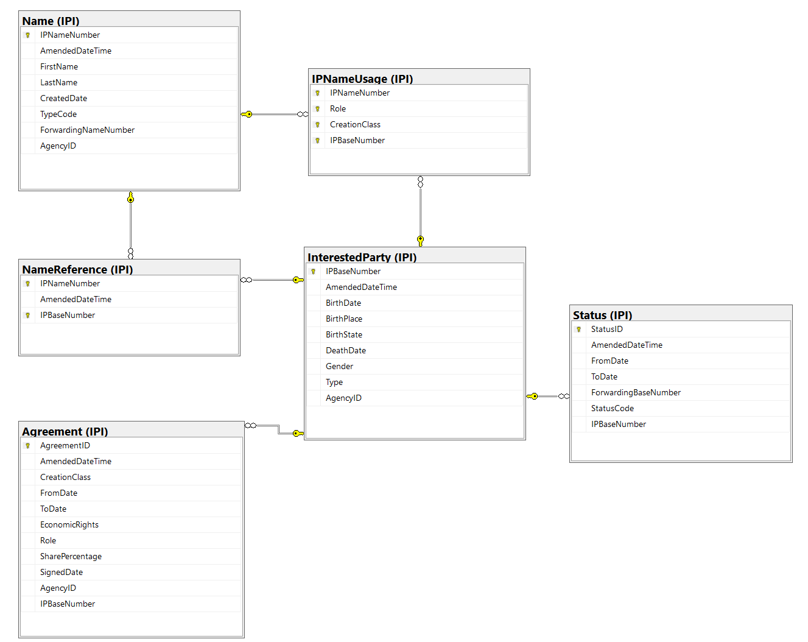

  

CISAC

ISWC/IPI Integration Design  

# Document Control

## Change Record

Date

Person

Version/Reference

1st Sep 2019

John Corley, 

Curnan Reidy  

V1\.0 / Initial Draft

23rd Oct 2019

Peter Klauser

V1\.1 / Updated based on feedback from Peter\.

25th Oct 2019

John Corley

V1\.2 / Updated based on feedback and changes agreed at review session

15th Nov 2019

John Corley

V1\.3 / Answered remaining question on date times posted by Nimh

## Reviewers

Brigitte Kueng

Didier Roy 

Hanna Mazur 

José Macarro 

Peter Klauser

John Corley

Niamh McGarry

Declan Rudden

Curnan Reidy

## Distribution

Reviewers

## Approval

This document was approved electronically via email by the following people on the following dates:

Date/Time

Person

Note

# Table of Contents

[Document Control	2](#_Toc22891808)

[Change Record	2](#_Toc22891809)

[Reviewers	2](#_Toc22891810)

[Distribution	3](#_Toc22891811)

[Approval	3](#_Toc22891812)

[Table of Contents	4](#_Toc22891813)

[1	Introduction	6](#_Toc22891814)

[What does this document contain?	6](#_Toc22891815)

[Who should read this document?	6](#_Toc22891816)

[References	6](#_Toc22891817)

[2	Overview	7](#_Toc22891818)

[2\.1\. IPI EDI file based full resynch process	7](#_Toc22891819)

[2\.2\. IPI API based scheduled synch process	7](#_Toc22891820)

[2\.3\. IPI Schema in the ISWC Database	8](#_Toc22891821)

[3	IPI EDI File Based Full Resynch Process	9](#_Toc22891822)

[3\.1\. File Location, Naming Convention and Size	9](#_Toc22891823)

[3\.2\. File Structure & File Level Validation	10](#_Toc22891824)

[3\.3\. IPA Transaction Format and Field Mapping	10](#_Toc22891825)

[3\.4\. File Processing	15](#_Toc22891826)

[3\.5\. Deduplicating \[IPI\.Name\] records before inserting into ISWC database	16](#_Toc22891827)

[3\.6\. Updating the High\-Water Mark	16](#_Toc22891828)

[4	IPI API Based Scheduled Synch Process	17](#_Toc22891829)

[4\.1\. Job Processing	17](#_Toc22891830)

[4\.1\.1\. Get Date and Time of Last Successfully Applied Update	17](#_Toc22891831)

[4\.1\.2\. Get Batches of IPs that have been Updated since that Date/Time	17](#_Toc22891832)

[4\.1\.3\. Get Batches of IPA details for Updated IP returned	18](#_Toc22891833)

[4\.1\.4\. Update IPI Schema IPs with relevant data from IPA transactions	18](#_Toc22891834)

[4\.1\.5\. Update the “High\-Water\-Mark” and get the next batch of updated IPs	19](#_Toc22891835)

[4\.2\. Job Scheduling, Error Handling and Logging	19](#_Toc22891836)

[4\.3\. Job Credentials	20](#_Toc22891837)

[Appendix A – Open and Closed Items	21](#_Toc22891838)

1. Introduction

## What does this document contain?

It provides a detailed specification and design of the integration software that will be used to synchronise the IPI information provided by SUISA with the local copy of IPI information held in the new ISWC database\. 

## Who should read this document?

CISAC development and project management personnel\. Society development and project management personnel\.  Spanish Point development team members\.   

## References

Reference

Description

SPE\_20190218\_ISWCDataModel\.docx

New ISWC Database Data Model

ISIP0022\-R14\.pdf

IPI EDI Specification

ISIP0099\-R10\.pdf

IPI API Specification

1. Overview

The integration between the ISWC Database and the IPI system will consist of the following components: 

- An IPI EDI file based full resynch process
- An IPI API based scheduled synch process

##  IPI EDI file based full resynch process

The purpose of this process is to fully replace the ISWC database copy of IPI data with the latest full quarterly export provided by IPI\.   It will be run on an occasional as\-needed basis to get the data back in synch in the event of there being issues with the IPI API based scheduled synch process defined below\.  

This process will be developed using Azure Data Factory and Azure Databricks\. 

This process will take as its input the IPI quarterly export\. This is a full dump of the IPI information produced at the end of each quarter\.  It consists of a set of 1GB files that when combined make up the full IPI export\.

Each file consists of a set of IPA transactions as defined in the IPI EDI specification\.  The relevant information from these IPA transactions will be extracted into a set of files that mirror the IPI tables in the ISWC database\.   The process will replace each table’s contents with the corresponding file containing the up\-to\-date data\.  While this process is happening, the ISWC system will be in maintenance mode\.   

## IPI API based scheduled synch process

The purpose of this process is to check the IPI API on a regular basis for updates since the last successfully received updates\.   Where updates are found they will then be processed by applying the relevant updates to the IPI data in the ISWC database\.  Once successfully applied the process will update the “high\-water\-mark” that indicates the date/time of the most recent IPI updates applied so that the next time the job executes it will use this new updated “high\-water\-mark”\.

This process will be developed in C\# as an Azure web job\.  It will be configured to execute on a scheduled basis\.   The initial schedule that will be configured is daily\.  It can be scheduled to execute on a more frequent basis if required\.    

## IPI Schema in the ISWC Database

This following diagram shows the IPI schema in the ISWC database that will be updated by the two processes referenced above:

1. IPI EDI File Based Full Resynch Process

This process will be developed using Azure Data Factory and Azure Databricks:

This process will take as its input the IPI quarterly export\. This is a full dump of the IPI information produced at the end of each quarter\.  

## File Location, Naming Convention and Size

The quarterly export files will be manually loaded on an as needed basis into the input sub folder of a specific Azure Data Lake folder called “IPI Full Resynch”\.

The files will use the following naming convention: 

- IPInnsss\.edi\.zip 

where

- nn is a numeric sequence number of the file
- sss is the society/agency code of sending party\.  Will always be 080 representing SUISA in this case

Each file will be zipped and should be unzipped as part of the ingestion process\.  Once unzipped each file will be approx\. 1 GB in size\. 

Once the files have been processed successfully, they should be moved to the \\archive folder\.  Any intermediate files produced by the process should be created in the \\output folder\. 

## File Structure & File Level Validation

The quarterly export files have the following structure: 

- HDR \(one per file\)
- GRH \(one per file\)
	- IPA Transaction header \(one for each IP\)
		- Transaction records \(See “IPA Transaction Format and Field Mappings” section below for details\)
- GRT \(one per file\)
- TRL \(one per file\)

The process should validate that each file has exactly one HDR, GRH, GRT and TRL record\.  If the file fails this validation, then the process should raise an error and stop at that point\.  

## IPA Transaction Format and Field Mapping

For full details on the structure and rules that apply to IPA EDI transactions see the referenced IPI EDI specification document\. 

The relationship between the above record types and the IPI schema tables is listed below:

Rec Type

Name

Req

Max Use

Maps to Table:

IPA

IP Add

M

1

The data from each IPA and BDN record should result in the creation of exactly one \[InterestedParty\] table record\.

BDN

Base Data New

M

1

STN

Status of a new IP

O

1

The data from each STN record should result in the creation a  \[Status\] record\.

NCN

Name single IP Connection New

C

M

Each NCN record should result in the creation of: 

- A \[Name\] record
- A \[NameReference\] record that links that \[Name\] record to the \[InterestedParty\] record

REN

Remarks New

O

M

Should be ignored\.

NUN

Name single IP Usage New

O

M

Each NUN record should result in the creation of a \[IPNameUsage\] record\.

MAN

Membership Agreement

New

O

M

Each MAN record should result in the creation of a \[Agreement\] record\.

TMA

Territory

O

M

Should be ignored\.

MCN

Name multi IP Connection New

O

M

Each MCN record should result in the creation of: 

- A \[Name\] record
- A \[NameReference\] record that links that \[Name\] record to the \[InterestedParty\] record

MUN

Name Multi IP Usage New

O

M

Each MUN record should result in the creation of a \[IPNameUsage\] record\.

ONN

Other name Connection

New

O

M

Each ONN record should result in the creation of: 

- A \[Name\] record
- A \[NameReference\] record that links that \[Name\] record to the \[InterestedParty\] record

INN

Inherited name single IP usage New

C

M

Each INN record should result in the creation of a \[IPNameUsage\] record\.

IMN

Inherited name multi IP usage New

C

M

Each INN record should result in the creation of a \[IPNameUsage\] record\.

NTN

Nationality New

O

M

Should be ignored

When an IP for an IPA transaction is being processed the corresponding \[InterestedParty\] table record and the corresponding related records, through the IPBaseNumber, should be completely replaced with the new data from this IPA transaction\.  I\.E\. The related records, through the IPBaseNumber, of the following tables: 

- \[IPNameUsage\]
- \[NameReference\]
- \[Name\]
- \[Status\]
- \[Agreement\]

The following table lists the record types within each IPA transaction and indicates if that record type should be processed:

Rec Type

Name

Req

Max Use

Mapping

IPA

IP Add

M

1

IP\-BASE\-NUMBER: \[InterestedParty\]\.IPBaseNumber

Code of remitting society: \[InterestedParty\]\.AgencyID

BDN

Base Data New

M

1

Type of interested party: \[InterestedParty\]\.Type

Year of birth/foundation: \[InterestedParty\]\.BirthDate

Month of birth/foundation: \[InterestedParty\]\.BirthDate

Day of birth / foundation: \[InterestedParty\]\.BirthDate

Year of death/dissolution: \[InterestedParty\]\.DeathDate

Month of death/dissolution: \[InterestedParty\]\.DeathDate

Day of death/dissolution: \[InterestedParty\]\.DeathDate

Sex: \[InterestedParty\]\.Gender

Place of birth/foundation: \[InterestedParty\]\.BirthPlace

State of birth/foundation:\[InterestedParty\]\.BirthState 

Amendment date: \[InterestedParty\]\.AmendmentDateTime

Amendment time: \[InterestedParty\]\.AmendmentDateTime

STN

Status of a new IP

O

1

Valid from date: \[Status\]\.FromDate

Valid from time: \[Status\]\.FromDate

Valid to date: \[Status\]\.ToDate

Valid to time: \[Status\]\.ToDate

Status code: \[Status\]\.StatusCode

IP\-BASE\-NUMBER\-ref: \[Status\]\.ForwardingBaseNumber

Amendment date: \[Status\]\.AmendmentDateTime

Amendment time: \[Status\]\.AmendmentDateTime

Related IPA Record 

IP\-BASE\-NUMBER: \[Status\]\.IPBaseNumber

NCN

Name single IP Connection New

C

M

__Mapping to \[Name\] table: __

IP\-NAME\-NUMBER: \[Name\]\.IPNameNumber

Date of last amend\.\.:  \[Name\]\.AmendedDateTime

Time of last amend\.\.: \[Name\]\.AmendedDateTime

Name: \[Name\]\.LastName

First name: \[Name\]\.FirstName

Date of creation: \[Name\]\.CreatedDate

Time of creation: \[Name\]\.CreatedDate

Name type: \[Name\]\.TypeCode

Related IPA Record 

Code of remitting society: \[Name\]\.AgencyID

__Mapping to \[NameReference\] table: __

IP\-NAME\-NUMBER: \[NameReference\]\.IPNameNumber

Date of last amend\.\.:  \[NameReference\]\.AmendedDateTime

Time of last amend\.\.: \[NameReference\]\.AmendedDateTime

Related IPA Record 

IP\-BASE\-NUMBER:\[NameReference\]\.IPBaseNumber

REN

Remarks New

O

M

Ignore

NUN

Name single IP Usage New

O

M

IP\-NAME\-NUMBER: \[IPNameUsage\]\.IPNameNumber

Creation class code:  \[IPNameUsage\]\.CreationClass

Role code: \[IPNameUsage\]\.Role

Related IPA Record 

IP\-BASE\-NUMBER:\[IPNameUsage\]\.IPBaseNumber

MAN

Membership Agreement

New

O

M

Society code: \[Agreement\]\.AgencyID

Creation class code: \[Agreement\]\.CreationClass

Role code: \[Agreement\]\.Role

Right code: \[Agreement\]\.EconomicRights

Valid from date: \[Agrement\]\.FromDate

Valid from time: \[Agreement\]\.FromDate

Valid to date : \[Agreement\]\.ToDate

Valid to time: \[Agreement\]\.ToDate

Date of signature: \[Agreement\]\.SignedDate

Membership share: \[Agreement\]\.SharePercentage

Amendment date: \[Agreement\]\.AmendedDateTime

Amendment time: \[Agreement\]\.AmendedDateTime

Related IPA Record 

IP\-BASE\-NUMBER: \[Agreement\]\.IPBaseNumber

TMA

Territory

O

M

Ignore

MCN

Name multi IP Connection New

O

M

__Mapping to \[Name\] table: __

IP\-NAME\-NUMBER: \[Name\]\.IPNameNumber

Date of last amend\.\.:  \[Name\]\.AmendedDateTime

Time of last amend\.\.: \[Name\]\.AmendedDateTime

Name: \[Name\]\.LastName

First name: \[Name\]\.FirstName

Date of creation: \[Name\]\.CreatedDate

Time of creation: \[Name\]\.CreatedDate

Name type: \[Name\]\.TypeCode

Related IPA Record 

Code of remitting society: \[Name\]\.AgencyID

__Mapping to \[NameReference\] table: __

IP\-NAME\-NUMBER: \[NameReference\]\.IPNameNumber

Date of last amend\.\.:  \[NameReference\]\.AmendedDateTime

Time of last amend\.\.: \[NameReference\]\.AmendedDateTime

Related IPA Record 

IP\-BASE\-NUMBER:\[NameReference\]\.IPBaseNumber

MUN

Name Multi IP Usage New

O

M

IP\-NAME\-NUMBER: \[IPNameUsage\]\.IPNameNumber

Creation class code:  \[IPNameUsage\]\.CreationClass

Role code: \[IPNameUsage\]\.Role

Related IPA Record 

IP\-BASE\-NUMBER:\[IPNameUsage\]\.IPBaseNumber

ONN

Other name Connection

New

O

M

__Mapping to \[Name\] table: __

IP\-NAME\-NUMBER: \[Name\]\.IPNameNumber

Date of last amend\.\.:  \[Name\]\.AmendedDateTime

Time of last amend\.\.: \[Name\]\.AmendedDateTime

Name: \[Name\]\.LastName

First name: \[Name\]\.FirstName

Date of creation: \[Name\]\.CreatedDate

Time of creation: \[Name\]\.CreatedDate

Name type: \[Name\]\.TypeCode

IP\-NAME\-NUMBER\-ref: \[Name\]\.ForwardingNameNumber

Related IPA Record 

Code of remitting society: \[Name\]\.AgencyID

__Mapping to \[NameReference\] table: __

IP\-NAME\-NUMBER: \[NameReference\]\.IPNameNumber

Date of last amend\.\.:  \[NameReference\]\.AmendedDateTime

Time of last amend\.\.: \[NameReference\]\.AmendedDateTime

Related IPA Record 

IP\-BASE\-NUMBER:\[NameReference\]\.IPBaseNumber

INN

Inherited name single IP usage New

C

M

IP\-NAME\-NUMBER: \[IPNameUsage\]\.IPNameNumber

Creation class code:  \[IPNameUsage\]\.CreationClass

Role code: \[IPNameUsage\]\.Role

Related IPA Record 

IP\-BASE\-NUMBER:\[IPNameUsage\]\.IPBaseNumber

IMN

Inherited name multi IP usage New

C

M

IP\-NAME\-NUMBER: \[IPNameUsage\]\.IPNameNumber

Creation class code:  \[IPNameUsage\]\.CreationClass

Role code: \[IPNameUsage\]\.Role

Related IPA Record 

IP\-BASE\-NUMBER:\[IPNameUsage\]\.IPBaseNumber

NTN

Nationality New

O

M

Ignore

## File Processing

The relevant information from these IPA transactions will be extracted, as per the mapping above, into a set of files that mirror the IPI tables in the ISWC database\.  The new high\-water\-mark info should also be retrieved at this time as per section 3\.6 below\.  The process will then replace each table’s contents with the corresponding file containing the up\-to\-date data\.  While this is happening \(the final stage replacement of the IP data in the ISWC database\), the process should switch the ISWC system into maintenance mode\.   In maintenance mode the system will not accept any ISWC transactions\.  Once the process completes, and the high\-water\-mark is updated as per 3\.6 below, it should switch the ISWC system back to normal operations mode\. 

## Deduplicating \[IPI\.Name\] records before inserting into ISWC database

Based on the mapping logic described in section 3\.3 above there will be multiple duplicate \[IPI\.Name\] records generated by the process for a given set of dump data due to multi name links \(Name Types PG or HR\)\.  The notebook should process this file to remove any duplicate entries before it is used to replace the data in the \[IPI\.Name\] table in the ISWC Database\. 

## Updating the High\-Water Mark

The process should also retrieve and process a file called “Timestamp” from the “\\input” sub folder\.  This file will contain a single line with a date/time value included\.  This value should be validated to ensure it is a valid date and then if valid, the value should be used to update the latest IPI high\-water\-mark datetime value in the stored key value parameter in the ISWC database\.   If the date/time is not valid or the timestamp file can not be found then the overall process should fail before the data in the ISWC database is attempted to be replaced\. 

1. IPI API Based Scheduled Synch Process

This process will be developed as a C\# \.net web job\. 

## Job Processing 

The job will do the following: 

### Get Date and Time of Last Successfully Applied Update

The web job will retrieve the latest IPI high\-water\-mark datetime value from a stored key value parameter in the ISWC database\. 

### Get Batches of IPs that have been Updated since that Date/Time

It will use this high\-water\-mark value to retrieve the list of IPs that have been updated since the high\-water\-mark datetime value\.  This will be done using the /getTxLogSummary operation\. It will do this in batches using a configured “getTxLogSummary\_maxTx” parameter with a default of 300 if the parameter isn’t configured\.  

The following shows an example of calling the REST API and the returned results:

 

### Get Batches of IPA details for Updated IP returned

Each IP Base Number returned in the batch from the previous step should be used to retrieve the current IP data in the form of an IPA EDI[\[1\]](#footnote-2) transaction\.   The /getIPAs operation should be used to do this\.  The batch size to be used for this call will be different than that used for the previous operation and should using a configured “getIPAs\_maxTx” parameter with a default of 100 if the parameter isn’t configured\.  

The following shows an example of the similar \(but singular rather than batch\) call for the first of the IPs listed above\.   Note: The developed solution should use the batch /getIPAs operation\. 

The creationClasses retrieved should be filtered to “MW” \(Musical Work\) and the ExpandedCountries option should be set to “false” to restrict the amount of data returned\. 

### Update IPI Schema IPs with relevant data from IPA transactions

Each IPA transaction received should result in a set of updates to an IP in the ISWC database IPI schema that essentially replaces the IP and its related data in the ISWC database with the new data coming from the IPA transaction\.   Details of table and field mapping to achieve this are described in section “3\.3 IPA Transaction Format and Field Mapping” above\.

### Update the “High\-Water\-Mark” and get the next batch of updated IPs

After the batch of IPs retrieved at 4\.1\.2 above have been processed successfully the system should then save the date/time of update of the last IP retrieved \(i\.e\. use the datetime from the TLS record as per the highlight in the screenshot in 4\.1\.2 above\) as the new “high\-water\-mark” and should save this new value in the database\.   It should then proceed to get the next batch of updated IPs since that new updated high\-water\-mark, repeating steps 4\.1\.2 through 4\.1\.4 until no updated IPs are returned\. 

## Job Scheduling, Error Handling and Logging

The process will be created as a scheduled WebJob that uses a CRON expression to define the schedule of execution\.   Initially the WebJob will be scheduled to run on a daily basis at a fixed time per day that will be agreed at deployment time\.  In the future the frequency of execution could be increased as needed\. The current configuration is to run hourly\.

The WebJob should output the following information so that it is available for review when looking in the WebJob Run Details page in Azure:

Info

Example

High Water Mark Retrieved

\[09/11/2019 20:47:17 > 9ed5b3: INFO\]High Water Mark Retrieved  08/11/2019 09:00:00 

Successfully processed batch

\[09/11/2019 20:47:17 > 9ed5b3: INFO\]Successfully processed batch of 300 IPs and set new High Water Mark to  08/11/2019 20:00:00

Processed all updates

\[09/11/2019 20:47:17 > 9ed5b3: INFO\]All updates processed \(650 IPs\) 

Error retrieving updated IPs

\[09/11/2019 20:47:17 > 9ed5b3: INFO\]Error retrieving list of updated IPs since high water mark 08/11/2019 09:00:00

Error retrieving IP Details

\[09/11/2019 20:47:17 > 9ed5b3: INFO\]Error retrieving details of IPs for IPs updated since water mark 08/11/2019 09:00:00\. 

Error Saving High Water Mark

\[09/11/2019 20:47:17 > 9ed5b3: INFO\]Error saving new high water mark 08/11/2019 09:00:00\.

Sample log details:

\[09/11/2019 20:47:10 > 9ed5b3: SYS INFO\] Status changed to Initializing

\[09/11/2019 20:47:15 > 9ed5b3: SYS INFO\] Run script ‘IPISynchProcess\.exe’ with script host – ‘WindowsScriptHost’

\[09/11/2019 20:47:20 > 9ed5b3: SYS INFO\] Status changed to Running

\[09/11/2019 20:47:27 > 9ed5b3: INFO\]High Water Mark Retrieved  08/11/2019 09:00:00

\[09/11/2019 20:50:00 > 9ed5b3: INFO\]Successfully processed batch of 300 IPs and set new High Water Mark to  08/11/2019 20:00:00

\[09/11/2019 20:52:00 > 9ed5b3: INFO\]Successfully processed batch of 15 IPs and set new High Water Mark to  09/11/2019 19:00:00

\[09/11/2019 20:52:17 > 9ed5b3: INFO\]All updates processed \(315 IPs\)

\[09/11/2019 20:52:17 > 9ed5b3: SYS INFO\] Status changed to Success

## Job Credentials

Connection to the SUISA API is through basic authorization using a fixed username and password\.   This username and password should be stored in the Azure Key Vault service\.

# Appendix A – Open and Closed Items

This appendix provides a tracking list of specific issues/queries raised by CISAC during the specification process and how they were incorporated or excluded from this specification:

__Open and Closed Items__

__ID__

__Description__

__Response__

__Status__

__Next Action By__

1

Existing CSI IP Information:

Where is the ForwardingNameNumber on the \[IPI\.Name\] table being populated from?

This is taken from the ONN record \(the field is called – IP\-NAME\-NUMBER\-

ref\. JC to update the specification\. 

Updated now: 

Changed the mapping in section 3\.3 for ONN record type: IP\-NAME\-NUMBER\-ref: \[Name\]\.ForwardingNameNumber

Closed

John C\.

2

IMN Record Type\.  Need to figure out what to do with these\.  From a quick review of the quarterly dump file \(I searched the first two files\) I don’t see any\.  Suggest that these should be ignored also\.  John C to follow up with Peter Klauser\.

Updated description to treat like an INN

Closed

John C\.

1.  See the section titled “IPA: IP add” in the referenced IPI EDI Specification for details  [↑](#footnote-ref-2)

