  

CISAC

ISWC Database REST API 

# Document Control

## Change Record

Date

Person

Version/Reference

17th Dec 2019

John Corley

31st Jan 2020

John Corley

Included additional information based on feedback from early adopters\. 

## Reviewers

Stephen Rollins 

Peter Klauser 

Sylvain Masson 

Ed Osanani 

Bolmar Carrasquilla 

Cynthia Lipskier 

Vincent Poulain 

Xavier Costaz 

Declan Rudden

Niamh McGarry

Rosin Jones

Didier Roy 

Hanna Mazur 

José Macarro 

Sylvain Piat 

John Corley 

## Distribution

Reviewers

## Approval

This document was approved electronically via email by the following people on the following dates:

Date/Time

Person

Note

# Table of Contents

[Document Control	1](#_Toc14240392)

[Change Record	2](#_Toc1261952307)

[Reviewers	2](#_Toc1897141334)

[Distribution	2](#_Toc1029890605)

[Approval	2](#_Toc1551241305)

[Table of Contents	2](#_Toc696861854)

[1	Introduction	3](#_Toc1907133391)

[What does this document contain?	4](#_Toc1506149748)

[Who should read this document?	4](#_Toc974080607)

[References	4](#_Toc1391368843)

[2	Overview	4](#_Toc834416199)

[1\.1\.	Getting Started	5](#_Toc1068938254)

[1\.2\.	Recommendations and Best Practice	10](#_Toc2041288296)

[1\.2\.1\.	Getting the latest API Definitions	10](#_Toc927030000)

[1\.2\.2\.	Managing Request Volume	11](#_Toc1870907313)

[1\.2\.3\.	Completing the Loop	11](#_Toc150819355)

[1\.2\.4\.	Managing Change	12](#_Toc374175410)

[1\.2\.5\.	Environments	12](#_Toc1365306447)

[3	REST service	13](#_Toc976437598)

[3\.1\.	Work Submission	14](#_Toc77013380)

[3\.1\.1\.	POST /submission	14](#_Toc1166494139)

[3\.1\.2\.	PUT /submission	17](#_Toc850862735)

[3\.1\.3\.	DELETE /submission	17](#_Toc1566238641)

[3\.1\.4\.	POST /submission/batch	18](#_Toc849436587)

[3\.1\.5\.	PUT /submission/batch	19](#_Toc1833466272)

[3\.2\.	Search	19](#_Toc1639180417)

[3\.2\.1\.	GET /iswc/searchByIswc	19](#_Toc1878953077)

[3\.2\.2\.	POST /iswc/searchByIswc/batch	21](#_Toc1546649659)

[3\.2\.3\.	GET /iswc/searchByAgencyWorkCode	22](#_Toc821808924)

[3\.2\.4\.	POST /iswc/searchByAgencyWorkCode/batch	23](#_Toc834855484)

[3\.2\.5\.	POST /iswc/searchByTitleAndContributor	24](#_Toc2127127252)

[3\.3\.	Merge	25](#_Toc1992151701)

[3\.3\.1\.	POST /iswc/merge	25](#_Toc580886413)

[3\.3\.2\.	DELETE /iswc/merge	26](#_Toc99084895)

[3\.4\.	\\Workflow Tasks	27](#_Toc728357103)

[3\.4\.1\.	GET /iswc/workflowTasks	27](#_Toc929269331)

[3\.4\.2\.	PATCH /iswc/workflowTasks	28](#_Toc284430631)

[4	Conventions and Samples	29](#_Toc724155549)

[4\.1\.	Optional fields	30](#_Toc442987121)

[4\.2\.	Date / Time fields	32](#_Toc483208430)

[4\.3\.	Agency, Source DB and API Security	32](#_Toc332320810)

[5	Understanding Common Error Codes	32](#_Toc665182107)

[5\.1\.	Error Codes cross referenced with Business Rules	33](#_Toc1454432832)

[5\.2\.	Business Rules	35](#_Toc440641091)

[5\.2\.1\.	Initial Validation \(IV\) Rules	36](#_Toc140312204)

[5\.2\.2\.	Metadata Standardization \(MD\) Rules	50](#_Toc619914734)

[5\.2\.3\.	ISWC Eligibility \(EK\) Rules	57](#_Toc1284946413)

[5\.2\.4\.	Post Matching Validation \(PV\) Rules	59](#_Toc1088596750)

[6	Appendices	65](#_Toc598119307)

[Appendix A – Disambiguation Reason Codes	66](#_Toc902872222)

[Appendix B – Miscellaneous SQL Queries	66](#_Toc1059040711)

1. Introduction

## What does this document contain?

This document provides details of the new ISWC Database REST API\.   

## Who should read this document?

ISWC Agency development and project management personnel who are interested in using the API to assign ISWCs to works and interact with the ISWC database\. 

## References

Reference

Description

1. Overview  

This chapter provides an overview of the REST based service that will be provided by the new ISWC Database\.  These services are intended to be used by Societies/ ISWC Agencies that want to interface directly and in real time with the new ISWC database\.

The definition for this REST based Web API is included in the associated swagger definition export referenced in this document and directly through the ISWC Database developer portal \(See API Management below\)\.     

__*Note: Agencies who are using any other existing CSI APIs including legacy CSI SOAP and REST based services will need to transition to this new ISWC Database REST API in advance of the go live of the new ISWC Database*__*\. *

## Getting Started

A developer web portal is provided to manage the external interface of the ISWC Database REST API \(test portal available at [https://cisaciswcuat\.developer\.azure\-api\.net/](https://cisaciswcuat.developer.azure-api.net/) \)\.  

This developer portal provides the documentation needed to enable society/agency integration with the ISWC Database through all supported integration methods, including the REST API\.   In addition, it provides: 

- API subscription key management
- Interface for exploring the API and generating test transactions 
- Sample code snippets in HTTP, Curl, C\#, Java, JavaScript, PHP, Python, Ruby and Objective C 

To get started do the following:

1. Navigate to [https://cisaciswcuat\.developer\.azure\-api\.net/](https://cisaciswcuat.developer.azure-api.net/) and explore the available content:

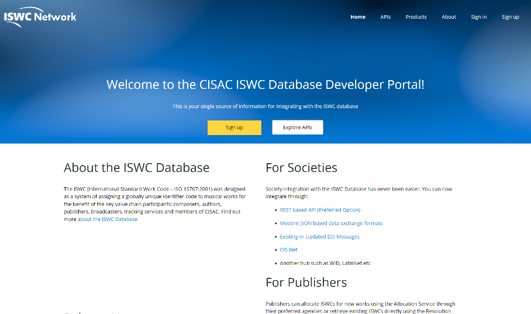

1. “Sign up” to gain access to the API in the test environment

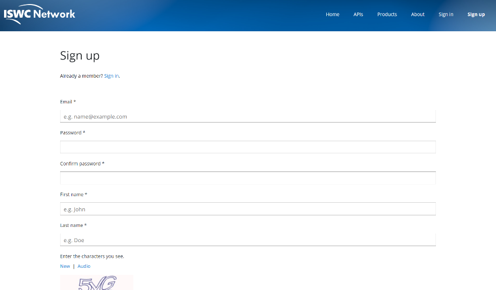

Once you complete the “sign up” form you should receive an activation email from [apimgmt\-noreply@mail\.windowsazure\.com](mailto:apimgmt-noreply@mail.windowsazure.com) within five minutes or so\.  Click on the link on this email to activate your account and sign in\. 

Note: If you need to register multiple users then repeat these steps \(1\-6\) for each user\. 

1. Navigate to the “Products” page and select the “ISWC Agency API”

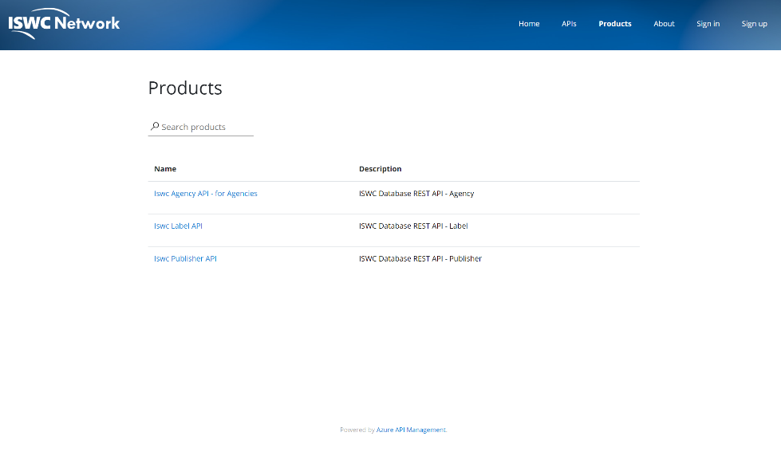

1. Enter a subscription name and press “Subscribe”

Your subscription name should include your society name\.  E\.G\. “BMI ISWC Subscription”

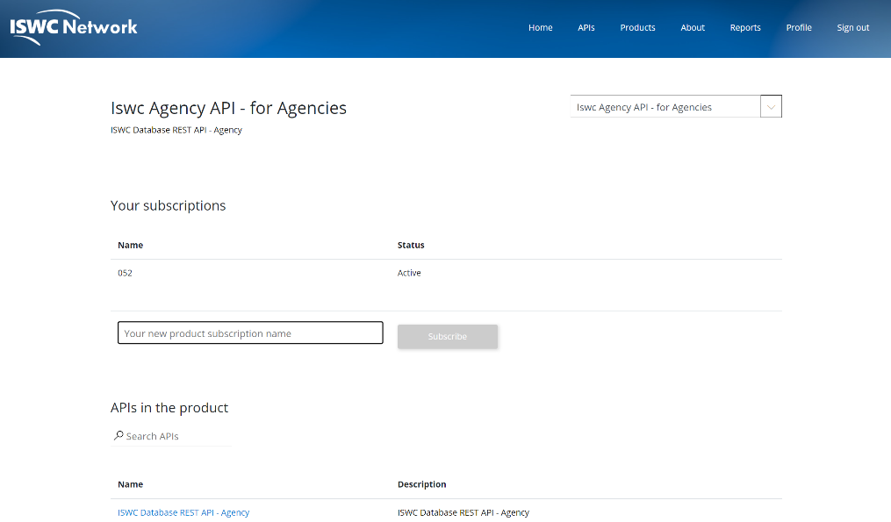

1. Your subscription details, will be shown 

At this point you should receive another email from [apimgmt\-noreply@mail\.windowsazure\.com](mailto:apimgmt-noreply@mail.windowsazure.com) indicating that your subscription request requires approval\.  You should allow up to two working days for your subscription to be approved\. As part of the CISAC approval process, the primary CISAC contact within your Agency/Society will be informed of the request\.   

1. Try out the API

Once you receive an email from [apimgmt\-noreply@mail\.windowsazure\.com](mailto:apimgmt-noreply@mail.windowsazure.com) indicating that your subscription has been approved you can log into the developer portal and test out the API directly\.   The following walks through a simple submission scenario:

- 
	1. Navigate to the API and click on the “ISWC Database Agency REST API”

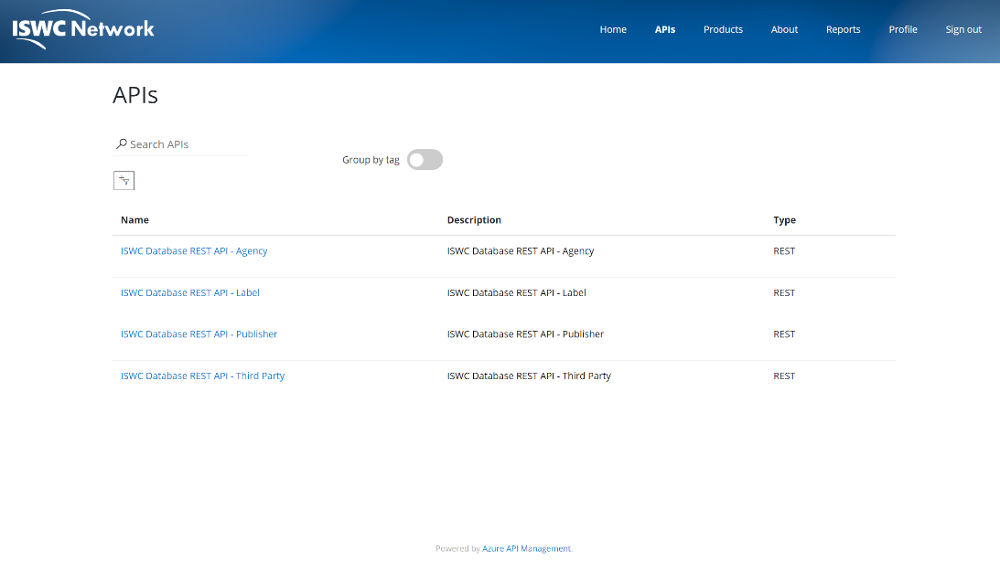

- 
	1. Group the API operations by Tag to focus on the relevant ones 

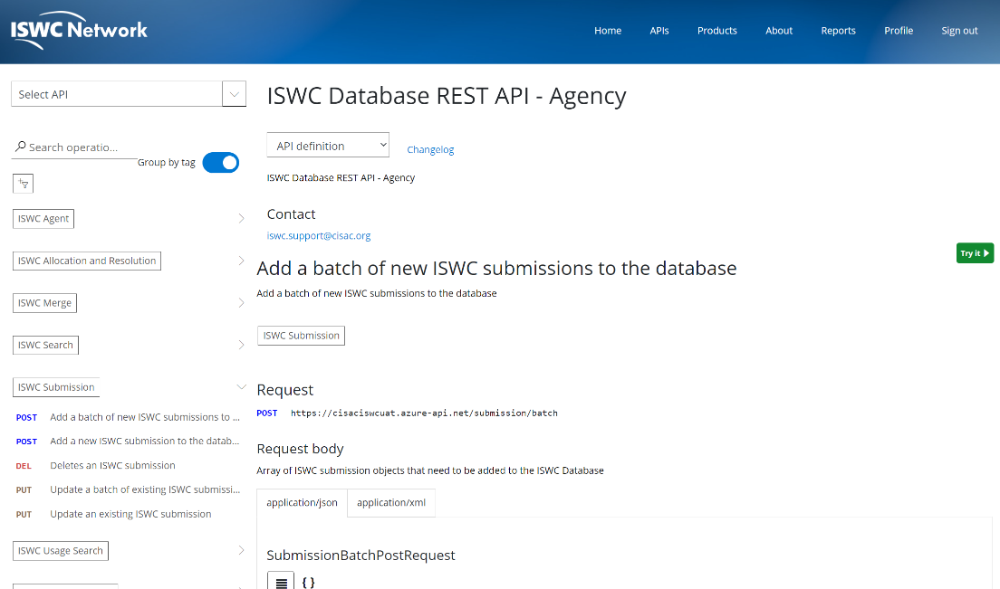

6\.3 Select the “Add a new ISWC submission to the database” operation

Review the expected request and response information\.  Download the API definition \(by selecting the API definition drop down and selecting your format of choice\) if required\.  Then select the “Try it” option to create your first ISWC database submission:

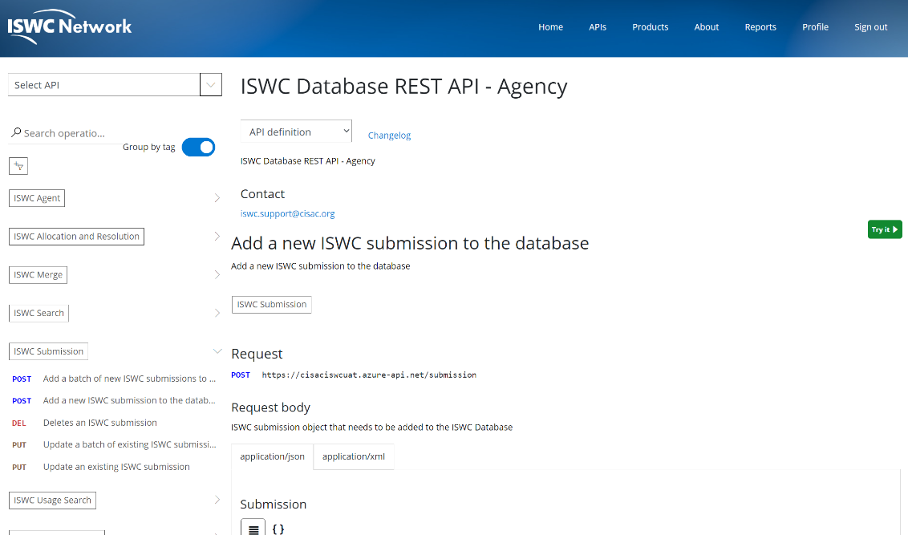

- 
	1. Post a simple work submission JSON into the Body

Note: The following is provided as an example\.   You should replace the agency, sourcedb, workcode, originalTitle and interestedParties/nameNumber values to reflect your Agency/Society\.

\{  

  "agency": "128",

  "sourcedb": 128,  

  "workcode": "R31000011",  

  "category": "DOM",  

  "originalTitle": "John C Whole other test work",

  "interestedParties":  \[

    \{    

      "nameNumber": 458930030,

      "role": "C"  

    \}, 

    \{    

      "nameNumber": 734812541,    

      "role": "C"  

    \}

  \]

\}

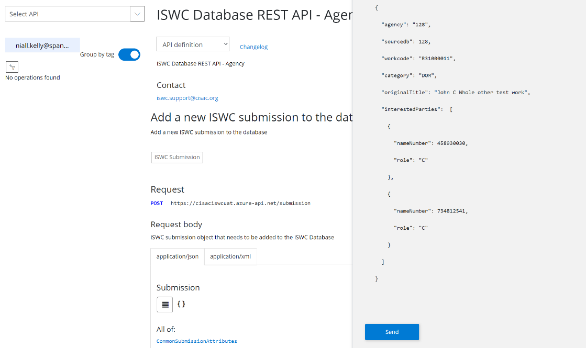  

- 
	1. Press “Send” and scroll down to review the results

Congratulations\!  You have just made your first ISWC Database submission \(in the UAT environment\)\. 

## Recommendations and Best Practice

This section provides some guidelines and best practices for working with the API\.

### Getting the latest API Definitions

The up\-to\-date documentation on the latest version of the API can be downloaded directly from the developer portal:

- Select the APIs menu option and choose the “ISWC Database Agency REST API”
- Select the API definition format that works best for you\.  The corresponding definition file will be downloaded automatically in your browser:

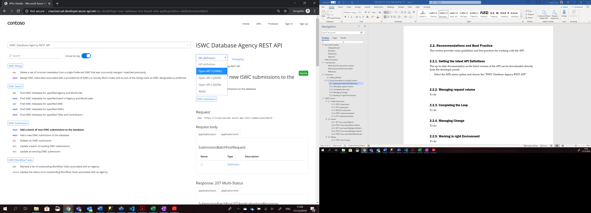

### Managing Request Volume 

In order to protect the service, rate limiting has been implemented\. This limits the number of requests per minute to 10 and the number of calls per month to 1,000,000\.  Societies should design their integration solution to handle these limits\.  One way to do this is to ensure to use the batch version of each operation where possible\.   

### Completing the Loop 

The following diagram shows a typical society integration scenario:

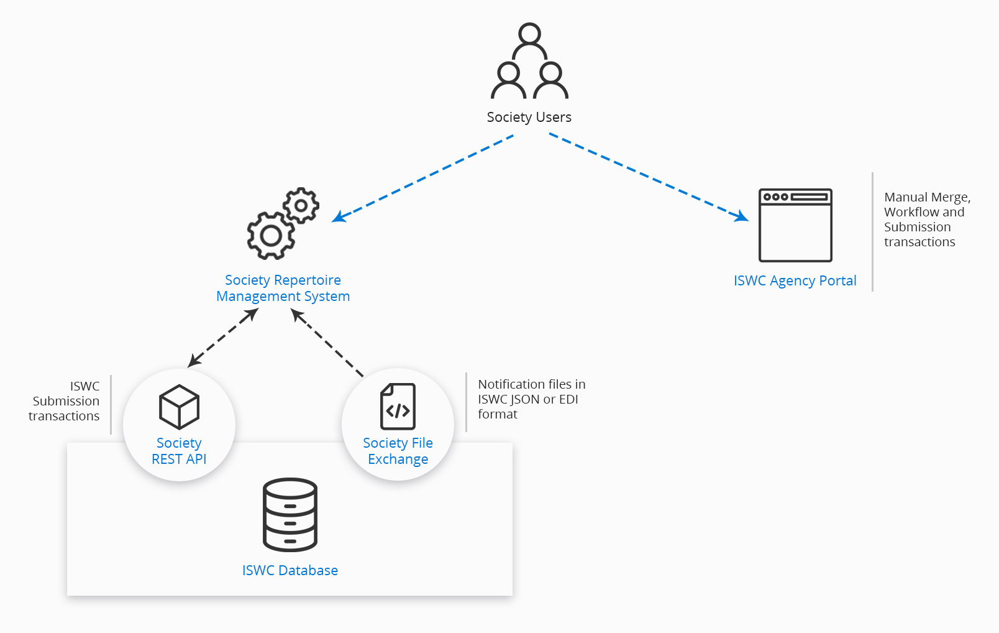

Using the ISWC Database REST API for submission transactions \(add/update/delete\) is an important part of integrating with the ISWC database\.  However, it is not the complete picture\.  

Other societies can make changes to ISWCs and associated metadata for works in your repertoire management system\.   These changes are made available in Notification files from the ISWC Database\. 

__Notification files  should be ingested to ensure your repertoire management system is in\-synch with the ISWC Database__\.   

Notifications are available in two supported file formats: ISWC JSON Format and ISWC EDI Format\.

You can use the new ISWC Agency Portal to carry out less frequent transactions such as merges, de\-merges or ad\-hoc time critical submissions and queries\. 

### Managing Change 

The REST API is subject to change, especially during the early adoption period from Jan 2020 through to May 2020\.  We expect changes to be minor and made in response to Society / Agency feedback\.   

Please review the API change history facility in the developer portal to keep informed of any changes: 

### Environments

Closer to launch, in July 2020, the production developer portal will be launched\.   A separate, but similar, subscription process with separate API keys will be used for access to the production environment\.    

Data in the test environment is subject to occasional refresh from the current live CSI database\.   

1. REST service

This chapter provides the details of the new REST service for ISWC\. The service provides the following main groups of operations: Work Submission, ISWC Search, ISWC Merge and ISWC Workflow Tasks\.

Note: Up\-to\-date details of the fields required and returned for each operation including descriptions etc can be downloaded from the developer portal \(see section 2\.2\.1 “Getting the latest API Definitions” above\) and can be tried out directly in the portal itself \(see section 2\.1 “Getting Started” above\)\.   The following is intended as an overview of the information exchanged\. 

## Work Submission

The following are the submission methods that will be supported by the new REST service\.

### POST /submission

This operation represents the addition of a new ISWC submission to the database\. It is the equivalent of the CAR transaction in EDI\.  

The POST operation should include a request body that corresponds to the Submission object schema 

__Submission\{__

__iswc__

__string*  
pattern: T\[0\-9\]\{10\}*__

__agency\*__

__string*  
minLength: 3  
maxLength: 3*__

__A CISAC code of a submitting agency that allocated this ISWC__

__originalTitle\*__

__string__

__Original title of a musical composition__

__otherTitles__

__\[\.\.\.\]__

__interestedParties\*__

__\[\.\.\.\]__

__sourcedb\*__

__integer\($int32\)__

__workcode\*__

__string__

__category\*__

__stringEnum:  
Array \[ 2 \]__

__disambiguation__

__boolean__

__disambiguationReason__

__DisambiguationReasonstring__

__Disambiguation Reason Code__

__Enum:  
Array \[ 6 \]__

__disambiguateFrom__

__\[\.\.\.\]__

__bvltr__

__BVLTRstring__

__Background, Logo, Theme, Visual or Rolled Up Cue__

__Enum:  
Array \[ 5 \]__

__derivedWorkType__

__DerivedWorkTypestring__

__Derived Work Type\- if not provided then this isn't a derived work__

__Enum:  
Array \[ 3 \]__

__derivedFromIswcs__

__\[\.\.\.\]__

__performers__

__\[\.\.\.\]__

__instrumentation__

__\[\.\.\.\]__

__cisnetCreatedDate__

__string\($date\-time\)__

__Date and time when this metadata was created on CISNET__

__cisnetLastModifiedDate__

__string\($date\-time\)__

__Date and time when this metadata last modified on CISNET__

__preferredIswc__

__string*  
pattern: T\[0\-9\]\{10\}*__

__The preferred ISWC__

__\}__

If successful, response code 201, the operation will return the following response body: 

__SubmissionResponse\{__

__verifiedSubmission__

__VerifiedSubmission\{__

__iswc\*__

__string*  
pattern: T\[0\-9\]\{10\}*__

__A preferred ISWC assigned by the system__

__agency\*__

__string*  
minLength: 3  
maxLength: 3*__

__A CISAC code of a submitting agency that allocated this ISWC__

__originalTitle\*__

__string__

__Original title of a musical composition__

__otherTitles__

__\[\.\.\.\]__

__interestedParties\*__

__\[\.\.\.\]__

__sourcedb\*__

__integer\($int32\)__

__workcode\*__

__string__

__category\*__

__stringEnum:  
Array \[ 2 \]__

__disambiguation__

__boolean__

__disambiguationReason__

__DisambiguationReasonstring__

__Disambiguation Reason Code__

__Enum:  
Array \[ 6 \]__

__disambiguateFrom__

__\[\.\.\.\]__

__bvltr__

__BVLTRstring__

__Background, Logo, Theme, Visual or Rolled Up Cue__

__Enum:  
Array \[ 5 \]__

__derivedWorkType__

__DerivedWorkTypestring__

__Derived Work Type\- if not provided then this isn't a derived work__

__Enum:  
Array \[ 3 \]__

__derivedFromIswcs__

__\[\.\.\.\]__

__performers__

__\[\.\.\.\]__

__instrumentation__

__\[\.\.\.\]__

__cisnetCreatedDate__

__string\($date\-time\)__

__Date and time when this metadata was created on CISNET__

__cisnetLastModifiedDate__

__string\($date\-time\)__

__Date and time when this metadata last modified on CISNET__

__createdDate__

__string\($date\-time\)__

__Data and time of creation in the system__

__lastModifiedDate__

__string\($date\-time\)__

__Data and time of the latest update in the system__

__lastModifiedBy__

__string__

__Identifier of the last update in the system__

__id\*__

__integer\($int64\)__

__An unique identifier assigned by the system__

__iswcEligible__

__boolean__

__Indicator of a submitter being Iswc Eligible__

__deleted\*__

__boolean__

__Indicator of a submission being logically deleted __

__linkedFrom__

__string*  
pattern: T\[0\-9\]\{10\}*__

__The ISWC record that this is linked from__

__linkedTo__

__string*  
pattern: T\[0\-9\]\{10\}*__

__The ISWC record that this is linked to__

__rejection__

__Rejection\{\.\.\.\}__

__\}__

__linkedIswcs__

__\[\.\.\.\]__

__potentialMatches__

__\[\.\.\.\]__

__\}__

### PUT /submission

This operation represents an update of an existing ISWC submission to the database\.  Equivalent of the CUR transaction in EDI\.  The PUT request will include the same required body as the POST above and will return the same response body object\.

### DELETE /submission

This operation represents a delete of an existing ISWC submission in the database\. Equivalent of the CDR transaction in EDI\. The DELETE operation accepts the following specific parameters:

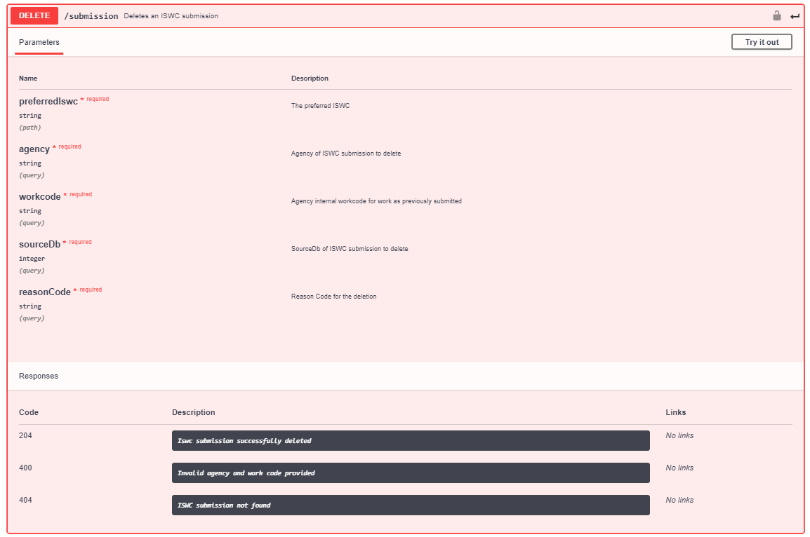

### POST /submission/batch

This operation represents the addition of a batch of new ISWC submissions to the database\. It is the equivalent of the CAR transaction in EDI\. The POST operation will include a request body containing an array of SubmissionBatch objects as follows:

__SubmissionBatch\{__

__submissionId__

__number__

__A unique submission identifier for this request\. The same identifier will be populated for the submission in the response\.__

__submission__

__Submission\{\.\.\.\}__

__\}__

The POST operation will return a Multi\-Status response containing an array of responses with the following schema:

__\[VerifiedSubmissionBatch\{__

__submissionId__

__integer\($int32\)__

__The value of the submissionID from the request submission\.__

__submission__

__SubmissionResponse\{__

__verifiedSubmission__

__VerifiedSubmission\{\.\.\.\}__

__linkedIswcs__

__\[\.\.\.\]__

__potentialMatches__

__\[\.\.\.\]__

__\}__

__rejection__

__Rejection\{__

__code\*__

__string__

__message\*__

__string__

__\}__

__\}\]__

### PUT /submission/batch

This operation represents the update of a batch of existing ISWC submissions in the database\. It is the equivalent of the CUR transaction in EDI\. The PUT request will include the same required body as the batch POST above and will return the same response body object\. 

## ­Search

The following are the search methods that will be supported by the new REST service\.

### GET /iswc/searchByIswc

This operation represents searching the ISWC database for ISWC metadata by ISWC\. 

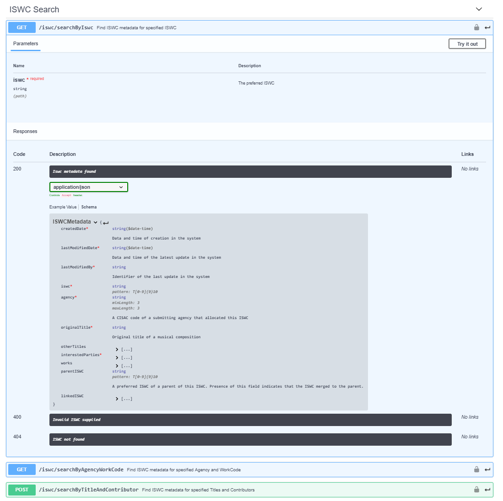

This operation returns its results as an array of ISWCMetadata type objects: 

__ISWCMetadata\{__

__createdDate\*__

__string\($date\-time\)__

__Data and time of creation in the system__

__lastModifiedDate\*__

__string\($date\-time\)__

__Data and time of the latest update in the system__

__lastModifiedBy\*__

__string__

__Identifier of the last update in the system__

__iswc\*__

__string*  
pattern: T\[0\-9\]\{10\}*__

__agency\*__

__string*  
minLength: 3  
maxLength: 3*__

__A CISAC code of a submitting agency that allocated this ISWC__

__originalTitle\*__

__string__

__Original title of a musical composition__

__otherTitles__

__\[\.\.\.\]__

__interestedParties\*__

__\[\.\.\.\]__

__works__

__\[__

__  
\[VerifiedSubmission\{\.\.\.\}\]__

__\]__

__parentISWC__

__string*  
pattern: T\[0\-9\]\{10\}*__

__A preferred ISWC of a parent of this ISWC\. Presence of this field indicates that the ISWC merged to the parent\.__

__linkedISWC__

__\[__

__All linked preferred ISWCs\. Presence of this field indicates that those ISWCs merged to this ISWC\.__

__string*  
pattern: T\[0\-9\]\{10\}*\]__

__\}__

### POST /iswc/searchByIswc/batch

This operation represents searching the ISWC database for ISWC metadata by a batch of ISWC values\.

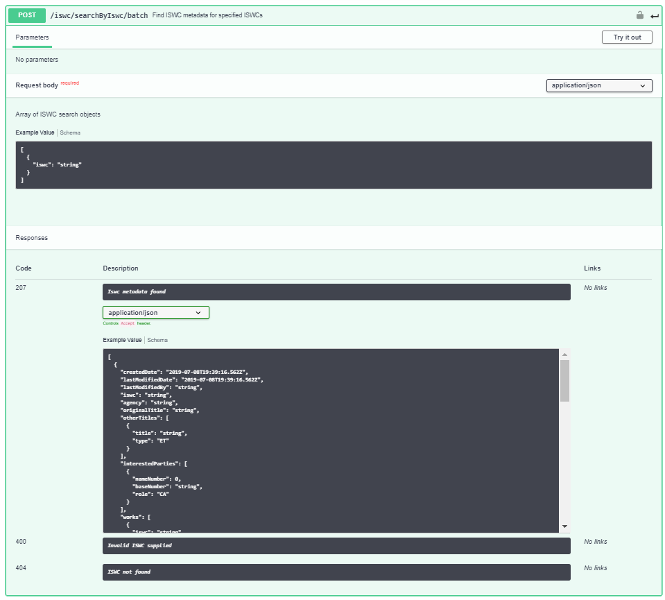

This operation returns its results as an array of ISWCMetadata type objects as per the previous search operation\. 

### GET /iswc/searchByAgencyWorkCode

This operation represents searching the ISWC database for ISWC metadata by Agency Work Code\. 

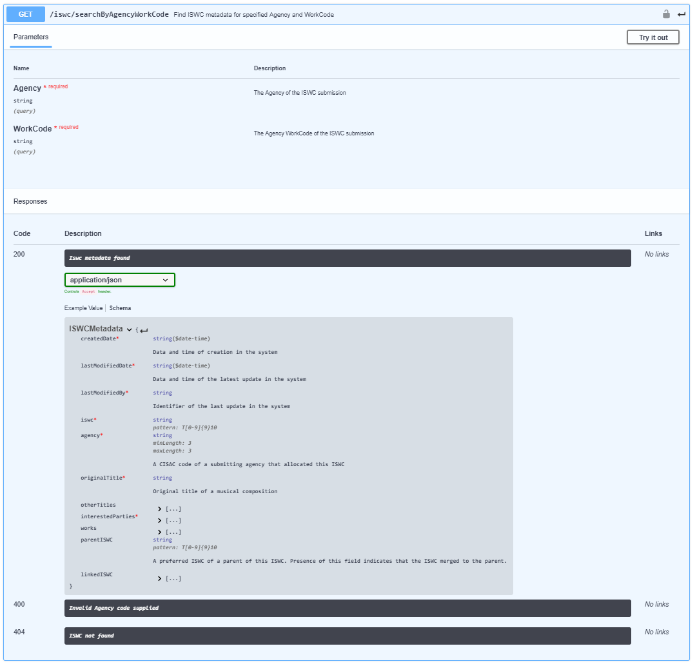 

This operation returns its results as an array of ISWCMetadata type objects as per the previous search operation\. 

### POST /iswc/searchByAgencyWorkCode/batch

This operation represents searching the ISWC database for ISWC metadata by a batch of Agency Work Codes\.

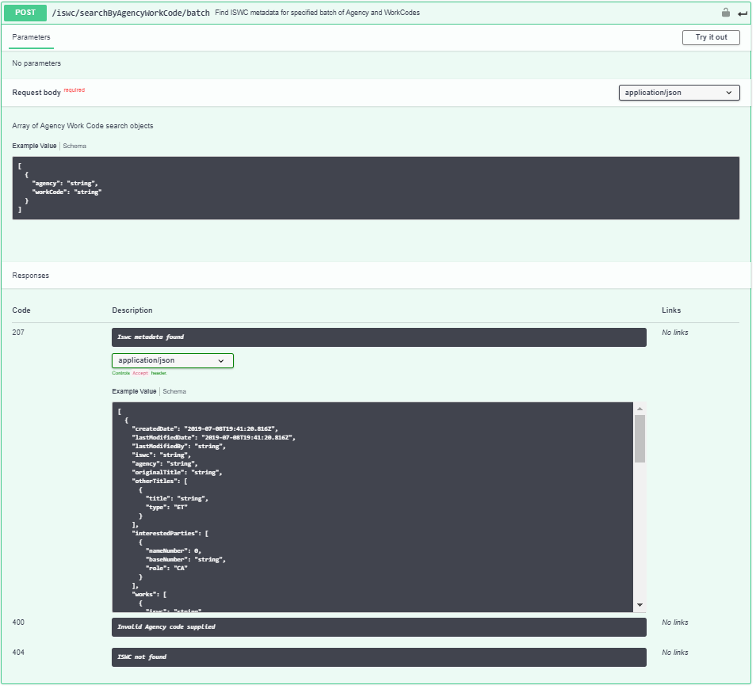 

This operation returns its results as an array of ISWCMetadata type objects as per the previous search operation\.

### POST /iswc/searchByTitleAndContributor

This operation represents searching the ISWC database for ISWC metadata by a combination of Titles and Contributors\. 

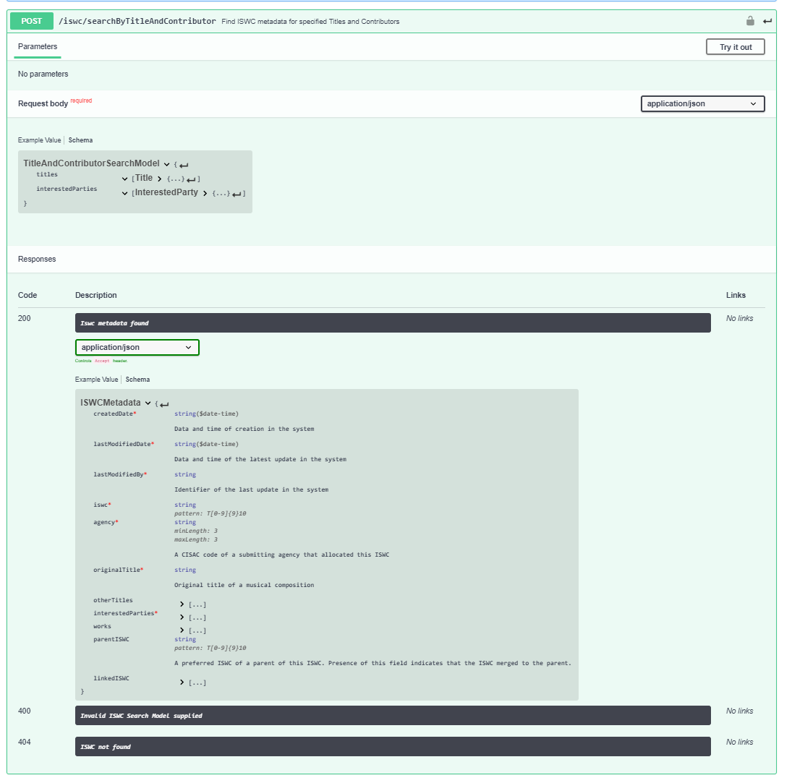

This operation returns its results as an array of ISWCMetadata type objects as per the previous search operation\. 

## Merge

The following are the merging methods that will be supported by the new REST service\.

### POST /iswc/merge

This is a new operation and represents merging ISWC metadata associated with a provided list of ISWCs or Agency work codes and as part of the merge have an ISWC designated as preferred\. It is the equivalent of the MER transaction in EDI\.

The preferredISWC passed as a parameter into the operation represents the preferredISWC that additional preferred ISWCs will be merged into\.  The request body contains an array of iswcs or agency work codes\.  Each preferred iswc pointed to by each array entry will be merged into the designated preferredISWC\. 

### DELETE /iswc/merge

This is a new operation and represents deleting a set of incorrect metadata from a single Preferred ISWC that was incorrectly merged/matched previously\. There is no equivalent transaction in EDI\.

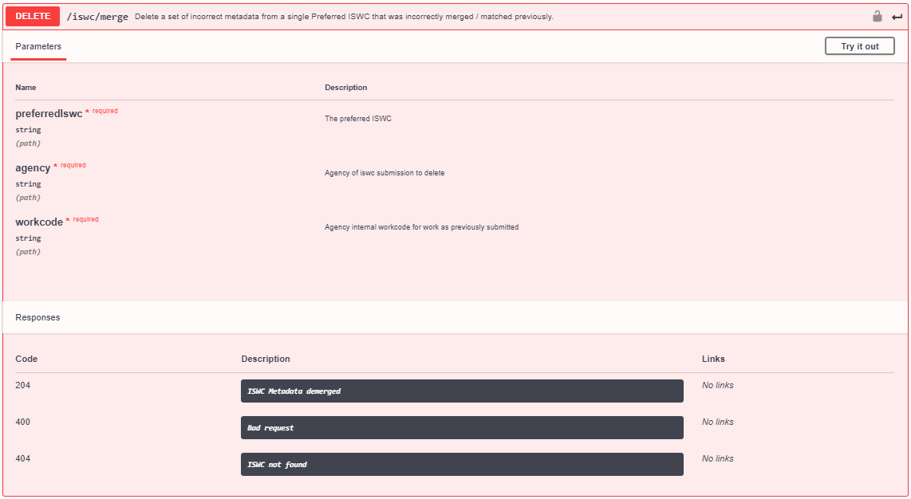

## \\Workflow Tasks

The following are the workflow tasks related methods that will be supported by the new REST service\.

### GET /iswc/workflowTasks 

This operation retrieves all outstanding workflow tasks for an Agency\.  Each task has an associated array of ISWCMetadata objects returned\.  

### PATCH /iswc/workflowTasks 

This operation enables an Agency to update the status of a set of outstanding workflow tasks: 

Updating a workflow task status to Completed or Cancelled will complete the workflow task and it can no longer be updated\. A daily scheduled task will run that will set the status of workflow tasks to Complete that are Pending for over a configurable number of days \(default to 30 days\)\.

Updating a workflow task status to Rejected will roll the affected entity back to its previous state, depending on the Workflow Type:

- UpdateApproval
- MergeApproval – The WorkflowTask and MergeRequest record will be set to Complete and the linked child ISWCLinkedTo record will be set to Deleted\.
- DemergeApproval – The WorkflowTask and MergeRequest record will be set to Complete and the linked child ISWCLinkedTo record will be set to Active\.

1. Conventions and Samples 

This chapter provides additional information on key conventions that need to be taken into account when calling the API

## Optional fields

Fields that are mandatory, marked with “__\*__” in the previous chapter, must be provided\. All other fields are optional\. 

Where fields are designated as optional the convention is to omit the tag completely rather than include the tag with no value present\.   E\.G\. The following is a valid POST /submission where the metadata is for a non\-derived work:

\{  

  "agency": "128",

  "sourcedb": 128,  

  "workcode": "R31000011",  

  "category": "DOM",  

  "cisnetCreatedDate": "2019\-11\-05T00:31:20\+00:00",

  "cisnetLastModifiedDate": "2019\-11\-05T00:31:20\+00:00",

  "originalTitle": "John C Whole other test work",

  "interestedParties":  \[

    \{    

      "nameNumber": 458930030,

      "role": "C"  

    \}, 

    \{    

      "nameNumber": 734812541,    

      "role": "C"  

    \}

  \]

\}

Whereas the following is an invalid submission where the work submitted is identified as being a derived work but with an invalid \(“”\) derivedWorkType\. 

\{  

  "agency": "128",

  "sourcedb": 128,  

  "workcode": "R0008442",  

  "category": "DOM",  

  "cisnetCreatedDate": "2019\-11\-05T00:31:20\+00:00",

  "cisnetLastModifiedDate": "2019\-11\-05T00:31:20\+00:00",

  "derivedWorkType": "",

  "originalTitle": "SLATTERY ISLAND",

  "interestedParties":  \[

    \{    

      "nameNumber": 00265255755,

      "role": "CA"  

    \}, 

    \{    

      "nameNumber": 00473321567,    

      "role": "C"  

    \}

  \]

\},

This will return a response status of 400 \(Bad Request\) with the details similar to the following:

Request\-Context: appId=cid\-v1:7a7c5b27\-8670\-4812\-bbff\-c7c4ce4809e4

Date: Fri, 31 Jan 2020 08:42:21 GMT

Set\-Cookie: ARRAffinity=56f22c389621b6a0f6709475c26954cdace8ccbe3106a1065cc528517175114f;Path=/;HttpOnly;Domain=cisaciswcapiuat\.azurewebsites\.net

X\-Powered\-By: ASP\.NET

Content\-Length: 330

Content\-Type: application/problem\+json; charset=utf\-8

\{

  "errors": \{

    "derivedWorkType": \["Required property 'derivedWorkType' expects a non\-null value\. Path '', line 21, position 1\."\]

  \},

  "type": "https://tools\.ietf\.org/html/rfc7231\#section\-6\.5\.1",

  "title": "One or more validation errors occurred\.",

  "status": 400,

  "traceId": "|81874a2e8ab14cb18c9fa59102d1d47e\.a495b646b3ac4c7c\_51f285bd\.a5f7311a\_"

\}

## Date / Time fields 

These fields have a designated format of “__$date\-time__“ which corresponds to a date/time in ISO 8601 format\.   

"cisnetCreatedDate": "2019\-11\-05T08:31:20\+00:00",

The above example represents 5th Nov 2019 at 8:30 and 20 seconds AM in the UTC time zone\.

 

## Agency, Source DB and API Security

Most API calls described in chapter three above require the provision of one or more of the following key identifying fields:

- agency

This refers to the submitter’s society number represented as a three\-character string including leading zeros if required\.  The list of CISAC society codes is available from CISACs website \(search for “CISAC Society Codes”\)

E\.G\. “021” represents BMI, “058” represents SACEM etc\.

- sourcedb

This refers to the hub that the society submission is been made through represented as an integer with a max of three digits\.   For societies integrating directly with the API then this should correspond to the numeric version of the agency field above\.    Hubs integrating with API on behalf of societies would use the society code of their hub as the value for this field\. 

E\.G\. BMI would use a sourcedb value of 21, SACEM would use a value of 58, the WID making a submission as a hub on behalf of one or more societies would use a value of 300 for the sourcedb\.

In the UAT environment societies are free to test different scenarios for workflows and notifications by supplying values for agency and sourcedb that represent other societies\.  However, in production, rules will be configured in the API gateway to tie down each API key granted to a specific set of sourcedb and agency values\.   

1. Understanding Common Error Codes

This chapter provides additional information on interpreting and dealing with error codes returned by the API\.

## Error Codes cross referenced with Business Rules 

The following table provides the most common error codes and descriptions cross referenced with the underlying business rule\(s\) responsible for triggering them\.   A summary of the business rules is included in separate sections of this chapter below\.   The business rules are categorized as Initial Validation \(IV\), Post Matching Validation \(PV\), Eligibility to Assign ISWCs \(EL\), Metadata Standardization \(MD\) and Matching \(MAT\)\.

Error Code

Message

Rules

100

Generic Error

102

I\.P\. Name Number is required

IV/19

103

Source Society Code is invalid

IV/10, PV/25

104

At least one I\.P\. is required on a submission

IV/02

105

ISWC System Unable to process record, please resubmit  

IV/01

106

I\.P\. Role Code is required

IV/22

107

Preferred ISWC is required

IV/13

108

The IP on the work submission is not a creator affiliated with the source society

IV/24

109

Work Titles are required

IV/05

110

Only one Original Title allowed

IV/06

111

At least one creator I\.P\. is required

IV/07

112

Work Title Type is required

IV/31

113

ISWC format error \[T\]\[0\-9\]\{10\}

IV/14

114

An existing ISWC logical work that already contains active \(not deleted\) submission from the submitting society

PV/06

115

Specified source db is not allowed to make a submission for the specified society

IV/08

116

Modification of an Archived ISWC is not permitted

PV/23, PV/26

117

Requested ISWC preferred does not exist on ISWC System

PV/22, PV/24, PV/25

118

At least one Derived From DF record is required for a Derived Work of type "Modified Version"

IV/34

119

The ISWC provided in the Derived From DF record is not a valid Preferred ISWC in the ISWC Database

IV/34, IV/36, IV/38

120

Each Derived From DF record must contain either an ISWC or a Title

IV/34,IV/36, IV/38

121

At least one Derived From DF record is required for a Derived Work of type "Composite"

IV/36

122

Invalid Disambiguation ISWC

IV/40

123

Invalid disambiguation reason code

IV/40

124

One or more Disambiguation ISWCs must be provided

IV/40

125

BLTVR must be blank or be one of the following values: Background, Logo, Theme, Visual, RolledUpCue

IV/40

126

Performer information must contain a Second Name or a Second Name and a First Name

IV/40

127

Submitted titles don’t match current ISWC Documentation

PV/04

128

One or more specified Disambiguation ISWCs are not Preferred ISWCs in the ISWC Database

PV/30

129

Invalid Disambiguation ISWC

IV/40

130

The Agency Work Number provided does not exist in the ISWC Database 

PV/01

131

Submission is Deleted in the ISWC Database

PV/05

132

The Preferred ISWCs specified in the merge do not exist in the ISWC database

PV/09

133

Delete reason has not been provided

PV/13

134

I\.P\. Name Number is invalid, must be numeric

IV/20

135

Work Title Type is invalid

IV/31

136

Society Work Code is required

IV/11

137

IP Name Number must be status 1 or 2 and exist in the IPI database

MD/16 

138

Source Society Database Code is invalid

IV/12, PV/25

139

I\.P\. Role Code is invalid

IV/22

140

The submitted transaction is not ISWC eligible and no matching Preferred ISWC has been found through the matching rules as per MAT/04

PV/29

141

ISWC format error – Invalid Check Digit

IV/15

142

No specific error number \- the whole file is rejected

IV/09

143

Requested ISWC metadata does not exist for specified Society Work Code, Society Code and Society Database Code

PV/25

144

The submitting agency may not update Preferred ISWC level metadata

PV/20

145

The submitting agency may only remove IPs that they control

PV/21

146

Instrumentation Code is invalid

IV/40

147

At least one Derived From DF record is required for a Derived Work of type "Excerpt"

IV/38

148

I\.P\. is not accepted

IV/29

149

Agency is not Eligible for a Source ISWC

EL/03

150

Submitter is not ISWC Eligible for all works to be merged

PV/10

151

Agency provided does not exist in the database

PV/11

152

Workflow Task with the properties provided does not exist

PV/11

153

The Preferred ISWC specified in the demerge does not exist in the ISWC database

PV/09

154

None of the provided Creators are affiliated with a Society

EL/02

155

Concurrency Error: The Submission being updated has already changed\. Please try again\.

156

An ISWC can not be merged because it would result in a self\-referential link\.

PV/31

157

An ISWC can not be merged because it already has a parent ISWC\.

PV/31

158

Work code must not exceed 20 characters

IV/45

159

Work code does not exist for submitted ISWC

IV/46

160

The submitted transaction is not ISWC eligible and multiple matches have been found through the matching rules as per MAT/04

PV/29

161

Publisher is not a member of submitting agency

EL/04

162

Performer Firstname and Lastname values must not exceed 50 characters

IV/47

163

No matching Preferred ISWC has been found

PV/29

164

Multiple matching ISWCs have been found

PV/29

165

Submitting publisher is not set up to make Allocation or Resolution requests

IV\_48

166

Resolution transactions \(FSQ\) are administered via CISAC only

IV/49

201

DerivedFrom ISWCs do not match exactly one matching preferred ISWC

202

Merge ISWCs do not match exactly one matching preferred ISWC

203

Merge Agency Work Numbers do not match exactly one matching Agency Work Number

247

Submitted IPs do not match current ISWC Documentation

PV/04

## Business Rules

The following sections describes an extract of the detailed business rules that are referenced in the above messages and that are implemented by ISWC Database\.  In most scenarios it isn’t necessary for Agency developers to be fully familiar with the internal rules being applied by the service\.   However, the information is provided here to help provide additional background information when troubleshooting specific errors being returned by the API\.    

The “Transactions” column indicates which transaction type\(s\) the rule relates to\.  The following mapping can be used to cross reference these with the REST API operations:

__Transaction__

__API Operation__

CAR

POST /submission

POST /submission/batch

CUR

PUT /submission

PUT /submission/batch

CDR

DELETE /submission

MER

POST /iswc/merge

COR

GET /iswc/workflowTasks

COA

PATCH /iswc/workflowTasks

CIQ

GET /iswc/findBySocietyAndWorkCode

POST /iswc/findBySocietyAndWorkCode/batch

CMQ

GET /iswc/searchByIswc

POST /iswc/searchByIswc/batch

The “Rule Configuration & Implementation” column provides additional details about how the rule is implemented in service\.  It references configuration options available to CISAC ISWC administration personnel that can be used to alter the rule behavior along with the initial default configuration \(current setting\)\.  In most instances this detail is not relevant to a submitting agency, but it is provided for completeness\. 

### Initial Validation \(IV\) Rules

Initial Validation \(IV\) rules covers all the validation that is done initially \(without retrieving additional data from the ISWC database\)\.

__Ref__

__Transactions__

__Rule__

__Rule Configuration & Implementation__

IV/01

CAR, CUR, CDR, CMQ, CIQ, MER, COR, COA

Only one CAR/CUR/CDR/CMQ/CIQ record is allowed per transaction\.

If this check fails then the transaction will be rejected\.  
  
Error Conditions:  
\- 105 \(CSI Unable to process record, please resubmit\)

This rule applies only to the EDI file formats and will be implemented in that specification \(WBS 1\.7\)\.  

IV/02

CAR, CUR, CIQ

For Add/Update/ ISWC Query transactions \(CAR, CUR, CIQ\) at least one CIP record must be included in each transaction\.

If this check fails, then the transaction will be rejected\.    
  
Error Conditions:  
\- 104 \(At least one I\.P\. is required on a submission\)

__Configuration:__

__Parameter Name:__ MustHaveOneIP

__Possible Parameter Values:__ true, false

__Description:__ Validate the submission to ensure that at least one IP is provided\. 

__Input Data:__

submission/interestedParties array

IV/05

CAR, CUR, CIQ

For Add/Update/ ISWC Query transactions \(CAR, CUR, CIQ\) at least one Original Title must be included in each transaction\. 

The transaction will be rejected if it's contained work submission doesn’t have an original title\.    
  
Error Conditions:  
\- 109 \(Work Title\(s\) are required\)

This rule applies only to the EDI file formats and will be implemented in that specification \(WBS 1\.7\)\.  I\.E\. In the REST format above it is mandatory so therefore must be provided in order to make a successful POST request\.

IV/06

CAR, CUR, CDR

If work submission contains more than one original title, transaction is rejected\. \(TR\)

The transaction will be rejected if it's contained work submission has more than one original title\.    
  
Error Conditions:  
\- 110 \(Only one Original Title allowed\)

__Configuration:__

__Parameter Name:__ OnlyOneOriginalTitle

__Possible Parameter Values:__ true, false

__Description:__ Validate the submission to ensure that only one original title is provided\. 

__Input Data:__

submission/originalTitle

submission/otherTitles array

__Additional Information:__

As the originalTitle field is mandatory for the Submission object this validation should ensure that there are no “OT” type titles listed in the otherTitles array\.  

 

IV/07

CUR, CDR, CAR

If work submission does not contain IP with creator role \(role: C, CA, A, AR, AD, TR, SA, SR\) then the transaction is rejected\. \(TR\)

Error conditions:  
\- 111 \(At least one creator I\.P\. is required\)

__Configuration:__

__Parameter Name:__ MinOfOneCreatorRole

__Possible Parameter Values:__ blank or list of comma separated list of roles\.  Will be initially set up with list “C, CA, A, AR, AD, TR, SA, SR”

 

__Description:__ Validate the submission to ensure that it contains at least one IP with one of the roles listed in the configuration value\.  List of roles to be provided separated by commas\.  E\.G\.  “C, CA, A, AR, AD, TR, SA, SR”\.  Blank value means that validation rule is not applied\. 

__Input Data:__

Submission/interestedParties\[\]/role

IV/08

All

If the request is from a society not on the maintained list of validated submitting societies in the ISWC Database, then the transaction is rejected\. 

Currently the list of societies that are allowed to submit are retrieved from the existing csi\_configuration table \(select distinct society\_code from csi\_configuration\)  
  
Error conditions:   
\- 115 \(Specified source db is not allowed to make a submission for the specified society\)

__Configuration:__

__Parameter Name:__ ValidateSubmittingAgency

__Possible Parameter Values:__ true or false

 

__Description:__ Validate the submitting agency and source database against the list of configured allowed combinations held in the SubmissionSource table in the Lookup schema of the new ISWC Database\. 

__Input Data:__

Submission/agency

Submission/sourcedb

__Additional Information:__

Validate the submitting agency and source database against a list of configured allowed combinations that will be held in a new table \(SubmissionSource\) in the Lookup schema of the new ISWC Database\.

IV/09

All

The Record Type must be entered and must match a valid request type\. It must be one of the transaction types supported by the ISWC Database\. These are CAR, CUR, CDR, CMQ and CIQ\. Will also include MER, COR and COA

This applies to EDI based transactions only\.    
  
Error Conditions:  
\- No specific error number \- the whole file is rejected

This rule applies only to the EDI file formats and will be implemented in that specification \(WBS 1\.7\)\.  

IV/10

CUR, CDR, CAR

Society Code must be entered and must match an entry in the Society Code Table\. It is a mandatory field for CAR, CUR and CDR\. \(TR\) 

If this isn't the case, then the transaction will be rejected\.  This applies to EDI and Webservice interfaces\.   
  
Error Conditions:   
\- 103 \(Source Society Code is invalid\)

__Configuration:__

__Parameter Name:__ ValidateAgencyCode

__Possible Parameter Values:__ true or false

 

__Description:__ Validate the submitting agency against the list valid agencies held in the Agency table in the ISWC Database Lookup Schema\.  true or false\. 

__Input Data:__

Submission/agency

__Additional Information:__

Validate against the Agency table\. 

IV/11

CUR, CDR, CAR

Society Work Code must be entered\. It is a mandatory field for CAR, CUR and CDR\. \(TR\) 

If this isn't the case, then the transaction will be rejected\.  This applies to EDI and Webservice interfaces\.   
  
Error Conditions:    
\- 104 \(Society Work Code is required\)

This rule applies only to the EDI file formats and will be implemented in that specification \(WBS 1\.7\)\.  I\.E\. In the REST format above it is mandatory so therefore must be provided in order to make a successful POST request\. 

IV/12

CUR, CDR, CAR

Source DB Code must be entered and must match an entry in the Society Code Table\.  It is a mandatory field for CAR, CUR and CDR\. \(TR\) 

If this isn't the case, then the transaction will be rejected\. This applies to EDI and Webservice interfaces\.   
  
Error Conditions:  
\- 105 \(Source Society Database Code is invalid\)

IV/13

CUR, CDR, CMQ

Preferred ISWC is a mandatory field for CUR, CDR and CMQ\. \(TR\)

If the preferred ISWC isn't provided, then the transaction will be rejected\.   This applies to EDI and Webservice interfaces\.  The Preferred ISWC submitted must exist in the ISWC database\.   
  
Error Conditions:  
\- 107 \(Preferred ISWC is required\)

__Configuration:__

__Parameter Name:__ PreferredISWCRequiredforUpdate

__Possible Parameter Values:__ true or false

 

__Description:__ Validate that the submission/preferredIswc field is provided for PUT \(update\) and DELETE submissions\.  True or false\. 

__Input Data:__

Submission/preferredIswc

__Additional Information:__

The preferredISWC field is mandatory in the REST definition so it won’t be possible to switch off validation of this for DELETE operations\. 

IV/14 

All

If provided, the Preferred / Archived ISWC must have length of 11 characters \(TR\), must begin with a "T" and must match the following pattern: \[T\]\[0\-9\]\{10\}

If this isn't the case then the transaction will be rejected\.  
  
Error Conditions:  
\- 110 \(ISWC format error \[T\]\[0\-9\]\{10\}\)

__Configuration:__

__Parameter Name:__ ValidateISWCFormat

__Possible Parameter Values:__ N/A

 

__Description:__ Validate that the submission/preferredIswc field, if provided, conforms to the validation pattern \[T\]\[0\-9\]\{10\}

__Input Data:__

Submission/preferredIswc

Submission/iswc

__Additional Information:__

The format validation is included in the REST definition for the field, so it won’t be possible to switch on/off this validation\.  The error condition/messages have been simplified from the original agreed business rules\.  

IV/15

All

If provided, the Preferred / Archived ISWC must match valid “check digit" as per Annex B of ISO 15707 standard document\.

If this isn't the case, then the transaction will be rejected\.    
  
  
Error Conditions:  
\- 111 \(ISWC format error – Invalid Check Digit\)

__Configuration:__

__Parameter Name:__ ValidateISWCCheckDigit

__Possible Parameter Values:__ true or false

 

__Description:__ Validate that the submission/preferredIswc field, if provided, has a valid check digit as per the ISO 15707 standard\. 

__Input Data:__

Submission/preferredIswc

Submission/iswc

__Additional Information:__

The check digit calculation is included in format validation is included in section 3\.4 of the ISO document available [here](https://teams.microsoft.com/l/file/ECD7B6C0-A0BC-45AB-9F69-BAF7A40E379F?tenantId=4197e6e7-fe92-417f-8cd8-0997d263db36&fileType=pdf&objectUrl=https%3A%2F%2Fspanishpoint1.sharepoint.com%2Fsites%2FCISACSPISWC%2FShared%20Documents%2FAs%20Is%20System%2FMVP%20To%20Be%20Rules%20Business%20Requrements%2FReference%20Docs%2FISO_15707%3B2001(E)-IS.pdf&baseUrl=https%3A%2F%2Fspanishpoint1.sharepoint.com%2Fsites%2FCISACSPISWC&serviceName=teams&threadId=19:a78725c0b9b4485b86bc40ee740311b2@thread.skype&groupId=eefca450-9bf9-49ac-b171-01fb643f2cb3)\.

IV/44

CMQ

The Preferred ISWC field is required

For CMQ transactions the preferred ISWC field is required\.  If this isn't the case the transaction will be rejected\.  No Society Code, Source DB Code or Society Work Code values should be provided\.   
  
Error conditions:  
\- 107 \(Preferred ISWC is required\)  
  
See related rule PV/22 \(Preferred ISWC must exist in the ISWC database for CUR, CDR and CMQ transactions\)

IV/19

CAR, CUR and CIQ

IP Name Number must be entered for CAR, CUR and CIQ transaction \(TR\)

If this isn't the case, then the transaction will be rejected\.  
  
Error Conditions:  
\- 102 \(I\.P\. Name Number is required\)

__Configuration:__

__Parameter Name:__ ValidateIPNameNumberExists

__Possible Parameter Values:__ N/A

 

__Description:__ Validate that each InterestedParty item included in the submission, has a nameNumber field value\. 

__Input Data:__

Submission/interestedParties\[\]\.nameNumber

__Additional Information:__

The field is marked as required in the REST definition for each interestedParty entry, so it won’t be possible to switch on/off this validation\.  

IV/20

All

If provided, then the IP Name Number must be numeric value\. \(TR\)

If this isn't the case then the transaction will be rejected\.  
  
Error Conditions:  
103 \(I\.P\. Name Number is invalid, must be numeric\)

This rule applies only to the EDI file formats and will be implemented in that specification \(WBS 1\.7\)\.  I\.E\. In the REST format above it is mandatory so therefore must be provided in order to make a successful POST request\.

__Input Data:__

Submission/interestedParties\[\]\.nameNumber

IV/22

All

Where info for an IP is provided, the IP Role must be entered, and that role must be a valid IPI role code\.

If this isn't the case then the transaction will be rejected\.  
  
Only Writer or Publisher/Admin roles are used by ISWC database for matching \(where relevant\), eligibility, assignment\. Any other IPs with roles that are valid CISAC roles will be ignored, I\.E\. Not saved in core tables, not used for matching, eligibility or assignment\.    
Writer roles: C, CA, A, AR, AD,TR,SA,SR  
Publisher/Admin roles: E, AM   
  
If a role entered does not correspond to a valid CISAC role code then the transaction will be rejected\.  I\.E\. Will only be rejected if the role code isn't one of the valid CISAC role codes\.   
Error Conditions:  
\- 106 \(I\.P\. Role Code is required\)  
\- 107 \(I\.P\. Role Code is invalid\)

This rule applies only to the EDI file formats and will be implemented in that specification \(WBS 1\.7\)\.  I\.E\. In the REST format above it is mandatory so therefore must be provided in order to make a successful POST request\.

__Input Data:__

Submission/interestedParties\[\]\.role

IV/25

CAR, CUR

CSI Processing of work submissions with Unknown Publisher, IP Name

 Number “I\-001631070\-4”\.  This IP will be ignored by all matching, eligibility and assignment functionality

__Configuration:__

__Parameter Name:__ IgnoreIPsForMatchingAndEligibility

__Possible Parameter Values:__ list of IP Base Numbers separated by “,”\.  E\.G\. I\-001631070\-4

 

__Description:__ Identify Ips that are to be ignored for calculating ISWC Eligibility and matching\. 

__Input Data:__

Submission/interestedParties\[\]\.nameNumber

__Additional Information:__

The validation pipeline will need to load all IPNameNumber values for the IPBaseNumber values configured in this parameter at startup from the IP Schema NameReference table\.   

IV/29

CAR, CUR

The following IP Base Numbers are not accepted: "I\-000056650\-5", SGAE Participaciones   
"I\-000168343\-6", JASRAC Shares   
"I\-000182275\-7", IMRO Shares   
"I\-000225476\-2", SABAM   
"I\-000477057\-2", STIM Shares   
"I\-000611847\-2", UNKNOWN Source  
"I\-000666471\-5", ASCAP Shares  
"I\-000887841\-7", BMI Shares  
"I\-001172928\-3", APRA Shares   
"I\-001317751\-8", KODA Shares   
"I\-001478936\-5", SIAE Parti  
"I\-001529601\-0", UNKNOWN    \(AV publisher account\)  
"I\-001563734\-8", SUISA Anteile   
"I\-001631070\-4", UNKNOWN Publisher \(note 2\)  
"I\-001635620\-8", UNKNOWN Composer Author \(note 2\)  
"I\-001648303\-5", SACEM Parts    
"I\-001655709\-6", MCPS Shares  
"I\-001656397\-4", PRS Shares  
"I\-001661395\-7", GEMA Anteile  
"I\-001670753\-0", SOCAN Shares   
"I\-002570678\-7"   UNKNOWN SIAE

Note: The transaction will be rejected if a submission contains one or more of these base numbers\.  
  
Error Conditions:   
\- 104 \(At least one I\.P\. is required on a submission\)

__Configuration:__

__Parameter Name:__ RejectIPs

__Possible Parameter Values:__ list of IP Base Numbers separated by “,”\.  E\.G\. I\-000168343\-6", "I\-000182275\-7”

 

__Description:__ Identify Ips that are to be rejected if present in submissions\. 

__Input Data:__

Submission/interestedParties\[\]\.nameNumber

__Additional Information:__

The validation pipeline will need to load all IPNameNumber values for the IPBaseNumber values configured in this parameter at startup from the IP Schema NameReference table\.   

IV/31

CAR, CUR, CIQ

Title Code must be in the list of valid CISAC Title Codes

Where titles are provided then the associated title type must be provided and that title code must be a valid CISAC title code\.  
The list of valid title codes is: CT,OT,RT,AT,ET,ST,TO,OA,TE,FT,IT,TT,PT,OL,AL  
  
Error Conditions:  
\- 102 \(Work Title Type is required\)  
\- 103 \(Work Title Type is invalid\)

This rule applies only to the EDI file formats and will be implemented in that specification \(WBS 1\.7\)\.  I\.E\. In the REST format above it is mandatory so therefore must be provided in order to make a successful POST request\.

__Input Data:__

Submission/otherTitles\[\]\.title

Submission/otherTitles\[\]\.type

IV/34

CAR, CUR

If an ISWC is allocated to a modified version, the ISWC of the original work that was modified or the Title of the original work that was modified should be provided where available\.  
  
Specifically, this rule applies to submissions that have the new "Derived Work Type" field set to  "Modified Version"\.  These "Modified Version" type derived works should, where possible, also have "Derived From" metadata that includes either ISWCs or Titles of the works that the modified version is derived from\.  

Note: This is currently not implemented in the CSI and there are no metadata fields in the existing EDI or webservice request available to identify modified versions\. This was listed in the AS IS documentation as it was in the ISO standard document but was never implemented\.    The existing messaging \(EDI and web services\) does not support the submission of modified versions of works with this additional metadata\.   
  
If an ISWC is provided in the "Derived From" metadata, then that ISWC must exist as a Preferred ISWC in ISWC database\.     
  
If an ISWC isn't provided, then a title must be provided, if one is available\.    
  
Error Conditions:  
  
\- New \(At least one Derived From \(DF\) record is required for a Derived Work of type "Composite"\)  
\- New \(The ISWC provided in the Derived From \(DF\) record is not a valid Preferred ISWC in the ISWC Database\)  
\- New \(Each Derived From \(DF\) record must contain either an ISWC or a Title\)

__Configuration:__

__Parameter Name:__ ValidateModifiedVersions

__Possible Parameter Values:__ none, basic, full\. Initial setting that will be used for testing is basic\. 

 

__Description:__ Applies to submissions with a derivedWorkType value of “ModifiedVersion”\. 

If set to “basic” then a submitted modified version may or may not have at least one derviedFromIswcs entry\.  If an iswc is provided it must follow the valid iswc pattern and must exist in the ISWC database as a Preferred ISWC\. 

If set to “full” then a submitted modified version must have at least one derviedFromIswcs entry that contains either a title or an iswc\.  If an iswc is provided it must follow the valid iswc pattern and must exist in the ISWC database as a Preferred ISWC\. 

If set to “none” then no validation will be carried out on the derivedFromIswcs entry\.   

__Input Data:__

Submission/derivedWorkType

Submission/derivedfromIswcs\[\]\.iswc

Submission/derivedfromIswcs\[\]\.title

__Additional Information:__

Checking the existence of the values should be done as part of the static data validator pipeline\.  

Checking that the provided Submission/derivedfromIswcs\[\]\.iswc values exist as Preferred ISWCs should be done as part of the “Post Matching Validator Component”

IV/36

CAR, CUR

If an ISWC is allocated to a composite work, the ISWCs of the works that are used in the composite work or their titles must be provided\.   
  
Specifically, this rule applies to submissions that have the new "Derived Work Type" field set to “Composite"\.  These "Composite" type derived works must also have "Derived From" metadata that includes either ISWCs or Titles of the works that the composite work is derived from\.  

Note: This is currently not implemented in the CSI and there are no metadata fields in the existing EDI or webservice request available to identify composite works\. This was listed in the AS IS documentation as it was in the ISO standard document but was never implemented\.  The existing messaging \(EDI and web services\) does not support the submission of composite works with this additional metadata\.   
  
If an ISWC is provided in the "Derived From" metadata, then that ISWC must exist as a Preferred ISWC in ISWC database\.     
  
If an ISWC isn’t provided, then a title must be provided\.   
  
Error Conditions:  
  
\- New \(At least one Derived From \(DF\) record is required for a Derived Work of type "Modified Version"\)  
\- New \(The ISWC provided in the Derived From \(DF\) record is not a valid Preferred ISWC in the ISWC Database\)  
\- New \(Each Derived From \(DF\) record must contain either an ISWC or a Title\)

__Configuration:__

__Parameter Name:__ ValidateComposite

__Possible Parameter Values:__ true or false

 

__Description:__ Applies to submissions with a derivedWorkType value of “Composite”\.  If enabled \(set to true\) then a submitted composite work must have at least one derviedFromIswcs entry that contains either a title or an iswc\.  If an iswc is provided it must follow the valid iswc pattern and must exist in the ISWC database as a Preferred ISWC\. 

__Input Data:__

Submission/derivedWorkType

Submission/derivedfromIswcs\[\]\.iswc

Submission/derivedfromIswcs\[\]\.title

__Additional Information:__

Checking the existence of the values should be done as part of the static data validator pipeline\.  

Checking that the provided Submission/derivedfromIswcs\[\]\.iswc values exist as Preferred ISWCs should be done as part of the “Post Matching Validator Component”

IV/38

CAR,CUR

If an ISWC is allocated to a recognised excerpt, the ISWC of the source work\(s\) that are used in the excerpt work or their titles must be provided\.  
  
Specifically, this rule applies to submissions that have the new "Derived Work Type" field set to "Excerpt"\.  These "Excerpt" type derived works must also have "Derived From" metadata that includes either ISWCs or Titles of the works that the excerpt work is derived from\.  

Note: This is currently not implemented in the CSI and there are no metadata fields in the existing EDI or webservice request available to identify excerpts\. This was listed in the AS IS documentation as it was in the ISO standard document but was never implemented\.    
  
If an ISWC is provided in the "Derived From" metadata, then that ISWC must exist as a Preferred ISWC in ISWC database\.     
  
If an ISWC isn’t provided, then a title must be provided\.   
  
Error Conditions:  
  
\- New \(At least one Derived From \(DF\) record is required for a Derived Work of type "Modified Version"\)  
\- New \(The ISWC provided in the Derived From \(DF\) record is not a valid Preferred ISWC in the ISWC Database\)  
\- New \(Each Derived From \(DF\) record must contain either an ISWC or a Title\)

__Configuration:__

__Parameter Name:__ ValidateExcerpt

__Possible Parameter Values:__ true or false

 

__Description:__ Applies to submissions with a derivedWorkType value of “Excerpt”\.  If enabled \(set to true\) then a submitted excerpt must have at least one derviedFromIswcs entry that contains either a title or an iswc\.  If an iswc is provided it must follow the valid iswc pattern and must exist in the ISWC database as a Preferred ISWC\. 

__Input Data:__

Submission/derivedWorkType

Submission/derivedfromIswcs\[\]\.iswc

Submission/derivedfromIswcs\[\]\.title

__Additional Information:__

Checking the existence of the values should be done as part of the static data validator pipeline\.  

Checking that the provided Submission/derivedfromIswcs\[\]\.iswc values exist as Preferred ISWCs should be done as part of the “Post Matching Validator Component”

IV/40

CAR

In order for the ISWC Database to assign a new ISWC for a work that has identical ISWC meta\-data, as per the matching rule logic applied in MAT/01, MAT/02, MAT/03 and MAT/04,  to an existing work, the ISWC eligible submitter must populate specific disambiguation metadata\. 

The disambiguation metadata that must be provided is as follows:  
  
1\. A disambiguation reason code\.  The list of valid disambiguation reason codes are listed in Appendix A \- Disambiguation Reason Codes\.  
  
2\. One or more Disambiguation ISWCs\. ISWCs provided must conform to the ISWC format rules as per IV/14 above\.  
  
3\. Zero or more Publisher IPI Name Numbers that must correspond to valid IPI Name Numbers in the replicated copy of the IPI data available to the ISWC Database\.  
  
4\. Zero or more valid instrumentation codes \(as per CISAC SR12\-0569R3 Instruments and Standard Instrumentation Tables data that is loaded into the ISWC Database Lookup schema in the Instrumentation table\)  
  
5\. BLTVR value of Blank, B, L, T, V or R  
  
6\. Zero or more Performer Names\.  First Name is optional, Second Name is mandatory if provided\.   
  
Error Conditions:  
  
\- New \("Invalid Disambiguation ISWC"\)  
\- New \("Invalid disambiguation reason code"\)  
\- New \("One or more Disambiguation ISWCs must be provided"\)  
\- New \("BLTVR must be blank or contain the letters B, L, T, V or R"\)  
\- New \("Performer information must contain a Second Name or a Second Name and a First Name"\)  

__Configuration:__

__Parameter Name:__ ValidateDisambiguationInfo

__Possible Parameter Values:__ true or false

 

__Description:__ Applies to submissions with a disambiguation value of true\.  If this configuration option is enabled \(set to true\) then submissions with their disambiguation value set to true must have a valid disambiguationReason value and have at least one valid entry in the disambiguateFromIswcs list\.

__Input Data:__

Submission/disambiguation

Submission/disambiguationReason

Submission/disambiguateFromIswcs\[\]\.iswc

Submission/disambiguateFromIswcs\[\]\.title

Submission/performers\[\]

Submission/Instrumentation\[\]

__Additional Information:__

If the Submission/disambiguation flag is set to true, then the Submission/disambiguationReason must be populated\.  

Checking that the provided Submission/disambiguateFromIswcs\[\]\.iswc values exist as Preferred ISWCs should be done as part of the “Post Matching Validator Component”

Notes: 

In the REST format above the list of possible values for the reason are enforced directly\.  

The possible valid values for the BLTVR field are enforced in the REST format directly\.

The REST format enforces that any Submission/performers\[\] provided must have at least a lastName value\.

The REST format enforces a three digit instrumentation code for any Submission/instrumentation\[\] items provided\. The validation of these provided codes is carried out in the Lookup Data Validator Pipeline Component\.   

The error conditions envisaged in the agreed business rules have been simplified\. 

Note: The Publisher IPI Name Number validation will be part of Standardization Validator Pipeline Component 

IV/24

CAR, CUR

If the only creator IP for a submitted work is one or more of:   
\- Public Domain \(IP Base Number: I\-00\-1635861\-3\)   
\- DP \(IP Base Number: I\-001635861\-3\)  
\- TRAD \(IP Base Number: I\-002296966\-8\)  
\- Unknown Composer Author \(IP Base Number I\-001635620\-8\)  
\- If the Year of Death associated with the IPI Base Number is more than 80 years \(to cover the wartime exclusions\)  
then the CSI will reject the record\.

__Configuration:__

__Parameter Name:__ AllowPDWorkSubmissions

__Possible Parameter Values:__ true or false\. true will be the initial setting\. 

 

__Description:__ Allow the submission of a fully public domain work\.  I\.E\. one that contains the any of the following IPs: DP \(IP Base Number: I\-001635861\-3\), TRAD \(IP Base Number: I\-002296966\-8\),  Unknown Composer Author \(IP Base Number I\-001635620\-8\) and contains at least one other IP that has a year of death > 80 years\.  

__Input Data:__

Submission/interestedParties\[\]\.nameNumber

__Additional Information:__

An additional ISWC Eligibility rule has also been added \(see section 3\.5 below\) to support this\.   

If the rule is set to true then a submission will be valid if all of the creator IPs for the submitted work are PD creators as long as at least one of the PD creators is not one of the generic four IPs \(Public Domain, DP, TRAD, Unknown Composer Author\)\.  I\.E\. are other IPs that have a year of death > 80 years\. 

If the rule is set to false then a submission will not be valid if all of the creator IPs for the submitted work are PD creators\.  

Invalid submissions under this rule will all trigger the same error condition for backwards compatibility as per the Error Conditions below: 

  
__Error Conditions:__   
\- 108 \(The IP on the work submission is not a creator affiliated with the source society\)

 

### Metadata Standardization \(MD\) Rules

The Metadata Standardization rules all data standardization of the incoming transaction data\.

__Ref__

__Transactions__

__Rule__

__Details__

MD/16 & IV/21 & MD/02

All

Calculate the IPI Base Number for the submitted IPI Name Number if provided\.  The base number will be the one stored and used for matching and ISWC eligibility calculation\. 

Also, where an IP Name Number is provided it must be status 1 ,2 or 3 under limited circumstances and exist in the IPI database\. \(TR\)

1 \(Self Referenced Valid IP\), 2 \(Purchased\)\.  Note This rule does not apply retrospectively as some data exists in the DB that is associated with 3 \(Deletion Cross Reference\)\.  

Where ISWC metadata is submitted for ISWC assignment that contain an IP of status 3 \[deletion with cross reference\]  
then the transaction should be rejected if the submitter is ISWC eligible and authoritative for that IP\.

Note: This rule is applied to CAR and CUR transactions where the submitting society both has an interest in the work submitted \(ISWC Eligible\) and where they don’t have an interest in the work submitted \(Not ISWC Eligible\)\.

Error Conditions:   
104 \(IP Name Number must be status 1 or 2 and exist in the IPI database\)

__Configuration:__

__Parameter Name:__ ResolveIPIBaseNumber

__Possible Parameter Values:__ true or false

 

__Description:__ Calculate IPI Base Number for the submitted IPI Name Number and resolve status 3 IPI Base Numbers where possible\.  Possible configuration values are true or false\.  

__Behavior when configured as True: __

If set to true, then then the validation will follow the chain for status 3 \(Deletion Cross Reference\) IPI Base Numbers in all circumstances\.  

__Behavior when configured as False: __

If set to false, then the validation will follow the chain for status 3 \(Deletion Cross Reference\) IPI Base Numbers where the submitter is not ISWC eligible or where the submitter is ISWC eligible but is not authoritative for the IP in question \(\)\.   In all other cases \(I\.E\. ISWC eligible and authoritative for the IP\) status 3 IPS should be rejected with the error condition as per error condition information below\. 

Note: Rules for determining authoritativeness and ISWC Eligibility are described in the related matching specification section 5\.8\.

__Input Data:__

Submission/interestedParties\[\]\.nameNumber

__Additional Information:__

Lookup the IPNameUsage table to retrieve the IPBaseNumber for the provided IPNameNumber field\.  Lookup the Status of the IPIBaseNumber using the Status table\. If the Status = 3 and the record should be rejected as per the above rule then reject the transaction\.  Any errors should result in error 104\.

MD/17

All

The IPI Base Number for any Creator’s IP Name Number recorded as part of a Group Pseudonym on the IPI are included as valid Creator IPs\.

This is done through querying the Name table in the IPI Schema and returning the IPI Base Number from the related Interested Party record\.

As per info from SUISA:   
Group pseudonyms \(PG\) are chosen by a group of creators as a generic or collective designation\.  The PG is linked directly to the IP’s\.  The PG's have one IP Name Number and one to many IP Base Numbers, as the PG can be linked to many IP's\.    
  
Rule to be applied:

If an IP Name Number for a creator that is identified as a ‘PG’ is submitted:

Then the system should identify the other IPI Base Numbers associated with that PG Name Number and include those IPI Base Numbers along with their “PA” IP Name Number as valid contributors on the submission\.    
  
See Appendix B of this document for sample queries to do this from the existing CSI IPI database\.

__Configuration:__

__Parameter Name:__ ResolveIPIGroupPseudonym

__Possible Parameter Values:__ true or false

Note: This parameter will be configured to true initially\. 

 

__Description:__ When set to “true” group pseudonyms will be saved to the ISWC database along with their contained group member IPs\.  Matching will exclude group pseudonyms – i\.e\. will just use the contained group members\.  When set to false no special logic to explode out group pseudonyms will be applied\.  They will be treated like any other name number type\. 

__Input Data:__

Submission/interestedParties\[\]\.nameNumber

__Additional Information:__

When the parameter is set to true do the following: 

If a group pseudonym is provided in a submission and the submitter is ISWC eligible and authoritative for the ‘PG’ IP then include in the data to be saved in the database the ‘PA’ name number of each IP in the group\.   Mark these added IPs as not authoritative\.  Mark the ‘PG’ IP as authoritative\.  Include the added IPs in the contributor count but exclude the ‘PG’ IP\.  

In all other cases then include in the data to be saved in the database the ‘PA’ name number of each IP in the group\. Mark the ‘PG’ IP as not authoritative\.  Calculate the authoritativeness of the added group members as per standard logic \(see matching specification section 5\.8 for details\)\.   Always exclude PG IPs from the IP count and matching\.  

See the appendix tab \(ref 1\) of the Business rules document for details of how to identify the group member IPs for a PG IP\. 

__*Note: *__ The above approach means that submitted authoritative PGs will be returned as the authoritative IPs by search services \(and therefore services for publishers and DSPs that depend on these search services\)\. 

__*Note:*__ A known risk with this approach is that if the PG members change over time then submissions would no longer match with the original ISWC

MD/01

CAR, CUR

When provided, the IPI base numbers will be rolled\-up within the following categories:   
Original Authors: C, CA, A  
Musical Arrangers: AR, SR  
Text Arrangers: AD, SA, TR

This rule is about calculating a rolled\-up\-role for creator type contributors that will be used in matching\.  
  
Note: This role mapping is used when matching against the ISWC database and when saving work metadata information to the ISWC database\. It ensures that two submissions for the same work, where one submission has an IP with say a role of "C" and another submission uses a role of say "CA", will be seen as having the same rolled\-up role and therefore will have matching metadata\.   
  
  
Note: IPs with E and AM roles used as part of determining eligibility for ISWC are not saved in the core, ISWC database and are not rolled up by role\.   
  
Note: for CMQ and CDR transactions IP information is ignored if provided\.

__Configuration:__

__Parameter Name:__ CalculateRolledUpRole

__Possible Parameter Values:__ C\(C,CA,A\), MA\(AR,SR\), TA\(AD,SA,TR\), E\(E,MA\)

 

__Description:__ Resolve detailed IPI roles up to an ISWC Database rolled up role\.  Specify each rolled up role in a comma separated list with each role to be rolled up listed in \(\) brackets\.  E\.G\. C\(C,CA,A\), MA\(AR,SR\), TA\(AD,SA,TR\), E\(E,MA\)

__Input Data:__

Submission/interestedParties\[\]\.nameNumber

__Additional Information:__

Where a role that is provided cannot be mapped to a rolled\-up role map it to a default role of X\.  These X role IPs won’t be saved in the ISWC Database\.   All roles that role up to “E” will be saved in the ISWC Database Publisher table while all roles that role up to C, MA or TA will be saved in the Creator table\.  

MD/03

CAR, CUR

All original and alternates title types are processed \(standardized\) except for Part Titles and Component Titles \(title type PT, CT\)\. 

PT and CT type titles are not standardised and are not saved in the system\.  I\.E\. They are ignored\.    
  
Note: This rule is applied in the findByMetadata webservice operation\.  However, this rule does not apply to CIQ, CMQ and CDR transactions\.

__Configuration:__

__Parameter Name:__ ExcludeTitleTypes

__Possible Parameter Values:__ PT,CT

 

__Description:__ Exclude the title types listed in the parameter value\.  E\.G\. a value of “PT,CT” means that any titles of type PT or CT will not be saved in the core ISWC data structures \(Title Table\) and will not be used for matching\. 

__Input Data:__

Submission/otherTitles\[\]\.title

 

MD/06

CAR, CUR

Step 1 \- remove special characters \(all characters other than A\-Z, space and 0\-9\)

This is an existing CSI rule\.  Propose that this is kept in place going forward also\. The rule will be configurable so that it can be switched off/on\.

__Configuration:__

__Parameter Name:__ RemoveTitleCharacters

__Possible Parameter Values:__ Any matching regular expression

 

__Description:__ Exclude any character that doesn’t fit the configured regular expression pattern\.  E\.G\. “\[a\-z\]\[A\-Z\]\[0\-9\] “ will remove all characters other that A\-Z, space and 0\-9\. 

__Input Data:__

Submission\.originalTitle

Submission/otherTitles\[\]\.title

__Additional Information:__

This rule is applied when calculating the StandardizedTitle field in the Title table\.  The unstandardized title will still be saved to the database and both the standardized and unstandardized titles will be used in matching \(depending on configuration of matching\)

MD/08

CAR, CUR

Convert all numbers to their alpha words and insert a space character on either side of number, i\.e\. converting “1” to “ONE“\.

This is an existing CSI rule\.  Propose that this is kept in place going forward also\. The rule will be configurable so that it can be switched off/on\.

__Configuration:__

__Parameter Name:__ ConvertENTitleNumbersToWords

__Possible Parameter Values:__ true or false

 

__Description:__ Convert all numbers to their alpha words and insert a space character on either side of number, i\.e\. converting “1” to “ONE“\.  Will be applied if this parameter is set to true\.  

__Input Data:__

Submission\.originalTitle

Submission/otherTitles\[\]\.title

__Additional Information:__

This rule is applied when calculating the StandardizedTitle field in the Title table\.  The unstandardized title will still be saved to the database and both the standardized and unstandardized titles will be used in matching \(depending on configuration of matching\)

MD/09

CAR, CUR

Convert specific words in the titles to a standardized spelling\.  A table of common misspellings is referenced for the translation to a standard word\.  The current values for this table is \(csi\_std\_rules\_data\)\.

This is an existing CSI rule\.  Propose that this is kept in place going forward also\. The rule will be configurable so that it can be switched off/on\.

__Configuration:__

__Parameter Name:__ StandardizeTitleWordSpelling

__Possible Parameter Values:__ true or false

 

__Description:__ Convert specific words in the titles to a standardized spelling\.  A table of common misspellings is referenced for the translation to a standard word\.  The current values for this table is \(csi\_std\_rules\_data\)\.  Rule is applied if set to true\. 

__Input Data:__

Submission\.originalTitle

Submission/otherTitles\[\]\.title

__Additional Information:__

This rule is applied when calculating the StandardizedTitle field in the Title table\.  The unstandardized title will still be saved to the database and both the standardized and unstandardized titles will be used in matching \(depending on configuration of matching\)

MD/10

CAR, CUR

When a word ends in “ING”, the “G” is dropped – so "WHEELING" = "WHEELIN"\.

This is an existing CSI rule\.  Propose that this is kept in place going forward also\. The rule will be configurable so that it can be switched off/on

__Configuration:__

__Parameter Name:__ StandardizeTitleWordEnding

__Possible Parameter Values:__ true or false

 

__Description:__ Standardize the ending of words that end in “ING”  I\.E\. Drop the “G”\.   E\.G\. "WHEELING" becomes "WHEELIN"\.

__Input Data:__

Submission\.originalTitle

Submission/otherTitles\[\]\.title

__Additional Information:__

This rule is applied when calculating the StandardizedTitle field in the Title table The unstandardized title will still be saved to the database and both the standardized and unstandardized titles will be used in matching \(depending on configuration of matching\)

MD/11

CAR, CUR

When a word end in “S”, that letter is dropped; this often picks up singular/plural discrepancies\.

This is an existing CSI rule\.  Propose that this is kept in place going forward also\.  The rule will be configurable so that it can be switched off/on

__Configuration:__

__Parameter Name:__ StandardizeTitleENPlurals

__Possible Parameter Values:__ true or false

 

__Description:__ Standardize the ending of words that end in “S”  I\.E\. Drop the “S”\.   E\.G\. "BOOKS" becomes "BOOK"\.

__Input Data:__

Submission\.originalTitle

Submission/otherTitles\[\]\.title

__Additional Information:__

This rule is applied when calculating the StandardizedTitle field in the Title table\. The unstandardized title will still be saved to the database and both the standardized and unstandardized titles will be used in matching \(depending on configuration of matching\)

MD/13

CAR, CUR

Standardize character strings \(“IZE” is considered equal to “ISE”   
“YZE” is considered equal to “YSE”   
 “PART” and “PT” are considered equal \)

This is an existing CSI rule\.  Propose that this is kept in place going forward also\.  The rule will be configurable so that it can be switched off/on

__Configuration:__

__Parameter Name:__ StandardizeTitleZ

__Possible Parameter Values:__ true or false

 

__Description:__ Standardize character strings\.  Map “IZE” to “ISE”, “YZE” to “YSE” and “PART” and “PT” 

__Input Data:__

Submission\.originalTitle

Submission/otherTitles\[\]\.title

__Additional Information:__

This rule is applied when calculating the StandardizedTitle field in the Title table\. The unstandardized title will still be saved to the database and both the standardized and unstandardized titles will be used in matching \(depending on configuration of matching\)

### ISWC Eligibility \(EK\) Rules

These rules are applied to determine if the submitter is eligible to allocate a __new__ ISWC for the metadata being submitted\.

__Ref__

__Transactions__

__Rule__

__Details__

EL/01

CAR

A requestor is deemed eligible to __request allocation of a new ISWC__ for a set of provided metadata if:   
\- the requestor has at least one IP specified in the request that is either a creator or an original publisher / administrator\.  If the requestor does not have at least one IP specified in the request that is either a creator or an original publisher/administrator, then they cannot request that an ISWC is generated for that request\.    

In addition, a requestor is deemed eligible to request allocation of new ISWC for a set of provided metadata if all of the creator IPs are public domain IPs and the __AllowPDWorkSubmissions__ configuration parameter is set to true as per related rule IV/24 \(See section 3\.4 above\)

__Configuration:__

__Parameter Name:__ ISWCEligibleRoles

__Possible Parameter Values:__ List of comma separated rolled up IP Roles \(see MD/01 for info\) that will be considered ISWC eligible\. Creator roles will be listed first surrounded by \(\) and then the non\-creator roles will be listed:   Initially configured values will be \(C,MA,TA\),\(E\)

 

__Description:__ 

A submitter is ISWC eligible for a submitted work where:

The requestor represents at least one IP specified in the request that has one of the configured roles 

__OR__

The AllowPDWorkSubmissions flag is set to true and all the __creator__ IPs on the work are identified as public domain IPs

Determination of which society represents a given IP is determined by referencing the IPI data for each IP on the request and checking to see if the requesting society ever represented the IP for any right type\.   

EL/03

CUR, CDR, MER

A requestor is deemed ISWC eligible for a CUR, CDR or MER submission if:   
\- the requestor has at least one IP specified in the request that is either a creator or an original publisher / administrator, otherwise the requestor is deemed ISWC ineligible\. 

In addition, a requestor is deemed eligible to request allocation of new ISWC for a set of provided metadata if all of the creator IPs are public domain IPs and the AllowPDWorkSubmissions configuration parameter is set to true as per related rule IV/24 \(See section 3\.4 above\)  
  
ISWC eligible requests can carry out updates or deletions at the Preferred ISWC level\.  I\.E\. They can update the core details associated with the Preferred ISWC including titles, IPS etc or delete them\.   
  
ISWC ineligible requests can only carry out updates to the requestors previously submitted workinfo data that is associated with the designated Preferred ISWC\.  Specifically an ISWC ineligible request can cause the movement of previously submitted workinfo data from an existing Preferred ISWC to another Preferred ISWC or the deletion of previously submitted workinfo data\.  

__Configuration:__

__Parameter Name:__ ISWCEligibleRoles

__Possible Parameter Values:__ List of comma separated rolled up IP Roles \(see MD/01 for info\) that will be considered ISWC eligible\. Creator roles will be listed first surrounded by \(\) and then the non\-creator roles will be listed:   Initially configured values will be \(C,MA,TA\),\(E\)

 

__Description:__ 

A submitter is ISWC eligible for a submitted work where:

The requestor represents at least one IP specified in the request that has one of the configured roles 

__OR__

The AllowPDWorkSubmissions flag is set to true and all the __creator__ IPs on the work are identified as public domain IPs

Determination of which society represents a given IP is determined by referencing the IPI data for each IP on the request and checking to see if the requesting society ever represented the IP for any right type\.  
  
Note: Moving of previously submitted workinfo data is done not by logically deleting and re\-adding but by relinking the workinfo record to a different Preferred ISWC\.  
  
Attempts to update or delete information at the Preferred ISWC or at the workinfo level may be rejected based on validation rules\.  E\.G\. IV/02 \(No IP information provided in submission\),  IV/13 \(Preferred ISWC is a mandatory field for CUR, CDR and CMQ transactions\), PV/22 \(Preferred ISWC must exist in ISWC database\) , PV/23 \(Modification of an Archived ISWC is not permitted\)\.

EL/02

CAR

If a creator is not a member of a copyright society that is affiliated to an Agency, this creator can request an Agency to allocate ISWCs to works on his behalf

__Configuration:__

__Parameter Name:__ AllowNonAffiliatedSubmissions

__Possible Parameter Values:__ true or false\. Will be set initially to true\. 

 

__Description:__ 

If all the creator IPs \(as per config of ISWCEligibleRoles parameter – see rules above for detail\) on work submission are not affiliated to a society then the submitter will be considered ISWC eligible for the work and an ISWC can be assigned by the system\.    
  
The system determines that an IP is not affiliated to any society by checking to see if there are any entries in the IPI\_AGM table for the IPs base number\.  If there are none then then IP is considered not to be affiliated with any society\.  

### Post Matching Validation \(PV\) Rules

These rules are applied to determine if the submitter is eligible to allocate a __new__ ISWC for the metadata being submitted\.

__Ref__

__Transactions__

__Rule__

__Details__

PV/01

CDR

If Record Type is equal to CDR, and __the society work number provided does not already exist__ in the ISWC database then this transaction should be rejected\. 

 

PV/02

CAR

If Record Type is equal to CAR and the__ society work number provided__ __does already exist__ in the ISWC database then mark the CAR transaction in the Audit as converted to CUR, create a new CUR transaction and then finish the processing of this CAR transaction\. 

Note: The resubmitted CUR transaction will be processed as per regular CUR transactions\.  

PV/03

CUR

If Record Type is equal to CUR and __the society work number provided does not already exist in the ISWC database__ then mark the CUR transaction in the Audit as converted to CAR, create a new CAR transaction and then finish the processing of this CUR transaction\. 

Note: The resubmitted CAR transaction will be processed as per regular CAR transactions\.  

PV/22

CUR, CDR, CMQ

Preferred ISWC must exist in the ISWC database for CUR, CDR and CMQ\. \(TR\)

The Preferred ISWC submitted must exist in the ISWC database\.   
  
Also, the Preferred ISWC found in the ISWC Database \(by society, database and society work code\) must match the Preferred ISWC in the submission for CDR transactions\.    
  
Error Conditions:  
\- 117 \(Requested ISWC \(preferred\) does not exist on CSI\)

PV/04

CAR

For CAR transactions where a single existing Preferred ISWC has been identified by the matching rules MAT/01 and MAT/02 as a match but where the titles and/or IPs don't match \(as per rules MAT/41 or MAT/43\) then the transaction should be rejected\. 

Error Conditions:   
\- 247 Submitted IPs do not match current CSI Documentation

\- \(new\) Submitted titles don’t match current CSI Documentation

PV/05

CUR

If Record Type is CUR and the workinfo record is “deleted” on CSI, transaction is rejected\. \(TR\)

Note: This existence check is done as per MAT/17 or MAT/18\.

PV/06

CAR

For add transactions archived/preferred ISWC must not point to an existing CSI logical work that already contains active\(not deleted\) submission from the submitting society, transaction is rejected\.   
  
Example:  
ISWC1 in the system was assigned to a work submitted by SOCAN with a SOCAN writer\.  If SOCAN submits a different work with a SOCAN writer, with the same ISWC1, then the transaction is rejected stating that the ISWC1 already exist and attached to a work from SOCAN\. 

This is an existing CSI rule that only applies to ISWC eligible submissions\. __The rule will not be applied in the new ISWC Database for either backwards compatible or modern messaging\.__ The rule is left here so that there is a record of the changed approach\.   
  
The rule is as follows:  
The submitting society can't add a different society work number from one they have previously submitted \(and which is not deleted\) for the same ISWC\.    If this happens the transaction is rejected\.  
  
Error Condition:    
\- 114 \(An existing CSI logical work that already contains active\(not deleted\) submission from the submitting society\)  
  

PV/09

MER

If Record Type is equal to MER, the Preferred ISWCs specified in the merge must exist in the ISWC database and must not be logically deleted\. The Preferred ISWCs to be merged will be identified by either the Preferred ISWC or the Submitting Society Work Code\.  Where both are provided then the Submitting Society Work Code will be used\. 

Note: The ability to identify the Preferred ISWCs to be merged by Submitting Society Work Code or by ISWC is necessary to support both fully domestic work merges and merges of works with split copyright\.   If one or both of the works to be merged are not found in the ISWC database then the transaction will be rejected\. 

PV/10

MER

If Record Type is equal to MER record type, the submitter must be ISWC eligible for all of the works to be merged in the submission\.  See rule EL/03 for details of determining ISWC eligibility\.

Note: We have assumed that the IPs associated with the works to be merged will be retrieved from the ISWC database rather than requiring IP information to be provided for all works to be merged in the submission\.  This will be confirmed in the data exchange format design work packages for modern messaging in EDI and webservices\. 

PV/11

COA, COR

A Participating Society will have an opportunity to reject any proposed changes to existing Preferred ISWC level meta\-data in which it has an interest\.  

 

PV/12

demergeISWCMetadata

If a Participating Society has not populated the Disambiguation Flag and subsequently discovers that the second submission was in fact a unique work, it can use the De\-Merge process as described in Section 9 of the "To Be" document to ensure the second unique work receives its own ISWC\.

 

PV/13

CDR

Delete transactions will contain a reason code describing the reason for the deletion e\.g\. fraud, clerical error etc\.

 

PV/14

CDR

Delete requests of Preferred ISWC level information  controlled by multiple Participating Societies would trigger a Corrections Process\.  Assuming other Participating Societies agree, ISWCs associated with the deleted work code will be logically deleted\.

This applies to ISWC eligible delete submissions\.   ISWC ineligible delete submissions involve the removal of previously submitted workinfo details for a submitter from a Preferred ISWC and wont trigger a corrections process\. 

PV/20

CUR

For modifications to unique works \(at the Preferred ISWC level as per MAT/17 and MAT/18\) the submitting society may add or update any IPs on a unique work

 

PV/21

CUR

For modifications to a Preferred ISWC where there are workinfo records from more than one submitter who is ISWC eligible the submitting society may add any Creator IP, however they can only remove \(or delete\) the Creator IPs that they control

 

PV/23

CUR

Modification of an Archived ISWC is not permitted\. \(TR\)

The Archived ISWC, if provided in an update submission, must match the Archived ISWC found in the retrieved workinfo record \(retrieved using society, database and society work code\)\.     
  
Error conditions:  
\- 116 \(Modification of an Archived ISWC is not permitted\)  
  
  

PV/24

CAR

If the work submission contains a Preferred ISWC that does not exist on CSI then the transaction is rejected\.

For a CAR transaction the Archived ISWC field represents the submitted ISWC field\.  When the submitter includes the Preferred ISWC in the submission then this represents the situation where the submitter wants to add the submitted metadata to the ISWC designated in the Preferred ISWC\.   
  
The __Preferred ISWC submitted must exist as a Preferred ISWC in the ISWC database__\.  If this isn't the case then the transaction is rejected\.  Also, if the __Preferred ISWC does exist__ but __doesn't match the same record found by using the Archived ISWC \(Submitted ISWC\)__, when provided, then the transaction is also rejected\.    
  
Error conditions:   
\- 117 \(Requested ISWC \(preferred\) does not exist on CSI\)

PV/25

CDR

The Society Code, Source DB Code, Society Work Code and Preferred ISWC must match the details in the ISWC database\.

The submitted Society Code, Source DB Code and Society Work Code are used to find a matching workinfo record\.   See related rules IV/13 and PV/22 where the provided Preferred ISWC must match a Preferred ISWC in the ISWC database\.   For a CDR transaction the found Preferred ISWC must be the Preferred ISWC associated with the workinfo record found using the Society Code, Source DB Code and Society Work Code\.   
  
Error Conditions:   
\- F103 \(Source Society Code is Invalid\)  
\- 105 \(Source Society Database Code is Invalid\)  
\- T103 \(Requested CSI metadata does not exist for specified Society Work Code, Society Code and Society Database Code\)  
\- 117 \(Requested ISWC \(preferred\) does not exist on CSI\)

PV/26

CUR

The Society Code, Source DB Code, Society Work Code and Preferred ISWC are required and must exist in the ISWC database

The submitted Society Code, Source DB Code and Society Work Code are used to find a matching workinfo record\. See related rule PV/03 \(If the Society Work Code provided does not exist switch transaction to a CAR transaction\)\.  
  
  
See related rules are IV/13 and PV/22 where the provided Preferred ISWC must match a Preferred ISWC in the ISWC database\.    
  
Note: If the work found by Preferred ISWC is not the same as the work found through the retrieved workinfo record then the update transaction will be taken to mean the moving of the workinfo data from it's current Preferred ISWC to the new Preferred ISWC record\. This move of workinfo will take place if the rest of the metadata matches between the two works found\.   
  
If the rest of the metadata does not match between the two works found then the transaction will be rejected\.  
  
Error conditions:   
\- 116 \(Modification of an Archived ISWC is not permitted\)  
  
See "Matching" rule MAT/17 for details\.

PV/29

CAR

If the submitted transaction is not ISWC eligible and no matching Preferred ISWC has been found through the matching rules as per MAT/04 then the transaction should be rejected with an error\. 

There are some specific exceptions to this rule as follows:  
  
\- If all the creator role IPs for the work are not affiliated with any society then the transaction will not be rejected\.  See EL/02 for details\.   
  
Error Conditions:    
\- 108 \(The IP on the work submission is not a creator or publisher/administrator affiliated with the source society\)

PV/30

CAR

If one or more Disambiguation ISWCs are provided then these ISWCs must exist as valid Preferred ISWCs in the ISWC database\.  

Error Conditions:   
\- New \(One or more specified Disambiguation ISWCs are not Preferred ISWCs in the ISWC Database\)

IV/40

CAR

Where one or more Disambiguation ISWCs were provided\. Each of the ISWCs provided must have a single positive match to a Preferred ISWC as found through matching\.  Error Conditions:  
  
\- New \("Invalid Disambiguation ISWC"\)  

__Configuration:__

__Parameter Name:__ ValidateDisambiguationISWCs

__Possible Parameter Values:__ true or false

 

__Description:__ Applies to submissions with a disambiguation value of true\.  If this configuration option is enabled then provided iswcs in the disambiguateFromIswcs list must all exist in the ISWC database as Preferred ISWCs\.

__Input Data:__

Submission/disambiguateFromIswcs\[\]\.iswc

__Additional Information:__

See section 3\.2 above for additional static validation of this information\.  

1. Appendices

## Appendix A – Disambiguation Reason Codes

ID

Disambiguation Reason Code

Description

1

DIT

Different work with same title

2

DIA

Arrangement of work

3

DIE

Excerpt of another work

4

DIC

Cues

5

DIP

Different Performer

6

DIV

Different version of work \(excerpt, modified work e\.g\. instrumental\) with different shares

## Appendix B – Miscellaneous SQL Queries

This appendix provides a list of miscellaneous sql queries etc which are referenced in the main body of the specification

__ID__

__Query__

1

\-\-\- Inbound name number on submission is '274075462'  This is identified as  having a 

\-\-\- nametyp of 'PG'

 

select \* from ipi\_name where ipnamenr = '274075462';  \-\- PG for SONS OF TROUT

 

 

\-\-\-  Find other basenumbers that are also linked to this group

select \* from ipi\_name\_ref where ipnamenr = '274075462';

 

\-\-\- For the base numbers found \- pull back the 'PA' name number and add these in as 

\-\-\- creators for matching and assignment \(if they are not already there\)

select \* from ipi\_name\_ref nr

         inner join ipi\_name na on na\.ipnamenr = nr\.ipnamenr and na\.nametyp = 'PA' 

        where ipbasenr IN \('I\-000056242\-3','I\-002418350\-2'\);

##   

