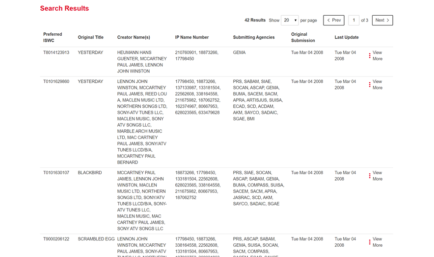

  

CISAC

ISWC Public Portal 

# Document Control

## Change Record

Date

Person

Version/Reference

10th Jan 2020

John Corley, 

Ana Janeth Villegas Salazar 

V1\.0 / Initial Draft

24th Jan 2020

John Corley

V1\.1 / Updates following feedback

27th Jan 2020

Ana Janeth Villegas Salazar

V1\.2/ Updated screen shots

11th Feb 2020

John Corley

V1\.3/Final updates following review by design team\.  Agreed to issue to Steering Group for sign off

## Reviewers

Andreas Thiele

Ulrich Siebert

Katrien Tielemans

Bolmar Carrasquilla 

Ed Osanani 

Bolmar Carrasquilla

Tim Carmichael

Dena Fletcher

Thati Schlesinger 

Didier Roy 

Hanna Mazur 

José Macarro 

Sylvain Piat 

John Corley

Niamh McGarry

Declan Rudden

Curnan Reidy 

## Distribution

Reviewers

## Approval

This document was approved electronically via email by the following people on the following dates:

Date/Time

Person

Note

# Table of Contents

[Document Control	2](#_Toc32324103)

[Change Record	2](#_Toc32324104)

[Reviewers	2](#_Toc32324105)

[Distribution	2](#_Toc32324106)

[Approval	2](#_Toc32324107)

[Table of Contents	3](#_Toc32324108)

[1	Introduction	5](#_Toc32324109)

[What does this document contain?	5](#_Toc32324110)

[Who should read this document?	5](#_Toc32324111)

[References	5](#_Toc32324112)

[2	Overview	6](#_Toc32324113)

[2\.1\. Portal Audience	6](#_Toc32324114)

[2\.2\. User Stories Supported	6](#_Toc32324115)

[2\.3\. Visual Design \(Design Composites\)	6](#_Toc32324116)

[2\.4\. Page Flow	7](#_Toc32324117)

[2\.5\. Navigation	8](#_Toc32324118)

[2\.5\.1\. Global Navigation	8](#_Toc32324119)

[2\.5\.2\. In Page Navigation	8](#_Toc32324120)

[2\.6\. Browser Versions	9](#_Toc32324121)

[2\.7\. Responsive Design	10](#_Toc32324122)

[2\.8\. Language Support	10](#_Toc32324123)

[2\.9\. Authentication & User Access Roles	10](#_Toc32324124)

[3	Welcome Page	11](#_Toc32324125)

[3\.1\. Terms and Conditions	11](#_Toc32324126)

[3\.2\. Language Selection	12](#_Toc32324127)

[4	Search Page	13](#_Toc32324128)

[4\.1\. “Search by” section	13](#_Toc32324129)

[4\.1\.1\. Search by ISWC	13](#_Toc32324130)

[4\.1\.2\. Search by Agency Work Code	14](#_Toc32324131)

[4\.1\.3\. Search by Title	14](#_Toc32324132)

[4\.1\.4\. Search by Creator	15](#_Toc32324133)

[4\.2\. “Search Results” section	16](#_Toc32324134)

[4\.2\.1\. Search Results Grid	16](#_Toc32324135)

[4\.2\.2\. Search Results View More Expansion	17](#_Toc32324136)

[Appendix A – Open and Closed Items	19](#_Toc32324137)

[Appendix B – Option for Aligning Creator Names and IP Name Numbers	21](#_Toc32324138)

1. Introduction

## What does this document contain?

It provides a detailed specification and design of the new ISWC Public portal\.  This portal will replace the existing Fastrack developed portal that is available at [http://iswcnet\.cisac\.org](http://iswcnet.cisac.org)\. 

## Who should read this document?

CISAC development and project management personnel\. Society development and project management personnel\.  Spanish Point development team members\.   

## References

Reference

Description

SPE\_20190806\_ISWC\_Portal\.docx

Agency Portal Specification

1. Overview  

This chapter provides an overview of the new public ISWC web portal that will replace the existing public portal available at [http://iswcnet\.cisac\.org/](http://iswcnet.cisac.org/)\.   This portal is an ISO obligation\.  The existing public portal gets approx\. 350,000 monthly searches\. 

## Portal Audience

The portal will be available generally to all members of the public\.   The existing portal is mostly used by Publishers and DSPs\. 

## User Stories Supported 

The following user stories \(see references section above\) will be supported by this portal:

Ref

Description

Implementation Notes 

Gain access to the ISWC search capability by agreeing to usage terms and conditions 

Public Landing Page

4\.2/5\.2

Retrieve ISWC for a Work \(One ISWC available or No ISWC available\)

Search Page

4\.3/5\.3

Retrieve ISWC for a Work \(Multiple ISWCs available\)

Search Page

4\.4

Retrieve Authoritative Meta\-Data

Search Page

## Visual Design \(Design Composites\)

The visual design in place for the new Agency Portal will be reused for this ISWC Public Portal\.  The following shows a sample of the implemented visual design for the Agency Portal: 

Figure 2\.3‑1 Agency Portal \- Search by Title and Creator – Desktop View

## Page Flow

The following diagram represents the proposed page flow: 

Figure 2\.4‑1 \- Page Flow

## Navigation

The portal will use a combination of a global navigation bar \(that will reduce to a hamburger menu on smaller form factor displays\) and “in\-page” navigation for key page\-specific functionality\.

### Global Navigation 

*Figure 2\.5‑1 \- Proposed Global Navigation Bar*

The following global navigation links will be present on each page: 

- Home \(logo\) brings the user to the welcome page
- Search brings the user to the Search page
- User Guide opens a new tab linking to the user documentation page on cisac\.org

### In Page Navigation 

Each page will use one or more of the following “in\-page” navigation elements:

- Tabs for switching between different view options \(such as in the search page\)

*Figure 2\.5‑2 \- Proposed In Page Navigation Tab*

*Figure 2\.5‑3 \- Proposed In Page Navigation Tab*

- View more / View less expansion and contraction buttons to expand and hide additional details

*Figure 2\.5‑4 \- Proposed Expansion and Contraction*

- Action buttons for carrying out key actions

*Figure 2\.5‑5 \- Proposed Action Buttons*

Note: The default button on key pages will be set so that pressing Enter in most desktop browsers when on a form field will trigger the button action as well\. E\.G\. In the above example pressing enter after typing in the creator surname will trigger the submit button\. 

## Browser Versions

The site will be tested using the following browser versions:

OS / Browser / Versions

Windows 10 / Microsoft IE / 11

Windows 10 / Google Chrome / \(Latest version at time of specification 75\.0\.3770\.142\)

Windows 10 / Firefox / \(Latest version at time of specification 68\.0\.1\) 

iPhone 6 & 7 / Safari / Latest version at time of specification iOS 12\.4\)

iPad / Safari / \(Latest version at time of specification iOS 12\.4\)

## Responsive Design 

The portal will implement a responsive design in line with the design composites shown in the Visual Design section of this specification\.  The portal will be tested using the following screen resolutions: 

- Desktop 1600x992px 
- Laptop 1280x802px 
- Tablet 768x1024px 
- Mobile 320x480px     

## Language Support

All labels and error messages will be held in a central resource file such that additional languages can be added in the future\.  The pages will be developed and configured in EN, FR and ES language only\.

Open Item: Need to confirm where we can get translated content from\.  Also, currently the terms and conditions are in English only even though the rest of the content is multilingual\.  Need to confirm if we can get the terms and conditions translated as well\. 

## Authentication & User Access Roles

When the user accepts the terms and conditions on the welcome page, they with be provided access to the rest of the site\.  No user registration process or username and password is required\. 

1. Welcome Page

The Welcome page will allow the user review the terms and conditions of access and accept these to proceed  to select their preferred language to access the main site \(search page\)\.  Please see an [interactive composite of this page here](https://www.figma.com/proto/9ixJ76G54S6BJQoaHvKnxZ/CISAC-ISWC-System?node-id=462%3A1820&viewport=593%2C456%2C0.4402777850627899&scaling=min-zoom)\.

## Terms and Conditions

The Welcome page consist on the terms and conditions of use of the site where the user needs to complete a validation and after the validation is accepted the “I agree” button will become enable to click and proceed to enter the site\.

Figure 3\.1‑1 Proposed Welcome page

Figure 3\.1‑2 Proposed Welcome page, validation accepted \(Captcha\)

## Language Selection

The Language selection screen appears right after the user accepts the Terms and Conditions by pressing the “I agree” button\. Here the user can the preferred language to continue to the main site\.

Figure __3\.2‑1__ Proposed Welcome Page, preferred language __selection\.__

1. Search Page

The existing Agency Portal Search page will be re\-used to form the Search Page for the public portal\.  General search behavior will be as per the Agency Portal\.   The following sections describe the specific changes required to the Agency Portal Search page to form the Public Portal Search page\. 

##  “Search by” section 

The three existing Agency Portal search page options will be retained as follows: 

- by ISWC
- by Agency Work Code
- by Title

### Search by ISWC

Figure 4\.1‑1 Existing Agency Portal “by ISWC" option

Will be implemented as per Agency Portal

### Search by Agency Work Code

Figure 4\.1‑2 \- Existing Agency Portal "by Agency Work Code" option

Will be implemented as per Agency Portal\.  Note: The Database field as on the Agency Portal won’t be requested here\.   All databases will be assumed\. 

### Search by Title

Figure 4\.1‑3 \- Existing Agency Portal "by Title" option

Will be implemented as per Agency Portal with the following specific changes:

- Creator IP Base Number\(s\) search box will be removed
- Reference to IP Base Numbers will be removed from prompt text

Figure 4\.1‑4 \-Proposed Search by Title Option

Note: The search logic and rules configured will be the same as that used for the Agency Portal\. 

### Search by Creator

Figure 4\.1‑5 – Proposed by Creator Search Option

Will be implemented as per Agency Portal 

##  “Search Results” section 

The search results section will be based on the Agency Portal search results section but with certain sensitive information and options removed\. 

### Search Results Grid

Figure 4\.2‑1 \- Existing Agency Portal Search Results Grid

Will be implemented as per Agency Portal with the following specific changes:

- Submitting Agencies will be removed
- Original Submission and Last Update columns will be removed

Figure 4\.2‑2 \- Proposed Search Results Grid

### Search Results View More Expansion

Figure 4\.2‑3 \- Existing Agency Portal View More Expansion

Will be implemented as per Agency Portal with the following specific changes:

- Original Submission and Last Update columns will be removed
- View Submission History button will be removed
- Update Submission button will be removed
- Add to Merge List and View Merge List buttons will be removed
- IP Base Number will be removed

Figure 4\.2‑4 \- Proposed View More Expansion

# Appendix A – Open and Closed Items

This appendix provides a tracking list of specific issues/queries raised by CISAC during the specification process and how they were incorporated or excluded from this specification:

__Open and Closed Items__

__ID__

__Description__

__Response__

__Status__

__Next Action By__

1\.

Confirm that societies are happy to display society work numbers on public portal\.  If this turns out not to be the case, then consider documenting a feature to allow Agency portal users to turn on or off visibility of their work numbers in the configuration menu option of the agency portal\.  

Feedback from design team is that displaying society work numbers is ok

Closed

Design Team

2\.

Confirm if it is possible to search by title on its own in the Agency Portal and therefore it should be possible in the Public Portal\.

I’ve checked the Agency Portal specification and it should support searching by title alone\.  Currently it is not doing this, but this will be resolved, and it will do the same in the Agency Portal

Closed

John C

3\.

Review notes on Agency portal design and see what was agreed for searching by IP only\. 

This was documented in the open items as something that should be supported as follows but didn’t make its way into the specification itself and isn’t currently implemented\.  This was envisioned as a separate tab “by Creator” where the IP Name Number or Creator Surname field can be entered\.   John C to review with design team and include in this specification\.

John C to update the specification to reflect this\. 

Specification now updated to include this

Closed

John C

4\.

John C to confirm that current search by IP Name Number resolves up to IPBaseNumber when doing search

Yes, it does

Closed

John C

5\. 

Need to review options to try and more easily align IP Name Numbers and Names in the search result grid\. 

Ana has proposed a mechanism for dealing with this when the browser is at a desktop sized resolution\.  See Appendix B for details\.  Next action is for the design team to review and provide feedback

Agreed that this mechanism will be applied to the agency portal as part of this specification and then inherited into this public portal

Closed

Design Team

# Appendix B – Option for Aligning Creator Names and IP Name Numbers

This following shows how the create names and IP Name Numbers can align, on a desktop view, when one or more creator names exceed the space available to be shown on one line:

Figure 20 \- Desktop View

Figure 21 \- Desktop View \- Hover Text

Note: Once the resolution reduces below what is considered a desktop view the columns will be stacked as per current new agency portal\. 

