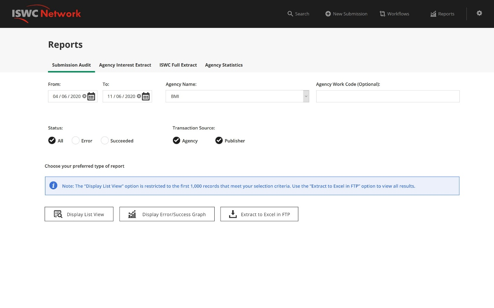
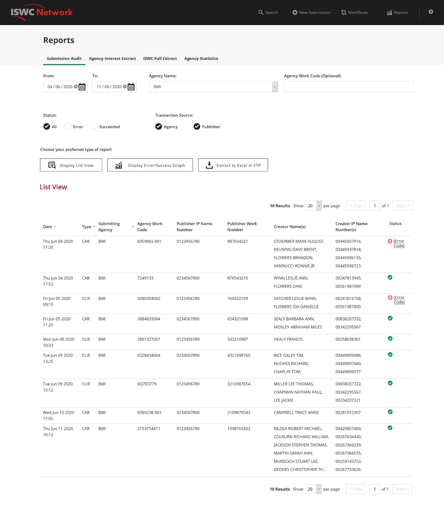
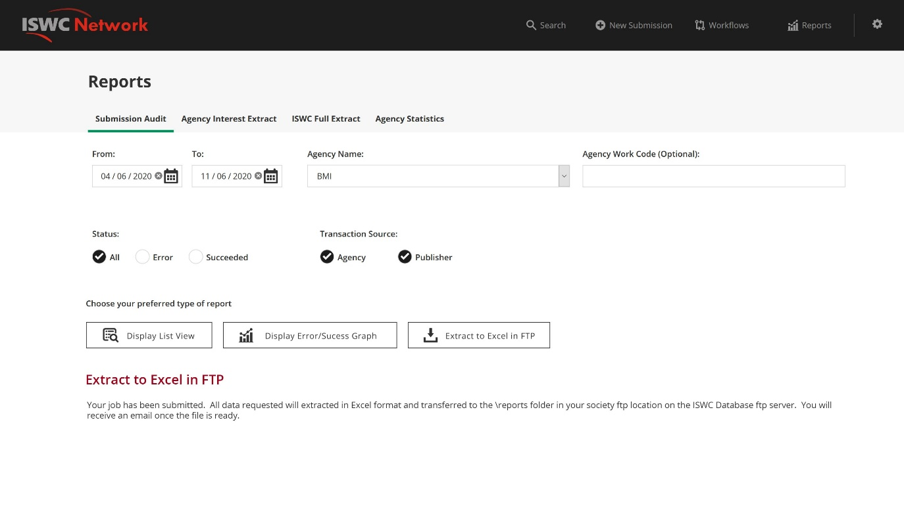
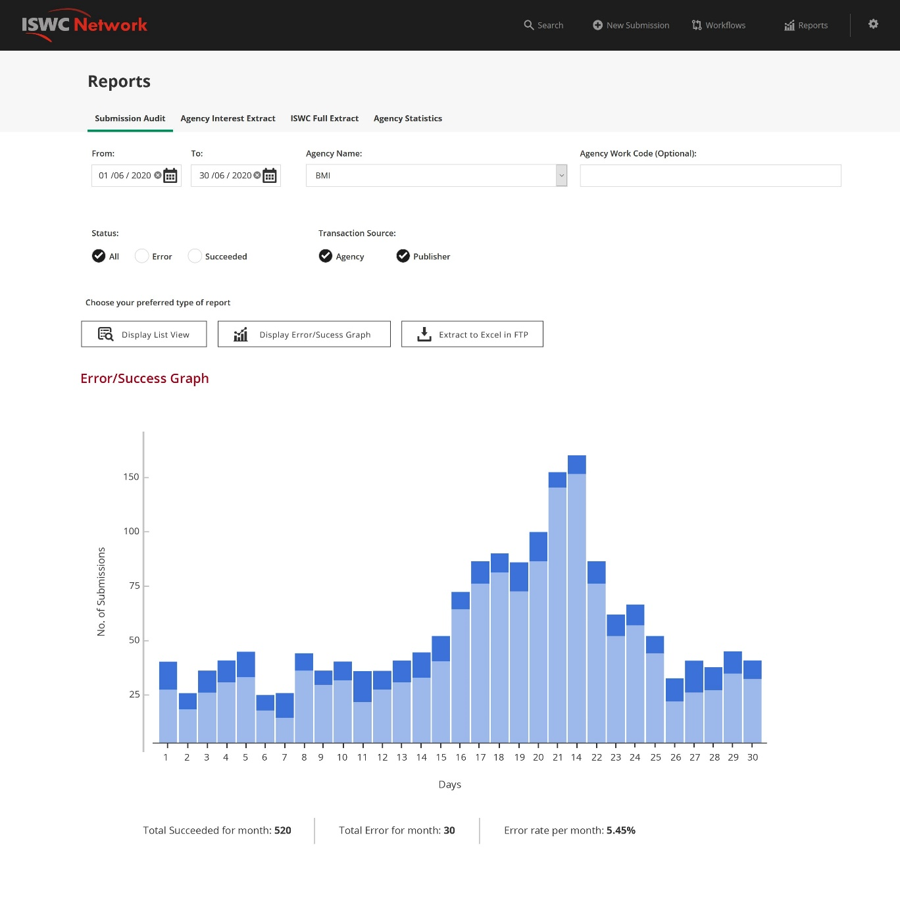
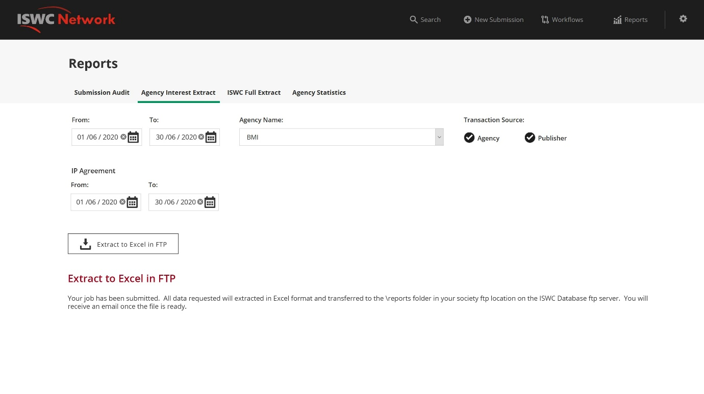
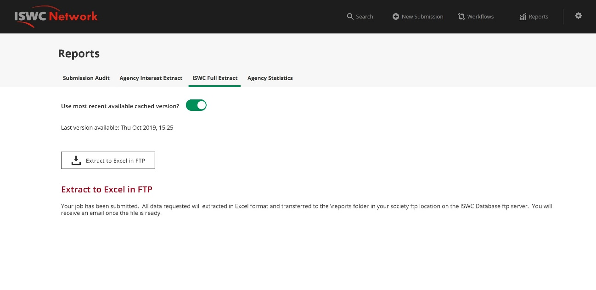
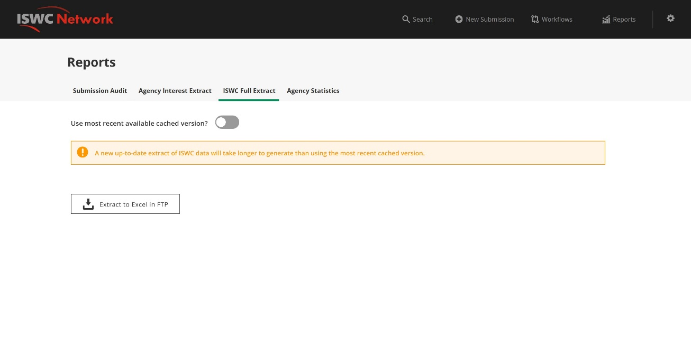
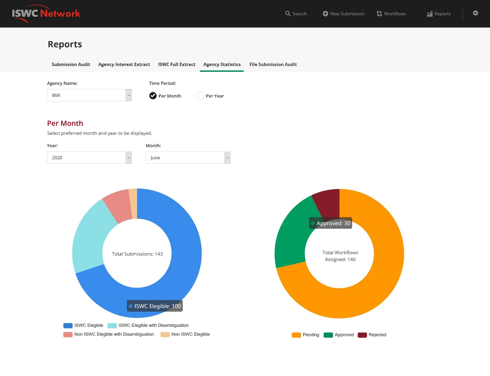
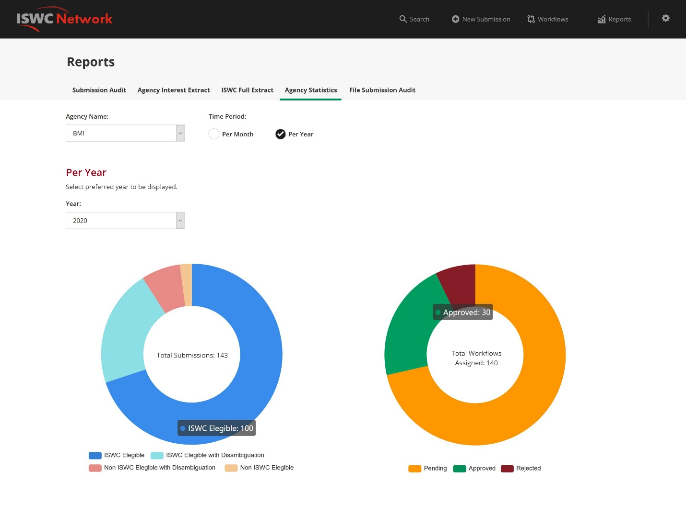

  

CISAC

ISWC Database Reporting

# Document Control

## Change Record

Date

Person

Version/Reference

24th Jan 2020

John Corley, 

Curnan Reidy  

V1\.0 / Initial Draft for review by design team

8th Jun 2020

John Corley

V1\.1 / Feedback from workshop on 4th June

15th Jun 2020

John Corley

V1\.2 / Feedback from second workshop \+ Mockups

22nd Jun 2020

John Corley

V1\.3 / Removed closed comments so that document is ready for approval by Steering Group

## Reviewers

Katrien Tielemans

Bolmar Carrasquilla 

Christopher McKenzie

Janice Hooper

Alice Meisel

Ulrich Siebert

Brigitte Kueng

Cynthia Lipskier

Sylvain Masson

Claire Binnington

Marina Raccani

Keith Hill

Sylvain Piat

Didier Roy 

Hanna Mazur 

José Macarro

Niamh McGarry

Declan Rudden

Roisin Jones

John Corley

Curnan Reidy

## Distribution

Reviewers

## Approval

This document was approved electronically via email by the following people on the following dates:

Date/Time

Person

Note

# Table of Contents

[Document Control	2](#_Toc43708907)

[Change Record	2](#_Toc43708908)

[Reviewers	2](#_Toc43708909)

[Distribution	3](#_Toc43708910)

[Approval	3](#_Toc43708911)

[Table of Contents	4](#_Toc43708912)

[1	Introduction	6](#_Toc43708913)

[What does this document contain?	6](#_Toc43708914)

[Who should read this document?	6](#_Toc43708915)

[References	6](#_Toc43708916)

[2	Reporting Overview	7](#_Toc43708917)

[2\.1\. Data Sources	7](#_Toc43708918)

[2\.2\. Key Reporting Requirements	7](#_Toc43708919)

[3	Reporting Data	10](#_Toc43708920)

[3\.1\. Submission Data	10](#_Toc43708921)

[3\.2\. Core ISWC Data	28](#_Toc43708922)

[3\.3\. File Submission Data	28](#_Toc43708923)

[4	Standard Agency Reports & Extracts	30](#_Toc43708924)

[4\.1\. Submission Audit	30](#_Toc43708925)

[4\.1\.1\. Parameters	31](#_Toc43708926)

[4\.1\.2\. Data Source	31](#_Toc43708927)

[4\.1\.3\. Report Output	32](#_Toc43708928)

[4\.2\. Agency Interest Extract	37](#_Toc43708929)

[4\.2\.1\. Parameters	37](#_Toc43708930)

[4\.2\.2\. Data Source	38](#_Toc43708931)

[4\.2\.3\. Report Output	39](#_Toc43708932)

[4\.3\. ISWC Full Extract	40](#_Toc43708933)

[4\.3\.1\. Parameters	41](#_Toc43708934)

[4\.3\.2\. Data Source	41](#_Toc43708935)

[4\.3\.3\. Report Output	41](#_Toc43708936)

[4\.4\. Agency Statistics	42](#_Toc43708937)

[4\.4\.1\. Parameters	42](#_Toc43708938)

[4\.4\.2\. Report Output	43](#_Toc43708939)

[4\.5\. File Submission Audit	44](#_Toc43708940)

[4\.5\.1\. Parameters	45](#_Toc43708941)

[4\.5\.2\. Data Source	45](#_Toc43708942)

[4\.5\.3\. Report Output	46](#_Toc43708943)

[4\.6\. Publisher ISWC Tracking	47](#_Toc43708944)

[4\.6\.1\. Parameters	48](#_Toc43708945)

[4\.6\.2\. Data Source	48](#_Toc43708946)

[4\.6\.3\. Report Output	49](#_Toc43708947)

[Appendix A – Open and Closed Items	51](#_Toc43708948)

1. Introduction

## What does this document contain?

It provides the detailed design of the new reporting capabilities that will be available to CISAC system administrators and ISWC agencies\. 

## Who should read this document?

CISAC development and project management personnel\. Society development and project management personnel\.  Spanish Point development team members\.   

## References

Reference

Description

SPE\_20190218\_ISWCDataModel\.docx

ISWC core database data model \(updated to reflect latest changes\)

1. Reporting Overview

This chapter describes summarises key reporting requirements for the new ISWC system\.  

## Data Sources

The data available for reporting falls within two main categories:

- Submission data

This consists of the complete audit trail of all submissions made and the corresponding outcome of those submissions\.  This corresponds to the data held in Azure Cosmos DB\.

- Core ISWC data

This is the consolidated ISWC data that includes all ISWC’s and the corresponding latest submission detail from each society for submissions that are successful\.  This corresponds to the data held in the Azure SQL DB\.

Information on the data available for reporting on under these two categories is contained in chapter three below\. 

## Key Reporting Requirements

The following defines the high\-level reporting and extract requirements captured during the overall system design process\.  Each of these requirements is mapped to a specific report or extract in chapter four or five below\. 

*Note: The DCI reporting will remain in place so the reports below will be in addition to these\.*

Key reporting requirements:

1. Society extract of ISWCs, including meta\-data, in which the society has an interest \(including those which have been requested through a different society\)\.  This will be a new report, but variations are currently provided as Ad\-Hoc extracts\.  This report should include the following: 
	- ISWCs with an IP for a society where the society has not made the submission\. Although this is also in the DCI\.  Not a priority\.  
	- Allocation or resolution requests that link to ISWCs where the society has an interest \(maybe separate into a separate requirement\)\.  

The proposed solution to this requirement is described in chapter four, “Agency Interest Extract”\.  

1. Quarterly refresh file\.  Made available every quarter\.   Last one uploaded in Oct\.   List of ISWCs and Archived ISWCs\.  Available for societies, publishers and DSPs\.

The proposed solution to this requirement is described in chapter four, “ISWC Full Extract”\.  

1. Submission History\.   List of submissions made by a society including the details of the response\.   This should include submissions that failed validation\.

The proposed solution to this requirement is described in chapter four, “Submission Audit”\.  

1. Ratio/number of ISWCs created by the ISWC Allocation Service and ISWCs verified when a society work code is assigned and submitted for validation\.  Note: This is really about validating that the ISWC returned to a Publisher makes its way to the societies through their CWR ingestion process\.  

The proposed solution to this requirement is described in chapter four, “Publisher ISWC Tracking”\.  

1. Ratio/Number of requests rejected due to failing technical validation

The proposed solution to this requirement is described in chapter four, “Submission Audit”\.  

1. Ratio/Number of requests rejected due to failing business validation 

The proposed solution to this requirement is described in chapter four, “Submission Audit”\.  

1. Additional Stats to capture compliancy to SLAs\.  Originally from allocation service\.  Comparison of receipt date/time against the date/time output file generated\.   

The proposed solution to this requirement is described in chapter four, “File Submission Audit”\.  

1. Number of ISWCs allocated including historical \(comparative report against historical data\)

The proposed solution to this requirement is described in chapter four, “Submission Audit”\.  

1. For the resolution service, reporting should allow a society to identify which of its publishers are making requests, which works they are requesting ISWCs for and what information is being returned to the publisher

The proposed solution to this requirement is described in chapter four, “Submission Audit”\.  

1. Overall society statistics \(total number of ISWCs, number of workflows etc\)

The proposed solution to this requirement is described in chapter four, “Agency Statistics”\.  

1. Reporting Data

This chapter describes the structure of the underlying data available for reporting under the following two main categories: 

  

- Submission data

This consists of the complete audit trail of all submissions made and the corresponding outcome of those submissions\.  This corresponds to the data held in Azure Cosmos DB\.

- Core ISWC data

This is the consolidated ISWC data that includes all ISWC’s and the corresponding latest submission detail from each society for submissions that are successful\.  This corresponds to the data held in the Azure SQL DB\.

## Submission Data

Submission audit data and its corresponding result are held in two Cosmos DB collections as follows:

- Audit collection

The audit collection holds an audit document for each API request batch\.  As all submissions are ultimately converted into API request batches then all data will have a corresponding audit document\.  The following is representative of a typical audit document:

\[

    \{

        "id": "8ecc6617\-2f43\-4d02\-b2c4\-1d4d19f13d23",

        "AgencyCode": "269",

        "CreatedDate": "2020\-05\-26T06:49:37\.1088329Z",

        "PartitionKey": "8ecc6617\-2f43\-4d02\-b2c4\-1d4d19f13d23",

        "BatchSize": 10,

        "\_rid": "PVh9AL5t16JvYwEAAAAAAA==",

        "\_self": "dbs/PVh9AA==/colls/PVh9AL5t16I=/docs/PVh9AL5t16JvYwEAAAAAAA==/",

        "\_etag": "\\"32008767\-0000\-0d00\-0000\-5eccbc010000\\"",

        "\_attachments": "attachments/",

        "\_ts": 1590475777

    \}

\]

  

The useful information contained here from a reporting perspective is: 

Field

Description

Id

Unique identifier for audit document

AgencyCode

Agency identifier for the submitting agency\.  E\.G\. “10” would represent ASCAP, “128” IMRO etc

CreatedDate

Date/Time transaction batch was submitted

BatchSize

Number of batches in the transaction

- Audit request collection

The audit request collection holds an audit request document for each API request within an API request batch\. The audit request documents contain details of the rules applied to the request as well as information relating to the outcome of the request \(e\.g\. ISWC assigned\)\.  The following show the first two audit request documents associated with the batch shown above: 

\[

    \{

        "id": "ae3007eb\-a543\-40ca\-8da8\-42ae3659df0f",

        "AuditId": "8ecc6617\-2f43\-4d02\-b2c4\-1d4d19f13d23",

        "RecordId": 277,

        "AgencyCode": "269",

        "CreatedDate": "2020\-05\-26T06:49:55\.8429754Z",

        "IsProcessingFinished": true,

        "IsProcessingError": true,

        "ProcessingCompletionDate": "2020\-05\-26T06:49:55\.8429754Z",

        "RulesApplied": \[

            \{

                "RuleName": "IV\_02",

                "RuleVersion": "1\.0\.0\.0",

                "RuleConfiguration": "True",

                "TimeTaken": "00:00:00\.0000182"

            \},

            \{

                "RuleName": "IV\_05",

                "RuleVersion": "1\.0\.0\.0",

                "RuleConfiguration": null,

                "TimeTaken": "00:00:00\.0000595"

            \}

        \],

        "PartitionKey": "2691001695121",

        "WorkIdBefore": null,

        "WorkIdAfter": null,

        "TransactionError": \{

            "Code": "109",

            "Message": "Work Titles are required"

        \},

        "Work": \{

            "PreferredIswc": null,

            "SourceDb": 269,

            "WorkNumber": \{

                "Type": "269",

                "Number": "1001695121"

            \},

            "Disambiguation": false,

            "DisambiguationReason": null,

            "DisambiguateFrom": \[\],

            "BVLTR": null,

            "DerivedWorkType": null,

            "DerivedFrom": \[\],

            "Performers": \[\],

            "Instrumentation": \[\],

            "CisnetCreatedDate": null,

            "CisnetLastModifiedDate": null,

            "Iswc": null,

            "Agency": "269",

            "Titles": \[\],

            "InterestedParties": \[

                \{

                    "ContributorID": null,

                    "IpBaseNumber": "I0002803634",

                    "Type": 6,

                    "CisacType": null,

                    "Names": \[

                        \{

                            "IpNameNumber": 1009173881,

                            "AmendedDateTime": "0001\-01\-01T00:00:00",

                            "FirstName": null,

                            "LastName": "GAOLS NAIBAHO",

                            "CreatedDate": "0001\-01\-01T00:00:00",

                            "TypeCode": 0,

                            "ForwardingNameNumber": null,

                            "Agency": null

                        \}

                    \],

                    "IsAuthoritative": null,

                    "Status": null,

                    "Agency": null,

                    "DeathDate": null,

                    "IPNameNumber": 1009173881,

                    "Name": "GAOLS NAIBAHO",

                    "LastName": null,

                    "CreatedDate": null,

                    "Affiliation": null,

                    "ContributorType": null

                \},

                \{

                    "ContributorID": null,

                    "IpBaseNumber": "I0016310704",

                    "Type": 12,

                    "CisacType": null,

                    "Names": \[

                        \{

                            "IpNameNumber": 288936892,

                            "AmendedDateTime": "0001\-01\-01T00:00:00",

                            "FirstName": null,

                            "LastName": "UNKNOWN PUBLISHER",

                            "CreatedDate": "0001\-01\-01T00:00:00",

                            "TypeCode": 0,

                            "ForwardingNameNumber": null,

                            "Agency": null

                        \}

                    \],

                    "IsAuthoritative": null,

                    "Status": null,

                    "Agency": null,

                    "DeathDate": null,

                    "IPNameNumber": 288936892,

                    "Name": "UNKNOWN PUBLISHER",

                    "LastName": null,

                    "CreatedDate": null,

                    "Affiliation": null,

                    "ContributorType": null

                \}

            \],

            "IsDeleted": false,

            "ReasonCode": null,

            "ApproveWorkflowTasks": false,

            "Category": 0,

            "IswcsToMerge": \[\],

            "WorkNumbersToMerge": \[\],

            "StartIndex": null,

            "PageLength": null,

            "WorkflowTasks": \[\],

            "PreviewDisambiguation": false

        \},

        "TransactionType": 0,

        "WorkflowInstanceId": null,

        "\_rid": "PVh9AK1tqFq25Q0AAAAAAA==",

        "\_self": "dbs/PVh9AA==/colls/PVh9AK1tqFo=/docs/PVh9AK1tqFq25Q0AAAAAAA==/",

        "\_etag": "\\"3200a967\-0000\-0d00\-0000\-5eccbc130000\\"",

        "\_attachments": "attachments/",

        "\_ts": 1590475795

    \},

    \{

        "id": "a2592f21\-189a\-4f91\-9a9c\-af2a9400d33e",

        "AuditId": "8ecc6617\-2f43\-4d02\-b2c4\-1d4d19f13d23",

        "RecordId": 278,

        "AgencyCode": "119",

        "CreatedDate": "2020\-05\-26T06:49:55\.8429754Z",

        "IsProcessingFinished": true,

        "IsProcessingError": false,

        "ProcessingCompletionDate": "2020\-05\-26T06:49:55\.8429754Z",

        "RulesApplied": \[

            \{

                "RuleName": "IV\_02",

                "RuleVersion": "1\.0\.0\.0",

                "RuleConfiguration": "True",

                "TimeTaken": "00:00:00\.0000097"

            \},

            \{

                "RuleName": "IV\_05",

                "RuleVersion": "1\.0\.0\.0",

                "RuleConfiguration": null,

                "TimeTaken": "00:00:00\.0000021"

            \},

            \{

                "RuleName": "IV\_06",

                "RuleVersion": "1\.0\.0\.0",

                "RuleConfiguration": "True",

                "TimeTaken": "00:00:00\.0000067"

            \},

            \{

                "RuleName": "IV\_07",

                "RuleVersion": "1\.0\.0\.0",

                "RuleConfiguration": "C, CA, A, AR, AD, TR, SA, SR",

                "TimeTaken": "00:00:00\.0000264"

            \},

            \{

                "RuleName": "IV\_08",

                "RuleVersion": "1\.0\.0\.0",

                "RuleConfiguration": "True",

                "TimeTaken": "00:00:00\.0087445"

            \},

            \{

                "RuleName": "IV\_10",

                "RuleVersion": "1\.0\.0\.0",

                "RuleConfiguration": "True",

                "TimeTaken": "00:00:00\.0027383"

            \},

            \{

                "RuleName": "IV\_11",

                "RuleVersion": "1\.0\.0\.0",

                "RuleConfiguration": null,

                "TimeTaken": "00:00:00\.0000022"

            \},

            \{

                "RuleName": "IV\_15",

                "RuleVersion": "1\.0\.0\.0",

                "RuleConfiguration": "True",

                "TimeTaken": "00:00:00\.0000132"

            \},

            \{

                "RuleName": "IV\_25",

                "RuleVersion": "1\.0\.0\.0",

                "RuleConfiguration": null,

                "TimeTaken": "00:00:00\.0652470"

            \},

            \{

                "RuleName": "IV\_29",

                "RuleVersion": "1\.0\.0\.0",

                "RuleConfiguration": "I\-000168343\-6, I\-000182275\-7, I\-000225476\-2, I\-000477057\-2, I\-000611847\-2, I\-000666471\-5, I\-000887841\-7, I\-001172928\-3, I\-001317751\-8, I\-001478936\-5, I\-001529601\-0, I\-001563734\-8, I\-001631070\-4, I\-001635620\-8, I\-001648303\-5, I\-001655709\-6, I\-001656397\-4, I\-001661395\-7, I\-001670753\-0, I\-002570678\-7",

                "TimeTaken": "00:00:00\.0639363"

            \},

            \{

                "RuleName": "IV\_34",

                "RuleVersion": "1\.0\.0\.0",

                "RuleConfiguration": "basic",

                "TimeTaken": "00:00:00\.0000176"

            \},

            \{

                "RuleName": "IV\_36",

                "RuleVersion": "1\.0\.0\.0",

                "RuleConfiguration": "True",

                "TimeTaken": "00:00:00\.0000095"

            \},

            \{

                "RuleName": "IV\_38",

                "RuleVersion": "1\.0\.0\.0",

                "RuleConfiguration": "True",

                "TimeTaken": "00:00:00\.0000070"

            \},

            \{

                "RuleName": "IV\_40",

                "RuleVersion": "1\.0\.0\.0",

                "RuleConfiguration": "True",

                "TimeTaken": "00:00:00\.0000072"

            \},

            \{

                "RuleName": "IV\_45",

                "RuleVersion": "1\.0\.0\.0",

                "RuleConfiguration": null,

                "TimeTaken": "00:00:00\.0000019"

            \},

            \{

                "RuleName": "MD\_01",

                "RuleVersion": "1\.0\.0\.0",

                "RuleConfiguration": "C\(C,CA,A\); MA\(AR,SR\); TA\(AD,SA,TR\); E\(E,AM\)",

                "TimeTaken": "00:00:00\.0000726"

            \},

            \{

                "RuleName": "MD\_03",

                "RuleVersion": "1\.0\.0\.0",

                "RuleConfiguration": "PT,CT",

                "TimeTaken": "00:00:00\.0000358"

            \},

            \{

                "RuleName": "MD\_06",

                "RuleVersion": "1\.0\.0\.0",

                "RuleConfiguration": "\[^a\-zA\-Z0\-9 \]",

                "TimeTaken": "00:00:00\.0000142"

            \},

            \{

                "RuleName": "MD\_08",

                "RuleVersion": "1\.0\.0\.0",

                "RuleConfiguration": "True",

                "TimeTaken": "00:00:00\.0000175"

            \},

            \{

                "RuleName": "MD\_09",

                "RuleVersion": "1\.0\.0\.0",

                "RuleConfiguration": "True",

                "TimeTaken": "00:00:00\.0031295"

            \},

            \{

                "RuleName": "MD\_10",

                "RuleVersion": "1\.0\.0\.0",

                "RuleConfiguration": "True",

                "TimeTaken": "00:00:00\.0000237"

            \},

            \{

                "RuleName": "MD\_11",

                "RuleVersion": "1\.0\.0\.0",

                "RuleConfiguration": "True",

                "TimeTaken": "00:00:00\.0000121"

            \},

            \{

                "RuleName": "MD\_13",

                "RuleVersion": "1\.0\.0\.0",

                "RuleConfiguration": "True",

                "TimeTaken": "00:00:00\.0000158"

            \},

            \{

                "RuleName": "MD\_16",

                "RuleVersion": "1\.0\.0\.0",

                "RuleConfiguration": "True",

                "TimeTaken": "00:00:00\.0966049"

            \},

            \{

                "RuleName": "MD\_17",

                "RuleVersion": "1\.0\.0\.0",

                "RuleConfiguration": "True",

                "TimeTaken": "00:00:00\.0023558"

            \},

            \{

                "RuleName": "IV\_24",

                "RuleVersion": "1\.0\.0\.0",

                "RuleConfiguration": "True",

                "TimeTaken": "00:00:00\.0658541"

            \},

            \{

                "RuleName": "EL\_01",

                "RuleVersion": "1\.0\.0\.0",

                "RuleConfiguration": null,

                "TimeTaken": "00:00:00\.0000042"

            \},

            \{

                "RuleName": "EL\_02",

                "RuleVersion": "1\.0\.0\.0",

                "RuleConfiguration": "True",

                "TimeTaken": "00:00:00\.0000185"

            \},

            \{

                "RuleName": "MatchingForIswcEligibleSubmitter",

                "RuleVersion": "1\.0\.0\.0",

                "RuleConfiguration": null,

                "TimeTaken": "00:00:00\.4093326"

            \},

            \{

                "RuleName": "MatchingForIswcRelated",

                "RuleVersion": "1\.0\.0\.0",

                "RuleConfiguration": null,

                "TimeTaken": "00:00:00\.0000113"

            \},

            \{

                "RuleName": "MatchingForIswcRelated",

                "RuleVersion": "1\.0\.0\.0",

                "RuleConfiguration": null,

                "TimeTaken": "00:00:00\.0000053"

            \},

            \{

                "RuleName": "RankingComponent",

                "RuleVersion": "1\.0\.0\.0",

                "RuleConfiguration": null,

                "TimeTaken": "00:00:03\.4537800"

            \},

            \{

                "RuleName": "IV\_40",

                "RuleVersion": "1\.0\.0\.0",

                "RuleConfiguration": "True",

                "TimeTaken": "00:00:00\.0000219"

            \},

            \{

                "RuleName": "PV\_02",

                "RuleVersion": "1\.0\.0\.0",

                "RuleConfiguration": null,

                "TimeTaken": "00:00:00\.2073121"

            \},

            \{

                "RuleName": "IV\_02",

                "RuleVersion": "1\.0\.0\.0",

                "RuleConfiguration": "True",

                "TimeTaken": "00:00:00\.0000208"

            \},

            \{

                "RuleName": "IV\_05",

                "RuleVersion": "1\.0\.0\.0",

                "RuleConfiguration": null,

                "TimeTaken": "00:00:00\.0000032"

            \},

            \{

                "RuleName": "IV\_06",

                "RuleVersion": "1\.0\.0\.0",

                "RuleConfiguration": "True",

                "TimeTaken": "00:00:00\.0000076"

            \},

            \{

                "RuleName": "IV\_07",

                "RuleVersion": "1\.0\.0\.0",

                "RuleConfiguration": "C, CA, A, AR, AD, TR, SA, SR",

                "TimeTaken": "00:00:00\.0000288"

            \},

            \{

                "RuleName": "IV\_08",

                "RuleVersion": "1\.0\.0\.0",

                "RuleConfiguration": "True",

                "TimeTaken": "00:00:00\.0081112"

            \},

            \{

                "RuleName": "IV\_10",

                "RuleVersion": "1\.0\.0\.0",

                "RuleConfiguration": "True",

                "TimeTaken": "00:00:00\.0027336"

            \},

            \{

                "RuleName": "IV\_11",

                "RuleVersion": "1\.0\.0\.0",

                "RuleConfiguration": null,

                "TimeTaken": "00:00:00\.0000137"

            \},

            \{

                "RuleName": "IV\_13",

                "RuleVersion": "1\.0\.0\.0",

                "RuleConfiguration": "True",

                "TimeTaken": "00:00:00\.0000129"

            \},

            \{

                "RuleName": "IV\_15",

                "RuleVersion": "1\.0\.0\.0",

                "RuleConfiguration": "True",

                "TimeTaken": "00:00:00\.0000148"

            \},

            \{

                "RuleName": "IV\_25",

                "RuleVersion": "1\.0\.0\.0",

                "RuleConfiguration": null,

                "TimeTaken": "00:00:00\.0675742"

            \},

            \{

                "RuleName": "IV\_29",

                "RuleVersion": "1\.0\.0\.0",

                "RuleConfiguration": "I\-000168343\-6, I\-000182275\-7, I\-000225476\-2, I\-000477057\-2, I\-000611847\-2, I\-000666471\-5, I\-000887841\-7, I\-001172928\-3, I\-001317751\-8, I\-001478936\-5, I\-001529601\-0, I\-001563734\-8, I\-001631070\-4, I\-001635620\-8, I\-001648303\-5, I\-001655709\-6, I\-001656397\-4, I\-001661395\-7, I\-001670753\-0, I\-002570678\-7",

                "TimeTaken": "00:00:00\.0740142"

            \},

            \{

                "RuleName": "IV\_34",

                "RuleVersion": "1\.0\.0\.0",

                "RuleConfiguration": "basic",

                "TimeTaken": "00:00:00\.0000163"

            \},

            \{

                "RuleName": "IV\_36",

                "RuleVersion": "1\.0\.0\.0",

                "RuleConfiguration": "True",

                "TimeTaken": "00:00:00\.0000093"

            \},

            \{

                "RuleName": "IV\_38",

                "RuleVersion": "1\.0\.0\.0",

                "RuleConfiguration": "True",

                "TimeTaken": "00:00:00\.0000070"

            \},

            \{

                "RuleName": "IV\_46",

                "RuleVersion": "1\.0\.0\.0",

                "RuleConfiguration": null,

                "TimeTaken": "00:00:00\.4154378"

            \},

            \{

                "RuleName": "MD\_01",

                "RuleVersion": "1\.0\.0\.0",

                "RuleConfiguration": "C\(C,CA,A\); MA\(AR,SR\); TA\(AD,SA,TR\); E\(E,AM\)",

                "TimeTaken": "00:00:00\.0000756"

            \},

            \{

                "RuleName": "MD\_03",

                "RuleVersion": "1\.0\.0\.0",

                "RuleConfiguration": "PT,CT",

                "TimeTaken": "00:00:00\.0000328"

            \},

            \{

                "RuleName": "MD\_06",

                "RuleVersion": "1\.0\.0\.0",

                "RuleConfiguration": "\[^a\-zA\-Z0\-9 \]",

                "TimeTaken": "00:00:00\.0000116"

            \},

            \{

                "RuleName": "MD\_08",

                "RuleVersion": "1\.0\.0\.0",

                "RuleConfiguration": "True",

                "TimeTaken": "00:00:00\.0000161"

            \},

            \{

                "RuleName": "MD\_09",

                "RuleVersion": "1\.0\.0\.0",

                "RuleConfiguration": "True",

                "TimeTaken": "00:00:00\.0025709"

            \},

            \{

                "RuleName": "MD\_10",

                "RuleVersion": "1\.0\.0\.0",

                "RuleConfiguration": "True",

                "TimeTaken": "00:00:00\.0000797"

            \},

            \{

                "RuleName": "MD\_11",

                "RuleVersion": "1\.0\.0\.0",

                "RuleConfiguration": "True",

                "TimeTaken": "00:00:00\.0000121"

            \},

            \{

                "RuleName": "MD\_13",

                "RuleVersion": "1\.0\.0\.0",

                "RuleConfiguration": "True",

                "TimeTaken": "00:00:00\.0000158"

            \},

            \{

                "RuleName": "MD\_16",

                "RuleVersion": "1\.0\.0\.0",

                "RuleConfiguration": "True",

                "TimeTaken": "00:00:00\.0708567"

            \},

            \{

                "RuleName": "MD\_17",

                "RuleVersion": "1\.0\.0\.0",

                "RuleConfiguration": "True",

                "TimeTaken": "00:00:00\.0025604"

            \},

            \{

                "RuleName": "IV\_24",

                "RuleVersion": "1\.0\.0\.0",

                "RuleConfiguration": "True",

                "TimeTaken": "00:00:00\.0654724"

            \},

            \{

                "RuleName": "EL\_03",

                "RuleVersion": "1\.0\.0\.0",

                "RuleConfiguration": null,

                "TimeTaken": "00:00:00\.0000045"

            \},

            \{

                "RuleName": "MatchingForIswcEligibleExisting",

                "RuleVersion": "1\.0\.0\.0",

                "RuleConfiguration": null,

                "TimeTaken": "00:00:01\.1253068"

            \},

            \{

                "RuleName": "MatchingForIswcRelated",

                "RuleVersion": "1\.0\.0\.0",

                "RuleConfiguration": null,

                "TimeTaken": "00:00:00\.0000101"

            \},

            \{

                "RuleName": "RankingComponent",

                "RuleVersion": "1\.0\.0\.0",

                "RuleConfiguration": null,

                "TimeTaken": "00:00:01\.8375412"

            \},

            \{

                "RuleName": "PV\_03",

                "RuleVersion": "1\.0\.0\.0",

                "RuleConfiguration": null,

                "TimeTaken": "00:00:00\.0077626"

            \},

            \{

                "RuleName": "PV\_05",

                "RuleVersion": "1\.0\.0\.0",

                "RuleConfiguration": null,

                "TimeTaken": "00:00:00\.0663106"

            \},

            \{

                "RuleName": "PV\_20",

                "RuleVersion": "1\.0\.0\.0",

                "RuleConfiguration": null,

                "TimeTaken": "00:00:00\.0000055"

            \},

            \{

                "RuleName": "PV\_21",

                "RuleVersion": "1\.0\.0\.0",

                "RuleConfiguration": null,

                "TimeTaken": "00:00:00\.3228526"

            \},

            \{

                "RuleName": "PV\_22",

                "RuleVersion": "1\.0\.0\.0",

                "RuleConfiguration": null,

                "TimeTaken": "00:00:00\.0247890"

            \},

            \{

                "RuleName": "PV\_23",

                "RuleVersion": "1\.0\.0\.0",

                "RuleConfiguration": null,

                "TimeTaken": "00:00:00\.0000020"

            \},

            \{

                "RuleName": "PV\_26",

                "RuleVersion": "1\.0\.0\.0",

                "RuleConfiguration": null,

                "TimeTaken": "00:00:00\.0857470"

            \},

            \{

                "RuleName": "AS\_04",

                "RuleVersion": "1\.0\.0\.0",

                "RuleConfiguration": null,

                "TimeTaken": "00:00:00\.3782570"

            \}

        \],

        "PartitionKey": "1191018313405",

        "WorkIdBefore": null,

        "WorkIdAfter": 11915542497,

        "TransactionError": null,

        "Work": \{

            "PreferredIswc": "T9800558785",

            "SourceDb": 119,

            "WorkNumber": \{

                "Type": "119",

                "Number": "1018313405"

            \},

            "Disambiguation": false,

            "DisambiguationReason": null,

            "DisambiguateFrom": \[\],

            "BVLTR": null,

            "DerivedWorkType": null,

            "DerivedFrom": \[\],

            "Performers": \[\],

            "Instrumentation": \[\],

            "CisnetCreatedDate": null,

            "CisnetLastModifiedDate": null,

            "Iswc": null,

            "Agency": "119",

            "Titles": \[

                \{

                    "TitleID": null,

                    "Name": "家鄉贊",

                    "StandardisedName": "家鄉贊",

                    "Type": 2

                \}

            \],

            "InterestedParties": \[

                \{

                    "ContributorID": null,

                    "IpBaseNumber": "I\-002500274\-6",

                    "Type": 10,

                    "CisacType": 3,

                    "Names": \[

                        \{

                            "IpNameNumber": 508735640,

                            "AmendedDateTime": "0001\-01\-01T00:00:00",

                            "FirstName": null,

                            "LastName": "HAO YU QI",

                            "CreatedDate": "0001\-01\-01T00:00:00",

                            "TypeCode": 0,

                            "ForwardingNameNumber": null,

                            "Agency": null

                        \}

                    \],

                    "IsAuthoritative": true,

                    "Status": null,

                    "Agency": null,

                    "DeathDate": null,

                    "IPNameNumber": 508735640,

                    "Name": "HAO YU QI",

                    "LastName": null,

                    "CreatedDate": null,

                    "Affiliation": null,

                    "ContributorType": null

                \}

            \],

            "IsDeleted": false,

            "ReasonCode": null,

            "ApproveWorkflowTasks": false,

            "Category": 0,

            "IswcsToMerge": \[\],

            "WorkNumbersToMerge": \[\],

            "StartIndex": null,

            "PageLength": null,

            "WorkflowTasks": \[\],

            "PreviewDisambiguation": false

        \},

        "TransactionType": 1,

        "WorkflowInstanceId": null,

        "\_rid": "PVh9AK1tqFq35Q0AAAAAAA==",

        "\_self": "dbs/PVh9AA==/colls/PVh9AK1tqFo=/docs/PVh9AK1tqFq35Q0AAAAAAA==/",

        "\_etag": "\\"3200aa67\-0000\-0d00\-0000\-5eccbc130000\\"",

        "\_attachments": "attachments/",

        "\_ts": 1590475795

    \},

…

\]

The first of the above documents shows a transaction that failed \("IsProcessingError" field value set to true\) and the second document shows a transaction that succeeded\. 

The useful information contained here from a reporting perspective is: 

Field

Description

id 

Unique identifier for audit request record

AuditId

Unique identifier for corresponding audit record 

RecordId

AgencyCode

Agency identifier for the submitting agency\.  E\.G\. “10” would represent ASCAP, “128” IMRO etc

CreatedDate

Date/Time transaction was submitted

IsProcessingFinished

True or False\.  Indicates if the transaction has been processed or not\.

IsProcessingError

True or False\.  Indicates if the transaction resulted in an error or not\.

ProcessingCompletionDate

Date/Time transaction was completed\. 

RulesApplied

Sequential array of references and configuration of the rules that were applied\.   In the case of the first document above, the first two rules were applied before the error was detected and the transaction rejected\.   

TransactionError

Error code and Message if the transaction resulted in error

Work 

Work object as per the submitted request but with some transformation of the data applied\.  Items within Work object listed below\.

Work\\PreferredIswc

Preferred ISWC assigned \(if any\)

Work\\SourceDb

SourceDB identifier for request

Work\\Disambiguation

Disambiguation flag for request

Work\\DisambiguationReason

Disambiguation reason code for request

Work\\DisambiguateFrom

Array of ISWCs to disambiguate from for the request 

Work\\BVLTR

BVLTR indicator from the request

Work\\DerivedWorkType

Type of derived work from the request

Work\\DerivedFrom

Array of ISWCs or Titles that the work is derived from as per the request

Work\\Performers

Array of performer information from the request

Work\\Instrumentation

Array of instrumentation data as per the request

Work\\CisnetCreatedDate

Cis Net Created date/time as per the request

Work\\CisnetLastModifiedDate

Cis Net Last Modified date/time as per the request

Work\\Iswc

Iswc provided in the request

Work\\Agency

Agency identifier provided in the request

Work\\Titles

Array of titles with type id designated and StandardisedName populated

Work\\InterestedParties

Array of interested parties as per request but with information filled in from IPI data\.  Specifically the IpBaseNumber, Type \(submitted role identifier\), CisacType \(rolled up role identifier\), FirstName and  LastName  and the IsAuthoritative flag will be populated

Work\\PreviewDisambiguation

Indicator on the request that if set to true causes the transaction not to be committed to the database \(to support on screen review of potential matching iswcs before committing the transaction\) as per the request

Work\\TransactionType

Identifier for the transaction type\.

## Core ISWC Data

The Core ISWC Data is held in the main ISWC Database\.  In the production environment the read\-only replica of the database will be the one used for report production to offload the potential effects of reporting from the database itself\. 

The following shows the key tables that will be used for reporting from this database\.  The complete list of tables and definitions of each field etc are described in the related data model document \(see references section for details\):

## File Submission Data

A new Cosmos DB collection will be created to capture file level statistics as follows:

- FileAudit collection

The file audit collection will hold an audit document for each EDI/JSON file received and processed by the ISWC database\.  The useful information that will be tracked here from a reporting perspective is: 

Field

Description

id 

Unique identifier for audit request record

Source

“Agency” or “Publisher”

AgencyCode

Agency identifier for the submitting agency\.  E\.G\. “010” would represent ASCAP, “128” IMRO etc

SubmittingPublisherIPName Number

Populated if the file was sent directly by a publisher

FileName

Name of file 

AckFileName

Name of ACK file generated

DatePickedUp

Date/Time file was picked up for processing

DateAckGenerated

Date/Time acknowledgement was generated

DateFileFailed

Date/Time the file processing resulted in an error\.

Status

In Progress, Finished OK, Finished Error

“Finished OK” means an ACK file was generated\.  “Finished Error” means an unexpected error occurred and the ingestion process terminated\.

1. Standard Agency Reports & Extracts

This chapter describes the reports and extracts that will be available through the Agency portal\.  

## Submission Audit 

The facility will enable a society to review all submissions made to the ISWC database within a specific set of selectable parameters\.  It is designed to satisfy the following reporting requirements:

- Submission History\.   List of submissions made by a society including the details of the response\.   This should include submissions that failed validation\.
- Ratio/Number of requests rejected due to failing technical validation

*Note: We can only show those items that failed validation rules defined in the system\.  If the messages were invalid in terms of structure, then they would have never made it into the system in order to be able to be interpreted as transactions\.  Such items will never appear in this report but can be extracted from the API management tools on request\. *

- Ratio/Number of requests rejected due to failing business validation 
- For the resolution service, reporting should allow a society to identify which of its publishers are making requests, which works they are requesting ISWCs for and what information is being returned to the publisher

Figure 1 \- Reporting \- Submission Audit

### Parameters

Field

Description

From / To date

“From” and “To” date range\.  “To” is set to today’s date and “From” is set to 7 days previous\.  

Agency Name

Default to the current signed in agency but allow the user to select any agency or select <All>\.

Agency Work Code

Default to blank\.  User can optionally enter   an agency work code to restrict the search by\.

Status

Default to All, User can instead select “Error” or “Succeeded”

Transaction Source

Any combination of the following two options allowed:   

- Agency
- Publisher

Default to both selected\.

### Data Source

The on\-screen page will retrieve the first 1,000 audit request collection documents, that meet the criteria selected, sorted by descending date/time\.  

The selection parameters will be filtered against the following audit request collection document fields: 

Field

Filter using

From / To date

A time of “00:00\.0000” will be assumed for the time element of the “From” filter and a time of “23:59\.9999” will be assumed for the “To” date\.   

Only JSON documents with “CreatedDate” values between this date range will be considered for display\. 

Agency Name

If this parameter is not set to <All> then only documents with an “AgencyCode” value corresponding to the agency name selected will be considered for display\.

Agency Work Code

If this parameter is not left blank, then only documents with a “Work\\WorkNumber\\Number” set to the value and a “Work\\WorkNumber\\Type” corresponding to the agency name selected will be considered for display\. 

Status

If the parameter is set to “Error” then only consider documents where the “IsProcessingError” field is set to True\.  If the parameter is set to “Succeeded” then only consider documents where the “IsProcessingError” field is set to false\.   

Transaction Source

Data is not yet available in the audit request collection but is been added as part of the allocation and resolution service functionality being developed at the moment\.  The exact field name will be added here\. 

If more than 1,000 results are available a warning will be shown indicating that the first 1000 results are shown only and asking the user to narrow the scope of their selection\.      

### Report Output

The user can choose between three options:

- Press “Display List View” button to view the results in an onscreen grid display \(limited to a max of 1000 rows\)
- Press “Error/Success Graph” to view the error/success graph for the 1\-month period within the time period selected
- Press “Extract to Excel in FTP” button to generate an excel document with the full results set in the \\reports folder of the society ftp location\. 

In the case of the onscreen grid display and the excel extract the following fields will be included in the output: 

Field

Description

Date

“CreatedDate” value 

Type

Corresponding name for “TransactionType”\.  E\.G\. “CAR”, “CUR” etc\. 

Submitting Agency

“AgencyCode” value

Submitting Agency Work No

“Work\\WorkNumber\\Number” set to the value and a “Work\\WorkNumber\\Type” corresponding to the “AgencyCode” of the Submitting Agency\. 

Submitting Publisher IP Name Number

Data is not yet available in the audit request collection but is been added as part of the allocation and resolution service functionality being developed at the moment\.  The exact field name will be added here\.

Submitting Publisher Work Number

Data is not yet available in the audit request collection but is been added as part of the allocation and resolution service functionality being developed at the moment\.  The exact field name will be added here\.

Creator Names

InterestedParties/Name values \(separated by “;” character in excel extract\)

Creator Name Numbers

InterestedParties/IPNameNumber \(separated by “;” character in excel extract\)

Status

Use the value of the “IsProcessingError” field to show “Succeeded” or “Error”\.   

Error Code

Error Description

As per the following mock\-ups:

Figure 2 \- Submission Audit \- List View

 

Figure 3 \- Submission Audit \- Extract to Excel

In the case of the Graph display the system will show a stacked bar chart as per the mock\-up below: 

Figure 4 \- Submission Audit \- Error/Success Graph

The Y axis represents the number of transactions that meet the criteria specified in the parameters above for each day in the month shown\.  The X axis represents each day within the month being shown \(month is determined by “From” date\)\.  The series is the number of transactions with status “Succeeded” or “Error”\.   The following totals for the month are shown at the bottom:

- Total Succeeded for month
- Total Error for month
- Error rate per month %  

##  Agency Interest Extract

The facility will enable a society to trigger the generation of an extract of submissions made in a given time period, that link to ISWCs with a creator or publisher who is a current member of that Agency\.  It is designed to satisfy the following reporting requirements:

- Society extract of ISWCs, including meta\-data, in which the society has an interest \(including those which have been requested through a different society\)\.  This will be a new report, but variations are currently provided as Ad\-Hoc extracts\.  This report should include the following: 
- ISWCs with an IP for a society where the society has not made the submission\. Although this is also in the DCI\.  Not a priority\.  
- Allocation or resolution requests that link to ISWCs where the society has an interest \(maybe separate into a separate requirement\)\.  

Figure 5 \- Agency Interest Extract

### Parameters

Field

Description

From / To date

“From” and “To” date range\.  “To” is set to today’s date and “From” is set to 7 days previous\.  

Agency Name

Default to the current signed in agency but allow the user to select any agency\.  <All> won’t be an available option for this report\. 

Transaction Source

Any combination of the following two options allowed:   

- Agency
- Publisher

Default to both selected\.  

IP Agreement From / To date

“From” and “To” date range that will be used to consider an IP Agreement “current”\.  Will default to the From/To date range selected above\.  

### Data Source

This report will be sourced from the audit request collection and the Core ISWC Database\.

The selection parameters will be filtered against the following audit request collection document fields in the first instance\.  The corresponding list of Agency or Publisher submitted work numbers will then be used to retrieve the ISWC details: 

Field

Filter using

From / To date

A time of “00:00\.0000” will be assumed for the time element of the “From” filter and a time of “23:59\.9999” will be assumed for the “To” date\.   

Only JSON documents with “CreatedDate” values between this date range will be considered for display\. 

Agency Name

If this parameter is not set to <All> then only documents with an “AgencyCode” value corresponding to the agency name selected will be considered for display\.

Transaction Source

Data is not yet available in the audit request collection but is been added as part of the allocation and resolution service functionality being developed at the moment\.  The exact field name will be added here\. 

IP Agreement From / To date

Used to determine if the creators on a submission have a current relevant IPI agreement with the Agency selected\. 

“Current” is determined by checking if the agreement from or agreement to dates lie within the IP Agreement From / To date range selected\.

“Relevant” is determined by only considering IPI Agreements associated with the Agency selected with the ”MW” creation class\.  The following economic right types will be considered relevant: MP, OB, OD, PC, PR, PT, RB, RT, TB, TO, TP, TV, MA, MB, MD, MR, MT, MV, SY, DB, RL, BT, RP, ER, RG, RR 

Only consider documents where the “IsProcessingError” field is set to false\.  I\.E\. Submissions that were not successful will not be included\. 

### Report Output

Only the “Extract to Excel in FTP” option will be available for this extract due to the amount of processing required for this report\.  

The following information will be provided in the extract:

Field

Description

Date

“CreatedDate” value 

Type

Corresponding name for “TransactionType”\.  E\.G\. “CAR”, “CUR” etc\. 

Submitting Agency

“AgencyCode” value

Submitting Agency Work No

“Work\\WorkNumber\\Number” set to the value and a “Work\\WorkNumber\\Type” corresponding to the “AgencyCode” of the Submitting Agency\. 

Submitting Publisher IP Name Number

Data is not yet available in the audit request collection but is been added as part of the allocation and resolution service functionality being developed at the moment\.  The exact field name will be added here\.

Submitting Publisher Work Number

Data is not yet available in the audit request collection but is been added as part of the allocation and resolution service functionality being developed at the moment\.  The exact field name will be added here\.

Preferred ISWC

Preferred ISWC for the transaction \(from Core ISWC Data\)

Original Title

Original Title for the Preferred ISWC \(from Core ISWC Data\)

Creator Name Numbers

InterestedParties/IPNameNumber \(separated by “;” character in excel extract\) \(from Core ISWC Data\)

## ISWC Full Extract

The facility will enable a society to trigger the generation of full extract of ISWC information \(as per the current quarterly refresh file\)\. It is designed to satisfy the following reporting requirements:

- Quarterly refresh file\.  Made available every quarter\.   Last one uploaded in Oct\.   List of ISWCs and Archived ISWCs\.  Available for societies, publishers and DSPs\.

Figure 6 \- ISWC Full Extract \- Cached

Figure 7 \- ISWC Full Extract \- Non Cached

### Parameters

Field

Description

Use most recent available cached version?

Default to Yes\.  Show date/time of most recent full extract available in file cache\.

If user selects No, then display a warning saying that a new extract will be generated on demand and that this will take some time\.  

### Data Source

This extract will be sourced from a cached copy of the files held in the Azure data lake if the user selected Yes above\.  In this case the process will copy those cached files to the societies ftp location\.  

If the user selected No \(or also based on a timer event for each quarter\) the process will do a new extract from the read only copy of the core ISWC data as outlined below\.

#### Report Output

Only the “Extract to Excel in FTP” option will be available for this extract due to the amount of data included in this report\.  

The following files will be generated as per the examples provided in the “Quarterly Refresh File” folder associated with this specification:

- ISWC\_DATA\_YYYYMMDD\_Preferred\_list\.dat

This is a list of all non\-deleted Preferred ISWCs\. ISWC’s that have been merged into other ISWCs will be excluded\.  See sample file “ISWC\_DATA\_20190820\_Preferred\_list\.dat” for info on the exact format to be used\.  

- ISWC\_DATA\_YYYYMMDD\_Preferred\_Archive\_list\.data

This is a list of all non\-deleted Preferred ISWCs and the corresponding archived ISWC\.  One pair per row where only Preferred ISWCs with archived ISWCs are included\.   The Archived ISWCs shown will include ISWCs that have been merged into another ISWC\.  In the case of a chain of merges the Preferred ISWC shown should always be the one at the top of the chain\. 

- ISWC\_DATA\_YYYYMMDD\_Combined\_list\.data

This is a new combined format where all non\-deleted preferred and archived ISWCs are listed in the same format as the “Preferred\_Archive\_list” above\.  Where a preferred ISWC doesn’t have a corresponding archived ISWC then the archived ISWC column will be left blank\.  Where the same preferred ISWC has multiple archived ISWCs then the preferred ISWC will be repeated in multiple rows, one row for each corresponding archived ISWC\. The Archived ISWCs shown will include ISWCs that have been merged into another ISWC\.  In the case of a chain of merges the Preferred ISWC shown should always be the one at the top of the chain\.

- ISWC\_License\.txt

Standard template file that will be as per sample file\.

- README\.txt

Standard template file that will be as per sample file\. 

## Agency Statistics

The facility will enable the generation of society statistics on a per month and per year basis\.  These statistics will be visible through the Agency portal\.  The main statistics that will be calculated per agency, month and year are:   

- \# Valid Submissions \(excluding query submissions\)
- \# ISWCs that the society has made a submission on where they are ISWC eligible
- \# ISWCs that the society has made a submission on where they are ISWC eligible with Disambiguation Data
- \# ISWCs that the society has made a submission on where they are not ISWC eligible
- \# ISWCs that the society has made a submission on where they are not ISWC eligible with Disambiguation Data
- \# Workflow Tasks Assigned
- \# Assigned Workflow Tasks Pending
- \# Assigned Workflow Tasks Approved
- \# Assigned Workflow Tasks Rejected 

### Parameters

Field

Description

Agency Name

Default to the current signed in agency but allow the user to select any agency or select <All>\.

Time Period

Default to Month but allow selection of Year also

Year

Default to Current Year but allow the user to select any Year

Month

Only show if the Month option is selected\.   If shown default to the current month but allow the user to select any month\.  

### Report Output

This information will be displayed as two doughnut charts similar to the following: 

Figure 8 – Agency Statistics – Per Month

Figure 9 – Agency Statistics – Per Year

## File Submission Audit

The facility will enable a society to review all file\-based submissions made to the ISWC database within a specific set of selectable parameters\.  It is designed to satisfy the following reporting requirement:

- Additional Stats to capture compliancy to SLAs\.  Originally from allocation service\.  Comparison of receipt date/time against the date/time output file generated 

### Parameters

Field

Description

From / To date

“From” and “To” date range\.  “To” is set to today’s date and “From” is set to 7 days previous\.  

Agency Name

Default to the current signed in agency but allow the user to select any agency or select <All>\.

Transaction Source

Any combination of the following two options allowed:   

- Agency
- Publisher

Default to both selected\.

### Data Source

The on\-screen page will retrieve the first 1,000 file audit collection documents, that meet the criteria selected, sorted by descending date/time\.  

The selection parameters will be filtered against the following audit request collection document fields: 

Field

Filter using

From / To date

A time of “00:00\.0000” will be assumed for the time element of the “From” filter and a time of “23:59\.9999” will be assumed for the “To” date\.   

Only JSON documents with “DatePickedUp” values between this date range will be considered for display\. 

Agency Name

If this parameter is not set to <All> then only documents with an “AgencyCode” value corresponding to the agency name selected will be considered for display\.

Transaction Source

Will restrict to just the documents returned to the source\(s\) selected\.  

If more than 1,000 results are available a warning will be shown indicating that the first 1000 results are shown only and asking the user to narrow the scope of their selection\.      

### Report Output

The user can choose between three options:

- Press “List View” button to view the results in an onscreen grid display \(limited to a max of 1000 rows\)

The following fields will be included in the output: 

Field

Description

Date

“DatePickedUp” value\.  I\.E\. Date and Time

Submitting Agency

“AgencyCode” value

Submitting Publisher

“SubmittingPublisherIPNameNumber” value

Submitted File Name

“FileName” value

Status

“Status” value

Ack File Name

“AckFileName” value

Ack Generated On

“DateAckGenerated” value

Processing Duration

Calculated as “DatePickedUp” – “DateAckGenerated” expressed in hours\.  Only calculate and display if status is “Finished OK”

As per the following mock\-up:

Figure 10 – File Submission Audit \- List View

## Publisher ISWC Tracking

The facility will enable a society to trigger the generation of an extract of ISWC allocation submissions made in a given time period by publishers\.  For each ISWC allocated to a publisher, the extract will include the list of societies who made subsequent submissions containing that ISWC number\. The user can group/summarise this information in Excel to generate the ratio/numbers described in the requirement outlined below:   

- Ratio/number of ISWCs created by the ISWC Allocation Service and ISWCs verified when a society work code is assigned and submitted for validation\.  Note: This is really about validating that the ISWC returned to a Publisher makes its way to the societies through their CWR ingestion process\.  

Figure 5 – Publisher ISWC Tracking

### Parameters

Field

Description

From / To date

“From” and “To” date range\.  “To” is set to today’s date and “From” is set to 7 days previous\.  

Agency Name

Default to the current signed in agency but allow the user to select any agency\.  <All> will not be an available option for this report\.  Only publisher submissions made “through” the Agency selected will be included in the report\.

### Data Source

This report will be sourced from the audit request collection\.

The selection parameters will be filtered against the following audit request collection document fields in the first instance\.  The corresponding list of Agency or Publisher submitted work numbers will then be used to retrieve the ISWC details: 

Field

Filter using

From / To date

A time of “00:00\.0000” will be assumed for the time element of the “From” filter and a time of “23:59\.9999” will be assumed for the “To” date\.   

Only JSON documents with “CreatedDate” values between this date range will be considered for display\. 

Agency Name

Only documents with an “AgencyCode” value corresponding to the agency name selected will be considered for display\.

Only “Publisher” source allocation transactions will be included in this extract\.

The data to support this is not yet available in the audit request collection but is been added as part of the allocation and resolution service functionality being developed at the moment\.  The exact field name will be added here\. 

Only consider documents where the “IsProcessingError” field is set to false\.  I\.E\. Submissions that were not successful will not be included\. 

Only consider publisher allocation transactions where an ISWC is assigned \(new or existing though it is expected that the vast majority will be new\)\.

Include the results any Agency submission transaction information that contain the ISWC assigned by the publisher with an indicator that shows if the ISWC was submitted by the Agency

### Report Output

Only the “Extract to Excel in FTP” option will be available for this extract due to the amount of processing required for this report\.  

The following information will be provided in the extract:

Field

Description

Allocation Date

“CreatedDate” value of publisher allocation transaction

Allocating Agency

“AgencyCode” value of publisher allocation transaction

Submitting Publisher IP Name Number

Data is not yet available in the audit request collection but is been added as part of the allocation and resolution service functionality being developed at the moment\.  The exact field name will be added here\.

Submitting Publisher Work Number

Data is not yet available in the audit request collection but is been added as part of the allocation and resolution service functionality being developed at the moment\.  The exact field name will be added here\.

Related Submission Agency

“AgencyCode” value of the related Agency submission that contained this ISWC

Related Submission Type

Corresponding name for “TransactionType”\.  E\.G\. “CAR”, “CUR” etc\. of the related Agency submission that contained this ISWC

Related Submission Agency Work No

“Work\\WorkNumber\\Number” set to the value and a “Work\\WorkNumber\\Type” corresponding to the “AgencyCode” of the Submitting Agency\.

Related Submission included ISWC

Yes or No flag that indicates if the related submission contained the publisher allocated ISWC\.  If set to No then the related submission was matched to the publisher allocated ISWC through metadata matching as opposed to the ISWC being included directly in the Agency submission\. 

# Appendix A – Open and Closed Items

This appendix provides a tracking list of specific issues/queries raised by CISAC during the specification process and how they were incorporated or excluded from this specification:

__Open and Closed Items__

__ID__

__Description__

__Response__

__Status__

__Next Action By__

Review to identify those that are only based on CSI information: 

E08\-01D

The work has a preferred ISWC, but there is no ISWC registered for it in the CSI\.

E08\-02D

The work has at least one ISWC, but none marked as preferred\.

E08\-03D

The work has more than one ISWC marked as preferred\.

E08\-05D

A preferred ISWC posted for the work is different to the one registered in the CSI\.

E08\-06D

The work has been assigned an ISWC by the CSI, but the ISWC is not posted as preferred in the society's node\.

E08\-07D

The work has been assigned an ISWC by the CSI, but the ISWC is not posted in the society's node\.

E08\-08D

The work has a non\-preferred ISWC, but there is no ISWC registered for it in the CSI\.

E08\-09D

There is another work with the same Original Title and creator IPs but a different ISWC\.

E08\-11D

There is another work with the same ISWC but different Original Title\.

E08\-12D

There is another work with the same ISWC but different Original Title\. However, one of the works is a medley/cue/movie/potpourri\.

E08\-13D

There is another work with the same ISWC but a different set of creator IPs\.

​

Standard extract provided out of new ISWC database provides all the data needed for all existing DCI reports so it doesn’t make sense to redevelop these here\.  One thing that needs to be checked is if currently all reports are been run by the “DCI”

Closed this item as it relates more to the operation of the DCI reports than to this design specification\. 

Closed

Didier 

Other info from SaorServices to be checked: 

"Yesterday" scenario\.  Quantify overall and by society the number of works with identical ISWC Metadata \(Title \+ IPI Numbers\) but with different ISWCs \(run against CSI\)\.  Possibly add this report to DCI for future\.

Quantify the number of instances where no preferred ISWC is returned due to multiple existing ISWCs \(no of submissions that do not receive an ISWC because there are multiple ISWCs matched\) – run against CSI  

Non Eligible'\.  Quantify overall and by society the number of works rejected as non\-eligible\.  \(This will be an edit to the DCI report due to be run in July\)\. 

Balkan Hot Step' / ‘Bachelor Cues’ scenario \(no of works with different meta data but have the same ISWC\) –  There is another work with the same ISWC but a different set of creator IPs\. 

“Abba Medley” scenario\. Quantify the number of works with same ISWCs, same IPs but different Original Titles\. There is another work with the same ISWC but different Original Title\. This metric includes scenarios where one of the works is a medley/cue/movie/potpourri\.

As per above\. 

Closed this item as it relates more to the operation of the DCI reports than to this design specification\.

Closed

Didier

