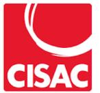
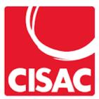
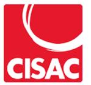
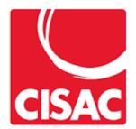
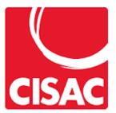
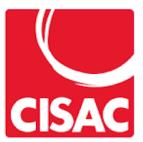

# Request for Proposal

*Subject: Comprehensive audit and assessment of ISWC Application architecture and upgrade proposal*

Reference: ISWC Azure architecture audit and modernization study

| Version | Revision | Date       | Author             | Details                       |
|---------|----------|------------|--------------------|-------------------------------|
| 0       | 1        | 03/04/2025 | Yann Lebreuilly | Creation of draft doc.        |
| 0       | 2        | 08/04/2025 | Yann Lebreuilly | Details about cost Monitoring |
| 1       | 0        | 08/04/2025 | Yann Lebreuilly    | Circulation of the document   |
| 1       | 1        | 23/06/2025 | Yann Lebreuilly    | Deadline milestone removed    |

| 1. | Context and objectives4                     |  |
|----|---------------------------------------------|--|
| 2. | Scope of Work (SOW)4                        |  |
|    | A. Current-state architecture audit 5    |  |
|    | 1. Infrastructure and cloud services5       |  |
|    | 2. Application architecture5                |  |
|    | 3. Performance and workload review5         |  |
|    | 4. Codebase and pipeline audit5             |  |
|    | B. Upgrade proposal assessment5             |  |
|    | 1. Target architecture review5              |  |
|    | 2. Cost and licensing evaluation5           |  |
|    | 3. Feasibility and risk assessment6         |  |
|    | 4. Performance and scalability projections6 |  |
| 3. | Success Criteria6                           |  |
| 4. | Deliverables6                               |  |
| 5. | Timeline 6                               |  |
| 6. | Vendor response format6                     |  |
| 7. | Additional information7                     |  |
|    | Appendix 8                               |  |

# **1. Context and objectives**

The International Standard Musical Work Code (ISWC) is an internationally recognized, unique identifier for musical works, established under the ISO 15707 standard. Its primary purpose is to unambiguously identify musical compositions, facilitating efficient rights management and royalty distribution for creators, publishers, and collecting societies.

The ISWC System serves as the central platform for the assignment and management of these codes, ensuring accurate tracking and administration of musical works globally. By providing a standardized framework, it supports the seamless exchange of information among stakeholders in the music industry, thereby enhancing operational efficiency and transparency.

As part of its strategic initiative to enhance performance, resilience, and operational efficiency, the ISWC System is considering a significant upgrade of its current application environment. Presently hosted on Microsoft Azure, the proposed modernization includes transitioning from Business Critical to Azure SQL Hyperscale, a service tier designed to provide high performance, rapid scalability, and robust data management capabilities. This migration aims to accommodate the growing demands of the system and ensure its continued reliability and effectiveness in serving the global music community.

Specifically, the initiative aims to:

- Switch component-to-component communication from public networking to private networking
- Add a Layer 7 HTTP Web Application Firewall (WAF) to secure all web traffic
- Harden exposure for key interfaces:
	- o Public portal
	- o Agency portal
	- o APIs and API Developer Portal
- Upgrade the SQL database edition to Hyperscale SKU for better scalability and performance

This RFP invites you to conduct a structured, in-depth audit and assessment of both:

- The existing ISWC application environment (current-state analysis)
- The proposed target architecture (future-state evaluation)

The objective is to support a well-informed, risk-mitigated decision for our modernization roadmap.

# **2. Scope of Work (SOW)**

The following components are to be included in your analysis:

### **A. Current-state architecture audit**

#### **1. Infrastructure and cloud services**

- Inventory of current Azure resources (SQL DB, Databricks, Cosmos DB, etc.)
- Topology mapping: regions, zones, networking, security layers

#### **2. Application architecture**

- Logical and technical layering of the ISWC System platform
- Integration patterns (APIs, message queues, eventing, etc.)
- Data flows, security boundaries, authentication/authorization methods

#### **3. Performance and workload review**

- Database metrics: DTUs/vCores usage, latency, availability, replication
- Cosmos DB and Databricks consumption, workloads and patterns
- Peak load behaviors and potential bottlenecks

#### **4. Codebase and pipeline audit**

- Overview of code architecture and key modules
- Review of IaC (Infrastructure as Code) practices (Bicep, ARM, Terraform)
- CI/CD pipeline structure, environments management, and automation maturity

# **B. Upgrade proposal assessment**

### **1. Target architecture review**

- Deep-dive into the proposed Hyperscale SQL architecture (compute, storage, replicas)
- Proposed use of Cosmos DB and Databricks (units, clusters, scaling strategies)
- Proposed changes to networking, security, and cloud-native design
- Network architecture improvements (private networking, removal of public endpoints)
- WAF integration for all web-facing components (Layer 7 protections)

# **2. Cost and licensing evaluation**

- Comparative cost model: Business Critical vs Hyperscale (license, compute, storage)
- Reserved instance opportunity, elasticity analysis
- Cost monitoring: include insights and recommendations on how to monitor cloud cost drivers effectively, and possibly suggest the design of a future cost dashboard to improve visibility and tracking.

#### **3. Feasibility and risk assessment**

- Technical feasibility of migration paths (cold/hot, downtime, dependencies)
- Risk analysis: data loss, rollback scenarios, compatibility issues
- Impact on operations, teams, and workflows

#### **4. Performance and scalability projections**

- Estimated gains in scalability, resilience, and throughput
- Benchmarks or reference architectures to support conclusions

# **3. Success Criteria**

- The engagement will be considered successful if the vendor delivers:
- A clear understanding of current weaknesses or risks
- Evidence-based recommendations aligned with Azure best practices
- A measurable comparison of cost/performance for each proposed change
- Actionable migration steps with identified priorities

# **4. Deliverables**

You are expected to provide the following:

- Audit report of the current state (architecture, performance, pipelines)
- Evaluation report of the proposed upgrade (pros/cons, feasibility, risks)
- Comparison matrix: Current vs Target with annotated recommendations
- Executive summary: Decision-ready with clear guidance

# Optional :

- Cost model simulator (Excel/PowerBI) for budgetary evaluation
- Implementation roadmap draft (phasing, quick wins)

# **5. Timeline**

We expect the complete deliverables within 3 weeks from project kickoff. Please include a detailed timeline with key milestones and review checkpoints.

# **6. Vendor response format**

Please include the following in your response:

- Company profile and relevant experience (Azure expertise, SQL, Databricks, Cosmos DB, C#)
- Delivery methodology and proposed team
- Proposed work plan with duration and effort per phase
- Pricing (fixed-fee or estimated days/TJM)

# **7. Additional information**

- The current and target architectures will be shared under NDA.
- Access to technical stakeholders and environments can be arranged upon request.

# **Appendix**

