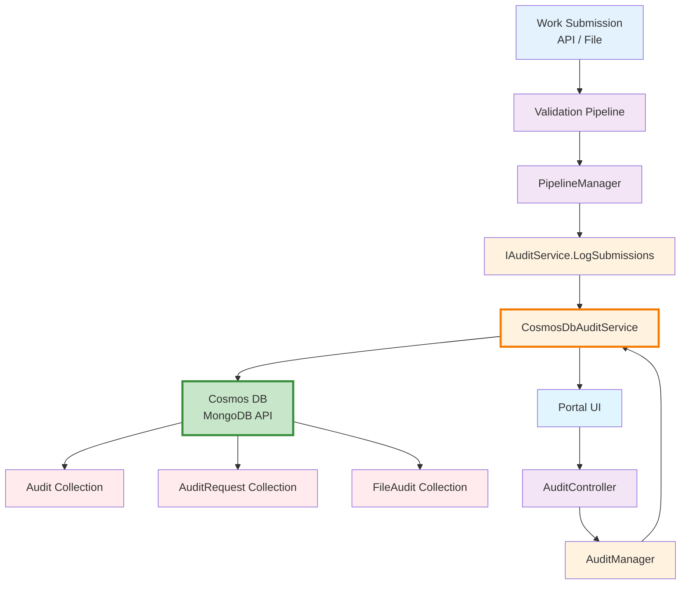
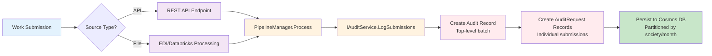

# Audit Logging - ISWC System Component Documentation

**Version:** 1.0
**Date:** 2025-10-27

---

## Sources

**Primary:**

- SPE_20190218_ISWCDataModel_REV (PM).md - Data Model Specification (Audit Schema)
- SPE_20191217_CISAC ISWC REST API.md - API Specification

**Secondary:**

- Workshop 2 - Documentation & Infrastructure (Oct 21, 2025)
- Workshop 1 - Audit (Oct 20, 2025)

**Tertiary:**

- 100+ source code files implementing Audit functionality

**Search Terms Used:**

- Primary: Audit, AuditRequest, AuditRequestTransaction
- Collections: Audit, AuditRequest, AuditRequestTransaction, FileAudit, AgencyStatistics
- Technical fields: auditId, sessionId, requestId, requestTransactionId, partitionKey
- Status tracking: isProcessingFinished, isProcessingError, processingCompletionDate
- Transaction details: transactionErrors, errorReasonCode, errorData, workIdBefore, workIdAfter
- Code interfaces: IAuditService, CosmosDbAuditService, AuditController, AuditManager
- Code models: AuditModel, AuditRequestModel, FileAuditModel, AgencyStatisticsModel
- Business terms: submission history, log data, transaction tracking, error tracking
- Related concepts: Cosmos DB, MongoDB, NoSQL, partition key, backup, retention

---

## Overview

The Audit Logging system is a comprehensive submission tracking and compliance component that records all work submissions, transactions, and processing outcomes in the ISWC database.

> **From [ISWC Data Model](../../resources/core_design_documents/SPE_20190218_ISWCDataModel_REV%20(PM)/SPE_20190218_ISWCDataModel_REV%20(PM).md) → Section 5 "Audit Schema":** "The Audit schema contains the audit data and is stored in Cosmos DB. Data in Cosmos DB is stored as collections of JSON objects. A collection is the equivalent of a table in an SQL database."

The system provides complete audit trails for all ISWC submissions, enabling agencies to track their submission history, investigate errors, and generate compliance reports.

---

## Primary Purpose

**Official Purpose from Specifications:**

> **From [ISWC Data Model](../../resources/core_design_documents/SPE_20190218_ISWCDataModel_REV%20(PM)/SPE_20190218_ISWCDataModel_REV%20(PM).md) → Section 1.2 "Design goals for the new ISWC data model":** "The Audit tables are stored in a more scalable way using Cosmos DB"

> **From [ISWC Data Model](../../resources/core_design_documents/SPE_20190218_ISWCDataModel_REV%20(PM)/SPE_20190218_ISWCDataModel_REV%20(PM).md) → Section 2.3.2 "Scaling for large data volumes":** "Log data, however, currently has 822 million rows in the existing database and has had to be manually partitioned across multiple tables for performance and maintenance reasons. In the new solution this audit data will be stored in Cosmos DB using the Society Code and Created Date as a partition key."

**Key Capabilities:**

1. **Complete Submission History** - Track all work submissions from agencies, publishers, and labels
2. **Transaction-Level Tracking** - Record every transaction (CAR, CUR, CDR, MER, DMR) with full context
3. **Error Tracking** - Capture validation errors, matching failures, and processing exceptions
4. **Compliance Reporting** - Generate audit reports for regulatory compliance and agency transparency
5. **High-Volume Scalability** - Handle 822+ million audit records with automatic partitioning

**Role in ISWC Architecture:**

- **Audit Trail System** - Primary compliance and debugging facility
- **Submission History Provider** - Powers Portal UI submission history views
- **Report Data Source** - Feeds analytical and statistical reports
- **Scalability Solution** - Handles massive data volumes beyond SQL Server practical limits

---

## Technical Architecture

### Infrastructure Components

**Azure Services:**

- **Azure Cosmos DB** - NoSQL database with MongoDB API for audit storage
- **Azure Key Vault** - Stores Cosmos DB connection strings
- **Azure Storage** - Parquet export storage for reporting
- **Azure Functions** - Background jobs for audit processing
- **Application Insights** - Monitoring and performance metrics

**Technology Stack:**

- **Database**: Cosmos DB with MongoDB API
- **Data Format**: JSON documents in collections
- **Partitioning Strategy**: Society Code + Month (format: XXXDDD)
- **Initial Throughput**: 1,000 RU (Request Units)
- **Backup**: Every 4 hours, 2 backups retained (8-hour recovery window)
- **C# SDK**: Microsoft.Azure.Cosmos
- **Python SDK**: pymongo

### Storage and Data Persistence

**Configuration:**

> **From [ISWC Data Model](../../resources/core_design_documents/SPE_20190218_ISWCDataModel_REV%20(PM)/SPE_20190218_ISWCDataModel_REV%20(PM).md) → Section 2.3 "Scalability":** "An initial value of 1,000 RU (Request Units) will be provisioned."

**Backup Strategy:**

> **From [ISWC Data Model](../../resources/core_design_documents/SPE_20190218_ISWCDataModel_REV%20(PM)/SPE_20190218_ISWCDataModel_REV%20(PM).md) → Section 2.4 "Backup and recovery":** "Azure Cosmos DB automatically takes a backup of the database every 4 hours and at any one point in time, only the latest 2 backups are stored. For recovery within the 8 hours, Azure support will be contacted to restore the data from backup."

### Integration Points

**Upstream Dependencies:**

- **API Layer** (Api.Agency, Api.Publisher, Api.Label, Api.ThirdParty) - Creates audit logs via PipelineManager
- **Databricks Jobs** - Batch file processing generates audit records
- **EDI Parser** - File-based submission processing writes audit data
- **Azure Functions** - Background processing jobs log operations

**Downstream Dependencies:**

- **Agency Portal** - Displays submission history to agencies
- **Public Portal** - Read-only access to submission data
- **Reporting System** - Generates statistical and compliance reports
- **Data Factory** - Exports audit data for analytics

---

## How It Works

### High-Level Architecture



### Detailed Data Flow

#### 1. Audit Logging Flow (Write Path)



**Audit Logging Steps:**

1. **Submission Entry** - Work submitted via API (CAR/CUR/CDR) or file (EDI batch)
2. **Pipeline Processing** - Validation, matching, and eligibility rules applied
3. **Audit Service Invocation** - `PipelineManager` calls `IAuditService.LogSubmissions()`
4. **Batch Record Creation** - Creates top-level `Audit` document with:
   - Unique `auditId`
   - `sessionId` for grouping related submissions
   - `societyCode` (agency identifier)
   - `batchSize` (number of submissions)
5. **Request Record Creation** - For each submission, creates `AuditRequest` document with:
   - Processing status (`isProcessingFinished`, `isProcessingError`)
   - Transaction details (workIdBefore, workIdAfter, transactionType)
   - Complete work metadata (titles, contributors, ISWCs)
   - Validation/matching rules applied
   - Error details if any
6. **Partitioned Storage** - Documents partitioned by `XXXDDD` key (society code + month)

#### 2. Submission History Query (Read Path)

```mermaid
flowchart LR
    A[Portal User] --> B[Search Submission History]
    B --> C[AuditController.Search]
    C --> D[AuditManager]
    D --> E[IAuditService.Search]
    E --> F[Query Cosmos DB<br/>By ISWC or WorkNumber]
    F --> G[Return Results<br/>with Pagination]
    G --> H[Display in Portal Grid]

    style A fill:#e1f5fe
    style B fill:#e1f5fe
    style C fill:#f3e5f5
    style D fill:#fff3e0
    style E fill:#fff3e0
    style F fill:#c8e6c9
    style G fill:#ffebee
    style H fill:#e1f5fe
```



**Query Flow Steps:**

1. **User Search** - Agency user searches by ISWC, society work code, or date range
2. **Controller Handling** - `AuditController` receives request
3. **Business Logic** - `AuditManager` validates search parameters
4. **Service Query** - `CosmosDbAuditService.Search()` executes Cosmos DB query
5. **Pagination** - Results returned with continuation tokens for large result sets
6. **Display** - Portal renders submission history grid with status, dates, errors

---

## File/Data Formats

### Partition Key Format

**Pattern:** `XXXDDD`

> **From [ISWC Data Model](../../resources/core_design_documents/SPE_20190218_ISWCDataModel_REV%20(PM)/SPE_20190218_ISWCDataModel_REV%20(PM).md) → Section 5.1 "Audit":** "Will be formatted as XXXDDD where XXX is the SocietyCode and DDD the month of the CreatedDate e.g. Society 222 and Created Date in January gives PK = 2221"

- `XXX` = Society Code (3 digits, zero-padded)
- `DDD` = Month of Created Date (1-12, zero-padded to 3 digits)

**Examples:**

- Society 35, January → `0351`
- Society 222, December → `22212`
- Society 315, June → `3156`

### Collection Schemas

#### Audit Collection (Top-Level Batch)

**Purpose:** Stores batch-level metadata for submissions

**Schema from Specification:**

```json
{
  "partitionKey": "351",
  "auditId": 8700795503,
  "sessionId": "01012019163127-sync",
  "societyCode": 35,
  "senderName": "WEBSERVICE",
  "createdDate": "2019-01-01T16:31:27.000Z",
  "lastModifiedDate": "2019-01-01T16:31:27.000Z",
  "lastModifiedUser": "WEBSERVICE"
}
```

**Fields:**

| Field | Type | Required | Description | Implementation Status |
|-------|------|----------|-------------|----------------------|
| partitionKey | String | Yes | Partition key (XXXDDD format) | ✅ Implemented in AuditModel.cs |
| auditId | Number (Guid in code) | Yes | Unique audit batch identifier | ✅ Implemented (changed to Guid) |
| sessionId | String | Yes | Session identifier for grouping | ⚠️ Not in current AuditModel |
| societyCode | Number (String in code) | Yes | CISAC society/agency code | ✅ Implemented as AgencyCode |
| senderName | String | Yes | Sender system identifier | ⚠️ Not in current AuditModel |
| createdDate | ISO 8601 String | Yes | Creation timestamp | ✅ Implemented |
| lastModifiedDate | ISO 8601 String | Yes | Last modification timestamp | ⚠️ Not in current AuditModel |
| lastModifiedUser | String | Yes | Last modifying user | ⚠️ Not in current AuditModel |
| batchSize | Number | No | Number of submissions in batch | ✅ Implemented (added field) |

#### AuditRequest Collection (Submission-Level Detail)

**Purpose:** Stores individual submission processing details

**Schema from Specification:**

```json
{
  "partitionKey": "351",
  "requestId": 33704768964,
  "auditId": 8700795503,
  "recordId": 1,
  "groupId": 1,
  "societyCode": "35",
  "isProcessingFinished": true,
  "isProcessingError": true,
  "processingCompletionDate": "2019-01-01T16:31:27.000Z",
  "createdDate": "2019-01-01T16:31:27.000Z",
  "lastUpdatedDate": "2019-01-01T16:31:27.000Z",
  "lastUpdatedUser": "WEBSERVICE"
}
```

**Fields:**

| Field | Type | Required | Description | Implementation Status |
|-------|------|----------|-------------|----------------------|
| partitionKey | String | Yes | Partition key (XXXDDD format) | ✅ Implemented |
| requestId | Number (Guid in code) | Yes | Unique request identifier | ✅ Implemented as AuditRequestId |
| auditId | Number (Guid in code) | Yes | Parent audit batch ID | ✅ Implemented |
| recordId | Number | Yes | Record number in batch | ✅ Implemented |
| groupId | Number | Yes | Request group identifier | ⚠️ Not in current model |
| societyCode | String | Yes | CISAC society identifier | ✅ Implemented as AgencyCode |
| isProcessingFinished | Boolean | No | Processing completion flag | ✅ Implemented |
| isProcessingError | Boolean | No | Error flag | ✅ Implemented |
| processingCompletionDate | ISO 8601 String | No | Completion timestamp | ✅ Implemented |
| createdDate | ISO 8601 String | Yes | Creation timestamp | ✅ Implemented |
| lastModifiedDate | ISO 8601 String | Yes | Last modification timestamp | ⚠️ Not in current model |
| lastModifiedUser | String | Yes | Last modifying user | ⚠️ Not in current model |

**Extended Fields in Implementation:**

The actual implementation in [AuditRequestModel.cs](../../resources/source-code/ISWC/src/Data/Services/Audit/CosmosDb/Models/AuditRequestModel.cs) includes additional fields beyond the specification:

- `RulesApplied` - Collection of validation/matching rules executed
- `WorkIdBefore` - Work ID before transaction
- `WorkIdAfter` - Work ID after transaction
- `TransactionError` - Detailed error/rejection information
- `IswcStatus` - Status of ISWC allocation
- `Work` - Complete submission model with titles, contributors, ISWCs
- `TransactionType` - Type of transaction (CAR, CUR, CDR, MER, DMR, etc.)
- `WorkflowInstanceId` - Associated workflow instance
- `TransactionSource` - Source of transaction (Agency, Publisher, Label, etc.)
- `IsEligible` - ISWC eligibility flag
- `RequestSource` - Request source details
- `AgentVersion` - Client agent version
- `MultipleAgencyWorkCodes` - Multiple agency work code tracking

#### AuditRequestTransaction Collection

**Purpose:** Stores transaction-level details with work snapshots

> **From [ISWC Data Model](../../resources/core_design_documents/SPE_20190218_ISWCDataModel_REV%20(PM)/SPE_20190218_ISWCDataModel_REV%20(PM).md) → Section 5.3 "AuditRequestTransaction":** "The AuditRequestTransaction collection stores the log data for individual transactions."

**Key Fields:**

- `requestTransactionId` - Unique transaction identifier
- `requestId` - Parent request reference
- `requestType` - Transaction type (CAR, CUR, CDR, etc.)
- `workIdBefore` - Work state before transaction
- `workIdAfter` - Work state after transaction
- `transactionSequence` - Order of transaction execution
- `transactionErrors` - Array of error objects
- `work` - Complete work metadata snapshot (AuditRequestWork object)

**Nested Objects:**

- **AuditRequestTransactionError** - Error details (errorReasonCode, errorData, timestamps)
- **AuditRequestWork** - Complete work snapshot (titles, contributors, ISWCs, category, posted date)

---

## Integration with Other Components

### Upstream Dependencies

**What Audit Logging depends on:**

- **Azure Key Vault** - Connection strings for Cosmos DB
- **Validation Pipeline** - Provides processed submission data to log
- **Matching Engine** - Matching results included in audit logs
- **IPI Service** - Contributor data enrichment for audit records
- **Workflow Engine** - Workflow instance IDs for tracking

### Downstream Dependencies

**What depends on Audit Logging:**

- **Agency Portal** - Primary consumer of submission history
  > **From [Workshop 2](../../meetings/20251021-ISWC%20Audit%20-%20Workshop%202%20-%20Documentations%20and%20infrastructure.txt) (Line 165, Mark Stadler):** "So if you look at the Cisac portal, and if you look at the submission history of an Cisac for different works, we store that in Cosmos DB."
- **Reporting System** - Generates statistical reports from audit data
- **Public Portal** - Read-only submission views for rightsholders
- **Data Analytics** - Business intelligence and trend analysis
- **Compliance Audits** - Regulatory reporting and verification

### Related Components

**Direct Integration:**

- **Cosmos DB Infrastructure** - Database platform (see [CosmosDB.md](./CosmosDB.md))
- **SQL Server** - Complementary relational storage for current state
- **Application Insights** - Performance monitoring and diagnostics
- **Azure Functions** - Background processing of agency statistics

### System Architecture Position

Audit Logging operates as a cross-cutting concern integrated throughout the entire ISWC submission pipeline:

- **API Layer** → Writes audit logs after submission processing
- **File Processing** → Databricks/EDI parser logs batch submissions
- **Portal UI** → Reads and displays submission history
- **Reporting** → Queries audit data for statistics

---

## Use Cases

### 1. Agency Submission History Tracking

**Business Scenario:** An agency needs to view all submissions for a specific work to investigate processing status.

**Workflow:**

1. Agency user logs into ISWC Portal
2. Navigates to "Submission History" section
3. Searches by ISWC code (e.g., T-123.456.789-0) or society work code
4. System queries `AuditRequest` collection filtered by ISWC/work number
5. Portal displays grid showing:
   - Submission date/time
   - Transaction type (CAR/CUR/CDR)
   - Processing status (Success/Error)
   - Validation errors (if any)
   - Matched ISWC (if successful)
   - Work metadata (titles, contributors)

**Real-World Value:**

- Enables agencies to track submission lifecycles end-to-end
- Provides transparency into ISWC allocation decisions
- Facilitates error investigation and re-submission

**Code Implementation:**

- Portal UI: [SubmissionHistory.tsx](../../resources/source-code/ISWC/src/Portal/ClientApp/src/routes/Search/SubmissionHistory/SubmissionHistory.tsx)
- API: [AuditController.Search()](../../resources/source-code/ISWC/src/Portal/Controllers/AuditController.cs)
- Service: [CosmosDbAuditService.Search()](../../resources/source-code/ISWC/src/Data/Services/Audit/CosmosDb/CosmosDbAuditService.cs)

### 2. Error Analysis and Debugging

**Business Scenario:** A batch file submission from an agency resulted in 80% errors. Technical team needs to analyze error patterns.

**Workflow:**

1. File processed via Databricks EDI parser
2. Each submission logged to `AuditRequest` with transaction errors
3. Technical analyst queries `FileAudit` collection by `sessionId`
4. System aggregates error codes and frequencies
5. Report shows:
   - Most common error: "2014.1003 - Not ISWC eligible" (45 occurrences)
   - Second error: "2014.1005 - Missing contributor" (19 occurrences)
   - Success rate: 20% (16 out of 80 submissions)

**Real-World Value:**

- Identifies systemic data quality issues
- Guides agency remediation efforts
- Reduces support ticket volume through self-service error analysis

**Code Implementation:**

- Background Job: [ProcessAuditJob.cs](../../resources/source-code/ISWC/src/Jobs/Functions/ProcessAuditJob.cs)
- Report UI: [FileSubmissionAudit.tsx](../../resources/source-code/ISWC/src/Portal/ClientApp/src/routes/Reports/FileSubmissionAudit/FileSubmissionAudit.tsx)
- Service: [IAuditService.SearchFileAudit()](../../resources/source-code/ISWC/src/Data/Services/Audit/IAuditService.cs)

### 3. Compliance and Statistical Reporting

**Business Scenario:** CISAC management needs monthly statistics on agency submission volumes, success rates, and processing times.

**Workflow:**

1. Azure Function `ProcessAgencyStatisticsJob` runs daily
2. Queries `AuditRequest` collection with high watermark tracking
3. Aggregates statistics by agency and month:
   - Total submissions
   - Success count / error count
   - Average processing time
   - Most common transaction types
4. Persists to `AgencyStatistics` collection
5. Report UI queries aggregated data for dashboard display

**Real-World Value:**

- Provides executive visibility into system usage
- Identifies high-volume agencies for capacity planning
- Tracks submission quality trends over time

**Code Implementation:**

- Background Job: [ProcessAgencyStatisticsJob.cs](../../resources/source-code/ISWC/src/Jobs/Functions/ProcessAgencyStatisticsJob.cs)
- Service Method: [IAuditService.GenerateAgencyStatistics()](../../resources/source-code/ISWC/src/Data/Services/Audit/IAuditService.cs)
- Report UI: [SubmissionAudit.tsx](../../resources/source-code/ISWC/src/Portal/ClientApp/src/routes/Reports/SubmissionAudit/SubmissionAudit.tsx)

### 4. High-Volume Scalability

**Business Scenario:** Handle 822+ million audit records with consistent query performance.

**Workflow:**

1. Each submission creates 1-3 audit documents (Audit + AuditRequest + optional AuditRequestTransaction)
2. Cosmos DB automatically partitions by `XXXDDD` key
3. Queries scoped to specific society + month partition for optimal performance
4. Background jobs process partition-by-partition to avoid hotspots
5. Pagination with continuation tokens for large result sets (10,000+ records)

**Real-World Value:**

- Eliminates manual partitioning required in previous system
- Maintains sub-second query performance at massive scale
- Enables unlimited historical data retention

**Code Implementation:**

- Partition Strategy: [AuditModel.PartitionKey](../../resources/source-code/ISWC/src/Data/Services/Audit/CosmosDb/Models/AuditModel.cs)
- Pagination: [ContinuationToken.cs](../../resources/source-code/ISWC/src/Data/Services/Audit/CosmosDb/Models/ContinuationToken.cs)
- Query Optimization: [CosmosDbRepository.cs](../../resources/source-code/ISWC/src/Framework/CosmosDb/Repositories/CosmosDbRepository.cs)

---

## Workflow Details

### Submission Processing with Audit Logging

**Process Flow:**

1. **Submission Receipt**
   - API endpoint receives work submission JSON
   - `PipelineManager` creates `Submission` object
   - Assigns unique `auditId` (Guid)

2. **Validation Phase**
   - Initial Validation (IV) rules execute
   - Metadata Standardization (MD) rules apply
   - All rule executions tracked in `RulesApplied` collection

3. **Matching Phase**
   - Matching Engine searches for duplicate works
   - Matching (MAT) rules determine ISWC allocation
   - Match results stored in audit log

4. **Audit Logging**
   - `IAuditService.LogSubmissions()` called
   - Creates `Audit` batch record (if first submission in batch)
   - Creates `AuditRequest` for each submission with:
     - Complete work metadata
     - Processing status
     - Validation/matching rules applied
     - Error details (if any)
     - ISWC allocation outcome

5. **Response to Client**
   - API returns submission result
   - Includes `auditId` for future reference

### Error Handling Mechanisms

**Validation Error Capture:**

> **From [ISWC REST API](../../resources/core_design_documents/SPE_20191217_CISAC%20ISWC%20REST%20API/SPE_20191217_CISAC%20ISWC%20REST%20API.md) → Section 5 "Understanding Common Error Codes":** "The following table provides the most common error codes and descriptions cross referenced with the underlying business rule(s) responsible for triggering them."

**Error Storage:**

- Validation errors stored in `TransactionError.RejectionReasons`
- Each error includes:
  - `errorReasonCode` (e.g., "2014.1003")
  - `errorData` (additional context)
  - Rule ID that triggered error
  - Severity level

**Error Types:**

- **Initial Validation (IV)** - Format/structure errors
- **Eligibility (EL)** - ISWC eligibility violations
- **Metadata (MD)** - Standardization failures
- **Matching (MAT)** - Matching logic issues
- **Post-Matching Validation (PV)** - Post-match validation errors

### Edge Cases and Special Conditions

**1. Batch Submission Partial Failures:**

- If 1 of 100 submissions in batch fails:
  - Successful submissions receive ISWCs
  - Failed submission logged with error details
  - Batch marked as partially successful
  - Agency can re-submit failed records

**2. Duplicate Submission Detection:**

- System checks for duplicate `sessionId` + `recordId`
- If duplicate detected:
  - Returns existing audit record
  - Does not re-process submission
  - Prevents duplicate ISWC allocation

**3. Cosmos DB Write Failures:**

- If audit logging fails (rare):
  - Transaction still completes in SQL Server
  - Error logged to Application Insights
  - Background job retries audit logging
  - Ensures eventual consistency

**4. Partition Hotspots:**

- If one agency submits 10,000 works in same month:
  - All audit records share same partition key
  - Cosmos DB auto-scales RU for partition
  - Continuation tokens used for pagination
  - Background jobs process in smaller batches

---

## Source Code References

### C# Framework & CosmosDB Core

**Framework Layer** (`src/Framework/CosmosDb/`)

- [CosmosDbOptions.cs](../../resources/source-code/ISWC/src/Framework/CosmosDb/CosmosDbOptions.cs) - Configuration options (DatabaseId)
- [CosmosDbRepository.cs](../../resources/source-code/ISWC/src/Framework/CosmosDb/Repositories/CosmosDbRepository.cs) - Generic repository pattern for Cosmos DB operations
- [ICosmosDbRepository.cs](../../resources/source-code/ISWC/src/Framework/CosmosDb/Repositories/ICosmosDbRepository.cs) - Repository interface
- [BaseModel.cs](../../resources/source-code/ISWC/src/Framework/CosmosDb/Models/BaseModel.cs) - Base model for all Cosmos DB documents

### Data Services - Audit

**Audit Service** (`src/Data/Services/Audit/`)

- [IAuditService.cs](../../resources/source-code/ISWC/src/Data/Services/Audit/IAuditService.cs) - Audit service interface (LogSubmissions, Search, Report methods)
- [CosmosDbAuditService.cs](../../resources/source-code/ISWC/src/Data/Services/Audit/CosmosDb/CosmosDbAuditService.cs) - Main audit logging service implementation (350+ lines)

**Audit Models** (`src/Data/Services/Audit/CosmosDb/Models/`)

- [AuditModel.cs](../../resources/source-code/ISWC/src/Data/Services/Audit/CosmosDb/Models/AuditModel.cs) - Top-level batch audit model
- [AuditRequestModel.cs](../../resources/source-code/ISWC/src/Data/Services/Audit/CosmosDb/Models/AuditRequestModel.cs) - Individual submission audit model
- [FileAuditModel.cs](../../resources/source-code/ISWC/src/Data/Services/Audit/CosmosDb/Models/FileAuditModel.cs) - File processing audit model
- [AgencyStatisticsModel.cs](../../resources/source-code/ISWC/src/Data/Services/Audit/CosmosDb/Models/AgencyStatisticsModel.cs) - Agency statistics aggregation
- [ContinuationToken.cs](../../resources/source-code/ISWC/src/Data/Services/Audit/CosmosDb/Models/ContinuationToken.cs) - Paging support for large result sets
- [ContinuationTokenRange.cs](../../resources/source-code/ISWC/src/Data/Services/Audit/CosmosDb/Models/ContinuationTokenRange.cs) - Token range for parallel queries

**Business Data Objects (Audit)** (`src/Bdo/`)

- [AuditHistoryResult.cs](../../resources/source-code/ISWC/src/Bdo/Audit/AuditHistoryResult.cs) - DTO for submission history queries
- [AuditReportResult.cs](../../resources/source-code/ISWC/src/Bdo/Reports/AuditReportResult.cs) - Audit report data structure
- [AuditReportSearchParameters.cs](../../resources/source-code/ISWC/src/Bdo/Reports/AuditReportSearchParameters.cs) - Search criteria for audit reports
- [FileAuditReportResult.cs](../../resources/source-code/ISWC/src/Bdo/Reports/FileAuditReportResult.cs) - File submission audit report
- [ReportType.cs](../../resources/source-code/ISWC/src/Bdo/Reports/ReportType.cs) - Enumeration of report types

### Business Layer

**Managers** (`src/Business/Managers/`)

- [AuditManager.cs](../../resources/source-code/ISWC/src/Business/Managers/AuditManager.cs) - Business logic for audit operations (search, reporting)
- [ReportManager.cs](../../resources/source-code/ISWC/src/Business/Managers/ReportManager.cs) - Report generation from audit data
- [WorkManager.cs](../../resources/source-code/ISWC/src/Business/Managers/WorkManager.cs) - Uses audit service for work tracking
- [WorkflowManager.cs](../../resources/source-code/ISWC/src/Business/Managers/WorkflowManager.cs) - Workflow audit integration

### API Controllers

**Audit Controllers** (across all API projects)

- [Api.Agency/Controllers/AuditController.cs](../../resources/source-code/ISWC/src/Api.Agency/Controllers/AuditController.cs) - Agency audit endpoints (GET /api/audit/search)
- [Api.Publisher/Controllers/AuditController.cs](../../resources/source-code/ISWC/src/Api.Publisher/Controllers/AuditController.cs) - Publisher audit endpoints
- [Api.Label/Controllers/AuditController.cs](../../resources/source-code/ISWC/src/Api.Label/Controllers/AuditController.cs) - Label audit endpoints
- [Api.ThirdParty/Controllers/AuditController.cs](../../resources/source-code/ISWC/src/Api.ThirdParty/Controllers/AuditController.cs) - Third party audit endpoints
- [Portal/Controllers/AuditController.cs](../../resources/source-code/ISWC/src/Portal/Controllers/AuditController.cs) - Portal audit endpoints
- [Portal/Controllers/ReportController.cs](../../resources/source-code/ISWC/src/Portal/Controllers/ReportController.cs) - Report generation endpoints

**Pipeline Integration** (`src/Api.*/Managers/`)

- [Api.Agency/Managers/PipelineManager.cs](../../resources/source-code/ISWC/src/Api.Agency/Managers/PipelineManager.cs) - Calls IAuditService.LogSubmissions()
- [Api.Publisher/Managers/PipelineManager.cs](../../resources/source-code/ISWC/src/Api.Publisher/Managers/PipelineManager.cs) - Publisher pipeline audit logging
- [Api.Label/Managers/PipelineManager.cs](../../resources/source-code/ISWC/src/Api.Label/Managers/PipelineManager.cs) - Label pipeline audit logging
- [Api.ThirdParty/Managers/PipelineManager.cs](../../resources/source-code/ISWC/src/Api.ThirdParty/Managers/PipelineManager.cs) - Third party pipeline audit logging

### Configuration & Dependency Injection

**DI Registration** (`src/*/AutofacModule.cs` and `Extensions/`)

- [Data/AutofacModule.cs](../../resources/source-code/ISWC/src/Data/AutofacModule.cs) - Registers IAuditService → CosmosDbAuditService
- [Business/AutofacModule.cs](../../resources/source-code/ISWC/src/Business/AutofacModule.cs) - Registers AuditManager
- [Api.*/Extensions/ServiceCollectionExtensions.cs](../../resources/source-code/ISWC/src/Api.Agency/Extensions/ServiceCollectionExtensions.cs) - Service collection setup
- [Portal/Extensions/ServiceCollectionExtensions.cs](../../resources/source-code/ISWC/src/Portal/Extensions/ServiceCollectionExtensions.cs) - Portal DI configuration
- [Jobs/Extensions/ServiceCollectionExtensions.cs](../../resources/source-code/ISWC/src/Jobs/Extensions/ServiceCollectionExtensions.cs) - Background job DI

**Mapping Configuration**

- [Data/MappingProfile.cs](../../resources/source-code/ISWC/src/Data/MappingProfile.cs) - AutoMapper configuration for Audit models to DTOs

### Python Integration (Databricks & Jobs)

**EDI File Processing** (`src/Integration/Edi/ediparser/`)

- [parser/services/cosmos_service.py](../../resources/source-code/ISWC/src/Integration/Edi/ediparser/parser/services/cosmos_service.py) - Python Cosmos DB client for EDI audit logging
- [parser/services/logger_service.py](../../resources/source-code/ISWC/src/Integration/Edi/ediparser/parser/services/logger_service.py) - Logging service for EDI processing
- [parser/services/reporting_service.py](../../resources/source-code/ISWC/src/Integration/Edi/ediparser/parser/services/reporting_service.py) - EDI audit reporting
- [process_file.py](../../resources/source-code/ISWC/src/Integration/Edi/ediparser/process_file.py) - Main EDI file processing script

**Generic Jobs** (`src/Integration/GenericJob/generic_job/`)

- [main_processauditjob.py](../../resources/source-code/ISWC/src/Integration/GenericJob/generic_job/main_processauditjob.py) - Python audit processing job
- [services/cosmos_service.py](../../resources/source-code/ISWC/src/Integration/GenericJob/generic_job/services/cosmos_service.py) - Python Cosmos DB service
- [services/audit_request_service.py](../../resources/source-code/ISWC/src/Integration/GenericJob/generic_job/services/audit_request_service.py) - Audit request processing logic
- [schemas/audit_request_schema.py](../../resources/source-code/ISWC/src/Integration/GenericJob/generic_job/schemas/audit_request_schema.py) - Audit data schemas (Marshmallow)
- [services/logger_service.py](../../resources/source-code/ISWC/src/Integration/GenericJob/generic_job/services/logger_service.py) - Job logging service
- [services/change_tracker_service.py](../../resources/source-code/ISWC/src/Integration/GenericJob/generic_job/services/change_tracker_service.py) - High watermark tracking
- [models/high_watermark_type.py](../../resources/source-code/ISWC/src/Integration/GenericJob/generic_job/models/high_watermark_type.py) - High watermark enumeration

**Reporting** (`src/Reporting/reporting/`)

- [services/audit_reader_service.py](../../resources/source-code/ISWC/src/Reporting/reporting/services/audit_reader_service.py) - Reads audit data for reports
- [services/parquet_reporting_service.py](../../resources/source-code/ISWC/src/Reporting/reporting/services/parquet_reporting_service.py) - Parquet export of audit data
- [reports/creator_report.py](../../resources/source-code/ISWC/src/Reporting/reporting/reports/creator_report.py) - Creator-focused reports
- [reports/report_output.py](../../resources/source-code/ISWC/src/Reporting/reporting/reports/report_output.py) - Report output handling
- [main_report.py](../../resources/source-code/ISWC/src/Reporting/reporting/main_report.py) - Main reporting entry point

### Azure Jobs/Functions

**Background Jobs** (`src/Jobs/Functions/`)

- [ProcessAuditJob.cs](../../resources/source-code/ISWC/src/Jobs/Functions/ProcessAuditJob.cs) - Scheduled audit processing (timer-triggered)
- [ProcessAgencyStatisticsJob.cs](../../resources/source-code/ISWC/src/Jobs/Functions/ProcessAgencyStatisticsJob.cs) - Daily agency statistics aggregation

**Job Startup**

- [Jobs/Startup.cs](../../resources/source-code/ISWC/src/Jobs/Startup.cs) - Azure Functions DI configuration

### Portal UI (React/TypeScript)

**Redux State Management** (`src/Portal/ClientApp/src/redux/`)

- [actions/SubmissionHistoryActions.ts](../../resources/source-code/ISWC/src/Portal/ClientApp/src/redux/actions/SubmissionHistoryActions.ts) - Action creators for submission history
- [actions/SubmissionHistoryActionTypes.ts](../../resources/source-code/ISWC/src/Portal/ClientApp/src/redux/actions/SubmissionHistoryActionTypes.ts) - Action type constants
- [reducers/SubmissionHistoryReducer.ts](../../resources/source-code/ISWC/src/Portal/ClientApp/src/redux/reducers/SubmissionHistoryReducer.ts) - State reducer
- [services/SubmissionHistoryService.ts](../../resources/source-code/ISWC/src/Portal/ClientApp/src/redux/services/SubmissionHistoryService.ts) - API client service
- [thunks/SubmissionHistoryThunks.ts](../../resources/source-code/ISWC/src/Portal/ClientApp/src/redux/thunks/SubmissionHistoryThunks.ts) - Async thunk operations
- [actions/ReportsActions.ts](../../resources/source-code/ISWC/src/Portal/ClientApp/src/redux/actions/ReportsActions.ts) - Report action creators
- [actions/ReportsActionTypes.ts](../../resources/source-code/ISWC/src/Portal/ClientApp/src/redux/actions/ReportsActionTypes.ts) - Report action types
- [reducers/ReportsReducer.ts](../../resources/source-code/ISWC/src/Portal/ClientApp/src/redux/reducers/ReportsReducer.ts) - Report state reducer
- [thunks/ReportsThunks.ts](../../resources/source-code/ISWC/src/Portal/ClientApp/src/redux/thunks/ReportsThunks.ts) - Report async operations

**UI Components** (`src/Portal/ClientApp/src/routes/`)

- [Search/SubmissionHistory/SubmissionHistory.tsx](../../resources/source-code/ISWC/src/Portal/ClientApp/src/routes/Search/SubmissionHistory/SubmissionHistory.tsx) - Submission history view component
- [Search/SubmissionHistory/SubmissionHistoryContainer.ts](../../resources/source-code/ISWC/src/Portal/ClientApp/src/routes/Search/SubmissionHistory/SubmissionHistoryContainer.ts) - Redux container
- [Search/SubmissionHistory/SubmissionHistoryTypes.ts](../../resources/source-code/ISWC/src/Portal/ClientApp/src/routes/Search/SubmissionHistory/SubmissionHistoryTypes.ts) - TypeScript type definitions
- [Reports/SubmissionAudit/SubmissionAudit.tsx](../../resources/source-code/ISWC/src/Portal/ClientApp/src/routes/Reports/SubmissionAudit/SubmissionAudit.tsx) - Submission audit report view
- [Reports/SubmissionAudit/SubmissionAuditContainer.ts](../../resources/source-code/ISWC/src/Portal/ClientApp/src/routes/Reports/SubmissionAudit/SubmissionAuditContainer.ts) - Redux container
- [Reports/SubmissionAudit/SubmissionAuditTypes.ts](../../resources/source-code/ISWC/src/Portal/ClientApp/src/routes/Reports/SubmissionAudit/SubmissionAuditTypes.ts) - Type definitions
- [Reports/SubmissionAudit/SubmissionAuditGrid/SubmissionAuditGrid.tsx](../../resources/source-code/ISWC/src/Portal/ClientApp/src/routes/Reports/SubmissionAudit/SubmissionAuditGrid/SubmissionAuditGrid.tsx) - Data grid component
- [Reports/SubmissionAudit/SubmissionAuditGrid/SubmissionAuditGridTypes.ts](../../resources/source-code/ISWC/src/Portal/ClientApp/src/routes/Reports/SubmissionAudit/SubmissionAuditGrid/SubmissionAuditGridTypes.ts) - Grid type definitions
- [Reports/SubmissionAudit/BarChart/BarChart.tsx](../../resources/source-code/ISWC/src/Portal/ClientApp/src/routes/Reports/SubmissionAudit/BarChart/BarChart.tsx) - Audit statistics chart
- [Reports/FileSubmissionAudit/FileSubmissionAudit.tsx](../../resources/source-code/ISWC/src/Portal/ClientApp/src/routes/Reports/FileSubmissionAudit/FileSubmissionAudit.tsx) - File submission audit report
- [Reports/FileSubmissionAudit/FileSubmissionAuditContainer.ts](../../resources/source-code/ISWC/src/Portal/ClientApp/src/routes/Reports/FileSubmissionAudit/FileSubmissionAuditContainer.ts) - Redux container
- [Reports/FileSubmissionAudit/FileSubmissionAuditTypes.ts](../../resources/source-code/ISWC/src/Portal/ClientApp/src/routes/Reports/FileSubmissionAudit/FileSubmissionAuditTypes.ts) - Type definitions
- [Reports/Reports.tsx](../../resources/source-code/ISWC/src/Portal/ClientApp/src/routes/Reports/Reports.tsx) - Reports landing page

**Unit Tests** (`src/Portal/ClientApp/src/__tests__/`)

- [redux/actions/SubmissionHistoryActions.spec.tsx](../../resources/source-code/ISWC/src/Portal/ClientApp/src/__tests__/redux/actions/SubmissionHistoryActions.spec.tsx) - Action tests
- [redux/reducers/SubmissionHistoryReducer.spec.tsx](../../resources/source-code/ISWC/src/Portal/ClientApp/src/__tests__/redux/reducers/SubmissionHistoryReducer.spec.tsx) - Reducer tests
- [redux/actions/ReportsActions.spec.tsx](../../resources/source-code/ISWC/src/Portal/ClientApp/src/__tests__/redux/actions/ReportsActions.spec.tsx) - Report action tests
- [redux/reducers/ReportsReducer.spec.tsx](../../resources/source-code/ISWC/src/Portal/ClientApp/src/__tests__/redux/reducers/ReportsReducer.spec.tsx) - Report reducer tests
- [routes/Reports/SubmissionAudit/SubmissionAudit.spec.tsx](../../resources/source-code/ISWC/src/Portal/ClientApp/src/__tests__/routes/Reports/SubmissionAudit/SubmissionAudit.spec.tsx) - Component tests
- [routes/Reports/SubmissionAudit/BarChart.spec.tsx](../../resources/source-code/ISWC/src/Portal/ClientApp/src/__tests__/routes/Reports/SubmissionAudit/BarChart.spec.tsx) - Chart component tests

**Type Definitions** (`src/Portal/ClientApp/src/redux/types/`)

- [IswcTypes.ts](../../resources/source-code/ISWC/src/Portal/ClientApp/src/redux/types/IswcTypes.ts) - Core ISWC type definitions
- [ReportTypes.ts](../../resources/source-code/ISWC/src/Portal/ClientApp/src/redux/types/ReportTypes.ts) - Report type definitions

**Configuration** (`src/Portal/ClientApp/src/`)

- [consts.ts](../../resources/source-code/ISWC/src/Portal/ClientApp/src/consts.ts) - Application constants (API endpoints)

**Localization** (`src/Portal/Configuration/`)

- [PortalStrings.en.resx](../../resources/source-code/ISWC/src/Portal/Configuration/PortalStrings.en.resx) - English strings (audit-related UI labels)
- [PortalStrings.fr.resx](../../resources/source-code/ISWC/src/Portal/Configuration/PortalStrings.fr.resx) - French strings
- [PortalStrings.es.resx](../../resources/source-code/ISWC/src/Portal/Configuration/PortalStrings.es.resx) - Spanish strings

### Database Objects

**SQL Server Integration** (`src/Database/`)

- [ISWC/Tables/csi_audit_req_work.sql](../../resources/source-code/ISWC/src/Database/ISWC/Tables/csi_audit_req_work.sql) - SQL table for audit work data synchronization
- [Migration/Stored Procedures/ISWC_csi_audit_req_work.sql](../../resources/source-code/ISWC/src/Database/Migration/Stored%20Procedures/ISWC_csi_audit_req_work.sql) - Migration stored procedure
- [Migration/User Defined Types/Azure_ISWC_csi_audit_req_work.sql](../../resources/source-code/ISWC/src/Database/Migration/User%20Defined%20Types/Azure_ISWC_csi_audit_req_work.sql) - User-defined table type
- [Database.sqlproj](../../resources/source-code/ISWC/src/Database/Database.sqlproj) - Database project file

**SQL Data Model** (`src/Data/DataModels/`)

- [CsiAuditReqWork.cs](../../resources/source-code/ISWC/src/Data/DataModels/CsiAuditReqWork.cs) - Entity Framework model for csi_audit_req_work table
- [CsiBaseContext.cs](../../resources/source-code/ISWC/src/Data/DataModels/CsiBaseContext.cs) - Database context including audit entities

### Reporting & Data Export

**Parquet Serialization** (`src/Data/Services/ReportingService/`)

- [Parquet/ParquetReportingService.cs](../../resources/source-code/ISWC/src/Data/Services/ReportingService/Parquet/ParquetReportingService.cs) - Exports audit data to Parquet format
- [Parquet/Serializers/AuditRequestModelSerializer.cs](../../resources/source-code/ISWC/src/Data/Services/ReportingService/Parquet/Serializers/AuditRequestModelSerializer.cs) - Serializes AuditRequestModel to Parquet
- [IReportingService.cs](../../resources/source-code/ISWC/src/Data/Services/ReportingService/IReportingService.cs) - Reporting service interface

### Key Patterns and Technologies

**Technology Stack:**

- **C# SDK**: Microsoft.Azure.Cosmos (latest SDK)
- **Python SDK**: pymongo (MongoDB driver for Databricks jobs)
- **API**: MongoDB API (not SQL API)
- **Repository Pattern**: Generic `ICosmosDbRepository<T>` for all collections
- **Dependency Injection**: Autofac and ASP.NET Core DI
- **Mapping**: AutoMapper for model/DTO conversion

**Design Patterns:**

- **Repository Pattern**: Centralized data access through `CosmosDbRepository<T>`
- **Service Layer Pattern**: Business logic isolated in `AuditManager` and `CosmosDbAuditService`
- **Interface Segregation**: Dedicated interfaces (`IAuditService`, `IReportingService`)
- **Async/Await**: All operations asynchronous for scalability
- **Continuation Tokens**: Pagination for large result sets (10,000+ records)
- **High Watermark Tracking**: Incremental processing for background jobs

**Configuration:**

- **Connection Strings**: Stored in Azure Key Vault
- **DatabaseId**: Configured via `CosmosDbOptions`
- **RU Provisioning**: Initially 1,000 RU, scalable based on load
- **Backup**: Every 4 hours, 2 backups retained (8-hour recovery window)

**Performance Optimizations:**

- **Partition Key Strategy**: Society code + month for optimal distribution
- **Selective Queries**: Always include partition key in queries
- **Async Operations**: Non-blocking I/O for high concurrency
- **Batch Operations**: Multiple submissions logged in single call
- **Background Processing**: Offload heavy processing to Azure Functions

---

## Questions for Further Investigation

- [x] ~~Are all fields from the specification implemented in code?~~ **ANSWERED:** No, implementation has evolved beyond spec. Several spec fields (sessionId, senderName, groupId, lastModifiedDate, lastModifiedUser) not present in current AuditModel/AuditRequestModel. However, implementation adds many additional fields (RulesApplied, TransactionType, WorkflowInstanceId, etc.) for enhanced functionality.
- [ ] What is the actual data volume in production Cosmos DB Audit collections?
- [ ] What is the current RU (Request Units) provisioning for Audit collections in production?
- [ ] How are audit records retained? Is there a TTL (Time-To-Live) policy?
- [ ] Is the AuditRequestTransaction collection still used, or has it been merged into AuditRequest?
- [ ] What is the average audit log write latency (p95, p99)?
- [ ] How are partition hotspots monitored and mitigated (e.g., one agency with 100k submissions/month)?
- [ ] What is the procedure for querying historical audit data beyond 8-hour backup retention?
- [ ] Are there any data archival strategies for old audit data (e.g., move to cold storage after 1 year)?
- [ ] How is the Cosmos DB connection string rotated without downtime?
- [ ] What monitoring/alerting exists for audit logging failures?
- [ ] What is the cost breakdown of Cosmos DB usage (storage vs throughput)?

---

## References

### Core Design Documents

- **[ISWC Data Model Specification](../../resources/core_design_documents/SPE_20190218_ISWCDataModel_REV%20(PM)/SPE_20190218_ISWCDataModel_REV%20(PM).md) → Section 5 "Audit Schema"** - Complete audit collection schemas and field definitions
- **[ISWC REST API Specification](../../resources/core_design_documents/SPE_20191217_CISAC%20ISWC%20REST%20API/SPE_20191217_CISAC%20ISWC%20REST%20API.md) → Section 5 "Understanding Common Error Codes"** - Error code catalog for audit logging
- **[MVP Validation Rules](../../resources/core_design_documents/SPE_20190424_MVPValidationRules/SPE_20190424_MVPValidationRules.md)** - Validation rules tracked in audit logs
- **[MVP Matching Rules](../../resources/core_design_documents/SPE_20190424_MVPMatchingRules/SPE_20190424_MVPMatchingRules.md)** - Matching rules tracked in audit logs
- **[ISWC Reporting Specification](../../resources/core_design_documents/SPE_20200602_ISWC_Reporting/SPE_20200602_ISWC_Reporting.md)** - Audit-based reporting requirements

### Meeting Transcripts

- **[Workshop 2 - Documentation & Infrastructure](../../meetings/20251021-ISWC%20Audit%20-%20Workshop%202%20-%20Documentations%20and%20infrastructure.txt) (Oct 21, 2025)** - Submission history use case and architecture discussion
- **[Workshop 1 - Audit](../../meetings/20251020-ISWC%20Audit%20-%20Workshop%201.txt) (Oct 20, 2025)** - Audit project kickoff

### Key Information Sources

- **[ISWC Data Model](../../resources/core_design_documents/SPE_20190218_ISWCDataModel_REV%20(PM)/SPE_20190218_ISWCDataModel_REV%20(PM).md) → Section 2 "Database Technology"** - Cosmos DB selection rationale
- **[ISWC Data Model](../../resources/core_design_documents/SPE_20190218_ISWCDataModel_REV%20(PM)/SPE_20190218_ISWCDataModel_REV%20(PM).md) → Section 2.3.2 "Scaling for large data volumes"** - 822 million row scalability requirement
- **[ISWC Data Model](../../resources/core_design_documents/SPE_20190218_ISWCDataModel_REV%20(PM)/SPE_20190218_ISWCDataModel_REV%20(PM).md) → Section 2.4 "Backup and recovery"** - Backup strategy (4-hour interval, 2 backups)
- **[ISWC Data Model](../../resources/core_design_documents/SPE_20190218_ISWCDataModel_REV%20(PM)/SPE_20190218_ISWCDataModel_REV%20(PM).md) → Section 5.1 "Audit"** - Audit collection schema
- **[ISWC Data Model](../../resources/core_design_documents/SPE_20190218_ISWCDataModel_REV%20(PM)/SPE_20190218_ISWCDataModel_REV%20(PM).md) → Section 5.2 "AuditRequest"** - AuditRequest collection schema
- **[ISWC Data Model](../../resources/core_design_documents/SPE_20190218_ISWCDataModel_REV%20(PM)/SPE_20190218_ISWCDataModel_REV%20(PM).md) → Section 5.3 "AuditRequestTransaction"** - AuditRequestTransaction collection schema
- **[Workshop 2](../../meetings/20251021-ISWC%20Audit%20-%20Workshop%202%20-%20Documentations%20and%20infrastructure.txt) (Line 165, Mark Stadler):** - Submission history stored in Cosmos DB

---

## Document History

| Version | Date | Author | Changes |
|---------|------|--------|---------|
| 1.0 | 2025-10-27 | Documentation Team | Initial document created via /document-component command; Extracted from CosmosDB.md with Audit-specific focus; Comprehensive three-phase research (5 design docs, 100+ code files, 2 meeting transcripts); Feature verification comparing spec to implementation; Mermaid diagrams for submission and query flows |

---

## Known Gaps and Contradictions

### 🔴 Specification vs Implementation Discrepancies

**Specification defines certain fields that are NOT in current implementation:**

> **From [ISWC Data Model](../../resources/core_design_documents/SPE_20190218_ISWCDataModel_REV%20(PM)/SPE_20190218_ISWCDataModel_REV%20(PM).md) → Section 5.1 "Audit":** Specification requires `sessionId`, `senderName`, `lastModifiedDate`, `lastModifiedUser` in Audit collection.

**Current Implementation ([AuditModel.cs](../../resources/source-code/ISWC/src/Data/Services/Audit/CosmosDb/Models/AuditModel.cs)):**

- ❌ `sessionId` - NOT implemented
- ❌ `senderName` - NOT implemented
- ❌ `lastModifiedDate` - NOT implemented
- ❌ `lastModifiedUser` - NOT implemented
- ✅ `AuditId` - Implemented (changed from Number to Guid)
- ✅ `AgencyCode` - Implemented (equivalent to societyCode, changed type to String)
- ✅ `PartitionKey` - Implemented
- ✅ `CreatedDate` - Implemented
- ➕ `BatchSize` - Added field not in specification

**Impact:** **Medium** - Missing audit trail metadata fields may limit forensic capabilities

**Resolution Needed:** Determine if missing fields should be added or if spec is outdated

### 🔴 AuditRequest Collection Field Differences

**Specification requires ([Data Model Section 5.2](../../resources/core_design_documents/SPE_20190218_ISWCDataModel_REV%20(PM)/SPE_20190218_ISWCDataModel_REV%20(PM).md)):**

- `groupId` - Request group identifier
- `lastModifiedDate` - Last modification timestamp
- `lastModifiedUser` - Last modifying user

**Current Implementation ([AuditRequestModel.cs](../../resources/source-code/ISWC/src/Data/Services/Audit/CosmosDb/Models/AuditRequestModel.cs)):**

- ❌ `groupId` - NOT implemented
- ❌ `lastModifiedDate` - NOT implemented
- ❌ `lastModifiedUser` - NOT implemented
- ➕ **Many additional fields added:**
  - `RulesApplied` - Collection of executed rules
  - `WorkIdBefore/WorkIdAfter` - State tracking
  - `TransactionError` - Detailed rejection info
  - `TransactionType` - CAR/CUR/CDR/MER/DMR enumeration
  - `WorkflowInstanceId` - Workflow tracking
  - `TransactionSource` - Agency/Publisher/Label/ThirdParty
  - `IsEligible` - Eligibility flag
  - `RequestSource` - Request metadata
  - `AgentVersion` - Client version tracking
  - `MultipleAgencyWorkCodes` - Multi-agency support

**Impact:** **Low** - Implementation extends functionality beyond spec, likely intentional evolution

### ⚠️ Limited Backup Retention Window

**Only 8-hour recovery window:**

> **From [ISWC Data Model](../../resources/core_design_documents/SPE_20190218_ISWCDataModel_REV%20(PM)/SPE_20190218_ISWCDataModel_REV%20(PM).md) → Section 2.4 "Backup and recovery":** "Azure Cosmos DB automatically takes a backup of the database every 4 hours and at any one point in time, only the latest 2 backups are stored. For recovery within the 8 hours, Azure support will be contacted to restore the data from backup."

**Concern:** Very limited recovery window compared to SQL Server (35 days)

**Impact:** **High** - Audit data older than 8 hours cannot be recovered from backup in disaster scenario

**Mitigation Needed:** Consider long-term archival strategy (e.g., export to Data Lake Storage)

### 🔍 AuditRequestTransaction Collection Usage Unclear

**Specification defines 3-tier hierarchy:**

1. Audit (batch)
2. AuditRequest (submission)
3. AuditRequestTransaction (transaction-level detail with work snapshots)

**Implementation observation:**

- `AuditRequestModel.cs` includes fields that spec places in AuditRequestTransaction (workIdBefore, workIdAfter, transactionErrors, work object)
- No code file named `AuditRequestTransactionModel.cs` found in source code

**Question:** Has AuditRequestTransaction collection been merged into AuditRequest in implementation?

**Impact:** **Medium** - Unclear data model evolution from spec to implementation

**Resolution Needed:** Verify if 2-tier model (Audit + AuditRequest) is current architecture

### 🔍 Partition Key Month Encoding Inconsistency

**Specification states:**

> "DDD the month of the CreatedDate e.g. Society 222 and Created Date in January gives PK = 2221"

**Ambiguity:** Does "DDD" mean:

- **Option A:** Month zero-padded to 3 digits (January = 001, December = 012)?
  - Example: Society 222, January → `222001`
  - But spec example shows `2221` (only 4 digits total)
- **Option B:** Month as 1 digit, zero-padded to 3 digits total for partition key?
  - Example: Society 222, January (month 1) → `2221`
  - This matches spec example but description says "DDD"

**Impact:** **Low** - Likely clarified in implementation, but documentation ambiguous

**Resolution Needed:** Confirm actual partition key format from production data

### 🔍 sessionId Purpose and Format Unclear

**Specification mentions sessionId:**

> **From [ISWC Data Model](../../resources/core_design_documents/SPE_20190218_ISWCDataModel_REV%20(PM)/SPE_20190218_ISWCDataModel_REV%20(PM).md) → Section 5.1 "Audit":** Example shows `"sessionId": "01012019163127-sync"`

**Questions:**

- What determines sessionId value?
- Is it per file upload? Per API batch submission?
- Format appears to be `DDMMYYYYHHMMSS-source`
- Is sessionId used for querying or just informational?

**Impact:** **Low** - Field not implemented in current code, so likely not essential

**Resolution Needed:** Determine if sessionId is deprecated or should be re-added

### 🔔 No Documented Retention Policy

**Gap identified:** No specification mentions TTL (Time-To-Live) or retention policy for audit data

**Questions:**

- Are audit records retained indefinitely?
- Is there a 7-year retention for compliance?
- Are old records archived to cold storage?
- What is the actual data volume growth rate?

**Impact:** **High** - Unbounded storage growth affects costs and performance

**Resolution Needed:** Document retention policy and implement TTL if appropriate
