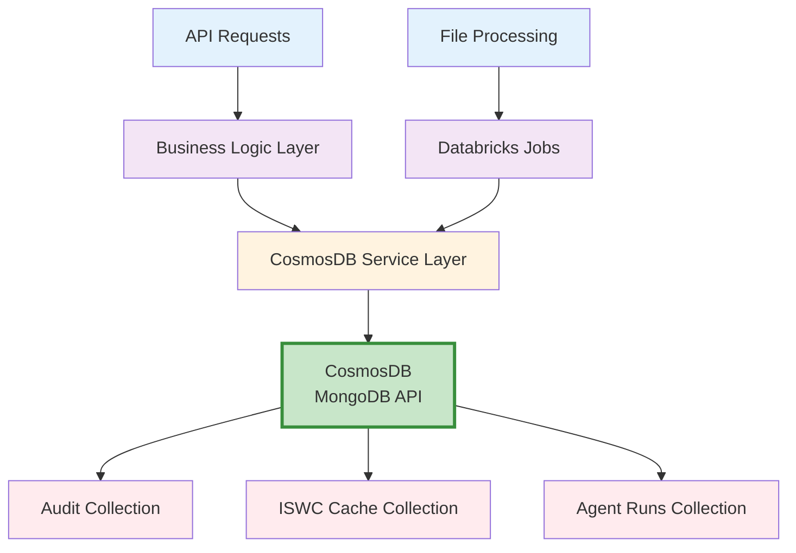
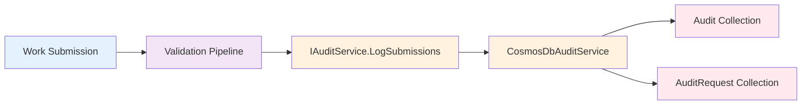
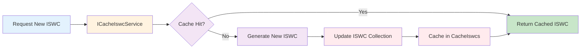

# Cosmos DB - ISWC System Component Documentation

**Version:** 1.0
**Date:** 2025-10-27
**Focus Areas:** Cache, Audit

---

## Sources

**Primary:**

- SPE_20190218_ISWCDataModel_REV (PM).md - Data Model Specification

**Secondary:**

- Workshop 2 - Documentation & Infrastructure (Oct 21, 2025)

**Tertiary:**

- 158+ source code files implementing CosmosDB functionality

**Search Terms Used:**

- Primary: Cosmos DB, CosmosDB, Azure Cosmos DB
- Related database terms: NoSQL, MongoDB, JSON, collection
- Collections: Audit, AuditRequest, AuditRequestTransaction, ISWC, CacheIswcs, AgentRuns
- Technical terms: Request Units (RU), partition key, partitionKey, DatabaseId
- Use cases: audit data, log data, submission history, ISWC counter, cache
- Code classes: CosmosDbRepository, ICosmosDbRepository, CosmosDbAuditService, CosmosDbCacheIswcService
- Code interfaces: IAuditService, ICacheIswcService, IAgentRunService
- Models: AuditModel, AuditRequestModel, CacheIswcsModel, AgentRuns
- Data tier terms: retention policies, backup, emulator

---

## Overview

Azure Cosmos DB is a globally distributed NoSQL database service used in the ISWC system for storing high-volume audit logs and caching ISWC counter values.

> **From [ISWC Data Model](../../resources/core_design_documents/SPE_20190218_ISWCDataModel_REV%20(PM)/SPE_20190218_ISWCDataModel_REV%20(PM).md) → Section 2 "Database Technology":** "The Audit records will be stored in an Azure Cosmos DB database. Azure Cosmos DB is a globally distributed NoSQL database service which is based on MongoDB."

Cosmos DB was selected to address scalability challenges with audit data, which had grown to 822 million rows requiring manual partitioning in the previous system.

---

## Primary Purpose

**Official Purpose from Specifications:**

> **From [ISWC Data Model](../../resources/core_design_documents/SPE_20190218_ISWCDataModel_REV%20(PM)/SPE_20190218_ISWCDataModel_REV%20(PM).md) → Section 1.2 "Design goals for the new ISWC data model":** "The Audit tables are stored in a more scalable way using Cosmos DB"

**Key Capabilities:**

1. **Audit Storage** - Store submission history, transaction logs, and error tracking
2. **ISWC Counter Cache** - Manage next ISWC value to be issued as a distributed counter
3. **High-Volume Data** - Handle massive scale (822M+ rows) with automatic partitioning
4. **Submission History** - Track all work submissions and their processing status

**Role in ISWC Architecture:**

- **Data Tier Component** - Primary NoSQL storage alongside SQL Server
- **Audit Trail System** - Complete audit log for compliance and debugging
- **Caching Layer** - Performance optimization for frequently accessed data
- **Scalability Solution** - Handles data volumes beyond RDBMS practical limits

---

## Technical Architecture

### Infrastructure Components

**Azure Services:**

- **Azure Cosmos DB** - MongoDB API-based NoSQL database
- **Azure Key Vault** - Stores connection strings and credentials
- **Azure Portal** - Backup restoration interface

**Technology Stack:**

- **Database**: Cosmos DB with MongoDB API
- **Data Format**: JSON documents organized in collections
- **Partitioning**: Society Code + Created Date partition key (format: XXXDDD)
- **SDK**: Microsoft.Azure.Cosmos SDK (C#), pymongo (Python)

### Storage and Data Persistence

**Configuration:**

> **From [ISWC Data Model](../../resources/core_design_documents/SPE_20190218_ISWCDataModel_REV%20(PM)/SPE_20190218_ISWCDataModel_REV%20(PM).md) → Section 2.3 "Scalability":** "An initial value of 1,000 RU (Request Units) will be provisioned."

**Backup Strategy:**

> **From [ISWC Data Model](../../resources/core_design_documents/SPE_20190218_ISWCDataModel_REV%20(PM)/SPE_20190218_ISWCDataModel_REV%20(PM).md) → Section 2.4 "Backup and recovery":** "Azure Cosmos DB automatically takes a backup of the database every 4 hours and at any one point in time, only the latest 2 backups are stored. For recovery within the 8 hours, Azure support will be contacted to restore the data from backup."

### Integration Points

**Upstream Dependencies:**

- **API Layer** (Api.Agency, Api.Publisher, Api.Label, Api.ThirdParty) - Write audit logs
- **Databricks** - Batch processing writes audit data
- **Azure Jobs** - Background processing updates collections

**Downstream Dependencies:**

- **Portal UI** - Reads submission history for display
- **Reporting System** - Queries audit data for reports
- **Data Factory** - Extracts data for analytics

---

## How It Works

### High-Level Architecture



### Data Flow Patterns

**1. Audit Logging Flow**



**Audit Logging Steps:**

1. **Work Submission** - Agency submits work via API or file
2. **Pipeline Processing** - Validation/matching components process submission
3. **Service Call** - `IAuditService.LogSubmissions()` invoked
4. **Data Persistence** - CosmosDbAuditService writes to collections:
   - `Audit` collection (top-level submission data)
   - `AuditRequest` collection (individual request details)
   - `AuditRequestTransaction` collection (transaction-level data)

**2. ISWC Cache Flow**



---

## File/Data Formats

### Partition Key Format

**Pattern:** `XXXDDD`

- `XXX` = Society Code (3 digits)
- `DDD` = Month of Created Date (1-12, zero-padded to 3 digits)

**Example:** Society 222, Created in January → Partition Key = `2221`

### Collection Schemas

**Audit Collection:**

```json
{
  "partitionKey": "351",
  "auditId": 8700795503,
  "sessionId": "01012019163127-sync",
  "societyCode": 35,
  "senderName": "WEBSERVICE",
  "createdDate": "2019-01-01T16:31:27.000Z",
  "lastModifiedDate": "2019-01-01T16:31:27.000Z",
  "lastModifiedUser": "WEBSERVICE"
}
```

**ISWC Collection (Counter Cache):**

```json
{
  "iswc": "T-123.456.789-0"
}
```

---

## Integration with Other Components

### Upstream Dependencies

**What CosmosDB depends on:**

- **Azure Key Vault** - Connection strings and credentials
- **API Gateway** - Receives data from external systems
- **Azure Jobs/Functions** - Background processing triggers

### Downstream Dependencies

**What depends on CosmosDB:**

- **Agency Portal** - Displays submission history
- **Reporting Services** - Generates audit reports
- **Public Portal** - Read-only access to submission data
- **Databricks** - Reads audit data for analytics

### Related Components

**Direct Integration:**

- **SQL Server** - Complementary relational storage
- **Databricks** - Writes audit data from file processing
- **Application Insights** - Logging and monitoring

### System Architecture Position

> **From [Workshop 2](../../meetings/20251021-ISWC%20Audit%20-%20Workshop%202%20-%20Documentations%20and%20infrastructure.txt) (Line 582, Xiyuan Zeng):** "the backend of that is Azure App Service for the API, and then the data tier will be SQL or Cosmos DB."

Cosmos DB serves as one of two primary data tier options alongside SQL Server.

---

## Use Cases

### 1. Audit Trail Logging

**Business Scenario:** Track all submission processing for compliance, debugging, and reporting.

**Workflow:**

1. Agency submits work via API or EDI file
2. System validates and processes submission
3. Audit service logs:
   - Submission metadata (auditId, societyCode, sessionId)
   - Request details (requestId, transaction type)
   - Transaction results (success/failure, errors)
   - Work associations (ISWCs created/updated)

**Real-World Value:** Enables agencies to view complete submission history in portal

> **From [Workshop 2](../../meetings/20251021-ISWC%20Audit%20-%20Workshop%202%20-%20Documentations%20and%20infrastructure.txt) (Line 165, Mark Stadler):** "So if you look at the Cisac portal, and if you look at the submission history of an Cisac for different works, we store that in Cosmos DB."

### 2. ISWC Counter Management

**Business Scenario:** Generate unique ISWC codes efficiently with distributed caching.

**Workflow:**

1. Work creation requires new ISWC
2. System checks CacheIswcs collection
3. If cached, return immediately
4. If not cached, generate new value from ISWC collection
5. Update both ISWC counter and cache

**Real-World Value:** High-performance ISWC generation with distributed consistency

### 3. High-Volume Scalability

**Business Scenario:** Handle 822 million+ audit log rows without performance degradation.

**Partition Strategy:**

> **From [ISWC Data Model](../../resources/core_design_documents/SPE_20190218_ISWCDataModel_REV%20(PM)/SPE_20190218_ISWCDataModel_REV%20(PM).md) → Section 2.3.2 "Scaling for large data volumes":** "Log data, however, currently has 822 million rows in the existing database and has had to be manually partitioned across multiple tables for performance and maintenance reasons. In the new solution this audit data will be stored in Cosmos DB using the Society Code and Created Date as a partition key."

**Real-World Value:** Automatic partitioning eliminates manual database maintenance

---

## Workflow Details

### Error Handling

**Validation Failures:**

> **From [MVP Validation Rules](../../resources/core_design_documents/SPE_20190424_MVPValidationRules/SPE_20190424_MVPValidationRules.md) (Line 245):** "All validator pipeline components will use a common error handling framework for identifying error codes and corresponding messages. It will capture these along with the pipeline component version and rule identifiers in a set of tracking data that will be logged along with the transaction in the system (stored in the Cosmos DB No SQL database)."

**Error Propagation:**

- Errors captured with error codes and messages
- Pipeline component version tracked
- Rule identifiers logged
- Transaction marked as failed in audit

### Edge Cases

**Collection Not Found:** Application creates collections on first use if missing

**Partition Saturation:** Automatic scaling via Request Units (RU) provisioning

**Backup Window:** 8-hour recovery window with only 2 backups retained

---

## Source Code References

### C# Framework & CosmosDB Core

**Framework Layer** (`src/Framework/CosmosDb/`)

- [CosmosDbOptions.cs](../../resources/source-code/ISWC/src/Framework/CosmosDb/CosmosDbOptions.cs) - Configuration options (DatabaseId)
- [CosmosDbRepository.cs](../../resources/source-code/ISWC/src/Framework/CosmosDb/Repositories/CosmosDbRepository.cs) - Generic repository pattern for Cosmos DB operations
- [ICosmosDbRepository.cs](../../resources/source-code/ISWC/src/Framework/CosmosDb/Repositories/ICosmosDbRepository.cs) - Repository interface
- [BaseModel.cs](../../resources/source-code/ISWC/src/Framework/CosmosDb/Models/BaseModel.cs) - Base model for all Cosmos DB documents

### Data Services - Audit

**Audit Service** (`src/Data/Services/Audit/CosmosDb/`)

- [CosmosDbAuditService.cs](../../resources/source-code/ISWC/src/Data/Services/Audit/CosmosDb/CosmosDbAuditService.cs) - Main audit logging service implementation
- [IAuditService.cs](../../resources/source-code/ISWC/src/Data/Services/Audit/IAuditService.cs) - Audit service interface
- [AuditModel.cs](../../resources/source-code/ISWC/src/Data/Services/Audit/CosmosDb/Models/AuditModel.cs) - Top-level submission audit model
- [AuditRequestModel.cs](../../resources/source-code/ISWC/src/Data/Services/Audit/CosmosDb/Models/AuditRequestModel.cs) - Individual request audit model
- [FileAuditModel.cs](../../resources/source-code/ISWC/src/Data/Services/Audit/CosmosDb/Models/FileAuditModel.cs) - File processing audit model
- [AgencyStatisticsModel.cs](../../resources/source-code/ISWC/src/Data/Services/Audit/CosmosDb/Models/AgencyStatisticsModel.cs) - Agency statistics aggregation
- [ContinuationToken.cs](../../resources/source-code/ISWC/src/Data/Services/Audit/CosmosDb/Models/ContinuationToken.cs) - Paging support for large result sets
- [ContinuationTokenRange.cs](../../resources/source-code/ISWC/src/Data/Services/Audit/CosmosDb/Models/ContinuationTokenRange.cs) - Token range for parallel queries

### Data Services - Cache

**Cache Service** (`src/Data/Services/CacheIswcs/CosmosDb/`)

- [CosmosDbCacheIswcService.cs](../../resources/source-code/ISWC/src/Data/Services/CacheIswcs/CosmosDb/CosmosDbCacheIswcService.cs) - ISWC caching service
- [ICacheIswcService.cs](../../resources/source-code/ISWC/src/Data/Services/CacheIswcs/ICacheIswcService.cs) - Cache service interface
- [CacheIswcsModel.cs](../../resources/source-code/ISWC/src/Data/Services/CacheIswcs/CosmosDb/Models/CacheIswcsModel.cs) - Cached ISWC data model
- [CacheIswcMetadata.cs](../../resources/source-code/ISWC/src/Data/Services/CacheIswcs/CosmosDb/Models/CacheIswcMetadata.cs) - Cache metadata

### Data Services - Other Collections

**ISWC Counter** (`src/Data/Services/IswcService/CosmosDb/`)

- [CosmosDbIswcService.cs](../../resources/source-code/ISWC/src/Data/Services/IswcService/CosmosDb/CosmosDbIswcService.cs) - ISWC counter management
- [IswcModel.cs](../../resources/source-code/ISWC/src/Data/Services/IswcService/CosmosDb/Models/IswcModel.cs) - ISWC counter model

**Notifications** (`src/Data/Services/Notifications/ComosDb/`)

- [CosmosDbNotificationService.cs](../../resources/source-code/ISWC/src/Data/Services/Notifications/ComosDb/CosmosDbNotificationService.cs) - CSN notification management
- [CsnNotifications.cs](../../resources/source-code/ISWC/src/Data/Services/Notifications/ComosDb/Models/CsnNotifications.cs) - Notification model
- [CsnNotificationsHighWatermark.cs](../../resources/source-code/ISWC/src/Data/Services/Notifications/ComosDb/Models/CsnNotificationsHighWatermark.cs) - High watermark tracking

**Agent Runs** (`src/Data/Services/AgentRun/CosmosDb/`)

- [CosmosDbAgentRunService.cs](../../resources/source-code/ISWC/src/Data/Services/AgentRun/CosmosDb/CosmosDbAgentRunService.cs) - Background agent run tracking
- [AgentRuns.cs](../../resources/source-code/ISWC/src/Data/Services/AgentRun/CosmosDb/Models/AgentRuns.cs) - Agent run model

**Checksum** (`src/Data/Services/Checksum/CosmosDb/`)

- [CosmosDbChecksumService.cs](../../resources/source-code/ISWC/src/Data/Services/Checksum/CosmosDb/CosmosDbChecksumService.cs) - Submission checksum validation
- [SubmissionChecksums.cs](../../resources/source-code/ISWC/src/Data/Services/Checksum/CosmosDb/Models/SubmissionChecksums.cs) - Checksum model

**Workflow History** (`src/Data/Services/UpdateWorkflowHistory/CosmosDb/`)

- [CosmosDbUpdateWorkflowHistoryService.cs](../../resources/source-code/ISWC/src/Data/Services/UpdateWorkflowHistory/CosmosDb/CosmosDbUpdateWorkflowHistoryService.cs) - Workflow history tracking
- [UpdateWorkflowHistoryModel.cs](../../resources/source-code/ISWC/src/Data/Services/UpdateWorkflowHistory/CosmosDb/Models/UpdateWorkflowHistoryModel.cs) - History model

### Business Layer

**Managers** (`src/Business/Managers/`)

- [AuditManager.cs](../../resources/source-code/ISWC/src/Business/Managers/AuditManager.cs) - Business logic for audit operations
- [WorkManager.cs](../../resources/source-code/ISWC/src/Business/Managers/WorkManager.cs) - Uses audit service for work tracking
- [AgentManager.cs](../../resources/source-code/ISWC/src/Business/Managers/AgentManager.cs) - Uses agent run service
- [WorkflowManager.cs](../../resources/source-code/ISWC/src/Business/Managers/WorkflowManager.cs) - Workflow audit integration
- [ReportManager.cs](../../resources/source-code/ISWC/src/Business/Managers/ReportManager.cs) - Report generation from audit data

### API Controllers

**Audit Controllers** (across all API projects)

- [Api.Agency/Controllers/AuditController.cs](../../resources/source-code/ISWC/src/Api.Agency/Controllers/AuditController.cs) - Agency audit endpoints
- [Api.Publisher/Controllers/AuditController.cs](../../resources/source-code/ISWC/src/Api.Publisher/Controllers/AuditController.cs) - Publisher audit endpoints
- [Api.Label/Controllers/AuditController.cs](../../resources/source-code/ISWC/src/Api.Label/Controllers/AuditController.cs) - Label audit endpoints
- [Api.ThirdParty/Controllers/AuditController.cs](../../resources/source-code/ISWC/src/Api.ThirdParty/Controllers/AuditController.cs) - Third party audit endpoints
- [Portal/Controllers/AuditController.cs](../../resources/source-code/ISWC/src/Portal/Controllers/AuditController.cs) - Portal audit endpoints
- [Portal/Controllers/ReportController.cs](../../resources/source-code/ISWC/src/Portal/Controllers/ReportController.cs) - Report generation endpoints

### Configuration & DI

**Dependency Injection**

- [Data/AutofacModule.cs](../../resources/source-code/ISWC/src/Data/AutofacModule.cs) - Registers CosmosDB services
- [Data/MappingProfile.cs](../../resources/source-code/ISWC/src/Data/MappingProfile.cs) - AutoMapper configuration for models
- [Api.*/Extensions/ServiceCollectionExtensions.cs](../../resources/source-code/ISWC/src/Api.Agency/Extensions/ServiceCollectionExtensions.cs) - Service registration (all API projects)
- [Portal/Extensions/ServiceCollectionExtensions.cs](../../resources/source-code/ISWC/src/Portal/Extensions/ServiceCollectionExtensions.cs) - Portal service registration
- [Jobs/Extensions/ServiceCollectionExtensions.cs](../../resources/source-code/ISWC/src/Jobs/Extensions/ServiceCollectionExtensions.cs) - Background job services

### Python Integration (Databricks)

**EDI File Processing** (`src/Integration/Edi/ediparser/parser/services/`)

- [cosmos_service.py](../../resources/source-code/ISWC/src/Integration/Edi/ediparser/parser/services/cosmos_service.py) - Python Cosmos DB client for EDI processing

**Generic Jobs** (`src/Integration/GenericJob/generic_job/services/`)

- [cosmos_service.py](../../resources/source-code/ISWC/src/Integration/GenericJob/generic_job/services/cosmos_service.py) - Python Cosmos DB service for batch jobs
- [audit_request_service.py](../../resources/source-code/ISWC/src/Integration/GenericJob/generic_job/services/audit_request_service.py) - Audit request processing
- [schemas/audit_request_schema.py](../../resources/source-code/ISWC/src/Integration/GenericJob/generic_job/schemas/audit_request_schema.py) - Audit data schemas

**Reporting** (`src/Reporting/reporting/services/`)

- [audit_reader_service.py](../../resources/source-code/ISWC/src/Reporting/reporting/services/audit_reader_service.py) - Reads audit data for reports
- [parquet_reporting_service.py](../../resources/source-code/ISWC/src/Reporting/reporting/services/parquet_reporting_service.py) - Parquet export of audit data

### Azure Jobs/Functions

**Background Jobs** (`src/Jobs/Functions/`)

- [ProcessAuditJob.cs](../../resources/source-code/ISWC/src/Jobs/Functions/ProcessAuditJob.cs) - Scheduled audit processing
- [ProcessAgencyStatisticsJob.cs](../../resources/source-code/ISWC/src/Jobs/Functions/ProcessAgencyStatisticsJob.cs) - Agency statistics aggregation
- [HydrateCsnNotificationsJob.cs](../../resources/source-code/ISWC/src/Jobs/Functions/HydrateCsnNotificationsJob.cs) - Notification hydration
- [CheckAgentRuns.cs](../../resources/source-code/ISWC/src/Jobs/Functions/CheckAgentRuns.cs) - Agent run monitoring

### Portal UI (React/TypeScript)

**Redux State Management** (`src/Portal/ClientApp/src/redux/`)

- [actions/SubmissionHistoryActions.ts](../../resources/source-code/ISWC/src/Portal/ClientApp/src/redux/actions/SubmissionHistoryActions.ts) - Submission history actions
- [reducers/SubmissionHistoryReducer.ts](../../resources/source-code/ISWC/src/Portal/ClientApp/src/redux/reducers/SubmissionHistoryReducer.ts) - State reducer
- [services/SubmissionHistoryService.ts](../../resources/source-code/ISWC/src/Portal/ClientApp/src/redux/services/SubmissionHistoryService.ts) - API service
- [actions/ReportsActions.ts](../../resources/source-code/ISWC/src/Portal/ClientApp/src/redux/actions/ReportsActions.ts) - Report actions
- [reducers/ReportsReducer.ts](../../resources/source-code/ISWC/src/Portal/ClientApp/src/redux/reducers/ReportsReducer.ts) - Report state
- [thunks/ReportsThunks.ts](../../resources/source-code/ISWC/src/Portal/ClientApp/src/redux/thunks/ReportsThunks.ts) - Async operations

**UI Components** (`src/Portal/ClientApp/src/routes/`)

- [Search/SubmissionHistory/SubmissionHistory.tsx](../../resources/source-code/ISWC/src/Portal/ClientApp/src/routes/Search/SubmissionHistory/SubmissionHistory.tsx) - Submission history view
- [Reports/SubmissionAudit/SubmissionAudit.tsx](../../resources/source-code/ISWC/src/Portal/ClientApp/src/routes/Reports/SubmissionAudit/SubmissionAudit.tsx) - Audit report view
- [Reports/FileSubmissionAudit/FileSubmissionAudit.tsx](../../resources/source-code/ISWC/src/Portal/ClientApp/src/routes/Reports/FileSubmissionAudit/FileSubmissionAudit.tsx) - File audit report

### Ad-Hoc Utilities

**Seeding & Migration** (`src/AdHoc/`)

- [CosmosDbThirdPartySeed/Program.cs](../../resources/source-code/ISWC/src/AdHoc/CosmosDbThirdPartySeed/Program.cs) - Third party data seeding
- [CosmosDbUpdateDocuments/Program.cs](../../resources/source-code/ISWC/src/AdHoc/CosmosDbUpdateDocuments/Program.cs) - Bulk document updates
- [ReinstateTitlesConsoleApp/Program.cs](../../resources/source-code/ISWC/src/AdHoc/ReinstateTitlesConsoleApp/Program.cs) - Title reinstatement tool

### Key Patterns and Technologies

**Technology Stack:**

- **C# SDK**: Microsoft.Azure.Cosmos (latest SDK)
- **Python SDK**: pymongo (MongoDB driver)
- **API**: MongoDB API (not SQL API)
- **Repository Pattern**: Generic `ICosmosDbRepository<T>` for all collections
- **Dependency Injection**: Autofac and ASP.NET Core DI

**Design Patterns:**

- **Repository Pattern**: Centralized data access through `CosmosDbRepository`
- **Service Layer**: Business logic isolated in `*Service` classes
- **Interface Segregation**: Each collection has dedicated service interface
- **Model Mapping**: AutoMapper for DTO/Model conversion
- **Async/Await**: All operations asynchronous for scalability

**Configuration:**

- **Connection Strings**: Stored in Azure Key Vault
- **DatabaseId**: Configured via `CosmosDbOptions`
- **Collections**: Created on-demand by application
- **RU Provisioning**: Initially 1,000 RU, scalable based on load

---

## Questions for Further Investigation

- [ ] What is the current RU (Request Units) provisioning in production vs initial 1,000 RU?
- [ ] How are Cosmos DB connection strings rotated and managed?
- [ ] What is the actual data volume in production Cosmos DB?
- [ ] Is there a local Cosmos DB emulator configured for development?
- [ ] What monitoring/alerting exists for Cosmos DB performance and costs?
- [ ] How are partition keys chosen for new collections beyond Audit?
- [ ] What is the backup restoration procedure and has it been tested?
- [ ] Are there any retention policies for old audit data?
- [ ] How is Cosmos DB cost optimized (TTL, indexing policies)?

---

## References

### Core Design Documents

- **[ISWC Data Model Specification](../../resources/core_design_documents/SPE_20190218_ISWCDataModel_REV%20(PM)/SPE_20190218_ISWCDataModel_REV%20(PM).md)** - Complete data model including Cosmos DB collections
- **[MVP Validation Rules](../../resources/core_design_documents/SPE_20190424_MVPValidationRules/SPE_20190424_MVPValidationRules.md)** - Audit logging in validation pipeline
- **[MVP Matching Rules](../../resources/core_design_documents/SPE_20190424_MVPMatchingRules/SPE_20190424_MVPMatchingRules.md)** - Audit logging in matching pipeline
- **[Reporting Specification](../../resources/core_design_documents/SPE_20200602_ISWC_Reporting/SPE_20200602_ISWC_Reporting.md)** - Audit data reporting

### Meeting Transcripts

- **[Workshop 2 - Documentation & Infrastructure](../../meetings/20251021-ISWC%20Audit%20-%20Workshop%202%20-%20Documentations%20and%20infrastructure.txt) (Oct 21, 2025)** - Cosmos DB implementation discussion

### Key Information Sources

- **[ISWC Data Model](../../resources/core_design_documents/SPE_20190218_ISWCDataModel_REV%20(PM)/SPE_20190218_ISWCDataModel_REV%20(PM).md) → Section 2 "Database Technology"** - Cosmos DB selection rationale
- **[ISWC Data Model](../../resources/core_design_documents/SPE_20190218_ISWCDataModel_REV%20(PM)/SPE_20190218_ISWCDataModel_REV%20(PM).md) → Section 5 "Audit Schema"** - Complete audit collection schemas
- **[ISWC Data Model](../../resources/core_design_documents/SPE_20190218_ISWCDataModel_REV%20(PM)/SPE_20190218_ISWCDataModel_REV%20(PM).md) → Section 6 "ISWC (Cosmos DB)"** - ISWC counter collection
- **[Workshop 2](../../meetings/20251021-ISWC%20Audit%20-%20Workshop%202%20-%20Documentations%20and%20infrastructure.txt) (Line 165, Mark Stadler)** - Submission history use case
- **[Workshop 2](../../meetings/20251021-ISWC%20Audit%20-%20Workshop%202%20-%20Documentations%20and%20infrastructure.txt) (Line 582, Xiyuan Zeng)** - Data tier architecture

---

## Document History

| Version | Date | Author | Changes |
|---------|------|--------|---------|
| 1.0 | 2025-10-27 | Documentation Team | Initial document created via /document-component command; Comprehensive three-phase research (4 design docs, 158+ code files, 2 meeting transcripts); Focus on Cache and Audit use cases; Mermaid diagrams for architecture and workflows |

---

## Known Gaps and Contradictions

### 🔍 Local Development Uncertainty

**Gap identified:**

> **From [Workshop 2](../../meetings/20251021-ISWC%20Audit%20-%20Workshop%202%20-%20Documentations%20and%20infrastructure.txt) (Line 549, Xiyuan Zeng):** "Cosmos DB, I'm not so certain. There might be a local numerator."

- **Issue**: Unclear if Cosmos DB emulator is configured for local development
- **Impact**: **Medium** - Affects developer productivity and testing
- **Resolution Needed**: Verify emulator setup or document cloud-only development approach

### 🔍 Backup Recovery Procedure

**Specification states:**

> **From [ISWC Data Model](../../resources/core_design_documents/SPE_20190218_ISWCDataModel_REV%20(PM)/SPE_20190218_ISWCDataModel_REV%20(PM).md) → Section 2.4 "Backup and recovery":** "For recovery within the 8 hours, Azure support will be contacted to restore the data from backup."

- **Gap**: No documented procedure for initiating backup restoration
- **Impact**: **High** - Critical for disaster recovery
- **Resolution Needed**: Document step-by-step restoration process, test recovery procedure

### ⚠️ Limited Backup Retention

**Only 2 backups retained (8-hour window)**

- **Concern**: Very limited recovery window compared to SQL Server (35 days)
- **Impact**: **High** - Data loss risk beyond 8 hours
- **Mitigation Needed**: Consider long-term archival strategy for critical audit data

### 🔍 RU Scaling Strategy

**Initial configuration documented:**

> "An initial value of 1,000 RU (Request Units) will be provisioned."

- **Gap**: No information on production RU configuration or auto-scaling policies
- **Impact**: **Medium** - Affects performance and cost
- **Resolution Needed**: Document current RU allocation and scaling triggers
