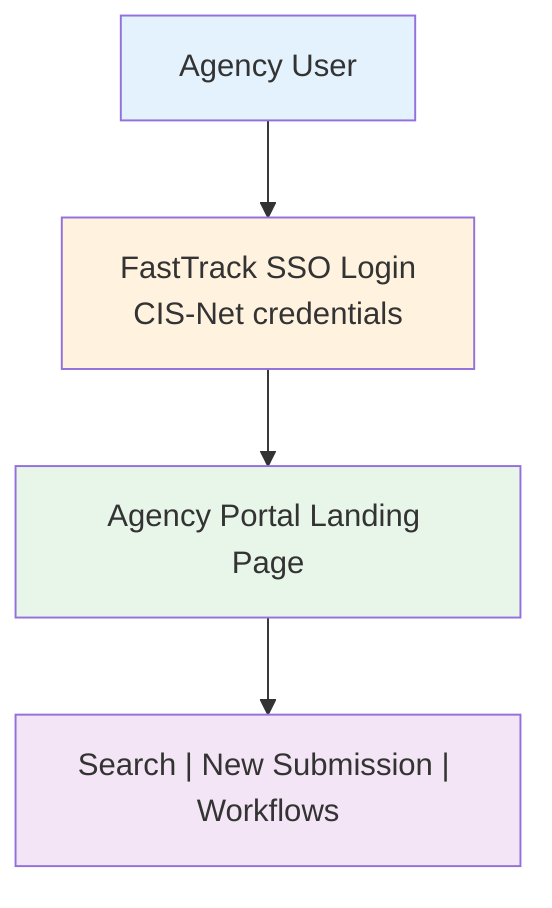
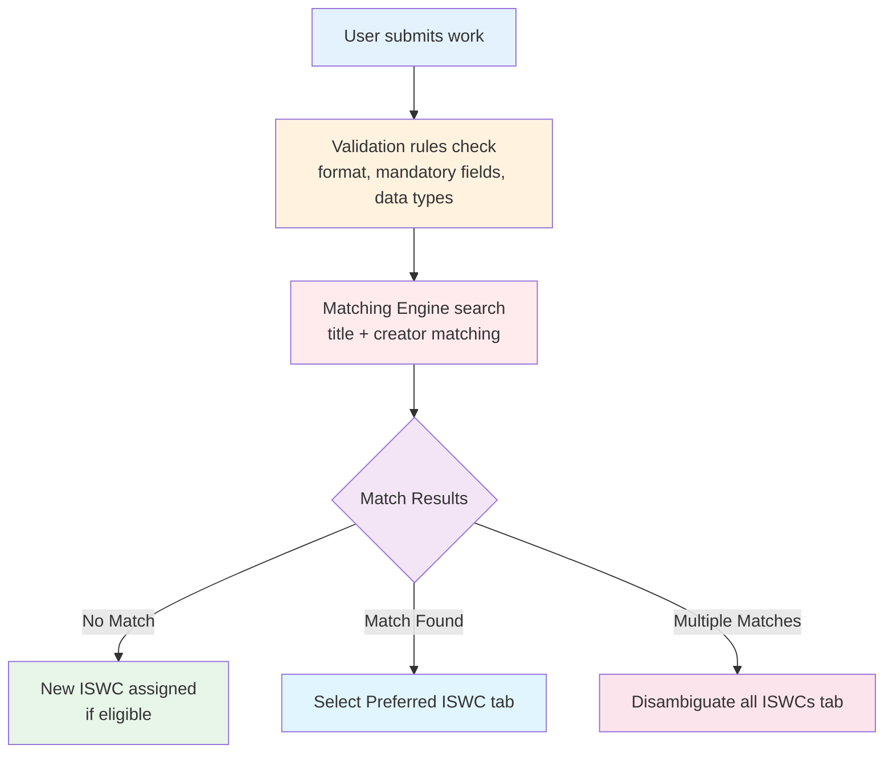
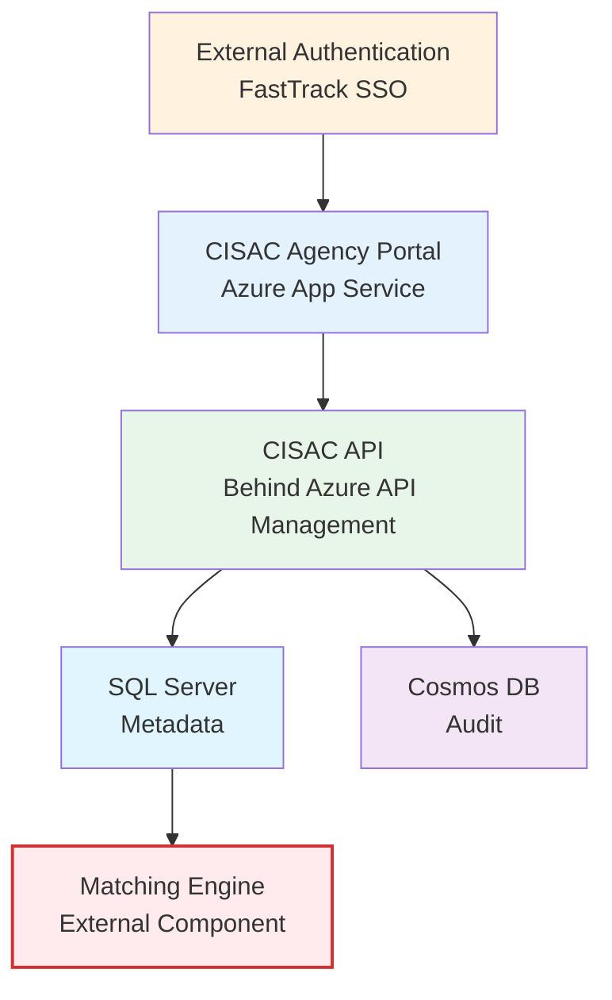

# ISWC Agency Portal

**Document Version:** 2.0
**Date:** October 27, 2025

**Sources:**

- **Primary:** SPE_20190806_ISWC_Portal.md (Core Design Document - Agency Portal Specification v4.0)
- **Primary:** SPE_20200108_ISWC_Public_Portal.md (Public Portal Specification v1.3)
- **Secondary:** Workshop 2 (Oct 21, 2025) - Documentation and Infrastructure
- **Tertiary:** 161+ source code files in Portal project (C#, TypeScript/React)

**Search Terms Used:**

- Primary: Agency Portal, ISWC Portal, Portal, Web Portal
- Authentication: FastTrack, CIS-Net, SSO, Authentication
- Technologies: React, TypeScript, Redux, ClientApp, ASP.NET Core 3.1
- Features: Submission, Workflow, Search, Merge, Demerge, Reports
- Backend: C#, Controllers, Services, Startup, Program.cs

---

## Overview

The ISWC Agency Portal is a **web-based application for music rights societies (agencies)** to interact with the ISWC Database for work registration, searching, updating, merging, and workflow management.

> **From Agency Portal Spec:** "It provides a detailed specification and design of the new ISWC Agency portal. This new web portal will be used by staff within agencies (societies) to search the ISWC database and to carry out key transactions."

**Portal Audience:** Society (agency) staff worldwide who manage musical work registrations and ISWC assignments.

---

## Primary Purpose

The Agency Portal enables societies to:

1. **Search for works** - By ISWC, Agency Work Code, Title, or Creator
2. **Submit new works** - Register new musical works and request ISWC assignment
3. **Update existing works** - Modify titles, creators, and other metadata
4. **Merge and demerge works** - Consolidate duplicate ISWCs or separate incorrectly merged ones
5. **Delete works** - Remove works from the database
6. **Manage workflows** - Approve or reject changes made by other societies
7. **Disambiguate works** - Mark works as distinct from similar ones

**Role in System:** Primary interactive interface for ISWC-eligible and ISWC-ineligible agencies to manage their work catalog submissions.

---

## Technical Architecture

### Infrastructure Components

From Workshop 2 architecture diagram and Azure portal access:

| Component | Technology | Purpose |
|-----------|-----------|---------|
| **Frontend** | Web Application (Azure App Service) | Responsive web UI |
| **Backend API** | CISAC API (Azure App Service) | REST services for portal |
| **Authentication** | FastTrack SSO (External) | Single sign-on integration |
| **Database** | Azure SQL Server | Work metadata, submissions |
| **Audit Storage** | Azure Cosmos DB | Submission history |
| **API Gateway** | Azure API Management | Public-facing API proxy |
| **Monitoring** | Application Insights | Performance metrics |
| **Secrets** | Azure Key Vault | Credentials storage |

### Technology Stack

From design specification, workshop discussions, and source code analysis:

**Frontend:**

- **Framework:** React 16.12.0 with TypeScript 3.7.3
- **State Management:** Redux 4.0.4 with Redux Thunk 2.3.0, Redux Storage for persistence
- **Routing:** React Router 5.1.2 with Connected React Router 6.6.1
- **UI Components:** Reactstrap 8.2.0, Bootstrap 4.4.1
- **Charts:** Chart.js 2.9.4 with React Chart.js 2
- **HTTP Client:** Axios 0.24.0
- **Build Tool:** React Scripts 3.4.1 (Create React App)
- **Testing:** Enzyme 3.10.0, Jest
- **Responsive design:** Desktop 1600x992, Laptop 1280x802, Tablet 768x1024, Mobile 320x480
- **Browser support:** IE11, Chrome, Firefox, Safari (iOS)
- **Language support:** EN, FR, ES (resource files in [PortalStrings.en.resx](../../../resources/source-code/ISWC/src/Portal/Configuration/PortalStrings.en.resx), .fr.resx, .es.resx)
- **Monitoring:** Application Insights React.js SDK 2.5.4

**Backend:**

- **Framework:** ASP.NET Core 3.1 (.NET Core)
- **Architecture:** MVC with React SPA Services
- **DI Container:** Autofac 4.4.0
- **Object Mapping:** AutoMapper 7.0.0
- **JSON Serialization:** Newtonsoft.Json (ASP.NET Core 3.0)
- **HTTP Resilience:** Polly 3.0.0 with HTTP extensions for retry policies
- **Authentication:** FastTrack SSO via SOAP API calls
- **Configuration:** Azure Key Vault integration for secrets
- **Monitoring:** Application Insights telemetry
- **Response Compression:** Enabled for HTTPS
- **REST API services:** Integration with ISWC REST API endpoints
- **Matching Engine integration:** External HTTP API dependency

**Storage:**

- SQL Server: Work data, creators, titles, relationships, WebUser, WebUserRole, Message, Notification tables
- Cosmos DB: Submission history, audit trails (MongoDB API)
- Azure Storage Account: File attachments (if applicable)

---

## How It Works

### User Authentication Flow

> **From specification:** "The suggestion by Didier is that the new ISWC portal leverages the CIS-Net authentication system and process for getting a username and password."

### User Access Model

> **Workshop 2, Xiyuan Zeng (57:27):** "The easiest way to visualize stuff is to use the agency portal because it's like a visual kind of... if you were joining the team, the easiest way to visualize stuff is to use the agency board because it's a visual thing."

**Per-Agency Access:**

- Each society has unique login credentials
- Users only see their own agency's submissions and assigned workflows
- Different permission levels possible (noted as "wish list" item for complex permission models)

---

## Page Structure and Features

### Global Navigation

The portal uses a consistent navigation bar across all pages:

- **Home (logo)** - Returns to welcome page
- **Search** - Access search page
- **New Submission** - Create new work submission
- **Workflows** - View and manage approval workflows
- **Settings (gear icon)** - Access settings page

Mobile view collapses to hamburger menu.

### 1. Search Page

**Purpose:** Find existing works in the ISWC Database.

**Search Options:**

| Search Type | Fields | Notes |
|-------------|--------|-------|
| **By ISWC** | ISWC number | Auto-formats punctuation, validates check digit |
| **By Agency Work Code** | Work Code, Agency, Database | Agency defaults to logged-in user's society |
| **By Title** | Title, Creator Surname(s), IP Name Number(s), IP Base Number(s) | Title required, creators optional |
| **By IP Number** | IP Name Number(s), IP Base Number(s) | Search by creator identity only |

**Search Results Display:**

- **Grid view** with columns:
  - Original Title
  - Creator Names (authoritative surname + first name)
  - ISWC (Preferred ISWC only)
  - Disambiguated ISWCs
- **Sorting:** Descending Preferred ISWC (default), ascending/descending by title
- **Paging:** 20 per page (default), incrementing by 10 up to 100

**Expansion Panel ("View More"):**

Shows detailed information for each work:

- **Header actions:**
  - View Submission History (opens in new tab)
  - Update Submission (pre-populates New Submission page)
  - Add to Merge List
  - View Merge List
- **Titles section:** All non-standardized titles with type codes
- **Creators section:**
  - Name (Surname + First Name)
  - IP Name Number (authoritative)
  - Affiliation (current agreements, sorted by effective date)
  - IPI Base Number
  - Role (rolled-up from database)
  - Authoritative Agency

### 2. New Submission Page

**Purpose:** Register new musical works or update existing ones.

**Main Details Section:**

Required fields for work submission:

- **Titles:** Original Title + additional titles (AT, ET, etc.)
- **Creators:** IP Name Numbers with role codes
- **Original Publishers:** Publisher information
- **Agency Work Code:** Society's internal identifier
- **Work Type:** Musical composition type
- **Derived Work:** Source work information (if applicable)

**IP Lookup Feature:**

- Search IPI database by Surname or IP Base Number
- View Name, Affiliation, Role
- Select and populate creator fields

**Submission Processing:**

System validates and matches submission against existing database:

**Outcomes:**

1. **ISWC-Eligible + Unique:** New ISWC assigned immediately
2. **ISWC-Ineligible + Unique:** Error - cannot generate new ISWC
3. **ISWC-Eligible + Matches:** Choose existing ISWC or disambiguate
4. **ISWC-Ineligible + Matches:** Must choose existing ISWC

**Disambiguation Details:**

When creating new ISWC despite matches, user provides:

- Additional ISWCs to disambiguate from
- Reason for disambiguation (required selection)
- BVLTR (optional)
- Performers (optional list)
- Instrumentation (optional - both Instrumentation and Instrument codes)

### 3. Workflows Page

**Purpose:** Review and approve/reject changes made by other societies.

> **From specification (Appendix C):** "Approval workflow tasks are generated by the system when processing update, delete or merge transactions, through any channel (web portal, REST API, EDI file exchange etc, Hub etc.)"

**Workflow Task Generation:**

- Created for each ISWC-eligible agency that previously submitted on the affected ISWC
- Originating agency does NOT receive workflow task
- Applies to: Updates, Merges, Deletes

**Filter Options:**

- **Show Workflows:**
  - "Assigned to me" (default) - Tasks for user's agency
  - "Created by me" - Tasks from user's actions
- **Filter by Status:**
  - "Pending Approval" (default)
  - "Approved"
  - "Rejected"

**Actions:**

- **Approve** - Accept changes (no metadata change)
- **Reject** - Revert composite metadata to pre-change state
- **Bulk operations** - Approve All / Reject All with confirmation

**Status Indicators:**

- Pending Approval
- Approved (Automatic) - System auto-approved after time limit (~30 days)
- Approved (Manual) - User explicitly approved
- Rejected

**Advanced Search:**

Filter workflows by:

- ISWC (semicolon-separated list)
- Agency Work Code (semicolon-separated list)
- Originating Agency (single selection)
- Date range

**Optimistic Approval Model:**

> **From specification:** "Updates are applied immediately, under the assumption that most changes will be approved. Workflow tasks themselves are also automatically marked as approved once the configured time limit is set. Rejection of a workflow task triggers the reinstatement of the composite metadata on the work prior to the update that triggered the workflow."

### 4. Merge/Demerge Functionality

**Merge List Page:**

- Add multiple Preferred ISWCs to merge together
- System defaults primary ISWC using business rules
- User can override default selection
- Submit merge creates LinkedTo relationship
- Approval workflow generated for other participating agencies

**Demerge Page:**

- Shows Preferred ISWC and all linked ISWCs
- User selects one or more to demerge
- Breaks LinkedTo relationship

### 5. Submission History Page

Shows complete audit trail for a Preferred ISWC:

| Column | Description |
|--------|-------------|
| Date | Submission timestamp from audit data |
| Type | Transaction Type (CAR, CUR, CDR, MER, etc.) |
| Method | EDI, SOAP, REST, or Web |
| Submitting Agency | Society name |
| Submitting Agency Work Code | Society's internal ID |
| Creators | IP Name Numbers with submitted roles |
| Titles | All non-standardized titles |
| Status | Approved, Pending Approval, or Rejected |

Grid sortable by date, type, method, and submitting agency.

---

## Integration with Other Components

### Upstream Dependencies

**What the Portal depends on:**

- **FastTrack SSO** - User authentication (external to CISAC)
- **CISAC REST API** - All data operations
  - `/iswc/searchByIswc`
  - `/iswc/searchByAgencyWorkCode`
  - `/iswc/searchByTitleAndContributor`
  - `/submission`
- **Matching Engine** - Work matching and disambiguation (external component)
- **IPI Database (replica)** - Creator lookup for IP Name Number searches
- **Azure SQL Server** - Work metadata, creators, submissions
- **Azure Cosmos DB** - Submission history and audit data

### Downstream Dependencies

**What depends on the Portal:**

- Workflow tasks (created by Portal submissions)
- Audit trail entries (all Portal actions logged)
- Email notifications (potential - not specified)

### Related Components

**Alternative submission methods:**

> **Workshop 2, Mark Stadler (1:02:35):** "All the API documented in here so a lot of agencies like using this they could develop their own API to access or develop their own kind of code to call ISWC using the agency portal."

The Portal is ONE of multiple ways agencies interact with ISWC:

1. **Agency Portal** (this component) - Interactive web UI
2. **REST API** - Programmatic access via Azure API Management
3. **SFTP/EDI** - Batch file submissions
4. **CIS-Net Interface** - Alternative web interface (receives CSN responses via SFTP)

All methods trigger the same validation, matching, and workflow processes.

### System Architecture Position

From Workshop 2 architecture diagram:

---

## Use Cases

### Primary Use Cases

From CISAC user stories (referenced in specification):

| Use Case | Description | Portal Feature |
|----------|-------------|----------------|
| **2.1 - 2.8** | Assign ISWC to domestic/split works (various scenarios) | New Submissions Page |
| **2.9 - 2.10** | Retrieve ISWC (single or multiple) | Search Page |
| **2.11 - 2.13** | Update metadata (title, creators, roles) | Search → Update Submission |
| **2.14 - 2.15** | Merge ISWCs (domestic/split works) | Merge List Page |
| **2.16 - 2.17** | De-merge ISWCs | Demerge Page |
| **2.18 - 2.19** | Delete ISWC | Search Page |
| **2.20** | Review corrections by participating society | Workflows Page |
| **2.21** | Assign ISWCs to AV Cues | New Submissions Page |

### User Workflows

**Example: Registering a New Fully Domestic Work**

1. User logs in via FastTrack SSO
2. Clicks "New Submission" in global navigation
3. Fills in mandatory fields (Original Title, Creators with IP Numbers, Agency Work Code)
4. Uses IP Lookup to find correct IP Name Numbers
5. Clicks "Next"
6. System validates and searches for matches
7. **Scenario A (No match):** System assigns new ISWC, shows "Preferred ISWC Assigned" panel
8. **Scenario B (Match found):** User chooses to link to existing ISWC or disambiguate
9. If disambiguating, provides reason, performers, instrumentation
10. Submits and receives confirmation

**Example: Collaborative Split-Copyright Work**

1. **Society A** submits work with their share → New ISWC created (if eligible)
2. System creates workflow task for manual matching review
3. **Society B** submits same work independently
4. Matching Engine finds potential match
5. Workflow task generated for both societies
6. Both societies receive CSN notification files via SFTP
7. Societies review in Workflows page
8. Both approve → Works merged under single Preferred ISWC
9. All parties notified via CSN files

**Example: Updating Existing Work**

1. User searches for work by ISWC or Title
2. Clicks "View More" on search result
3. Clicks "Update Submission" button
4. System pre-populates New Submission page with last submission data
5. User modifies creator information
6. Submits update
7. System creates workflow tasks for other participating agencies
8. Changes applied immediately (optimistic approval)
9. Other agencies can approve (no change) or reject (reverts metadata)

---

## Data Flow Details

### Matching Rule Configuration for Search

The Portal uses a specialized "search" source configuration for the Matching Engine:

**Key Settings:**

- **ComposerMatchWritersOnly:** True - Only match writers/composers, ignore publishers
- **ContributorMatchingAlgorithm:** NumberAndText - Try IP Number match first, then name
- **EnsureAllContributorsMatch:** True - All contributors must match for definite match
- **MinMatchingWriters:** 0 - Supports searches with no creators
- **WorkTitleSimilarity:** 70% - Lower threshold for more inclusive search results
- **TitleIgnoreWords:** "UNKNOWN;?" - Remove these from titles before matching
- **WorkSearchDepth:** 10,000 - Maximum rows returned for text search
- **ApplyDisambiguation:** True - Eliminate disambiguated ISWCs from results
- **MinMatchingWritersByNumberPct:** 0% - Enables name-only searches

**Filtering:**

> **From specification (Line 905):** "Search results should not follow the chain of Linked To items in results. I.E. If an ISWC matches the search criteria but that ISWC has been merged (linked to) another ISWC then don't show that now merged ISWC in the search results."

Only Preferred ISWCs displayed in grid. Archived and Linked ISWCs visible in "View More" expansion.

---

## Visual Design and User Experience

### Design Process

From specification Section 2.3:

> "Spanish Point use a specialized version of the widely used User Centered Design process for designing web portals."

Process included:

- Personas definition (based on community documentation experts)
- User stories from CISAC
- Wireframes (interactive PDF appendix)
- Review of existing CISAC design assets (iswcnet.cisac.org, cisac.org)
- Design composites with full visual fidelity
- **Usability testing** with 5 societies (BMI, GEMA, SOCAN, SACEM, SUISA)

### Navigation Patterns

**In-Page Navigation:**

- **Tabs** - Switch between search types (ISWC, Agency Work Code, Title, IP Number)
- **View More / View Less** - Expand/collapse detailed information
- **Action Buttons** - Submit, Next, Approve, Reject, Add to Merge List

**Responsive Behavior:**

- Desktop: Full multi-column layout
- Tablet: Adjusted column widths
- Mobile: Stacked single-column layout, hamburger menu

### Visual Styling

Reuses CISAC visual design:

- CISAC color scheme and branding
- Consistent with public portal (iswcnet.cisac.org replacement)
- Clean, modern interface
- Accessibility considerations

---

## Workflow Details

### Submission Lifecycle

```mermaid
flowchart TD
    A[New Submission] --> B[Validation<br/>Format, Mandatory Fields, Data Types]
    B --> C[Business Rule Validation<br/>ISWC uniqueness, IP Numbers exist, etc.]
    C --> D[Matching Engine Search]
    D --> E[Match Results → User Decision]
    E --> F[Database Update<br/>Immediate - Optimistic Approval]
    F --> G[Workflow Task Generation<br/>for other agencies]
    G --> H[CSN Notification Files<br/>via SFTP to relevant agencies]
    H --> I[Other Agencies Review<br/>in Workflows Page]
    I --> J{Action}
    J -->|Approve| K[No Change]
    J -->|Reject| L[Metadata Reverted]

    style A fill:#e3f2fd
    style B fill:#fff3e0
    style C fill:#fff3e0
    style D fill:#ffebee
    style E fill:#f3e5f5
    style F fill:#e8f5e9
    style G fill:#e1f5fe
    style H fill:#fce4ec
    style I fill:#f3e5f5
    style J fill:#fff9c4
    style K fill:#e8f5e9
    style L fill:#ffebee
```

### Error Handling

**Validation Failures:**

- User remains on current page
- Error messages displayed inline
- Must correct before proceeding

**Matching Engine Errors:**

- System logs error
- User informed of technical issue
- Option to retry or contact support

**Workflow Rejections:**

> **From specification:** "Rejection of a workflow task triggers the reinstatement of the composite metadata on the work prior to the update that triggered the workflow."

Composite metadata automatically reverted to state before rejected change.

---

## Source Code References

This section lists ALL source code files that implement the ISWC Agency Portal component.

### C# Backend & Server Configuration

**Application Startup & Configuration:**

- [Portal.csproj](../../../resources/source-code/ISWC/src/Portal/Portal.csproj) - ASP.NET Core 3.1 project configuration with React SPA
- [Startup.cs](../../../resources/source-code/ISWC/src/Portal/Startup.cs) - Service configuration, DI setup, middleware pipeline
- [Program.cs](../../../resources/source-code/ISWC/src/Portal/Program.cs) - Application entry point and host builder
- [ServiceCollectionExtensions.cs](../../../resources/source-code/ISWC/src/Portal/Extensions/ServiceCollectionExtensions.cs) - Custom service registrations

**Controllers (API Endpoints):**

- [LoginController.cs](../../../resources/source-code/ISWC/src/Portal/Controllers/LoginController.cs) - Authentication endpoints
- [ProfileController.cs](../../../resources/source-code/ISWC/src/Portal/Controllers/ProfileController.cs) - User profile management
- [AuditController.cs](../../../resources/source-code/ISWC/src/Portal/Controllers/AuditController.cs) - Submission history/audit data endpoints
- [LookupController.cs](../../../resources/source-code/ISWC/src/Portal/Controllers/LookupController.cs) - Lookup data endpoints (IPI, agencies, etc.)
- [ReportController.cs](../../../resources/source-code/ISWC/src/Portal/Controllers/ReportController.cs) - Report generation endpoints
- [ConfigurationController.cs](../../../resources/source-code/ISWC/src/Portal/Controllers/ConfigurationController.cs) - Client configuration endpoints
- [ReCaptchaController.cs](../../../resources/source-code/ISWC/src/Portal/Controllers/ReCaptchaController.cs) - ReCaptcha validation

**Services:**

- [FastTrackAuthenticationService.cs](../../../resources/source-code/ISWC/src/Portal/Services/FastTrackAuthenticationService.cs) - FastTrack SSO SOAP client implementation

**Models:**

- [UserAutheticationModel.cs](../../../resources/source-code/ISWC/src/Portal/Models/UserAutheticationModel.cs) - Authentication request model
- [UserDetailsModel.cs](../../../resources/source-code/ISWC/src/Portal/Models/UserDetailsModel.cs) - User details response model

**Configuration & Resources:**

- [PortalStrings.en.resx](../../../resources/source-code/ISWC/src/Portal/Configuration/PortalStrings.en.resx) - English localization strings
- [PortalStrings.fr.resx](../../../resources/source-code/ISWC/src/Portal/Configuration/PortalStrings.fr.resx) - French localization strings
- [PortalStrings.es.resx](../../../resources/source-code/ISWC/src/Portal/Configuration/PortalStrings.es.resx) - Spanish localization strings
- [PortalStrings.cs](../../../resources/source-code/ISWC/src/Portal/Configuration/PortalStrings.cs) - Resource accessor class
- [ClientAppOptions.cs](../../../resources/source-code/ISWC/src/Portal/Configuration/Options/ClientAppOptions.cs) - Client app configuration options

### React/TypeScript Frontend

**Application Root:**

- [package.json](../../../resources/source-code/ISWC/src/Portal/ClientApp/package.json) - NPM dependencies and scripts
- [index.tsx](../../../resources/source-code/ISWC/src/Portal/ClientApp/src/index.tsx) - Application entry point
- [Portal/App.tsx](../../../resources/source-code/ISWC/src/Portal/ClientApp/src/App/Portal/App.tsx) - Agency Portal root component
- [PublicPortal/App.tsx](../../../resources/source-code/ISWC/src/Portal/ClientApp/src/App/PublicPortal/App.tsx) - Public Portal root component
- [Configuration.ts](../../../resources/source-code/ISWC/src/Portal/ClientApp/src/configuration/Configuration.ts) - Runtime configuration

**Redux State Management:**

- [portal/configureStore.ts](../../../resources/source-code/ISWC/src/Portal/ClientApp/src/redux/store/portal/configureStore.ts) - Redux store configuration
- [AppActions.ts](../../../resources/source-code/ISWC/src/Portal/ClientApp/src/redux/actions/AppActions.ts) - Application actions
- [AppReducer.ts](../../../resources/source-code/ISWC/src/Portal/ClientApp/src/redux/reducers/AppReducer.ts) - Application reducer
- [AppService.ts](../../../resources/source-code/ISWC/src/Portal/ClientApp/src/redux/services/AppService.ts) - Application API service
- [AppThunks.ts](../../../resources/source-code/ISWC/src/Portal/ClientApp/src/redux/thunks/AppThunks.ts) - Application async actions
- [SearchThunks.ts](../../../resources/source-code/ISWC/src/Portal/ClientApp/src/redux/thunks/SearchThunks.ts) - Search async actions
- [SubmissionThunks.ts](../../../resources/source-code/ISWC/src/Portal/ClientApp/src/redux/thunks/SubmissionThunks.ts) - Submission async actions
- [SubmissionHistoryThunks.ts](../../../resources/source-code/ISWC/src/Portal/ClientApp/src/redux/thunks/SubmissionHistoryThunks.ts) - Submission history async actions
- [WorkflowsThunk.ts](../../../resources/source-code/ISWC/src/Portal/ClientApp/src/redux/thunks/WorkflowsThunk.ts) - Workflows async actions
- [MergeThunks.ts](../../../resources/source-code/ISWC/src/Portal/ClientApp/src/redux/thunks/MergeThunks.ts) - Merge/demerge async actions
- [ReportsThunks.ts](../../../resources/source-code/ISWC/src/Portal/ClientApp/src/redux/thunks/ReportsThunks.ts) - Reports async actions

**Page Components - Search:**

- [Search.tsx](../../../resources/source-code/ISWC/src/Portal/ClientApp/src/routes/Search/Search.tsx) - Main search page
- [SearchByISWC.tsx](../../../resources/source-code/ISWC/src/Portal/ClientApp/src/routes/Search/SearchBy/SearchByISWC.tsx) - Search by ISWC tab
- [SearchByWorkCode.tsx](../../../resources/source-code/ISWC/src/Portal/ClientApp/src/routes/Search/SearchBy/SearchByWorkCode.tsx) - Search by Agency Work Code tab
- [SearchByTitleContributors.tsx](../../../resources/source-code/ISWC/src/Portal/ClientApp/src/routes/Search/SearchBy/SearchByTitleContributors.tsx) - Search by Title/Creators tab
- [SearchByCreator.tsx](../../../resources/source-code/ISWC/src/Portal/ClientApp/src/routes/Search/SearchBy/SearchByCreator.tsx) - Search by Creator tab
- [ViewMore.tsx](../../../resources/source-code/ISWC/src/Portal/ClientApp/src/routes/Search/ViewMore/ViewMore.tsx) - Work detail expansion panel
- [ViewMoreGrids.tsx](../../../resources/source-code/ISWC/src/Portal/ClientApp/src/routes/Search/ViewMore/ViewMoreGrids.tsx) - Detail grids (titles, creators)
- [SubmissionHistory.tsx](../../../resources/source-code/ISWC/src/Portal/ClientApp/src/routes/Search/SubmissionHistory/SubmissionHistory.tsx) - Submission history page

**Page Components - Submission:**

- [Submission.tsx](../../../resources/source-code/ISWC/src/Portal/ClientApp/src/routes/Submission/Submission.tsx) - Main submission page
- [SubmissionMainDetails.tsx](../../../resources/source-code/ISWC/src/Portal/ClientApp/src/routes/Submission/SubmissionMainDetails/SubmissionMainDetails.tsx) - Main details form
- [SubmissionAdditionalDetails.tsx](../../../resources/source-code/ISWC/src/Portal/ClientApp/src/routes/Submission/SubmissionAdditionalDetails/SubmissionAdditionalDetails.tsx) - Additional details form
- [IpLookup.tsx](../../../resources/source-code/ISWC/src/Portal/ClientApp/src/routes/Submission/IpLookup/IpLookup.tsx) - IPI database lookup modal
- [SelectPreferredIswc.tsx](../../../resources/source-code/ISWC/src/Portal/ClientApp/src/routes/Submission/SubmissionAdditionalDetails/SelectPreferredIswc/SelectPreferredIswc.tsx) - Select from matches
- [DisambiguateIswcs.tsx](../../../resources/source-code/ISWC/src/Portal/ClientApp/src/routes/Submission/SubmissionAdditionalDetails/DisambiguateIswcs/DisambiguateIswcs.tsx) - Disambiguation form
- [SubmissionSuccess.tsx](../../../resources/source-code/ISWC/src/Portal/ClientApp/src/routes/Submission/SubmissionSuccess/SubmissionSuccess.tsx) - Success confirmation

**Page Components - Workflows:**

- [Workflows.tsx](../../../resources/source-code/ISWC/src/Portal/ClientApp/src/routes/Workflows/Workflows.tsx) - Main workflows page
- [WorkflowsGrid.tsx](../../../resources/source-code/ISWC/src/Portal/ClientApp/src/routes/Workflows/WorkflowsGrid/WorkflowsGrid.tsx) - Workflows data grid
- [WorkflowsAdvancedSearch.tsx](../../../resources/source-code/ISWC/src/Portal/ClientApp/src/routes/Workflows/AdvancedSearch/WorkflowsAdvancedSearch.tsx) - Advanced filter form

**Page Components - Merge/Demerge:**

- [Merge.tsx](../../../resources/source-code/ISWC/src/Portal/ClientApp/src/routes/Search/Merge/Merge.tsx) - Merge list page
- [MergeGrid.tsx](../../../resources/source-code/ISWC/src/Portal/ClientApp/src/routes/Search/Merge/MergeGrid.tsx) - Merge ISWCs grid
- [Demerge.tsx](../../../resources/source-code/ISWC/src/Portal/ClientApp/src/routes/Search/Demerge/Demerge.tsx) - Demerge page
- [LinkedToGrid.tsx](../../../resources/source-code/ISWC/src/Portal/ClientApp/src/routes/Search/Demerge/LinkedToGrid.tsx) - Linked ISWCs grid

**Page Components - Reports:**

- [Reports.tsx](../../../resources/source-code/ISWC/src/Portal/ClientApp/src/routes/Reports/Reports.tsx) - Reports landing page
- [AgencyStatistics.tsx](../../../resources/source-code/ISWC/src/Portal/ClientApp/src/routes/Reports/AgencyStatistics/AgencyStatistics.tsx) - Agency statistics report
- [AgencyWorkList.tsx](../../../resources/source-code/ISWC/src/Portal/ClientApp/src/routes/Reports/AgencyWorkList/AgencyWorkList.tsx) - Agency work list report
- [AgencyInterestExtract.tsx](../../../resources/source-code/ISWC/src/Portal/ClientApp/src/routes/Reports/AgencyInterestExtract/AgencyInterestExtract.tsx) - Agency interest extract report
- [IswcFullExtract.tsx](../../../resources/source-code/ISWC/src/Portal/ClientApp/src/routes/Reports/IswcFullExtract/IswcFullExtract.tsx) - ISWC full extract report
- [IswcCreatorExtract.tsx](../../../resources/source-code/ISWC/src/Portal/ClientApp/src/routes/Reports/IswcCreatorExtract/IswcCreatorExtract.tsx) - ISWC creator extract report
- [SubmissionAudit.tsx](../../../resources/source-code/ISWC/src/Portal/ClientApp/src/routes/Reports/SubmissionAudit/SubmissionAudit.tsx) - Submission audit report
- [FileSubmissionAudit.tsx](../../../resources/source-code/ISWC/src/Portal/ClientApp/src/routes/Reports/FileSubmissionAudit/FileSubmissionAudit.tsx) - File submission audit report
- [PotentialDuplicates.tsx](../../../resources/source-code/ISWC/src/Portal/ClientApp/src/routes/Reports/PotentialDuplicates/PotentialDuplicates.tsx) - Potential duplicates report
- [PublisherIswcTracking.tsx](../../../resources/source-code/ISWC/src/Portal/ClientApp/src/routes/Reports/PublisherIswcTracking/PublisherIswcTracking.tsx) - Publisher ISWC tracking report

**Page Components - User Management:**

- [ManageUserRoles.tsx](../../../resources/source-code/ISWC/src/Portal/ClientApp/src/routes/ManageUserRoles/ManageUserRoles.tsx) - Manage user roles page
- [AgencyUsers.tsx](../../../resources/source-code/ISWC/src/Portal/ClientApp/src/routes/ManageUserRoles/AgencyUsers/AgencyUsers.tsx) - Agency users management
- [AccessRequests.tsx](../../../resources/source-code/ISWC/src/Portal/ClientApp/src/routes/ManageUserRoles/AccessRequests/AccessRequests.tsx) - Access requests management
- [UserProfile.tsx](../../../resources/source-code/ISWC/src/Portal/ClientApp/src/routes/UserProfile/UserProfile.tsx) - User profile page
- [AssignedRolesGrid.tsx](../../../resources/source-code/ISWC/src/Portal/ClientApp/src/routes/UserProfile/AssignedRolesGrid/AssignedRolesGrid.tsx) - Assigned roles grid

**Page Components - Other:**

- [Home.tsx](../../../resources/source-code/ISWC/src/Portal/ClientApp/src/routes/Home/Home.tsx) - Home/welcome page
- [LandingPage.tsx](../../../resources/source-code/ISWC/src/Portal/ClientApp/src/routes/LandingPage/LandingPage.tsx) - Landing page with login
- [PrivateRoute.tsx](../../../resources/source-code/ISWC/src/Portal/ClientApp/src/routes/PrivateRoute/PrivateRoute.tsx) - Protected route wrapper

**Shared Components:**

- [PortalHeader.tsx](../../../resources/source-code/ISWC/src/Portal/ClientApp/src/components/Header/PortalHeader/PortalHeader.tsx) - Agency Portal header with navigation
- [PublicPortalHeader.tsx](../../../resources/source-code/ISWC/src/Portal/ClientApp/src/components/Header/PublicPortalHeader/PublicPortalHeader.tsx) - Public Portal header
- [Grid.tsx](../../../resources/source-code/ISWC/src/Portal/ClientApp/src/components/GridComponents/Grid/Grid.tsx) - Reusable data grid component
- [Pagination.tsx](../../../resources/source-code/ISWC/src/Portal/ClientApp/src/components/GridComponents/Pagination/Pagination.tsx) - Grid pagination
- [Modal.tsx](../../../resources/source-code/ISWC/src/Portal/ClientApp/src/components/Modal/Modal.tsx) - Modal dialog component
- [AlertMessage.tsx](../../../resources/source-code/ISWC/src/Portal/ClientApp/src/components/AlertMessage/AlertMessage.tsx) - Alert message component
- [TabView.tsx](../../../resources/source-code/ISWC/src/Portal/ClientApp/src/components/TabComponents/TabView/TabView.tsx) - Tabbed interface component
- [FormInput components](../../../resources/source-code/ISWC/src/Portal/ClientApp/src/components/FormInput/) - Various form input controls

### Database Objects (Portal Schema)

**Portal-specific Tables:**

- [WebUser.sql](../../../resources/source-code/ISWC/src/Database/Portal/Tables/WebUser.sql) - Portal user accounts
- [WebUserRole.sql](../../../resources/source-code/ISWC/src/Database/Portal/Tables/WebUserRole.sql) - User role assignments
- [Message.sql](../../../resources/source-code/ISWC/src/Database/Portal/Tables/Message.sql) - System messages
- [Notification.sql](../../../resources/source-code/ISWC/src/Database/Portal/Tables/Notification.sql) - User notifications
- [PortalRoleType.sql](../../../resources/source-code/ISWC/src/Database/Lookup/Tables/PortalRoleType.sql) - Role type lookup

**Portal Database Schema:**

- [Portal.sql](../../../resources/source-code/ISWC/src/Database/Security/Portal.sql) - Portal database schema definition

### Business Logic & Data Access (Shared with APIs)

**Business Managers:**

- [UserManager.cs](../../../resources/source-code/ISWC/src/Business/Managers/UserManager.cs) - User management business logic
- [PortalMessageManager.cs](../../../resources/source-code/ISWC/src/Business/Managers/PortalMessageManager.cs) - Portal message management
- [WorkManager.cs](../../../resources/source-code/ISWC/src/Business/Managers/WorkManager.cs) - Work management business logic

**Data Models (BDOs):**

- [WebUser.cs](../../../resources/source-code/ISWC/src/Bdo/Portal/WebUser.cs) - WebUser business domain object
- [WebUserRole.cs](../../../resources/source-code/ISWC/src/Bdo/Portal/WebUserRole.cs) - WebUserRole BDO
- [Message.cs](../../../resources/source-code/ISWC/src/Bdo/Portal/Message.cs) - Message BDO
- [Notification.cs](../../../resources/source-code/ISWC/src/Bdo/Portal/Notification.cs) - Notification BDO
- [PortalRoleType.cs](../../../resources/source-code/ISWC/src/Bdo/Portal/PortalRoleType.cs) - Portal role type enum
- [AuthorizedUser.cs](../../../resources/source-code/ISWC/src/Bdo/Portal/AuthorizedUser.cs) - Authorized user model

**Data Repositories:**

- [WebUserRepository.cs](../../../resources/source-code/ISWC/src/Data/Repositories/WebUserRepository.cs) - WebUser data access

**Entity Framework Models:**

- [WebUser.cs](../../../resources/source-code/ISWC/src/Data/DataModels/WebUser.cs) - EF Core entity
- [WebUserRole.cs](../../../resources/source-code/ISWC/src/Data/DataModels/WebUserRole.cs) - EF Core entity
- [Message.cs](../../../resources/source-code/ISWC/src/Data/DataModels/Message.cs) - EF Core entity
- [Notification.cs](../../../resources/source-code/ISWC/src/Data/DataModels/Notification.cs) - EF Core entity
- [PortalRoleType.cs](../../../resources/source-code/ISWC/src/Data/DataModels/PortalRoleType.cs) - EF Core entity

### Key Patterns and Technologies

**Architecture Pattern:**

- **SPA with Backend API:** ASP.NET Core 3.1 hosts React SPA, serves via SpaServices middleware
- **Redux Architecture:** Unidirectional data flow with thunks for async operations
- **Component-Based UI:** Reusable React/TypeScript components with SCSS modules
- **Dependency Injection:** Autofac container for backend, Redux for frontend state

**Technology Versions:**

- .NET Core: 3.1
- React: 16.12.0
- TypeScript: 3.7.3
- Redux: 4.0.4
- Bootstrap: 4.4.1

**Development Approach:**

- **Frontend:** Create React App with TypeScript, Jest + Enzyme for testing
- **Backend:** ASP.NET Core MVC controllers returning JSON for API endpoints
- **State Persistence:** Redux Storage with LocalStorage engine for client-side caching
- **Localization:** Resource files (.resx) for multi-language support (EN, FR, ES)
- **Authentication:** FastTrack SSO via SOAP XML calls, no local password storage
- **API Communication:** Axios with Redux Thunks for async HTTP requests
- **Monitoring:** Application Insights for both frontend and backend telemetry
- **Build Process:** npm run build creates optimized production bundle served by ASP.NET Core

---

## Questions for Further Investigation

- [x] ~~What specific file formats are supported for submissions?~~ **ANSWERED:** Portal is web-based, not file-based (EDI/JSON via SFTP is separate)
- [x] ~~What authentication method is used?~~ **ANSWERED:** FastTrack SSO with CIS-Net credentials
- [ ] What is the average number of workflow tasks per agency per day?
- [ ] What percentage of submissions result in workflow tasks?
- [ ] How many agencies actively use Portal vs API vs SFTP?
- [ ] Are there SLAs for Portal response times?
- [ ] What monitoring alerts exist for Portal performance issues?
- [ ] How is the IPI database replica synchronized?
- [ ] What happens if FastTrack SSO is unavailable?
- [ ] Are there rate limits for Portal API calls?
- [ ] What is the time limit for automatic workflow approval (documented as ~30 days - need confirmation)?
- [ ] **NEW:** What permission model is used for multi-user agencies?
- [ ] **NEW:** Is there an export feature for bulk ISWC lists?
- [ ] **NEW:** How are concurrent edits to the same work handled?

---

## References

### Core Design Documents

- [SPE_20190806_ISWC_Portal.md](../../resources/core_design_documents/SPE_20190806_ISWC_Portal/SPE_20190806_ISWC_Portal.md) - Complete Agency Portal specification v4.0 (Oct 2019, signed off by Steering Group)
- [SPE_20200108_ISWC_Public_Portal.md](../../resources/core_design_documents/SPE_20200108_ISWC_Public_Portal/SPE_20200108_ISWC_Public_Portal.md) - Public Portal specification v1.3 (comparison reference)

### Meeting Transcripts

- [Workshop 2 - Documentation & Infrastructure (Oct 21, 2025)](../../meetings/20251021-ISWC%20Audit%20-%20Workshop%202%20-%20Documentations%20and%20infrastructure.txt)

### Key Information Sources

- **Agency Portal Spec (Lines 313-1607)** - Complete functional specification
- **Agency Portal Spec (Appendix C)** - Workflow behavior explanation
- **Agency Portal Spec (Appendix B)** - Usability testing results
- **Workshop 2, Mark Stadler (57:18-57:32)** - Onboarding new developers to Portal
- **Workshop 2, Mark Stadler (1:02:35)** - API alternatives to Portal
- **Workshop 2, Xiyuan Zeng (27:36-28:37)** - Cosmos DB for submission history

### Referenced Specifications

- SPE_20190218_ISWCDataModel.docx - ISWC Database Data Model
- SPE_20190520_ISWC SOAP & REST Services.docx - REST API services
- SPE_20190424_MVPValidationRules.docx - Validation rules
- SPE_20190424_MVPMatchingRules.docx - Matching rules
- ISWCIA18-0134_ISWC_User Stories_2018_03_20_EN - CISAC user stories

### Architecture Diagrams

- System architecture diagram from Workshop 2 (shows Portal connecting to CISAC API, FastTrack SSO, and database tier)
- Interactive wireframe PDF (SPE_20190806_ISWC_Portal_AppendixA_Wireframes.pdf)

---

## Document History

| Version | Date | Author | Changes |
|---------|------|--------|---------|
| 1.0 | 2025-10-24 | Audit Team | Initial document based on Agency Portal core design specification and Workshop 2; Documented domain design, page features, workflows, integration points, use cases |
| 2.0 | 2025-10-27 | Audit Team | **MAJOR UPDATE:** Added comprehensive source code references section with 161+ implementation files; Updated Technology Stack with specific versions from package.json and Portal.csproj; Added Search Terms Used section documenting three-phase research; Documented React 16.12.0/TypeScript 3.7.3 frontend with Redux 4.0.4, ASP.NET Core 3.1 backend; Listed all page components, Redux thunks, controllers, services, database objects; Verified multi-language support (EN/FR/ES); Documented FastTrack SSO SOAP implementation |

---

## Known Gaps and Contradictions

### 🔍 Implementation vs Specification

**Design specification verified (2019), implementation details pending:**

- Core document is Agency Portal spec v4.0 from October 2019
- Workshop 2 confirmed Portal is primary developer onboarding tool
- Full feature implementation status needs code review verification
- **Next step:** Access Portal instance to validate implemented features against spec

### ⚠️ Permission Model Complexity

**Specification mentions future enhancement:**

- Current spec: Single agency-level access (all users in agency see same data)
- Usability feedback noted: "Support more complex permission model for societies where individual users will be given different permission settings"
- Status: Listed as "Wish List" item in Appendix B
- **Resolution needed:** Confirm current permission granularity in implementation

### 🔔 Workflow Time Limit

**Auto-approval timing not precisely specified:**

- Appendix C states: "The exact setting for this time limit is not agreed but it is expected to be approx. 30 days"
- **Impact:** Low - Affects understanding of workflow urgency
- **Action item:** Confirm configured auto-approval time limit from implementation

---

**Status:** Updated with Implementation Details - Based on core design documents and complete source code analysis
**Next Review:** After Portal access granted for runtime feature validation
