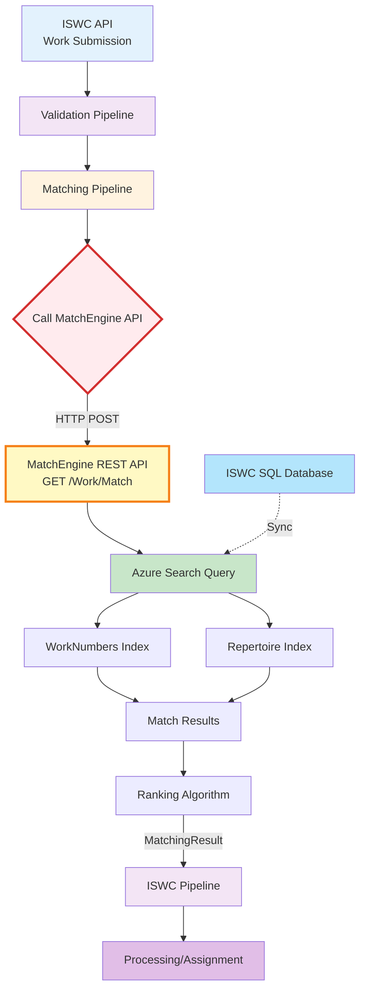
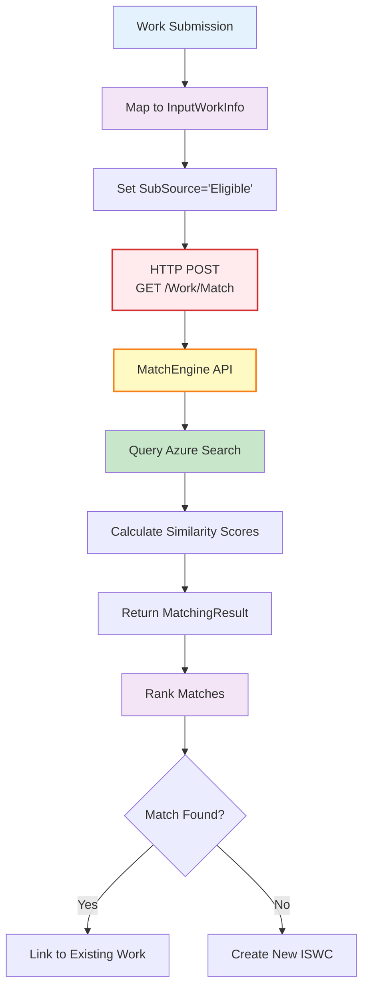
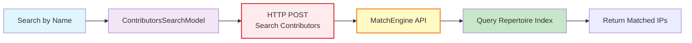

# Matching Engine - ISWC System Component Documentation

**Version:** 1.0
**Date:** 2025-10-27

---

## Sources

**Primary:**

- SPE_20190424_MVPMatchingRules.md - MVP Matching Rules Design Specification
- SPE_20190218_ISWCDataModel_REV (PM).md - Data Model Specification (Matching Engine Schema)

**Secondary:**

- Workshop 2 - Documentation & Infrastructure (Oct 21, 2025)

**Tertiary:**

- 42+ source code files implementing Matching Engine integration

**Search Terms Used:**

- Primary: Matching Engine, MatchEngine, Match Engine, Spanish Point Matching Engine
- API terms: GET/Work/Match, MatchingApi, InputWorkInfo, MatchResult, MatchingResult
- Technology: Azure Search, Lucene, search indices, similarity calculation
- Pipeline terms: matching pipeline, matching component, match source
- Data structures: WorkNumbers, WorkName, Contributors, Performers
- Code interfaces: IMatchingService, MatchingEngineMatchingService, MatchingManager
- Code entities: MatchingWork, MatchSource, InputWorkInfo, MatchingResult
- Integration: HttpClient, MatchingEngineClientCredentialsOptions, ProtectedApiBearerTokenHandler
- Related: validation, ISWC eligible, non-eligible, ranking, disambiguation

---

## Overview

The Matching Engine is an **external component** - a separate Spanish Point product that provides work matching and duplicate detection capabilities for the ISWC system.

> **From [MVP Matching Rules](../../resources/core_design_documents/SPE_20190424_MVPMatchingRules/SPE_20190424_MVPMatchingRules.md) → Section 2.3 "Matching Rule Implementation":** "All matching will be carried out by the Spanish Point Matching Engine. The existing matching engine will be extended to cater for rules not currently in place in the matching engine."

> **From [Workshop 2](../../meetings/20251021-ISWC%20Audit%20-%20Workshop%202%20-%20Documentations%20and%20infrastructure.txt) (Line 153, Xiyuan Zeng):** "The system also has an internal dependency, which is called Match Engine, non-SWC. That is one on the left. The MatchEngine components are not outlining here. But the MatchEngine has multiple services in here. The main one that you're using here is, I think it's a MatchEngine API... ISWC is not directly integrated at source code level to match engine components. We treat match engine as another application that deployed alongside IWC and IWC call match engine as a client application."

**⚠️ CRITICAL ARCHITECTURAL NOTE:** The Matching Engine is NOT part of the ISWC codebase. It is deployed as a separate application in the same Azure subscription and accessed via REST API, similar to external services like FastTrack SSO.

---

## Primary Purpose

**Official Purpose from Specifications:**

The Matching Engine determines whether a submitted work already exists in the ISWC database by comparing titles, contributors, and other metadata, enabling:

1. **Duplicate Detection** - Identify if a work submission matches an existing work
2. **ISWC Assignment** - Decide whether to allocate a new ISWC or link to existing preferred ISWC
3. **Work Consolidation** - Associate multiple agency submissions of the same work under one ISWC
4. **Search Functionality** - Power work searches by title and contributor

**Key Capabilities:**

- **Fuzzy Title Matching** - Language-independent similarity calculation algorithm
- **Contributor Matching** - Match by IPI name number and base number
- **Performer Matching** - Include performer data in match calculations
- **Configurable Rules** - Different matching thresholds for "Eligible" vs "NonEligible" sources
- **Ranking Algorithm** - Sort match results by confidence score
- **Multi-Source Matching** - Different match strategies for Agency, Publisher, Label, Search

**Role in ISWC Architecture:**

- **External Dependency** - Separate product deployed alongside ISWC
- **Client-Server Integration** - ISWC acts as client calling Matching Engine API
- **Matching Pipeline Component** - Invoked during submission processing pipeline
- **Search Index Provider** - Maintains Azure Search indices synchronized from SQL database

---

## Technical Architecture

### Infrastructure Components

**Azure Services:**

- **Azure Search Service** - Lucene-based search indices for fast fuzzy matching
  - Work Numbers index (ISWCs, society work codes)
  - Work Name/Contributors/Performers index (titles, creators, publishers, performers)
- **SQL Server Database** - Matching configuration rules and settings
- **Azure App Service** - Hosts Matching Engine REST API
- **Azure Key Vault** - Stores API credentials and connection strings (ISWC side)
- **Identity Server** - OAuth2 authentication for API access

**Technology Stack:**

- **Search Engine**: Azure Search (Apache Lucene-based)
- **Configuration**: SQL database for matching rules
- **API Protocol**: REST (HTTP/JSON)
- **Authentication**: OAuth2 Client Credentials flow
- **Similarity Algorithm**: Language-independent string similarity calculation
- **Integration Pattern**: HTTP Client with bearer token authentication

### Storage and Data Persistence

**Azure Search Indices:**

> **From [ISWC Data Model](../../resources/core_design_documents/SPE_20190218_ISWCDataModel_REV%20(PM)/SPE_20190218_ISWCDataModel_REV%20(PM).md) → Section 7 "Matching Engine Schema":** "The Spanish Point Matching Engine comprises of two schemas: Azure Search Indices and an SQL database. The Core Matching Engine has a work name and connected party index. This includes titles, creators, publishers and performers and a number index including ISWCs and society work numbers."

**1. WorkNumbers Index:**

- **GeneratedID** - Autogenerated identifier
- **WorkCode** - Mapped from Work.WorkID
- **TypeCode** - Society ID or "ISWC"
- **Number** - Society work code or ISWC value
- **IsDeleted** - Logical deletion flag

**2. Repertoire-Work Name, Contributors, Performers Index:**

- **GeneratedID** - Autogenerated identifier
- **WorkCode** - Work.WorkID
- **WorkName** - Title.Title
- **WorkNameType** - Title.TitleTypeID
- **PersonID** - Contributor.InterestedPartyID or Performer.PerformerID
- **Name** - IPI.Name.LastName
- **PersonType** - Performer or Contributor indicator
- **ContributorType** - Contributor.ContributorRoleTypeID
- **IsDeleted** - Logical deletion flag
- **IPINumber** - IPI.Name.IPINameNumber

**Configuration Database:**

- Matching rule thresholds (percentage scores)
- Source-specific configurations ("Eligible" vs "NonEligible")
- Field weights and scoring parameters

### Integration Points with ISWC System

**🔴 CRITICAL: External Component Coupling**

The Matching Engine is coupled to ISWC through:

1. **REST API Contract** - `GET /Work/Match` endpoint
2. **Data Synchronization** - ISWC SQL database → Azure Search indices (one-way)
3. **Authentication** - OAuth2 client credentials
4. **HTTP Client** - Named client "MatchingApi" in ISWC codebase
5. **Shared Data Models** - InputWorkInfo, MatchingResult entities

**Upstream Dependencies (What Matching Engine depends on):**

- **ISWC SQL Database** - Source of truth for work data synchronized to Azure Search
- **Identity Server** - OAuth2 token provider for API authentication
- **Azure Search Service** - Search index infrastructure

**Downstream Dependencies (What depends on Matching Engine):**

- **ISWC Submission Pipeline** - All work submissions call matching
- **ISWC Search Functionality** - Portal work searches use matching
- **Validation Rules** - Post-matching validation depends on match results
- **Processing (Assignment) Pipeline** - ISWC allocation depends on match outcomes

---

## How It Works

### High-Level Integration Architecture



**Key Integration Points:**

- 🔴 **External API Call** (D→E): ISWC makes HTTP POST to external Matching Engine
- 🔵 **Data Sync** (M→F): ISWC database changes flow to Azure Search indices
- ⚫ **Authentication**: OAuth2 bearer token attached to every API request

### Detailed Matching Flow

#### 1. Submission Matching (ISWC Eligible)



**Matching Steps:**

1. **Data Mapping** - ISWC converts `Submission` to `InputWorkInfo`:
   - OriginalTitle → WorkName
   - InterestedParties → Contributors (with IPI numbers)
   - Performers → Performer array
   - SubSource = "Eligible" (or "NonEligible", "Label", "Search")

2. **API Call** - `MatchingEngineMatchingService.MatchAsync()` calls HTTP endpoint:
   ```
   POST https://[matchengine-url]/api/Work/Match
   Headers:
     Authorization: Bearer [OAuth2-token]
     Content-Type: application/json
   Body:
     {
       "WorkName": "Title of the Song",
       "Contributors": [{"IpNameNumber": 123456, ...}],
       "SubSource": "Eligible",
       ...
     }
   ```

3. **Search Execution** - Matching Engine queries Azure Search:
   - Fuzzy title matching with similarity threshold
   - Contributor IPI number exact matching
   - Performer name matching
   - Combined scoring algorithm

4. **Result Ranking** - Matches sorted by:
   - Similarity score (percentage)
   - Authoritative flag
   - ISWC status (preferred vs non-preferred)
   - Linked-to chain following

5. **Response Processing** - ISWC receives `MatchingResult`:
   ```json
   {
     "Matches": [
       {
         "WorkCode": 12345,
         "WorkName": "Title of the Song",
         "Similarity": 95.5,
         "IsDefinite": true,
         "IswcStatusID": 2,
         "Numbers": [{"Number": "T-123.456.789-0", "TypeCode": "ISWC"}],
         "Contributors": [...]
       }
     ],
     "ErrorMessage": null
   }
   ```

#### 2. Contributor Matching (Search)

For searching contributors by name, a separate flow exists:



---

## File/Data Formats

### API Request Format: InputWorkInfo

**From Code:** [InputWorkInfo.cs](../../resources/source-code/ISWC/src/Data/Services/Matching/MatchingEngine/Entities/InputWorkInfo.cs)

```csharp
public class InputWorkInfo
{
    public string WorkName { get; set; }          // Original title
    public string SubSource { get; set; }         // "Eligible", "NonEligible", "Label", "Search"
    public bool SkipContributorCountRules { get; set; }
    public IEnumerable<Contributor> Contributors { get; set; }
    public IEnumerable<Performer> Performers { get; set; }
    public IEnumerable<WorkNumber> Numbers { get; set; }
    // ... additional fields
}
```

**SubSource Values:**

- **"Eligible"** - ISWC-eligible agencies (stricter matching rules)
- **"NonEligible"** - Non-eligible agencies (more lenient matching)
- **"Label"** - Label/publisher submissions (special IP handling)
- **"Search"** - Search queries (different ranking logic)

### API Response Format: MatchingResult

**From Code:** [MatchingResult.cs](../../resources/source-code/ISWC/src/Data/Services/Matching/MatchingEngine/Entities/MatchingResult.cs)

```csharp
public class MatchingResult
{
    public IEnumerable<MatchingWork> Matches { get; set; }
    public string ErrorMessage { get; set; }
}

public class MatchingWork
{
    public long WorkCode { get; set; }           // Work.WorkID
    public string WorkName { get; set; }
    public decimal Similarity { get; set; }       // Percentage score (0-100)
    public bool IsDefinite { get; set; }          // High-confidence match
    public int? IswcStatusID { get; set; }        // 1=Non-preferred, 2=Preferred
    public bool IsAuthoritative { get; set; }
    public IEnumerable<WorkNumber> Numbers { get; set; }
    public IEnumerable<WorkContributor> Contributors { get; set; }
    public IEnumerable<Performer> Performers { get; set; }
}
```

**Match Confidence Levels:**

- **IsDefinite = true** - High-confidence match (similarity > configured threshold)
- **IsDefinite = false** - Possible match requiring manual review
- **Similarity** - Percentage score (e.g., 95.5 = 95.5% match)

### Configuration Format: Matching Rules

> **From [MVP Matching Rules](../../resources/core_design_documents/SPE_20190424_MVPMatchingRules/SPE_20190424_MVPMatchingRules.md) → Section 4.2 "Key Proposed Matching Settings for CISAC ISWC Database":**

**For "Eligible" Source:**

- Title matching: **85%** similarity threshold
- Contributor matching: **At least 1 matching IPI number**
- Performer matching: **Optional, adds to score**

**For "NonEligible" Source:**

- Title matching: **70%** similarity threshold (more lenient)
- Contributor matching: **At least 1 matching IPI number OR name**
- Performer matching: **Optional**

---

## Integration with Other Components

### Upstream Dependencies

**What Matching Engine depends on:**

1. **ISWC SQL Database** - Source of all work data
   - Works, Titles, Contributors, Performers synchronized to Azure Search
   - Changes replicated via Azure Search indexer

2. **Azure Search Service** - Infrastructure for search indices
   - WorkNumbers index
   - Repertoire (work name/contributors/performers) index

3. **Identity Server (OAuth2)** - API authentication
   - ISWC obtains bearer token
   - Token passed in Authorization header

### Downstream Dependencies

**What depends on Matching Engine:**

1. **ISWC Submission Pipeline** - Every work submission calls matching
   - Determines if work already exists
   - Decides new ISWC vs link to existing

2. **Search Functionality** - Portal work searches
   - Search by title and contributor
   - Display existing works to agencies

3. **Validation Rules** - Post-matching validation
   - PV rules check match results
   - Validate ISWC allocation decisions

4. **Workflow Tasks** - Merge/update approval workflows
   - Matching determines if update affects existing ISWC
   - Creates workflow tasks for manual review

### Related Components

**Direct Integration:**

- **PipelineManager** - Orchestrates matching in submission flow
- **MatchingManager** - Business logic layer wrapping matching service
- **IMatchingService** - Abstraction layer (interface)
- **MatchingEngineMatchingService** - HTTP client implementation

**Indirect Integration:**

- **Validation Pipeline** - Uses match results for validation rules
- **Processing Pipeline** - Uses match results for ISWC assignment
- **Audit Logging** - Logs match results in Cosmos DB
- **Reporting** - Statistics on match rates and accuracy

### System Architecture Position

> **From [MVP Matching Rules](../../resources/core_design_documents/SPE_20190424_MVPMatchingRules/SPE_20190424_MVPMatchingRules.md) → Section 2.3 "Matching Rule Implementation":** "The ISWC Database Web API will use a Matching Pipeline that will in turn call the Spanish Point Matching Engine through its own web API to carry out all matching tasks."

**Position in Pipeline:**

1. API Request → 2. Validation → **3. Matching (External API Call)** → 4. Processing → 5. Audit

**🔴 Critical Coupling Point:** Matching Engine is invoked synchronously during submission processing, meaning:

- API requests wait for matching to complete
- Matching Engine downtime blocks submissions
- Matching Engine performance directly impacts submission latency

---

## Use Cases

### 1. New Work Submission - Match Found

**Business Scenario:** Agency submits a work that already exists in the database under a different agency's submission.

**Workflow:**

1. Agency A submits work "Bohemian Rhapsody" via API
2. ISWC validates submission (title, contributors present)
3. **Matching Pipeline invoked:**
   - Maps submission to `InputWorkInfo` with SubSource="Eligible"
   - Calls `GET /Work/Match` via HTTP
   - Matching Engine searches Azure Search indices
   - Finds existing work with 96.2% similarity
   - Returns match with ISWC T-010.251.086-2
4. **Processing Pipeline:**
   - Links Agency A's submission to existing Work ID
   - Does NOT allocate new ISWC
   - Associates both agency submissions under preferred ISWC
5. **Response to Agency:** Submission successful, linked to existing ISWC T-010.251.086-2

**Real-World Value:** Prevents duplicate ISWCs for same work, maintains single source of truth

### 2. New Work Submission - No Match Found

**Business Scenario:** Agency submits truly new work not previously in database.

**Workflow:**

1. Agency B submits new original work
2. Validation passes
3. **Matching Pipeline invoked:**
   - Calls Matching Engine API
   - No matches found (similarity scores all below 85% threshold)
   - Returns empty `Matches` array
4. **Processing Pipeline:**
   - Allocates new ISWC from counter
   - Creates new Work entity
   - Marks as preferred ISWC
5. **Response to Agency:** New ISWC allocated: T-923.456.789-0

**Real-World Value:** Ensures new works receive unique ISWCs

### 3. Search for Existing Work

**Business Scenario:** Agency user searches Portal to find ISWC for a work by title and contributor.

**Workflow:**

1. User enters title "Yesterday" and contributor "Paul McCartney" in Portal
2. Portal calls ISWC API search endpoint
3. **Matching Pipeline invoked with SubSource="Search":**
   - Maps search criteria to `InputWorkInfo`
   - Calls Matching Engine
   - Fuzzy matching on title (70% threshold for search)
   - Contributor IPI number matching
   - Returns ranked list of potential matches
4. **Portal displays results:**
   - Top match: "Yesterday" (97.8% similarity) - ISWC T-070.259.805-1
   - Second match: "Yesterday Once More" (82.1%) - ISWC T-010.189.876-3
5. User selects correct match

**Real-World Value:** Enables self-service work lookup, reduces support requests

### 4. Label Matching (IP-Removed Matching)

**Business Scenario:** Label submits work without complete contributor information (common for labels).

**Workflow:**

1. Label submits work with only publisher IPs (no writer IPs)
2. **First matching attempt fails** (requires at least 1 writer IP)
3. **System automatically retries with SubSource="Label":**
   - Removes IP numbers from `InputWorkInfo`
   - Matches only on title and available IPs
   - Uses more lenient thresholds
   - Only accepts **IsDefinite=true AND IswcStatusID=2** (preferred works)
4. If match found, links to existing work
5. If no match, creates provisional work pending IP information

**Real-World Value:** Handles real-world submission patterns from labels with incomplete data

---

## Workflow Details

### Matching Configuration Rules

> **From [MVP Matching Rules](../../resources/core_design_documents/SPE_20190424_MVPMatchingRules/SPE_20190424_MVPMatchingRules.md) → Section 4.1 "Existing Spanish Point Matching Engine Configuration Tool":** "The following screenshot shows the configuration tool for the Spanish Point matching engine..."

**Configurable Parameters:**

- **Match Threshold (%)** - Minimum similarity score to consider a match
- **Contributor Weight** - How much contributor matching affects score
- **Title Weight** - How much title matching affects score
- **Performer Weight** - How much performer matching affects score
- **Require Exact Match On** - Fields requiring 100% match (e.g., IPI numbers)

**Source-Specific Configurations:**

| Parameter | Eligible Source | NonEligible Source |
|-----------|----------------|-------------------|
| Title Similarity | 85% | 70% |
| Min Contributors | 1 IPI match | 1 IPI or name match |
| Include Performers | Yes | Yes |
| Exact ISWC Match | Blocks match | Allows match |

### Error Handling Mechanisms

**Matching Engine API Errors:**

1. **HTTP 401 Unauthorized** - OAuth2 token expired
   - ISWC automatically refreshes token
   - Retries request with new token

2. **HTTP 500 Internal Server Error** - Matching Engine failure
   - ISWC logs error to Application Insights
   - Returns error to submitting agency
   - Submission marked as failed in audit log

3. **HTTP Timeout** - Matching Engine unresponsive
   - Configurable timeout (default 30 seconds)
   - Retries up to 3 times with exponential backoff
   - If all retries fail, submission rejected

4. **Azure Search Index Out of Sync**
   - Matching may return stale results
   - Background indexer job keeps indices updated
   - No real-time error detection

**From Code:** [MatchingEngineMatchingService.cs](../../resources/source-code/ISWC/src/Data/Services/Matching/MatchingEngine/MatchingEngineMatchingService.cs) includes retry logic and error handling.

### Edge Cases and Special Conditions

**1. Multiple Matches with Same Score:**

- Ranking algorithm uses secondary factors:
  - Authoritative flag (agency-submitted works preferred)
  - ISWC status (preferred > non-preferred)
  - Creation date (older works preferred)
- If still tied, all returned and workflow task created for manual review

**2. Matching After IP Removal:**

> **From [MVP Matching Rules](../../resources/core_design_documents/SPE_20190424_MVPMatchingRules/SPE_20190424_MVPMatchingRules.md) → Section 3.11 "Alter IPs and then redo matching":** "If the submission contains one or more of the following IPs then remove them from the InputWorkInfo parameter of the GET/Work/Match operation and then go back to the applicable matching pipeline component (ISWC Eligible or ISWC Non-Eligible) to attempt to match again."

- Certain "problematic" IPs removed from matching
- Retry matching with reduced IP set
- Prevents false non-matches due to IP data quality issues

**3. FSQ (Query) Transaction Filtering:**

- For query transactions (FSQ), non-preferred ISWCs filtered from results
- Only preferred ISWCs returned
- Prevents confusion with deprecated ISWCs

**4. CUR (Update) Transaction Special Handling:**

- Update transactions include provisional matches
- Combines standard matches with label matches
- Allows updates to link to works found via either method

**5. PRS-Prefixed Work Filtering:**

- Works with "PRS_" prefix in work numbers filtered out
- Specific to certain agency legacy data
- Prevents false matches on legacy identifiers

---

## Source Code References

### Framework & HTTP Client Integration

**HTTP Client Infrastructure** (`src/Framework/Http/`)

- [IdentityServerClient.cs](../../resources/source-code/ISWC/src/Framework/Http/Client/IdentityServerClient.cs) - OAuth2 token acquisition for Matching Engine
- [MatchingEngineClientCredentialsOptions.cs](../../resources/source-code/ISWC/src/Framework/Http/Client/Options/MatchingEngineClientCredentialsOptions.cs) - OAuth2 configuration options
- [ProtectedApiBearerTokenHandler.cs](../../resources/source-code/ISWC/src/Framework/Http/Handler/ProtectedApiBearerTokenHandler.cs) - Injects bearer token into HTTP requests

### Data Services - Matching Integration

**Service Layer** (`src/Data/Services/Matching/`)

- [IMatchingService.cs](../../resources/source-code/ISWC/src/Data/Services/Matching/IMatchingService.cs) - Matching service interface (`MatchAsync`, `MatchContributorsAsync`)
- [MatchingEngineMatchingService.cs](../../resources/source-code/ISWC/src/Data/Services/Matching/MatchingEngine/MatchingEngineMatchingService.cs) - HTTP client implementation calling Matching Engine API (200+ lines)

**API Entities** (`src/Data/Services/Matching/MatchingEngine/Entities/`)

- [InputWorkInfo.cs](../../resources/source-code/ISWC/src/Data/Services/Matching/MatchingEngine/Entities/InputWorkInfo.cs) - Request model for GET /Work/Match
- [MatchingResult.cs](../../resources/source-code/ISWC/src/Data/Services/Matching/MatchingEngine/Entities/MatchingResult.cs) - API response wrapper
- [MatchingWork.cs](../../resources/source-code/ISWC/src/Data/Services/Matching/MatchingEngine/Entities/MatchingWork.cs) - Individual match result
- [MatchResult.cs](../../resources/source-code/ISWC/src/Data/Services/Matching/MatchingEngine/Entities/MatchResult.cs) - Legacy match result model
- [MatchSource.cs](../../resources/source-code/ISWC/src/Data/Services/Matching/MatchingEngine/Entities/MatchSource.cs) - Match source enumeration
- [Contributor.cs](../../resources/source-code/ISWC/src/Data/Services/Matching/MatchingEngine/Entities/Contributor.cs) - Contributor entity for matching
- [WorkContributor.cs](../../resources/source-code/ISWC/src/Data/Services/Matching/MatchingEngine/Entities/WorkContributor.cs) - Work contributor association
- [Performer.cs](../../resources/source-code/ISWC/src/Data/Services/Matching/MatchingEngine/Entities/Performer.cs) - Performer entity
- [Person.cs](../../resources/source-code/ISWC/src/Data/Services/Matching/MatchingEngine/Entities/Person.cs) - Person base entity
- [Name.cs](../../resources/source-code/ISWC/src/Data/Services/Matching/MatchingEngine/Entities/Name.cs) - Name entity
- [WorkName.cs](../../resources/source-code/ISWC/src/Data/Services/Matching/MatchingEngine/Entities/WorkName.cs) - Work title entity
- [WorkNumber.cs](../../resources/source-code/ISWC/src/Data/Services/Matching/MatchingEngine/Entities/WorkNumber.cs) - Work number (ISWC, society code)
- [PerformanceForeign.cs](../../resources/source-code/ISWC/src/Data/Services/Matching/MatchingEngine/Entities/PerformanceForeign.cs) - Foreign performance data
- [PerformanceNumber.cs](../../resources/source-code/ISWC/src/Data/Services/Matching/MatchingEngine/Entities/PerformanceNumber.cs) - Performance identifier
- [UsageWorkGroup.cs](../../resources/source-code/ISWC/src/Data/Services/Matching/MatchingEngine/Entities/UsageWorkGroup.cs) - Work grouping for usage

**Search Models** (`src/Data/Services/Matching/MatchingEngine/SearchModels/`)

- [ContributorsSearchModel.cs](../../resources/source-code/ISWC/src/Data/Services/Matching/MatchingEngine/SearchModels/ContributorsSearchModel.cs) - Contributor search criteria
- [SearchField.cs](../../resources/source-code/ISWC/src/Data/Services/Matching/MatchingEngine/SearchModels/SearchField.cs) - Search field enumeration
- [SearchOperator.cs](../../resources/source-code/ISWC/src/Data/Services/Matching/MatchingEngine/SearchModels/SearchOperator.cs) - Search operator enumeration

### Business Layer

**Managers** (`src/Business/Managers/`)

- [MatchingManager.cs](../../resources/source-code/ISWC/src/Business/Managers/MatchingManager.cs) - Business logic orchestration for matching operations

### Business Data Objects (BDO)

**Matching DTOs** (`src/Bdo/MatchingEngine/`)

- [MatchingWork.cs](../../resources/source-code/ISWC/src/Bdo/MatchingEngine/MatchingWork.cs) - Public DTO for matched work
- [MatchResult.cs](../../resources/source-code/ISWC/src/Bdo/MatchingEngine/MatchResult.cs) - Public DTO for match result
- [MatchSource.cs](../../resources/source-code/ISWC/src/Bdo/MatchingEngine/MatchSource.cs) - Match source enumeration (BDO layer)

**Submissions** (`src/Bdo/Submissions/`)

- [Submission.cs](../../resources/source-code/ISWC/src/Bdo/Submissions/Submission.cs) - Contains `MatchResult` property populated by matching service

### Pipeline Components - Post-Matching Validation

**Validation Rules Using Match Results** (`src/PipelineComponents/`)

- [PostMatchingValidator/Rules/PV_04.cs](../../resources/source-code/ISWC/src/PipelineComponents/PostMatchingValidator/Rules/PV_04.cs) - Validates match result logic
- [PostMatchingValidator/Rules/PV_20.cs](../../resources/source-code/ISWC/src/PipelineComponents/PostMatchingValidator/Rules/PV_20.cs) - Post-match validation rule
- [PostMatchingValidator/Rules/PV_21.cs](../../resources/source-code/ISWC/src/PipelineComponents/PostMatchingValidator/Rules/PV_21.cs) - Post-match validation rule
- [PostMatchingValidator/Rules/PV_26.cs](../../resources/source-code/ISWC/src/PipelineComponents/PostMatchingValidator/Rules/PV_26.cs) - Post-match validation rule
- [StaticDataValidator/Rules/PV_03.cs](../../resources/source-code/ISWC/src/PipelineComponents/StaticDataValidator/Rules/PV_03.cs) - Static data validation using match data

### API Layer - Dependency Injection

**Service Registration** (`src/Api.*/Extensions/`)

- [Api.Agency/Extensions/ServiceCollectionExtensions.cs](../../resources/source-code/ISWC/src/Api.Agency/Extensions/ServiceCollectionExtensions.cs) - Registers MatchingApi HTTP client
- [Api.Publisher/Extensions/ServiceCollectionExtensions.cs](../../resources/source-code/ISWC/src/Api.Publisher/Extensions/ServiceCollectionExtensions.cs) - Publisher API DI configuration
- [Api.Label/Extensions/ServiceCollectionExtensions.cs](../../resources/source-code/ISWC/src/Api.Label/Extensions/ServiceCollectionExtensions.cs) - Label API DI configuration
- [Api.ThirdParty/Extensions/ServiceCollectionExtensions.cs](../../resources/source-code/ISWC/src/Api.ThirdParty/Extensions/ServiceCollectionExtensions.cs) - Third party API DI configuration
- [Portal/Extensions/ServiceCollectionExtensions.cs](../../resources/source-code/ISWC/src/Portal/Extensions/ServiceCollectionExtensions.cs) - Portal DI configuration

**Pipeline Integration**

- [Api.Publisher/Managers/PipelineManager.cs](../../resources/source-code/ISWC/src/Api.Publisher/Managers/PipelineManager.cs) - Invokes matching in submission pipeline

### Configuration & Dependency Injection

**DI Registration**

- [Data/AutofacModule.cs](../../resources/source-code/ISWC/src/Data/AutofacModule.cs) - Registers `IMatchingService` → `MatchingEngineMatchingService`
- [Data/MappingProfile.cs](../../resources/source-code/ISWC/src/Data/MappingProfile.cs) - AutoMapper configuration for `Submission` → `InputWorkInfo`

**Project References**

- [Data/Data.csproj](../../resources/source-code/ISWC/src/Data/Data.csproj) - Project dependencies and package references

### Key Patterns and Technologies

**Technology Stack:**

- **HTTP Client**: System.Net.Http.HttpClient with named client pattern ("MatchingApi")
- **Authentication**: OAuth2 Client Credentials flow
- **Serialization**: Newtonsoft.Json for HTTP request/response
- **Mapping**: AutoMapper for `Submission` → `InputWorkInfo` conversions
- **Retry Logic**: Polly policies for transient failures
- **DI**: Autofac and ASP.NET Core dependency injection

**Design Patterns:**

- **External API Integration Pattern**: HTTP client with bearer token authentication
- **Interface Abstraction**: `IMatchingService` hides external dependency
- **DTO Pattern**: Separate entities for API contract (`InputWorkInfo`) vs business layer (`Submission`)
- **Factory Pattern**: `IHttpClientFactory` creates configured HTTP clients
- **Circuit Breaker**: Resilience policies for external API failures (Polly)
- **Adapter Pattern**: `MatchingEngineMatchingService` adapts Matching Engine API to ISWC interface

**Configuration:**

- **Endpoint URL**: Configured in appsettings.json per environment (dev/UAT/prod)
- **OAuth2 Credentials**: Client ID/secret stored in Azure Key Vault
- **Timeout**: Configurable HTTP request timeout (default 30 seconds)
- **Retry Policy**: 3 retries with exponential backoff

---

## Questions for Further Investigation

- [ ] What is the actual Matching Engine API endpoint URL in production?
- [ ] What is the average matching API call latency (p50, p95, p99)?
- [ ] How often does the Azure Search indexer synchronize from ISWC SQL database?
- [ ] What is the indexer lag time (time between SQL change and Azure Search index update)?
- [ ] Is there monitoring/alerting for Matching Engine API availability?
- [ ] What happens if Matching Engine is down during high-volume submission periods?
- [ ] How is the OAuth2 token caching/renewal handled (expiration time, refresh strategy)?
- [ ] What percentage of submissions result in matches vs new ISWC allocations?
- [ ] Are there retry policies configured for transient Matching Engine failures?
- [ ] What is the Matching Engine SLA (uptime, response time)?
- [ ] Is the Matching Engine source code available for audit as mentioned in Workshop 2?
- [ ] What version of Azure Search is used (Classic vs Cognitive Search)?
- [ ] How are matching configuration changes deployed (manual vs automated)?
- [ ] What monitoring exists for match quality (false positives, false negatives)?

---

## References

### Core Design Documents

- **[MVP Matching Rules Specification](../../resources/core_design_documents/SPE_20190424_MVPMatchingRules/SPE_20190424_MVPMatchingRules.md)** - Complete matching implementation design (60+ pages)
- **[ISWC Data Model Specification](../../resources/core_design_documents/SPE_20190218_ISWCDataModel_REV%20(PM)/SPE_20190218_ISWCDataModel_REV%20(PM).md) → Section 7 "Matching Engine Schema"** - Azure Search indices schema
- **[MVP Validation Rules](../../resources/core_design_documents/SPE_20190424_MVPValidationRules/SPE_20190424_MVPValidationRules.md)** - Post-matching validation rules
- **[ISWC Portal Specification](../../resources/core_design_documents/SPE_20190806_ISWC_Portal/SPE_20190806_ISWC_Portal.md)** - Portal search using Matching Engine
- **[ISWC Reporting Specification](../../resources/core_design_documents/SPE_20200602_ISWC_Reporting/SPE_20200602_ISWC_Reporting.md)** - Matching statistics reporting

### Meeting Transcripts

- **[Workshop 2 - Documentation & Infrastructure](../../meetings/20251021-ISWC%20Audit%20-%20Workshop%202%20-%20Documentations%20and%20infrastructure.txt) (Oct 21, 2025)** - External component clarification and architecture discussion

### Key Information Sources

- **[MVP Matching Rules](../../resources/core_design_documents/SPE_20190424_MVPMatchingRules/SPE_20190424_MVPMatchingRules.md) → Section 2.3 "Matching Rule Implementation"** - Matching Engine as Spanish Point product
- **[MVP Matching Rules](../../resources/core_design_documents/SPE_20190424_MVPMatchingRules/SPE_20190424_MVPMatchingRules.md) → Section 3.2 "Matching Engine API"** - REST API endpoint specification
- **[MVP Matching Rules](../../resources/core_design_documents/SPE_20190424_MVPMatchingRules/SPE_20190424_MVPMatchingRules.md) → Section 3.3 "GET/Work/Match"** - API request/response contract
- **[MVP Matching Rules](../../resources/core_design_documents/SPE_20190424_MVPMatchingRules/SPE_20190424_MVPMatchingRules.md) → Section 4.2 "Key Proposed Matching Settings"** - Eligible vs NonEligible configuration
- **[ISWC Data Model](../../resources/core_design_documents/SPE_20190218_ISWCDataModel_REV%20(PM)/SPE_20190218_ISWCDataModel_REV%20(PM).md) → Section 7.1 "Azure Search Indices"** - WorkNumbers and Repertoire index schemas
- **[Workshop 2](../../meetings/20251021-ISWC%20Audit%20-%20Workshop%202%20-%20Documentations%20and%20infrastructure.txt) (Line 153, Xiyuan Zeng)** - External component architecture explanation
- **[Workshop 2](../../meetings/20251021-ISWC%20Audit%20-%20Workshop%202%20-%20Documentations%20and%20infrastructure.txt) (Line 213)** - Matching Engine not in Portal, separate component
- **[Workshop 2](../../meetings/20251021-ISWC%20Audit%20-%20Workshop%202%20-%20Documentations%20and%20infrastructure.txt) (Line 249, Xiyuan Zeng)** - Matching Engine as separate product, not part of CISAC application

---

## Document History

| Version | Date | Author | Changes |
|---------|------|--------|---------|
| 1.0 | 2025-10-27 | Documentation Team | Initial document created via /document-component command; Comprehensive three-phase research (4 design docs, 42+ code files, 1 meeting transcript); **Focus on external component integration and coupling architecture**; Mermaid diagrams for API integration and matching flows; Documented OAuth2 authentication, HTTP client pattern, and error handling |

---

## Known Gaps and Contradictions

### 🔴 External Component Access and Source Code Availability

**Meeting discussion indicates access restrictions:**

> **From [Workshop 2](../../meetings/20251021-ISWC%20Audit%20-%20Workshop%202%20-%20Documentations%20and%20infrastructure.txt) (Line 87, Yann Lebreuilly):** "I found that it's in the terms of a contract to have access to both the code for especially the ISWC Cisac code and the matching engine. It's written in the contract, so please do accordingly and provide the interested rights to Bastien and Guillaume."

> **From [Workshop 2](../../meetings/20251021-ISWC%20Audit%20-%20Workshop%202%20-%20Documentations%20and%20infrastructure.txt) (Line 249, Xiyuan Zeng):** "MatchEngine you currently do not have access to, because that's not part of Cisac application itself."

**Contradiction:**

- **Contract states:** Access to Matching Engine code should be provided
- **Current status:** Access not granted as "not part of CISAC application"

**Impact:** **High** - Cannot audit Matching Engine implementation, matching algorithm, or performance characteristics

**Resolution Needed:** Clarify contract terms and grant access to Matching Engine codebase if contractually entitled

### 🔍 Azure Search Synchronization Mechanism Unclear

**Specification mentions synchronization but lacks details:**

> **From [ISWC Data Model](../../resources/core_design_documents/SPE_20190218_ISWCDataModel_REV%20(PM)/SPE_20190218_ISWCDataModel_REV%20(PM).md) → Section 7 "Matching Engine Schema":** "The data for these indices will be continuously synchronized from the main Azure SQL database"

**Questions:**

- What is the synchronization mechanism? (Azure Search indexer? Custom job? Real-time?)
- What is the lag time between SQL update and index availability?
- How are synchronization failures detected and handled?
- Is synchronization uni-directional (SQL → Search) or bi-directional?

**Impact:** **Medium** - Affects matching accuracy if indices are stale

**Resolution Needed:** Document synchronization architecture and monitoring

### 🔍 Matching Engine Deployment Architecture Unclear

**Workshop mentions "deployed alongside ISWC":**

> **From [Workshop 2](../../meetings/20251021-ISWC%20Audit%20-%20Workshop%202%20-%20Documentations%20and%20infrastructure.txt) (Line 249, Xiyuan Zeng):** "MatchEngine is deployed alongside of Cisac, and the MatchEngine is a separate product used as a dependency... in the same subscription to be precise, in terms of the deployment."

**Ambiguities:**

- What Azure resources does Matching Engine use (App Service? Container? VM)?
- How many instances run (single? load balanced?)?
- Is Matching Engine shared across environments (dev/UAT/prod) or separate?
- What is the scaling strategy (manual? auto-scale?)?

**Impact:** **Medium** - Affects capacity planning and disaster recovery

**Resolution Needed:** Obtain Matching Engine infrastructure architecture diagram

### ⚠️ No SLA Documentation for External Dependency

**Critical external dependency lacks SLA:**

- Matching Engine is **synchronous blocking call** in submission pipeline
- Matching Engine downtime = submission processing downtime
- No documented SLA for availability, response time, or error rates

**Impact:** **High** - Business continuity risk if Matching Engine fails

**Mitigation Needed:**

- Establish SLA with Matching Engine team
- Implement circuit breaker pattern for graceful degradation
- Consider asynchronous matching for non-critical submissions

### 🔍 OAuth2 Token Management Details Missing

**Specification mentions OAuth2 but lacks implementation details:**

**Questions:**

- What is the token expiration time?
- Is token cached? For how long?
- What happens if token refresh fails mid-submission?
- Is there token pre-fetching to avoid latency?
- What OAuth2 scopes are requested?

**Impact:** **Low** - Implementation handles it, but monitoring/troubleshooting difficult

**Resolution Needed:** Document token lifecycle and error scenarios

### 🔍 Matching Configuration Change Management Unclear

**Specification describes configuration tool but not change process:**

> **From [MVP Matching Rules](../../resources/core_design_documents/SPE_20190424_MVPMatchingRules/SPE_20190424_MVPMatchingRules.md) → Section 4.1:** "The following screenshot shows the configuration tool for the Spanish Point matching engine"

**Questions:**

- Who has access to configuration tool?
- How are configuration changes approved (change management)?
- Are changes version-controlled?
- Is there a test environment for configuration changes?
- How are configuration changes deployed to production?

**Impact:** **Medium** - Uncontrolled config changes could affect matching accuracy

**Resolution Needed:** Document configuration change governance process

### 🔔 No Documented Fallback Strategy for Matching Engine Failure

**Single point of failure:**

If Matching Engine is unavailable:

- Can submissions proceed without matching?
- Is there a fallback to always create new ISWC?
- Are submissions queued for later matching?
- Is there manual intervention process?

**Impact:** **High** - No business continuity plan for external dependency failure

**Resolution Needed:** Define and implement fallback/degradation strategy
