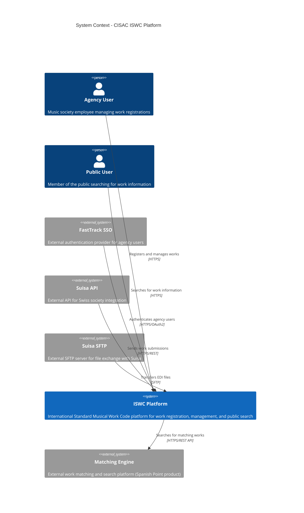
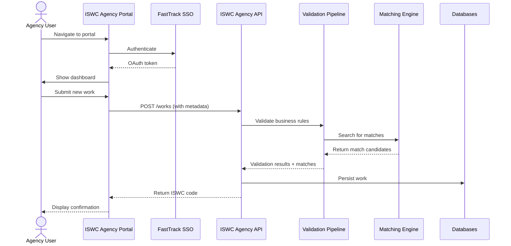
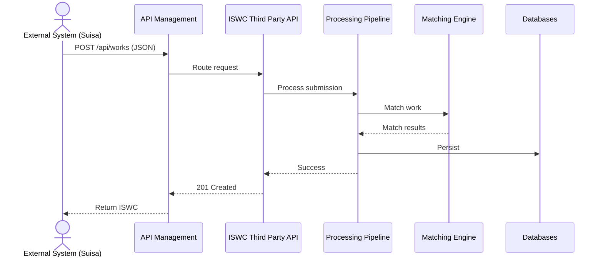
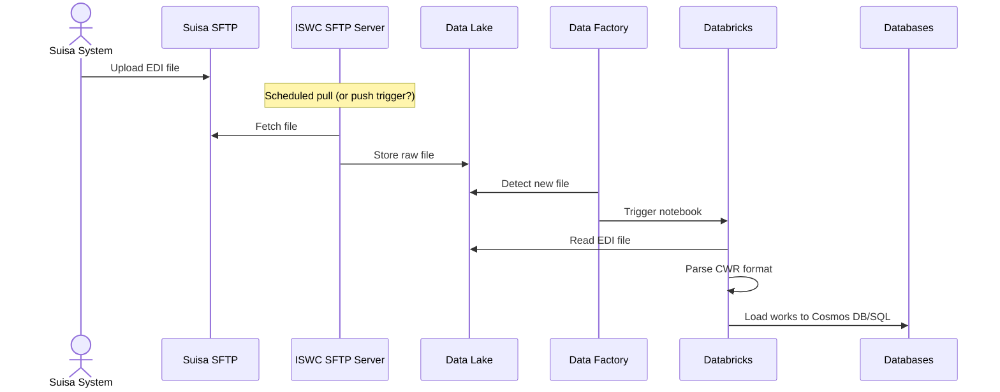
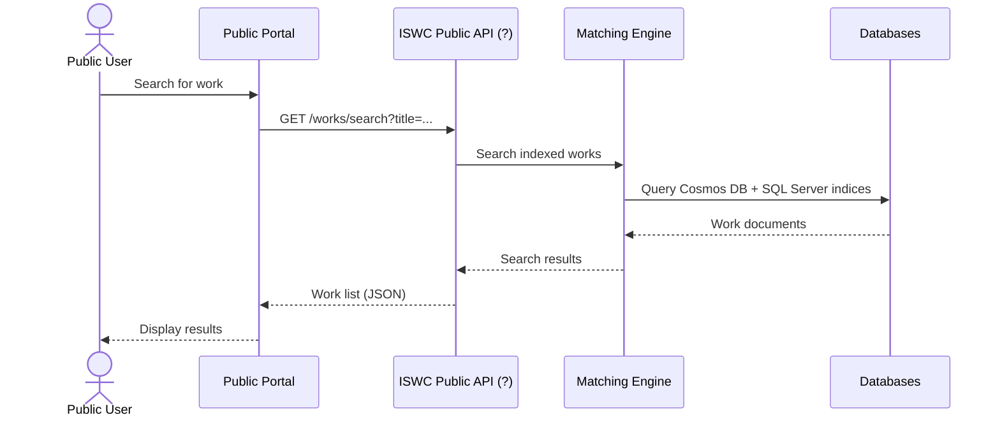

# C4 Level 1: System Context - CISAC ISWC Platform

**Version:** 1.0
**Date:** 2025-10-29
**Status:** 🔴 Awaiting Validation

## Document Purpose

This document defines the System Context (C4 Level 1) for the CISAC ISWC system, showing the system boundaries, external actors, and external systems with which it integrates.

**Validation Status:** This document has been built from primary sources and requires domain expert validation before proceeding to Level 2 (Container View).

---

## Validation Sources

**Primary Sources:**

- [InfrastructureDiagram.png](../../../resources/InfrastructureDiagram.png) - Authoritative Azure deployment diagram
- [Azure Resources Export CSV](../../../resources/Azureresources-export-20251021.csv) - Complete Azure resource inventory

**Secondary Sources:**

- [Core Design Documents](../../../resources/core_design_documents/) - 12 functional specifications
  - SPE_20190806_ISWC_Portal.md - Agency Portal specification
  - SPE_20200108_ISWC_Public_Portal.md - Public Portal specification
  - SPE_20191217_CISAC ISWC REST API.md - REST API specification

**Tertiary Sources:**

- [Source Code](../../../resources/source-code/ISWC/src/) - Implementation evidence
  - Matching Engine HTTP client configuration
  - Database connection strings
  - External system integration patterns

---

## System Context Diagram



---

## System Definitions

### 1. ISWC Platform (Main System in Scope)

**Type:** Software System
**Scope:** Within audit scope
**Owner:** CISAC
**Developed & Maintained by:** Spanish Point Technologies
**Deployed on:** Azure (West Europe)

#### Description

The ISWC Platform is the core system for managing International Standard Musical Work Codes (ISWCs). It provides:

- **Work Registration:** Agencies submit new musical works for ISWC assignment
- **Work Management:** Agencies update, merge, and manage existing works
- **Public Search:** Public users search for work information
- **File Processing:** Batch EDI and JSON file imports
- **IPI Integration:** Synchronization with Interested Party Information database
- **Matching & Validation:** Automated work matching and business rule validation
- **Reporting:** Analytics and data exports for societies

#### Key Capabilities

1. **Multi-Channel Submission:**
   - Web portal (Agency Portal, Public Portal)
   - REST APIs (Agency, Label, Publisher, Third Party)
   - File transfer (EDI via SFTP, JSON files)

2. **Data Processing:**
   - Validation pipelines (business rules, ISWC eligibility)
   - Matching pipelines (duplicate detection via Matching Engine)
   - Processing pipelines (persistence, indexing)
   - IPI synchronization (quarterly full sync, incremental updates)

3. **Data Storage:**
   - Relational: SQL Server (ISWC Database, IPI Database)
   - NoSQL: Cosmos DB (WID JSON, ISWC JSON)
   - Big Data: Data Lake (raw files, processed data)

4. **Background Processing:**
   - Azure Functions for scheduled jobs
   - Azure Databricks for ETL and data transformation
   - Azure Data Factory for pipeline orchestration

#### Technology Stack

- **Frontend:** React 16.12 + TypeScript 3.7.3 + Redux 4.0.4
- **Backend APIs:** ASP.NET Core 3.1 (⚠️ **EOL Dec 2022 - Technical Debt**)
- **Background Jobs:** Azure Functions v3
- **Data Processing:** Azure Databricks 10.4 LTS (⚠️ **Outdated - Technical Debt**)
- **Databases:** Azure SQL Server, Azure Cosmos DB (MongoDB API)
- **Storage:** Azure Data Lake Storage Gen2
- **Orchestration:** Azure Data Factory v2

#### Evidence from Validation Sources

**From Azure Resources CSV:**

- 4 separate API App Services confirmed in production:
  - `cisaciswcapiprod` (Agency API)
  - `cisaciswcapilabelprod` (Label API)
  - `cisaciswcapipublisherprod` (Publisher API)
  - `cisaciswcapithirdpartyprod` (Third Party API)
- 2 portal App Services:
  - `cisaciswcportaldev/uat/prod` (Agency Portal)
  - `cisaciswcpublicdev/uat/prod` (Public Portal)
- Infrastructure services:
  - `cisaciswcdev/uat/prod` (API Management, Data Factory, Cosmos DB, Key Vault, App Insights)
  - `ISWCDev/UAT/Prod` (Databricks, App Service Plan)
  - `cisaciswcwedev/uat/prod` (SQL Server)

**From InfrastructureDiagram.png:**

- Shows complete Azure architecture with all major components
- Confirms external system integrations
- Shows Matching Engine in separate grouping

**From Source Code:**

- 4 separate API projects: Api.Agency, Api.Label, Api.Publisher, Api.ThirdParty
- Portal project exists (Agency Portal)
- ⚠️ **Public Portal source code NOT FOUND** (despite App Service being deployed)
- Jobs project (Azure Functions)
- Data project with SQL Server and Cosmos DB access

#### Open Questions for Validation

1. ✅ **ANSWERED:** Are there 4 separate API App Services or 1 combined? **→ 4 SEPARATE (confirmed in Azure CSV)**
2. ⚠️ **OPEN:** Where is the Public Portal source code? It's deployed but not in repository
3. ⚠️ **OPEN:** Is there a separate Admin Portal or is admin functionality in Agency Portal?

---

### 2. Matching Engine (External System)

**Type:** External Software System
**Scope:** Outside audit scope (vendor product)
**Owner:** Spanish Point Technologies
**Integration Method:** HTTP REST API

#### Description

The Matching Engine is a **separate software system** developed and maintained by Spanish Point Technologies. It provides work matching and duplicate detection capabilities for the ISWC Platform.

#### Evidence That Matching Engine is External

**From Source Code (`Framework/HttpClients/MatchingEngine/MatchingEngineMatchingService.cs`):**

```csharp
// HTTP client configured with external base URL
httpClient = httpClientFactory.CreateClient("MatchingApi");

// Configuration in ServiceCollectionExtensions.cs
opt.BaseAddress = new Uri(configuration["BaseAddress-SpanishPointMatchingEngine"]);
```

**Key Evidence:**

1. ✅ **External HTTP API:** ISWC APIs make HTTP calls to Matching Engine (not in-process)
2. ✅ **No source code in repository:** ME Portal, ME API, Search Service not in ISWC repo
3. ✅ **Vendor product:** Spanish Point product, separate development team
4. ✅ **Separate authentication:** Uses OAuth bearer token endpoint

#### Shared Infrastructure Caveat

**IMPORTANT:** While logically external, Matching Engine **shares Azure infrastructure** with ISWC Platform:

- Deployed in same Azure subscription
- Shares same databases (Cosmos DB, SQL Server) for indexing
- Shown in separate resource group in InfrastructureDiagram.png

**C4 Modeling Decision:** Model as **External System** at Level 1 because:

- Separate codebase and development team
- Different product with separate licensing
- HTTP API integration (not internal service calls)
- Audit focus is on vendor independence and coupling risk

#### Integration Pattern

**ISWC Platform → Matching Engine:**

- **Protocol:** HTTPS REST API
- **Authentication:** OAuth bearer tokens
- **Purpose:** Search for matching works during submission validation
- **Data Flow:**
  1. ISWC API receives work submission
  2. Validation pipeline extracts work metadata (title, contributors)
  3. HTTP call to Matching Engine API with search criteria
  4. Matching Engine queries Azure Cognitive Search indices
  5. Returns list of potential matches with confidence scores
  6. ISWC Platform presents matches to agency for disambiguation

**Design Document Reference:**

- SPE_20190424_MVPMatchingRules.md - Matching rules specification

#### Open Questions for Validation

1. ⚠️ **OPEN:** Is Matching Engine truly in same Azure subscription? (Diagram suggests yes, need confirmation)
2. ⚠️ **OPEN:** Can Matching Engine be replaced? What are coupling points?
3. ⚠️ **OPEN:** Does CISAC have access to Matching Engine source code or is it proprietary?

---

## External Systems

### 3. FastTrack SSO (External Authentication)

**Type:** External System (Authentication Provider)
**Owner:** Unknown (Third-party SaaS)
**Integration:** OAuth2 authentication for agency users

#### Description

FastTrack SSO is an external authentication provider used for agency user authentication in the ISWC Agency Portal.

#### Integration Pattern

**Agency Portal → FastTrack SSO:**

- **Protocol:** HTTPS with OAuth2
- **Flow:** User clicks "Login" → Redirected to FastTrack → Authenticated → Redirected back with token
- **Token Type:** Bearer token (JWT or similar)
- **Scope:** Agency Portal only (Public Portal likely uses different auth or none)

**Evidence:**

- InfrastructureDiagram.png shows "External/FastTrack SSO" with arrow to API Management
- Design doc SPE_20190806_ISWC_Portal.md mentions authentication requirements

#### Open Questions for Validation

1. ⚠️ **OPEN:** What happens if FastTrack SSO is unavailable? Is there a fallback?
2. ⚠️ **OPEN:** Are agency credentials managed in FastTrack or federated from societies?
3. ⚠️ **OPEN:** Does Public Portal use FastTrack or different auth?

---

### 4. Suisa API (External Integration)

**Type:** External System (Swiss Music Society)
**Owner:** Suisa (Swiss society)
**Integration:** HTTPS REST API for work submissions

#### Description

Suisa is the Swiss music rights society. The Suisa API allows Suisa to programmatically submit works to the ISWC Platform.

#### Integration Pattern

**Suisa API → ISWC Platform:**

- **Protocol:** HTTPS REST API
- **Routing:** Through Azure API Management gateway
- **Endpoint:** ISWC Third Party API (likely)
- **Format:** JSON (SPE_20191118_ISWC_JSON_FileFormat.md)
- **Authentication:** API key or OAuth (TBD)

**Design Document Reference:**

- SPE_20191217_CISAC ISWC REST API.md - API specification

#### Open Questions for Validation

1. ⚠️ **OPEN:** Which ISWC API receives Suisa submissions? (Agency, Label, Publisher, Third Party?)
2. ⚠️ **OPEN:** What authentication method does Suisa use?
3. ⚠️ **OPEN:** Are there other societies with direct API integration besides Suisa?

---

### 5. Suisa SFTP (External File Exchange)

**Type:** External System (SFTP Server)
**Owner:** Suisa (Swiss society)
**Integration:** SFTP file transfer for EDI file exchange

#### Description

Suisa operates an SFTP server for bulk file exchange with the ISWC Platform using EDI format.

#### Integration Pattern

**Suisa SFTP → ISWC SFTP → Data Factory/Databricks:**

- **Protocol:** SFTP (SSH File Transfer Protocol)
- **File Format:** EDI (CWR format - SPE_20190806_ISWC_EDI_FileFormat.md)
- **Flow:**
  1. Suisa uploads EDI file to Suisa SFTP
  2. ISWC SFTP server pulls file (or Suisa pushes to ISWC SFTP?)
  3. File lands in Azure Data Lake
  4. Data Factory pipeline triggers Databricks notebook
  5. Databricks parses EDI file and loads to Cosmos DB/SQL Server

**Evidence:**

- InfrastructureDiagram.png shows "External/Suisa SFTP" with arrow to "Public IP" → "ISWC SFTP"
- SFTP-Usage.md component doc describes SFTP workflows
- Data Factory deployment folder has linkedService/SuisaSftp.json

**Design Document Reference:**

- SPE_20190806_ISWC_EDI_FileFormat.md - EDI file format specification

#### Open Questions for Validation

1. ⚠️ **OPEN:** Does ISWC pull files from Suisa SFTP, or does Suisa push to ISWC SFTP?
2. ⚠️ **OPEN:** Are there other societies using SFTP besides Suisa?
3. ⚠️ **OPEN:** What is the volume/frequency of SFTP file transfers?

---

## System Interactions

### Work Submission Flows

#### 1. Agency Web Portal Submission



#### 2. API Submission (Third Party Integration)



#### 3. File-Based Submission (EDI via SFTP)



### Public Search Flow



---

## System Boundaries and Ownership

### ISWC Platform Boundary

**What's Inside:**

- All web applications (Agency Portal, Public Portal)
- All APIs (Agency, Label, Publisher, Third Party)
- All background jobs (Azure Functions)
- All data processing (Databricks, Data Factory)
- All databases (SQL Server, Cosmos DB, Data Lake)
- All infrastructure (SFTP server, API Management, Key Vault, etc.)

**Rationale:** These components:

- Are developed and deployed as one platform
- Share the same codebase repository (mostly - Public Portal source missing)
- Are maintained by Spanish Point under ISWC Platform contract
- Execute work registration business logic
- Are deployed in ISWCDev/UAT/Prod resource groups

### Matching Engine Boundary

**What's Inside:**

- Matching Engine Portal (vendor-managed UI)
- Matching Engine API (REST API for work matching)
- Azure Cognitive Search service (indexing)

**Rationale:** These components:

- Are a separate Spanish Point product
- Have separate codebase (not in ISWC repository)
- Are accessed via HTTP API (external integration pattern)
- Could theoretically be replaced by alternative matching solution
- Represent vendor dependency risk

### External System Boundaries

**External Systems:**

- FastTrack SSO
- Suisa API
- Suisa SFTP

**Rationale:** These are owned and operated by external organizations (not CISAC).

---

## Architectural Decisions

### Decision 1: Matching Engine as External System

**Decision:** Model Matching Engine as external system despite shared infrastructure

**Rationale:**

1. Separate codebase and product
2. HTTP API integration pattern
3. Vendor dependency risk is audit focus
4. Could be replaced with different matching solution
5. No source code access in ISWC repository

**Alternatives Considered:**

- Model as internal subsystem: Rejected because it obscures vendor coupling
- Model as separate system in same platform: Ambiguous, doesn't clarify relationship

**Impact:**

- Makes vendor dependency explicit in architecture
- Highlights integration points for replacement analysis
- Aligns with audit goal of assessing vendor independence

### Decision 2: No "Data Platform" Separate System

**Decision:** All data processing containers are part of ISWC Platform system

**Rationale:**

1. Databricks, Data Factory, Cosmos DB, SQL Server serve ISWC Platform
2. They are not independent systems with separate business purposes
3. They are deployment containers within ISWC Platform architecture
4. Source code shows direct access from ISWC APIs and Jobs
5. InfrastructureDiagram.png shows them in same grouping (not separate system boundary)

**Previous Error:** Archived Structurizr DSL incorrectly modeled "Data Platform" as separate system

### Decision 3: No "Networking Infrastructure" System

**Decision:** Networking is Azure infrastructure, not a C4 software system

**Rationale:**

1. Virtual Network, Public IP are network infrastructure
2. They don't execute business logic
3. C4 Level 1 shows software systems, not infrastructure
4. ISWC SFTP is part of ISWC Platform (it's a VM running SFTP software)

**Previous Error:** Archived Structurizr DSL incorrectly modeled "Networking Infrastructure" as system

---

## Critical Gaps and Open Questions

### Critical Gaps

1. **Public Portal Source Code Missing**
   - **Evidence:** App Service exists (`cisaciswcpublicprod`) in Azure CSV
   - **Evidence:** Design doc exists (SPE_20200108_ISWC_Public_Portal.md)
   - **Evidence:** Source code NOT in repository
   - **Impact:** Cannot analyze implementation or assess upgrade effort
   - **Hypothesis:** Separate repository? Planned but not implemented? Deprecated?
   - **Action Required:** Investigate with Spanish Point

2. **Matching Engine Architecture Unknown**
   - **Evidence:** No source code access
   - **Impact:** Cannot assess replacement feasibility
   - **Questions:**
     - How tightly coupled is ME to ISWC data model?
     - Can indexing be replaced with different search technology?
     - What is API contract surface area?
   - **Action Required:** Review ME API contract documentation

3. **Data Factory Pipeline Logic Unknown in Repo**
   - **Evidence:** Pipeline definitions found in deployment/DataFactory/ folder
   - **Status:** Partial - have ARM templates, need to analyze
   - **Impact:** Need to understand ETL orchestration for upgrade planning
   - **Action Required:** Analyze Data Factory JSON definitions

### High Priority Questions for Validation

**Infrastructure:**

1. ⚠️ Are all resources in single Azure subscription?
2. ⚠️ What is the resource group organization strategy?
3. ⚠️ Are Dev/UAT/Prod fully separate or do they share some resources?

**Authentication:**
4. ⚠️ Does Public Portal have authentication or is it anonymous?
5. ⚠️ What authentication does Third Party API use (API keys, OAuth, certificates)?

**Integrations:**
6. ⚠️ Are there other external systems besides FastTrack SSO, Suisa API, Suisa SFTP?
7. ⚠️ How is API Management configured for routing (all APIs through APIM or direct access)?

**Matching Engine:**
8. ⚠️ Does CISAC have access to Matching Engine source code or is it proprietary?
9. ⚠️ Can Matching Engine be disabled for performance/cost testing?
10. ⚠️ What is the licensing model for Matching Engine?

---

## Validation Checklist

Before proceeding to Level 2 (Container View), validate:

### System Boundaries

- [ ] **ISWC Platform** boundary is correct (includes all listed components)
- [ ] **Matching Engine** should be external (vs. internal subsystem)
- [ ] **External Systems** list is complete (no missing integrations)

### Actors

- [ ] **Agency User** description is accurate
- [ ] **Public User** description is accurate
- [ ] Are there other actor types? (Admins, Auditors, etc.)

### Integration Patterns

- [ ] FastTrack SSO authentication flow is correct
- [ ] Suisa API integration pattern is correct
- [ ] Suisa SFTP file exchange pattern is correct
- [ ] Matching Engine API integration is correct

### Open Questions

- [ ] Review all open questions marked with ⚠️
- [ ] Provide answers where known
- [ ] Confirm which questions need investigation

### Critical Gaps

- [ ] Public Portal source code location/status
- [ ] Matching Engine coupling assessment approach
- [ ] Any other missing information before Level 2?

---

## Next Steps

After validation of this System Context:

1. **Proceed to Level 2** - Container View for ISWC Platform
   - Identify all containers (App Services, Functions, Databricks, etc.)
   - Validate 4 API deployment architecture
   - Map source code projects to Azure resources
   - Document container relationships

2. **Resolve Critical Gaps**
   - Investigate Public Portal source code location
   - Request Matching Engine API documentation
   - Analyze Data Factory pipeline definitions

3. **Update This Document**
   - Incorporate validation feedback
   - Answer open questions
   - Update diagrams if system boundaries change

---

## Document History

| Version | Date | Author | Changes |
|---------|------|--------|---------|
| 1.0 | 2025-10-29 | C4 Rebuild Team | Initial System Context built from primary sources (InfrastructureDiagram.png, Azure CSV, source code). Awaiting validation. |

---

## References

**Diagrams:**

- [InfrastructureDiagram.png](../../../resources/InfrastructureDiagram.png) - Primary source
- [Archived Structurizr DSL](../../../work_in_progress/infra/overview/infrastructure-diagram-structurizr.dsl.ARCHIVED) - Historical reference (contains errors)

**Design Documents:**

- [ISWC Portal Specification](../../../resources/core_design_documents/SPE_20190806_ISWC_Portal/)
- [ISWC Public Portal Specification](../../../resources/core_design_documents/SPE_20200108_ISWC_Public_Portal/)
- [ISWC REST API Specification](../../../resources/core_design_documents/SPE_20191217_CISAC%20ISWC%20REST%20API/)
- [EDI File Format](../../../resources/core_design_documents/SPE_20190806_ISWC_EDI_FileFormat/)
- [JSON File Format](../../../resources/core_design_documents/SPE_20191118_ISWC_JSON_FileFormat/)
- [Matching Rules](../../../resources/core_design_documents/SPE_20190424_MVPMatchingRules/)

**Source Code References:**

- Framework/HttpClients/MatchingEngine/ - Matching Engine HTTP client
- Data/ - Database access (SQL Server, Cosmos DB)
- Source code projects: Api.Agency, Api.Label, Api.Publisher, Api.ThirdParty, Portal, Jobs

**Azure Resources:**

- [Azure Resources Export CSV](../../../resources/Azureresources-export-20251021.csv)
- deployment/DataFactory/ - Data Factory pipeline definitions

**Component Documentation:**

- [SFTP-Usage.md](../../SFTP-Usage.md) - SFTP file exchange patterns
- [MatchingEngine.md](../../MatchingEngine.md) - Matching Engine integration
- [Databricks.md](../../Databricks.md) - Data processing
