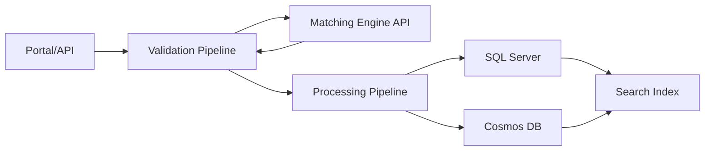
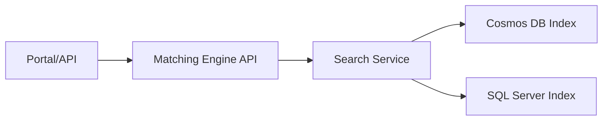
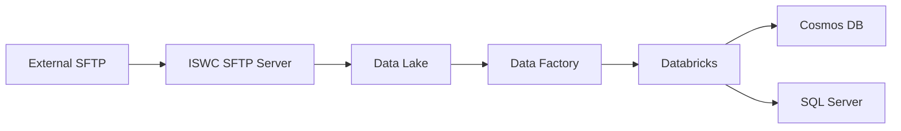
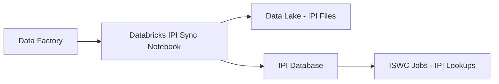

# C4 Level 2: Container View - CISAC ISWC Platform

**Version:** 1.0
**Date:** 2025-10-29
**Status:** 🔴 Awaiting Validation

## Document Purpose

This document defines the Container View (C4 Level 2) for the CISAC ISWC Platform, showing all containers (Azure resources that execute code) and their relationships. This level shows the high-level technology choices and how containers communicate.

**Validation Status:** Built from Azure resource inventory and source code mapping. Requires domain expert validation before proceeding to Level 3 (Component details).

**Prerequisites:** [Level 1 System Context](level1-system-context.md) - ✅ Validated

---

## Validation Sources

**Primary Sources:**
- [Azure Resources Export CSV](../../../resources/Azureresources-export-20251021.csv) - Complete resource inventory (344 resources)
- [InfrastructureDiagram.png](../../../resources/InfrastructureDiagram.png) - Visual architecture reference

**Secondary Sources:**
- [Source Code Projects](../../../resources/source-code/ISWC/src/) - Container to code mapping
- [Data Factory Pipelines](../../../resources/source-code/ISWC/deployment/DataFactory/) - ETL definitions

---

## Container Overview

The ISWC Platform system contains **14 primary containers** across 4 categories:

| Category | Count | Containers |
|----------|-------|------------|
| **User-Facing Apps** | 2 | Agency Portal, Public Portal |
| **APIs** | 4 | Agency API, Label API, Publisher API, Third Party API |
| **Background Processing** | 3 | ISWC Jobs (Functions), Databricks, Data Factory |
| **Data Storage** | 4 | Cosmos DB, SQL Server (ISWC), SQL Server (IPI), Data Lake |
| **File Transfer** | 1 | ISWC SFTP Server |

**Infrastructure (not modeled as containers):** API Management, App Service Plan, Key Vault, Application Insights

**Total Production Azure Resources:** 344 (including Databricks worker VMs, monitoring, etc.)

---

## ISWC Platform Container Diagram

```mermaid
C4Container
    title Container Diagram - ISWC Platform

    Person(agencyUser, "Agency User", "Music society employee")
    Person(publicUser, "Public User", "Work information searcher")

    System_Ext(fastTrackSSO, "FastTrack SSO", "External authentication")
    System_Ext(suisaAPI, "Suisa API", "External integration")
    System_Ext(suisaSFTP, "Suisa SFTP", "External file exchange")
    System_Ext(matchingEngine, "Matching Engine", "External work matching API")

    System_Boundary(iswcPlatform, "ISWC Platform") {
        Container(agencyPortal, "Agency Portal", "React + ASP.NET Core 3.1", "Web portal for work registration and management")
        Container(publicPortal, "Public Portal", "React + ASP.NET Core 3.1", "Public web portal for work search")

        Container(agencyAPI, "Agency API", "ASP.NET Core 3.1", "REST API for agency work submissions")
        Container(labelAPI, "Label API", "ASP.NET Core 3.1", "REST API for label submissions")
        Container(publisherAPI, "Publisher API", "ASP.NET Core 3.1", "REST API for publisher submissions")
        Container(thirdPartyAPI, "Third Party API", "ASP.NET Core 3.1", "REST API for external integrations")

        Container(iswcJobs, "ISWC Jobs", "Azure Functions v3", "Scheduled background jobs")
        Container(databricks, "Databricks", "Azure Databricks 10.4 LTS", "Big data processing workspace")
        Container(dataFactory, "Data Factory", "Azure Data Factory v2", "ETL pipeline orchestration")

        ContainerDb(cosmosDB, "Cosmos DB", "Azure Cosmos DB (MongoDB API)", "NoSQL work documents (WID, ISWC JSON)")
        ContainerDb(iswcSQL, "ISWC Database", "Azure SQL Database", "Relational work data")
        ContainerDb(ipiSQL, "IPI Database", "Azure SQL Database", "Interested Party Information")
        ContainerDb(dataLake, "Data Lake", "Azure Data Lake Gen2", "Raw files and processed data")

        Container(sftpServer, "ISWC SFTP", "Azure VM (Linux)", "SFTP server for file uploads")
    }

    Rel(agencyUser, agencyPortal, "Uses", "HTTPS")
    Rel(publicUser, publicPortal, "Uses", "HTTPS")

    Rel(fastTrackSSO, agencyPortal, "Authenticates", "OAuth2")
    Rel(suisaAPI, thirdPartyAPI, "Submits works", "HTTPS/REST")
    Rel(suisaSFTP, sftpServer, "Transfers files", "SFTP")

    Rel(agencyPortal, agencyAPI, "Calls", "HTTPS/REST")
    Rel(publicPortal, thirdPartyAPI, "Calls", "HTTPS/REST")

    Rel(agencyAPI, matchingEngine, "Searches matches", "HTTPS/REST")
    Rel(agencyAPI, cosmosDB, "Reads/Writes", "MongoDB protocol")
    Rel(agencyAPI, iswcSQL, "Reads/Writes", "TDS")

    Rel(labelAPI, matchingEngine, "Searches matches", "HTTPS/REST")
    Rel(labelAPI, cosmosDB, "Reads/Writes", "MongoDB protocol")
    Rel(labelAPI, iswcSQL, "Reads/Writes", "TDS")

    Rel(publisherAPI, matchingEngine, "Searches matches", "HTTPS/REST")
    Rel(publisherAPI, cosmosDB, "Reads/Writes", "MongoDB protocol")
    Rel(publisherAPI, iswcSQL, "Reads/Writes", "TDS")

    Rel(thirdPartyAPI, matchingEngine, "Searches matches", "HTTPS/REST")
    Rel(thirdPartyAPI, cosmosDB, "Reads/Writes", "MongoDB protocol")
    Rel(thirdPartyAPI, iswcSQL, "Reads/Writes", "TDS")

    Rel(iswcJobs, agencyAPI, "Calls for processing", "HTTPS/REST")
    Rel(iswcJobs, cosmosDB, "Reads/Writes", "MongoDB protocol")
    Rel(iswcJobs, iswcSQL, "Reads/Writes", "TDS")
    Rel(iswcJobs, ipiSQL, "Reads/Writes", "TDS")

    Rel(sftpServer, dataLake, "Uploads files", "HTTPS")
    Rel(dataFactory, databricks, "Triggers notebooks", "REST API")
    Rel(dataFactory, dataLake, "Orchestrates ETL", "HTTPS")

    Rel(databricks, dataLake, "Reads/Writes", "HTTPS")
    Rel(databricks, cosmosDB, "Writes processed data", "MongoDB protocol")
    Rel(databricks, iswcSQL, "Writes processed data", "TDS")
    Rel(databricks, ipiSQL, "Writes IPI data", "TDS")

    UpdateLayoutConfig($c4ShapeInRow="4", $c4BoundaryInRow="1")
```



---

## Container Catalog

### User-Facing Web Applications

#### 1. ISWC Agency Portal

**Azure Resource Name:** `cisaciswcportaldev/uat/prod`
**Type:** Azure App Service
**Technology:** React 16.12 + TypeScript 3.7.3 + ASP.NET Core 3.1

**Purpose:** Web portal for music society agencies to register and manage musical works.

**Source Code:**
- Project: `Portal` (Portal.csproj)
- Frontend: `Portal/ClientApp/` (React + Redux)
- Backend: `Portal/` (ASP.NET Core)

**Key Capabilities:**
- User authentication (FastTrack SSO)
- Work submission forms
- Work search and management
- Duplicate resolution workflows
- Databricks job triggering (via Framework/Databricks/DatabricksClient)

**Dependencies:**
- **Calls:** Agency API (work submissions)
- **Authenticates via:** FastTrack SSO
- **Triggers:** Databricks jobs (data processing)

**Azure Resources (Production):**
- App Service: `cisaciswcportalprod` (line 182 in CSV)
- Application Insights: `cisaciswcportalprod` (line 183)

**Status:** ✅ Source code exists, documented in [ISWC-Agency-Portal.md](../../ISWC-Agency-Portal.md)

---

#### 2. ISWC Public Portal

**Azure Resource Name:** `cisaciswcpublicdev/uat/prod`
**Type:** Azure App Service
**Technology:** React + ASP.NET Core 3.1 (assumed, no source code to confirm)

**Purpose:** Public-facing web portal for searching musical work information.

**Source Code:** ⚠️ **NOT FOUND** in repository

**Key Capabilities (from design doc SPE_20200108_ISWC_Public_Portal.md):**
- Anonymous work search
- ISWC code lookup
- Work metadata display
- No authentication required

**Dependencies:**
- **Calls:** Third Party API or Agency API (TBD - need to verify)

**Azure Resources (Production):**
- App Service: `cisaciswcpublicprod` (line 199)
- Application Insights: `cisaciswcpublicprod` (line 200)

**Status:** ⚠️ **CRITICAL GAP** - Deployed but source code missing from repository

**Questions:**
1. Is Public Portal source code in a separate repository?
2. Is it deployed from a different branch?
3. Could this be a planned feature not yet implemented? (But App Service exists)

---

### Backend APIs

All APIs follow the same architectural pattern:
- ASP.NET Core 3.1 REST APIs
- Pipeline orchestration (Validation → Matching → Processing)
- Direct database access (Cosmos DB + SQL Server)
- Matching Engine integration via HTTP client

#### 3. ISWC Agency API

**Azure Resource Name:** `cisaciswcapidev/uat/prod`
**Type:** Azure App Service
**Technology:** ASP.NET Core 3.1

**Purpose:** REST API for music society agencies to submit and manage works.

**Source Code:**
- Project: `Api.Agency` (Api.Agency.csproj)
- Controllers: `Api.Agency/V1/Controllers/`
- Pipeline Manager: `Api.Agency/Managers/PipelineManager.cs`

**Key Endpoints (from SPE_20191217_CISAC ISWC REST API.md):**
- `POST /works` - Submit new work
- `GET /works/{id}` - Get work details
- `PUT /works/{id}` - Update work
- `POST /works/search` - Search works
- `POST /merge` - Merge duplicate works

**Pipeline Components:**
- ValidationPipeline (business rules)
- MatchingPipeline (Matching Engine calls)
- PostMatchingPipeline (post-match validation)
- ProcessingPipeline (persistence)

**Dependencies:**
- **Calls:** Matching Engine API (work matching)
- **Reads/Writes:** Cosmos DB (work documents), SQL Server (relational data)

**Azure Resources (Production):**
- App Service: `cisaciswcapiprod` (line 142)
- Application Insights: `cisaciswcapiprod` (line 141)

**Status:** ✅ Source code exists, needs component documentation

---

#### 4. ISWC Label API

**Azure Resource Name:** `cisaciswcapilabeldev/uat/prod`
**Type:** Azure App Service
**Technology:** ASP.NET Core 3.1

**Purpose:** REST API specialized for record label submissions.

**Source Code:**
- Project: `Api.Label` (Api.Label.csproj)
- Similar structure to Agency API

**Key Difference from Agency API:**
- Specialized for label workflows
- Different validation rules
- Label-specific endpoints

**Dependencies:**
- **Calls:** Matching Engine API
- **Reads/Writes:** Cosmos DB, SQL Server

**Azure Resources (Production):**
- App Service: `cisaciswcapilabelprod` (line 135)
- Application Insights: `cisaciswcapilabelprod` (line 136)

**Status:** ✅ Source code exists, needs component documentation

**Question:** What are the specific differences between Label API and Agency API workflows?

---

#### 5. ISWC Publisher API

**Azure Resource Name:** `cisaciswcapipublisherdev/uat/prod`
**Type:** Azure App Service
**Technology:** ASP.NET Core 3.1

**Purpose:** REST API specialized for music publisher submissions.

**Source Code:**
- Project: `Api.Publisher` (Api.Publisher.csproj)

**Key Difference from Agency API:**
- Publisher-specific workflows
- Different authorization model

**Dependencies:**
- **Calls:** Matching Engine API
- **Reads/Writes:** Cosmos DB, SQL Server

**Azure Resources (Production):**
- App Service: `cisaciswcapipublisherprod` (line 146)
- Application Insights: `cisaciswcapipublisherprod` (line 147)

**Status:** ✅ Source code exists, needs component documentation

**Question:** What are the specific differences between Publisher API and Agency API workflows?

---

#### 6. ISWC Third Party API

**Azure Resource Name:** `cisaciswcapithirdpartydev/uat/prod`
**Type:** Azure App Service
**Technology:** ASP.NET Core 3.1

**Purpose:** REST API for external system integrations (e.g., Suisa API).

**Source Code:**
- Project: `Api.ThirdParty` (Api.ThirdParty.csproj)

**Key Difference from Other APIs:**
- External authentication (API keys, OAuth - TBD)
- Different rate limiting
- May have simplified workflows

**Dependencies:**
- **Calls:** Matching Engine API
- **Reads/Writes:** Cosmos DB, SQL Server

**Azure Resources (Production):**
- App Service: `cisaciswcapithirdpartyprod` (line 153)
- Application Insights: `cisaciswcapiprod` (line 154)

**Status:** ✅ Source code exists, needs component documentation

**Questions:**
1. Does Public Portal call Third Party API or Agency API?
2. What authentication mechanism does Third Party API use?

---

### Background Processing

#### 7. ISWC Jobs (Azure Functions)

**Azure Resource Name:** `cisaciswcjobsdev/uat/prod`
**Type:** Azure Function App (Azure Functions v3)
**Technology:** .NET Core 3.1

**Purpose:** Scheduled background jobs for asynchronous processing.

**Source Code:**
- Project: `Jobs` (Jobs.csproj)
- Functions: `Jobs/Functions/`

**Job Functions (from source code):**
1. **ProcessAuditJob** - Process audit data
2. **HydrateCsnNotificationsJob** - Hydrate CSN notifications
3. **SendMail** - Email sending
4. **CheckAgentRuns** - Monitor agent executions
5. **ProcessAgencyStatisticsJob** - Generate agency statistics
6. **DatabaseMaintenanceJob** - Database cleanup
7. **IpiScheduledSyncJob** - Scheduled IPI synchronization
8. **UpdateWorkflowsJob** - Update workflow states

**Triggers:**
- Timer triggers (scheduled via cron expressions)
- HTTP triggers (called by APIs or Data Factory)

**Dependencies:**
- **Calls:** Agency API (for work processing)
- **Reads/Writes:** Cosmos DB, SQL Server (ISWC + IPI)

**Azure Resources (Production):**
- Function App: `cisaciswcjobsprod` (line 174)
- Storage Account: `cisaciswcjobsprod` (line 173)
- Application Insights: `cisaciswcjobsprod` (line 175)

**Status:** ✅ Source code exists, needs component documentation (HIGH PRIORITY)

---

#### 8. Azure Databricks

**Azure Resource Name:** `ISWCDev/UAT/Prod` (workspace)
**Type:** Azure Databricks Workspace (10.4 LTS)
**Technology:** Python 3.8 + PySpark

**Purpose:** Big data processing for IPI sync, EDI parsing, and data transformations.

**Source Code:**
- Integration notebooks: `src/Integration/`
- Generic jobs: `src/GenericJob/`
- Reporting: `src/Reporting/`

**Key Notebooks:**
1. **IPI FullSync** - Quarterly IPI full synchronization (763 lines)
2. **EDI Parsers** - Parse EDI files (main_csn.py, main_cse.py, main_ack.py)
3. **MissingIpiSyncJob** - Incremental IPI updates
4. **ProcessAuditJob** - Audit data processing
5. **Generic ChangeTrackerJob** - Change tracking

**Triggered By:**
- Data Factory pipelines
- Agency Portal (via REST API - Databricks Jobs API)
- Timer schedules

**Dependencies:**
- **Reads from:** Data Lake (raw files)
- **Writes to:** Cosmos DB, SQL Server (ISWC + IPI)

**Azure Resources (Production):**
- Databricks Workspace: `ISWCProd` (line 316)
- Storage: `cisaciswcdatabricksprod` (line 161)
- Worker VMs: ~10 VMs (lines 20-110, hash IDs)

**Status:** ✅ Documented in [Databricks.md](../../Databricks.md) v1.1
**Technical Debt:** ⚠️ Databricks 10.4 LTS is outdated (current LTS: 13+)

---

#### 9. Azure Data Factory

**Azure Resource Name:** `cisaciswcdev/uat/prod`
**Type:** Azure Data Factory V2
**Technology:** JSON pipeline definitions

**Purpose:** ETL pipeline orchestration - triggers Databricks notebooks, moves data between storage and databases.

**Source Code:**
- Pipelines: `deployment/DataFactory/pipeline/` (14 pipelines)
- Datasets: `deployment/DataFactory/dataset/` (100+ datasets)
- Linked Services: `deployment/DataFactory/linkedService/` (11 services)
- Triggers: `deployment/DataFactory/trigger/` (1 trigger)

**Key Pipelines:**
1. **Full Sync** - IPI full synchronization orchestration
2. **Missing IPI Sync** - Incremental IPI updates
3. **Dci Assessment** - DCI data assessment
4. **AuditPipeline_1** / **AuditPipeline_2** - Audit processing
5. **AgencyWorkList_RefreshCache** - Cache refresh
6. **IswcFullExtract_RefreshCache** - Full ISWC extract
7. **IswcCreator_FullDbSync** - Creator database sync
8. **CopyAllTables** - Table copying
9. **Archive PostgreSql Database** - Database archiving

**Linked Services (External Connections):**
- `AzureDatabricks` - Databricks workspace
- `AzureDataLakeStorage` - Data Lake
- `ISWCAzureSqlDatabase` - ISWC SQL DB
- `IPIAzureSqlDatabase` - IPI SQL DB
- `AzureFunction` - ISWC Jobs
- `SuisaSftp` - Suisa SFTP connection
- `CisacSftp` - CISAC SFTP connection
- `AzureKeyVault` - Secret management

**Trigger:**
- `DciWeekly` - Weekly DCI assessment trigger

**Dependencies:**
- **Triggers:** Databricks notebooks
- **Reads from:** Data Lake, SFTP servers, SQL databases
- **Writes to:** Cosmos DB, SQL Server

**Azure Resources (Production):**
- Data Factory: `cisaciswcprod` (line 187)

**Status:** 🔴 Not documented - CRITICAL PRIORITY

---

### Data Storage

#### 10. Cosmos DB

**Azure Resource Name:** `cisaciswcdev/uat/prod`
**Type:** Azure Cosmos DB Account (MongoDB API)
**Technology:** NoSQL document database

**Purpose:** Store JSON work documents and supporting data.

**Collections (Databases):**
1. **WID JSON** - Work Identifier documents
2. **ISWC JSON** - ISWC work documents

**Access Pattern:**
- MongoDB protocol (connection string)
- Used by all APIs for work document storage
- Used by Databricks for processed data writes

**Accessed By:**
- All 4 ISWC APIs (read/write)
- ISWC Jobs (read/write)
- Databricks (write after processing)
- Matching Engine Search Service (read for indexing)

**Azure Resources (Production):**
- Cosmos DB Account: `cisaciswcprod` (line 188)

**Status:** ✅ Documented in [CosmosDB.md](../../CosmosDB.md) v1.0

---

#### 11. SQL Server - ISWC Database

**Azure Resource Name (Server):** `cisaciswcwedev/uat/prod`
**Database Name:** `ISWC`
**Type:** Azure SQL Database
**Technology:** Microsoft SQL Server

**Purpose:** Relational storage for work data, users, configuration.

**Key Tables (from source code Data/DataModels/):**
- `csi_works` - Work records
- `csi_workinfo` - Work information
- `csi_creator` - Creator (composer/author) records
- `csi_performer` - Performer records
- `csi_titles` - Work titles
- `csi_publisher` - Publisher records
- `csi_intrpty` - Interested parties
- `csi_users` - User accounts
- `csi_configuration` - System configuration
- `csi_audit_req_work` - Audit requests

**Access Pattern:**
- Entity Framework Core (Data project)
- Direct SQL queries in some cases

**Accessed By:**
- All 4 ISWC APIs (read/write)
- ISWC Jobs (read/write)
- Databricks (write after processing)
- Matching Engine Search Service (read for indexing)

**Azure Resources (Production):**
- SQL Server: `cisaciswcweprod` (line 221)
- SQL Database: `ISWC` (line 311)

**Status:** 🔴 Not documented - HIGH PRIORITY (ERD needed)

**Question:** Is there a database schema diagram (ERD)?

---

#### 12. SQL Server - IPI Database

**Azure Resource Name (Server):** `cisaciswcwedev/uat/prod` (same server as ISWC?)
**Database Name:** `IPI` (assumed, need confirmation)
**Type:** Azure SQL Database
**Technology:** Microsoft SQL Server

**Purpose:** Store Interested Party Information synchronized from external IPI system.

**Key Tables (from source code Data/DataModels/ and Databricks notebooks):**
- `ipi_basedat` - Base IPI data
- `ipi_name` - Party names
- `ipi_ipnameref` - Name references
- `ipi_ipnameusg` - Name usage
- `ipi_sts` - Status codes
- `ipi_agreement` - Agreements
- Likely more tables (need full schema)

**Access Pattern:**
- Entity Framework Core
- Written by Databricks during IPI sync
- Read by ISWC Jobs for lookups

**Accessed By:**
- ISWC Jobs (read/write for IPI sync)
- Databricks (write during IPI full/incremental sync)
- APIs (read for interested party lookups)

**Azure Resources (Production):**
- SQL Server: `cisaciswcweprod` (line 221) - shared with ISWC DB?
- Database: IPI (assumed to exist based on code references)

**Status:** 🔴 Not documented - HIGH PRIORITY

**Questions:**
1. Is IPI database on the same SQL Server instance as ISWC database?
2. What is the complete IPI schema?
3. What is the external IPI system that feeds this database?

---

#### 13. Data Lake

**Azure Resource Name:** TBD (need to find in CSV)
**Type:** Azure Data Lake Storage Gen2
**Technology:** HDFS-compatible blob storage

**Purpose:** Store raw files (EDI, JSON uploads) and processed data.

**Folder Structure (inferred from Databricks code):**
- `/raw/edi/` - Raw EDI files from SFTP
- `/raw/json/` - Raw JSON files
- `/raw/ipi/` - IPI sync files
- `/processed/` - Processed parquet files
- `/archive/` - Archived files

**Access Pattern:**
- HTTPS (Azure Storage SDK)
- Databricks mounts Data Lake for processing

**Accessed By:**
- SFTP Server (writes uploaded files)
- Databricks (reads raw, writes processed)
- Data Factory (orchestrates data movement)

**Azure Resources (Production):**
- Storage Account: TBD (need to search CSV for Data Lake resource)

**Status:** 🔴 Not documented - MEDIUM PRIORITY

**Question:** What is the Azure Storage Account name for Data Lake?

---

### File Transfer

#### 14. ISWC SFTP Server

**Azure Resource Name:** `CISACAzDSFTP` (Dev), `CISACAzUSFTP` (UAT), `CISACAzPSFTP` (Prod)
**Type:** Azure Virtual Machine (Linux)
**Technology:** SFTP server software

**Purpose:** Receive EDI and JSON files from external systems via SFTP.

**Key Features:**
- SFTP protocol support
- User authentication via Key Vault
- File upload triggers Data Factory pipelines

**File Flow:**
1. External system (e.g., Suisa) uploads file to ISWC SFTP
2. File lands in SFTP server directory
3. File is moved to Data Lake
4. Data Factory detects new file
5. Data Factory triggers Databricks notebook for processing

**Dependencies:**
- **Writes to:** Data Lake (file transfer)
- **Triggers:** Data Factory pipelines (file detection)

**Azure Resources (Production):**
- Virtual Machine: `CISACAzPSFTP` (line 116)
- Network Interface: `CISACAzPSFTP` (line 117)
- Network Security Group: `CISACAzPSFTP` (line 118)
- Public IP: `CISACAzPSFTP` (line 119)
- OS Disk: `CISACAzPSFTP-OS` (line 120)

**Status:** ✅ Documented in [SFTP-Usage.md](../../SFTP-Usage.md) v1.0

---

## Infrastructure Components (Not C4 Containers)

These Azure resources support the platform but are not containers in the C4 sense (they don't execute business logic):

### API Management

**Azure Resource:** `cisaciswcdev/uat/prod`
**Purpose:** API gateway for routing, rate limiting, authentication

**Capabilities:**
- Route external requests to internal APIs
- Apply rate limiting policies
- Manage API subscriptions
- Monitor API usage

**Status:** Not documented as separate container (deployment/routing concern)

---

### App Service Plan

**Azure Resource:** `ISWCDev/UAT/Prod`
**Purpose:** Hosting infrastructure for App Services

**Hosted Applications:**
- Agency Portal
- Public Portal
- All 4 APIs (Agency, Label, Publisher, Third Party)

**Status:** Not documented (infrastructure concern)

---

### Key Vault

**Azure Resource:** `cisaciswcdev/uat/prod`
**Purpose:** Centralized secret and certificate management

**Secrets Stored:**
- Database connection strings
- API keys
- OAuth client secrets
- SFTP passwords

**Accessed By:** All containers (configuration injection)

**Status:** Not documented (infrastructure concern)

---

### Application Insights

**Azure Resource:** `cisaciswcdev/uat/prod` (workspace-level)
**Purpose:** Application performance monitoring and telemetry

**Monitored Containers:** All App Services, Functions, and Databricks

**Status:** Not documented (monitoring concern)

---

## Container Relationships

### Data Flow Patterns

#### Write Path (Work Submission)


#### Read Path (Work Lookup)


#### File Processing Path


#### IPI Sync Path


---

## Technology Stack Summary

| Container | Technology | Version | Status |
|-----------|-----------|---------|--------|
| Agency Portal | React + ASP.NET Core | 16.12 + 3.1 | ⚠️ .NET EOL |
| Public Portal | React + ASP.NET Core | Unknown | ⚠️ No source code |
| Agency API | ASP.NET Core | 3.1 | ⚠️ EOL |
| Label API | ASP.NET Core | 3.1 | ⚠️ EOL |
| Publisher API | ASP.NET Core | 3.1 | ⚠️ EOL |
| Third Party API | ASP.NET Core | 3.1 | ⚠️ EOL |
| ISWC Jobs | Azure Functions | v3 | ⚠️ EOL |
| Databricks | PySpark | 10.4 LTS | ⚠️ Outdated |
| Data Factory | ADF V2 | Current | ✅ OK |
| Cosmos DB | MongoDB API | Current | ✅ OK |
| SQL Server | Azure SQL | Current | ✅ OK |
| Data Lake | ADLS Gen2 | Current | ✅ OK |
| SFTP Server | Linux VM | Current | ✅ OK |

**Critical Technical Debt:**
- ASP.NET Core 3.1 - **EOL December 2022** (no security updates)
- Azure Functions v3 - **EOL December 2022** (no security updates)
- Databricks 10.4 LTS - Outdated (current: 13+ LTS)

---

## Resource Group Organization

Based on Azure CSV analysis:

| Resource Group | Purpose | Key Resources |
|----------------|---------|---------------|
| **ISWCDev/UAT/Prod** | Main application resources | APIs, Portals, Databricks, Data Factory, Cosmos DB |
| **ISWCDatabricksDev/UAT/Prod** | Databricks worker VMs | Worker VMs, storage, networking |
| **ManagementDev/UAT/Prod** | Management and monitoring | Automation accounts, diagnostic storage |
| **CoreDev/UAT/Prod** | Core networking | Virtual networks |

**Total Environments:** 3 (Dev, UAT, Prod)

---

## Deployment Architecture

**Production Environment Structure:**
```
Azure Subscription: CISAC
├── Region: West Europe
│   ├── Resource Group: ISWCProd
│   │   ├── App Service Plan: ISWCProd (hosts 6 App Services)
│   │   ├── App Services: Portal, Public Portal, 4 APIs
│   │   ├── Function App: Jobs
│   │   ├── Data Factory: cisaciswcprod
│   │   ├── Databricks: ISWCProd
│   │   ├── Cosmos DB: cisaciswcprod
│   │   ├── SQL Server: cisaciswcweprod
│   │   │   ├── Database: ISWC
│   │   │   └── Database: IPI (?)
│   │   ├── API Management: cisaciswcprod
│   │   ├── Key Vault: cisaciswcprod
│   │   └── Application Insights: cisaciswcprod
│   │
│   ├── Resource Group: ISWCDatabricksProd
│   │   ├── Databricks Worker VMs (~10)
│   │   ├── Storage Account: cisaciswcdatabricksprod
│   │   └── Virtual Network: workers-vnet
│   │
│   ├── Resource Group: ManagementProd
│   │   ├── Automation Account: cisaciswcprod
│   │   ├── Storage: cisacdiagprod (diagnostics)
│   │   └── Recovery Services Vault: cisaciswcprod
│   │
│   └── Resource Group: CoreProd
│       └── Virtual Network: CISACProd
```

---

## Critical Open Questions

### Container Configuration

1. ⚠️ **Are all 4 APIs hosted on the same App Service Plan?**
   - Impact: Understanding resource sharing and scaling
   - Evidence needed: App Service Plan configuration

2. ⚠️ **Does Public Portal call Agency API or Third Party API?**
   - Impact: Understanding public search flow
   - Evidence needed: Public Portal configuration (no source code)

3. ⚠️ **Is IPI Database on the same SQL Server as ISWC Database?**
   - Impact: Understanding database separation
   - Evidence needed: SQL Server database list

4. ⚠️ **What is the Data Lake Storage Account name?**
   - Impact: Completing container inventory
   - Evidence needed: Search Azure CSV for ADLS Gen2 resource

### Inter-Container Communication

5. ⚠️ **Do APIs call each other, or only called by Portals?**
   - Impact: Understanding service dependencies
   - Evidence needed: API routing configuration

6. ⚠️ **Does API Management route ALL traffic, or are there direct connections?**
   - Impact: Understanding network architecture
   - Evidence needed: API Management policies

7. ⚠️ **How does ISWC SFTP trigger Data Factory pipelines?**
   - Impact: Understanding file processing flow
   - Evidence needed: Data Factory trigger configuration

### Authentication & Authorization

8. ⚠️ **What authentication mechanism does Third Party API use?**
   - Impact: Understanding external integration security
   - Evidence needed: API authentication configuration

9. ⚠️ **Does Public Portal require authentication?**
   - Impact: Understanding public access model
   - Evidence needed: Public Portal configuration

### Scaling & Performance

10. ⚠️ **What is the Databricks cluster configuration?**
    - Impact: Understanding data processing capacity
    - Evidence needed: Databricks cluster settings

11. ⚠️ **What is the Cosmos DB throughput (RU/s)?**
    - Impact: Understanding database capacity
    - Evidence needed: Cosmos DB provisioned throughput

---

## Validation Checklist

Before proceeding to Level 3 (Component details), validate:

### Container Inventory
- [ ] All 14 containers are correctly identified
- [ ] No missing containers
- [ ] Container purposes are accurate

### Technology Stack
- [ ] Technology versions are correct
- [ ] Technical debt assessment is accurate

### Container Relationships
- [ ] Data flow patterns are correct
- [ ] Container dependencies are complete
- [ ] Integration patterns are accurate

### Open Questions
- [ ] Review all 11 open questions
- [ ] Provide answers where known
- [ ] Identify which need investigation

### Resource Group Organization
- [ ] Resource group structure is correct
- [ ] All environments are accounted for (Dev, UAT, Prod)

---

## Next Steps

After validation of this Container View:

1. **Proceed to Level 3** - Component documentation for priority containers
   - ISWC API(s) - Core submission pipeline (CRITICAL)
   - Data Factory - ETL orchestration (CRITICAL)
   - ISWC Jobs - Background processing (HIGH)
   - SQL Server - Database schema (HIGH)

2. **Resolve Critical Questions**
   - Investigate Public Portal source code location
   - Verify IPI Database server location
   - Identify Data Lake storage account
   - Map API routing patterns

3. **Update This Document**
   - Incorporate validation feedback
   - Answer open questions
   - Update diagrams if container relationships change

---

## Document History

| Version | Date | Author | Changes |
|---------|------|--------|---------|
| 1.0 | 2025-10-29 | C4 Rebuild Team | Initial Container View built from Azure CSV (344 resources), source code mapping, and Data Factory pipeline analysis. Awaiting validation. |

---

## References

**Azure Resources:**
- [Azure Resources Export CSV](../../../resources/Azureresources-export-20251021.csv) - 344 resources
- [InfrastructureDiagram.png](../../../resources/InfrastructureDiagram.png)

**Source Code:**
- Source code projects mapping all 14 containers
- Data Factory pipelines: deployment/DataFactory/pipeline/ (14 pipelines)
- Data Factory datasets: deployment/DataFactory/dataset/ (100+ datasets)

**Design Documents:**
- SPE_20191217_CISAC ISWC REST API.md - API specifications
- SPE_20200108_ISWC_Public_Portal.md - Public Portal specification

**Component Documentation:**
- [CosmosDB.md](../../CosmosDB.md) v1.0 - Cosmos DB container
- [Databricks.md](../../Databricks.md) v1.1 - Databricks container
- [SFTP-Usage.md](../../SFTP-Usage.md) v1.0 - SFTP server container
- [ISWC-Agency-Portal.md](../../ISWC-Agency-Portal.md) v2.0 - Agency Portal container
