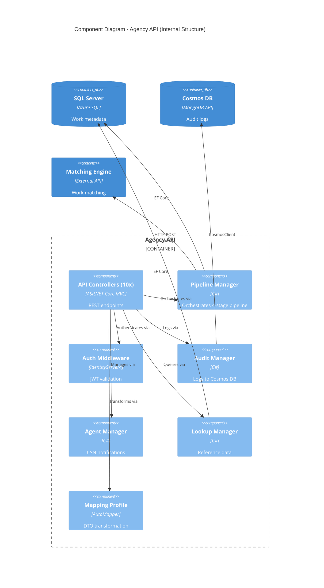
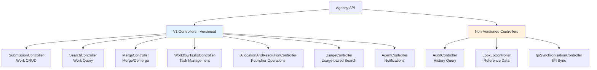
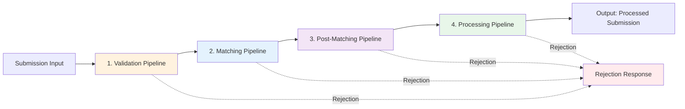
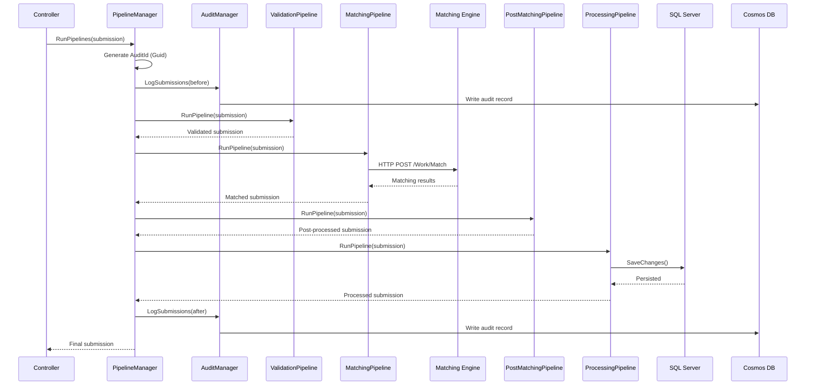
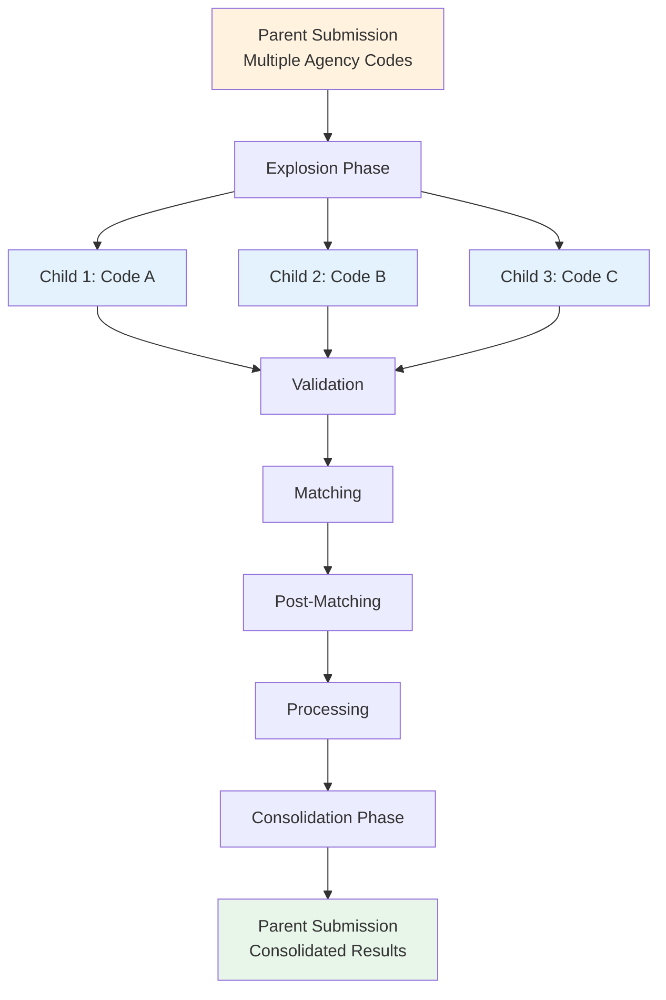
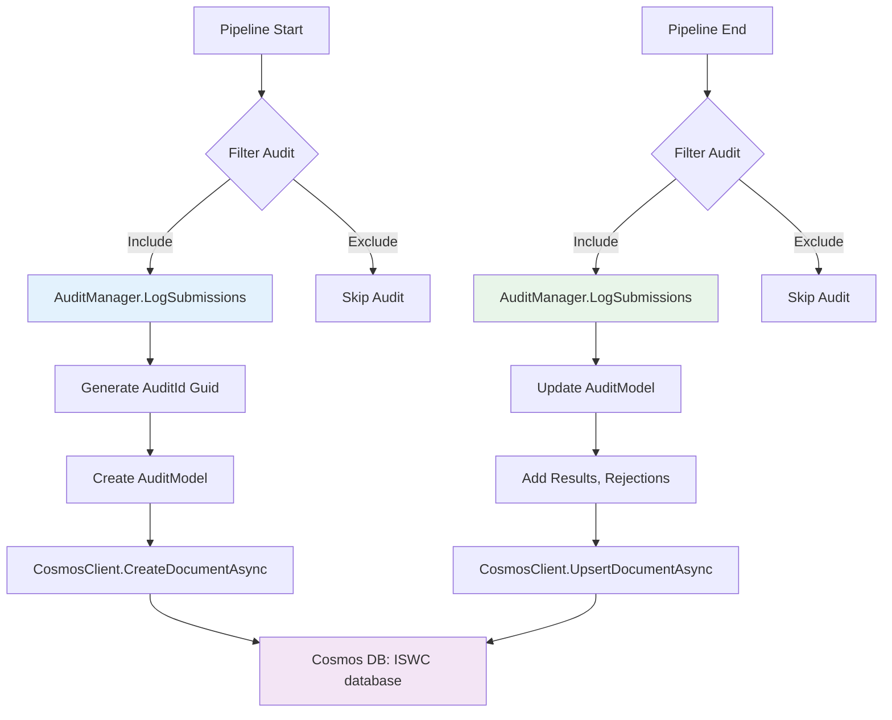
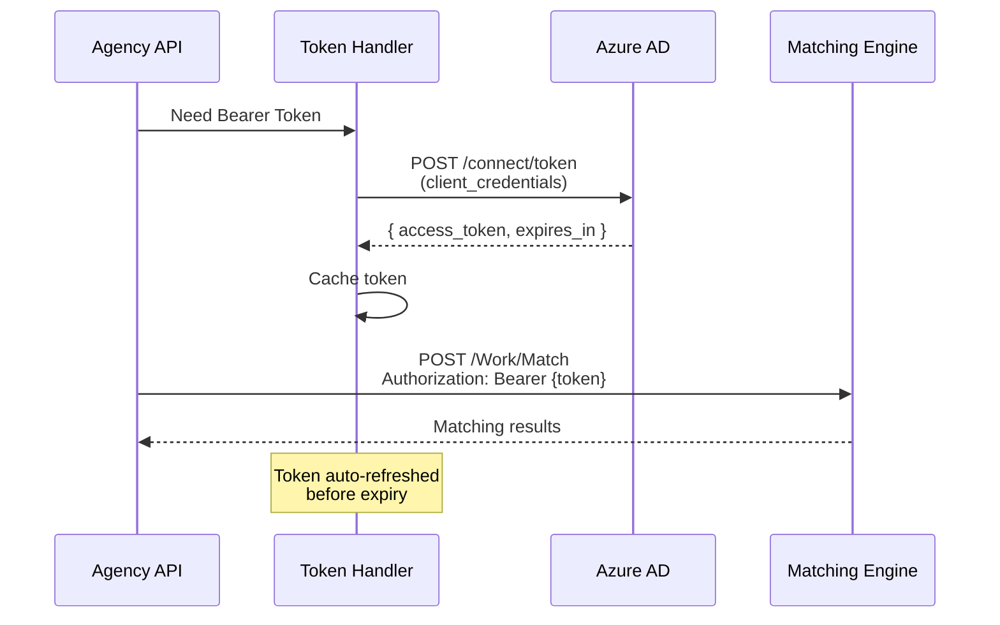
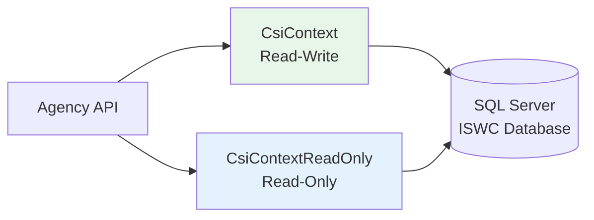
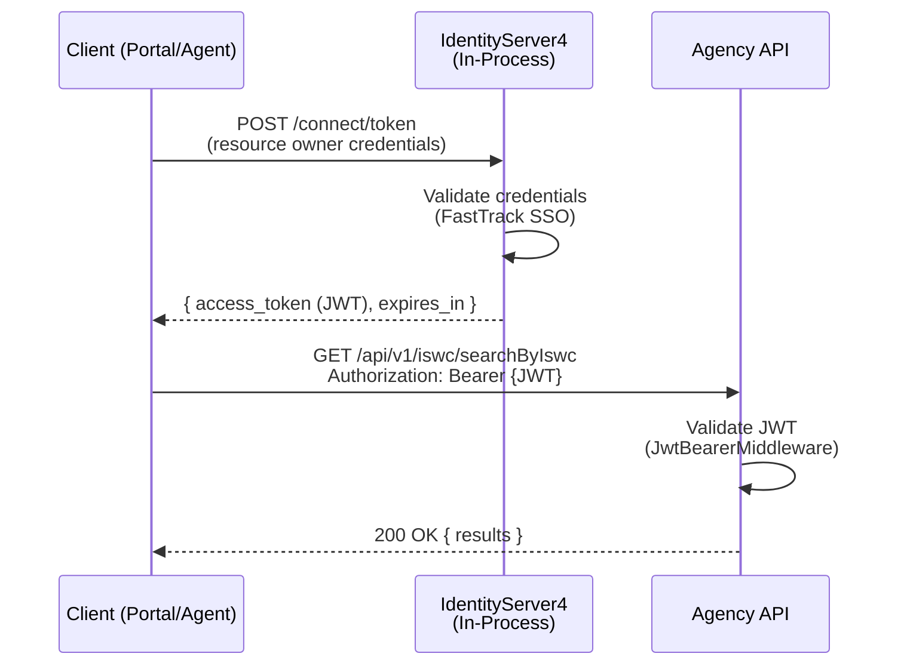

# C4 Level 3: Agency API Component

**Version:** 1.0
**Date:** 2025-10-29
**Status:** 🔴 Awaiting Validation

## Document Purpose

This document provides Level 3 (Component) documentation for the **ISWC Agency API** - the primary REST API for music work submission, search, and workflow management used by music rights societies worldwide.

**Prerequisites:**

- [C4 Level 1: System Context](../../c4-views/level1-system-context.md) - ✅ Validated
- [C4 Level 2: Container View](../../c4-views/level2-containers.md) - ✅ Validated

---

## Sources

**Primary Sources:**

- **[SPE_20191217_CISAC ISWC REST API.md](../../../../resources/core_design_documents/SPE_20191217_CISAC ISWC REST API/SPE_20191217_CISAC ISWC REST API.md)** - Complete REST API specification (3050 lines, 60+ pages)
- Source code: `docs/resources/source-code/ISWC/src/Api.Agency/` - 36 source files

**Secondary Sources:**

- Source code: `docs/resources/source-code/ISWC/src/Pipelines/` - Pipeline implementations
- Azure Resource CSV - API deployment configuration

---

## Overview

The **Agency API** is an ASP.NET Core 3.1 REST API that serves as the primary interface for managing musical work metadata in the ISWC system. It provides comprehensive endpoints for work submission, search, merging, and workflow management used by CISAC member societies (music rights organizations) globally.

### Primary Purpose

> **From [SPE_20191217_CISAC ISWC REST API.md](../../../../resources/core_design_documents/SPE_20191217_CISAC ISWC REST API/SPE_20191217_CISAC ISWC REST API.md) → Section 1 "Overview":** "These services are intended to be used by Societies/ ISWC Agencies that want to interface directly and in real time with the new ISWC database."

The Agency API coordinates the entire work submission lifecycle:

1. **Validation** - Validates work metadata against 100+ business rules
2. **Matching** - Queries Matching Engine to detect duplicates and conflicts
3. **Processing** - Persists work data and allocates ISWCs
4. **Audit** - Records complete audit trail in Cosmos DB

### Key Characteristics

- **Technology**: ASP.NET Core 3.1 (InProcess hosting)
- **DI Container**: Autofac + Microsoft.Extensions.DependencyInjection
- **Authentication**: OAuth2/OpenID Connect (IdentityServer4) with JWT Bearer tokens
- **Data Access**: Entity Framework Core with connection pooling
- **External Integration**: REST API to Matching Engine with OAuth2 client credentials
- **Versioning**: API versioning via `api-version` header
- **Documentation**: Swagger/OpenAPI with Azure API Management developer portal

---

## Technical Architecture

### Deployment Configuration

**Azure Resource:** App Service (Azure Web App)

- **Production**: `cisaciswcagencyapiprod` (App Service)
- **UAT**: `cisaciswcagencyapiuat`
- **Dev**: `cisaciswcagencyapidev`
- **App Service Plan**: Shared with other APIs (scale set)
- **Application Insights**: `cisaciswcagencyapiprod` (telemetry)

**Runtime:**

- .NET Core 3.1 (⚠️ **EOL Dec 2022** - technical debt)
- 64-bit, Always On, ARR Affinity Enabled
- HTTPS Only, Minimum TLS 1.2

### Technology Stack

| Layer | Technology | Version | Notes |
|-------|------------|---------|-------|
| **Framework** | ASP.NET Core | 3.1 | ⚠️ End of Life |
| **DI Container** | Autofac | 4.9.3 | Primary IoC container |
| **Authentication** | IdentityServer4 | 3.0.2 | OAuth2/OIDC server |
| **ORM** | Entity Framework Core | 3.0.0 | DbContext pooling |
| **Object Mapping** | AutoMapper | 7.0.0 | DTO transformation |
| **HTTP Client** | Microsoft.Extensions.Http.Polly | 3.1.4 | Resilient HTTP calls |
| **Resilience** | Polly | 7.2.1 | Retry policies |
| **API Documentation** | Swashbuckle.AspNetCore | 5.0.0 | Swagger/OpenAPI |
| **Telemetry** | Application Insights | 2.20.0 | Performance tracking |
| **Cryptography** | Blake3 | 0.5.1 | Work code generation |
| **JSON** | Newtonsoft.Json | (implicit) | JSON serialization |

---

## Component Architecture

### High-Level Component Diagram



---

## API Controllers and Endpoints

The Agency API consists of **10 controllers** providing 30+ endpoints organized by functional area.

### Controller Overview



### 1. SubmissionController (Work Lifecycle Management)

**Primary responsibility:** Create, update, delete work submissions

**Endpoints:**

| Method | Route | Description | Transaction Type |
|--------|-------|-------------|------------------|
| POST | `/api/v1/submission` | Create new work | CAR (Create/Add/Revise) |
| PUT | `/api/v1/submission?preferredIswc={iswc}` | Update existing work | CUR (Change/Update/Revise) |
| DELETE | `/api/v1/submission?preferredIswc={iswc}&agency={agency}&workcode={code}&sourceDb={db}&reasonCode={reason}` | Delete work | CDR (Change/Delete/Remove) |
| POST | `/api/v1/submission/batch` | Batch work creation | CAR |
| PUT | `/api/v1/submission/batch` | Batch work updates | CUR |

**Key Features:**

- Full 4-stage pipeline execution (Validation → Matching → Post-Matching → Processing)
- Preview disambiguation mode for Portal submissions (skips final processing)
- Multiple agency work code explosion/consolidation
- Automatic audit logging to Cosmos DB
- Returns potential matches and alternate ISWC suggestions

**Dependencies:**

- `IPipelineManager` - Pipeline orchestration
- `IMapper` - DTO transformation
- `IHttpContextAccessor` - Request context

### 2. SearchController (Work Discovery)

**Primary responsibility:** Search and query ISWC database

**Endpoints:**

| Method | Route | Description | Transaction Type |
|--------|-------|-------------|------------------|
| GET | `/api/v1/iswc/searchByIswc?iswc={iswc}` | Find by ISWC | CMQ (Change/Metadata/Query) |
| POST | `/api/v1/iswc/searchByIswc/batch` | Batch ISWC search | CMQ |
| GET | `/api/v1/iswc/searchByAgencyWorkCode?agency={agency}&workCode={code}&detailLevel={level}` | Find by agency work code | CIQ (Change/Internal/Query) |
| POST | `/api/v1/iswc/searchByAgencyWorkCode/batch` | Batch agency code search | CIQ |
| POST | `/api/v1/iswc/searchByTitleAndContributor` | Search by title + contributors | CIQ |
| POST | `/api/v1/iswc/searchByTitleAndContributor/batch` | Batch title/contributor search | CIQ |

**Key Features:**

- DetailLevel filtering (`Full`/`Core`/`Minimal`) for granular responses
- Public request filtering (masks IPI base numbers for public queries)
- Integration with Matching Engine for fuzzy matching
- Response caching for lookup data (24-hour TTL)

### 3. MergeController (ISWC Consolidation)

**Primary responsibility:** Merge and demerge work metadata

**Endpoints:**

| Method | Route | Description | Transaction Type |
|--------|-------|-------------|------------------|
| POST | `/api/v1/iswc/merge?preferredIswc={iswc}&agency={agency}` | Merge ISWCs or work codes | MER (Merge) |
| DELETE | `/api/v1/iswc/merge?preferredIswc={iswc}&agency={agency}&workcode={code}` | Demerge metadata | DMR (Demerge) |

**Merge Request Body:**

```json
{
  "iswcsToMerge": ["T-123.456.789-0", "T-987.654.321-0"],
  "workNumbersToMerge": [
    {"agency": "128", "workcode": "ABC123", "sourcedb": 128}
  ]
}
```

### 4. WorkflowTasksController (Task Management)

**Primary responsibility:** Query and update workflow tasks

**Endpoints:**

| Method | Route | Description | Transaction Type |
|--------|-------|-------------|------------------|
| GET | `/api/v1/iswc/workflowTasks?agency={agency}&showWorkflows={show}&workflowType={type}&status={status}&startIndex={index}&pageLength={length}&fromDate={from}&toDate={to}&iswc={iswc}&agencyWorkCodes={codes}&originatingAgency={origAgency}` | Find workflow tasks | COR (Change/Original/Request) |
| PATCH | `/api/v1/iswc/workflowTasks?agency={agency}` | Update workflow task statuses | COA (Change/Original/Acknowledge) |

**Query Parameters:**

- `showWorkflows`: `All`, `OnlyAffectingOwnWorks`, `OnlyNotAffectingOwnWorks`
- `workflowType`: `Conflict`, `Disambiguation`, `AwaitingAllocation`, etc.
- `status`: `Open`, `Completed`, `Rejected`
- Pagination: `startIndex`, `pageLength`
- Date filtering: `fromDate`, `toDate` (format: `yyyy-MM-dd`)

### 5. AllocationAndResolutionController (Publisher Operations)

**Primary responsibility:** Publisher-specific allocation and resolution

**Endpoints:**

| Method | Route | Description | Transaction Type |
|--------|-------|-------------|------------------|
| POST | `/api/v1/allocation/batch` | Publisher work allocation | CAR |
| POST | `/api/v1/resolution/batch` | Publisher work resolution | FSQ (Full/Status/Query) |

**Key Differences from Submission:**

- `TransactionSource`: `Publisher` (vs. `Agency`)
- Resolution marks submissions as ineligible
- `IsPortalSubmissionFinalStep`: `true` for resolution

### 6. UsageController (Usage-Based Discovery)

**Primary responsibility:** Search by performance/usage metadata

**Endpoints:**

| Method | Route | Description | Transaction Type |
|--------|-------|-------------|------------------|
| POST | `/api/v1/usage/search/batch` | Batch usage-based search | CIQ |

**Request Body:**

```json
[
  {
    "titles": ["Song Title"],
    "interestedParties": [{"name": "Artist Name"}],
    "performers": ["Performer Name"]
  }
]
```

**Special Handling:**

- `MatchingSource`: `"Usage"` (distinct from standard search)
- Includes performer metadata (additional to interested parties)

### 7. AgentController (Notification Management)

**Primary responsibility:** CSN notification retrieval and agent tracking

**Endpoints:**

| Method | Route | Description |
|--------|-------|-------------|
| GET | `/api/v1/agent/notification?agency={agency}&csnTransactionType={type}&fromDate={date}&pageLength={length}&continuationToken={token}` | Get CSN notifications |
| POST | `/api/v1/agent/run` | Update agent run tracking |

**CSN Notification Types:**

- `New` - New ISWCs allocated
- `Update` - Existing work updates
- `Delete` - Work deletions

**Features:**

- Continuation token pagination for large result sets
- Agent version tracking (`agentVersion` context item)

### 8. AuditController (Historical Audit Trail)

**Primary responsibility:** Query audit history from Cosmos DB

**Endpoints:**

| Method | Route | Description |
|--------|-------|-------------|
| GET | `/api/audit/search?preferredIswc={iswc}` | Query audit history by ISWC |

**Response:**

```json
[
  {
    "auditId": "guid",
    "timestamp": "2025-10-29T10:30:00Z",
    "agency": "128",
    "transactionType": "CAR",
    "workcode": "ABC123",
    "status": "Processed"
  }
]
```

### 9. LookupController (Reference Data)

**Primary responsibility:** Provide reference data and error code definitions

**Endpoints:**

| Method | Route | Description | Cache |
|--------|-------|-------------|-------|
| GET | `/api/lookup/getLookupData` | Get all reference data | 24 hours |
| POST | `/api/lookup/getIps` | Search interested party directory | None |
| GET | `/api/lookup/getErrorCodes` | Get error code definitions | None |

**LookupData Response:**

```json
{
  "agencyCodes": [...],
  "documentCodes": [...],
  "relationshipCodes": [...],
  "roleCodes": [...],
  "workCategories": [...],
  "countryCodes": [...]
}
```

**Features:**

- `[AllowAnonymous]` on getLookupData and getErrorCodes
- 24-hour response caching
- Error codes mapped to `ErrorCode` enum

### 10. IpiSynchronisationController (IPI Sync)

**Primary responsibility:** Synchronize IPI (Interested Party Information) data

**Endpoints:**

| Method | Route | Description |
|--------|-------|-------------|
| POST | `/api/ipiSynchronisation/addSpecifiedIps` | Sync specified IPI base numbers |

**Request Body:**

```json
["458930030", "734812541"]
```

**Integration:**

- Calls Suisa IPI API with Basic authentication
- Base64-encoded credentials

---

## Pipeline Architecture

The Agency API's core functionality is the **4-stage pipeline** that processes all submissions.

### Pipeline Stages



### Detailed Pipeline Flow



### Stage 1: Validation Pipeline

**Purpose:** Validate submission against 100+ business rules

**Rule Categories:**

1. **Initial Validation (IV) Rules** - Required fields, formats, data types
2. **Metadata Standardization (MD) Rules** - Title casing, character normalization
3. **ISWC Eligibility (EK) Rules** - Determines if work qualifies for ISWC
4. **Post Matching Validation (PV) Rules** - Conflict detection, duplicate checking

**Example Rules:**

- `IV01`: Agency code must be valid
- `IV02`: Work code required and must match pattern
- `MD05`: Title capitalization standardization
- `EK01`: At least one interested party required
- `PV10`: Matching detected duplicate ISWC

**Rejection Handling:**

```csharp
if (submission.Rejections.Any())
{
    submission.Status = SubmissionStatus.Rejected;
    return submission; // Skip remaining pipelines
}
```

### Stage 2: Matching Pipeline

**Purpose:** Query Matching Engine to detect duplicates and conflicts

**Matching Types:**

1. **Title + Contributor Matching** - Fuzzy matching on work title and creators
2. **ISRC Matching** - Match by recording ISRC code (International Standard Recording Code)

**HTTP Client Configuration:**

```csharp
BaseAddress: Configuration["BaseAddress-SpanishPointMatchingEngine"]
Authentication: OAuth2 Client Credentials (Bearer token)
Retry Policy: 10-second delay on transient errors (408, 429, 5xx)
Timeout: 80 seconds
```

**Matching Request:**

```http
POST {BaseAddress}/Work/Match
Authorization: Bearer {access_token}
Content-Type: application/json

{
  "workMetadata": {
    "title": "Example Song",
    "contributors": [
      {"name": "Artist Name", "role": "C"}
    ]
  }
}
```

**Matching Results:**

- `submission.MatchedResult` - Primary matching result
- `submission.IsrcMatchedResult` - ISRC-specific result
- `submission.HasAlternateIswcMatches` - Flag for conflicts

### Stage 3: Post-Matching Pipeline

**Purpose:** Process matching results and prepare for database persistence

**Key Operations:**

1. **Filter Skipped Submissions** - Skip if `SkipProcessing = true`
2. **Handle Alternate Matches** - Consolidate multiple matching results
3. **Multiple Agency Work Code Consolidation** - Merge child submission results into parent

**Multiple Agency Work Code Logic:**



**Explosion Example:**

```json
{
  "agency": "128",
  "workcode": "PARENT001",
  "multipleAgencyWorkCodes": [
    {"agency": "128", "workcode": "A001"},
    {"agency": "128", "workcode": "A002"},
    {"agency": "256", "workcode": "B001"}
  ]
}
```

**Becomes:**

- Parent: `workcode="PARENT001"`, `SubmissionId=1`
- Child 1: `workcode="A001"`, `SubmissionId=2`, `ParentSubmissionId=1`
- Child 2: `workcode="A002"`, `SubmissionId=3`, `ParentSubmissionId=1`
- Child 3: `workcode="B001"`, `SubmissionId=4`, `ParentSubmissionId=1`

### Stage 4: Processing Pipeline

**Purpose:** Persist to SQL Server and allocate ISWCs

**Key Operations:**

1. **Database Write** - `DbContext.SaveChanges()` to SQL Server
2. **ISWC Allocation** - Generate new ISWC if eligible
3. **Work Metadata Update** - Update titles, interested parties, relationships
4. **Audit Finalization** - Mark submission as processed

**Connection Configuration:**

```csharp
ConnectionString: Configuration["ConnectionString-ISWCAzureSqlDatabase"]
CommandTimeout: 3 minutes
Retry on failure: Enabled
DbContext Pooling: Enabled
```

**ISWC Format:** `T-123.456.789-C` (T = Type, C = Check digit)

---

## Audit Logging

### Audit Flow



### Audit Filters

**Excluded from Audit:**

1. Preview disambiguation submissions (Portal preview mode)
   - `TransactionType = CAR` AND `DetailLevel = PreviewDisambiguation`
2. Preview update submissions (Portal preview mode)
   - `TransactionType = CUR` AND `DetailLevel = PreviewDisambiguation`
3. CUR submissions with AS-prefixed work codes (internal system codes)
   - `TransactionType = CUR` AND `workcode LIKE 'AS%'`

### Audit Schema

**AuditModel Structure:**

```json
{
  "id": "guid",
  "auditId": "guid",
  "timestamp": "2025-10-29T10:30:00Z",
  "agency": "128",
  "sourceDb": 128,
  "workcode": "ABC123",
  "transactionType": "CAR",
  "transactionSource": "Agency",
  "requestSource": "Portal",
  "agentVersion": "1.0.0",
  "submission": { /* full submission JSON */ },
  "rejections": [
    {
      "errorCode": "IV02",
      "message": "Work code is required",
      "severity": "Error"
    }
  ],
  "matchedResult": { /* matching engine result */ },
  "processedIswc": "T-123.456.789-0",
  "status": "Processed"
}
```

**Partition Key:** `{Agency}{Month}` (e.g., `128202510` for agency 128 in Oct 2025)

**Collection:** `ISWC` database in Cosmos DB (MongoDB API)

---

## Integration with Other Components

### Matching Engine Integration

**Connection Pattern:** HTTP REST API with OAuth2 Client Credentials



**OAuth2 Configuration:**

- **Authority**: `Configuration["BaseAddress-SpanishPointMatchingEngine"]`
- **Client ID**: `Configuration["MicrosoftEntraID-ClientID"]`
- **Client Secret**: `Configuration["Secret-MicrosoftEntraIDClient"]`
- **Scope**: `{Configuration["MicrosoftEntraID-Scope"]}/.default`
- **Grant Type**: `client_credentials`

**Retry Policy:**

```csharp
HttpStatusCode.RequestTimeout (408)
HttpStatusCode.TooManyRequests (429)
HttpStatusCode.InternalServerError (500)
HttpStatusCode.BadGateway (502)
HttpStatusCode.ServiceUnavailable (503)
HttpStatusCode.GatewayTimeout (504)
→ Wait 10 seconds, retry
```

### SQL Server Integration

**Connection:** Entity Framework Core with DbContext pooling



**Connection Strings:**

```text
Read-Write:
Server=tcp:cisaciswcprod.database.windows.net,1433;Database=ISWC;...

Read-Only (add):
ApplicationIntent=readonly;
```

**DbContext Features:**

- Connection pooling (max pool size: default 100)
- Command timeout: 3 minutes
- Retry on transient failure
- SQL instrumentation enabled (Application Insights)

### Cosmos DB Integration

**Purpose:** Audit trail persistence

**Connection:** CosmosClient (MongoDB API)

```csharp
ConnectionString: Configuration["ConnectionString-ISWCCosmosDb"]
Database: "ISWC"
Collection: "Audit"
PartitionKey: {Agency}{Month}
```

**Operations:**

- `CreateDocumentAsync()` - Initial audit log
- `UpsertDocumentAsync()` - Update after processing

### Azure Search Integration

**Purpose:** Full-text search indexing

**Configuration:**

```csharp
ServiceName: Configuration["Name-AzureSearch"]
ApiKey: Configuration["ApiKey-AzureSearch"]
IndexName: Configuration["Name-WorksIndex"]
```

**Usage:**

- LookupController searches interested party directory
- Background indexing (not in API critical path)

### Suisa IPI Integration

**Purpose:** IPI (Interested Party Information) synchronization

**Authentication:** Basic Auth (base64 encoded)

```http
GET {SuisaIpiClientUrl}/parties/{baseNumber}
Authorization: Basic {base64(userId:password)}
```

**Configuration:**

- **URL**: `Configuration["SuisaIpiClientUrl"]`
- **User ID**: `Configuration["SuisaIpiUserId"]`
- **Password**: `Configuration["SuisaIpiPassword"]`

---

## Authentication and Security

### Inbound Authentication (Clients → Agency API)

**Mechanism:** JWT Bearer Token via IdentityServer4



**JWT Configuration:**

```csharp
Authority: Configuration["BaseAddress-IswcApi"]
Audience: "iswcapi"
RequireHttpsMetadata: true
SaveToken: true
TokenValidationParameters:
  ValidateIssuer: true
  ValidateAudience: true
  ValidateLifetime: true
  ClockSkew: 5 minutes
```

**Signing Certificate:**

- X.509 certificate from Azure Key Vault
- Key: `Configuration["Certificate-IswcApi"]`
- Format: Base64-encoded PFX

### Authorization

**Policy Enforcement:**

```csharp
Non-Development:
  endpoints.MapControllers().RequireAuthorization()

Development:
  No authorization required (easier testing)

[AllowAnonymous] Endpoints:
  - GET /api/lookup/getLookupData
  - GET /api/lookup/getErrorCodes
```

**Custom Validation:**

- `AgentClaimsValidator` (ICustomTokenRequestValidator)
- Validates agent-specific claims (agent version, source)

### Secrets Management

**Azure Key Vault Integration:**

```csharp
KeyVaultBaseURL: Configuration["AzureKeyVaultBaseURL"]
Prefix Filter: "AzureKeyVaultSecret-ISWC-"
Reload Interval: 30 minutes
```

**Secrets Retrieved:**

- SQL connection strings
- Cosmos DB connection strings
- OAuth2 client secrets
- API keys (Azure Search, etc.)
- X.509 certificates

### Data Privacy

**Public Request Filtering:**

- `IsPublicRequest` flag (set via context)
- Redacts `IpBaseNumber` from responses
- Masks PRS-prefixed work numbers (PRS internal codes)
- Excludes pseudonym group members

**Example:**

```json
// Internal request response
{
  "interestedParties": [
    {
      "name": "Artist Name",
      "ipBaseNumber": "458930030",
      "role": "C"
    }
  ]
}

// Public request response
{
  "interestedParties": [
    {
      "name": "Artist Name",
      "ipBaseNumber": null,
      "role": "C"
    }
  ]
}
```

---

## Source Code References

**Base Path:** `docs/resources/source-code/ISWC/src/Api.Agency/`

### Core Application Files

- [Program.cs](../../../../resources/source-code/ISWC/src/Api.Agency/Program.cs) - Application entry point, Kestrel configuration
- [Startup.cs](../../../../resources/source-code/ISWC/src/Api.Agency/Startup.cs) - Service configuration, middleware pipeline
- [Api.Agency.csproj](../../../../resources/source-code/ISWC/src/Api.Agency/Api.Agency.csproj) - Project file, NuGet dependencies

### Configuration

- [appsettings.json](../../../../resources/source-code/ISWC/src/Api.Agency/appsettings.json) - Base configuration
- [appsettings.Development.json](../../../../resources/source-code/ISWC/src/Api.Agency/appsettings.Development.json) - Development overrides
- [Configuration/MappingProfile.cs](../../../../resources/source-code/ISWC/src/Api.Agency/Configuration/MappingProfile.cs) - AutoMapper DTO mappings (20+ profiles)
- [Configuration/Swagger/ConfigureSwaggerOptions.cs](../../../../resources/source-code/ISWC/src/Api.Agency/Configuration/Swagger/ConfigureSwaggerOptions.cs) - Swagger documentation setup
- [Configuration/Swagger/BaseController.cs](../../../../resources/source-code/ISWC/src/Api.Agency/Configuration/Swagger/BaseController.cs) - Base controller with versioning

### Extensions

- [Extensions/ServiceCollectionExtensions.cs](../../../../resources/source-code/ISWC/src/Api.Agency/Extensions/ServiceCollectionExtensions.cs) - DI registration (15+ extension methods)

### Managers

- [Managers/IPipelineManager.cs](../../../../resources/source-code/ISWC/src/Api.Agency/Managers/IPipelineManager.cs) - Pipeline orchestration interface
- [Managers/PipelineManager.cs](../../../../resources/source-code/ISWC/src/Api.Agency/Managers/PipelineManager.cs) - Pipeline orchestration implementation (4-stage flow)

### V1 Controllers (API Versioned)

- [V1/ApiDefinition.cs](../../../../resources/source-code/ISWC/src/Api.Agency/V1/ApiDefinition.cs) - API version definition
- [V1/Controllers/SubmissionController.cs](../../../../resources/source-code/ISWC/src/Api.Agency/V1/Controllers/SubmissionController.cs) - Work submission endpoints (9879 bytes)
- [V1/Controllers/SearchController.cs](../../../../resources/source-code/ISWC/src/Api.Agency/V1/Controllers/SearchController.cs) - Search endpoints (9455 bytes)
- [V1/Controllers/MergeController.cs](../../../../resources/source-code/ISWC/src/Api.Agency/V1/Controllers/MergeController.cs) - Merge/demerge endpoints (3328 bytes)
- [V1/Controllers/WorkflowTasksController.cs](../../../../resources/source-code/ISWC/src/Api.Agency/V1/Controllers/WorkflowTasksController.cs) - Workflow management (4476 bytes)
- [V1/Controllers/AllocationAndResolutionController.cs](../../../../resources/source-code/ISWC/src/Api.Agency/V1/Controllers/AllocationAndResolutionController.cs) - Publisher operations (3024 bytes)
- [V1/Controllers/UsageController.cs](../../../../resources/source-code/ISWC/src/Api.Agency/V1/Controllers/UsageController.cs) - Usage-based search (2825 bytes)
- [V1/Controllers/AgentController.cs](../../../../resources/source-code/ISWC/src/Api.Agency/V1/Controllers/AgentController.cs) - Agent notifications (1803 bytes)

### Non-Versioned Controllers

- [Controllers/AuditController.cs](../../../../resources/source-code/ISWC/src/Api.Agency/Controllers/AuditController.cs) - Audit history queries
- [Controllers/LookupController.cs](../../../../resources/source-code/ISWC/src/Api.Agency/Controllers/LookupController.cs) - Reference data endpoints
- [Controllers/IpiSynchronisationController.cs](../../../../resources/source-code/ISWC/src/Api.Agency/Controllers/IpiSynchronisationController.cs) - IPI sync operations

### Documentation

- [V1/generate-api.nswag](../../../../resources/source-code/ISWC/src/Api.Agency/V1/generate-api.nswag) - NSwag API generation config
- [SpanishPoint.Azure.Iswc.Api.Agency.xml](../../../../resources/source-code/ISWC/src/Api.Agency/SpanishPoint.Azure.Iswc.Api.Agency.xml) - XML documentation comments

### Dependencies (Property Files)

- [Properties/serviceDependencies.json](../../../../resources/source-code/ISWC/src/Api.Agency/Properties/serviceDependencies.json) - Azure service dependencies
- [Properties/serviceDependencies.local.json](../../../../resources/source-code/ISWC/src/Api.Agency/Properties/serviceDependencies.local.json) - Local development dependencies

**Total Files:** 36 source files

---

## Questions for Further Investigation

### High Priority

1. **Pipeline Extensibility**
   - Can pipelines be added/removed without recompilation?
   - Is there a plugin mechanism for custom validation rules?
   - How are rule priorities managed?

2. **Matching Engine Coupling**
   - What happens if Matching Engine is unavailable?
   - Is there a fallback mechanism or circuit breaker?
   - Are there retry limits beyond the 10s delay?

3. **Batch Processing**
   - What's the maximum batch size?
   - How are partial batch failures handled?
   - Is there transactional rollback for batch operations?

4. **Performance**
   - Database query patterns in repositories?
   - N+1 query prevention measures?
   - Caching strategy beyond lookup data?
   - Connection pool configuration and sizing?

### Medium Priority

5. **Multiple Agency Work Codes**
   - Why is explosion/consolidation necessary?
   - Why not handle via database FK relationships?
   - Performance impact of recursive processing?

6. **Error Handling**
   - Comprehensive error code mapping?
   - User-facing error message localization beyond English?
   - Timeout/circuit breaker behaviors?

7. **Middleware**
   - RequestFilterMiddleware functionality?
   - JsonBodyTelemetry middleware purpose?
   - MaintenanceMode middleware implementation?

8. **ISRC Matching**
   - When is ISRC matching triggered vs. title matching?
   - Priority order if both match?
   - Conflict resolution strategy?

### Low Priority

9. **Audit Retention**
   - Cosmos DB retention policy?
   - Partition key strategy impact on queries?
   - Audit data archival process?

10. **Public Request Logic**
    - How is `IsPublicRequest` flag set?
    - Which endpoints support public requests?
    - Authentication differences for public vs. authenticated?

---

## Known Gaps and Contradictions

### Technical Debt

🔴 **ASP.NET Core 3.1 End of Life**

- **Issue**: .NET Core 3.1 reached EOL on December 13, 2022
- **Impact**: No security patches, potential vulnerabilities
- **Recommendation**: Upgrade to .NET 6 LTS or .NET 8 LTS
- **Effort**: Medium - requires testing all pipelines and dependencies

⚠️ **IdentityServer4 Deprecation**

- **Issue**: IdentityServer4 v3.0.2 is deprecated (acquired by Duende Software)
- **Impact**: No security updates, licensing changes
- **Recommendation**: Migrate to Duende IdentityServer or Azure AD B2C
- **Effort**: High - authentication is critical path

⚠️ **Matching Engine Timeout**

- **Issue**: 80-second timeout per request, synchronous blocking
- **Impact**: Submission delays, potential timeouts under load
- **Recommendation**: Implement async processing or circuit breaker
- **Effort**: High - architectural change

### Missing Information

⚠️ **Validation Rules Implementation**

- ValidationPipeline project not examined in detail
- 100+ business rules mentioned but not enumerated
- Rule priority and execution order unclear

⚠️ **Repository Pattern**

- Database access abstracted via repositories
- Entity structure and relationships not documented
- Query optimization strategies unknown

⚠️ **Azure API Management**

- Developer portal configuration not examined
- Subscription key management flow unclear
- Rate limiting and throttling policies unknown

---

## References

**Design Documents:**

- **[SPE_20191217_CISAC ISWC REST API.md](../../../../resources/core_design_documents/SPE_20191217_CISAC ISWC REST API/SPE_20191217_CISAC ISWC REST API.md)** - Complete API specification

**Related Component Documentation:**

- [Matching Engine](../matching-engine/matching-engine.md) - External matching service integration
- [Cosmos DB](cosmos-db.md) - Audit logging database
- [Web Portals](web-portals.md) - Agency and Public Portal web clients

**Infrastructure:**

- [C4 Level 2: Container View](../../c4-views/level2-containers.md) - Container deployment architecture
- [Azure Resource Reference](../../../infra/infrastructure-azure-reference.md) - Azure resource inventory

---

## Document History

| Version | Date | Author | Changes |
|---------|------|--------|---------|
| 1.0 | 2025-10-29 | Claude (AI Assistant) | Initial Level 3 documentation |

---

**Last Updated:** October 29, 2025
**Status:** 🔴 Awaiting domain expert validation
