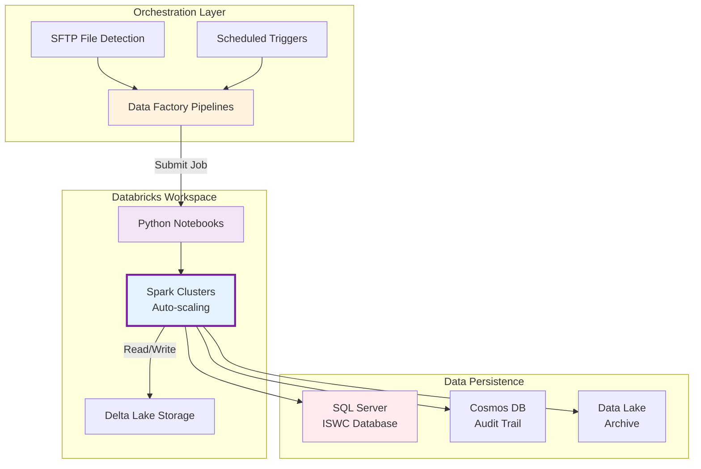
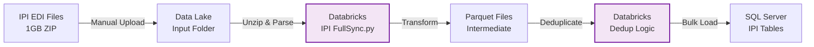
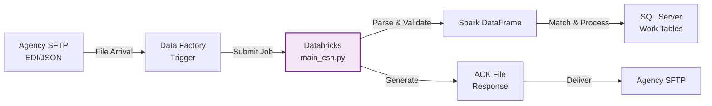
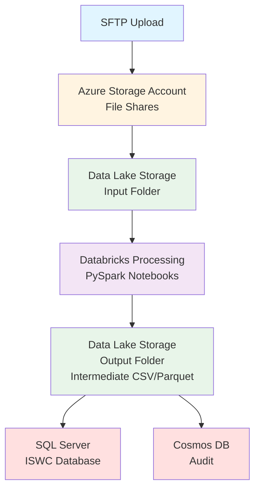
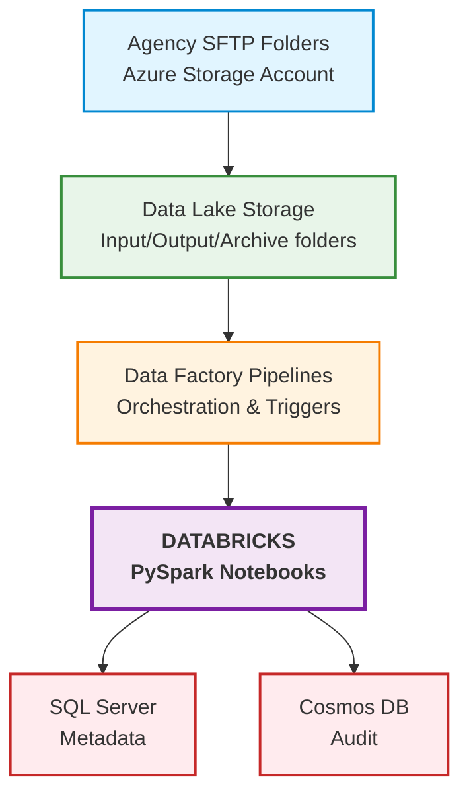
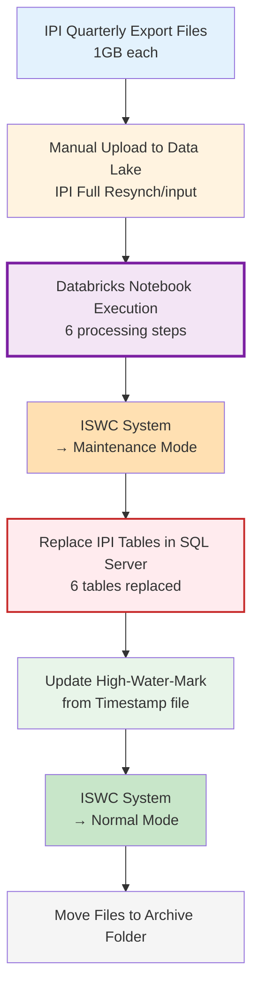

# Databricks - File Processing Engine

**Document Version:** 1.0
**Date:** October 24, 2025

**Sources:**

- **Primary:** SPE_20191001_ISWC_IPI_Integration.md (Core Design Document - IPI/ISWC Integration v1.3)
- **Secondary:** Workshop 2 (Oct 21, 2025) - Documentation and Infrastructure
- **Secondary:** Discussion Yann/Guillaume/Bastien (Oct 21, 2025)

---

## Component Classification

**C4 Model Level:** Level 3 - Component
**Parent Container:** ISWC Platform (Data Processing Infrastructure)
**Component Type:** Data Processing Engine (Azure Databricks)

---

## Overview

Databricks is a **cloud-based Apache Spark processing engine** used in the ISWC system for large-scale file processing, data transformation, and ETL operations.

> **From [IPI Integration Spec](../../resources/core_design_documents/SPE_20191001_ISWC_IPI_Integration/SPE_20191001_ISWC_IPI_Integration.md) → Section 2.1 "IPI EDI file based full resynch process":** "This process will be developed using Azure Data Factory and Azure Databricks."

**Primary Use:** Process large files uploaded via SFTP from agencies worldwide, transforming EDI/JSON formatted data into the ISWC SQL database schema.

**Infrastructure:** Azure Databricks workspace with Python notebooks executing PySpark transformations.

---

## Primary Purpose

Databricks serves as the **heavy-duty data processing engine** for the ISWC system with these key responsibilities:

1. **SFTP File Ingestion** - Process EDI and JSON files uploaded by agencies
2. **IPI Data Synchronization** - Import quarterly IPI full dumps (1GB files) and incremental updates
3. **Data Transformation** - Convert external file formats into ISWC database schema
4. **Large Volume Processing** - Handle batch operations at scale (millions of records)
5. **Orchestration Integration** - Execute as part of Data Factory pipeline workflows

> **Workshop 2, Xiyuan Zeng (22:58):** "Data Lake store the files, whatever binary files in which are formatted. They are in Data Lake and the Databricks also used in combination of a Data Factory to process larger volume of files."

**Role in System:** The processing workhorse for all file-based data ingestion, operating in tandem with Data Factory for orchestration.

---

## Component Architecture

### High-Level Component Structure

Databricks operates as the **distributed data processing engine** within a larger orchestration framework:



### Notebook Architecture Patterns

From source code analysis in [src/Integration/](../../../resources/source-code/ISWC/src/Integration/):

**Processing Pipeline Pattern:**

```python
# Common pattern from main_csn.py, main_cse.py, IPI FullSync.py
def main(parameters):
    # 1. Initialize Spark session and Delta Lake
    spark = configure_spark_session()

    # 2. Read input data from Data Lake
    df = spark.read.format("parquet").load(input_path)

    # 3. Apply transformations (PySpark DataFrame operations)
    transformed_df = df.filter(...).select(...).join(...)

    # 4. Write results to destination
    transformed_df.write.jdbc(jdbc_url, table, mode="append")

    # 5. Log audit trail to Cosmos DB
    audit_service.log_processing_complete()
```

**Job Orchestration Pattern:**

From [DatabricksClient.cs](../../../resources/source-code/ISWC/src/Framework/Databricks/DatabricksClient.cs) and [job_service.py](../../../resources/source-code/ISWC/src/Integration/Edi/ediparser/parser/services/job_service.py):

1. **Check active runs** - Prevent duplicate job execution
2. **Submit job request** - POST to `/api/2.0/jobs/run-now`
3. **Pass parameters** - File path, database credentials (from Key Vault)
4. **Poll for completion** - GET `/api/2.0/jobs/runs/get`
5. **Handle results** - Success → archive file, Failure → error notification

**Notebook Modularization:**

- **Main notebooks** - Entry points (main_csn.py, IPI FullSync.py)
- **Service modules** - Reusable logic (job_service.py, cosmos_service.py, delta_service.py)
- **Configuration** - Parameters passed from Data Factory
- **Error handling** - Try/except with failure logging

### Data Flow Architecture

**IPI Full Resynch Pipeline:**



**SFTP Agency File Pipeline:**



### Technical Architecture

### Infrastructure Components

From Workshop 2 and Azure infrastructure discussion:

| Component | Technology | Purpose |
|-----------|-----------|---------|
| **Databricks Workspace** | Azure Databricks (Runtime: outdated) | Managed Spark cluster environment |
| **Compute Clusters** | Auto-scaling Spark clusters | Execute Python/PySpark notebooks |
| **Storage Integration** | Azure Data Lake Storage | Source files and intermediate output |
| **Database Connectivity** | JDBC to SQL Server | Write transformed data to ISWC DB |
| **Orchestration** | Azure Data Factory | Trigger notebook execution, pipeline coordination |
| **Secrets Management** | Azure Key Vault | Database credentials, API keys |

### Technology Stack

**Languages:**

- **Python** - Primary language for notebooks
- **PySpark** - Distributed data processing framework
- **SQL** - Database queries and transformations

**Spark Components:**

- DataFrame API for structured data processing
- Spark SQL for query execution
- Cluster auto-scaling for cost optimization
- Delta Lake for intermediate storage (schema evolution enabled)

**Runtime Version:**

- **databricks-connect 11.3.*** (Python 3.9)
- **Status:** Outdated by several versions (see Technical Debt section)

### Storage Architecture



---

## How It Works

### Data Factory + Databricks Integration

> **Workshop 2, Xiyuan Zeng (22:58):** "There's a Data Factory to orchestrate the data movement between different components... Databricks also used in combination of a Data Factory to process larger volume of files."

**Orchestration Flow:**

1. **File Arrival Detection** (Data Factory)
   - Monitors SFTP storage account for new files
   - Triggers pipeline when file detected

2. **Notebook Execution** (Data Factory → Databricks)
   - Data Factory invokes Databricks notebook activity
   - Passes file path and processing parameters

3. **File Processing** (Databricks)
   - Notebook reads file from Data Lake
   - Applies transformations and validation
   - Writes results to SQL Server or intermediate storage

4. **Completion Handling** (Data Factory)
   - Moves processed files to archive folder
   - Logs success/failure status
   - Triggers error notifications if needed

### Development and Deployment Model

> **Workshop 2, Xiyuan Zeng (1:14:09):** "For Databricks, they are actually connected to the Cloud Databricks service. You just run local, you modify the local Python files and the PySpark notebooks. but those execution of those files are in the Cloud."

**Developer Workflow:**

- Notebooks edited locally or in Databricks workspace UI
- Execution always happens in cloud cluster (no local Spark)
- Connected to cloud SQL Server and storage for testing
- No fully local development environment feasible

**Deployment:**

- Notebooks checked into source control
- Deployed to Databricks workspace via CI/CD (details unclear)
- Cluster configurations managed via IaC (Azure ARM templates)

---

## File/Data Formats

### IPI Integration Processing

The primary documented use case is **IPI (Interested Party Information) synchronization** from SUISA (Swiss music society).

#### IPI Quarterly Full Dump

**File Specifications:**

> **From [IPI Integration Spec](../../resources/core_design_documents/SPE_20191001_ISWC_IPI_Integration/SPE_20191001_ISWC_IPI_Integration.md) → Section 3.1 "File Location, Naming Convention and Size":**
>
> - **Naming Convention:** `IPInnsss.edi.zip`
>   - `nn` = numeric sequence number
>   - `sss` = society code (always 080 for SUISA)
> - **Size:** ~1GB per file when unzipped
> - **Format:** IPI EDI specification (IPA transactions)
> - **Compression:** Zipped files, unzipped during ingestion

**File Structure:**

```plaintext
HDR  (Header - one per file)
GRH  (Group Header - one per file)
  IPA Transaction (one per Interested Party)
    IPA  (IP Add)
    BDN  (Base Data New)
    STN  (Status of new IP)
    NCN  (Name single IP Connection New) - multiple
    NUN  (Name single IP Usage New) - multiple
    MAN  (Membership Agreement New) - multiple
    MCN  (Name multi IP Connection New) - multiple
    ... [additional record types]
GRT  (Group Trailer - one per file)
TRL  (Trailer - one per file)
```

**Processing Logic:**

> **From [IPI Integration Spec](../../resources/core_design_documents/SPE_20191001_ISWC_IPI_Integration/SPE_20191001_ISWC_IPI_Integration.md) → Section 3.4 "File Processing":** "The relevant information from these IPA transactions will be extracted, as per the mapping above, into a set of files that mirror the IPI tables in the ISWC database. The process will then replace each table's contents with the corresponding file containing the up-to-date data."

**Data Mapping:**

IPA transactions are parsed and mapped to ISWC database tables:

- `IPA + BDN` → `[InterestedParty]` table
- `STN` → `[Status]` table
- `NCN/MCN/ONN` → `[Name]` + `[NameReference]` tables
- `NUN/MUN/INN/IMN` → `[IPNameUsage]` table
- `MAN` → `[Agreement]` table

**Deduplication:**

> **From [IPI Integration Spec](../../resources/core_design_documents/SPE_20191001_ISWC_IPI_Integration/SPE_20191001_ISWC_IPI_Integration.md) → Section 3.5 "Deduplicating [IPI.Name] records":** "Based on the mapping logic... there will be multiple duplicate [IPI.Name] records generated... The notebook should process this file to remove any duplicate entries before it is used to replace the data in the [IPI.Name] table."

#### SFTP Agency File Processing

While not fully specified in available docs, Workshop 2 confirms:

> **Workshop 2, Mark Stadler (1:18:19):** "If you dropped a new file into SFTP and you wanted for a certain process in a certain way, there would be a lot of work in processing that file in Databricks."

**File Types (from SFTP-Usage.md):**

- **EDI Format** - Fixed-length positional fields (legacy)
- **JSON Format** - Structured JSON objects (modern alternative)
- **Transaction Types:** CAR (add), CUR (update), CDR (delete), MER (merge), CMQ/CIQ (queries)

**Processing Complexity:**

- Format validation and parsing
- Business rule validation
- Matching Engine integration for duplicate detection
- Database updates with workflow task generation
- ACK/CSN response file generation

---

## Integration with Other Components

### Upstream Dependencies

**What Databricks depends on:**

- **Azure Data Lake Storage** - Input files and output staging
  - Files uploaded via SFTP stored here
  - IPI quarterly dumps manually placed in "IPI Full Resynch" folder

- **Azure Data Factory** - Orchestration and triggering
  - Determines which notebook to execute
  - Passes file paths and parameters
  - Manages pipeline error handling

- **Azure Key Vault** - Credentials for SQL Server and APIs

- **IPI API (SUISA)** - External API for incremental IPI updates (Note: This is handled by C# WebJob, not Databricks)

### Downstream Dependencies

**What depends on Databricks:**

- **SQL Server** - Receives transformed data
  - `[InterestedParty]`, `[Name]`, `[NameReference]`, `[Status]`, `[Agreement]`, `[IPNameUsage]` tables (IPI schema)
  - Work submission data from agency files

- **Cosmos DB** - Audit trail entries for file processing

- **Data Factory** - Waits for notebook completion
  - Success → archive file, continue pipeline
  - Failure → error handling, notifications

- **Agencies** - Receive ACK/CSN response files
  - Generated after Databricks processing completes
  - Delivered via SFTP

### Related Components

**Alternative ingestion paths:**

> **Workshop 2, Xiyuan Zeng (1:18:44):** "Two incoming paths, one through file uploading through SFTP processed by data factory Databricks... The other part is the API."

1. **SFTP → Data Factory → Databricks → SQL Server** (batch/file-based)
2. **API → App Services → SQL Server** (real-time/transactional)

Both paths result in same data model and trigger same workflows.

### System Architecture Position

From Workshop 2 architecture diagram:



---

## Use Cases

### Primary Use Cases

#### 1. IPI Quarterly Full Resynch

**Business Scenario:** Replace entire IPI database copy with latest quarterly dump from SUISA.

**Workflow:**

1. CISAC admin manually uploads 1GB zip files to Data Lake "IPI Full Resynch/input" folder
2. Admin uploads "Timestamp" file with high-water-mark datetime
3. Data Factory pipeline triggered (manual or scheduled)
4. Databricks notebook unzips files, validates structure (HDR, GRH, GRT, TRL)
5. Parses IPA transactions, extracts data per field mappings
6. Generates intermediate CSV/Parquet files mirroring IPI tables
7. Deduplicates `[IPI.Name]` records
8. **System enters maintenance mode** (no ISWC transactions accepted)
9. Replaces all IPI table data with new data
10. Updates high-water-mark from Timestamp file
11. **System exits maintenance mode**
12. Moves processed files to archive folder

> **From [IPI Integration Spec](../../resources/core_design_documents/SPE_20191001_ISWC_IPI_Integration/SPE_20191001_ISWC_IPI_Integration.md) → Section 3.4 "File Processing":** "While this is happening (the final stage replacement of the IP data in the ISWC database), the process should switch the ISWC system into maintenance mode."

**Frequency:** Occasional/as-needed (quarterly dumps available but not always processed)

#### 2. Agency Work Submission File Processing

**Business Scenario:** Agency uploads EDI/JSON file with CAR (new works) transactions via SFTP.

**Workflow:**

1. Agency uploads file to their SFTP folder (e.g., `ISWC20251024143022000001.CSN`)
2. File stored in Azure Storage Account
3. Data Factory detects file arrival
4. Databricks notebook triggered with file path
5. Reads and parses EDI/JSON format
6. Validates format, mandatory fields, business rules
7. Calls Matching Engine API for duplicate detection
8. Inserts/updates work records in SQL Server
9. Generates workflow tasks for other agencies (if split-copyright)
10. Writes audit trail to Cosmos DB
11. Generates ACK file with results
12. Data Factory places ACK in agency's SFTP folder
13. Archives processed input file

> **Workshop 2, Mark Stadler (1:18:19):** "If you dropped a new file into SFTP... there would be a lot of work in processing that file in Databricks."

**Frequency:** Continuous (agencies upload files 24/7)

#### 3. Batch Data Transformation

**Business Scenario:** Process large volumes of data that would be inefficient via API.

**Examples:**

- Bulk updates to work metadata
- Data quality corrections across thousands of works
- Historical data migration
- Report generation from large datasets

**Benefit:** Distributed processing scales horizontally, handles millions of records efficiently.

---

## Workflow Details

### IPI Full Resynch Process Flow

> **From [IPI Integration Spec](../../resources/core_design_documents/SPE_20191001_ISWC_IPI_Integration/SPE_20191001_ISWC_IPI_Integration.md) → Section 3 "IPI EDI File Based Full Resynch Process" (Architecture Diagram):**

#### High-Level Workflow



#### Databricks Processing Steps (Step C)

The Databricks notebook performs the following operations:

1. **Unzip files** - Extracts compressed IPI export files
2. **Validate file structure** - Checks for required sections: HDR, GRH, GRT, TRL
3. **Parse IPA transactions** - Reads and parses interested party records
4. **Extract data per field mappings** - Maps EDI fields to ISWC database schema
5. **Generate intermediate files** - Creates CSV/Parquet files for each table
6. **Deduplicate [IPI.Name] records** - Removes duplicate name entries

#### SQL Server Tables Replaced (Step E)

The following IPI tables are completely replaced during the resynch process:

- `[IPI].[InterestedParty]` - Core interested party information
- `[IPI].[Name]` - Name records for interested parties
- `[IPI].[NameReference]` - References between names and interested parties
- `[IPI].[IPNameUsage]` - Usage information for IP names
- `[IPI].[Status]` - Status history for interested parties
- `[IPI].[Agreement]` - Agreement records between parties and societies

### Error Handling

**File-Level Validation Failures:**

> **From [IPI Integration Spec](../../resources/core_design_documents/SPE_20191001_ISWC_IPI_Integration/SPE_20191001_ISWC_IPI_Integration.md) → Section 3.2 "File Structure & File Level Validation":** "If the file fails this validation, then the process should raise an error and stop at that point."

**Timestamp File Issues:**

> **From [IPI Integration Spec](../../resources/core_design_documents/SPE_20191001_ISWC_IPI_Integration/SPE_20191001_ISWC_IPI_Integration.md) → Section 3.6 "Updating the High-Water Mark":** "If the date/time is not valid or the timestamp file can not be found then the overall process should fail before the data in the ISWC database is attempted to be replaced."

**Error Propagation:**

- Databricks notebook fails → Data Factory pipeline fails
- Data Factory logs error in Application Insights
- Email notifications sent (assumed - not documented)
- Manual intervention required

**Partial Failures:**

Not well-specified. Likely all-or-nothing for IPI full resynch (transaction-based approach for SFTP files unclear).

---

## Performance Considerations

### Cluster Sizing and Auto-Scaling

**Current Configuration** (needs verification):

From source code references to Databricks configuration:

- **Cluster Type:** Multi-node clusters with auto-scaling
- **Driver Node:** Coordinates Spark jobs
- **Worker Nodes:** Execute parallel transformations
- **Auto-scaling:** Enabled (min/max nodes unclear)

**Performance Characteristics:**

- **Cold Start Time:** ~5-10 minutes (cluster spin-up from stopped state)
- **Warm Execution:** Immediate (cluster already running)
- **Cost vs Performance Trade-off:** Keeping cluster warm costs money, cold starts delay processing

**Questions Needed:**

- [ ] What is the current min/max worker node configuration?
- [ ] What is the average cluster utilization percentage?
- [ ] How much time is spent in cold start vs warm execution?
- [ ] What is the cluster idle timeout setting?

### Processing Times and Bottlenecks

**IPI Full Resynch Performance:**

From [IPI Integration Spec](../../resources/core_design_documents/SPE_20191001_ISWC_IPI_Integration/SPE_20191001_ISWC_IPI_Integration.md):

- **Input Size:** ~1GB compressed ZIP files (multiple files)
- **Processing Steps:** Unzip → Parse → Transform → Deduplicate → Bulk Load
- **Database Operations:** Complete table replacement (6 IPI tables)
- **Downtime Required:** System enters maintenance mode during final load

**Potential Bottlenecks:**

1. **File I/O** - Reading/writing large files from Data Lake
2. **Deduplication** - In-memory operation on Name records (potential memory pressure)
3. **JDBC Bulk Load** - Network transfer to SQL Server
4. **Table Locking** - Maintenance mode required during replacement

**SFTP Agency File Performance:**

- **File Size Range:** Small (KB) to Large (MB)
- **Processing Complexity:** Parse → Validate → Match → Insert/Update
- **Matching Engine Calls:** External HTTP API dependency (latency)
- **ACK File Generation:** Response creation and delivery

**Performance Baselines Needed:**

- [ ] What is the average IPI full resynch duration? (Expected: hours)
- [ ] What is the p50/p95/p99 for agency file processing? (Expected: seconds to minutes)
- [ ] What percentage of files fail validation? (Error rate)
- [ ] What is the average file size distribution?

### Cost Optimization Opportunities

**Current Cost Drivers:**

- **DBU (Databricks Units):** Consumption-based pricing for Spark compute
- **VM Compute:** Azure VM instances for driver and workers
- **Idle Time:** Cluster running with no active jobs
- **Storage:** Data Lake storage for intermediate files

**Optimization Strategies:**

1. **Right-size clusters** - Match node types to workload (not all jobs need large clusters)
2. **Job-specific clusters** - Separate clusters for IPI resynch vs SFTP files
3. **Spot instances** - Use Azure Spot VMs for non-critical batch jobs
4. **Delta Lake optimization** - Use OPTIMIZE and VACUUM commands to reduce storage
5. **Aggressive auto-scaling** - Scale down quickly after job completion

**Cost Impact of Outdated Runtime:**

> **From Yann Discussion:** Newer runtimes have better optimization, potentially reducing compute time by 20-40% through:
- Adaptive query execution improvements
- Better memory management
- Photon engine (Databricks-native execution engine)

### Monitoring and Metrics

**Current Observability:**

From source code integration with Application Insights:

- **Job Execution Status:** Success/failure logged to Data Factory
- **Audit Trail:** Cosmos DB records processing events
- **Error Logs:** Databricks cluster logs (retention period unclear)

**Missing Metrics:**

- [ ] Job duration trends over time
- [ ] Cluster resource utilization (CPU, memory, disk)
- [ ] Cost per job (DBU consumption attribution)
- [ ] Data volume processed per day/week/month
- [ ] Failure rate and root cause distribution

**Recommended Dashboards:**

- Databricks job performance dashboard (built-in)
- Azure Cost Management by resource group
- Data Factory pipeline execution monitoring
- Custom dashboard for SLA tracking (file processing SLAs)

---

## Technical Debt and Risks

### 🔴 Critical Maintenance and Support Risks

**Outdated Databricks Runtime (Multiple Versions Behind):**

> **From [Yann/Guillaume/Bastien Discussion](../../meetings/20251021-ISWC%20-%20Discussion%20Yann_Guillaume_Bastien.txt) (Timestamp 18:44, Yann Lebreuilly):** "Databricks n'est plus à jour de plusieurs versions. J'ai eu les gars de Databricks qui sont en train de faire un audit par ailleurs... Quand ils ont vu ça, ils se sont fait, mais vous n'êtes pas du tout sur la dernière version à jour, la Databricks. Donc, vous ne pouvez pas bénéficier, par exemple, de l'IA dans vos requêtes et de, en gros, de super pouvoir de requête par vous-même dans l'application."

**Translation:** "Databricks is outdated by several versions. I had the Databricks team doing an audit... When they saw this, they said, you're not at all on the latest version. So you can't benefit, for example, from AI in your queries and, basically, super query powers in the application."

**Current Version:** databricks-connect 11.3.* (Runtime 11.3 LTS - released September 2022)
**Latest Version:** Runtime 15.4 LTS (as of October 2025)
**Versions Behind:** ~4 major versions

**Impact:**

- **Missing Features:** AI-assisted queries, auto-optimization, Photon engine improvements, Unity Catalog (governance)
- **Security Risk:** Unpatched vulnerabilities in old runtime (CVEs in Spark 3.3.x)
- **Performance:** Modern runtimes have 20-40% optimization improvements
- **Support:** Vendor support for Runtime 11.3 LTS ends September 2025 (likely already expired or expiring soon)
- **Cost:** Inefficient resource usage (newer runtimes optimize cluster sizing, reducing DBU consumption)

**Contractual Dispute:**

> **From [Yann/Guillaume/Bastien Discussion](../../meetings/20251021-ISWC%20-%20Discussion%20Yann_Guillaume_Bastien.txt) (Timestamp 18:44, Yann Lebreuilly):** "Si dans la maintenance, il n'y a même pas la mise à jour du dotnet, il y a quoi dans votre maintenance ? Et là, ils ont fait, OK, fair enough."

**Translation:** "If the maintenance doesn't even include .NET updates, what's in your maintenance? And they said, OK, fair enough."

- **Yann's Expectation:** Runtime updates should be included in annual maintenance contract
- **Spanish Point's Position:** Offered to charge separately for runtime upgrade
- **Yann's Response:** Rejected paid upgrade - maintenance should cover platform updates
- **Current Status:** Upgrade "in progress" but delayed by months/years

**Mitigation:** Escalate to CISAC management - this is a critical security and cost issue, not a "nice to have"
**Effort Estimate:** 2-4 weeks (notebook testing for breaking changes, regression testing)

### ⚠️ High Priority Technical Debt

**No Automated Testing for Notebooks:**

- **Impact:** Changes to notebooks risk breaking production data pipelines
- **Current State:** Manual testing only (no unit tests detected in source code)
- **Risk:** Data corruption, incorrect transformations, downtime
- **Mitigation:** Implement pytest for PySpark logic, test data fixtures
- **Effort Estimate:** 3-4 weeks (build test framework + coverage for critical notebooks)

**SFTP File Processing Specification Gap:**

From Known Gaps section:

- **Issue:** No formal design document for EDI/JSON agency file processing
- **Impact:** 80% of Databricks workload undocumented (only IPI spec exists)
- **Risk:** Tribal knowledge, difficult to maintain or modernize
- **Mitigation:** Reverse-engineer specification from notebooks + validation
- **Effort Estimate:** 2 weeks analysis + documentation

**Single Databricks Workspace (No Dev/Test/Prod Isolation):**

- **Risk:** Development work could interfere with production jobs
- **Best Practice:** Separate workspaces per environment
- **Cost Impact:** Minimal (workspace is free, only compute costs)
- **Mitigation:** Create dedicated dev/test workspace with smaller clusters
- **Effort Estimate:** 1 week setup + CI/CD pipeline updates

### Medium Priority Improvements

**Idle Cluster Cost Waste:**

- **Issue:** Clusters may remain running when no jobs active
- **Cost Impact:** Potentially €5K-10K/month wasted (needs verification)
- **Mitigation:** Configure aggressive auto-termination (15-30 minute idle timeout)
- **Effort Estimate:** 1 day configuration change

**No Dead-Letter Queue for Failed Files:**

- **Issue:** Files that fail parsing/validation may be lost or require manual intervention
- **Current Behavior:** Unclear (error handling needs verification)
- **Mitigation:** Implement Data Factory error handling with failed file quarantine folder
- **Effort Estimate:** 1 week

**Delta Lake Storage Growth:**

- **Issue:** Intermediate Parquet/Delta files accumulate in Data Lake
- **Impact:** Increased storage costs, slower file operations
- **Mitigation:** Implement VACUUM operations to remove old versions
- **Effort Estimate:** 2 days (add to scheduled jobs)

**Notebook Code Quality:**

- **Issue:** Code quality, modularity, and maintainability unknown (pending review)
- **Concerns:** Hardcoded values, poor error handling, lack of reusable functions
- **Mitigation:** Code review + refactoring to shared libraries
- **Effort Estimate:** 4-6 weeks (after code access granted)

### Low Priority / Technical Exploration

**Photon Engine Adoption:**

- **Feature:** Databricks-native execution engine (faster than Apache Spark)
- **Availability:** Requires newer runtime (13.x+) and additional cost
- **Benefit:** 2-5x performance improvement for SQL operations
- **Consideration:** Evaluate after runtime upgrade

**Unity Catalog Migration:**

- **Feature:** Centralized governance and lineage tracking
- **Availability:** Requires newer runtime and migration effort
- **Benefit:** Better data governance, GDPR compliance tracking
- **Effort Estimate:** 2-3 weeks migration

---

## Questions for Further Investigation

### Runtime and Platform

- [ ] What is the exact Databricks runtime version currently deployed? (Expected: 11.3 LTS)
- [ ] What is the upgrade path and breaking changes for latest runtime? (11.3 → 15.4 LTS)
- [ ] Why hasn't Databricks runtime been updated despite maintenance contract? (Contractual dispute)
- [ ] What features are blocked by outdated runtime? (Photon, Unity Catalog, AI queries)
- [ ] When does vendor support end for Runtime 11.3 LTS? (Expected: September 2025 - already expired)
- [ ] What is the timeline for runtime upgrade?

### Cluster Configuration and Performance

- [ ] What cluster sizing (nodes, cores, memory) is configured?
- [ ] What is the auto-scaling configuration (min/max nodes)?
- [ ] How much idle time occurs (cluster running but not processing)?
- [ ] What is the current min/max worker node configuration?
- [ ] What is the average cluster utilization percentage?
- [ ] How much time is spent in cold start vs warm execution?
- [ ] What is the cluster idle timeout setting?
- [ ] Are there separate clusters for different workloads (IPI vs SFTP)?

### Processing Performance and SLAs

- [ ] What is the average IPI full resynch duration? (Expected: hours)
- [ ] What is the p50/p95/p99 for agency file processing? (Expected: seconds to minutes)
- [ ] What is the average file processing time (small, medium, large files)?
- [ ] What percentage of files fail validation? (Error rate)
- [ ] What is the average file size distribution?
- [ ] Are there processing SLAs for agency file turnaround?
- [ ] What is the maximum acceptable downtime for IPI resynch?

### Cost and Optimization

- [ ] What is the monthly Databricks cost breakdown (compute vs DBU)?
- [ ] What percentage of monthly cost is wasted on idle clusters?
- [ ] What is the cost per job (DBU consumption attribution)?
- [ ] What would be the cost savings from runtime upgrade? (20-40% potential)
- [ ] Is Photon engine enabled? (Requires newer runtime + additional cost)
- [ ] Are Spot instances used for non-critical workloads?

### Code Quality and Testing

- [ ] How many notebooks exist in the workspace?
- [ ] What is the notebook code quality (complexity, modularity, testability)?
- [ ] Are there unit tests for notebook transformations?
- [ ] How is notebook versioning managed (Git integration)?
- [ ] What is the code review process for notebook changes?
- [ ] Is there a test/dev Databricks workspace?

### Monitoring and Operations

- [ ] What error rate exists for file processing (% failures)?
- [ ] What monitoring/alerts exist for Databricks job failures?
- [ ] Is there a dead-letter queue for unparseable files?
- [ ] What is the log retention period for Databricks cluster logs?
- [ ] Are there dashboards for job duration trends and resource utilization?
- [ ] What is the incident response process for Databricks job failures?

### Data and Specifications

- [ ] Where is the SFTP file processing specification? (80% of workload undocumented)
- [ ] What is the data volume processed per day/week/month?
- [ ] How often is IPI full resynch actually executed? (Quarterly dumps available but processing frequency unclear)
- [ ] What is the Delta Lake storage growth rate?
- [ ] Are VACUUM operations scheduled for Delta Lake?

---

## Source Code References

The following source code files in the ISWC system interact with or reference Databricks:

### C# Framework & Integration Layer

**Databricks Client Framework** (`src/Framework/Databricks/`)

- [DatabricksClient.cs](../../../resources/source-code/ISWC/src/Framework/Databricks/DatabricksClient.cs) - HTTP client for Databricks Jobs API
- [IDatabricksClient.cs](../../../resources/source-code/ISWC/src/Framework/Databricks/IDatabricksClient.cs) - Interface for Databricks operations
- [DatabricksClientOptions.cs](../../../resources/source-code/ISWC/src/Framework/Databricks/DatabricksClientOptions.cs) - Configuration options for Databricks client

**Models** (`src/Framework/Databricks/Models/`)

- [NotebookParameters.cs](../../../resources/source-code/ISWC/src/Framework/Databricks/Models/NotebookParameters.cs) - Parameters passed to notebook executions
- [RunsListResponseModel.cs](../../../resources/source-code/ISWC/src/Framework/Databricks/Models/RunsListResponseModel.cs) - Response model for active runs
- [SubmitJobRequestModel.cs](../../../resources/source-code/ISWC/src/Framework/Databricks/Models/SubmitJobRequestModel.cs) - Request model for job submission

**Business Layer**

- [ReportManager.cs](../../../resources/source-code/ISWC/src/Business/Managers/ReportManager.cs) - Uses DatabricksClient to trigger report generation jobs

**Dependency Injection**

- [AutofacModule.cs](../../../resources/source-code/ISWC/src/Data/AutofacModule.cs) - Registers Databricks services
- [ServiceCollectionExtensions.cs](../../../resources/source-code/ISWC/src/Portal/Extensions/ServiceCollectionExtensions.cs) - Configures Databricks client
- [Startup.cs](../../../resources/source-code/ISWC/src/Portal/Startup.cs) - Application startup configuration
- [MappingProfile.cs](../../../resources/source-code/ISWC/src/Data/MappingProfile.cs) - AutoMapper configuration for Databricks models

### Python Notebooks & Scripts

**IPI Full Synchronization**

- [IPI FullSync.py](../../../resources/source-code/ISWC/src/Integration/IpiFullSync/IPI%20FullSync.py) - Main IPI quarterly import notebook (763 lines)
  - Parses IPA transactions from EDI files
  - Generates parquet files for IPI database tables
  - Handles deduplication of Name records

**EDI File Processing** (`src/Integration/Edi/ediparser/`)

- [main_csn.py](../../../resources/source-code/ISWC/src/Integration/Edi/ediparser/main_csn.py) - CSN (Work Submission) file processing notebook
- [main_cse.py](../../../resources/source-code/ISWC/src/Integration/Edi/ediparser/main_cse.py) - CSE (Search Query) file processing notebook
- [main_ack.py](../../../resources/source-code/ISWC/src/Integration/Edi/ediparser/main_ack.py) - ACK response file generation notebook
- [process_file.py](../../../resources/source-code/ISWC/src/Integration/Edi/ediparser/process_file.py) - Common file processing utilities
- [job_service.py](../../../resources/source-code/ISWC/src/Integration/Edi/ediparser/parser/services/job_service.py) - Service for checking active Databricks job runs and triggering jobs

**Generic Jobs** (`src/Integration/GenericJob/generic_job/`)

- [main_changetrackerjob.py](../../../resources/source-code/ISWC/src/Integration/GenericJob/generic_job/main_changetrackerjob.py) - Change tracking sync job
- [main_missingipisyncjob.py](../../../resources/source-code/ISWC/src/Integration/GenericJob/generic_job/main_missingipisyncjob.py) - IPI incremental update job
- [main_processauditjob.py](../../../resources/source-code/ISWC/src/Integration/GenericJob/generic_job/main_processauditjob.py) - Audit log processing job
- [cosmos_service.py](../../../resources/source-code/ISWC/src/Integration/GenericJob/generic_job/services/cosmos_service.py) - Cosmos DB integration with Delta Lake
- [delta_service.py](../../../resources/source-code/ISWC/src/Integration/GenericJob/generic_job/services/delta_service.py) - Delta Lake operations

**Reporting** (`src/Reporting/reporting/`)

- [main_report.py](../../../resources/source-code/ISWC/src/Reporting/reporting/main_report.py) - Report generation notebook
- [delta_service.py](../../../resources/source-code/ISWC/src/Reporting/reporting/services/delta_service.py) - Delta Lake read operations
- [SubmissionAnalysis.ipynb](../../../resources/source-code/ISWC/src/Reporting/reporting/SubmissionAnalysis.ipynb) - Jupyter notebook for submission data analysis

### Database Objects

**SQL Views** (`src/Database/Azure/Views/`)

- [Databricks_Iswc_Data.sql](../../../resources/source-code/ISWC/src/Database/Azure/Views/Databricks_Iswc_Data.sql) - View that consolidates ISWC work data for Databricks export (JSON aggregation)
- [Databricks_Ipi_Data.sql](../../../resources/source-code/ISWC/src/Database/Azure/Views/Databricks_Ipi_Data.sql) - View that consolidates IPI interested party data for Databricks export

**Database Project**

- [Database.sqlproj](../../../resources/source-code/ISWC/src/Database/Database.sqlproj) - SQL Server database project including Databricks views

### Documentation & Configuration

**Development Setup**

- [Integration/README.md](../../../resources/source-code/ISWC/src/Integration/README.md) - Databricks Connect setup guide for EDI integration development
- [Reporting/README.md](../../../resources/source-code/ISWC/src/Reporting/README.md) - Databricks Connect setup guide for reporting development

**Ad-Hoc Tools**

- [AddMissingIPIsConsoleApp/Program.cs](../../../resources/source-code/ISWC/src/AdHoc/AddMissingIPIsConsoleApp/Program.cs) - Console app for IPI sync (references Databricks configuration)
- [AddMissingIPIsConsoleApp/appsettings.json](../../../resources/source-code/ISWC/src/AdHoc/AddMissingIPIsConsoleApp/appsettings.json) - Configuration including Databricks settings
- [AddMissingIPIsConsoleApp/README.md](../../../resources/source-code/ISWC/src/AdHoc/AddMissingIPIsConsoleApp/README.md) - Documentation for ad-hoc IPI sync tool

### Key Patterns and Technologies

**Databricks Runtime Version:**

- Python notebooks use `databricks-connect==11.3.*` (Python 3.9)
- **Note:** Runtime is outdated by several versions (see Technical Debt section)

**Job Orchestration Pattern:**

1. C# Portal/API calls `DatabricksClient.SubmitJob()`
2. Databricks REST API (`https://westeurope.azuredatabricks.net/api/2.0/jobs/run-now`)
3. Databricks cluster executes Python notebook
4. Results written to SQL Server or Delta Lake
5. Audit trail logged to Cosmos DB

**Local Development:**

- Developers use `databricks-connect` to run notebooks locally
- Execution happens in cloud cluster (no local Spark)
- Package deployment via wheel files to `cisaciswcdatabricksdev` storage account

**Delta Lake Usage:**

- `spark.databricks.delta.schema.autoMerge.enabled` enabled in multiple jobs
- Delta format for intermediate data storage
- Cosmos DB integration via Delta Lake connector

---

## References

### Core Design Documents

- [SPE_20191001_ISWC_IPI_Integration.md](../../resources/core_design_documents/SPE_20191001_ISWC_IPI_Integration/SPE_20191001_ISWC_IPI_Integration.md) - Complete IPI integration specification v1.3 (Nov 2019) including Databricks processing details

### Meeting Transcripts

- [Workshop 2 - Documentation & Infrastructure (Oct 21, 2025)](../../meetings/20251021-ISWC%20Audit%20-%20Workshop%202%20-%20Documentations%20and%20infrastructure.txt)
- [Discussion Yann/Guillaume/Bastien (Oct 21, 2025)](../../meetings/20251021-ISWC%20-%20Discussion%20Yann_Guillaume_Bastien.txt)

### Key Information Sources

- **[IPI Integration Spec](../../resources/core_design_documents/SPE_20191001_ISWC_IPI_Integration/SPE_20191001_ISWC_IPI_Integration.md) → Section 2.1 "IPI EDI file based full resynch process"** - Databricks + Data Factory architecture
- **[IPI Integration Spec](../../resources/core_design_documents/SPE_20191001_ISWC_IPI_Integration/SPE_20191001_ISWC_IPI_Integration.md) → Section 3.4-3.6** - File processing workflow and maintenance mode
- **[Workshop 2](../../meetings/20251021-ISWC%20Audit%20-%20Workshop%202%20-%20Documentations%20and%20infrastructure.txt) (22:58, Xiyuan Zeng)** - Databricks role in system architecture
- **[Workshop 2](../../meetings/20251021-ISWC%20Audit%20-%20Workshop%202%20-%20Documentations%20and%20infrastructure.txt) (1:14:09, Xiyuan Zeng)** - Local development model (cloud-connected)
- **[Workshop 2](../../meetings/20251021-ISWC%20Audit%20-%20Workshop%202%20-%20Documentations%20and%20infrastructure.txt) (1:18:19, Mark Stadler)** - Databricks as most involved component for file processing
- **[Yann Discussion](../../meetings/20251021-ISWC%20-%20Discussion%20Yann_Guillaume_Bastien.txt) (18:44, Yann Lebreuilly)** - Outdated runtime version and missing features

### Related Specifications

- SPE_20190806_ISWC_EDI_FileFormat.md - EDI file format that Databricks parses
- SPE_20191118_ISWC_JSON_FileFormat.md - JSON file format alternative
- SFTP-Usage.md - File exchange mechanism feeding Databricks

### Architecture Diagrams

- **[IPI Integration Spec](../../resources/core_design_documents/SPE_20191001_ISWC_IPI_Integration/SPE_20191001_ISWC_IPI_Integration.md) → Section 3 "IPI EDI File Based Full Resynch Process"** - Data Factory + Databricks processing flow diagram
- **Workshop 2 (shared in chat)** - System architecture diagram showing Databricks cluster resources in Azure

---

## Document History

| Version | Date | Author | Changes |
|---------|------|--------|---------|
| 1.0 | 2025-10-24 | Audit Team | Initial document based on IPI Integration spec and Workshop 2; Documented file processing architecture, IPI use case, technical debt issues, integration points |
| 1.1 | 2025-10-27 | Audit Team | Added comprehensive Source Code References section (33 files); Converted ASCII diagrams to Mermaid flowcharts for better visualization; Simplified complex workflow diagrams with text explanations |
| 2.0 | 2025-10-29 | Audit Team | **C4 LEVEL 3 UPGRADE:** Added Component Classification section; Added comprehensive Component Architecture section (notebook architecture patterns, data flow pipelines, job orchestration); Added Performance Considerations section (cluster sizing, processing bottlenecks, cost optimization, monitoring); Restructured and expanded Technical Debt and Risks section with priority levels (🔴 Critical: Outdated runtime 11.3 LTS vs 15.4 LTS, contractual dispute; ⚠️ High: No automated testing, specification gap, no dev/test isolation; Medium: Idle cluster waste, no dead-letter queue, Delta Lake growth); Enhanced Questions for Further Investigation with categories (Runtime, Cluster, Performance, Cost, Code Quality, Monitoring, Data); Integrated Known Gaps into Technical Debt section; Updated status to "C4 Level 3 Documentation" |

---

## Implementation Verification Needed

### Notebook Code Review and Quality Assessment

**Source Code Status:**

- IPI Integration specification v1.3 provides high-level design
- Notebook source code identified (33 files in src/Integration/ and src/Reporting/)
- Code quality, testing, and modularity pending review

**Pending Analysis:**

- [ ] Notebook code review for quality and maintainability
- [ ] Hardcoded values and configuration management
- [ ] Error handling patterns and edge cases
- [ ] Reusable functions vs copy-paste code
- [ ] Test coverage and unit testing

**Action Required:** Schedule dedicated session for notebook code review

### Configuration and Operational Details

**Runtime and Cluster Configuration:**

- [ ] Confirm exact Databricks runtime version (Expected: 11.3 LTS)
- [ ] Document cluster configuration (nodes, cores, memory, auto-scaling)
- [ ] Verify idle timeout settings and cost optimization
- [ ] Review monitoring dashboards and alerts

**Performance Baselines:**

- [ ] Collect job duration metrics (IPI resynch, SFTP files)
- [ ] Analyze cost breakdown (compute vs DBU, by job type)
- [ ] Identify performance bottlenecks and optimization opportunities

**Action Required:** Request access to Databricks workspace and Azure Cost Management

---

**Status:** C4 Level 3 Documentation - Based on IPI integration spec, workshop discussions, and source code analysis
**Last Updated:** October 29, 2025
**Next Review:** After Databricks workspace access granted and notebook code reviewed
**Critical Action Item:** Escalate runtime upgrade delay - security and cost implications
