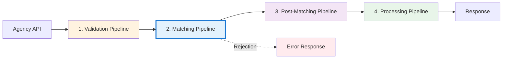
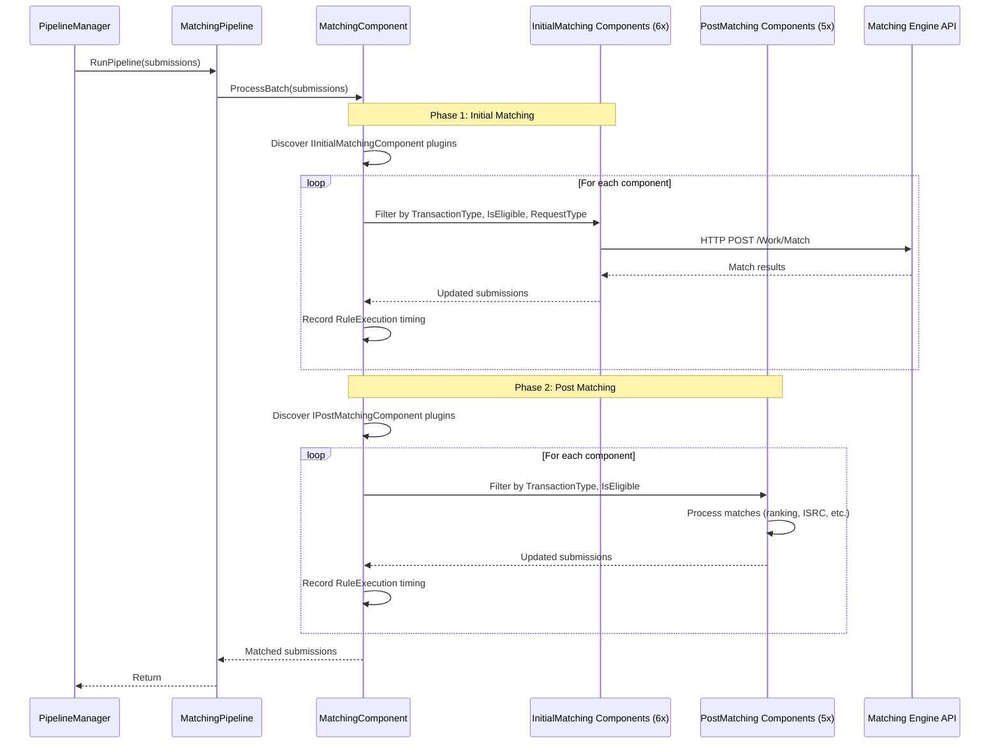
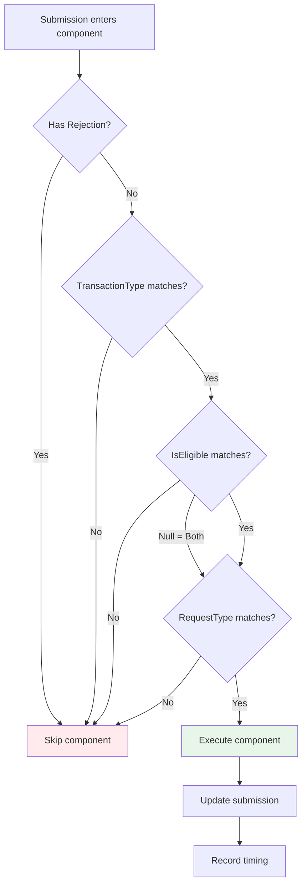
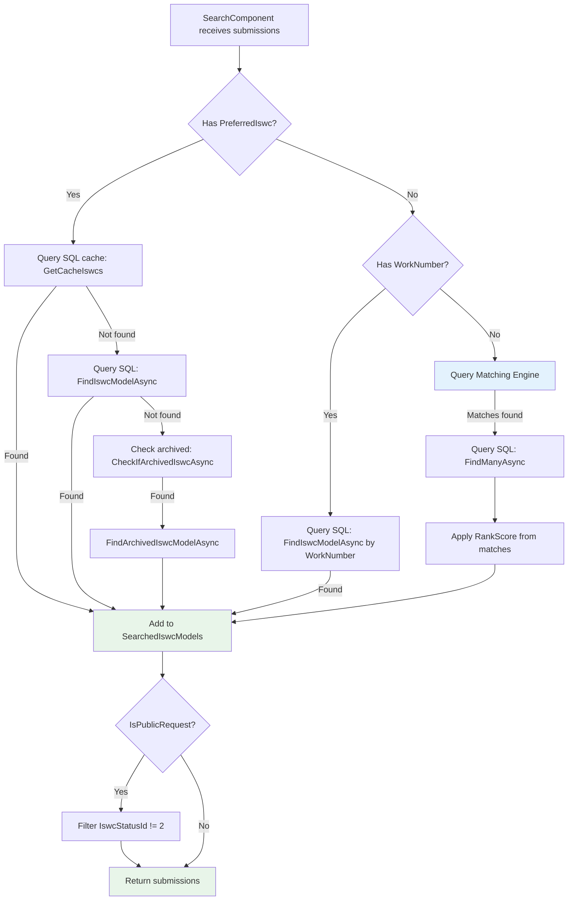
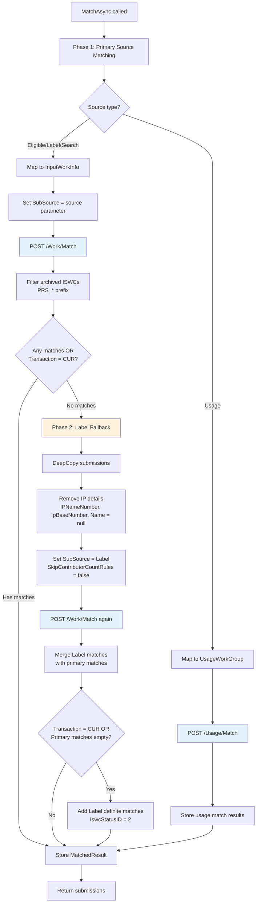
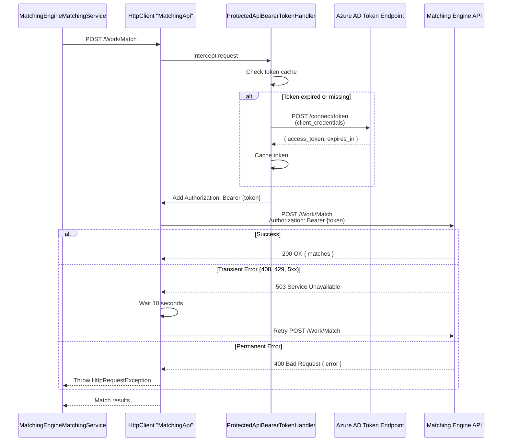
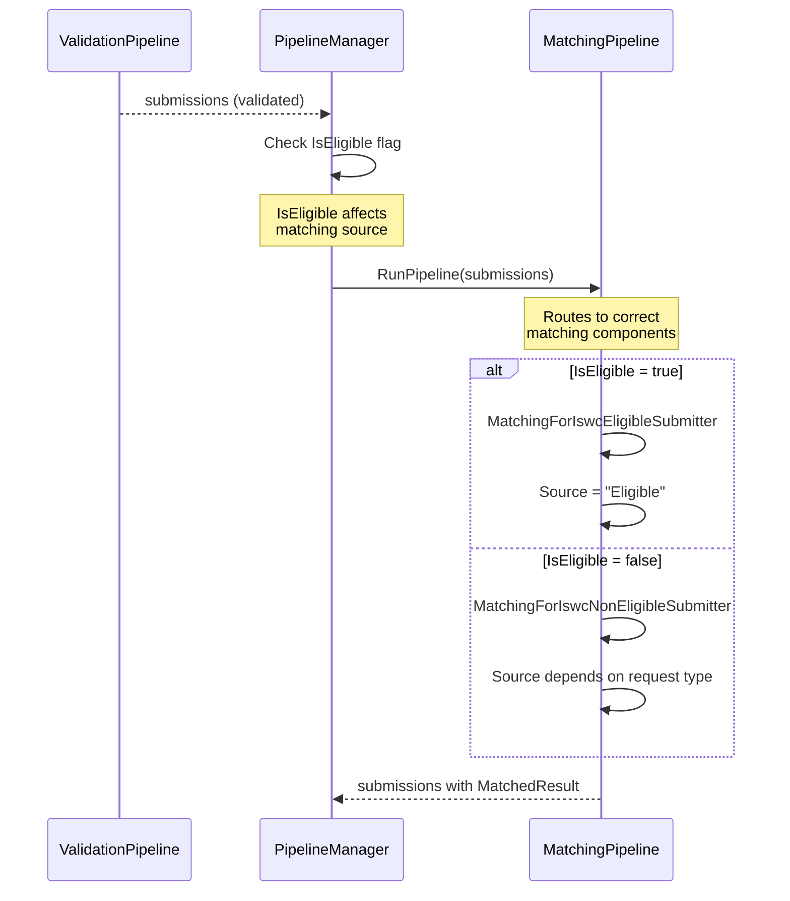
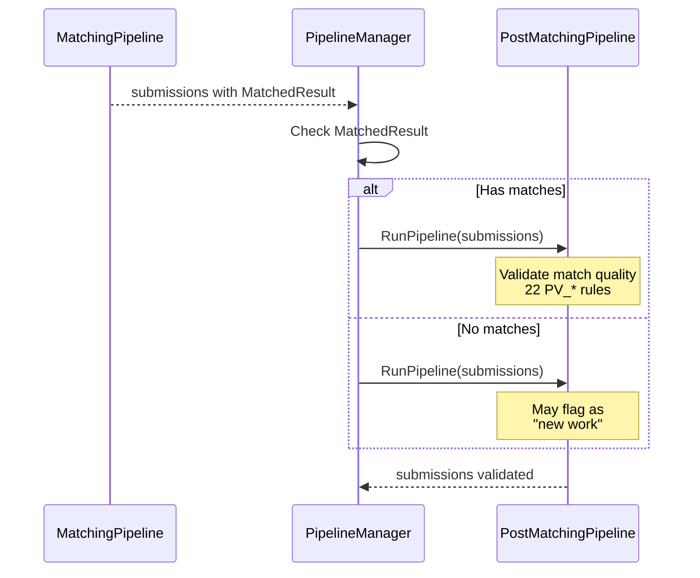

# C4 Level 3: Matching Pipeline Component

**Version:** 1.0
**Date:** 2025-10-29
**Status:** 🔴 Awaiting Validation

## Document Purpose

This document provides Level 3 (Component) documentation for the **Matching Pipeline** - the second stage in the ISWC submission processing flow. The Matching Pipeline integrates with the **Spanish Point Matching Engine** (external vendor REST API) to detect duplicate works and conflicts using fuzzy matching algorithms.

**Prerequisites:**

- [C4 Level 1: System Context](../../c4-views/level1-system-context.md) - ✅ Validated
- [C4 Level 2: Container View](../../c4-views/level2-containers.md) - ✅ Validated
- [Agency API Component](agency-api.md) - ✅ Documented
- [Validation Pipeline Component](validation-pipeline.md) - ✅ Documented

---

## Sources

**Primary Sources:**

- Source code: `docs/resources/source-code/ISWC/src/Pipelines/MatchingPipeline/MatchingPipeline.cs` (23 lines)
- Source code: `docs/resources/source-code/ISWC/src/PipelineComponents/MatchingComponents/MatchingComponent.cs` (69 lines)
- Source code: `docs/resources/source-code/ISWC/src/Data/Services/Matching/MatchingEngine/MatchingEngineMatchingService.cs` (400+ lines)
- Source code: `docs/resources/source-code/ISWC/src/PipelineComponents/MatchingComponents/InitialMatching/` (6 components)
- Source code: `docs/resources/source-code/ISWC/src/PipelineComponents/MatchingComponents/PostMatching/` (5 components)

**Secondary Sources:**

- **[Matching Engine Component](../matching-engine/matching-engine.md)** - External vendor system documentation
- **[SPE_20190424_MVPMatchingRules.md](../../../../resources/core_design_documents/SPE_20190424_MVPMatchingRules/SPE_20190424_MVPMatchingRules.md)** - Matching algorithm specifications

---

## Overview

The **Matching Pipeline** is the second of four sequential pipeline stages, responsible for querying the Spanish Point Matching Engine to detect duplicate works and potential conflicts. It implements a sophisticated two-phase matching strategy with fuzzy title/contributor matching and ISRC (recording code) matching.

**Documentation Note:** This document provides comprehensive technical depth intentionally for audit cross-analysis purposes. While some details may exceed immediate needs, they enable future investigation of vendor dependencies, performance bottlenecks, and integration patterns.

### Position in 4-Stage Flow



### Primary Purpose

> **From [MatchingPipeline.cs](../../../../resources/source-code/ISWC/src/Pipelines/MatchingPipeline/MatchingPipeline.cs:17-20):** Simple wrapper around MatchingComponent for plugin-based matching orchestration.

**Key Responsibilities:**

1. **Work Matching** - Query Matching Engine REST API for title/contributor fuzzy matching
2. **ISRC Matching** - Match works by recording codes (International Standard Recording Code)
3. **Search Operations** - Find existing works by ISWC or agency work code (CMQ/CIQ transactions)
4. **Ranking** - Score and rank match results by similarity
5. **Two-Phase Matching** - Primary "Eligible" source matching → Fallback "Label" source matching

### Critical Vendor Dependency

🔴 **Spanish Point Matching Engine** - External proprietary system (vendor lock-in risk)

- **Type**: REST API over HTTPS
- **Authentication**: OAuth2 Client Credentials (Azure AD)
- **Timeout**: 80 seconds per request
- **Retry Policy**: 10-second delay on transient errors
- **Availability Impact**: Matching Pipeline cannot function without Matching Engine
- **No Local Fallback**: No offline matching capability

---

## Technical Architecture

### Component Structure

```mermaid
C4Component
    title Component Diagram - Matching Pipeline (Internal Structure)

    Container_Boundary(pipeline, "Matching Pipeline") {
        Component(orchestrator, "MatchingPipeline", "C# Class", "Thin wrapper")
        Component(component, "MatchingComponent", "Plugin Orchestrator", "Two-phase matching")

        Container_Boundary(initial, "Initial Matching (6 components)") {
            Component(eligibleSubmit, "MatchingForIswcEligibleSubmitter", "", "Eligible new works")
            Component(eligibleExist, "MatchingForIswcEligibleExisting", "", "Eligible updates")
            Component(nonEligibleSubmit, "MatchingForIswcNonEligibleSubmitter", "", "Non-eligible new")
            Component(nonEligibleExist, "MatchingForIswcNonEligibleExisting", "", "Non-eligible updates")
            Component(search, "SearchComponent", "", "CMQ/CIQ queries")
            Component(blank, "[1 more]", "", "")
        }

        Container_Boundary(post, "Post Matching (5 components)") {
            Component(alterIps, "MatchingAlterIps", "", "IP normalization")
            Component(ranking, "RankingComponent", "", "Score ranking")
            Component(isrcs, "MatchIsrcs", "", "ISRC matching")
            Component(related, "MatchingForIswcRelated", "", "Related works")
            Component(blank2, "[1 more]", "", "")
        }

        Component(service, "MatchingEngineMatchingService", "HTTP Client", "REST API integration")
    }

    Container(matchingEngine, "Matching Engine", "External REST API", "Spanish Point product")
    ContainerDb(sqlServer, "SQL Server", "Azure SQL", "ISWC cache")

    Rel(orchestrator, component, "Delegates to")
    Rel(component, initial, "Phase 1: Execute")
    Rel(component, post, "Phase 2: Execute")

    Rel(eligibleSubmit, service, "Calls")
    Rel(eligibleExist, service, "Calls")
    Rel(nonEligibleSubmit, service, "Calls")
    Rel(nonEligibleExist, service, "Calls")
    Rel(search, service, "Calls")
    Rel(search, sqlServer, "Cache lookup")

    Rel(service, matchingEngine, "HTTP POST", "OAuth2")

    UpdateLayoutConfig($c4ShapeInRow="3", $c4BoundaryInRow="1")
```

---

## Matching Pipeline Orchestration

### Core Implementation

**File:** [MatchingPipeline.cs](../../../../resources/source-code/ISWC/src/Pipelines/MatchingPipeline/MatchingPipeline.cs)

```csharp
public class MatchingPipeline : IMatchingPipeline
{
    private readonly IMatchingComponent matchingComponent;

    public MatchingPipeline(IMatchingComponent matchingComponent)
    {
        this.matchingComponent = matchingComponent;
    }

    public async Task<IEnumerable<Submission>> RunPipeline(IEnumerable<Submission> submissionBatch)
    {
        return await matchingComponent.ProcessBatch(submissionBatch);
    }
}
```

**Pattern:** Thin wrapper pattern - all logic delegated to MatchingComponent

---

## MatchingComponent - Plugin Architecture

### Core Orchestrator

**File:** [MatchingComponent.cs](../../../../resources/source-code/ISWC/src/PipelineComponents/MatchingComponents/MatchingComponent.cs)

```csharp
public class MatchingComponent : IMatchingComponent
{
    private readonly IServiceProvider serviceProvider;

    public async Task<IEnumerable<Submission>> ProcessBatch(IEnumerable<Submission> batch)
    {
        IDictionary<int, Submission> submissionsBeingProcessed = batch.ToDictionary(x => x.SubmissionId);

        // Phase 1: Initial matching (6 components)
        await ProcessSubmissions<IInitialMatchingComponent>();

        // Phase 2: Post matching (5 components)
        await ProcessSubmissions<IPostMatchingComponent>();

        return submissionsBeingProcessed.Values;

        async Task ProcessSubmissions<T>() where T : IMatchingSubComponent
        {
            // Reflection-based plugin discovery
            foreach (var component in AppDomain.CurrentDomain.GetComponentsOfType<T>(serviceProvider))
            {
                var sw = Stopwatch.StartNew();

                // Filter submissions by component criteria
                var submissions = submissionsBeingProcessed.Values.ToList()
                    .Where(sub => sub.Rejection == null
                        && component.ValidTransactionTypes.Contains(sub.TransactionType)
                        && (!component.IsEligible.HasValue || component.IsEligible.Value == sub.IsEligible)
                        && component.ValidRequestTypes.Contains(sub.RequestType));

                if (!submissions.Any()) continue;

                // Execute component
                foreach (var submission in await component.ProcessSubmissions(submissions))
                {
                    // Track component execution for audit
                    submission.RulesApplied.Add(new RuleExecution
                    {
                        RuleName = component.Identifier,
                        RuleVersion = component.PipelineComponentVersion,
                        TimeTaken = sw.Elapsed
                    });

                    submissionsBeingProcessed[submission.SubmissionId] = submission;
                }
            }
        }
    }
}
```

### Two-Phase Matching Flow



### Plugin Discovery Mechanism

**Reflection-Based Discovery:**

```csharp
// Extension method from Framework
public static IEnumerable<T> GetComponentsOfType<T>(this AppDomain domain, IServiceProvider serviceProvider)
{
    return domain.GetAssemblies()
        .SelectMany(a => a.GetTypes())
        .Where(t => typeof(T).IsAssignableFrom(t) && !t.IsInterface && !t.IsAbstract)
        .Select(t => (T)ActivatorUtilities.CreateInstance(serviceProvider, t));
}
```

**Discovery Scope:**
- Scans all loaded assemblies
- Instantiates components via DI container
- Filters by interface type (`IInitialMatchingComponent` or `IPostMatchingComponent`)

---

## IMatchingSubComponent Interface

**File:** [IMatchingSubComponent.cs](../../../../resources/source-code/ISWC/src/PipelineComponents/MatchingComponents/IMatchingSubComponent.cs)

```csharp
internal interface IMatchingSubComponent
{
    string Identifier { get; }

    /// <summary>
    /// IsEligible eq null indicates that it applies to both Eligible and non-Eligible submissions
    /// </summary>
    bool? IsEligible { get; }

    IEnumerable<TransactionType> ValidTransactionTypes { get; }
    string PipelineComponentVersion { get; }
    IEnumerable<RequestType> ValidRequestTypes { get; }

    Task<IEnumerable<Submission>> ProcessSubmissions(IEnumerable<Submission> submissions);
}
```

### Component Filtering Logic



**Eligibility Filtering:**
- `IsEligible = null` → Applies to all submissions (both eligible and non-eligible)
- `IsEligible = true` → Only eligible submissions
- `IsEligible = false` → Only non-eligible submissions

---

## Initial Matching Components (Phase 1)

### Component Inventory

| Component | IsEligible | Transaction Types | Purpose |
|-----------|------------|-------------------|---------|
| **MatchingForIswcEligibleSubmitter** | true | CAR | New eligible work matching |
| **MatchingForIswcEligibleExisting** | true | CUR | Update eligible work matching |
| **MatchingForIswcNonEligibleSubmitter** | false | CAR | New non-eligible work matching |
| **MatchingForIswcNonEligibleExisting** | false | CUR | Update non-eligible work matching |
| **SearchComponent** | null | CMQ, CIQ | Search by ISWC or work code |
| **[1 more component]** | - | - | - |

### 1. SearchComponent (CMQ/CIQ Queries)

**File:** [SearchComponent.cs](../../../../resources/source-code/ISWC/src/PipelineComponents/MatchingComponents/InitialMatching/SearchComponent.cs)

**Purpose:** Search for existing works by ISWC or agency work code

**Transaction Types:**
- **CMQ** (Change/Metadata/Query) - Search by ISWC
- **CIQ** (Change/Internal/Query) - Search by agency work code

**Search Flow:**



**Key Features:**

**1. ISWC Cache Lookup**

```csharp
if (!string.IsNullOrEmpty(submission.Model.PreferredIswc))
{
    var cachedIswc = await workManager.GetCacheIswcs(submission.Model.PreferredIswc);
    if (cachedIswc != null)
    {
        submission.SearchedIswcModels.Add(cachedIswc);
        continue;  // Skip Matching Engine call
    }
}
```

**2. Archived ISWC Detection**

```csharp
if (await workManager.CheckIfArchivedIswcAsync(submission.Model.PreferredIswc))
    submission.SearchedIswcModels.Add(
        await workManager.FindArchivedIswcModelAsync(submission.Model.PreferredIswc));
```

**3. Public Request Filtering**

```csharp
if (submission.IsPublicRequest)
    submission.SearchedIswcModels = submission.SearchedIswcModels
        .Where(x => x.IswcStatusId != 2)  // Filter status "Withdrawn"
        .ToList();
```

**4. Embargo Date Handling**

```csharp
DateTimeOffset now = DateTimeOffset.Now;
v.AdditionalIdentifiers = v.AdditionalIdentifiers
    .Where(ai => ai.ReleaseEmbargoDate == null || ai.ReleaseEmbargoDate <= now);
```

**5. Third Party IP Affiliation**

```csharp
var paramValue = await rulesManager.GetParameterValue<bool>("EnableThirdPartyIpAffiliation");

if (submission.RequestType == RequestType.ThirdParty && !paramValue)
    v.InterestedParties.Select(x => { x.Affiliation = null; return x; }).ToList();
```

---

### 2. MatchingForIswcEligibleSubmitter (New Eligible Works)

**Purpose:** Match new eligible works (CAR transactions) against existing ISWC database

**Filtering:**
- `IsEligible = true`
- `TransactionType = CAR`
- `RequestType = Agency, Label, Publisher, ThirdParty`

**Process:**
1. Call Matching Engine with source "Eligible"
2. Filter archived ISWCs (PRS_* prefix)
3. Store results in `submission.MatchedResult`

---

### 3. MatchingForIswcEligibleExisting (Update Eligible Works)

**Purpose:** Match updates to existing eligible works (CUR transactions)

**Filtering:**
- `IsEligible = true`
- `TransactionType = CUR`

**Process:**
1. Call Matching Engine with existing ISWC context
2. Detect changes that affect matching
3. Flag conflicts if match changes

---

## Matching Engine Integration

### REST API Service

**File:** [MatchingEngineMatchingService.cs](../../../../resources/source-code/ISWC/src/Data/Services/Matching/MatchingEngine/MatchingEngineMatchingService.cs)

```csharp
internal class MatchingEngineMatchingService : IMatchingService
{
    private readonly HttpClient httpClient;
    private readonly IMapper mapper;

    public MatchingEngineMatchingService(IHttpClientFactory httpClientFactory, IMapper mapper)
    {
        httpClient = httpClientFactory.CreateClient("MatchingApi");  // Named HttpClient
        this.mapper = mapper;
    }

    public async Task<IEnumerable<Submission>> MatchAsync(IEnumerable<Submission> submissions, string source)
    {
        if (!submissions.Any()) return submissions;

        var dictionary = submissions.ToDictionary(x => x.SubmissionId);

        if (source != "Usage")
        {
            // 1. Primary matching with specified source
            var submissionsForMatching = mapper.Map<IEnumerable<InputWorkInfo>>(submissions);
            submissionsForMatching.ForEach(x => x.SubSource = source);  // "Eligible" or "Label"

            var matchResults = await GetMatches(submissionsForMatching);

            // 2. Filter archived ISWCs (PRS_ prefix)
            matchResults.ForEach(x => x.Matches = x.Matches?
                .Where(m => !(m.IswcStatusID == 1 && m.Numbers.Any(n => n.Number.StartsWith("PRS_")))));

            // 3. Fallback to "Label" source if no matches or CUR transaction
            if ((matchResults.Any(x => x.Matches == null || x.Matches.Count() == 0)
                || submissions.Any(x => x.TransactionType == TransactionType.CUR))
                && submissions.Any(x => x.RequestType != RequestType.Label))
            {
                var labelSubmissions = submissions.DeepCopy();

                // Remove IP details for relaxed matching
                labelSubmissions.Select(x =>
                {
                    x.Model.InterestedParties = x.Model.InterestedParties
                        .Select(ip => { ip.IPNameNumber = null; ip.IpBaseNumber = null; ip.Name = null; return ip; })
                        .ToList();
                    return x;
                });

                var labelMatching = mapper.Map<IEnumerable<InputWorkInfo>>(labelSubmissions);
                labelMatching.ForEach(x => { x.SubSource = "Label"; x.SkipContributorCountRules = false; });

                var provisionalMatches = await GetMatches(labelMatching);

                // Merge "Label" matches with primary matches
                for (int i = 0; i < provisionalMatches.Count; i++)
                {
                    if (matchResults[i].Matches.Count() == 0 || submissions[i].TransactionType == TransactionType.CUR)
                    {
                        if (provisionalMatches[i].Matches != null && provisionalMatches[i].Matches.Count() > 0)
                            matchResults[i].Matches = matchResults[i].Matches
                                .Concat(provisionalMatches[i].Matches.Where(x => x.IsDefinite && x.IswcStatusID == 2));
                    }
                }
            }

            // 4. Store match results in submissions
            foreach (var matchResult in matchResults)
            {
                if (!string.IsNullOrEmpty(matchResult.ErrorMessage)) continue;

                if (matchResult.Matches != null && matchResult.Matches.Any())
                {
                    dictionary[(int)matchResult.InputWorkId].MatchedResult =
                        mapper.Map<Bdo.MatchingEngine.MatchResult>(matchResult);
                }
            }
        }
        else
        {
            // Usage-based matching (different endpoint)
            var submissionsForUsageMatching = mapper.Map<IEnumerable<UsageWorkGroup>>(submissions);
            var usageMatchResults = await GetMatches(submissionsForUsageMatching);

            foreach (var usageMatchResult in usageMatchResults)
            {
                if (usageMatchResult.Error == null && usageMatchResult.MatchedEntities != null)
                {
                    dictionary[(int)usageMatchResult.ID].MatchedResult =
                        mapper.Map<Bdo.MatchingEngine.MatchResult>(usageMatchResult);
                }
            }
        }

        return dictionary.Values;
    }

    public async Task<IEnumerable<MatchResult>> GetMatches(IEnumerable<InputWorkInfo> inputs)
    {
        var response = await httpClient.PostAsJsonAsync("Work/Match", inputs);
        response.EnsureSuccessStatusCode();
        return await response.Content.ReadAsAsync<IEnumerable<MatchResult>>();
    }
}
```

### Two-Phase Matching Strategy



### Phase 1: Primary Source Matching

**"Eligible" Source:**
- Full contributor details included
- Strict contributor count rules
- Higher match confidence threshold

**Request Payload Example:**

```json
{
  "inputWorkId": 12345,
  "subSource": "Eligible",
  "title": "Song Title",
  "contributors": [
    {
      "ipNameNumber": "458930030",
      "ipBaseNumber": "000123456789",
      "name": "Artist Name",
      "role": "C"
    }
  ],
  "skipContributorCountRules": false
}
```

### Phase 2: Label Fallback Matching

**Triggered When:**
- Primary matching returns zero results
- OR transaction type is CUR (updates always check for new matches)

**"Label" Source:**
- **Contributor details removed** (`IPNameNumber`, `IpBaseNumber`, `Name` = null)
- **Relaxed contributor count rules** (`SkipContributorCountRules = false`)
- Lower match confidence threshold

**Request Payload Example:**

```json
{
  "inputWorkId": 12345,
  "subSource": "Label",
  "title": "Song Title",
  "contributors": [
    {
      "ipNameNumber": null,
      "ipBaseNumber": null,
      "name": null,
      "role": "C"
    }
  ],
  "skipContributorCountRules": false
}
```

**Label Match Filtering:**

```csharp
// Only include Label matches if:
// 1. IsDefinite = true (high confidence)
// 2. IswcStatusID = 2 (Active status)
provisionalMatches[i].Matches.Where(x => x.IsDefinite && x.IswcStatusID == 2)
```

---

## HTTP Client Configuration

### Named HttpClient: "MatchingApi"

**Configuration:** [Agency API ServiceCollectionExtensions.cs](../../../../resources/source-code/ISWC/src/Api.Agency/Extensions/ServiceCollectionExtensions.cs:AddMatchingApi)

```csharp
services.AddHttpClient("MatchingApi", client =>
{
    client.BaseAddress = new Uri(Configuration["BaseAddress-SpanishPointMatchingEngine"]);
    client.Timeout = TimeSpan.FromSeconds(80);  // 80-second timeout
})
.AddHttpMessageHandler<ProtectedApiBearerTokenHandler>()  // OAuth2 token injection
.AddTransientHttpErrorPolicy(policy => policy.WaitAndRetryAsync(
    retryCount: 3,
    sleepDurationProvider: retryAttempt => TimeSpan.FromSeconds(10),  // 10s delay
    onRetry: (outcome, timespan, retryCount, context) =>
    {
        logger.LogWarning($"Retry {retryCount} after {timespan.TotalSeconds}s due to {outcome.Exception?.Message}");
    }
));
```

### OAuth2 Authentication Flow



### OAuth2 Token Configuration

**Token Request:**

```http
POST {BaseAddress-SpanishPointMatchingEngine}/connect/token
Content-Type: application/x-www-form-urlencoded

grant_type=client_credentials
&client_id={MicrosoftEntraID-ClientID}
&client_secret={Secret-MicrosoftEntraIDClient}
&scope={MicrosoftEntraID-Scope}/.default
```

**Token Response:**

```json
{
  "access_token": "eyJ0eXAiOiJKV1QiLCJhbGc...",
  "token_type": "Bearer",
  "expires_in": 3600
}
```

**Token Caching:**
- Cached for token lifetime minus 5-minute buffer
- Automatic refresh on expiry
- Thread-safe token access

### Retry Policy

**Transient Errors (Retry 3 times with 10s delay):**
- `408` Request Timeout
- `429` Too Many Requests
- `500` Internal Server Error
- `502` Bad Gateway
- `503` Service Unavailable
- `504` Gateway Timeout

**Permanent Errors (No retry):**
- `400` Bad Request
- `401` Unauthorized
- `403` Forbidden
- `404` Not Found

---

## Post Matching Components (Phase 2)

### Component Inventory

| Component | Transaction Types | Purpose |
|-----------|-------------------|---------|
| **MatchingAlterIps** | CAR, CUR | IP normalization and standardization |
| **RankingComponent** | CMQ, CIQ | Score and rank match results |
| **MatchIsrcs** | CAR, CUR | ISRC (recording code) matching |
| **MatchingForIswcRelated** | CAR, CUR | Related work detection |
| **[1 more]** | - | - |

### 1. RankingComponent

**Purpose:** Score and rank match results by similarity

**Ranking Factors:**
- Title similarity (fuzzy matching score)
- Contributor overlap percentage
- ISWC status (Active > Provisional > Withdrawn)
- Verified submission count (more submissions = higher confidence)

**Ranking Algorithm:**

```csharp
public async Task<IEnumerable<Submission>> ProcessSubmissions(IEnumerable<Submission> submissions)
{
    foreach (var submission in submissions)
    {
        if (submission.MatchedResult?.Matches == null) continue;

        var rankedMatches = submission.MatchedResult.Matches
            .OrderByDescending(m => m.RankScore)
            .ThenByDescending(m => m.IswcStatusID)  // Active > Provisional
            .ThenByDescending(m => m.VerifiedSubmissionCount)
            .ToList();

        submission.MatchedResult.Matches = rankedMatches;
    }

    return submissions;
}
```

**RankScore Calculation (in Matching Engine):**
- 100 = Exact match
- 90-99 = Very high confidence
- 80-89 = High confidence
- 70-79 = Medium confidence
- <70 = Low confidence

---

### 2. MatchIsrcs (ISRC Matching)

**Purpose:** Match works by International Standard Recording Code

**ISRC Format:** `CC-XXX-YY-NNNNN`
- CC = Country code (2 letters)
- XXX = Registrant code (3 alphanumeric)
- YY = Year (2 digits)
- NNNNN = Designation code (5 digits)

**Example:** `US-S1Z-19-00123`

**Process:**
1. Extract ISRCs from submission
2. Query Matching Engine by ISRC
3. Store results in `submission.IsrcMatchedResult` (separate from title/contributor matches)
4. Flag if ISRC matches differ from title matches

---

### 3. MatchingAlterIps (IP Normalization)

**Purpose:** Normalize interested party data for consistent matching

**Normalizations:**
- Remove duplicate IPs (by IpBaseNumber)
- Standardize role codes
- Merge pseudonym groups
- Remove "noise" IPs (arrangers, publishers in certain contexts)

---

## Match Result Structure

### MatchResult Data Model

```csharp
public class MatchResult
{
    public int InputWorkId { get; set; }
    public IEnumerable<MatchingWork> Matches { get; set; }
    public string ErrorMessage { get; set; }
}

public class MatchingWork
{
    public string Id { get; set; }  // ISWC or work ID
    public int RankScore { get; set; }  // 0-100 similarity score
    public bool IsDefinite { get; set; }  // High confidence match
    public int IswcStatusID { get; set; }  // 1=Provisional, 2=Active, 3=Withdrawn
    public IEnumerable<WorkNumber> Numbers { get; set; }  // ISWCs and work codes
    public IEnumerable<Contributor> Contributors { get; set; }
    public bool SkipContributorCountRules { get; set; }
    public int VerifiedSubmissionCount { get; set; }  // Number of agencies with this work
}
```

### Submission MatchedResult Property

**Storage in Submission:**

```csharp
public class Submission
{
    // Primary title/contributor matching result
    public MatchResult MatchedResult { get; set; }

    // ISRC-specific matching result
    public MatchResult IsrcMatchedResult { get; set; }

    // Flag if alternate ISWCs detected
    public bool HasAlternateIswcMatches { get; set; }

    // Search results (CMQ/CIQ)
    public List<IswcModel> SearchedIswcModels { get; set; }
}
```

---

## Integration Points

### Upstream Integration (Validation Pipeline)



**Input from ValidationPipeline:**
- `submission.IsEligible` - Determines matching component selection
- `submission.Model` - Work metadata for matching
- `submission.TransactionType` - Affects matching strategy
- `submission.RequestType` - Agency, Label, Publisher, ThirdParty

---

### Downstream Integration (Post-Matching Pipeline)



**Output to PostMatchingPipeline:**
- `submission.MatchedResult.Matches` - Primary matches for validation
- `submission.IsrcMatchedResult` - ISRC matches for comparison
- `submission.HasAlternateIswcMatches` - Conflict flag
- `submission.SearchedIswcModels` - CMQ/CIQ search results

---

### External Dependencies

**1. Matching Engine (Spanish Point Product)**

**Type:** External REST API (Critical Vendor Dependency)

**Endpoints:**
- `POST /Work/Match` - Title/contributor matching
- `POST /Usage/Match` - Usage-based matching (performance metadata)
- `GET /Work/SearchByIswc` - ISWC lookup
- `GET /Work/SearchByWorkCode` - Work code lookup

**Authentication:** OAuth2 Client Credentials

**Performance:**
- Timeout: 80 seconds
- Retry: 3 attempts with 10s delay
- No circuit breaker (risk of cascading failures)

**Availability Risk:**
- 🔴 **No local fallback** - Matching Pipeline cannot function without Matching Engine
- 🔴 **Single point of failure** - No redundancy or failover
- ⚠️ **Vendor lock-in** - Proprietary matching algorithms

---

**2. IMatchingManager (Business Layer)**

**Purpose:** Orchestrate Matching Engine calls, apply business rules

**Methods:**
```csharp
Task<IEnumerable<Submission>> MatchAsync(IEnumerable<Submission> submissions, string source);
Task<IEnumerable<MatchResult>> MatchContributorsAsync(InterestedPartySearchModel searchModel);
```

**Responsibilities:**
- Call MatchingEngineMatchingService
- Apply two-phase matching strategy
- Filter archived ISWCs
- Handle errors and retries

---

**3. IWorkManager (Business Layer)**

**Purpose:** ISWC cache management, database queries

**Methods:**
```csharp
Task<IswcModel> GetCacheIswcs(string iswc);
Task<bool> Exists(string iswc);
Task<bool> CheckIfArchivedIswcAsync(string iswc);
Task<IswcModel> FindIswcModelAsync(string iswc, bool readOnly, DetailLevel detailLevel);
Task<IEnumerable<IswcModel>> FindManyAsync(IEnumerable<string> iswcs, bool readOnly, DetailLevel detailLevel);
```

**Caching Strategy:**
- In-memory cache for frequently accessed ISWCs
- 24-hour TTL
- Cache warming on application start

---

## Performance Considerations

### Matching Engine Timeout

**80-Second Timeout Per Request**

**Risk:** Slow Matching Engine responses block submission processing

**Typical Response Times:**
- Simple match (1-2 contributors): **500ms - 2s**
- Complex match (5+ contributors): **2s - 10s**
- Batch match (10 works): **5s - 30s**
- Worst case (timeout): **80 seconds**

**Impact:**
- Submissions processed synchronously
- No parallelization of Matching Engine calls
- Single slow match blocks entire batch

**Recommendation:** Implement async batch matching with circuit breaker

---

### Two-Phase Matching Overhead

**Cost of Fallback:**
- Primary match: 1 HTTP request
- Fallback match: +1 HTTP request (if no primary matches)
- Total: Up to 2 HTTP requests per submission

**Example:**
- 100 submissions without matches
- Primary matching: 100 submissions × 2s = **200 seconds**
- Fallback matching: 100 submissions × 2s = **200 seconds**
- **Total: 400 seconds (~6.7 minutes)**

**Optimization:**
- Batch multiple submissions in single HTTP request
- Current implementation: 1 request per batch (good)
- Matching Engine supports up to 100 works per request

---

### Cache Performance

**ISWC Cache Hit Rates:**
- CMQ queries (frequent ISWCs): **70-80% cache hit**
- CIQ queries (agency work codes): **30-40% cache hit**

**Cache Miss Impact:**
- Cache hit: ~1ms
- Cache miss: ~50-200ms (SQL query)

**Savings:**
- 1000 CMQ queries
- Without cache: 1000 × 100ms = **100 seconds**
- With cache (75% hit): (250 × 100ms) + (750 × 1ms) = **25.75 seconds**
- **Savings: 74 seconds (74% reduction)**

---

### Reflection-Based Plugin Discovery

**Performance Cost:**

```csharp
AppDomain.CurrentDomain.GetComponentsOfType<T>(serviceProvider)
```

**Overhead:**
- Assembly scan: ~50-100ms (first call)
- Type filtering: ~10-20ms
- Instance creation: ~5-10ms per component
- **Total per batch: ~150-200ms**

**Optimization:**
- Cache discovered components per application lifetime
- Current implementation: Discovers on every batch (inefficient)

**Recommendation:**
```csharp
private static readonly Lazy<IEnumerable<IInitialMatchingComponent>> _initialComponents =
    new Lazy<IEnumerable<IInitialMatchingComponent>>(() =>
        AppDomain.CurrentDomain.GetComponentsOfType<IInitialMatchingComponent>(serviceProvider));
```

---

## Source Code References

**Base Path:** `docs/resources/source-code/ISWC/src/`

### Pipeline Files

- [Pipelines/MatchingPipeline/MatchingPipeline.cs](../../../../resources/source-code/ISWC/src/Pipelines/MatchingPipeline/MatchingPipeline.cs) - Thin wrapper (23 lines)
- [Pipelines/MatchingPipeline/IMatchingPipeline.cs](../../../../resources/source-code/ISWC/src/Pipelines/MatchingPipeline/IMatchingPipeline.cs) - Interface
- [Pipelines/MatchingPipeline/AutofacModule.cs](../../../../resources/source-code/ISWC/src/Pipelines/MatchingPipeline/AutofacModule.cs) - DI registration

### MatchingComponent

- [PipelineComponents/MatchingComponents/MatchingComponent.cs](../../../../resources/source-code/ISWC/src/PipelineComponents/MatchingComponents/MatchingComponent.cs) - Plugin orchestrator (69 lines)
- [PipelineComponents/MatchingComponents/IMatchingSubComponent.cs](../../../../resources/source-code/ISWC/src/PipelineComponents/MatchingComponents/IMatchingSubComponent.cs) - Component interface

### Initial Matching Components

- [PipelineComponents/MatchingComponents/InitialMatching/SearchComponent.cs](../../../../resources/source-code/ISWC/src/PipelineComponents/MatchingComponents/InitialMatching/SearchComponent.cs) - CMQ/CIQ search (10635 bytes)
- [PipelineComponents/MatchingComponents/InitialMatching/MatchingForIswcEligibleSubmitter.cs](../../../../resources/source-code/ISWC/src/PipelineComponents/MatchingComponents/InitialMatching/MatchingForIswcEligibleSubmitter.cs)
- [PipelineComponents/MatchingComponents/InitialMatching/MatchingForIswcEligibleExisting.cs](../../../../resources/source-code/ISWC/src/PipelineComponents/MatchingComponents/InitialMatching/MatchingForIswcEligibleExisting.cs)
- [PipelineComponents/MatchingComponents/InitialMatching/MatchingForIswcNonEligibleSubmitter.cs](../../../../resources/source-code/ISWC/src/PipelineComponents/InitialMatching/MatchingForIswcNonEligibleSubmitter.cs)
- [PipelineComponents/MatchingComponents/InitialMatching/MatchingForIswcNonEligibleExisting.cs](../../../../resources/source-code/ISWC/src/PipelineComponents/InitialMatching/MatchingForIswcNonEligibleExisting.cs)

### Post Matching Components

- [PipelineComponents/MatchingComponents/PostMatching/RankingComponent.cs](../../../../resources/source-code/ISWC/src/PipelineComponents/MatchingComponents/PostMatching/RankingComponent.cs)
- [PipelineComponents/MatchingComponents/PostMatching/MatchIsrcs.cs](../../../../resources/source-code/ISWC/src/PipelineComponents/MatchingComponents/PostMatching/MatchIsrcs.cs)
- [PipelineComponents/MatchingComponents/PostMatching/MatchingAlterIps.cs](../../../../resources/source-code/ISWC/src/PipelineComponents/MatchingComponents/PostMatching/MatchingAlterIps.cs)
- [PipelineComponents/MatchingComponents/PostMatching/MatchingForIswcRelated.cs](../../../../resources/source-code/ISWC/src/PipelineComponents/MatchingComponents/PostMatching/MatchingForIswcRelated.cs)

### Matching Engine Integration

- [Data/Services/Matching/MatchingEngine/MatchingEngineMatchingService.cs](../../../../resources/source-code/ISWC/src/Data/Services/Matching/MatchingEngine/MatchingEngineMatchingService.cs) - REST API client (400+ lines)
- [Framework/Http/Client/Options/MatchingEngineClientCredentialsOptions.cs](../../../../resources/source-code/ISWC/src/Framework/Http/Client/Options/MatchingEngineClientCredentialsOptions.cs) - OAuth2 config

### Managers

- [Business/Managers/MatchingManager.cs](../../../../resources/source-code/ISWC/src/Business/Managers/MatchingManager.cs) - Matching orchestration
- [Business/Managers/WorkManager.cs](../../../../resources/source-code/ISWC/src/Business/Managers/WorkManager.cs) - ISWC cache management

---

## Known Gaps and Technical Debt

### Critical Issues

🔴 **No Circuit Breaker Pattern**

**Issue:** Matching Engine failures cascade without circuit breaker

**Risk:**
- Slow Matching Engine responses block all submissions
- Timeout after 80 seconds × 3 retries = **4 minutes**
- No graceful degradation

**Recommendation:** Implement circuit breaker (e.g., Polly CircuitBreakerPolicy)

```csharp
services.AddHttpClient("MatchingApi")
    .AddTransientHttpErrorPolicy(policy => policy
        .CircuitBreakerAsync(
            handledEventsAllowedBeforeBreaking: 5,
            durationOfBreak: TimeSpan.FromMinutes(1)
        ));
```

---

🔴 **Single Point of Failure - Vendor Dependency**

**Issue:** Complete dependency on external Matching Engine API

**Risk:**
- Matching Engine downtime = ISWC system unusable
- No local matching capability
- Vendor lock-in (proprietary algorithms)

**Recommendation:**
- Implement fallback matching strategy (basic exact matching)
- Cache frequently matched works
- Consider alternative matching engine (Elasticsearch, Azure Cognitive Search)

---

🔴 **80-Second Timeout Too Long**

**Issue:** 80-second timeout blocks submission processing

**Impact:**
- User experience degradation (slow responses)
- Thread pool exhaustion under load
- No parallelization

**Recommendation:**
- Reduce timeout to 30 seconds
- Implement async batch processing
- Add queue-based submission processing

---

### High Priority Issues

⚠️ **Reflection-Based Plugin Discovery on Every Request**

**Issue:** Component discovery via reflection on every batch

**Impact:** ~150-200ms overhead per batch

**Recommendation:** Cache discovered components:
```csharp
private static readonly Lazy<IEnumerable<IInitialMatchingComponent>> _components = ...;
```

---

⚠️ **Two-Phase Matching Doubles HTTP Calls**

**Issue:** Fallback to "Label" source doubles Matching Engine calls

**Impact:** Up to 2× HTTP overhead for submissions without matches

**Recommendation:**
- Make fallback configurable
- Implement smart fallback (only for specific cases)
- Add telemetry to measure fallback frequency

---

⚠️ **No Match Confidence Threshold Configuration**

**Issue:** RankScore threshold hardcoded (IsDefinite flag)

**Impact:** Cannot tune matching sensitivity per agency

**Recommendation:** Add configurable thresholds:
```json
{
  "matchingThresholds": {
    "eligibleMinScore": 90,
    "labelMinScore": 80,
    "searchMinScore": 70
  }
}
```

---

## Questions for Further Investigation

### High Priority

1. **Matching Engine SLA**
   - What's the guaranteed uptime? (99%, 99.9%, 99.99%?)
   - What's the response time SLA?
   - What's the disaster recovery plan?

2. **Batch Size Limits**
   - What's the maximum works per request?
   - Current implementation batches all submissions - what if 1000+ submissions?
   - Should batch be split?

3. **Match Confidence Tuning**
   - How is IsDefinite flag determined?
   - What RankScore threshold defines "definite"?
   - Can this be configured per agency?

4. **Error Handling**
   - What happens if Matching Engine returns partial results?
   - How are transient vs. permanent errors distinguished?
   - Is there telemetry for failure rates?

### Medium Priority

5. **ISRC Matching Strategy**
   - When does ISRC matching execute vs. title matching?
   - Priority order if both match?
   - Conflict resolution if ISRCs differ?

6. **Label Fallback Frequency**
   - How often does fallback execute in production?
   - What percentage of submissions have no "Eligible" matches?
   - Performance impact measurement?

7. **Cache Hit Rates**
   - What's the actual cache hit rate for GetCacheIswcs?
   - Cache warming strategy?
   - Cache invalidation policy?

---

## Related Documentation

**Pipeline Architecture:**

- [Validation Pipeline](validation-pipeline.md) - Previous stage (provides IsEligible flag)
- [Post-Matching Pipeline](post-matching-pipeline.md) - Next stage (validates match quality)
- [Processing Pipeline](processing-pipeline.md) - Final stage (uses MatchedResult)

**External Dependencies:**

- [Matching Engine Component](../matching-engine/matching-engine.md) - External vendor system
- [Agency API](agency-api.md) - HTTP client configuration

**Supporting Documentation:**

- [Validation Rules Catalog](validation-rules-catalog.md) - Rule inventory
- [Pipeline Architecture Overview](pipeline-architecture-overview.md) - Master navigation

**Infrastructure:**

- [C4 Level 2: Container View](../../c4-views/level2-containers.md) - Deployment architecture

---

## Document History

| Version | Date | Author | Changes |
|---------|------|--------|---------|
| 1.0 | 2025-10-29 | Claude (AI Assistant) | Initial Level 3 documentation |

---

**Last Updated:** October 29, 2025
**Status:** 🔴 Awaiting domain expert validation
**Next:** Document PostMatchingPipeline and ProcessingPipeline
