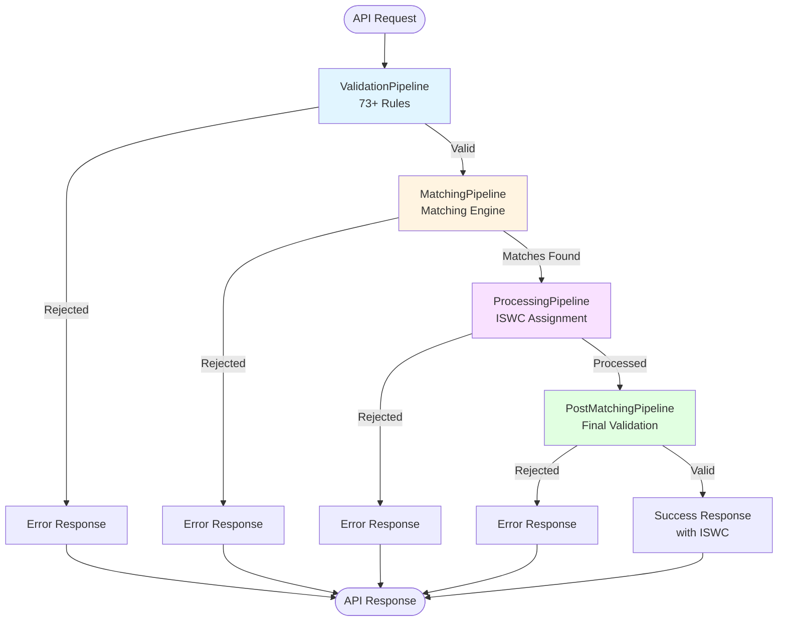
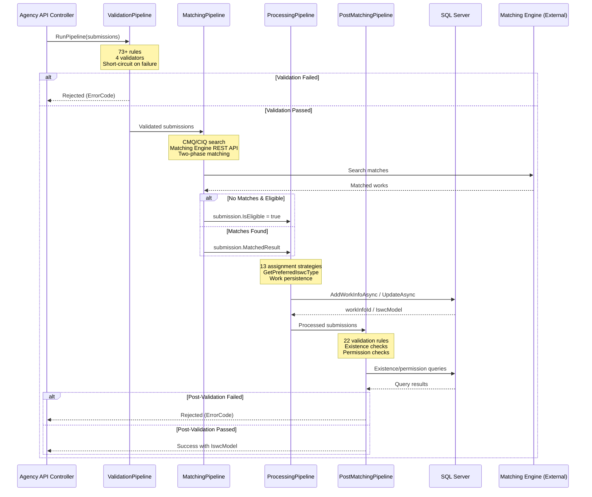
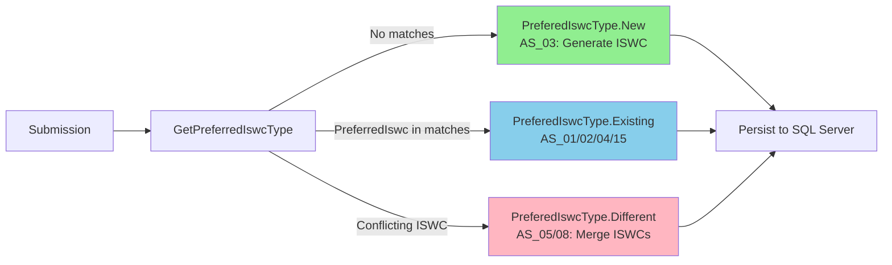
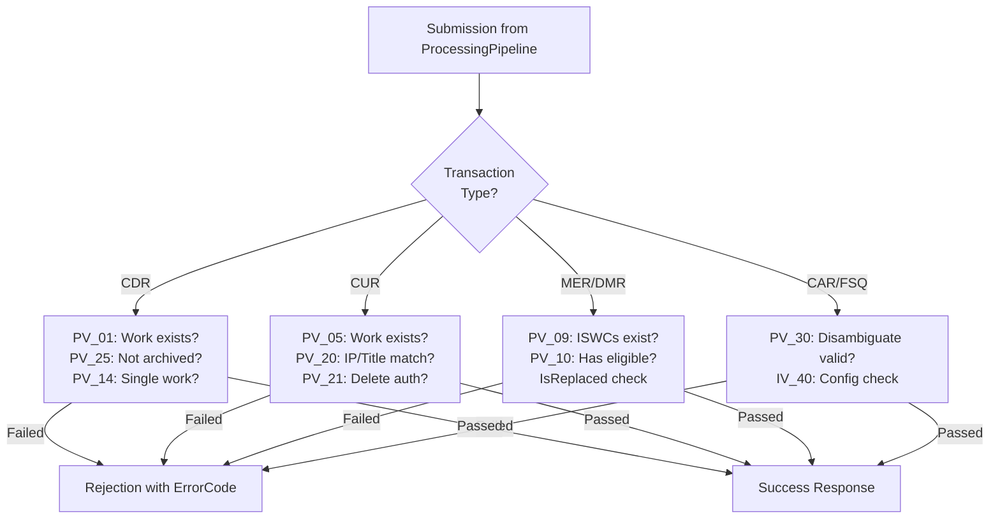
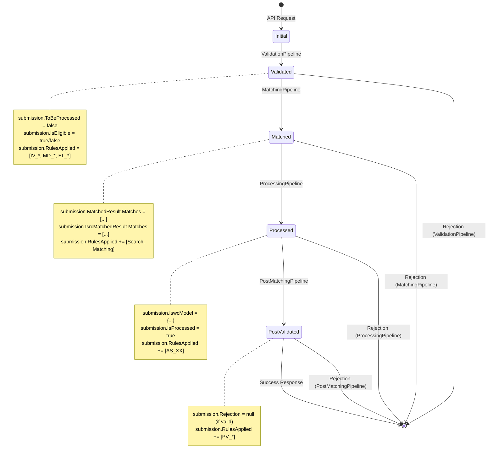

# Pipeline Architecture Overview - Level 3 Component

**Documentation Note:** This overview synthesizes the four pipeline stages into a cohesive architectural view. For detailed technical analysis of each stage, see the individual pipeline documents.

## Executive Summary

The ISWC Platform processes musical work submissions through a **four-stage pipeline architecture**:

1. **ValidationPipeline** - Input validation and metadata standardization (73+ rules)
2. **MatchingPipeline** - Work deduplication via Matching Engine (11 components)
3. **ProcessingPipeline** - ISWC assignment and persistence (13 strategies)
4. **PostMatchingPipeline** - Post-processing validation (22 rules)

Each submission flows sequentially through all four stages, with **short-circuit rejection** at the first validation failure. The pipeline architecture provides clear separation of concerns while maintaining a consistent execution pattern across all stages.

## Pipeline Workflow

### High-Level Data Flow



### Pipeline Execution Sequence



## Pipeline Stages Detailed

### Stage 1: ValidationPipeline

**Purpose**: Pre-processing validation and metadata standardization

**Architecture**: BaseValidator pattern with 4 validators

| Validator | Rules | Purpose |
|---|---|---|
| **StaticDataValidator** | 35 rules (IV_*) | Input validation (titles, IPs, dates) |
| **MetadataStandardizationValidator** | 11 rules (MD_*) | Standardize metadata (title cleaning, IP normalization) |
| **LookupDataValidator** | 1 rule | Agency/publisher code validation |
| **IswcEligibilityValidator** | 4 rules (EL_*) | ISWC eligibility determination |

**Key Patterns**:

- **Iterative validation**: `while (submissions.Any(s => s.ToBeProcessed))`
- **Short-circuit rejection**: First failure stops rule execution
- **Dynamic configuration**: Rules fetch parameters from IRulesManager
- **Rule timing**: Stopwatch tracks execution time for audit trail

**Technical Debt**:

- 🔴 No max iteration limit (infinite loop risk)
- ⚠️ IBatchRule interface unused (dead code)
- ⚠️ Reflection overhead for rule discovery

**Error Code Range**: _100 to_126 (input validation errors)

**[Full Documentation →](validation-pipeline.md)**

---

### Stage 2: MatchingPipeline

**Purpose**: Work deduplication and matching against existing ISWCs

**Architecture**: Plugin-based with reflection discovery (11 subcomponents)

| Component Group | Components | Purpose |
|---|---|---|
| **Initial Matching** | 6 components | CMQ/CIQ search, work lookup, embargo checks |
| **Post Matching** | 5 components | Conflict resolution, data enrichment |

**Key Integration**: Spanish Point Matching Engine (REST API)

- **OAuth2**: Client credentials flow with Azure AD
- **Timeout**: 80 seconds with 10-second retry (3 attempts)
- **Two-Phase Matching**:
  1. Primary: "Eligible" source (full IP details)
  2. Fallback: "Label" source (relaxed IP matching, no IP details)

**Key Patterns**:

- **Plugin discovery**: `AppDomain.CurrentDomain.GetComponentsOfType<T>()`
- **SearchComponent**: CMQ/CIQ queries with ISWC cache lookup
- **PRS_ filtering**: Removes archived ISWCs from results
- **ISRC matching**: Label requests fallback to ISRC-based matching

**Technical Debt**:

- 🔴 Critical vendor dependency (no local fallback)
- 🔴 No circuit breaker pattern
- ⚠️ 80s timeout too long for user-facing API
- ⚠️ Reflection overhead for component discovery

**[Full Documentation →](matching-pipeline.md)**

---

### Stage 3: ProcessingPipeline

**Purpose**: ISWC assignment strategy selection and work persistence

**Architecture**: Plugin-based with 13 assignment strategies

**Assignment Strategy Selection**:



**Strategy Matrix**:

| Transaction Type | Eligible | ISWC Type | Strategy | Operation |
|---|---|---|---|---|
| **CAR** (Create) | ✅ | New | AS_03 | Generate new ISWC |
| **CAR** | ✅ | Existing | AS_01 | Link to existing ISWC |
| **CAR** | ❌ | Existing | AS_02 | Link (non-eligible) |
| **CUR** (Update) | ✅ | Existing | AS_04 | Update work |
| **CUR** | ✅ | Different | AS_05 | Merge ISWCs |
| **CUR** | ❌ | Different | AS_08 | Merge (non-eligible) |
| **CDR** (Delete) | Any | Existing | AS_09 | Delete work |
| **MER** (Merge) | ✅ | Existing | AS_12 | Create merge link |
| **DMR** (Delete Merge) | ✅ | Existing | AS_11 | Remove merge link |
| **FSQ** (Full Status) | ❌ | Existing | AS_13 | Consolidated query |

**Shared Components**:

- **AS_10**: Authoritative flag calculator (recalculates IP authorization)

**Key Patterns**:

- **GetPreferredIswcType**: Complex 62-line decision logic
- **PreviewDisambiguation**: Returns empty ISWCs for user review
- **Parent-child submissions**: Child inherits PreferredIswc from parent
- **Concurrency control**: DbUpdateConcurrencyException → ErrorCode._155

**Technical Debt**:

- 🔴 No retry mechanism for concurrency conflicts
- 🔴 Reflection overhead for strategy discovery
- ⚠️ Generic exception handling (all exceptions → _100)
- ⚠️ Two database round trips per submission (insert + query back)
- ⚠️ Unclear transaction boundaries across pipeline stages

**Error Code Range**: _155 (concurrency),_100 (generic)

**[Full Documentation →](processing-pipeline.md)**

---

### Stage 4: PostMatchingPipeline

**Purpose**: Post-processing validation after ISWC assignment

**Architecture**: BaseValidator pattern with 22 validation rules

**Rule Categories**:

| Category | Rules | Purpose |
|---|---|---|
| **Existence Checks** | PV_01, PV_04, PV_05, PV_09 | Work/ISWC exists for operation |
| **Permission Checks** | PV_10, PV_21, PV_22, PV_25 | Submitter authorized for operation |
| **Consistency Checks** | PV_11-14, PV_20 | Data matches expected criteria |
| **Disambiguation** | PV_30, IV_40 | Disambiguation ISWCs valid |

**Key Validations**:



**Key Patterns**:

- **Existence validation**: Prevents operations on missing/replaced works
- **Authorization checks**: `interestedPartyManager.IsAuthoritative()`
- **Public domain detection**: 80+ years since death OR CommonIPs list
- **IP/Title consistency**: String comparison with sanitization
- **IsReplaced flag**: Prevents merge operations on deprecated ISWCs

**Technical Debt**:

- 🔴 Unclear transaction boundaries (concurrent request concerns)
- 🔴 Sequential database queries (N+1 problem for merge operations)
- 🔴 No caching from ProcessingPipeline (redundant work lookups)
- ⚠️ IV_40 misplaced (should be PV_* or in different validator)
- ⚠️ Single-error reporting (short-circuit limits user feedback)

**Error Code Range**: _127 to_153, _247 (post-processing validation errors)

**[Full Documentation →](post-matching-pipeline.md)**

## Common Architectural Patterns

### 1. Thin Wrapper Pattern

All four pipelines follow the same structural pattern:

```csharp
public class [Pipeline]Pipeline : I[Pipeline]Pipeline
{
    private readonly I[Pipeline]Component component;

    public async Task<IEnumerable<Submission>> RunPipeline(IEnumerable<Submission> submissions)
    {
        return await component.ProcessBatch(submissions);
    }
}
```

**Benefits**:

- Clear interface for pipeline orchestration
- Consistent API across all stages
- Business logic isolated in component layer

### 2. BaseValidator Pattern (Validation + Post-Matching)

```csharp
public class [Validator] : BaseValidator, I[Validator]
{
    public [Validator](IRulesManager rulesManager)
        : base(rulesManager, ValidatorType.[Validator])
    {
    }
}
```

**BaseValidator Execution**:

1. Load rules from IRulesManager (filtered by ValidatorType)
2. Filter by TransactionType
3. Execute rules sequentially with Stopwatch timing
4. **Short-circuit rejection** on first failure
5. Track execution in `submission.RulesApplied`

**Benefits**:

- Consistent rule execution logic
- Audit trail with timing metrics
- Dynamic rule configuration
- Easy to add new rules

### 3. Plugin Architecture (Matching + Processing)

```csharp
var validComponents = AppDomain.CurrentDomain.GetComponentsOfType<IComponent>(serviceProvider)
    .Where(c => /* filter criteria */)
    .ToList();

foreach (var component in validComponents)
{
    submission = await component.Process(submission);
}
```

**Discovery Criteria**:

- **MatchingPipeline**: Component type (Initial vs Post)
- **ProcessingPipeline**: TransactionType + IsEligible + PreferedIswcType + RequestType

**Benefits**:

- Extensible without modifying orchestrator
- Clear separation of concerns
- Strategy pattern for assignment logic

**Trade-offs**:

- ⚠️ Reflection overhead on every submission
- ⚠️ Difficult to trace which components execute

### 4. Short-Circuit Rejection

All pipelines stop processing on first validation failure:

```csharp
if (!result.IsValid)
{
    submission.Rejection = new Rejection(ErrorCode._XXX, "Error message");
    return (false, submission); // Stops further processing
}
```

**Benefits**:

- Fast failure for invalid submissions
- Reduced database queries for rejected submissions
- Clear error signaling

**Trade-offs**:

- ⚠️ User sees only first error (multiple issues require multiple attempts)
- ⚠️ Difficult to diagnose complex validation failures

## Data Model Evolution

### Submission Object Lifecycle



### Key Fields by Stage

| Field | Set By | Purpose |
|---|---|---|
| `submission.ToBeProcessed` | ValidationPipeline | Triggers iterative validation |
| `submission.IsEligible` | ValidationPipeline, PV_10 | Determines ISWC assignment eligibility |
| `submission.MatchedResult` | MatchingPipeline | Matching Engine results |
| `submission.IsrcMatchedResult` | MatchingPipeline | ISRC-based matching (Label requests) |
| `submission.Model.PreferredIswc` | Client, ProcessingPipeline | Desired/assigned ISWC |
| `submission.IswcModel` | ProcessingPipeline | Assigned ISWC with verified submissions |
| `submission.IsProcessed` | ProcessingPipeline | Processing completion flag |
| `submission.Rejection` | Any stage | Error rejection (stops processing) |
| `submission.RulesApplied` | All stages | Audit trail with timing |

## Cross-Cutting Concerns

### Error Handling Strategy

**Error Code Ranges**:

- **_100-_126**: ValidationPipeline errors
- **_127-_153**: PostMatchingPipeline errors
- **_155**: Concurrency conflict (ProcessingPipeline)
- **_247**: PostMatchingPipeline (IP/match errors)

**Error Response Pattern**:

```csharp
{
  "errorCode": "_XXX",
  "message": "Human-readable error message",
  "timestamp": "2025-10-29T...",
  "rulesApplied": [
    {
      "ruleName": "IV_02",
      "ruleVersion": "1.0.0",
      "timeTaken": "00:00:00.0123"
    }
  ]
}
```

**Error Handling Patterns**:

1. **Validation errors**: Short-circuit rejection with specific error code
2. **Concurrency conflicts**: DbUpdateConcurrencyException → _155
3. **Generic exceptions**: All other exceptions → _100 (Internal Server Error)

**Questions for Further Investigation:**

- Should the system collect all validation errors instead of short-circuiting?
- Can error codes be more granular (SQL errors, network errors, etc.)?
- Is _100 generic error sufficient for production diagnostics?

### Performance Characteristics

**Reflection Overhead**:

- **MatchingPipeline**: Discovers 11 components per submission
- **ProcessingPipeline**: Discovers 13 strategies per submission (filters to 1-2)
- **Mitigation**: Components filtered aggressively (typically 1-2 execute)

**Database Round Trips**:

| Pipeline | Queries per Submission | Purpose |
|---|---|---|
| **ValidationPipeline** | 0-5 | Dynamic rule parameters, agency lookups |
| **MatchingPipeline** | 1-3 | ISWC cache lookup, CMQ/CIQ search |
| **ProcessingPipeline** | 2-4 | Insert work + query back, authoritative checks |
| **PostMatchingPipeline** | 2-6 | Existence checks, permission queries |

**Total**: ~5-18 database queries per submission

**Bottlenecks**:

1. 🔴 **Matching Engine REST API**: 80s timeout, 3 retries → up to 4 minutes
2. 🔴 **Two-phase matching**: Sequential Eligible → Label queries
3. ⚠️ **ProcessingPipeline round trips**: Insert + query back for IswcModel
4. ⚠️ **PostMatchingPipeline N+1**: Merge validation queries each target individually

**Questions for Further Investigation:**

- Can reflection-discovered components be cached?
- Can database queries be batched or cached across pipeline stages?
- What is the p99 latency for end-to-end pipeline execution?

### Transaction Management

**Current State**:

- Each pipeline stage operates independently
- ProcessingPipeline persists to database before PostMatchingPipeline validates
- DbUpdateConcurrencyException handled with _155 error (no retry)

**Concerns**:

- ⚠️ **Unclear transaction boundaries**: Does EF Core wrap entire request or auto-commit per operation?
- ⚠️ **Concurrent request conflicts**: If EF auto-commits, concurrent requests can modify same work
- ⚠️ **No distributed transaction**: Changes committed incrementally, no rollback across stages

**Current Mitigation**:

- Optimistic concurrency with DbUpdateConcurrencyException
- IsReplaced flag prevents operations on deprecated ISWCs
- PostMatchingPipeline validates persisted data

**Questions for Further Investigation:**

- What is the Entity Framework Core transaction scope? (Per-request? Per-operation?)
- Are there explicit `TransactionScope` declarations in the API layer?
- Should the system use distributed transactions (saga pattern) or accept eventual consistency?

### Audit Trail

**RulesApplied Tracking**:

```csharp
submission.RulesApplied.Add(new RuleExecution
{
    RuleName = "IV_02",
    RuleVersion = "1.0.0",
    TimeTaken = stopwatch.Elapsed  // e.g., 00:00:00.0123
});
```

**Stored Data**:

- Rule/component identifier
- Version (from assembly)
- Execution time (Stopwatch)

**Use Cases**:

- Performance monitoring (identify slow rules)
- Compliance auditing (prove which rules executed)
- Debugging (trace submission path through pipeline)

**Questions for Further Investigation:**

- Is RulesApplied persisted to database or only in API response?
- Are there monitoring dashboards for rule execution times?
- Can rule execution be traced in Application Insights/logging?

## Technology Stack

### Core Technologies

| Layer | Technology | Version | Notes |
|---|---|---|---|
| **Runtime** | ASP.NET Core | 3.1 | ⚠️ **EOL Dec 2022** - Technical debt |
| **Dependency Injection** | Autofac | 4.9.3 | Plugin registration |
| **ORM** | Entity Framework Core | 3.0.0 | SQL Server persistence |
| **Mapping** | AutoMapper | 7.0.0 | DTO mapping |
| **HTTP Resilience** | Polly | 7.2.1 | Retry policies (Matching Engine) |
| **Authentication** | IdentityServer4 | 3.0.2 | OAuth2/OIDC |

### External Dependencies

| Service | Purpose | Criticality | Mitigation |
|---|---|---|---|
| **Spanish Point Matching Engine** | Work deduplication | 🔴 **Critical** | None (single point of failure) |
| **Azure AD** | OAuth2 tokens for Matching Engine | 🔴 **Critical** | IdentityServer4 token caching |
| **SQL Server** | Work/ISWC persistence | 🔴 **Critical** | Database replication (assumed) |
| **Cosmos DB** | Audit trail, checksums | ⚠️ **High** | Not blocking submission flow |

### Database Schema

**Key Tables** (inferred from code):

- **WorkInfo**: Musical work metadata
- **Iswc**: ISWC allocations (Iswc1, IswcStatusId, IsReplaced)
- **VerifiedSubmission**: Agency-specific work versions
- **InterestedParty**: Composers, writers, publishers
- **IswcLinkedTo**: ISWC merge relationships
- **SubmissionChecksum** (Cosmos DB): Deduplication
- **CsnNotifications** (Cosmos DB): Audit trail

**Questions for Further Investigation:**

- What is the complete database schema? (ERD diagram)
- How are database indexes optimized for pipeline queries?
- What is the data retention policy for audit trail?

## Critical Dependencies and Risks

### Vendor Dependencies

**Spanish Point Matching Engine**:

- ⚠️ **Single point of failure**: No local fallback or circuit breaker
- ⚠️ **Performance bottleneck**: 80s timeout with 3 retries → up to 4 minutes
- ⚠️ **Vendor lock-in**: Custom REST API, OAuth2 integration
- ⚠️ **Cost implications**: External API calls per submission

**Recommendation**:

- Implement circuit breaker pattern
- Add local matching fallback (basic duplicate detection)
- Monitor Matching Engine SLA and availability

### Technical Debt Summary

**High Priority** 🔴:

1. **ASP.NET Core 3.1 EOL** (December 2022) - Security risk
2. **No Matching Engine fallback** - Single point of failure
3. **No retry mechanism** for concurrency conflicts
4. **Unclear transaction boundaries** - Concurrent request concerns
5. **Reflection overhead** - Performance at scale

**Medium Priority** ⚠️:

1. **Iterative validation** with no max limit
2. **Generic exception handling** (_100 for all errors)
3. **80s Matching Engine timeout** - Too long for user-facing API
4. **Two database round trips** per submission (ProcessingPipeline)
5. **Sequential N+1 queries** (PostMatchingPipeline merge validation)

**Low Priority**:

1. IBatchRule interface unused (dead code)
2. Complex nested logic (GetPreferredIswcType, PV_20, PV_21)
3. Stopwatch timing overhead
4. Hard-coded constants (80 years public domain, 80s timeout)

## Recommendations

### Immediate Actions

1. **Upgrade ASP.NET Core** from 3.1 to latest LTS (8.0 or later)
2. **Add circuit breaker** for Matching Engine with local fallback
3. **Implement retry logic** for DbUpdateConcurrencyException with exponential backoff
4. **Investigate transaction boundaries**: Verify EF Core scope, add explicit TransactionScope if needed
5. **Cache reflection-discovered components** to reduce overhead

### Short-Term Improvements

1. **Granular error codes**: Replace _100 with specific codes (SQL errors, network errors, etc.)
2. **Reduce Matching Engine timeout** from 80s to 30s (adjust based on SLA)
3. **Batch database queries**: PostMatchingPipeline merge validation, ProcessingPipeline lookups
4. **Add max iteration limit** to ValidationPipeline (e.g., 10 iterations)
5. **Remove dead code**: IBatchRule interface and implementations

### Long-Term Strategy

1. **Alternative matching engine**: Evaluate local matching (fuzzy search, ML models) to reduce vendor dependency
2. **Distributed tracing**: Add Application Insights or OpenTelemetry for end-to-end monitoring
3. **Performance optimization**: Add caching layer (Redis) for work lookups, rule parameters
4. **Refactor complex logic**: Extract GetPreferredIswcType, PV_20, PV_21 into testable strategy classes
5. **Multi-error validation mode**: Collect all validation errors instead of short-circuit (development mode)

## Related Documentation

- [ValidationPipeline](validation-pipeline.md) - Stage 1: Input validation and standardization
- [MatchingPipeline](matching-pipeline.md) - Stage 2: Work deduplication
- [ProcessingPipeline](processing-pipeline.md) - Stage 3: ISWC assignment
- [PostMatchingPipeline](post-matching-pipeline.md) - Stage 4: Final validation
- [Agency API](agency-api.md) - REST API entry point

## Document Metadata

**Created**: 2025-10-29
**Component**: Pipeline Architecture Overview
**Level**: C4 Level 3 (Component)
**Status**: Phase 3 - Reference Documentation
**Covers**: All 4 pipeline stages (106+ components/rules analyzed)
