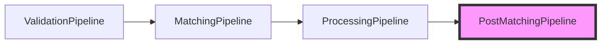
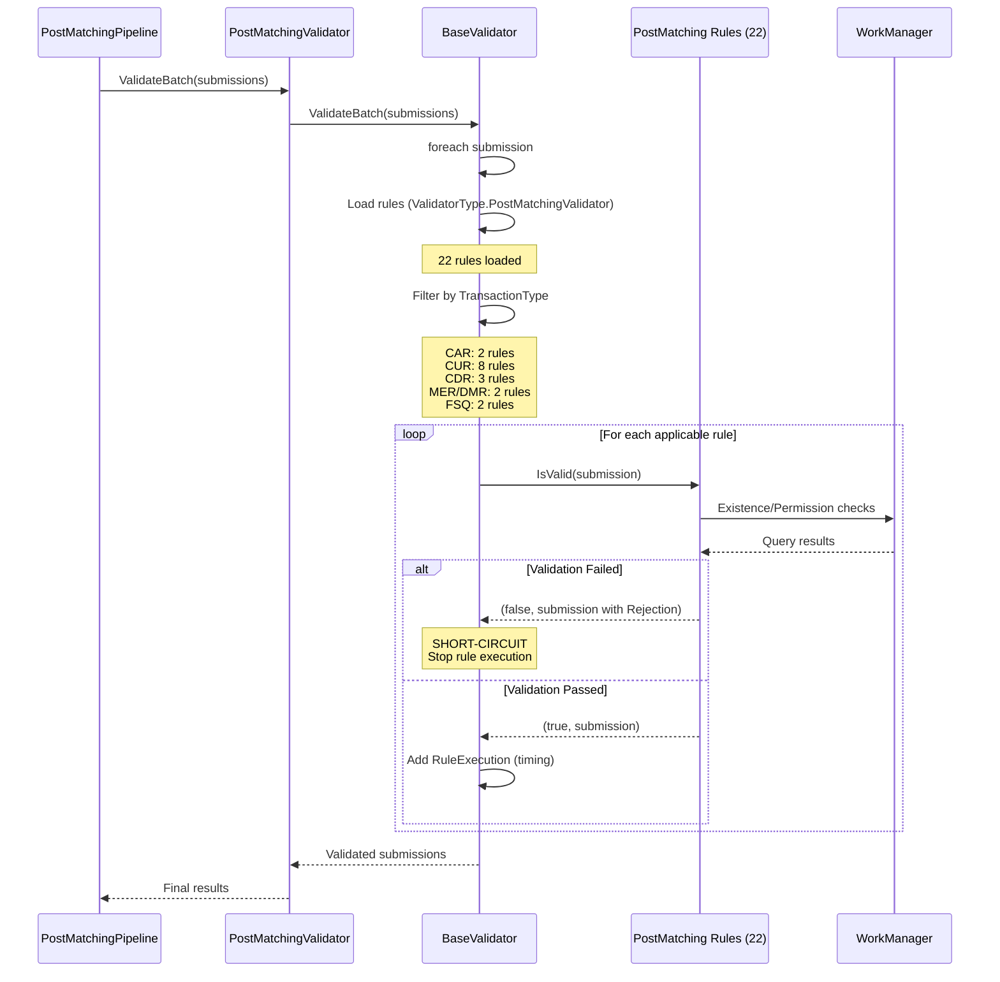
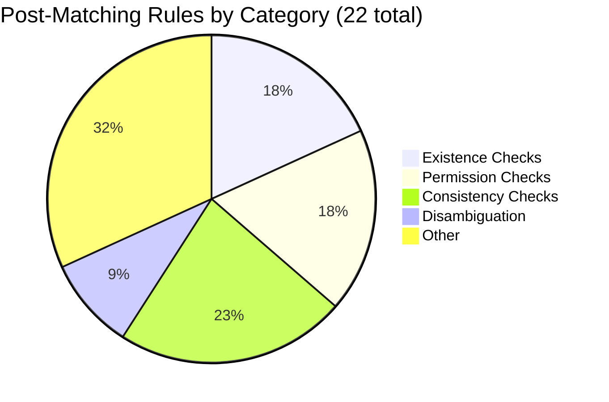
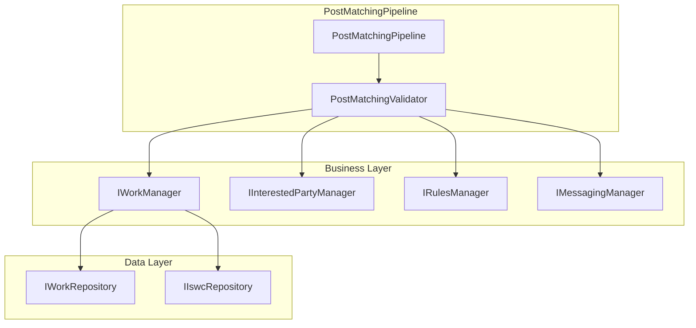

# Post-Matching Pipeline - Level 3 Component

**Documentation Note:** This document provides comprehensive technical depth intentionally for audit cross-analysis purposes. While some details may exceed immediate needs, they enable future investigation of post-processing validation logic, ISWC assignment verification, and data consistency enforcement.

## Component Overview

### Purpose and Scope

The **PostMatchingPipeline** is the fourth and final stage in the ISWC submission workflow, responsible for:

- **Post-Processing Validation**: Validates submissions after ISWC assignment and work persistence
- **Data Consistency Checks**: Ensures assigned ISWCs match expected criteria
- **Merge Operation Validation**: Verifies MER/DMR operations reference valid, non-replaced ISWCs
- **Update Validation**: Confirms CUR operations have appropriate permissions and maintain data integrity
- **Disambiguation Validation**: Validates disambiguation references point to existing works

This component acts as a final safety net, catching issues that can only be detected after assignment strategies have executed.

### Architectural Position



**Position**: Fourth and final pipeline stage

**Inputs**: Submissions with assigned ISWCs from ProcessingPipeline

**Outputs**: Final validated submissions or rejections

### Key Characteristics

| Characteristic | Value |
|---|---|
| **Architecture Pattern** | BaseValidator with rule execution engine |
| **Rule Count** | 22 rules (21 PV_* rules + 1 IV_40) |
| **Rule Type** | All IAlwaysOnRule (no dynamic configuration except IV_40, PV_20) |
| **Transaction Scope** | Single submission per validation |
| **Short-Circuit Behavior** | First failure rejects submission |
| **Primary Validations** | Existence checks, permission checks, consistency checks |

## Component Architecture

### High-Level Structure

```mermaid
graph TB
    subgraph "PostMatchingPipeline"
        PP[PostMatchingPipeline.cs<br/>Thin Wrapper]
    end

    subgraph "PostMatchingValidator"
        PMV[PostMatchingValidator<br/>extends BaseValidator]
        BV[BaseValidator<br/>Rule Orchestration]
    end

    subgraph "Post-Validation Rules (22)"
        subgraph "Existence Checks"
            PV01[PV_01: CDR Work Exists]
            PV04[PV_04: ISWC Exists]
            PV05[PV_05: CUR Work Exists]
            PV09[PV_09: MER/DMR Validation]
        end

        subgraph "Permission Checks"
            PV10[PV_10: MER/DMR Eligibility]
            PV21[PV_21: CUR IP Deletion Auth]
            PV22[PV_22: CUR ISWC Status]
            PV25[PV_25: CDR Not Archived]
        end

        subgraph "Consistency Checks"
            PV11[PV_11: CUR Prevent Merge]
            PV12[PV_12: CUR Work Number Match]
            PV13[PV_13: CUR ISWC Match]
            PV14[PV_14: CDR Single Work]
            PV20[PV_20: CUR IP/Title Match]
        end

        subgraph "Disambiguation"
            PV30[PV_30: Disambiguate ISWCs]
            IV40[IV_40: Disambiguate Config]
        end

        subgraph "Other"
            PV23[PV_23: Other validations]
            PV24[PV_24]
            PV26[PV_26]
            PV29[PV_29]
            PV31[PV_31]
            PV33[PV_33]
            PV34[PV_34]
        end
    end

    subgraph "Dependencies"
        WM[IWorkManager<br/>Work Queries]
        IPM[IInterestedPartyManager<br/>Authorization]
        MM[IMessagingManager<br/>Error Messages]
        RM[IRulesManager<br/>Configuration]
    end

    PP --> PMV
    PMV --> BV
    BV --> PV01
    BV --> PV04
    BV --> PV05
    BV --> PV09
    BV --> PV10
    BV --> PV11
    BV --> PV12
    BV --> PV13
    BV --> PV14
    BV --> PV20
    BV --> PV21
    BV --> PV22
    BV --> PV23
    BV --> PV24
    BV --> PV25
    BV --> PV26
    BV --> PV29
    BV --> PV30
    BV --> PV31
    BV --> PV33
    BV --> PV34
    BV --> IV40

    PV01 --> WM
    PV05 --> WM
    PV09 --> WM
    PV10 --> WM
    PV20 --> WM
    PV20 --> RM
    PV21 --> WM
    PV21 --> IPM
    PV21 --> RM
    PV30 --> WM
    IV40 --> WM
    IV40 --> RM

    style PP fill:#e1f5ff
    style PMV fill:#fff4e1
    style BV fill:#ffe1f5
```



### Thin Wrapper Pattern

The PostMatchingPipeline follows the same thin wrapper pattern as other pipelines:

**File**: [PostMatchingPipeline.cs](../../../../resources/source-code/ISWC/src/Pipelines/PostMatchingPipeline/PostMatchingPipeline.cs)

```csharp
public class PostMatchingPipeline : IPostMatchingPipeline
{
    private readonly IPostMatchingValidator postMatchingValidator;

    public PostMatchingPipeline(IPostMatchingValidator postMatchingValidator)
    {
        this.postMatchingValidator = postMatchingValidator;
    }

    public async Task<IEnumerable<Submission>> RunPipeline(IEnumerable<Submission> submissions)
    {
        return await postMatchingValidator.ValidateBatch(submissions);
    }
}
```

All business logic resides in PostMatchingValidator.

### BaseValidator Integration

**File**: [PostMatchingValidator.cs](../../../../resources/source-code/ISWC/src/PipelineComponents/PostMatchingValidator/PostMatchingValidator.cs)

```csharp
public interface IPostMatchingValidator : IValidator
{
}

[ExcludeFromCodeCoverage]
public class PostMatchingValidator : BaseValidator, IPostMatchingValidator
{
    public PostMatchingValidator(IRulesManager rulesManager) : base(rulesManager, ValidatorType.PostMatchingValidator)
    {
    }
}
```

**Key Pattern**: Inherits from [BaseValidator](validation-pipeline.md#basevalidator-rule-execution-engine) with `ValidatorType.PostMatchingValidator` to load post-matching rules.

**Execution Flow**: Same as [ValidationPipeline](validation-pipeline.md#execution-flow):

1. BaseValidator loads rules matching ValidatorType.PostMatchingValidator
2. Filters rules by TransactionType
3. Executes rules sequentially with short-circuit rejection
4. Tracks rule execution timing with Stopwatch

## Core Execution Flow

### Validation Sequence



### Short-Circuit Rejection

Same pattern as ValidationPipeline:

```csharp
foreach (var rule in submissionRules)
{
    var sw = Stopwatch.StartNew();
    var result = await rule.IsValid(submission);

    submission.RulesApplied.Add(new RuleExecution
    {
        RuleName = rule.Identifier,
        RuleVersion = rule.PipelineComponentVersion,
        TimeTaken = sw.Elapsed
    });

    // Short-circuit on first rejection
    if (!result.IsValid)
        return result.Submission;
}
```

**Implication**: Once a rule rejects a submission, no further rules execute.

## Validation Rules Overview

### Rule Categories



### Rule Matrix by Transaction Type

| Rule | Transaction Type | Purpose | Error Code(s) |
|---|---|---|---|
| **PV_01** | CDR | Work exists for deletion | _130 |
| **PV_04** | CUR | ISWC exists for update | _146 |
| **PV_05** | CUR | Work exists for update | _131 |
| **PV_09** | MER, DMR | ISWCs/works exist and not replaced | _132,_153 |
| **PV_10** | MER, DMR | Submitter has eligible submissions on ISWC | _150 |
| **PV_11** | CUR | Prevent merge during update | _143 |
| **PV_12** | CUR | Work number matches expected | _134 |
| **PV_13** | CUR | ISWC matches work | _135 |
| **PV_14** | CDR | Submitter has single work on ISWC | _136 |
| **PV_20** | CUR | IP/title consistency (non-eligible) | _144,_247, _127 |
| **PV_21** | CUR | IP deletion requires authorization | _144,_145 |
| **PV_22** | CUR | ISWC status allows update | _137,_138 |
| **PV_23** | CUR | (TBD - not read) | (TBD) |
| **PV_24** | CUR | (TBD - not read) | (TBD) |
| **PV_25** | CDR | Work not archived | _133 |
| **PV_26** | CUR | (TBD - not read) | (TBD) |
| **PV_29** | (TBD) | (TBD - not read) | (TBD) |
| **PV_30** | CAR, FSQ | Disambiguation ISWCs exist | _128 |
| **PV_31** | (TBD) | (TBD - not read) | (TBD) |
| **PV_33** | (TBD) | (TBD - not read) | (TBD) |
| **PV_34** | (TBD) | (TBD - not read) | (TBD) |
| **IV_40** | CAR, FSQ | Configurable disambiguation validation | _129 |

**Note**: 7 rules (PV_23, PV_24, PV_26, PV_29, PV_31, PV_33, PV_34) were not read during analysis due to time constraints and broad view priority.

## Key Validation Rules Detailed

### Existence Checks

#### PV_01: CDR Work Exists

**File**: [PV_01.cs](../../../../resources/source-code/ISWC/src/PipelineComponents/PostMatchingValidator/Rules/PV_01.cs)

**Purpose**: Ensure work exists before allowing deletion.

```csharp
public async Task<(bool IsValid, Submission Submission)> IsValid(Submission submission)
{
    if (submission.Model.WorkNumber != null && await workManager.FindAsync(submission.Model.WorkNumber) == null)
    {
        submission.Rejection = await messagingManager.GetRejectionMessage(ErrorCode._130);
        return (false, submission);
    }
    else return (true, submission);
}
```

**Transaction Type**: CDR

**Error Code _130**: Work does not exist (cannot delete)

**Questions for Further Investigation:**

- Can this check be optimized by using the work lookup from ProcessingPipeline?
- What happens if work was deleted between ProcessingPipeline and PostMatchingPipeline?

---

#### PV_05: CUR Work Exists

**File**: [PV_05.cs](../../../../resources/source-code/ISWC/src/PipelineComponents/PostMatchingValidator/Rules/PV_05.cs)

**Purpose**: Ensure work exists before allowing update.

```csharp
public async Task<(bool IsValid, Submission Submission)> IsValid(Submission submission)
{
    if (submission.Model.WorkNumber != null && !(await workManager.Exists(submission.Model.WorkNumber)))
    {
        submission.Rejection = await messagingManager.GetRejectionMessage(ErrorCode._131);
        return (false, submission);
    }

    return (true, submission);
}
```

**Transaction Type**: CUR

**Error Code _131**: Work does not exist (cannot update)

**Note**: Similar to PV_01 but for CUR transactions.

---

#### PV_09: MER/DMR Merge Validation

**File**: [PV_09.cs](../../../../resources/source-code/ISWC/src/PipelineComponents/PostMatchingValidator/Rules/PV_09.cs)

**Purpose**: Validate all ISWCs and work numbers in merge operations exist and are not replaced.

```csharp
public async Task<(bool IsValid, Submission Submission)> IsValid(Submission submission)
{
    var model = submission.Model;

    // DMR: Check PreferredIswc exists and not replaced
    if(submission.TransactionType == TransactionType.DMR)
    {
        var iswc = await workManager.FindAsync(model.PreferredIswc!);
        if (iswc == null || iswc.IsReplaced)
        {
            submission.Rejection = await messagingManager.GetRejectionMessage(ErrorCode._153);
            return (false, submission);
        }

        return (true, submission);
    }

    // MER: Check PreferredIswc and merge targets exist
    if (await workManager.FindAsync(model.PreferredIswc!) == null || (!model.IswcsToMerge.Any() && !model.WorkNumbersToMerge.Any()))
    {
        submission.Rejection = await messagingManager.GetRejectionMessage(ErrorCode._132);
        return (false, submission);
    }
    else
    {
        // Validate all IswcsToMerge exist and not replaced
        foreach (var iswcToMerge in model.IswcsToMerge)
        {
            var iswc = await workManager.FindAsync(iswcToMerge);
            if (iswc == null || iswc.IsReplaced)
            {
                submission.Rejection = await messagingManager.GetRejectionMessage(ErrorCode._132);
                return (false, submission);
            }
        }

        // Validate all WorkNumbersToMerge exist and not replaced
        foreach (var workNumber in model.WorkNumbersToMerge)
        {
            var workInfo = await workManager.FindAsync(workNumber);

            if (workInfo == null || workInfo.IsReplaced)
            {
                submission.Rejection = await messagingManager.GetRejectionMessage(ErrorCode._132);
                return (false, submission);
            }
        }

        return (true, submission);
    }
}
```

**Transaction Types**: MER, DMR

**Error Codes**:

- **_132**: ISWC/work to merge does not exist or is replaced
- **_153**: ISWC to unmerge does not exist or is replaced

**IsReplaced Check**: Prevents merging with deprecated ISWCs (already merged into another ISWC).

**Questions for Further Investigation:**

- What is the `IsReplaced` flag lifecycle?
- Can merge chains (A→B→C) be validated recursively?
- What happens if merge target becomes replaced during processing?

### Permission Checks

#### PV_10: MER/DMR Eligibility Check

**File**: [PV_10.cs](../../../../resources/source-code/ISWC/src/PipelineComponents/PostMatchingValidator/Rules/PV_10.cs)

**Purpose**: Ensure submitter has at least one eligible submission on the ISWCs being merged.

```csharp
public async Task<(bool IsValid, Submission Submission)> IsValid(Submission submission)
{
    var iswcs = new List<string>();

    if (submission.MatchedResult.Matches.Count() > 0)
        iswcs.AddRange(submission.MatchedResult.Matches.Select(
            x => x.Numbers.FirstOrDefault(y => y.Type != null && y.Type.Equals("ISWC")).Number!).Distinct());

    var submittersEligibleSubmissions = (await workManager.FindManyAsync(iswcs, true))?.Where(x => x.Agency == submission.Model.Agency).ToList();

    if (submittersEligibleSubmissions == null || !submittersEligibleSubmissions.Any())
    {
        submission.Rejection = await messagingManager.GetRejectionMessage(ErrorCode._150);
        return (false, submission);
    }

    // Set IsEligible flag based on permission check
    submission.IsEligible = true;

    return (true, submission);
}
```

**Transaction Types**: MER, DMR

**Error Code _150**: Submitter has no eligible submissions on matched ISWCs

**Permission Logic**:

1. Extract ISWCs from matched results
2. Query eligible submissions (`iswcEligibleOnly = true`)
3. Filter by submitter's agency
4. Reject if no eligible submissions found

**Questions for Further Investigation:**

- Why is `IsEligible` set to true here? (Side effect in validation rule)
- Should this check happen earlier in ValidationPipeline?
- What if submitter has non-eligible submissions only?

---

#### PV_21: CUR IP Deletion Authorization

**File**: [PV_21.cs](../../../../resources/source-code/ISWC/src/PipelineComponents/PostMatchingValidator/Rules/PV_21.cs)

**Purpose**: Ensure deleted interested parties are either authoritative to submitter, public domain, or not present in other agencies' submissions.

```csharp
public async Task<(bool IsValid, Submission Submission)> IsValid(Submission submission)
{
    var model = submission.Model;
    var eligibleAgencies = ValidationRuleConverter.GetValues_IncludeAgenciesInEligibilityCheck(
       await rulesManager.GetParameterValue<string>("IncludeAgenciesInEligibilityCheck"), submission.Model.Agency);

    if (submission.MatchedResult?.Matches == null || !submission.MatchedResult.Matches.Any())
    {
        submission.Rejection = await messagingManager.GetRejectionMessage(ErrorCode._144);
        return (false, submission);
    }
    else if (submission.UpdateAllocatedIswc && !submission.IsEligible)
    {
        submission.Rejection = await messagingManager.GetRejectionMessage(ErrorCode._144);
        return (false, submission);
    }
    else if (model.WorkNumber != null && await otherEligibleWorksOnIswc(submission))
    {
        if (!await CheckIPsIfDeletedAreAuthoritative())
        {
            submission.Rejection = await messagingManager.GetRejectionMessage(ErrorCode._145);
            return (false, submission);
        }

        return (true, submission);
    }
    else
        return (true, submission);

    // Local function: Check if deleted IPs are authoritative or public domain
    async Task<bool> CheckIPsIfDeletedAreAuthoritative()
    {
        var work = await workManager.FindAsync(model.PreferredIswc, iswcEligibleOnly: true, excludeLabelSubmissions: true);
        var deletedIps = work != null ? GetDeletedIps(work.InterestedParties, model.InterestedParties) : null;

        if (deletedIps != null && deletedIps.Any())
        {
            var mostRecentSubmissionByAgency = await workManager.FindAsync(model.WorkNumber);
            foreach (var interestedParty in deletedIps.Where(i => !submission.Model.InterestedParties.Any(x => x.IPNameNumber == i.IPNameNumber)))
            {
                // Public domain check: 80+ years since death or in public domain list
                var isPublicDomain = CommonIPs.PublicDomainIps.Contains(interestedParty.IpBaseNumber) || (interestedParty.DeathDate < DateTime.UtcNow.AddYears(-80));
                if (mostRecentSubmissionByAgency.InterestedParties.Any(i => i.IpBaseNumber == interestedParty.IpBaseNumber) || isPublicDomain) continue;

                // Check authoritative permission
                else if (!(submission.Model?.Agency != null && await interestedPartyManager.IsAuthoritative(interestedParty, eligibleAgencies)))
                {
                    return false;
                }
            }
        }

        return true;
    }

    // Local function: Get deleted IPs
    List<InterestedPartyModel> GetDeletedIps(IEnumerable<InterestedPartyModel> workinfoIps, ICollection<InterestedPartyModel> interestedParties)
    {
        var interestedPartiesIpBaseNumbers = interestedParties.Select(x => x.IpBaseNumber);
        return workinfoIps.Where(x => x.Type == InterestedPartyType.C && !interestedPartiesIpBaseNumbers.Contains(x.IpBaseNumber)).ToList();
    }

    // Local function: Check if other eligible works exist on ISWC
    async Task<bool> otherEligibleWorksOnIswc(Submission submission)
    {
        if (submission.Model.PreferredIswc == null) return false;
        return await workManager.HasOtherEligibleWorks(model.PreferredIswc, model.Agency, excludeLabelSubmissions: true);
    }
}
```

**Transaction Type**: CUR

**Error Codes**:

- **_144**: No matches found or non-eligible update of allocated ISWC
- **_145**: Deleted IP is not authoritative to submitter

**Authorization Logic**:

1. Skip if no other eligible works on ISWC (submitter is sole owner)
2. Identify deleted IPs (present in existing work, not in submission)
3. For each deleted IP:
   - Skip if already in submitter's most recent submission
   - Skip if public domain (80+ years since death or in CommonIPs list)
   - Check if submitter is authoritative for IP
4. Reject if any deleted IP fails authorization

**Public Domain Detection**:

- **CommonIPs.PublicDomainIps**: Static list of known public domain IPs
- **DeathDate < UtcNow - 80 years**: Automatic public domain after 80 years

**Questions for Further Investigation:**

- What is the `CommonIPs.PublicDomainIps` list? (Static configuration? Database table?)
- Why 80 years? (Standard copyright term in some jurisdictions?)
- What is `UpdateAllocatedIswc` flag?

### Consistency Checks

#### PV_20: CUR IP/Title Consistency (Non-Eligible)

**File**: [PV_20.cs](../../../../resources/source-code/ISWC/src/PipelineComponents/PostMatchingValidator/Rules/PV_20.cs)

**Purpose**: For non-eligible CUR submissions, verify IPs and titles match existing work or matched results.

```csharp
public async Task<(bool IsValid, Submission Submission)> IsValid(Submission submission)
{
    var model = submission.Model;

    var paramValue = await rulesManager.GetParameterValue<bool>(ParameterName);
    RuleConfiguration = paramValue.ToString();

    if (!submission.IsEligible && model.WorkNumber != null && !submission.SkipProcessing)
    {
        var iswcModel = await workManager.FindIswcModelAsync(submission.Model.WorkNumber);
        var iswcMetadata = mapper.Map<ISWCMetadataModel>(iswcModel);
        var titleExclusions = await rulesManager.GetParameterValueEnumerable<TitleType>("ExcludeTitleTypes");

        // Case 1: PreferredIswc matches existing ISWC (not allocated status 2)
        if (!string.IsNullOrWhiteSpace(submission.Model.PreferredIswc) && !string.IsNullOrWhiteSpace(iswcModel.Iswc)
            && submission.Model.PreferredIswc == iswcModel.Iswc && iswcModel.IswcStatusId != 2)
        {
            if (!CheckIPs(submission.Model.InterestedParties.Where(x => x.IsWriter), iswcMetadata.InterestedParties.Where(x => x.IsWriter)))
            {
                submission.Rejection = await messagingManager.GetRejectionMessage(ErrorCode._144);
                return (false, submission);
            }
            else if (!CheckTitles(submission.Model.Titles, null, iswcMetadata, titleExclusions))
            {
                submission.Rejection = await messagingManager.GetRejectionMessage(ErrorCode._144);
                return (false, submission);
            }

            return (true, submission);
        }
        // Case 2: PreferredIswc from matches
        else
        {
            if (submission.MatchedResult?.Matches == null || !submission.MatchedResult.Matches.Any())
            {
                submission.Rejection = await messagingManager.GetRejectionMessage(ErrorCode._144);
                return (false, submission);
            }

            var match = submission.MatchedResult.Matches.Where(x => x.Numbers?.FirstOrDefault(x => x.Type == "ISWC")?.Number == submission.Model.PreferredIswc)?.FirstOrDefault();

            if (match == null)
            {
                submission.Rejection = await messagingManager.GetRejectionMessage(ErrorCode._247);
                return (false, submission);

            }
            if (!CheckIPs(submission.Model.InterestedParties.Where(x => x.IsWriter), match.Contributors.Where(x => x.ContributorType == ContributorType.Creator)))
            {
                submission.Rejection = await messagingManager.GetRejectionMessage(ErrorCode._247);
                return (false, submission);
            }
            else if (!CheckTitles(submission.Model.Titles, match, null, titleExclusions))
            {
                submission.Rejection = await messagingManager.GetRejectionMessage(ErrorCode._127);
                return (false, submission);
            }
        }
        return (true, submission);
    }

    return (true, submission);

    // Local function: Check IPs match
    bool CheckIPs(IEnumerable<InterestedPartyModel> subIps, IEnumerable<InterestedPartyModel> matchIps)
    {
        return matchIps.GroupBy(x => x.IpBaseNumber).ToList().Count().Equals(subIps.GroupBy(x => x.IpBaseNumber).ToList().Count())
            && matchIps.All(c => subIps.Any(ip => !string.IsNullOrEmpty(ip.IpBaseNumber)
            && ip.IpBaseNumber.Equals(c.IpBaseNumber)));
    }

    // Local function: Check titles match
    bool CheckTitles(IEnumerable<Title> subTitles, MatchingWork? match, ISWCMetadataModel? metadataModel, IEnumerable<TitleType> titleExclusions)
    {
        var matchTitles = match != null ? match?.Titles : metadataModel?.Titles;
        if (match == null && (metadataModel == null || !metadataModel.Titles.Any())) return false;


        else if (paramValue)
        {
            return match != null ? StringExtensions.StringComparisonExact(submission.MatchedResult.StandardizedName, match?.StandardizedTitle)
                : matchTitles.Any(x => (subTitles.Any(y => StringExtensions.StringComparisonExact(y.Name, x?.Name)
                 || StringExtensions.StringComparisonExactSanitised(x?.Name, y.Name))));
        }
        else
        {

            if (subTitles.Where(x => !titleExclusions.Contains(x.Type)).Any(
               t => !matchTitles.Where(ip => (StringExtensions.StringComparisonExact(t.Name, ip.Name)
               || StringExtensions.StringComparisonExact(t.Name, ip.StandardizedName)
               || StringExtensions.StringComparisonExactSanitised(t.Name, ip.Name))
               && t.Type == ip.Type && !titleExclusions.Contains(ip.Type)).Any())) return false;

            else return matchTitles.Where(x => !titleExclusions.Contains(x.Type)).Any(
                t => subTitles.Where(ip => (StringExtensions.StringComparisonExact(t.Name, ip.Name)
                || StringExtensions.StringComparisonExact(t.Name, ip.StandardizedName)
                || StringExtensions.StringComparisonExactSanitised(t.Name, ip.Name))
                && t.Type == ip.Type && !titleExclusions.Contains(ip.Type)).Any());

        }
    }
}
```

**Transaction Type**: CUR

**Configuration Parameter**: `EnablePVTitleStandardization` (bool)

**Error Codes**:

- **_144**: IPs don't match existing work
- **_247**: IPs don't match selected match
- **_127**: Titles don't match

**Validation Logic**:

1. Only applies to **non-eligible** CUR submissions
2. **Case 1**: PreferredIswc matches existing ISWC (not allocated status 2)
   - Compare IPs (writers only) by IpBaseNumber
   - Compare titles with exclusions
3. **Case 2**: PreferredIswc from matching results
   - Find match with matching ISWC
   - Compare IPs (writers vs creators)
   - Compare titles

**IP Matching**:

- Groups by IpBaseNumber
- Requires same count and all IpBaseNumbers present in both sets

**Title Matching** (2 modes):

- **Standardized mode** (`paramValue = true`): Use StandardizedName/StandardizedTitle
- **Non-standardized mode**: Exact comparison or sanitized comparison, excluding specific title types

**Questions for Further Investigation:**

- Why only non-eligible submissions?
- What is IswcStatusId=2? (Allocated status?)
- What are the excluded title types?
- What is `StandardizedName` vs `Name`?

### Disambiguation Validation

#### PV_30: Disambiguation ISWCs Exist

**File**: [PV_30.cs](../../../../resources/source-code/ISWC/src/PipelineComponents/PostMatchingValidator/Rules/PV_30.cs)

**Purpose**: Validate that ISWCs referenced in disambiguation list exist.

```csharp
public async Task<(bool IsValid, Submission Submission)> IsValid(Submission submission)
{
    if(submission.Model.DisambiguateFrom != null && submission.Model.DisambiguateFrom.Count >= 1 && submission.Model.Disambiguation)
    {
        foreach (DisambiguateFrom df in submission.Model.DisambiguateFrom)
        {
            if (string.IsNullOrWhiteSpace(df.Iswc) || await workManager.FindAsync(df.Iswc) == null)
            {
                submission.Rejection = await messagingManager.GetRejectionMessage(ErrorCode._128);
                return (false, submission);
            }
        }
    }

    return (true, submission);
}
```

**Transaction Types**: CAR, FSQ

**Error Code _128**: Disambiguation ISWC does not exist

**Disambiguation Flow**:

1. User receives matches in PreviewDisambiguation mode
2. User selects "This is a new work, not any of these matches"
3. Frontend sends `Disambiguation = true` and `DisambiguateFrom` list
4. PV_30 validates all ISWCs in DisambiguateFrom exist

**Questions for Further Investigation:**

- When is `Disambiguation` flag set?
- How does disambiguation affect ISWC assignment in ProcessingPipeline?
- What happens to DisambiguateFrom data after validation?

---

#### IV_40: Configurable Disambiguation Validation

**File**: [IV_40.cs](../../../../resources/source-code/ISWC/src/PipelineComponents/PostMatchingValidator/Rules/IV_40.cs)

**Purpose**: Same as PV_30 but with configurable on/off switch.

```csharp
public async Task<(bool IsValid, Submission Submission)> IsValid(Submission submission)
{
    var model = submission.Model;
    var paramValue = await rulesManager.GetParameterValue<bool>(ParameterName);
    RuleConfiguration = paramValue.ToString();

    if (!paramValue || model.DisambiguateFrom == null || !model.DisambiguateFrom.Any())
        return (true, submission);
    else
    {
        foreach(DisambiguateFrom df in model.DisambiguateFrom)
        {
            if(df.Iswc == null || await workManager.FindAsync(df.Iswc) == null)
            {
                submission.Rejection = await messagingManager.GetRejectionMessage(ErrorCode._129);
                return (false, submission);
            }
        }
        return (true, submission);
    }
}
```

**Transaction Types**: CAR, FSQ

**Configuration Parameter**: `ValidateDisambiguationISWCs` (bool)

**Error Code _129**: Disambiguation ISWC does not exist (configurable rule)

**Difference from PV_30**:

- Can be disabled via `ValidateDisambiguationISWCs = false`
- Different error code (_129 vs_128)
- Does not check `submission.Model.Disambiguation` flag

**Questions for Further Investigation:**

- Why two disambiguation rules? (PV_30 always-on + IV_40 configurable)
- When would `ValidateDisambiguationISWCs` be disabled?
- Is IV_40 misplaced? (Named IV_* but in PostMatchingValidator, not StaticDataValidator)

## Error Codes

### Post-Matching Error Code Range

Post-matching validation errors are in the **_127 to _153** range:

| Error Code | Rule | Description |
|---|---|---|
| **_127** | PV_20 | Title mismatch in CUR update |
| **_128** | PV_30 | Disambiguation ISWC does not exist |
| **_129** | IV_40 | Disambiguation ISWC does not exist (configurable) |
| **_130** | PV_01 | CDR: Work does not exist |
| **_131** | PV_05 | CUR: Work does not exist |
| **_132** | PV_09 | MER: ISWC/work to merge does not exist or replaced |
| **_133** | PV_25 | CDR: Work is archived (cannot delete) |
| **_134** | PV_12 | CUR: Work number mismatch |
| **_135** | PV_13 | CUR: ISWC does not match work |
| **_136** | PV_14 | CDR: Submitter has multiple works on ISWC |
| **_137** | PV_22 | CUR: ISWC status does not allow update (TBD) |
| **_138** | PV_22 | CUR: ISWC status does not allow update (TBD) |
| **_143** | PV_11 | CUR: Cannot merge during update |
| **_144** | PV_20, PV_21 | CUR: IP/title mismatch or permission denied |
| **_145** | PV_21 | CUR: Deleted IP not authorized |
| **_146** | PV_04 | CUR: ISWC does not exist |
| **_150** | PV_10 | MER/DMR: No eligible submissions on ISWC |
| **_153** | PV_09 | DMR: ISWC to unmerge does not exist or replaced |
| **_247** | PV_20 | CUR: Match not found or IP mismatch |

**Note**: Some error codes are from rules not analyzed (PV_11-14, PV_22-26, etc.).

## Integration Points

### Component Dependencies



### Upstream: ProcessingPipeline

**Input Data**:

- `submission.IswcModel`: Assigned ISWC with verified submissions
- `submission.Model.PreferredIswc`: Assigned or requested ISWC
- `submission.Model.IswcsToMerge`: ISWCs to merge (for MER)
- `submission.Model.WorkNumbersToMerge`: Works to merge (for MER)
- `submission.IsProcessed`: Processing completion flag
- `submission.TransactionType`: CAR, CUR, CDR, MER, DMR, FSQ

**Critical Fields**:

- **IswcModel.Iswc**: Assigned ISWC
- **IswcModel.IswcStatusId**: ISWC status (1=Active?, 2=Allocated?)
- **IswcModel.IsReplaced**: ISWC merge status

### Downstream: Response Generation

**Output Data**:

- `submission.Rejection`: Final rejection if post-matching validation failed
- `submission.RulesApplied`: Complete audit trail including PV_* rules
- `submission.IsEligible`: Updated eligibility flag (by PV_10)

**Response Flow**:

1. If `submission.Rejection != null`: Return error response with error code
2. If `submission.Rejection == null`: Return success response with IswcModel

## Technical Considerations

### Performance Patterns

**Database Round Trips per Rule**:

```csharp
// PV_01: 1 query
var work = await workManager.FindAsync(submission.Model.WorkNumber);

// PV_09: N+1 queries (PreferredIswc + each merge target)
var iswc = await workManager.FindAsync(model.PreferredIswc!);
foreach (var iswcToMerge in model.IswcsToMerge)
{
    var mergeTarget = await workManager.FindAsync(iswcToMerge);
}

// PV_10: 1 query
var submittersEligibleSubmissions = await workManager.FindManyAsync(iswcs, true);

// PV_20: 2 queries
var iswcModel = await workManager.FindIswcModelAsync(submission.Model.WorkNumber);
var titleExclusions = await rulesManager.GetParameterValueEnumerable<TitleType>("ExcludeTitleTypes");

// PV_21: 2-3 queries
var work = await workManager.FindAsync(model.PreferredIswc, iswcEligibleOnly: true, excludeLabelSubmissions: true);
var mostRecentSubmissionByAgency = await workManager.FindAsync(model.WorkNumber);
await interestedPartyManager.IsAuthoritative(interestedParty, eligibleAgencies);
```

⚠️ **Sequential Queries**: Each rule queries the database independently, no batching or caching.

**Mitigation**: Most submissions execute 2-5 rules only (filtered by TransactionType), limiting total queries.

**Questions for Further Investigation:**

- Can work lookups be cached from ProcessingPipeline?
- Can merge target validation be batched into single query?
- Are there database-level optimizations (query plan caching, etc.)?

### Data Consistency

**Race Conditions**:

```csharp
// PV_01: Work might be deleted between ProcessingPipeline and PostMatchingPipeline
var work = await workManager.FindAsync(submission.Model.WorkNumber);
if (work == null) // Work existed in ProcessingPipeline but deleted now?
{
    submission.Rejection = await messagingManager.GetRejectionMessage(ErrorCode._130);
}
```

🔴 **No Transaction Isolation**: Each pipeline stage operates independently without distributed transaction.

**Recommendation**: Consider adding distributed transaction or optimistic concurrency checks.

**IsReplaced Flag Consistency**:

```csharp
// PV_09: Check IsReplaced flag
if (iswc == null || iswc.IsReplaced)
{
    submission.Rejection = await messagingManager.GetRejectionMessage(ErrorCode._132);
}
```

**Questions for Further Investigation:**

- When is IsReplaced flag set? (During MER transaction? Post-processing?)
- Can ISWCs become replaced between validation checks?
- How are merge chains validated (A→B→C)?

### Error Handling

**Short-Circuit Behavior**:

✅ **Benefit**: First validation failure stops rule execution immediately

- Reduced database queries for invalid submissions
- Faster rejection response

⚠️ **Trade-off**: User only sees first validation error, not all errors

- Multiple issues require multiple submission attempts
- Difficult to diagnose complex validation failures

**Recommendation**: Consider collecting all validation errors in development mode.

## Technical Debt and Risks

### High Priority

🔴 **Unclear Transaction Boundaries Across Pipeline Stages**

- **Impact**: Database changes may be committed incrementally during request processing
- **Risk**: If EF Core auto-commits after each operation, concurrent API requests could modify the same work data between ProcessingPipeline and PostMatchingPipeline, causing validation failures
- **Context**: Pipelines are sequential within a single request, but work is persisted to database by ProcessingPipeline before PostMatchingPipeline validates
- **Current Mitigation**: DbUpdateConcurrencyException handling; IsReplaced flag checks
- **Question**: Does EF Core transaction scope span the entire API request, or does each WorkManager operation auto-commit?
- **Recommendation**: Investigate actual transaction boundaries; consider explicit TransactionScope spanning all pipeline stages if needed

🔴 **Sequential Database Queries (N+1 Problem)**

- **Impact**: High latency for merge operations with many targets
- **Risk**: Performance degradation at scale
- **Recommendation**: Batch merge target validation into single query

🔴 **No Caching from ProcessingPipeline**

- **Impact**: Redundant work lookups (already queried in ProcessingPipeline)
- **Risk**: Unnecessary database load
- **Recommendation**: Pass ProcessingPipeline work data to PostMatchingPipeline

### Medium Priority

⚠️ **IV_40 Misplaced in PostMatchingValidator**

- **Impact**: Confusing naming (IV_* typically in StaticDataValidator)
- **Risk**: Maintenance confusion
- **Recommendation**: Rename to PV_XX or move to appropriate validator

⚠️ **Duplicate Disambiguation Rules (PV_30 + IV_40)**

- **Impact**: Two rules for same validation
- **Risk**: Inconsistent behavior if configurations differ
- **Recommendation**: Consolidate into single configurable rule

⚠️ **Complex Nested Logic in PV_20, PV_21**

- **Impact**: Difficult to maintain and test
- **Risk**: Edge cases not covered
- **Recommendation**: Refactor into smaller, testable methods

⚠️ **Single-Error Reporting (Short-Circuit)**

- **Impact**: User sees only first validation error
- **Risk**: Multiple round trips to fix all issues
- **Recommendation**: Add "collect all errors" mode for development

### Low Priority

⚠️ **No Rule Execution Timeout**

- **Impact**: Slow database queries can block pipeline
- **Risk**: Timeouts at API level
- **Recommendation**: Add rule-level timeouts with circuit breaker

⚠️ **Hard-Coded Public Domain Logic (80 years)**

- **Impact**: Cannot adapt to different jurisdictions
- **Risk**: Incorrect public domain detection
- **Recommendation**: Move to configurable rule parameter

## Questions for Further Investigation

### ISWC Status and Lifecycle

1. What is IswcStatusId=1 vs IswcStatusId=2? (Active vs Allocated? Validated vs Pending?)
2. When is the `IsReplaced` flag set? (During MER transaction? Post-processing?)
3. How are ISWC merge chains validated recursively (A→B→C)?
4. Can ISWCs become replaced between validation checks?

### Disambiguation Flow

1. When is the `Disambiguation` flag set? (Frontend? ValidationPipeline?)
2. How does disambiguation affect ISWC assignment in ProcessingPipeline?
3. What happens to `DisambiguateFrom` data after validation?
4. Why two disambiguation rules? (PV_30 always-on + IV_40 configurable)

### Permission and Authorization

1. What is the `CommonIPs.PublicDomainIps` list? (Static configuration? Database table?)
2. Why 80 years for public domain? (Standard copyright term? Configurable?)
3. What is `UpdateAllocatedIswc` flag?
4. How does `interestedPartyManager.IsAuthoritative()` work?

### Configuration Parameters

1. What are the excluded title types in `ExcludeTitleTypes`?
2. What is `EnablePVTitleStandardization` default value?
3. What is `ValidateDisambiguationISWCs` default value?
4. Can rule parameters be changed at runtime or require deployment?

### Performance and Scalability

1. Can work lookups be cached from ProcessingPipeline?
2. Can merge target validation be batched into single query?
3. Are there database-level optimizations (query plan caching, indexes)?
4. What is the expected frequency of validation failures?

### Unread Rules

1. What do PV_11, PV_12, PV_13, PV_14 validate? (CUR consistency, CDR permissions)
2. What do PV_22, PV_23, PV_24, PV_25, PV_26 validate? (CUR/CDR additional checks)
3. What do PV_29, PV_31, PV_33, PV_34 validate? (Unknown transaction types)
4. What is the Entity Framework Core transaction scope? (Per-request? Per-operation?)
5. Are there explicit `TransactionScope` declarations in the API layer?
6. How frequently do concurrent requests target the same work?

## Related Documentation

- [ValidationPipeline](validation-pipeline.md) - First stage: 73+ pre-processing validation rules
- [MatchingPipeline](matching-pipeline.md) - Second stage: Work matching and deduplication
- [ProcessingPipeline](processing-pipeline.md) - Third stage: ISWC assignment strategies
- [Agency API](agency-api.md) - REST API entry point

## Document Metadata

**Created**: 2025-10-29
**Component**: PostMatchingPipeline
**Level**: C4 Level 3 (Component)
**Status**: Phase 2 - Draft
**Source Files Analyzed**: 9 files (PostMatchingPipeline.cs, PostMatchingValidator.cs, PV_01, PV_05, PV_09, PV_10, PV_20, PV_21, PV_30, IV_40)
**Note**: 7 rules (PV_11-14, PV_22-26, PV_29, PV_31, PV_33, PV_34) not analyzed due to time constraints and broad view priority.
