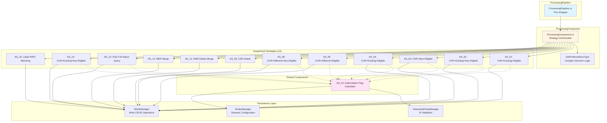
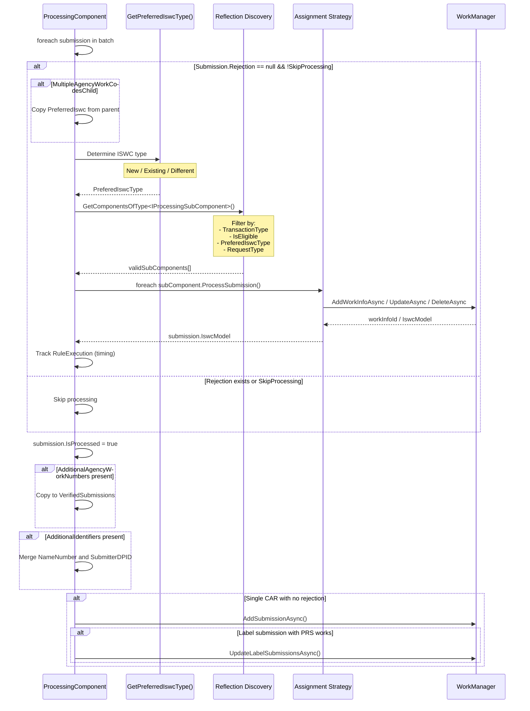
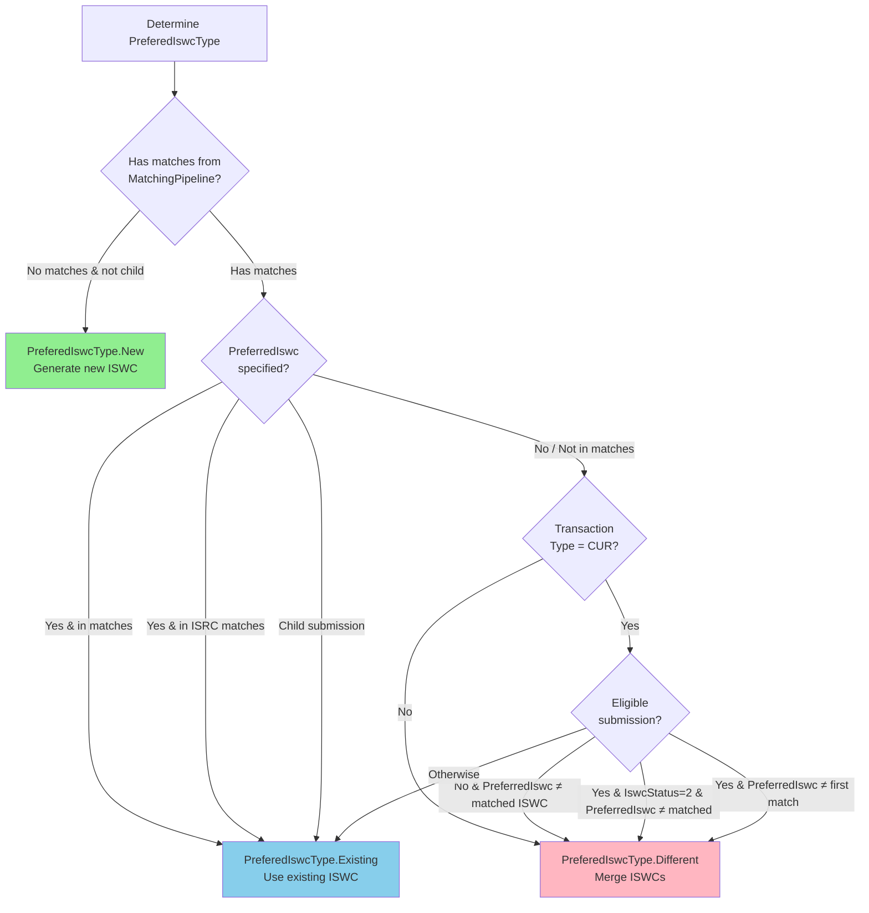
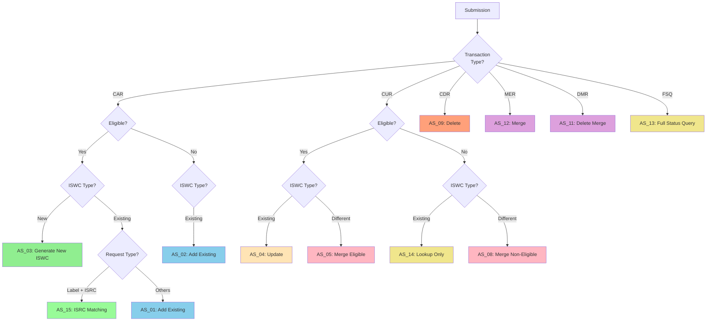
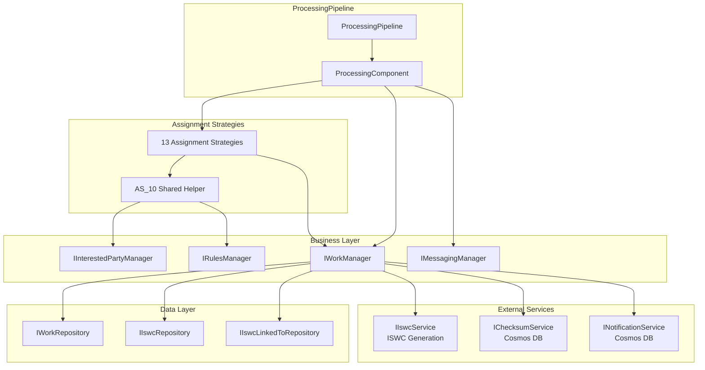

# Processing Pipeline - Level 3 Component

**Documentation Note:** This document provides comprehensive technical depth intentionally for audit cross-analysis purposes. While some details may exceed immediate needs, they enable future investigation of ISWC assignment strategies, database transaction patterns, and data consistency concerns.

## Component Overview

### Purpose and Scope

The **ProcessingPipeline** is the third stage in the ISWC submission workflow, responsible for:

- **ISWC Assignment Strategy Selection**: Determines whether to create new ISWCs, use existing ISWCs, or merge ISWCs based on matching results
- **Work Persistence**: Persists musical work data to SQL Server database via Entity Framework Core
- **ISWC Lifecycle Management**: Handles creation, updates, deletions, and merge operations
- **Authoritative Data Consolidation**: Recalculates authoritative flags for interested parties based on agency rules
- **Transaction Processing**: Executes database transactions with concurrency control and error handling

This component bridges the gap between matched works (from MatchingPipeline) and persisted ISWC assignments, implementing the core business logic for ISWC allocation.

### Architectural Position


**Position**: Third of four pipeline stages

**Inputs**: Validated submissions with matching results from MatchingPipeline

**Outputs**: Submissions with assigned ISWCs and persisted work data

### Key Characteristics

| Characteristic | Value |
|---|---|
| **Architecture Pattern** | Plugin-based with 13 assignment strategies |
| **Discovery Mechanism** | Reflection-based component loading |
| **Transaction Scope** | Single submission per transaction |
| **Concurrency Control** | DbUpdateConcurrencyException handling with _155 error |
| **Assignment Strategies** | 13 strategies covering CAR, CUR, CDR, MER, DMR, FSQ |
| **Preview Mode** | PreviewDisambiguation returns empty ISWCs for user review |
| **Shared Components** | AS_10 (authoritative flag calculation) |

## Component Architecture

### High-Level Structure



### Thin Wrapper Pattern

The ProcessingPipeline follows the same thin wrapper pattern as MatchingPipeline:

**File**: [ProcessingPipeline.cs](../../../../resources/source-code/ISWC/src/Pipelines/ProcessingPipeline/ProcessingPipeline.cs)

```csharp
public class ProcessingPipeline : IProcessingPipeline
{
    private readonly IProcessingComponent processingComponent;

    public ProcessingPipeline(IProcessingComponent processingComponent)
    {
        this.processingComponent = processingComponent;
    }

    public async Task<IEnumerable<Submission>> RunPipeline(IEnumerable<Submission> submissions)
    {
        return await processingComponent.ProcessBatch(submissions);
    }
}
```

All business logic resides in ProcessingComponent.

## Core Execution Flow

### Strategy Selection Process



### ProcessingComponent Core Logic

**File**: [ProcessingComponent.cs](../../../../resources/source-code/ISWC/src/PipelineComponents/ProcessingComponent/ProcessingComponent.cs)

```csharp
public async Task<IEnumerable<Submission>> ProcessBatch(IEnumerable<Submission> batch)
{
    var processedSubmissions = new List<Submission>();

    foreach (var submission in batch)
    {
        var sw = Stopwatch.StartNew();

        try
        {
            if (submission.Rejection == null && !submission.SkipProcessing)
            {
                // Handle parent-child work code relationships
                if(submission.MultipleAgencyWorkCodesChild && string.IsNullOrWhiteSpace(submission.Model.PreferredIswc))
                    submission.Model.PreferredIswc = batch.FirstOrDefault(x=> x.SubmissionId == submission.SubmissionParentId).Model.PreferredIswc;

                // Determine ISWC assignment strategy
                var preferedIswcType = GetPreferredIswcType(submission);

                // Discover and filter assignment strategies
                var validSubComponents = AppDomain.CurrentDomain.GetComponentsOfType<IProcessingSubComponent>(serviceProvider)
                    .Where(p =>
                    p.ValidTransactionTypes.Contains(submission.TransactionType)
                    && (!p.IsEligible.HasValue || p.IsEligible == submission.IsEligible)
                    && p.PreferedIswcType == preferedIswcType
                    && p.ValidRequestTypes.Contains(submission.RequestType))
                    .ToList();

                // Execute matching strategies
                foreach (var subComponent in validSubComponents)
                {
                    submission.IswcModel = await subComponent.ProcessSubmission(submission);

                    submission.RulesApplied.Add(new RuleExecution
                    {
                        RuleName = subComponent.Identifier,
                        RuleVersion = subComponent.PipelineComponentVersion,
                        TimeTaken = sw.Elapsed
                    });
                }
            }

            submission.IsProcessed = true;

            // Copy additional agency work numbers
            if (submission.Rejection == null && !submission.SkipProcessing && submission.Model.AdditionalAgencyWorkNumbers.Any())
            {
                var additionalAgencyWorkNumber = new List<AdditionalAgencyWorkNumber>();

                foreach (var x in submission.Model.AdditionalAgencyWorkNumbers)
                {
                    additionalAgencyWorkNumber.Add(new AdditionalAgencyWorkNumber { WorkNumber = x.WorkNumber });
                }

                submission.IswcModel.VerifiedSubmissions.Select(x => { x.AdditionalAgencyWorkNumbers = additionalAgencyWorkNumber; return x; }).ToList();
            }

            // Merge additional identifiers (NameNumber, SubmitterDPID)
            if (submission.Model.AdditionalIdentifiers != null && submission.Model.AdditionalIdentifiers.Any())
            {
                foreach (var verifiedSubmission in submission.IswcModel.VerifiedSubmissions.Where(x => x.AdditionalIdentifiers.Any()))
                {
                    foreach (var additionalIdentifier in submission.Model.AdditionalIdentifiers.Where(x => x.NameNumber != null))
                    {
                        if (verifiedSubmission.AdditionalIdentifiers.Where(x => x.WorkCode == additionalIdentifier.WorkCode).Any())
                        {
                            verifiedSubmission.AdditionalIdentifiers.FirstOrDefault(x => x.WorkCode == additionalIdentifier.WorkCode)
                                .NameNumber = additionalIdentifier?.NameNumber;
                        }
                    }
                    if (verifiedSubmission.AdditionalIdentifiers.Where(x => x.SubmitterDPID != null).Any())
                    {
                        foreach (var additionalIdentifier in submission.Model.AdditionalIdentifiers.Where(x => x.SubmitterDPID != null))
                        {
                            if (verifiedSubmission.AdditionalIdentifiers.Where(x => x.WorkCode == additionalIdentifier.WorkCode).Any())
                            {
                                verifiedSubmission.AdditionalIdentifiers.FirstOrDefault(x => x.WorkCode == additionalIdentifier.WorkCode)
                                    .SubmitterDPID = additionalIdentifier?.SubmitterDPID;
                            }
                        }
                    }
                }
            }
        }
        catch (DbUpdateConcurrencyException)
        {
            submission.IsProcessed = false;
            submission.Rejection = await messagingManager.GetRejectionMessage(ErrorCode._155);
        }
        catch (Exception ex)
        {
            logger.LogError(ex.ToString());
            submission.IsProcessed = false;
            submission.Rejection = new Rejection(ErrorCode._100, "Internal Server Error.");
        }
        finally
        {
            processedSubmissions.Add(submission);
        }
    }

    // Persist single CAR submissions immediately
    if (processedSubmissions.Count() == 1
        && processedSubmissions.FirstOrDefault(x => x.Rejection == null
        && x.IswcModel != null
        && x.IswcModel.VerifiedSubmissions.Any())?.TransactionType == TransactionType.CAR)
    {
        if (!(processedSubmissions.FirstOrDefault().MatchedResult.Matches.Any() && processedSubmissions.FirstOrDefault().Model.PreviewDisambiguation))
        {
            await workManager.AddSubmissionAsync(processedSubmissions.FirstOrDefault());

            var processedSubmission = processedSubmissions.FirstOrDefault();
            var verifiedSubmissions = processedSubmission.IswcModel.VerifiedSubmissions;

            // Update label submissions for PRS-prefixed works
            if (processedSubmission.RequestType != RequestType.Label
                && verifiedSubmissions.Count(y => y.WorkNumber.Number.StartsWith("PRS")) > 0
                && verifiedSubmissions.Count(y => !y.WorkNumber.Number.StartsWith("PRS")) == 1)
                await workManager.UpdateLabelSubmissionsAsync(processedSubmissions.FirstOrDefault());
        }
    }

    return processedSubmissions;
}
```

## ISWC Type Selection Logic

### GetPreferredIswcType() Decision Tree

The `GetPreferredIswcType()` method (lines 158-219 in ProcessingComponent.cs) determines which assignment strategy to use based on matching results and transaction context.



### PreferedIswcType Enum

**File**: [IProcessingSubComponent.cs](../../../../resources/source-code/ISWC/src/PipelineComponents/ProcessingComponent/IProcessingSubComponent.cs#L20-L25)

```csharp
public enum PreferedIswcType
{
    Different,  // Merge ISWCs (conflicting matches)
    Existing,   // Use existing ISWC from matches
    New         // Generate new ISWC (no matches)
}
```

### Key Decision Criteria

| Scenario | PreferedIswcType | Rationale |
|---|---|---|
| No matches found | **New** | Work doesn't exist in database, generate new ISWC |
| PreferredIswc in match results | **Existing** | Submitter correctly identified existing work |
| Child of multi-work submission | **Existing** | Inherit parent's ISWC decision |
| CUR with conflicting ISWC | **Different** | Update requires ISWC merge |
| IswcStatus=2 mismatch | **Different** | Allocated ISWC conflicts with request |

**Questions for Further Investigation:**

- What is IswcStatus=2? (Appears to be "Allocated" status based on context)
- Why does the logic check both MatchedResult and IsrcMatchedResult separately?
- What is the impact of MultipleAgencyWorkCodesChild on parent-child relationships?

## Assignment Strategies

### Strategy Matrix

The 13 assignment strategies handle different combinations of transaction types, eligibility, and ISWC types:

| Strategy | Transaction Type | Eligibility | PreferedIswcType | Request Type | Operation |
|---|---|---|---|---|---|
| **AS_01** | CAR | Eligible | Existing | All | Add work without new ISWC |
| **AS_02** | CAR | Non-Eligible | Existing | All | Add work without new ISWC |
| **AS_03** | CAR | Eligible | New | All | Generate new ISWC |
| **AS_04** | CUR | Eligible | Existing | All | Update existing work |
| **AS_05** | CUR | Eligible | Different | All | Merge ISWCs (eligible) |
| **AS_08** | CUR | Non-Eligible | Different | All | Merge ISWCs (non-eligible) |
| **AS_09** | CDR | Any | Existing | All | Delete work |
| **AS_11** | DMR | Eligible | Existing | All | Delete ISWC merge relationship |
| **AS_12** | MER | Eligible | Existing | All | Create ISWC merge relationship |
| **AS_13** | FSQ | Non-Eligible | Existing | All | Full status query (read-only) |
| **AS_14** | CUR | Non-Eligible | Existing | All | Read-only work lookup |
| **AS_15** | CAR/CUR | Any | Existing | Label | ISRC-based matching |

**Transaction Type Legend:**

- **CAR**: Create (add new work)
- **CUR**: Update (modify existing work)
- **CDR**: Delete (remove work)
- **MER**: Merge (link ISWCs)
- **DMR**: Delete Merge Relationship (unlink ISWCs)
- **FSQ**: Full Status Query (read-only consolidated view)

### Strategy Selection Flow



## Key Assignment Strategies Detailed

### AS_01: Add Work with Existing ISWC (Eligible)

**File**: [AS_01.cs](../../../../resources/source-code/ISWC/src/PipelineComponents/ProcessingComponent/Processing/AS_01.cs)

**Purpose**: Add a new work submission that matches an existing ISWC (eligible for ISWC assignment).

**Key Logic**:

```csharp
public async Task<IswcModel> ProcessSubmission(Submission submission)
{
    // Recalculate authoritative flags for interested parties
    submission = await as_10.RecaculateAuthoritativeFlag(submission);

    // Preview mode: Return empty ISWC for user disambiguation
    if (submission.Model.PreviewDisambiguation && submission.MatchedResult.Matches.Any())
    {
        var model = submission.Model;
        submission.IswcModel = new IswcModel
        {
            Agency = model.Agency,
            Iswc = "",
            VerifiedSubmissions = new List<VerifiedSubmissionModel>()
            {
                mapper.Map<VerifiedSubmissionModel>(model)
            }
        };

        foreach (var x in submission.IswcModel.VerifiedSubmissions)
        {
            x.IswcEligible = submission.IsEligible;
            x.Iswc = "";
            x.WorkInfoID = 0;
        }

        return submission.IswcModel;
    }

    // Add work without generating new ISWC
    var workinfoId = await workManager.AddWorkInfoAsync(submission, getNewIswc: false);
    submission.IswcModel = (await workManager.FindManyAsync(new long[] { workinfoId }, detailLevel: submission.DetailLevel)).FirstOrDefault();

    // Merge additional identifiers (NameNumber)
    if (submission.Model.AdditionalIdentifiers.Any())
    {
        foreach (var verifiedSubmission in submission.IswcModel.VerifiedSubmissions.Where(x => x.AdditionalIdentifiers.Any()))
        {
            foreach (var additionalIdentifier in submission.Model.AdditionalIdentifiers.Where(x => x.NameNumber != null))
            {
                var existingAdditionalIdentifier = verifiedSubmission.AdditionalIdentifiers.FirstOrDefault(x => x.WorkCode == additionalIdentifier.WorkCode);
                if(existingAdditionalIdentifier == null)
                {
                    continue;
                }
                else
                {
                    existingAdditionalIdentifier.NameNumber = additionalIdentifier.NameNumber;
                }
            }
        }
    }

    return submission.IswcModel;
}
```

**PreviewDisambiguation Mode**:

- Returns empty ISWC (`Iswc = ""`) when matches exist
- Allows user to review and confirm matching before final assignment
- Prevents automatic ISWC assignment for ambiguous cases

### AS_03: Generate New ISWC

**File**: [AS_03.cs](../../../../resources/source-code/ISWC/src/PipelineComponents/ProcessingComponent/Processing/AS_03.cs)

**Purpose**: Create a new work with a freshly generated ISWC (no existing matches found).

**Key Logic**:

```csharp
async Task<IswcModel> IProcessingSubComponent.ProcessSubmission(Submission submission)
{
    submission = await as_10.RecaculateAuthoritativeFlag(submission);

    // Generate new ISWC and persist work
    var workinfoId = await workManager.AddWorkInfoAsync(submission, getNewIswc: true);
    submission.IswcModel = (await workManager.FindManyAsync(new long[] { workinfoId }, detailLevel: submission.DetailLevel)).FirstOrDefault();

    return submission.IswcModel;
}
```

**ISWC Generation**:

- `getNewIswc: true` triggers ISWC generation service
- ISWC format: `T-XXX.XXX.XXX-C` (T=Type, C=Check digit)
- ISWC uniqueness enforced by database constraints

**Questions for Further Investigation:**

- Where is the ISWC generation algorithm implemented? (IIswcService?)
- What is the format and validation logic for new ISWCs?
- How are ISWC collisions handled?

### AS_05: Merge ISWCs (Eligible, Different)

**File**: [AS_05.cs](../../../../resources/source-code/ISWC/src/PipelineComponents/ProcessingComponent/Processing/AS_05.cs)

**Purpose**: Handle CUR transactions where the preferred ISWC differs from matched ISWC, requiring merge operations.

**Key Logic**:

```csharp
public async Task<IswcModel> ProcessSubmission(Submission submission)
{
    submission = await as_10.RecaculateAuthoritativeFlag(submission);

    var IswcToMerge = submission.ExistingWork?.PreferredIswc ?? string.Empty;

    // Preview mode handling
    if (submission.Model.PreviewDisambiguation)
    {
        // ... return empty ISWC model ...
    }

    // Handle eligible-only-for-deleting-IPs flag
    if (submission.IsEligibileOnlyForDeletingIps)
        submission.IsEligible = false;

    // Update work in database
    var workinfoId = await workManager.UpdateAsync(submission);
    submission.IswcModel = (await workManager.FindManyAsync(new long[] { workinfoId })).FirstOrDefault();

    if (submission.IsEligibileOnlyForDeletingIps &&
        !submission.IswcModel.VerifiedSubmissions.FirstOrDefault(x => x.WorkNumber.Number == submission.Model.WorkNumber.Number).IswcEligible)
        return submission.IswcModel;

    // Determine merge direction based on submission type
    if (submission.IsPortalSubmissionFinalStep)
    {
        submission.Model.IswcsToMerge = new List<string>() { IswcToMerge };
        submission.Model.PreferredIswc = submission.MatchedResult.Matches.FirstOrDefault().Numbers.FirstOrDefault(x => x.Type == "ISWC"
            && x.Number.Equals(submission.Model.PreferredIswc)).Number ?? string.Empty;
        submission.IswcModel.VerifiedSubmissions.FirstOrDefault().LinkedTo = IswcToMerge;
    }
    else
    {
        submission.Model.IswcsToMerge = new List<string>() { submission.Model.PreferredIswc };

        // Handle IswcStatus=2 (allocated ISWCs)
        if(submission.MatchedResult.Matches.Any(x => x.IswcStatus == 2))
        {
            submission.Model.IswcsToMerge = submission.MatchedResult.Matches.Where(x => x.IswcStatus == 2).Select(x => x.Numbers.FirstOrDefault(n => n.Type == "ISWC").Number).ToList();
        }

        // Label request with ISRC matches
        if (submission.RequestType == RequestType.Label && submission.IsrcMatchedResult.Matches.Where((x => x.IswcStatus == 1)).Any())
        {
            submission.Model.PreferredIswc = submission.IsrcMatchedResult.Matches.FirstOrDefault(x => x.IswcStatus == 1).Numbers.FirstOrDefault(x => x.Type == "ISWC").Number ?? string.Empty;
        }
        else
        {
            submission.Model.PreferredIswc = submission.MatchedResult.Matches.FirstOrDefault().Numbers.FirstOrDefault(x => x.Type == "ISWC").Number ?? string.Empty;
        }

        submission.IswcModel.VerifiedSubmissions.FirstOrDefault().LinkedTo = submission.Model.PreferredIswc;
    }

    // Persist merge relationship
    await workManager.AddIswcLinkedTo(submission);
    var newWorkInfoId = (await workManager.FindVerifiedAsync(submission.Model.WorkNumber)).WorkInfoID;

    return (await workManager.FindManyAsync(new long[] { newWorkInfoId }, detailLevel: submission.DetailLevel)).FirstOrDefault();
}
```

**Merge Logic**:

1. **IsPortalSubmissionFinalStep**: User chose a different ISWC from portal disambiguation → merge old ISWC into new
2. **Standard CUR**: System detected ISWC mismatch → merge preferred ISWC
3. **IswcStatus=2 Handling**: Merge all allocated ISWCs (status 2) into new ISWC
4. **ISRC Fallback**: For Label requests, use ISRC matches if available

**LinkedTo Relationship**:

- Stored in `IswcLinkedTo` table
- Represents ISWC merge history
- Used for ISWC consolidation and reporting

**Questions for Further Investigation:**

- What is the data structure of the IswcLinkedTo table?
- How are ISWC merge chains resolved (A→B→C)?
- What happens to works linked to deprecated ISWCs?

### AS_09: Delete Work

**File**: [AS_09.cs](../../../../resources/source-code/ISWC/src/PipelineComponents/ProcessingComponent/Processing/AS_09.cs)

**Purpose**: Handle CDR (Delete) transactions to remove works from the database.

**Key Logic**:

```csharp
public async Task<IswcModel> ProcessSubmission(Submission submission)
{
    await workManager.DeleteAsync(submission);
    return new IswcModel();
}
```

**Delete Behavior**:

- Likely soft delete (sets `Status = false` flag)
- Returns empty IswcModel
- Used for removing duplicate or erroneous submissions

**Questions for Further Investigation:**

- Is this a soft delete or hard delete?
- What happens to ISWC allocations when a work is deleted?
- Can deleted works be restored?

### AS_12/AS_11: Merge Management

**AS_12 (MER)**: [AS_12.cs](../../../../resources/source-code/ISWC/src/PipelineComponents/ProcessingComponent/Processing/AS_12.cs)

```csharp
public async Task<IswcModel> ProcessSubmission(Submission submission)
{
    await workManager.AddIswcLinkedTo(submission);

    var iswc = (await iswcRepository.FindAsync(x => x.Iswc1 == submission.Model.PreferredIswc)).IswcId;
    submission.IswcModel = await workManager.FindAsync(iswc);

    return submission.IswcModel;
}
```

**AS_11 (DMR)**: [AS_11.cs](../../../../resources/source-code/ISWC/src/PipelineComponents/ProcessingComponent/Processing/AS_11.cs)

```csharp
public async Task<IswcModel> ProcessSubmission(Submission submission)
{
    await workManager.DeleteIswcLinkedTo(submission);

    var iswc = (await iswcRepository.FindAsync(x => x.Iswc1 == submission.Model.PreferredIswc)).IswcId;
    submission.IswcModel = await workManager.FindAsync(iswc);

    return submission.IswcModel;
}
```

**Purpose**:

- **MER**: Create ISWC merge relationships (link ISWCs)
- **DMR**: Remove ISWC merge relationships (unlink ISWCs)

**Use Cases**:

- Manual merge corrections by administrators
- Resolving ISWC conflicts discovered post-allocation
- Undoing incorrect merge decisions

### AS_13: Full Status Query (FSQ)

**File**: [AS_13.cs](../../../../resources/source-code/ISWC/src/PipelineComponents/ProcessingComponent/Processing/AS_13.cs)

**Purpose**: Provide read-only consolidated view of work data, merging information from all verified submissions.

**Key Features**:

- **Consolidated Original Title (OT)**: Select most recent eligible OT, fallback to non-eligible
- **Consolidated Non-OT Titles**: Merge all alternate titles from verified submissions
- **Consolidated Interested Parties**: Merge IPs with authoritative flag priority

**Consolidation Logic**:

```csharp
// Get consolidated OT title (prefer eligible, most recent)
string GetConsolidatedOTTitle(IswcModel iswc)
{
    var title = iswc.VerifiedSubmissions.OrderBy(y => y.LastModifiedDate).Where(x => x.IswcEligible)?
         .LastOrDefault(t => t.Titles.Any(x => x.Type == TitleType.OT))?.Titles.FirstOrDefault(x => x.Type == TitleType.OT)?.Name;

    if (string.IsNullOrWhiteSpace(title)) title = iswc.VerifiedSubmissions.OrderBy(y => y.LastModifiedDate)?
    .LastOrDefault(t => t.Titles.Any(x => x.Type == TitleType.OT))?.Titles.FirstOrDefault(x => x.Type == TitleType.OT)?.Name;

    if (string.IsNullOrWhiteSpace(title)) title = "No OT title found.";

    return title;
}

// Merge all non-OT titles (deduplicated)
List<Title> GetConsolidatedNonOTTitles(IswcModel iswc)
{
    var list = new List<Title>();

    if (iswc.VerifiedSubmissions.Any() && iswc.VerifiedSubmissions.Any(x => x?.Titles != null))
    {
        foreach (var item in iswc.VerifiedSubmissions.SelectMany(x => x.Titles).Where(t => t.Type != TitleType.OT))
        {
            if (!list.Any(l => l.Name == item.Name && l.Type == item.Type))
                list.Add(item);
        }
    }
    return list;
}

// Merge interested parties (authoritative flag priority)
List<InterestedPartyModel> GetConsolidatedIPs(IswcModel iswc)
{
    var list = new List<InterestedPartyModel>();

    if (iswc.VerifiedSubmissions.Where(x => x.IswcEligible == true).Any() && iswc.VerifiedSubmissions.Where(x => x.IswcEligible == true).Any(x => x?.InterestedParties != null))
    {
        var ipTuples = new List<Tuple<InterestedPartyModel, DateTime?>>();

        // Collect all IPs from eligible submissions (exclude pseudonym group members)
        foreach (var x in iswc.VerifiedSubmissions.Where(x => x.IswcEligible == true))
            foreach (var y in x.InterestedParties)
            {
                if (!y.IsExcludedFromIswc && !y.IsPseudonymGroupMember)
                    ipTuples.Add(Tuple.Create(y, x.CreatedDate));
            }

        // Group by IpBaseNumber or IPNameNumber
        var ipsGroups = ipTuples.GroupBy(x => !string.IsNullOrWhiteSpace(x.Item1.IpBaseNumber) ? x.Item1.IpBaseNumber : x.Item1.IPNameNumber?.ToString());

        foreach (var group in ipsGroups)
        {
            if (group.Count() == 1) list.Add(group.First().Item1);
            else if (group.Count() > 1)
            {
                var orderedIps = group.OrderByDescending(d => d.Item2);
                var authIp = orderedIps.FirstOrDefault(x => x.Item1.IsAuthoritative == true);

                // Remove IpBaseNumber for public requests
                if (iswc.VerifiedSubmissions.Any(x => x.IsPublicRequest))
                {
                    if (authIp != null)
                        authIp.Item1.IpBaseNumber = string.Empty;
                    else
                        orderedIps.First().Item1.IpBaseNumber = string.Empty;
                }

                // Prefer authoritative IP, fallback to most recent
                if (authIp != null)
                    list.Add(authIp.Item1);
                else
                    list.Add(orderedIps.First().Item1);
            }
        };

    }
    return list;
}
```

**Consolidation Priority**:

1. **Titles**: Eligible → Non-Eligible → Most Recent
2. **IPs**: Authoritative → Most Recent → Deduplicate by IpBaseNumber/IPNameNumber
3. **Public Requests**: Strip IpBaseNumber for privacy

**Questions for Further Investigation:**

- When is FSQ used? (Read-only queries from external systems?)
- Why is FSQ non-eligible only?
- How does this consolidation differ from standard work retrieval?

### AS_15: Label ISRC Matching

**File**: [AS_15.cs](../../../../resources/source-code/ISWC/src/PipelineComponents/ProcessingComponent/Processing/AS_15.cs)

**Purpose**: Handle Label requests with ISRC-based matching (IswcStatus=1 from ISRC matches).

**Key Logic**:

```csharp
public async Task<IswcModel> ProcessSubmission(Submission submission)
{
    // Only process if ISRC matches with IswcStatus=1 exist
    if (submission.IsrcMatchedResult.Matches.Where(x => x.IswcStatus == 1).Any())
    {
        var model = submission.Model;
        submission.IswcModel = new IswcModel
        {
            Agency = model.Agency,
            Iswc = "",
            VerifiedSubmissions = new List<VerifiedSubmissionModel>()
            {
                mapper.Map<VerifiedSubmissionModel>(model)
            }
        };

        foreach (var x in submission.IswcModel.VerifiedSubmissions)
        {
            x.IswcEligible = submission.IsEligible;
            x.Iswc = "";
            x.WorkInfoID = 0;
        };

        var workinfoId = await workManager.UpdateAsync(submission);
        submission.IswcModel = (await workManager.FindManyAsync(new long[] { workinfoId })).FirstOrDefault();

        // Merge with ISRC-matched ISWC
        submission.Model.IswcsToMerge = new List<string>() { submission.Model.PreferredIswc };
        submission.Model.PreferredIswc = submission.IsrcMatchedResult.Matches.FirstOrDefault(x => x.IswcStatus == 1).Numbers.FirstOrDefault(x => x.Type == "ISWC").Number ?? string.Empty;
        submission.IswcModel.VerifiedSubmissions.FirstOrDefault().LinkedTo = submission.Model.PreferredIswc;
    }

    return submission.IswcModel;
}
```

**ISRC Matching Flow**:

1. Check for ISRC matches with IswcStatus=1
2. If found, update work and merge with ISRC-matched ISWC
3. This strategy is Label-specific (RequestType.Label)

**Questions for Further Investigation:**

- What is IswcStatus=1? (Appears to be "Active" or "Validated" status)
- How does ISRC matching differ from standard matching?
- Why is this strategy specific to Label requests?

## Shared Components

### AS_10: Authoritative Flag Calculator

**File**: [AS_10.cs](../../../../resources/source-code/ISWC/src/PipelineComponents/ProcessingComponent/Processing/AS_10.cs)

**Purpose**: Recalculate `IsAuthoritative` flags for interested parties based on agency rules.

**Key Logic**:

```csharp
public async Task<Submission> RecaculateAuthoritativeFlag(Submission submission)
{
    var eligibleAgencies = ValidationRuleConverter.GetValues_IncludeAgenciesInEligibilityCheck(
       await rulesManager.GetParameterValue<string>("IncludeAgenciesInEligibilityCheck"), submission.Model.Agency);

    foreach (var ip in submission.Model.InterestedParties.Where(c => c.CisacType == CisacInterestedPartyType.C ||
        c.CisacType == CisacInterestedPartyType.MA || c.CisacType == CisacInterestedPartyType.TA))
    {
        if (submission.Model.Agency != null && await interestedPartyManager.IsAuthoritative(ip, eligibleAgencies))
            ip.IsAuthoritative = true;

        else
            ip.IsAuthoritative = false;
    }

    return submission;
}
```

**Authoritative Logic**:

- **CisacInterestedPartyType**:
  - **C**: Composer
  - **MA**: Music Author
  - **TA**: Text Author
- **Eligible Agencies**: Configured via `IncludeAgenciesInEligibilityCheck` rule parameter
- **IsAuthoritative Determination**: Checks if IP is authoritative for submitting agency

**Usage**:

- Called by AS_01, AS_02, AS_03, AS_04, AS_05, AS_08, AS_13, AS_14
- Ensures authoritative flags are up-to-date before persistence
- Critical for ISWC eligibility determination

**Questions for Further Investigation:**

- What is the logic in `interestedPartyManager.IsAuthoritative()`?
- How does authoritative flag affect ISWC eligibility?
- Can authoritative flags change over time?

## Persistence Layer

### IWorkManager Interface

**File**: [WorkManager.cs](../../../../resources/source-code/ISWC/src/Business/Managers/WorkManager.cs#L31-L72)

The WorkManager provides comprehensive CRUD operations for works and ISWCs:

**Key Methods**:

```csharp
public interface IWorkManager
{
    // Existence checks
    Task<bool> Exists(WorkNumber workNumber);
    Task<bool> Exists(string preferredIswc);
    Task<bool> ExistsWithDisambiguation(string preferredIswc, WorkNumber workNumber);
    Task<bool> Exists(string preferredIswc, WorkNumber workNumber);
    Task<bool> IsDeleted(WorkNumber workNumber);

    // Read operations
    Task<SubmissionModel> FindAsync(WorkNumber workNumber);
    Task<SubmissionModel> FindAsync(string preferredIswc, bool iswcEligibleOnly = false, bool excludeLabelSubmissions = false);
    Task<IEnumerable<SubmissionModel>> FindManyAsync(IEnumerable<string> preferredIswc, bool iswcEligibleOnly = false, DetailLevel detailLevel = DetailLevel.Full);
    Task<IEnumerable<IswcModel>> FindManyAsync(IEnumerable<long> workInfoIds, bool readOnly = false, DetailLevel detailLevel = DetailLevel.Full);
    Task<IswcModel> FindIswcModelAsync(WorkNumber workNumber, bool readOnly = false, DetailLevel detailLevel = DetailLevel.Full);
    Task<VerifiedSubmissionModel> FindVerifiedAsync(WorkNumber workNumber);

    // Write operations
    Task<long> AddWorkInfoAsync(Submission submission, bool getNewIswc);
    Task<long> UpdateAsync(Submission submission, bool isRollbackUpdate = false);
    Task DeleteAsync(Submission submission);

    // ISWC merge operations
    Task AddIswcLinkedTo(Submission submission);
    Task DeleteIswcLinkedTo(Submission submission);

    // Specialized operations
    Task AddSubmissionAsync(Submission submission);
    Task UpdateLabelSubmissionsAsync(Submission submission);
    Task<bool> HasOtherEligibleWorks(string preferredIswc, string agencyId, bool excludeLabelSubmissions = false);
    Task<bool> CheckIfArchivedIswcAsync(string preferredIswc);

    // Checksum and caching
    Task<SubmissionChecksum> GetChecksum(string agency, string agencyWorkCode);
    Task UpsertChecksum(string agency, string agencyWorkCode, string hash);
    Task<IswcModel?> GetCacheIswcs(string iswc);
}
```

**Repository Dependencies**:

- **IWorkRepository**: Work data CRUD
- **IIswcRepository**: ISWC allocation and status
- **IIswcLinkedToRepository**: ISWC merge relationships
- **IMergeRequestRepository**: Manual merge requests
- **IInstrumentationRepository**: Work instrumentation
- **IPerformerRepository**: Performer data
- **IPublisherCodeRepository**: Publisher identifiers
- **IRecordingRepository**: Recording associations
- **IWorkflowRepository**: Approval workflows

**Questions for Further Investigation:**

- What is the `DetailLevel` enum? (Full, Summary, Minimal?)
- How does `GetCacheIswcs()` relate to the ISWC cache in SearchComponent?
- What is the approval workflow (`AddUpdateApprovalWorkflow`)?

### Database Transaction Handling

**Concurrency Control**:

```csharp
catch (DbUpdateConcurrencyException)
{
    submission.IsProcessed = false;
    submission.Rejection = await messagingManager.GetRejectionMessage(ErrorCode._155);
}
```

**Error Code _155**: Database concurrency conflict (optimistic concurrency violation)

**Concurrency Strategy**:

- Entity Framework Core uses optimistic concurrency with rowversion/timestamp columns
- If a work is modified between read and update, concurrency exception is thrown
- Submission marked as failed with _155 error

**General Exception Handling**:

```csharp
catch (Exception ex)
{
    logger.LogError(ex.ToString());
    submission.IsProcessed = false;
    submission.Rejection = new Rejection(ErrorCode._100, "Internal Server Error.");
}
```

**Error Code _100**: Generic internal server error

**Questions for Further Investigation:**

- What is the retry strategy for concurrency conflicts?
- Are there database-level locks or only EF optimistic concurrency?
- How are partial batch failures handled?

## Integration Points

### Component Dependencies



### Upstream: MatchingPipeline

**Input Data**:

- `submission.MatchedResult.Matches`: Work matches from Matching Engine
- `submission.IsrcMatchedResult.Matches`: ISRC-based matches (Label requests)
- `submission.Model.PreferredIswc`: Submitter's preferred ISWC
- `submission.TransactionType`: CAR, CUR, CDR, MER, DMR, FSQ
- `submission.IsEligible`: Eligibility flag from validation

**Critical Fields**:

- **MatchedResult.Matches[].Id**: WorkInfoId for existing work
- **MatchedResult.Matches[].IswcStatus**: ISWC status (1=Active?, 2=Allocated?)
- **MatchedResult.Matches[].Numbers**: Work identifiers (ISWC, agency codes)

### Downstream: PostMatchingPipeline

**Output Data**:

- `submission.IswcModel`: Assigned ISWC model with verified submissions
- `submission.IsProcessed`: Processing completion flag
- `submission.RulesApplied`: Audit trail with AS_XX strategy identifiers
- `submission.Rejection`: Error if processing failed

**Persisted Data**:

- **WorkInfo**: Work metadata (title, IPs, instrumentation)
- **Iswc**: ISWC allocation and status
- **IswcLinkedTo**: ISWC merge relationships
- **VerifiedSubmission**: Agency-specific work versions
- **SubmissionChecksum**: Cosmos DB deduplication (via AddSubmissionAsync)
- **CsnNotifications**: Cosmos DB audit trail (via AddSubmissionAsync)

## Technical Considerations

### Performance Patterns

**Reflection Overhead**:

```csharp
var validSubComponents = AppDomain.CurrentDomain.GetComponentsOfType<IProcessingSubComponent>(serviceProvider)
    .Where(p =>
    p.ValidTransactionTypes.Contains(submission.TransactionType)
    && (!p.IsEligible.HasValue || p.IsEligible == submission.IsEligible)
    && p.PreferedIswcType == preferedIswcType
    && p.ValidRequestTypes.Contains(submission.RequestType))
    .ToList();
```

⚠️ **Reflection on every submission** (same as MatchingPipeline):

- Assembly scanning via `AppDomain.CurrentDomain`
- Runtime filtering by transaction type and eligibility
- No caching of discovered components

**Mitigation**: Strategies typically resolve to 1-2 components per submission due to strict filtering.

**Database Round Trips**:

```csharp
var workinfoId = await workManager.AddWorkInfoAsync(submission, getNewIswc: true);
submission.IswcModel = (await workManager.FindManyAsync(new long[] { workinfoId }, detailLevel: submission.DetailLevel)).FirstOrDefault();
```

⚠️ **Two database round trips**:

1. Insert work and generate ISWC
2. Query back the full IswcModel with joins

**Rationale**: IswcModel requires complex joins (VerifiedSubmissions, InterestedParties, Titles, etc.) that are not immediately available after insert.

**Single Transaction Per Submission**:

```csharp
foreach (var submission in batch)
{
    try
    {
        // Process submission
        var workinfoId = await workManager.AddWorkInfoAsync(submission, getNewIswc: true);
        submission.IsProcessed = true;
    }
    catch (DbUpdateConcurrencyException)
    {
        submission.IsProcessed = false;
        submission.Rejection = await messagingManager.GetRejectionMessage(ErrorCode._155);
    }
}
```

⚠️ **No batch transaction**: Each submission has isolated transaction scope

- **Benefit**: Partial batch failures don't rollback entire batch
- **Risk**: Inconsistent state if batch contains dependent submissions

**Questions for Further Investigation:**

- Is there a cache for reflection-discovered components?
- Can AddWorkInfoAsync return IswcModel directly to reduce round trips?
- Are there scenarios where batch-level transactions are required?

### Error Handling

**Concurrency Conflict (_155)**:

```csharp
catch (DbUpdateConcurrencyException)
{
    submission.IsProcessed = false;
    submission.Rejection = await messagingManager.GetRejectionMessage(ErrorCode._155);
}
```

🔴 **No retry mechanism**:

- Submission immediately fails with _155 error
- Client must resubmit entire submission
- No automatic conflict resolution

**Questions for Further Investigation:**

- What is the expected frequency of concurrency conflicts?
- Should the system automatically retry with exponential backoff?
- Can conflicts be resolved automatically by refreshing submission data?

**Generic Exception Handling**:

```csharp
catch (Exception ex)
{
    logger.LogError(ex.ToString());
    submission.IsProcessed = false;
    submission.Rejection = new Rejection(ErrorCode._100, "Internal Server Error.");
}
```

⚠️ **Overly broad exception handling**:

- All exceptions (SQL, network, null reference, etc.) result in generic _100 error
- No specific error codes for different failure types
- Difficult for clients to determine retry strategy

**Recommendation**: Consider more granular exception handling with specific error codes.

### Data Consistency

**PreferredIswc Propagation**:

```csharp
if(submission.MultipleAgencyWorkCodesChild && string.IsNullOrWhiteSpace(submission.Model.PreferredIswc))
    submission.Model.PreferredIswc = batch.FirstOrDefault(x=> x.SubmissionId == submission.SubmissionParentId).Model.PreferredIswc;
```

⚠️ **Parent-child dependency**:

- Child submissions inherit PreferredIswc from parent
- Parent must be processed before child
- No validation of processing order in batch

**Questions for Further Investigation:**

- How are parent-child relationships enforced in batch ordering?
- What happens if parent fails but child succeeds?
- Can circular dependencies occur?

**Additional Identifiers Merging**:

```csharp
if (submission.Model.AdditionalIdentifiers != null && submission.Model.AdditionalIdentifiers.Any())
{
    foreach (var verifiedSubmission in submission.IswcModel.VerifiedSubmissions.Where(x => x.AdditionalIdentifiers.Any()))
    {
        foreach (var additionalIdentifier in submission.Model.AdditionalIdentifiers.Where(x => x.NameNumber != null))
        {
            if (verifiedSubmission.AdditionalIdentifiers.Where(x => x.WorkCode == additionalIdentifier.WorkCode).Any())
            {
                verifiedSubmission.AdditionalIdentifiers.FirstOrDefault(x => x.WorkCode == additionalIdentifier.WorkCode)
                    .NameNumber = additionalIdentifier?.NameNumber;
            }
        }
        // ... similar logic for SubmitterDPID ...
    }
}
```

⚠️ **Complex nested loops** for identifier merging:

- O(n×m×k) complexity (verifiedSubmissions × additionalIdentifiers × existing identifiers)
- Potential performance issue for works with many identifiers

**Label Submission Updates**:

```csharp
if (processedSubmission.RequestType != RequestType.Label
    && verifiedSubmissions.Count(y => y.WorkNumber.Number.StartsWith("PRS")) > 0
    && verifiedSubmissions.Count(y => !y.WorkNumber.Number.StartsWith("PRS")) == 1)
    await workManager.UpdateLabelSubmissionsAsync(processedSubmissions.FirstOrDefault());
```

**Questions for Further Investigation:**

- What is "PRS" prefix? (Appears to be a specific agency or work type)
- What does `UpdateLabelSubmissionsAsync()` do?
- Why is this only triggered for single CAR submissions?

## Technical Debt and Risks

### High Priority

🔴 **No Retry Mechanism for Concurrency Conflicts**

- **Impact**: Submissions fail permanently on concurrency exceptions
- **Risk**: High failure rate in concurrent submission scenarios
- **Recommendation**: Implement optimistic retry with exponential backoff

🔴 **Reflection-Based Component Discovery on Every Submission**

- **Impact**: CPU overhead for assembly scanning and filtering
- **Risk**: Degraded performance at scale
- **Recommendation**: Cache discovered components by filter criteria

🔴 **Generic Exception Handling (_100)**

- **Impact**: Poor error visibility for clients
- **Risk**: Difficult to diagnose and resolve failures
- **Recommendation**: Implement specific error codes for SQL, network, validation errors

### Medium Priority

⚠️ **Unclear Transaction Boundaries Across Pipeline Stages**

- **Impact**: Database changes may be committed incrementally during request processing
- **Risk**: If EF Core auto-commits after each operation, concurrent API requests could modify the same work data, causing validation failures in PostMatchingPipeline
- **Current Mitigation**: DbUpdateConcurrencyException handling with _155 error code
- **Question**: Does EF Core transaction scope span the entire API request, or does each WorkManager operation auto-commit?
- **Recommendation**: Investigate actual transaction boundaries; consider explicit TransactionScope if needed

⚠️ **Complex GetPreferredIswcType Logic (62 lines)**

- **Impact**: Difficult to maintain and test
- **Risk**: Edge cases may not be handled correctly
- **Recommendation**: Refactor into strategy pattern with unit tests

⚠️ **Two Database Round Trips per Submission**

- **Impact**: Increased latency and database load
- **Risk**: Performance bottleneck at scale
- **Recommendation**: Optimize WorkManager to return IswcModel directly

⚠️ **No Validation of Parent-Child Processing Order**

- **Impact**: Child submissions may fail if parent not processed first
- **Risk**: Batch failures due to ordering issues
- **Recommendation**: Add batch ordering validation

### Low Priority

⚠️ **Additional Identifiers Merging Complexity**

- **Impact**: O(n×m×k) nested loops
- **Risk**: Performance issue for works with many identifiers
- **Recommendation**: Optimize with dictionary lookups

⚠️ **Stopwatch Timing Overhead**

- **Impact**: Minor CPU overhead for rule execution tracking
- **Risk**: Negligible but unnecessary in high-throughput scenarios
- **Recommendation**: Consider async timing or sampling

## Questions for Further Investigation

### ISWC Assignment Logic

1. What is the ISWC generation algorithm? (Format, check digit calculation, uniqueness enforcement)
2. How are ISWC collisions handled?
3. What is IswcStatus=1 vs IswcStatus=2? (Active vs Allocated? Validated vs Pending?)
4. How are ISWC merge chains resolved (A→B→C)?
5. What happens to works linked to deprecated ISWCs?

### Parent-Child Relationships

1. How are parent-child relationships established? (MultipleAgencyWorkCodesChild flag)
2. How is batch ordering enforced for parent-child dependencies?
3. What happens if parent fails but child succeeds?
4. Can circular dependencies occur?

### Merge Operations

1. What is the data structure of the IswcLinkedTo table?
2. How are ISWC merge conflicts resolved?
3. Can merge operations be rolled back?
4. What is the impact of merging ISWCs on downstream systems?

### Persistence Layer

1. What is the `DetailLevel` enum? (Full, Summary, Minimal?)
2. How does `GetCacheIswcs()` relate to the ISWC cache in SearchComponent?
3. What is the approval workflow (`AddUpdateApprovalWorkflow`)?
4. Are there database-level locks or only EF optimistic concurrency?

### Label Submission Logic

1. What is "PRS" prefix? (Agency? Work type? Temporary identifier?)
2. What does `UpdateLabelSubmissionsAsync()` do?
3. Why is this only triggered for single CAR submissions?
4. How does Label request handling differ from Agency/Publisher requests?

### AS_10 Authoritative Logic

1. What is the logic in `interestedPartyManager.IsAuthoritative()`?
2. How does authoritative flag affect ISWC eligibility?
3. Can authoritative flags change over time?
4. What is `IncludeAgenciesInEligibilityCheck` rule parameter?

### Performance and Scalability

1. Is there a cache for reflection-discovered components?
2. What is the expected frequency of concurrency conflicts?
3. Can AddWorkInfoAsync return IswcModel directly to reduce round trips?
4. Are there scenarios where batch-level transactions are required?
5. What is the expected batch size and throughput?
6. What is the Entity Framework Core transaction scope? (Per-request? Per-operation?)
7. Are there explicit `TransactionScope` declarations in the API layer?
8. How frequently do concurrent requests target the same work?

## Related Documentation

- [ValidationPipeline](validation-pipeline.md) - First stage: 73+ validation rules
- [MatchingPipeline](matching-pipeline.md) - Second stage: Work matching and deduplication
- PostMatchingPipeline (TBD) - Fourth stage: Final validation and response generation
- [Agency API](agency-api.md) - REST API entry point

## Document Metadata

**Created**: 2025-10-29
**Component**: ProcessingPipeline
**Level**: C4 Level 3 (Component)
**Status**: Phase 2 - Draft
**Source Files Analyzed**: 18 files (ProcessingPipeline.cs, ProcessingComponent.cs, 13 assignment strategies, IWorkManager, AS_10)
