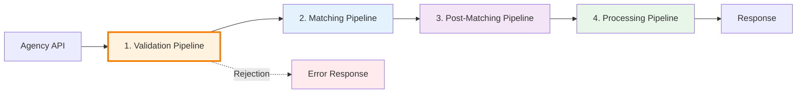
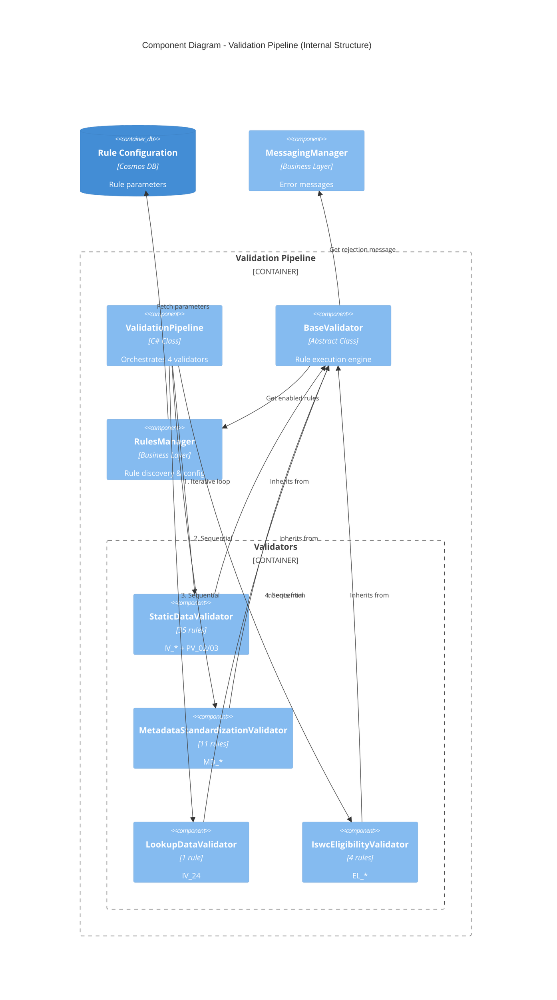
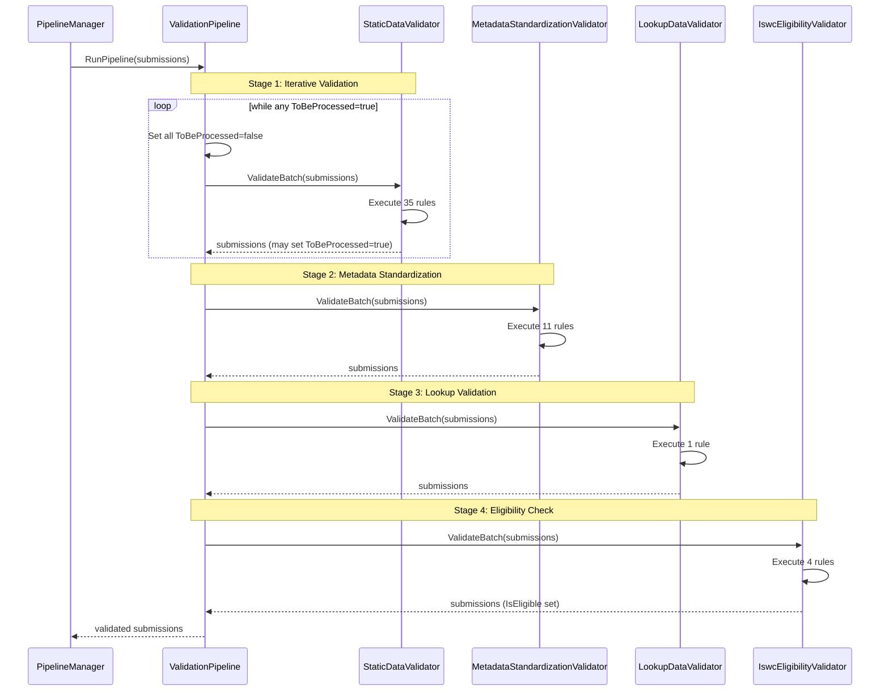
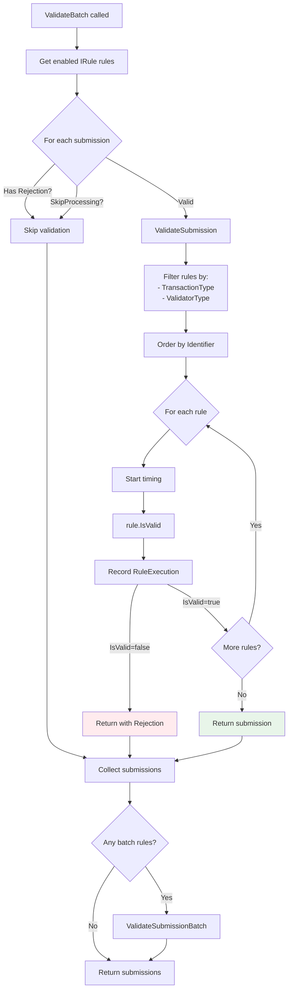
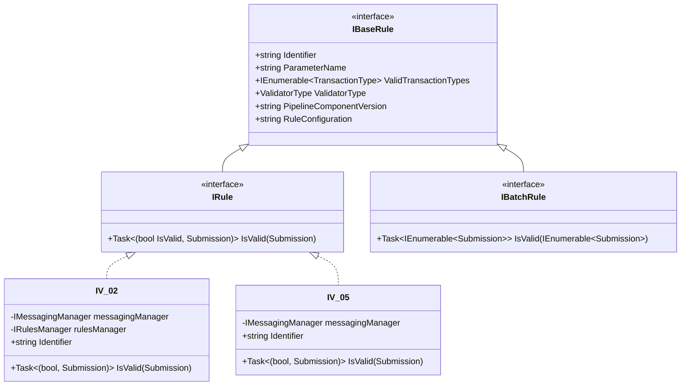
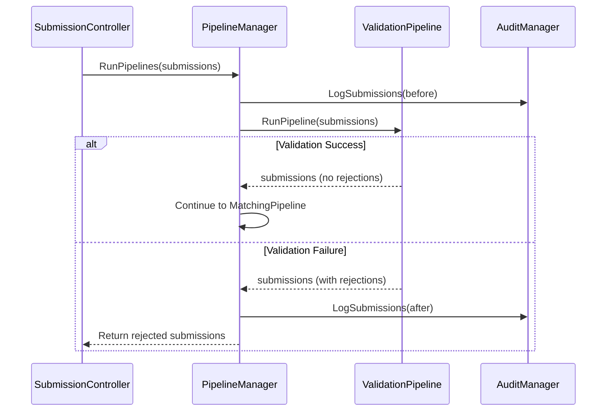

# C4 Level 3: Validation Pipeline Component

**Version:** 1.0
**Date:** 2025-10-29
**Status:** 🔴 Awaiting Validation

## Document Purpose

This document provides Level 3 (Component) documentation for the **Validation Pipeline** - the first and most critical stage in the ISWC submission processing flow. The Validation Pipeline orchestrates **73+ business rules** across 4 specialized validators to ensure work metadata quality before matching and processing.

**Prerequisites:**

- [C4 Level 1: System Context](../../c4-views/level1-system-context.md) - ✅ Validated
- [C4 Level 2: Container View](../../c4-views/level2-containers.md) - ✅ Validated
- [Agency API Component](agency-api.md) - ✅ Documented

---

## Sources

**Primary Sources:**

- Source code: `docs/resources/source-code/ISWC/src/Pipelines/ValidationPipeline/ValidationPipeline.cs` (47 lines)
- Source code: `docs/resources/source-code/ISWC/src/Business/Validators/BaseValidator.cs` (92 lines)
- Source code: `docs/resources/source-code/ISWC/src/PipelineComponents/StaticDataValidator/` (35 rules)
- Source code: `docs/resources/source-code/ISWC/src/PipelineComponents/MetadataStandardizationValidator/` (11 rules)
- Source code: `docs/resources/source-code/ISWC/src/PipelineComponents/LookupDataValidator/` (1 rule)
- Source code: `docs/resources/source-code/ISWC/src/PipelineComponents/IswcEligibilityValidator/` (4 rules)

**Secondary Sources:**

- **[SPE_20191217_CISAC ISWC REST API.md](../../../../resources/core_design_documents/SPE_20191217_CISAC ISWC REST API/SPE_20191217_CISAC ISWC REST API.md)** - Error codes and business rules (Section 5)
- Source code: `docs/resources/source-code/ISWC/src/Bdo/Rules/` - Rule interfaces and error codes

---

## Overview

The **Validation Pipeline** is the first of four sequential pipeline stages in the ISWC submission processing flow. It validates work metadata against **73+ business rules** organized across four specialized validators, rejecting invalid submissions before they reach the Matching Engine or database.

### Position in 4-Stage Flow



### Primary Purpose

> **From [ValidationPipeline.cs](../../../../resources/source-code/ISWC/src/Pipelines/ValidationPipeline/ValidationPipeline.cs:28-39):** The pipeline orchestrates 4 validators in sequence, with iterative processing for StaticDataValidator and short-circuit rejection on first validation failure.

**Key Responsibilities:**

1. **Input Validation** - Verify required fields, data types, formats (35 rules)
2. **Metadata Standardization** - Normalize titles, names, codes (11 rules)
3. **Lookup Data Validation** - Validate against reference data (1 rule)
4. **ISWC Eligibility** - Determine if work qualifies for ISWC (4 rules)

### Validation Strategy

The ValidationPipeline implements a **fail-fast strategy**:

- **First rejection terminates processing** - No further rules execute
- **Iterative validation** - StaticDataValidator can loop multiple times
- **Rule ordering** - Rules execute in alphanumeric order by identifier
- **Audit trail** - Every rule execution is tracked with timing

---

## Technical Architecture

### Component Structure



---

## Validation Pipeline Orchestration

### Core Implementation

**File:** [ValidationPipeline.cs](../../../../resources/source-code/ISWC/src/Pipelines/ValidationPipeline/ValidationPipeline.cs)

```csharp
public class ValidationPipeline : IValidationPipeline
{
    private readonly IStaticDataValidator staticDataValidator;
    private readonly IMetadataStandardizationValidator metadataStandardizationValidator;
    private readonly ILookupDataValidator lookupDataValidator;
    private readonly IIswcEligibilityValidator iswcEligibilityValidator;

    public async Task<IEnumerable<Submission>> RunPipeline(IEnumerable<Submission> submissions)
    {
        // Stage 1: Iterative static data validation
        while (submissions.Any(s => s.ToBeProcessed))
        {
            SetSubmissionsAsProcessed(submissions);
            submissions = await staticDataValidator.ValidateBatch(submissions);
        }

        // Stage 2-4: Sequential validation
        submissions = await metadataStandardizationValidator.ValidateBatch(submissions);
        submissions = await lookupDataValidator.ValidateBatch(submissions);
        return await iswcEligibilityValidator.ValidateBatch(submissions);

        static void SetSubmissionsAsProcessed(IEnumerable<Submission> submissions)
        {
            foreach (var submission in submissions) submission.ToBeProcessed = false;
        }
    }
}
```

### Validation Flow



### Iterative Validation Logic

**Why Iterative?** StaticDataValidator can modify submission data during validation, requiring re-validation of dependent rules.

**Example Scenario:**

```
Initial Submission:
  ToBeProcessed = true
  InterestedParties = [...]

Rule IV_PopulateIPsMERandCDR executes:
  → Adds additional interested parties from database
  → Sets ToBeProcessed = true (triggers re-validation)

Loop continues:
  → IV_02 (MustHaveOneIP) re-executes with new IPs
  → IV_05 (MustHaveOriginalTitle) re-validates
  → ... other rules re-execute
```

**Loop Termination:**

- All submissions have `ToBeProcessed = false`
- OR maximum iterations reached (implicit - no explicit limit in code)
- OR first rejection encountered (BaseValidator short-circuit)

---

## BaseValidator Architecture

### The Rule Execution Engine

**File:** [BaseValidator.cs](../../../../resources/source-code/ISWC/src/Business/Validators/BaseValidator.cs)

The `BaseValidator` abstract class is the **core rule execution engine** used by all 4 validators. It implements a two-phase validation strategy:

1. **Single-Submission Rules** (IRule) - Execute per submission
2. **Batch Rules** (IBatchRule) - Execute on entire batch

### BaseValidator Implementation

```csharp
public abstract class BaseValidator : IValidator
{
    private readonly IRulesManager rulesManager;
    private readonly ValidatorType validatorType;

    public async Task<IEnumerable<Submission>> ValidateBatch(IEnumerable<Submission> batch)
    {
        var returnSubmissions = new List<Submission>();
        var rules = (await rulesManager.GetEnabledRules<IRule>());

        // Phase 1: Single-submission rules
        foreach (var submission in batch)
        {
            if (submission.Rejection == null && !submission.SkipProcessing)
                returnSubmissions.Add(await ValidateSubmission(submission));
            else
                returnSubmissions.Add(submission);
        }

        // Phase 2: Batch rules (if any)
        var batchRules = (await rulesManager.GetEnabledRules<IBatchRule>());
        if (batchRules.Any())
        {
            return await ValidateSubmissionBatch(returnSubmissions);
        }

        return returnSubmissions;
    }

    async Task<Submission> ValidateSubmission(Submission submission)
    {
        var submissionRules = rules
            .Where(rule => rule.ValidTransactionTypes.Contains(submission.TransactionType))
            .Where(rule => rule.ValidatorType == validatorType)
            .OrderBy(x => x.Identifier);

        foreach (var rule in submissionRules)
        {
            var sw = Stopwatch.StartNew();
            var result = await rule.IsValid(submission);

            // Track rule execution for audit
            submission.RulesApplied.Add(new RuleExecution
            {
                RuleName = rule.Identifier,
                RuleVersion = rule.PipelineComponentVersion,
                RuleConfiguration = rule.RuleConfiguration,
                TimeTaken = sw.Elapsed
            });

            // Short-circuit on first rejection
            if (!result.IsValid)
                return result.Submission;
        }

        return submission;
    }
}
```

### Rule Execution Flow



### Key Features

**1. Short-Circuit Rejection**

```csharp
if (!result.IsValid)
    return result.Submission;  // Stop processing immediately
```

Once any rule fails, no further rules execute for that submission.

**2. Rule Filtering**

Rules execute only when:
- `TransactionType` matches (CAR, CUR, CDR, etc.)
- `ValidatorType` matches (StaticValidator, MetadataStandardizationValidator, etc.)

**3. Audit Trail**

Every rule execution is recorded:
```csharp
submission.RulesApplied.Add(new RuleExecution
{
    RuleName = "IV_02",
    RuleVersion = "1.0.0",
    RuleConfiguration = "true",
    TimeTaken = TimeSpan.FromMilliseconds(15)
});
```

**4. Skip Logic**

Submissions with existing rejections or `SkipProcessing=true` bypass validation entirely.

---

## Rule Architecture

### Rule Hierarchy



### IBaseRule Interface

**File:** [IBaseRule.cs](../../../../resources/source-code/ISWC/src/Bdo/Rules/IBaseRule.cs)

```csharp
public interface IBaseRule
{
    string Identifier { get; }              // Rule ID (e.g., "IV_02")
    string ParameterName { get; }           // Configuration parameter name
    IEnumerable<TransactionType> ValidTransactionTypes { get; }  // CAR, CUR, etc.
    ValidatorType ValidatorType { get; }    // Which validator owns this rule
    string PipelineComponentVersion { get; }  // Assembly version
    string? RuleConfiguration { get; }      // Runtime configuration value
}
```

### IRule Interface (Single Submission)

**File:** [IRule.cs](../../../../resources/source-code/ISWC/src/Bdo/Rules/IRule.cs)

```csharp
public interface IRule : IBaseRule
{
    Task<(bool IsValid, Submission Submission)> IsValid(Submission submission);
}
```

**Usage:** 99% of rules implement `IRule` for per-submission validation.

### IBatchRule Interface (Batch Processing)

**File:** [IBatchRule.cs](../../../../resources/source-code/ISWC/src/Bdo/Rules/IBatchRule.cs)

```csharp
public interface IBatchRule : IBaseRule
{
    Task<IEnumerable<Submission>> IsValid(IEnumerable<Submission> submissions);
}
```

**Usage:** Designed for cross-submission validation (e.g., duplicate detection across batch). Currently **not implemented** in any validator - BaseValidator checks for batch rules but none exist.

---

## Rule Implementation Patterns

### Pattern 1: Simple Validation Rule

**Example:** IV_05 - Must Have Original Title

**File:** [IV_05.cs](../../../../resources/source-code/ISWC/src/PipelineComponents/StaticDataValidator/Rules/IV_05.cs)

```csharp
public class IV_05 : IRule
{
    private readonly IMessagingManager messagingManager;

    public IV_05(IMessagingManager messagingManager)
    {
        this.messagingManager = messagingManager;
    }

    public string Identifier => nameof(IV_05);
    public string ParameterName => string.Empty;
    public IEnumerable<TransactionType> ValidTransactionTypes =>
        new List<TransactionType> { TransactionType.CAR, TransactionType.CUR, TransactionType.FSQ };
    public ValidatorType ValidatorType => ValidatorType.StaticValidator;
    public string PipelineComponentVersion => typeof(StaticDataValidator).GetComponentVersion();
    public string? RuleConfiguration { get; private set; }

    public async Task<(bool IsValid, Submission Submission)> IsValid(Submission submission)
    {
        // Check for Original Title (TitleType.OT)
        if (!submission.Model.Titles.Any(t => t.Type == TitleType.OT && !string.IsNullOrWhiteSpace(t.Name)))
        {
            submission.Rejection = await messagingManager.GetRejectionMessage(ErrorCode._109);
            return (false, submission);
        }
        else
            return (true, submission);
    }
}
```

**Pattern Characteristics:**
- **No dynamic configuration** - `ParameterName = string.Empty`
- **Always executes** - No conditional logic
- **Simple validation** - Single LINQ check
- **Error code mapping** - `ErrorCode._109` → "Original title required"

### Pattern 2: Configurable Validation Rule

**Example:** IV_02 - Must Have One Interested Party

**File:** [IV_02.cs](../../../../resources/source-code/ISWC/src/PipelineComponents/StaticDataValidator/Rules/IV_02.cs)

```csharp
public class IV_02 : IRule
{
    private readonly IMessagingManager messagingManager;
    private readonly IRulesManager rulesManager;

    public IV_02(IMessagingManager messagingManager, IRulesManager rulesManager)
    {
        this.messagingManager = messagingManager;
        this.rulesManager = rulesManager;
    }

    public string Identifier => nameof(IV_02);
    public string ParameterName => "MustHaveOneIP";
    public IEnumerable<TransactionType> ValidTransactionTypes =>
        new List<TransactionType> { TransactionType.CAR, TransactionType.CUR, TransactionType.FSQ };
    public ValidatorType ValidatorType => ValidatorType.StaticValidator;
    public string PipelineComponentVersion => typeof(StaticDataValidator).GetComponentVersion();
    public string? RuleConfiguration { get; private set; }

    public async Task<(bool IsValid, Submission Submission)> IsValid(Submission submission)
    {
        // Fetch dynamic configuration parameter
        var paramValue = await rulesManager.GetParameterValue<bool>("MustHaveOneIP");

        // Rule can be disabled via configuration
        if (!paramValue)
            return (true, submission);

        var model = submission.Model;
        RuleConfiguration = paramValue.ToString();

        // Validate interested parties exist
        if ((model.InterestedParties == null) || (!model.InterestedParties.Any()))
        {
            submission.Rejection = await messagingManager.GetRejectionMessage(ErrorCode._104);
            return (false, submission);
        }
        else
            return (true, submission);
    }
}
```

**Pattern Characteristics:**
- **Dynamic configuration** - `ParameterName = "MustHaveOneIP"`
- **Conditional execution** - Rule can be disabled (`if (!paramValue) return true`)
- **Rule configuration tracking** - Sets `RuleConfiguration` property for audit
- **Database parameter fetch** - `rulesManager.GetParameterValue<bool>()`

### Pattern 3: Data Transformation Rule

**Example:** IV_PopulateIPsMERandCDR

**Responsibilities:**
- Fetch additional interested parties from database for MER (Merge) and CDR (Delete) transactions
- Populate submission with complete IP data
- **Set `ToBeProcessed = true`** to trigger re-validation

**Implementation Pattern:**
```csharp
public async Task<(bool IsValid, Submission Submission)> IsValid(Submission submission)
{
    if (submission.TransactionType == TransactionType.MER ||
        submission.TransactionType == TransactionType.CDR)
    {
        // Fetch IPs from database
        var additionalIPs = await ipRepository.GetInterestedPartiesAsync(submission.Model.PreferredIswc);

        // Add to submission
        submission.Model.InterestedParties.AddRange(additionalIPs);

        // Trigger re-validation
        submission.ToBeProcessed = true;
    }

    return (true, submission);
}
```

---

## Validator Components

### 1. StaticDataValidator (35 Rules)

**File:** `docs/resources/source-code/ISWC/src/PipelineComponents/StaticDataValidator/`

**Purpose:** Validates required fields, data types, formats, and basic business rules.

**Rule Categories:**

**IV_* Rules (Input Validation):** 33 rules
- IV_02: Must have one interested party
- IV_05: Must have original title (TitleType.OT)
- IV_06: Agency code must be valid
- IV_07: Work code required and valid format
- IV_08: Source DB must match agency
- IV_10: Transaction type required
- IV_11: Category code valid (DOM, JAZ, POP, etc.)
- IV_13: Date fields in valid format
- IV_14: IP role codes valid (C, A, E, etc.)
- IV_15: IP name required
- IV_19: Duplicate IP detection within submission
- IV_25: Title length limits
- IV_29: IP percentage validation
- IV_34: Work duration validation
- IV_36: ISWC format validation (T-XXX.XXX.XXX-C)
- IV_38: Derived work references
- IV_40: Additional identifier validation
- IV_44-IV_60: Additional field validations
- IV_PopulateIPsMERandCDR: Data population for MER/CDR

**PV_* Rules (Pre-validation):** 2 rules
- PV_02: Pre-matching validation
- PV_03: Conflict detection

**Transaction Type Support:**
- CAR (Create/Add/Revise)
- CUR (Change/Update/Revise)
- CDR (Change/Delete/Remove)
- FSQ (Full Status Query - Publisher resolution)
- MER (Merge)

**Example Rules:**

| Rule ID | Description | Error Code | Configurable |
|---------|-------------|------------|--------------|
| IV_02 | Must have at least one interested party | _104 | Yes (MustHaveOneIP) |
| IV_05 | Must have original title (TitleType.OT) | _109 | No |
| IV_06 | Agency code must exist in system | _102 | No |
| IV_07 | Work code required and non-empty | _103 | No |
| IV_11 | Category code must be valid (DOM, JAZ, etc.) | _111 | No |
| IV_14 | IP role must be valid (C, A, CA, E, etc.) | _114 | No |

---

### 2. MetadataStandardizationValidator (11 Rules)

**File:** `docs/resources/source-code/ISWC/src/PipelineComponents/MetadataStandardizationValidator/`

**Purpose:** Normalize and standardize metadata for consistent processing.

**MD_* Rules (Metadata):** 11 rules
- MD_01: Title capitalization standardization
- MD_03: Remove leading/trailing whitespace
- MD_06: Character encoding normalization (diacritics, special chars)
- MD_08: Name standardization (remove titles like "Mr.", "Dr.")
- MD_09: Work code format standardization
- MD_10: Date format normalization (YYYY-MM-DD)
- MD_11: IP percentage normalization (0.00-100.00)
- MD_13: Category code uppercase conversion
- MD_16: Role code uppercase conversion
- MD_17: ISWC format normalization
- MD_18: Duplicate whitespace removal

**Transformation Examples:**

| Input | Rule | Output |
|-------|------|--------|
| "  SONG TITLE  " | MD_03 | "SONG TITLE" |
| "song title" | MD_01 | "Song Title" |
| "José García" | MD_06 | "Jose Garcia" (or retain diacritics - depends on config) |
| "Mr. John Smith" | MD_08 | "John Smith" |
| "  C  " | MD_16 | "C" |
| "ABC  123" | MD_17 | "ABC 123" |

**Transaction Type Support:**
- CAR, CUR, FSQ (all modification transactions)

**Key Behavior:**
- **Does NOT reject** - Only transforms data
- **Silent normalization** - No error messages generated
- **Idempotent** - Can run multiple times without side effects

---

### 3. LookupDataValidator (1 Rule)

**File:** `docs/resources/source-code/ISWC/src/PipelineComponents/LookupDataValidator/`

**Purpose:** Validate fields against reference data (lookup tables).

**IV_* Rules:** 1 rule
- IV_24: Validate all lookup codes against reference data
  - Agency codes
  - Category codes (DOM, JAZ, POP, SER, UNC)
  - Role codes (C, A, CA, E, SR, SA, AR, AD, TR, PA)
  - Document codes
  - Relationship codes
  - Country codes (ISO 3166-1 alpha-2)

**Implementation Pattern:**
```csharp
public async Task<(bool IsValid, Submission Submission)> IsValid(Submission submission)
{
    var lookupData = await lookupManager.GetLookupDataAsync();

    // Validate agency code
    if (!lookupData.AgencyCodes.Contains(submission.Model.Agency))
    {
        submission.Rejection = await messagingManager.GetRejectionMessage(ErrorCode._102);
        return (false, submission);
    }

    // Validate category code
    if (!lookupData.WorkCategories.Contains(submission.Model.Category))
    {
        submission.Rejection = await messagingManager.GetRejectionMessage(ErrorCode._111);
        return (false, submission);
    }

    // ... additional lookup validations

    return (true, submission);
}
```

**Reference Data Sources:**
- **Cosmos DB** - Lookup collections
- **24-hour cache** - In-memory caching via `ILookupManager`
- **Agency Portal** - Manual maintenance via admin interface

**Transaction Type Support:**
- CAR, CUR, FSQ (all transactions with lookup codes)

---

### 4. IswcEligibilityValidator (4 Rules)

**File:** `docs/resources/source-code/ISWC/src/PipelineComponents/IswcEligibilityValidator/`

**Purpose:** Determine if a work qualifies for ISWC assignment based on interested party roles and agency agreements.

**EL_* Rules (Eligibility):** 4 rules
- EL_01: **Primary eligibility check** - Validates IP roles and agency agreements
- EL_02: Eligibility validation against rules engine
- EL_03: Eligibility criteria assessment
- EL_04: Final eligibility processing

**EL_01 Implementation (Core Logic):**

```csharp
public async Task<(bool IsValid, Submission Submission)> IsValid(Submission submission)
{
    var eligibleRoles = await rulesManager.GetParameterValue<string>("EligibleIswcRoles");
    var eligibleRolesList = eligibleRoles.Split(',').Select(r => r.Trim()).ToList();

    // Check if work has at least one IP with eligible role
    var hasEligibleRole = submission.Model.InterestedParties
        .Any(ip => eligibleRolesList.Contains(ip.Role));

    if (!hasEligibleRole)
    {
        submission.IsEligible = false;
        return (true, submission);  // Not rejected - just marked ineligible
    }

    // Validate agency agreements
    var agreements = await agreementManager.GetAgencyAgreementsAsync(submission.Model.Agency);

    if (!agreements.AllowIswcAssignment)
    {
        submission.IsEligible = false;
        return (true, submission);
    }

    // Check Public Domain special handling
    if (IsPublicDomain(submission.Model.InterestedParties))
    {
        submission.IsEligible = true;  // PD works always eligible
        return (true, submission);
    }

    submission.IsEligible = true;
    return (true, submission);
}

bool IsPublicDomain(IEnumerable<InterestedParty> ips)
{
    // Death date + 80 years rule
    return ips.All(ip =>
        ip.DeathDate.HasValue &&
        ip.DeathDate.Value.AddYears(80) < DateTime.Now);
}
```

**Eligible Roles (Configuration Parameter):**
- **C** - Composer
- **CA** - Composer/Author
- **A** - Author (lyricist)

**Ineligible Roles:**
- **E** - Publisher (original)
- **SR** - Sub-Publisher
- **SA** - Sub-Author
- **AR** - Arranger
- **AD** - Adapter
- **TR** - Translator
- **PA** - Publisher Administrator

**Key Behavior:**
- **Does NOT reject** - Sets `IsEligible = true/false`
- **Affects downstream** - ProcessingPipeline uses `IsEligible` flag
- **Public Domain exception** - Death date + 80 years calculation
- **Agency agreements** - Database-driven eligibility rules

**Transaction Type Support:**
- CAR (new work submissions only)

---

## Error Codes

### Error Code Structure

**File:** [ErrorCode.cs](../../../../resources/source-code/ISWC/src/Bdo/Rules/ErrorCode.cs)

```csharp
[JsonConverter(typeof(ErrorCodeConverter))]
public enum ErrorCode
{
    _100,  // Internal server error
    _102,  // Invalid agency code
    _103,  // Work code required
    _104,  // Must have one interested party
    _105,  // Invalid source DB
    // ... 80+ error codes
    _181,  // Last error code
}
```

**JSON Serialization:**
The `ErrorCodeConverter` strips the underscore prefix:
```json
{
  "errorCode": "104",  // Serialized without underscore
  "message": "Must have at least one interested party"
}
```

### Common Error Codes by Validator

**StaticDataValidator:**
| Code | Message | Rule |
|------|---------|------|
| _102 | Invalid agency code | IV_06 |
| _103 | Work code required | IV_07 |
| _104 | Must have one interested party | IV_02 |
| _109 | Original title required | IV_05 |
| _111 | Invalid category code | IV_11 |
| _114 | Invalid IP role code | IV_14 |

**MetadataStandardizationValidator:**
- **No error codes** - Only transformations

**LookupDataValidator:**
| Code | Message | Rule |
|------|---------|------|
| _102 | Agency code not in lookup data | IV_24 |
| _111 | Category code not in lookup data | IV_24 |

**IswcEligibilityValidator:**
- **No error codes** - Sets `IsEligible` flag instead

---

## Rule Configuration

### Dynamic Rule Parameters

Rules can be **enabled/disabled** and **configured** via database parameters.

**IRulesManager Interface:**

```csharp
public interface IRulesManager
{
    Task<IEnumerable<IRule>> GetEnabledRules<IRule>();
    Task<T> GetParameterValue<T>(string parameterName);
}
```

**Example Configuration:**

```json
{
  "ruleParameters": {
    "MustHaveOneIP": true,
    "EligibleIswcRoles": "C,CA,A",
    "MaxTitleLength": 250,
    "AllowPublicDomain": true,
    "PublicDomainYears": 80
  }
}
```

**Configurable Rules:**

| Rule | Parameter | Type | Description |
|------|-----------|------|-------------|
| IV_02 | MustHaveOneIP | bool | Require at least one interested party |
| EL_01 | EligibleIswcRoles | string | Comma-separated role codes (C,CA,A) |
| EL_01 | AllowPublicDomain | bool | Enable public domain exception |
| EL_01 | PublicDomainYears | int | Years after death (default: 80) |
| IV_25 | MaxTitleLength | int | Maximum title length |
| IV_29 | RequireIPPercentages | bool | Validate IP share percentages |

### Rule Discovery Mechanism

**Reflection-Based Discovery:**

```csharp
// In RulesManager
public async Task<IEnumerable<IRule>> GetEnabledRules<IRule>()
{
    // 1. Discover all IRule implementations via reflection
    var allRules = AppDomain.CurrentDomain.GetAssemblies()
        .SelectMany(a => a.GetTypes())
        .Where(t => typeof(IRule).IsAssignableFrom(t) && !t.IsInterface && !t.IsAbstract)
        .Select(t => (IRule)Activator.CreateInstance(t, serviceProvider));

    // 2. Check database for enabled/disabled status
    var enabledRules = await GetEnabledRuleIdentifiers();

    // 3. Filter to enabled rules only
    return allRules.Where(r => enabledRules.Contains(r.Identifier));
}
```

**Always-On Rules:**

Rules implementing `IAlwaysOnRule` marker interface cannot be disabled:
```csharp
public interface IAlwaysOnRule : IBaseRule
{
    // Marker interface - no methods
}

public class IV_06 : IRule, IAlwaysOnRule  // Always executes
{
    // Implementation
}
```

---

## Integration Points

### Upstream Integration (Agency API)



**Integration Contract:**

```csharp
public interface IValidationPipeline
{
    Task<IEnumerable<Submission>> RunPipeline(IEnumerable<Submission> submissions);
}
```

**Input Requirements:**
- `submission.Model` populated with work metadata
- `submission.TransactionType` set (CAR, CUR, CDR, etc.)
- `submission.Agency` and `submission.SourceDb` set
- `submission.ToBeProcessed` initialized to `false`

**Output Guarantees:**
- `submission.Rejection` set if validation failed (non-null)
- `submission.IsEligible` set by IswcEligibilityValidator
- `submission.RulesApplied` contains audit trail of all executed rules
- `submission.SkipProcessing` may be set for certain scenarios

### Downstream Integration (Matching Pipeline)

**Contract:**

```csharp
// In PipelineManager
submissions = await validationPipeline.RunPipeline(submissions);

// Check for rejections before matching
if (submissions.Any(s => s.Rejection != null))
{
    return submissions;  // Skip matching for rejected submissions
}

submissions = await matchingPipeline.RunPipeline(submissions);
```

**Data Flow:**
- ValidationPipeline → **Submission.IsEligible** → Used by MatchingPipeline to determine source ("Eligible" vs. "Label")
- ValidationPipeline → **Submission.Rejection** → Short-circuits remaining pipelines
- ValidationPipeline → **Submission.RulesApplied** → Audit trail passed through all stages

### External Dependencies

**1. IRulesManager (Business Layer)**

**Purpose:** Rule discovery, configuration, enabling/disabling

**Methods:**
```csharp
Task<IEnumerable<IRule>> GetEnabledRules<IRule>();
Task<T> GetParameterValue<T>(string parameterName);
```

**Data Source:** Cosmos DB (rule configuration collection)

---

**2. IMessagingManager (Business Layer)**

**Purpose:** Error message retrieval by error code

**Methods:**
```csharp
Task<Rejection> GetRejectionMessage(ErrorCode errorCode);
```

**Returns:**
```csharp
public class Rejection
{
    public ErrorCode ErrorCode { get; set; }
    public string Message { get; set; }
    public string DetailedMessage { get; set; }
    public RejectionSeverity Severity { get; set; }  // Error, Warning, Info
}
```

**Data Source:** Localized messages (default: English)

---

**3. ILookupManager (Business Layer)**

**Purpose:** Reference data queries (agency codes, category codes, role codes, etc.)

**Methods:**
```csharp
Task<LookupData> GetLookupDataAsync();
```

**Caching:** 24-hour in-memory cache

---

**4. IAgreementManager (Business Layer)**

**Purpose:** Agency agreement validation (EL_01 eligibility check)

**Methods:**
```csharp
Task<AgencyAgreement> GetAgencyAgreementsAsync(string agencyCode);
```

**Data Source:** SQL Server (Agency table with agreements)

---

## Performance Considerations

### Rule Execution Timing

**Measurement:**
```csharp
var sw = Stopwatch.StartNew();
var result = await rule.IsValid(submission);
submission.RulesApplied.Add(new RuleExecution
{
    RuleName = rule.Identifier,
    TimeTaken = sw.Elapsed  // Recorded for every rule
});
```

**Typical Timing:**
- Simple rules (IV_05, IV_06): **1-5ms**
- Database lookup rules (IV_24): **10-50ms** (cached after first query)
- Eligibility rules (EL_01): **20-100ms** (agreement database query)

**Batch Performance:**
- 100 submissions × 51 rules (Static + Metadata + Lookup + Eligibility)
- **Without rejection:** ~5-10 seconds (51 rules × 100 submissions)
- **With early rejection:** Significantly faster (short-circuit on first failure)

### Optimization Strategies

**1. Short-Circuit Rejection**

```csharp
if (!result.IsValid)
    return result.Submission;  // Stop immediately
```

Average rules executed per submission:
- **Valid submission:** 51 rules (all validators)
- **Invalid submission:** 5-15 rules (reject early)

**Savings:** 70-90% reduction in rule execution for invalid submissions

---

**2. Rule Filtering Before Execution**

```csharp
var submissionRules = rules
    .Where(rule => rule.ValidTransactionTypes.Contains(submission.TransactionType))
    .Where(rule => rule.ValidatorType == validatorType)
    .OrderBy(x => x.Identifier);
```

Only rules matching transaction type execute:
- CAR transactions: ~45 rules
- CUR transactions: ~40 rules
- CDR transactions: ~15 rules
- MER transactions: ~10 rules

---

**3. Lookup Data Caching**

```csharp
// 24-hour cache
var lookupData = await lookupManager.GetLookupDataAsync();
```

**Impact:**
- First query: ~200ms (database fetch)
- Subsequent queries: ~1ms (in-memory cache)

---

**4. Parameter Value Caching**

```csharp
// Cached per validator lifetime
var paramValue = await rulesManager.GetParameterValue<bool>("MustHaveOneIP");
```

**Impact:**
- First query: ~50ms (Cosmos DB)
- Subsequent queries: ~1ms (cached)

---

**5. Iterative Validation Limit**

**Risk:** Infinite loop if `ToBeProcessed` always `true`

**Mitigation (Implicit):**
- Rules that set `ToBeProcessed` are data transformation rules (IV_PopulateIPsMERandCDR)
- Data transformation completes in 1-2 iterations
- No explicit max iteration limit in code (potential improvement)

**Typical Iterations:**
- Most submissions: **1 iteration**
- MER/CDR with IP population: **2 iterations**
- Complex scenarios: **3 iterations**

---

## Source Code References

**Base Path:** `docs/resources/source-code/ISWC/src/`

### Pipeline Files

- [Pipelines/ValidationPipeline/ValidationPipeline.cs](../../../../resources/source-code/ISWC/src/Pipelines/ValidationPipeline/ValidationPipeline.cs) - Main orchestrator (47 lines)
- [Pipelines/ValidationPipeline/IValidationPipeline.cs](../../../../resources/source-code/ISWC/src/Pipelines/ValidationPipeline/IValidationPipeline.cs) - Interface
- [Pipelines/ValidationPipeline/AutofacModule.cs](../../../../resources/source-code/ISWC/src/Pipelines/ValidationPipeline/AutofacModule.cs) - DI registration
- [Pipelines/ValidationPipeline/ValidationPipeline.csproj](../../../../resources/source-code/ISWC/src/Pipelines/ValidationPipeline/ValidationPipeline.csproj) - Project file

### Base Classes

- [Business/Validators/BaseValidator.cs](../../../../resources/source-code/ISWC/src/Business/Validators/BaseValidator.cs) - Abstract rule execution engine (92 lines)
- [Business/Validators/IValidator.cs](../../../../resources/source-code/ISWC/src/Business/Validators/IValidator.cs) - Validator interface

### Rule Interfaces

- [Bdo/Rules/IBaseRule.cs](../../../../resources/source-code/ISWC/src/Bdo/Rules/IBaseRule.cs) - Base rule interface
- [Bdo/Rules/IRule.cs](../../../../resources/source-code/ISWC/src/Bdo/Rules/IRule.cs) - Single-submission rule interface
- [Bdo/Rules/IBatchRule.cs](../../../../resources/source-code/ISWC/src/Bdo/Rules/IBatchRule.cs) - Batch rule interface
- [Bdo/Rules/IAlwaysOnRule.cs](../../../../resources/source-code/ISWC/src/Bdo/Rules/IAlwaysOnRule.cs) - Marker for non-configurable rules
- [Bdo/Rules/ValidatorType.cs](../../../../resources/source-code/ISWC/src/Bdo/Rules/ValidatorType.cs) - Validator type enum
- [Bdo/Rules/ErrorCode.cs](../../../../resources/source-code/ISWC/src/Bdo/Rules/ErrorCode.cs) - Error code enum (80+ codes)
- [Bdo/Rules/RuleExecution.cs](../../../../resources/source-code/ISWC/src/Bdo/Rules/RuleExecution.cs) - Rule tracking model

### Validator Components

- [PipelineComponents/StaticDataValidator/](../../../../resources/source-code/ISWC/src/PipelineComponents/StaticDataValidator/) - 35 rules
  - Rules/IV_02.cs, Rules/IV_05.cs, Rules/IV_06.cs, etc.
  - IStaticDataValidator.cs, StaticDataValidator.cs
- [PipelineComponents/MetadataStandardizationValidator/](../../../../resources/source-code/ISWC/src/PipelineComponents/MetadataStandardizationValidator/) - 11 rules
- [PipelineComponents/LookupDataValidator/](../../../../resources/source-code/ISWC/src/PipelineComponents/LookupDataValidator/) - 1 rule
- [PipelineComponents/IswcEligibilityValidator/](../../../../resources/source-code/ISWC/src/PipelineComponents/IswcEligibilityValidator/) - 4 rules

### Managers

- [Business/Managers/RulesManager.cs](../../../../resources/source-code/ISWC/src/Business/Managers/RulesManager.cs) - Rule discovery & configuration
- [Business/Managers/MessagingManager.cs](../../../../resources/source-code/ISWC/src/Business/Managers/MessagingManager.cs) - Error message retrieval
- [Business/Managers/LookupManager.cs](../../../../resources/source-code/ISWC/src/Business/Managers/LookupManager.cs) - Reference data queries
- [Business/Managers/AgreementManager.cs](../../../../resources/source-code/ISWC/src/Business/Managers/AgreementManager.cs) - Agency agreement validation

---

## Configuration

### Application Settings

**Example Configuration (appsettings.json):**

```json
{
  "ValidationPipeline": {
    "RuleParameters": {
      "MustHaveOneIP": true,
      "EligibleIswcRoles": "C,CA,A",
      "MaxTitleLength": 250,
      "AllowPublicDomain": true,
      "PublicDomainYears": 80,
      "RequireIPPercentages": false
    },
    "EnabledRules": [
      "IV_02", "IV_05", "IV_06", "IV_07", "IV_08",
      "MD_01", "MD_03", "MD_06", "IV_24",
      "EL_01", "EL_02", "EL_03", "EL_04"
    ],
    "CacheDuration": "24:00:00"
  }
}
```

### Rule Enable/Disable

Rules can be disabled without recompilation:

**Database Configuration (Cosmos DB):**

```json
{
  "id": "rule-config",
  "enabledRules": [
    {"identifier": "IV_02", "enabled": true},
    {"identifier": "IV_05", "enabled": true},
    {"identifier": "IV_06", "enabled": false},  // Disabled
    {"identifier": "EL_01", "enabled": true}
  ]
}
```

**Query:**
```csharp
var enabledRules = await rulesManager.GetEnabledRules<IRule>();
// Only returns IV_02, IV_05, EL_01 (IV_06 is disabled)
```

---

## Known Gaps and Technical Debt

### High Priority Issues

🔴 **No Maximum Iteration Limit**

**Issue:** `while (submissions.Any(s => s.ToBeProcessed))` has no max iteration check

**Risk:** Infinite loop if buggy rule always sets `ToBeProcessed = true`

**Recommendation:** Add max iteration limit (e.g., 10) with logging

```csharp
int maxIterations = 10;
int iterations = 0;

while (submissions.Any(s => s.ToBeProcessed) && iterations < maxIterations)
{
    iterations++;
    SetSubmissionsAsProcessed(submissions);
    submissions = await staticDataValidator.ValidateBatch(submissions);
}

if (iterations >= maxIterations)
{
    logger.LogWarning("Validation exceeded {MaxIterations} iterations", maxIterations);
}
```

---

🔴 **Batch Rules Not Implemented**

**Issue:** BaseValidator supports `IBatchRule` but **no rules implement it**

**Impact:** Dead code, unused complexity

**Recommendation:** Either implement batch rules or remove IBatchRule support

**Use Case for Batch Rules:**
- Duplicate work detection across batch
- Batch-level percentage validation (IP shares sum to 100%)
- Cross-submission conflict detection

---

⚠️ **ASP.NET Core 3.1 EOL**

**Issue:** All validator projects target `netcoreapp3.1` (EOL Dec 2022)

**Impact:** No security patches, compatibility issues

**Recommendation:** Upgrade to .NET 6 LTS or .NET 8 LTS

---

⚠️ **Rule Discovery Performance**

**Issue:** Reflection-based rule discovery on every request

```csharp
var allRules = AppDomain.CurrentDomain.GetAssemblies()
    .SelectMany(a => a.GetTypes())
    .Where(t => typeof(IRule).IsAssignableFrom(t))
    // ... expensive reflection
```

**Impact:** ~100-200ms overhead per batch

**Recommendation:** Cache rule discovery results per validator lifetime

---

### Medium Priority Issues

⚠️ **No Rule Versioning Strategy**

**Issue:** `PipelineComponentVersion` tracks assembly version but no versioning strategy for rule logic changes

**Impact:** Cannot track which rule version was applied in audit trail

**Recommendation:** Implement semantic versioning for rules (e.g., `IV_02_v2`)

---

⚠️ **Limited Error Context**

**Issue:** Rejection messages don't include field names or values

```csharp
submission.Rejection = await messagingManager.GetRejectionMessage(ErrorCode._104);
// Message: "Must have at least one interested party"
// No context: Which field? What value was provided?
```

**Recommendation:** Enhance Rejection model with field path and values:
```csharp
public class Rejection
{
    public ErrorCode ErrorCode { get; set; }
    public string Message { get; set; }
    public string FieldPath { get; set; }  // e.g., "Model.InterestedParties"
    public object AttemptedValue { get; set; }
}
```

---

⚠️ **Hardcoded Validator Order**

**Issue:** Validator sequence is hardcoded in ValidationPipeline.cs

```csharp
submissions = await staticDataValidator.ValidateBatch(submissions);
submissions = await metadataStandardizationValidator.ValidateBatch(submissions);
submissions = await lookupDataValidator.ValidateBatch(submissions);
return await iswcEligibilityValidator.ValidateBatch(submissions);
```

**Impact:** Cannot reorder validators without code change

**Recommendation:** Configuration-driven validator ordering

---

## Questions for Further Investigation

### High Priority

1. **Iterative Validation Scenarios**
   - What specific rules set `ToBeProcessed = true`?
   - What's the typical iteration count in production?
   - Are there cases requiring 5+ iterations?
   - Should there be a max iteration limit?

2. **Rule Configuration Storage**
   - Where are rule parameters stored? (Cosmos DB collection name?)
   - Who manages rule configuration? (Portal UI or manual?)
   - How are configuration changes deployed?
   - Is there version control for configuration?

3. **Performance Under Load**
   - What's the p50/p95/p99 validation time?
   - How does validation scale with batch size?
   - What's the largest batch size in production?
   - Are there batch size limits?

### Medium Priority

4. **Rule Execution Ordering**
   - Is alphanumeric ordering intentional? (IV_02 before IV_05)
   - Are there rule dependencies? (Rule A must execute before Rule B?)
   - Can rules be reordered dynamically?

5. **Public Domain Handling**
   - How is death date populated for IPs?
   - What's the exact 80-year calculation? (Date of death + 80 years?)
   - How are edge cases handled? (Unknown death date?)
   - Is this configurable per country? (EU: 70 years, US: different rules)

6. **Agency Agreements**
   - What agreement fields affect eligibility?
   - Can agreements change mid-processing?
   - How are agreement conflicts resolved?

### Low Priority

7. **Batch Rule Use Cases**
   - Why were batch rules designed but not implemented?
   - What scenarios require batch-level validation?
   - Should batch rules be removed or implemented?

8. **Localization**
   - Are error messages localized? (French, Spanish, etc.)
   - How is locale determined? (HTTP header? User preference?)

---

## Related Documentation

**Pipeline Architecture:**

- [Agency API](agency-api.md) - Orchestrates ValidationPipeline via PipelineManager
- [Matching Pipeline](matching-pipeline.md) - Next stage after validation
- [Post-Matching Pipeline](post-matching-pipeline.md) - Contains additional validation (22 PV_* rules)
- [Processing Pipeline](processing-pipeline.md) - Final stage uses `IsEligible` flag

**Supporting Documentation:**

- [Validation Rules Catalog](validation-rules-catalog.md) - Complete rule inventory with examples
- [Pipeline Architecture Overview](pipeline-architecture-overview.md) - Master navigation hub

**Infrastructure:**

- [C4 Level 2: Container View](../../c4-views/level2-containers.md) - Deployment architecture

---

## Document History

| Version | Date | Author | Changes |
|---------|------|--------|---------|
| 1.0 | 2025-10-29 | Claude (AI Assistant) | Initial Level 3 documentation |

---

**Last Updated:** October 29, 2025
**Status:** 🔴 Awaiting domain expert validation
**Next:** Document MatchingPipeline and complete rule catalog
