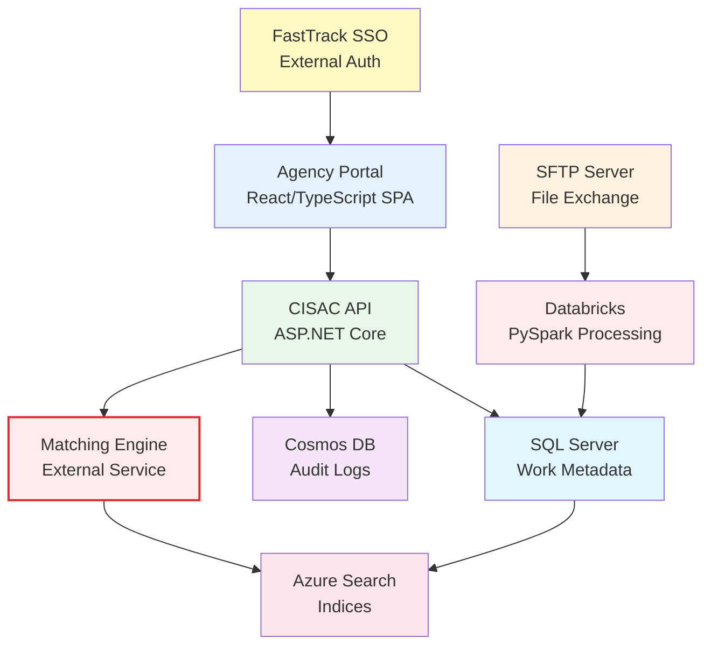

# ISWC System Architecture Documentation

This directory contains comprehensive technical documentation for the ISWC (International Standard Musical Work Code) system components and architecture.

## Overview

The ISWC system is a complex distributed system for managing musical work registrations globally. It consists of multiple components deployed on Microsoft Azure, integrating with external systems, and supporting multiple submission methods for music rights societies worldwide.

## Component Documentation

### Core Infrastructure Components

#### [CosmosDB.md](CosmosDB.md)

**Azure Cosmos DB with MongoDB API** - NoSQL database for flexible data storage

- **Purpose:** Audit logging, submission history, and flexible document storage
- **Version:** 1.0 (October 24, 2025)
- **Key Topics:**
  - MongoDB API compatibility and partition strategy
  - Audit collection hierarchy (Audit → AuditRequest → AuditRequestTransaction)
  - XXXDDD partition key format (Society Code + Month)
  - 4-hour backup intervals with 2 backup retention
  - 822+ million audit records scalability
  - Connection string configuration and security

#### [AuditLogging.md](AuditLogging.md)

**Audit Logging System** - Complete audit trail for all system transactions

- **Purpose:** Track all submissions, updates, and changes across the system
- **Version:** 1.0 (October 24, 2025)
- **Key Topics:**
  - Three-tier collection hierarchy implementation
  - Specification vs Implementation comparison tables
  - Repository pattern with ICosmosDbRepository<T>
  - Audit data models (AuditModel, AuditRequestModel, AuditRequestTransactionModel)
  - Integration with Cosmos DB partition strategy
  - Extended audit fields beyond specification
  - Performance considerations and query patterns

#### [Databricks.md](Databricks.md)

**Azure Databricks File Processing Engine** - Big data processing and ETL workflows

- **Purpose:** Process IPI full synchronization files and large-scale data transformations
- **Version:** 1.0 (October 22, 2025)
- **Key Topics:**
  - PySpark notebook execution architecture
  - Integration Cluster (10.4 LTS runtime - **OUTDATED**, missing features)
  - IPI Full Resynch workflow (IPA/IPT files from IPI database)
  - Data Factory orchestration and triggers
  - Job monitoring via Jobs API
  - DatabricksClient.cs HTTP client implementation
  - Performance bottlenecks and runtime version issues
  - 65+ source code files (C#, Python, SQL, ARM templates)

### User Interface Components

#### [ISWC-Agency-Portal.md](ISWC-Agency-Portal.md)

**Agency Portal Web Application** - Interactive web interface for music rights societies

- **Purpose:** Web-based portal for work registration, search, workflows, and reporting
- **Version:** 2.0 (October 27, 2025) - **MAJOR UPDATE with full source code analysis**
- **Key Topics:**
  - React 16.12.0 + TypeScript 3.7.3 frontend with Redux 4.0.4
  - ASP.NET Core 3.1 backend with Autofac DI
  - FastTrack SSO authentication (SOAP integration)
  - Search, submission, workflow, merge/demerge, and reporting features
  - Multi-language support (EN, FR, ES)
  - 161+ source code files documented
  - Portal page components (Search, Submission, Workflows, Reports, User Management)
  - Database schema (WebUser, WebUserRole, Message, Notification)
  - Integration with CISAC API and Matching Engine

### External Integrations

#### [MatchingEngine.md](MatchingEngine.md)

**Matching Engine Integration** - External work matching and search service

- **Purpose:** Match submitted works against existing database using fuzzy matching
- **Version:** 1.0 (October 27, 2025)
- **Key Topics:**
  - 🔴 **CRITICAL:** External Spanish Point product, NOT part of ISWC codebase
  - REST API integration (GET /Work/Match endpoint)
  - OAuth2 Client Credentials authentication
  - Azure Search indices (WorkNumbers, Repertoire)
  - Synchronous blocking submission workflow
  - HTTP client with Polly retry policies
  - One-way data synchronization (ISWC SQL → Azure Search)
  - Fuzzy matching algorithms and scoring
  - 42+ source code files for integration layer
  - Three Mermaid diagrams showing architecture and data flows

### Performance & Operations

#### [Performance.md](Performance.md)

**System Performance Analysis** - Performance characteristics and optimization opportunities

- **Purpose:** Document performance metrics, bottlenecks, and optimization strategies
- **Version:** 1.0 (October 27, 2025)
- **Key Topics:**
  - Database performance (Cosmos DB, SQL Server)
  - Matching Engine performance and latency
  - Databricks job execution times
  - API response times and throughput
  - Caching strategies and CDN usage
  - Monitoring with Application Insights
  - Scalability considerations
  - Performance tuning recommendations

#### [SFTP-Usage.md](SFTP-Usage.md)

**SFTP File Exchange** - Batch file submission and notification system

- **Purpose:** Document SFTP server for EDI/JSON file submissions and CSN notifications
- **Version:** 1.0 (October 24, 2025)
- **Key Topics:**
  - SFTP server setup and agency access
  - File format support (EDI, JSON)
  - Submission workflows via file drops
  - CSN (CISAC Standard Notification) file generation
  - Integration with Databricks for file processing
  - File naming conventions and directory structure
  - Error handling and notification patterns

## Related Documentation

### Code Analysis

See [../code_analysis/](../code_analysis/) for detailed code analysis and integration studies:

- [MatchingEngine_integration.md](../code_analysis/MatchingEngine_integration.md) - Deep dive into Matching Engine integration patterns

### Infrastructure

See [../infra/](../infra/) for infrastructure documentation:

- [Infrastructure Index](../infra/index.md) - Complete Azure infrastructure reference
- [Azure Resource Reference](../infra/infrastructure-azure-reference.md) - 343 Azure resources inventory

### Project Planning

See root-level documentation:

- [Investigation-Planning.md](../Investigation-Planning.md) - Audit investigation planning
- [20251024-AuditStatus.md](../20251024-AuditStatus.md) - Current audit status
- [20251024-AuditStatus-Analysis.md](../20251024-AuditStatus-Analysis.md) - Detailed status analysis

## Documentation Standards

All architecture documents follow these standards:

### Required Sections

1. **Header Metadata** - Version, date, sources (Primary/Secondary/Tertiary)
2. **Search Terms Used** - All search terms from three-phase research
3. **Overview** - Component purpose and high-level description
4. **Primary Purpose** - Official purpose from specifications
5. **Technical Architecture** - Infrastructure, technology stack, storage
6. **How It Works** - Operational description with Mermaid diagrams
7. **Integration with Other Components** - Dependencies and relationships
8. **Source Code References** - ALL implementation files with descriptions
9. **Questions for Further Investigation** - Open questions and gaps
10. **References** - Core design docs, meetings, architecture diagrams
11. **Document History** - Version changelog
12. **Known Gaps and Contradictions** - Flagged discrepancies with emojis

### Citation Format

- **Core Design Documents:** `**[Doc Name](path) → Section X.Y "Section Title"** - Description`
- **Meeting Transcripts:** `**[Meeting Name](path) (Timestamp, Speaker)** - What was discussed`
- **Source Code:** `[filename](path) - Brief description of role/purpose`

### Diagram Guidelines

- **Prefer Mermaid flowcharts** for all architecture and workflow diagrams
- Keep diagrams simple and clean - split complex diagrams
- Use consistent color coding across all diagrams
- Add subsection titles for multi-part diagrams

## Component Relationships

### High-Level Architecture

### Data Flow Summary

1. **Interactive Submissions:** Agency Portal → CISAC API → Matching Engine → SQL Server + Cosmos DB Audit
2. **Batch Submissions:** SFTP Files → Databricks → CISAC API → Matching Engine → SQL Server + Cosmos DB Audit
3. **Search Operations:** Agency Portal → CISAC API → Matching Engine → Azure Search Indices
4. **Work Matching:** SQL Server → Azure Search Indices (sync) → Matching Engine queries
5. **Audit Retrieval:** Agency Portal → CISAC API → Cosmos DB → Submission History display

## Key Findings & Observations

### Critical Issues Identified

🔴 **Databricks Runtime Outdated:**
- Integration Cluster on 10.4 LTS (outdated)
- Missing features available in newer runtimes
- Performance and compatibility concerns
- **Impact:** High - affects IPI processing reliability

🔴 **Matching Engine External Dependency:**
- NOT part of ISWC codebase - separate Spanish Point product
- Black box with limited control
- Synchronous blocking affects submission performance
- **Impact:** High - critical path for all submissions

⚠️ **Specification vs Implementation Gaps:**
- Audit logging has extended fields beyond spec
- Some spec fields not in current implementation
- **Impact:** Medium - potential data model inconsistencies

### Technology Stack Summary

| Component | Primary Technology | Version | Status |
|-----------|-------------------|---------|--------|
| Agency Portal Frontend | React + TypeScript | 16.12.0 + 3.7.3 | ✅ Modern |
| Agency Portal Backend | ASP.NET Core | 3.1 | ⚠️ EOL Nov 2022 |
| Data Processing | Azure Databricks | 10.4 LTS | 🔴 Outdated |
| Work Database | Azure SQL Server | N/A | ✅ Current |
| Audit Database | Cosmos DB (MongoDB API) | N/A | ✅ Current |
| Matching Engine | External Service | N/A | ⚠️ Black box |
| Authentication | FastTrack SSO (SOAP) | N/A | ⚠️ Legacy protocol |

## Navigation

- [Back to Work in Progress Index](../index.md)
- [Code Analysis](../code_analysis/)
- [Infrastructure Documentation](../infra/)
- [Main Documentation](../../index.md)

---

**Last Updated:** October 27, 2025
**Total Documents:** 7 architecture documents
**Total Coverage:** 300+ source code files documented across all components
