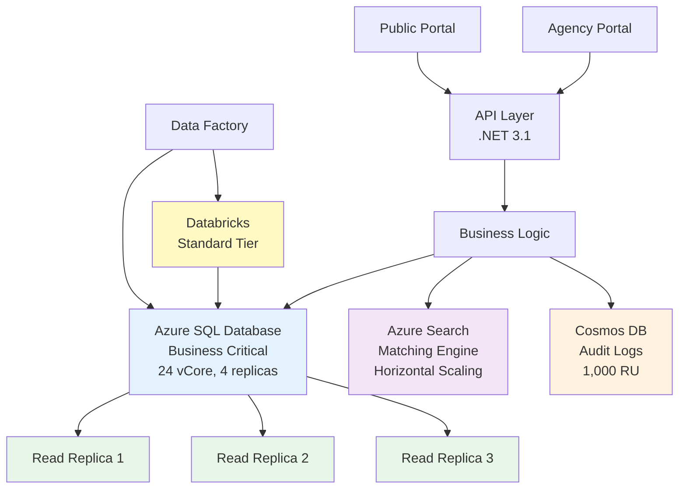
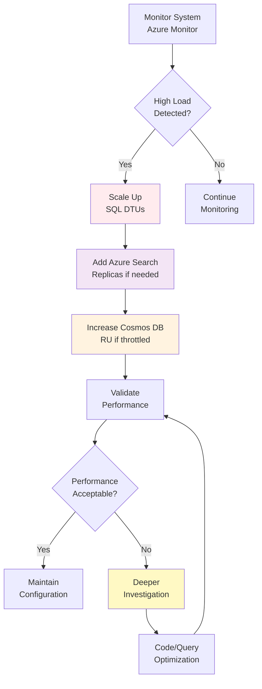

# ISWC System Performance Analysis and Optimization

**Document Version:** 1.1

**Date:** 2025-10-27

**Audit Status:** 🔴 **REQUIRES ACTION** - Performance baseline missing, infrastructure proposal pending evaluation

**Sources:**

- **Primary:** SPE_20190218_ISWCDataModel_REV (PM)
- **Secondary:** 20251021-ISWC - Discussion Yann_Guillaume_Bastien.txt, README.md
- **Tertiary:** 5 source code references found
- **Performance Proposition:** CISACAzureInfrastructureUpdate.md, PSA5499 Professional Services Agreement

---

## Table of Contents

1. [Executive Summary](#executive-summary)
2. [Next Steps & Action Items](#next-steps--action-items)
3. [SpanishPoint Performance Proposal Review](#spanishpoint-performance-proposal-review)
4. [Performance Investigation Plan](#performance-investigation-plan)
5. [Current Performance State](#current-performance-state)
6. [Original Architecture & Design](#original-architecture--design)
7. [Technical Details](#technical-details)
8. [References](#references)
9. [Document History](#document-history)
10. [Audit Notes](#audit-notes)

---

## Executive Summary

### Key Findings

**Performance Status:** The ISWC system is experiencing performance issues attributed to both infrastructure aging and application-level problems. A vendor proposal (SpanishPoint, PSA/5499) addresses infrastructure modernization but explicitly excludes application optimization.

**Critical Gap:** ⚠️ No performance baseline measurements exist, making it impossible to validate whether the proposed €74,201.85 infrastructure investment will address actual bottlenecks.

**Audit Context:** This analysis was created as part of the Teragone-Factory technical audit. The audit scope has shifted toward organizational aspects, and comprehensive technical performance investigation (profiling, bottleneck analysis) has not yet been conducted.

### Performance Issues Identified

1. **Infrastructure Aging:**
   - SQL Database: Business Critical tier (2019 architecture)
   - Public networking between components
   - Databricks: Standard tier with older VM SKUs
   - No WAF/security layers

2. **Application Issues:**
   - .NET 3.1 runtime (unsupported since 2022)
   - Code duplication and technical debt
   - Unknown query optimization status
   - Caching strategy unclear

3. **Data Volume Challenges:**
   - Cosmos DB: 822M+ audit log rows
   - Original 1,000 RU provisioning vs proposed 100,000-220,000 RU (100x increase unexplained)
   - Partitioning strategy effectiveness unknown

### SpanishPoint Proposal Summary

**Investment:** €39,658.05 (core) + €34,543.80 (optional WAF) = €74,201.85

**Monthly Impact:** -€1,800/month net savings (€3,300 database savings - €1,500 new costs)

**Key Changes:**

- SQL Database: Business Critical → Hyperscale
- Networking: Public → Private VNet architecture
- Databricks: Standard → Premium tier
- Optional: WAF implementation

**Critical Limitation:** Proposal states "Focus on infrastructure changes only, avoid application change" - may not address root causes if performance issues are application-level.

### Recommendation

🔴 **Do not approve infrastructure proposal without establishing performance baseline first.**

Recommended approach:

1. **Phase 0** (IMMEDIATE): Establish performance baseline (2-3 weeks)
2. **Phase 1**: Application-level performance audit (parallel to infrastructure planning)
3. **Phase 2**: Infrastructure modernization (SpanishPoint proposal, potentially modified)
4. **Phase 3**: Combined validation and optimization

---

## Next Steps & Action Items

### Immediate Actions

**Estimated Timeline:** 1-2 weeks

- [ ] **Establish Performance Baseline**
  - [ ] Deploy Application Performance Monitoring (APM) tool (e.g., Application Insights, New Relic)
  - [ ] Collect 1 week of metrics: API response times, database queries, Cosmos DB RU usage
  - [ ] Document P50, P95, P99 latencies for all major endpoints
  - [ ] Identify top 10 slowest operations

- [ ] **Request Data from SpanishPoint**
  - [ ] Actual Cosmos DB RU consumption (last 6 months)
  - [ ] SQL Database DTU utilization patterns
  - [ ] Azure Search query performance metrics
  - [ ] Databricks job execution times and patterns
  - [ ] Historical usage data referenced in proposal (charts)

- [ ] **Validate Proposal Assumptions**
  - [ ] Confirm reserved instance return/re-purchase terms with Microsoft
  - [ ] Get read replica utilization data (current 4 replicas)
  - [ ] Document any current network latency issues
  - [ ] Identify security incidents that WAF would have prevented

### Short-Term Investigation

**Estimated Timeline:** 2-4 weeks (can run in parallel with Immediate Actions)

- [ ] **Application Performance Audit**
  - [ ] SQL slow query log analysis (identify N+1 queries, missing indexes)
  - [ ] Code profiling: Identify CPU/memory hotspots
  - [ ] Review caching implementation and hit rates
  - [ ] Analyze async/await usage patterns
  - [ ] Check for connection pool exhaustion

- [ ] **Infrastructure Analysis**
  - [ ] Review Databricks job optimization opportunities
  - [ ] Analyze Cosmos DB partition distribution (hot partitions?)
  - [ ] Evaluate Azure Search index structure and query patterns
  - [ ] Measure current inter-component network latency

- [ ] **Cost-Benefit Analysis**
  - [ ] Model expected performance improvement per €
  - [ ] Compare infrastructure vs application optimization ROI
  - [ ] Evaluate phased rollout options

### Medium-Term Planning

**Estimated Timeline:** 2-3 months (after initial investigations complete)

- [ ] **Application Modernization Path**
  - [ ] Define .NET upgrade strategy (3.1 → 8.0 LTS)
  - [ ] Assess code refactoring priorities
  - [ ] Plan database query optimization sprints
  - [ ] Design improved caching strategy

- [ ] **Infrastructure Decision**
  - [ ] Revise SpanishPoint proposal based on baseline data
  - [ ] Negotiate phased implementation if needed
  - [ ] Define success criteria and rollback triggers
  - [ ] Establish performance SLAs

- [ ] **Testing Strategy**
  - [ ] Design load testing scenarios
  - [ ] Plan stress testing for infrastructure changes
  - [ ] Define production validation approach
  - [ ] Create rollback playbooks

---

## SpanishPoint Performance Proposal Review

### Proposal Overview

**Document:** CISAC Azure ISWC Infrastructure Update (PSA/5499)

**Vendor:** SpanishPoint (current ISWC system developer)

**Date:** March 31, 2025

**Total Cost:** €74,201.85

- Core infrastructure: €39,658.05 (48.5 days: 9 PM + 39.5 Dev)
- Optional WAF: €34,543.80 (43 days: 3 PM + 40 Dev)

**Monthly Recurring Impact:** -€1,800 net savings

**Approach:** Infrastructure modernization only, explicitly avoids application changes

---

### Detailed Component Analysis

#### 1. Database Migration: Business Critical → Hyperscale

**Status:** ✅ **RECOMMENDED** (with caveats)

> **From [Infrastructure Update Proposal](../../resources/performance_proposition/CISACAzureInfrastructureUpdate/CISACAzureInfrastructureUpdate/CISACAzureInfrastructureUpdate.md):** "Benefit from improved scalability and cost-effectiveness by utilizing the new hyperscale service tier of Azure SQL Database."

**Proposal Details:**

| Aspect | Current (Business Critical) | Proposed (Hyperscale) |
|--------|----------------------------|----------------------|
| Replicas | 4 (1 primary + 3 read-only) | 2 (1 primary + 1 secondary) |
| Licensing | Separate compute + SQL license | Bundled (35% discount) |
| Cost | Baseline | -€3,300/month |
| Performance | 24 vCore, 122.4 GB | "More cores at same price" |
| Migration | - | 1.25 days effort |

**Evaluation:**

✅ **Strengths:**

- Significant cost savings (€3,300/month = €39,600/year)
- Modern architecture with better scaling
- Cost savings enable vCore upgrade for better performance
- Hyperscale designed for large databases and high throughput

⚠️ **Concerns:**

- **Replica reduction (4→2):** May impact read workload distribution
- **Reserved instance dependency:** Savings assume successful return/re-purchase
- **No current utilization data:** Don't know if 4 replicas are actually needed
- **Production downtime:** Required during cutover

🔍 **Required Investigation:**

1. **Current read replica utilization:**
   - What % of read queries hit each replica?
   - What's the current read/write ratio?
   - Are 4 replicas necessary or over-provisioned?

2. **Performance benchmarks:**
   - Comparison: BC 24 vCore vs Hyperscale 20 vCore (cost-neutral)
   - Query execution time improvements expected?
   - Backup/restore time comparison (RPO/RTO impact)

3. **Feature parity:**
   - Are there Hyperscale limitations vs Business Critical for ISWC use cases?
   - Impact on existing maintenance jobs, indexing strategies?

4. **Reserved instance validation:**
   - Confirm return terms with Microsoft
   - Lock in pricing for re-purchase
   - Understand commitment period requirements

**Recommendation:** ✅ APPROVE with requirement to validate replica count needs first

**Risk Level:** 🟡 MEDIUM - Cost savings are significant, but replica reduction needs validation

---

#### 2. Network Architecture: Public → Private

**Status:** ✅ **RECOMMENDED** (security + performance benefit)

> **From [Infrastructure Update Proposal](../../resources/performance_proposition/CISACAzureInfrastructureUpdate/CISACAzureInfrastructureUpdate/CISACAzureInfrastructureUpdate.md):** "Switch component to component communication from public networking to private networking."

**Proposal Details:**

**Changes:**

- Hub/Shared VNet architecture
- Private endpoints for Azure SQL, Cosmos DB, Azure Search
- Private link connections between services
- VPN gateway for external admin access

**Cost Impact:**

- VPN Gateway: +€200/month
- Data Factory Managed VNet IR: +€500/month
- **Total: +€700/month**

**Evaluation:**

✅ **Strengths:**

- Enhanced security (compliance requirement)
- Reduced latency (Azure private backbone vs public internet)
- Modern cloud networking best practice
- Future-proofs architecture

⚠️ **Concerns:**

- Increased complexity (Hub/Spoke management)
- CI/CD requires private deployment agents (1 day setup)
- SSO/FastTrack IP allowlist changes needed
- Potential monitoring tool connectivity issues

🔍 **Required Investigation:**

1. **Latency baseline:**
   - Current inter-component latency measurements?
   - Expected improvement: public (X ms) → private (Y ms)?

2. **Network-related performance issues:**
   - Are there documented timeouts or slow responses due to networking?
   - Any external integration impacts (IPI, partners)?

3. **Monitoring/observability:**
   - Will existing monitoring tools work with private networking?
   - How to access logs, metrics, traces?

4. **Rollback complexity:**
   - Can we easily revert if issues arise?
   - Dual networking during transition possible?

**Recommendation:** ✅ APPROVE - Security and performance benefits outweigh complexity

**Risk Level:** 🟡 MEDIUM - Complexity increase, but manageable with proper planning

---

#### 3. Web Application Firewall (Optional)

**Status:** ⚠️ **DEFER** (Security feature, not performance-critical)

> **From [Infrastructure Update Proposal](../../resources/performance_proposition/CISACAzureInfrastructureUpdate/CISACAzureInfrastructureUpdate/CISACAzureInfrastructureUpdate.md):** "Add HTTP layer 7 web application firewall to protect all web traffic."

**Proposal Details:**

**Protected Components:**

- Public portal: 10 days OWASP tuning
- Agency portal: 15 days OWASP tuning
- APIs via APIM: 15 days OWASP tuning

**Cost:**

- Implementation: €34,543.80 (43 days)
- Recurring: +€600/month (Front Door + WAF)

**Evaluation:**

✅ **Strengths:**

- OWASP protection (SQL injection, XSS, etc.)
- DDoS protection
- SSL/TLS termination at edge
- Front Door CDN: Geographic performance optimization

⚠️ **Concerns:**

- **Marked "Optional"** in proposal - not critical for performance goals
- **High implementation cost** (€34,543.80 for security feature)
- **40 days tuning effort** - significant for 3 portals/APIs
- **False positive risk** during tuning (user impact)
- **Performance overhead** of WAF inspection

🔍 **Required Investigation:**

1. **Security justification:**
   - Have there been security incidents?
   - Is WAF a compliance requirement?
   - Risk assessment: current security posture

2. **Performance impact:**
   - What latency does WAF inspection add (typical: 10-50ms)?
   - Does Front Door CDN caching offset WAF overhead?
   - Static asset caching benefits?

3. **Phased rollout:**
   - Can we start with public portal only (10 days)?
   - Validate benefits before expanding?

4. **Alternatives:**
   - Azure Front Door without WAF (CDN benefits, lower cost)?
   - API Management policies for basic protection?

**Recommendation:** ⚠️ DEFER - Evaluate as separate security initiative, not performance optimization

**Risk Level:** 🟢 LOW - Can be added later if security audit requires

---

#### 4. Databricks Optimization

**Status:** 🟡 **CONDITIONAL APPROVAL** (Depends on workload analysis)

> **From [Infrastructure Update Proposal](../../resources/performance_proposition/CISACAzureInfrastructureUpdate/CISACAzureInfrastructureUpdate/CISACAzureInfrastructureUpdate.md):** "Databricks standard to premium"

**Proposal Details:**

**Changes:**

- Standard → Premium tier: +€200/month
- Cluster VM: Upgrade to latest hardware
- Reserved Instance option: 40-41% discount (if workload stable)
- Pre-purchase DBCU: 4-6% discount

**Caution from Proposal:**
> "If workload or application logic changes, then do not purchase reserved instances"

**Evaluation:**

✅ **Strengths:**

- Premium features: RBAC, audit logging, data encryption
- Latest hardware: Better CPU/memory performance
- Significant savings if workload stable (40% with reservations)

⚠️ **Concerns:**

- **"Databricks recreation" required:** 4 days ISWC + 2 days Matching Engine
- **Proposal itself cautions** against reservations if workload changes
- **Standard → Premium:** May not directly improve performance
- **No performance benchmarks** showing actual improvement

🔍 **Required Investigation:**

1. **Current Databricks performance issues:**
   - Which jobs are slow?
   - Are there actual performance problems or just theoretical?
   - Job duration trends over past 6 months

2. **Premium feature needs:**
   - Which Premium features does ISWC actually require?
   - Can we achieve performance goals without Premium?

3. **Workload stability:**
   - How stable has Databricks workload been?
   - Any upcoming changes (IPI integration modifications, new processes)?

4. **"Databricks recreation" scope:**
   - What exactly needs to be recreated?
   - Data migration required?
   - Risk of configuration loss?

5. **Alternative optimizations:**
   - Can existing jobs be optimized (code, partitioning)?
   - Cluster sizing/autoscaling tuning?

**Recommendation:** 🟡 CONDITIONAL - Approve Standard→Premium, but defer reserved instances until workload analyzed

**Risk Level:** 🟡 MEDIUM - Tier upgrade low risk, but "recreation" needs clarity

---

#### 5. Cosmos DB Optimization

**Status:** 🔴 **REQUIRES INVESTIGATION** (100x scale increase unexplained)

> **From [Infrastructure Update Proposal](../../resources/performance_proposition/CISACAzureInfrastructureUpdate/CISACAzureInfrastructureUpdate/CISACAzureInfrastructureUpdate.md):** "Reserved Instance: 1 Year with monthly payment"

**Proposal Details:**

**Changes:**

- Reserved capacity: 1-year commitment
- 20% discount on RU/s provisioning
- Range: 100,000 - 220,000 RU/s options

**Current vs Proposed:**

| Metric | Original Design (2019) | Proposed (2025) | Change |
|--------|----------------------|----------------|--------|
| RU/s | 1,000 | 100,000 - 220,000 | **100-220x** |
| Data volume | 822M rows (planned) | Unknown (actual) | ? |
| Partitioning | SocietyCode + CreatedDate | Unknown if optimized | ? |

**Evaluation:**

✅ **Strengths:**

- 20% cost savings with 1-year reservation
- Monthly payment option (lower upfront)
- Scalable options

🔴 **Critical Issues:**

1. **100-220x increase UNEXPLAINED**
   - No justification for massive scale-up
   - Could indicate:
     - Original design severely under-provisioned
     - Actual usage unknown, so over-provisioning
     - Audit data volume exceeded expectations
     - Inefficient queries causing high RU consumption

2. **Historical usage charts referenced but NOT analyzed**
   - Proposal mentions charts but provides no analysis
   - What is actual current consumption?

3. **No partitioning strategy review**
   - Current partitioning: SocietyCode + CreatedDate
   - Are there hot partitions?
   - Could optimization reduce RU needs?

4. **No archival strategy discussed**
   - 822M+ rows and growing
   - Should old audit data be archived?
   - Would reduce active dataset and RU needs

🔍 **Required Investigation (HIGH PRIORITY):**

1. **Actual current Cosmos DB metrics:**
   - What is real RU consumption (P50, P95, P99)?
   - Are we throttled (HTTP 429 errors)?
   - Current provisioned RU vs consumed

2. **Partition analysis:**
   - Partition distribution (are partitions balanced)?
   - Hot partition identification
   - Query patterns review

3. **Audit data growth:**
   - Current row count vs original 822M estimate
   - Growth rate per month/year
   - Largest partitions (which societies?)

4. **Optimization opportunities:**
   - Can queries be optimized (indexed properties)?
   - Is partitioning strategy optimal?
   - Archival policy: Move data >2 years to cold storage?

5. **Right-sizing:**
   - What RU level actually needed (based on data, not guessing)?
   - Start with 20,000 RU, scale up if needed?
   - Autoscale vs provisioned throughput?

**Recommendation:** 🔴 DO NOT APPROVE without actual usage data and investigation

**Risk Level:** 🔴 HIGH - 100x increase without justification suggests proposal based on guesswork, not data

---

### Overall Proposal Assessment

#### Cost Summary

**Monthly Recurring:**

| Item                        | Change    | Amount     | Priority |
|-----------------------------|-----------|------------|----------|
| SQL Database (BC→Hyperscale)| Decrease  | -€3,300    | HIGH     |
| Front Door/WAF              | Increase  | +€600      | LOW (Defer) |
| VPN Gateway                 | Increase  | +€200      | HIGH     |
| Databricks (Std→Premium)    | Increase  | +€200      | MEDIUM   |
| Data Factory (Managed VNet) | Increase  | +€500      | HIGH     |
| **Net Monthly (if all approved)** |   | **-€1,800**| |
| **Net Monthly (defer WAF)** |          | **-€2,400**| |

**One-Time Implementation:**

| Item                   | Cost        | Recommendation |
|------------------------|-------------|----------------|
| Core infrastructure    | €39,658.05  | Conditional approval |
| Optional WAF           | €34,543.80  | Defer |
| **Recommended total**  | **€39,658.05** | |

#### Strategic Assessment

✅ **Alignment with Performance Goals:**

1. **Cost-Performance Balance:** Net savings enable reinvestment in application optimization
2. **Modern Architecture:** Azure Hyperscale and private networking are current best practices
3. **Security Enhancement:** Private networking addresses compliance needs
4. **Scalability Foundation:** Better positioned for future growth

🔴 **Critical Gaps:**

1. **No Performance Baseline:** Cannot measure success without "before" metrics
2. **"Infrastructure Changes Only":** Application-level issues (.NET 3.1, code quality) not addressed
3. **No Root Cause Analysis:** Proposal assumes infrastructure is the problem
4. **Minimal Risk Assessment:** Downtime estimates but no rollback playbooks
5. **Guesswork on Cosmos DB:** 100x scale increase without actual usage data

⚠️ **Key Concerns:**

**Proposal states:**
> "Focus on infrastructure changes only, avoid application change."

**But meetings reveal:**
> "Performance becoming inadequate from a technology perspective... .NET 3.1 unsupported since 2022"

**This disconnect means:**

- Infrastructure modernization may not fix performance if issues are application-level
- €74K investment might deliver security/cost benefits but miss performance goals
- Two-track approach needed: Infrastructure (SpanishPoint) + Application audit (separate)

#### Recommended Approval Strategy

**Phase 0: Performance Baseline (2-3 weeks) - REQUIRED BEFORE APPROVAL**

❗ DO NOT PROCEED WITHOUT THIS

- Establish comprehensive performance baseline
- Collect actual Cosmos DB usage data
- Validate SQL read replica utilization
- Measure network latency between components

**Phase 1: Core Infrastructure (Approve with conditions)**

✅ **Approve:**

- SQL Hyperscale migration: €3,300/month savings, modern architecture
- Private networking: €700/month cost, but security + performance benefit
- VPN Gateway: Required for private networking
- Data Factory Managed VNet: Required for private networking

🟡 **Conditional Approve:**

- Databricks Standard→Premium: Only if current performance issues documented
- Databricks Reserved Instances: Only after workload stability confirmed

🔴 **Do NOT Approve (requires investigation):**

- Cosmos DB scaling: Requires actual usage data and optimization analysis

⚠️ **Defer (separate decision):**

- WAF implementation: Evaluate as security initiative, not performance

**Phase 2: Application Performance Audit (Parallel to infrastructure)**

- .NET upgrade path assessment
- Code profiling and optimization
- Database query tuning
- Caching strategy improvement

**Phase 3: Validation & Iteration**

- Post-migration performance validation
- Adjust Cosmos DB provisioning based on actual data
- Iterative optimization based on new baseline

#### Success Criteria

Define clear metrics before proceeding:

**Performance SLAs:**

- API P95 response time: < 500ms
- Portal page load: < 2s
- Bulk submission processing: X submissions/hour
- Database query P99: < 1s

**Cost Targets:**

- Monthly infrastructure cost reduction: €1,800+
- ROI timeline: < 24 months

**Availability:**

- Uptime: 99.9%
- Maximum planned downtime: 4 hours/quarter

---

## Performance Investigation Plan

### Investigation Areas

This section outlines specific investigations needed to establish performance baseline and identify optimization opportunities.

**Each investigation includes:**

- **📊 Investigation Type:** Whether it's read-only observation or requires modifications
- **🎯 Priority:** Using MoSCoW prioritization
  - 🔴 **MUST HAVE** - Critical for decision-making
  - 🟡 **SHOULD HAVE** - Important but not blocking
  - 🟢 **COULD HAVE** - Nice to have
  - ⚪ **WON'T HAVE** - Out of scope
- **👥 Expertise Required:** What skills/knowledge are needed
- **⚠️ Production Risk:** Impact on live system
  - 🟢 **SAFE** - No risk, read-only
  - 🟡 **LOW RISK** - Minor changes, reversible
  - 🟠 **MEDIUM RISK** - Requires careful planning
  - 🔴 **HIGH RISK** - Potential downtime/impact
- **💰 Additional Costs:** Any expenses beyond current infrastructure

---

### 1. Infrastructure Performance Investigation

#### SQL Database Analysis

**Objective:** Understand actual database performance and bottlenecks

**Investigation Type:** 📊 Observation (read-only analysis)

**Priority:** 🔴 MUST HAVE - Required before infrastructure decision

**Expertise Required:** Infrastructure / Database Administration

**Production Risk:** 🟢 **SAFE**

- No modifications to production
- Read-only queries via Azure Portal/Monitor
- Query Store has minimal performance impact (<5%)
- Can be performed during business hours

**Additional Costs:** None (uses existing Azure Monitor)

**Tasks:**

- [ ] **Enable SQL Query Store** (if not already enabled)
  - Capture query execution statistics
  - Identify top 20 queries by: CPU time, duration, execution count

- [ ] **Analyze slow query log**
  - Queries taking > 1 second
  - Identify missing indexes (Index recommendations in Azure portal)
  - Find table scans, key lookups

- [ ] **Monitor DTU utilization**
  - Collect 1 week of metrics: CPU %, Data IO %, Log IO %
  - Identify peak usage patterns
  - Determine if current tier is bottleneck or over-provisioned

- [ ] **Read replica utilization**
  - What % of queries go to read replicas vs primary?
  - Are replicas evenly distributed or some idle?
  - Could we reduce from 4 to 2 replicas without impact?

**Expected Output:**

- List of top 10 slow queries with optimization recommendations
- DTU utilization charts (peak, average, minimum)
- Read replica distribution analysis
- Index recommendations

**Effort:** 3-5 days

---

#### Cosmos DB Analysis

**Objective:** Understand actual RU consumption and optimization opportunities

**Investigation Type:** 📊 Observation (read-only analysis)

**Priority:** 🔴 MUST HAVE - Critical for proposal evaluation (100x RU increase unexplained)

**Expertise Required:** Infrastructure / NoSQL Database / Azure Cosmos DB

**Production Risk:** 🟢 **SAFE**

- Read-only metrics collection via Azure Monitor
- No production changes
- Portal queries have no performance impact
- Can analyze partition distribution without disruption

**Additional Costs:** None (uses existing Azure Monitor)

**Tasks:**

- [ ] **Collect RU metrics** (Azure Monitor)
  - Current provisioned RU/s
  - Actual consumed RU/s (P50, P95, P99)
  - Throttling events (HTTP 429 count)
  - Storage size per partition

- [ ] **Partition analysis**
  - List top 10 largest partitions
  - Identify hot partitions (disproportionate RU usage)
  - Check partition key cardinality

- [ ] **Query pattern review**
  - Most expensive queries by RU charge
  - Cross-partition queries (inefficient)
  - Index usage analysis

- [ ] **Data growth analysis**
  - Current total row count vs 822M baseline
  - Growth rate per month
  - Largest societies by data volume

- [ ] **Archival opportunity**
  - How much data is > 2 years old?
  - Query patterns: How often is old data accessed?
  - Cost: Active vs archived storage

**Expected Output:**

- Actual RU consumption report with recommendation (X RU/s needed, not 100K-220K guess)
- Partition rebalancing recommendations if hot partitions found
- Archival strategy proposal with cost savings estimate

**Effort:** 5-7 days

---

#### Azure Search Performance

**Objective:** Understand Matching Engine search performance

**Investigation Type:** 📊 Observation (read-only analysis)

**Priority:** 🟡 SHOULD HAVE - Important for matching engine optimization

**Expertise Required:** Infrastructure / Search Technology / Azure Cognitive Search

**Production Risk:** 🟢 **SAFE**

- Metrics collection via Azure Portal
- No modifications to search service
- Analytics queries are read-only
- No impact on search availability

**Additional Costs:** None (uses existing Azure Monitor)

**Tasks:**

- [ ] **Query performance metrics**
  - Average query duration
  - Queries per second (QPS) during peak
  - Index size and document count

- [ ] **Index analysis**
  - Are indexes optimal for common queries?
  - Scoring profile performance
  - Suggest field optimization

- [ ] **Scaling assessment**
  - Current replica/partition count
  - Is horizontal scaling needed?

**Expected Output:**

- Search performance baseline
- Optimization recommendations

**Effort:** 2-3 days

---

#### Network Latency Baseline

**Objective:** Measure current inter-component latency

**Investigation Type:** 📊 Observation (network measurements)

**Priority:** 🔴 MUST HAVE - Validates private networking ROI (€700/month cost)

**Expertise Required:** Infrastructure / Networking / Azure Architecture

**Production Risk:** 🟢 **SAFE**

- Passive network monitoring
- Can use Application Insights dependency tracking
- Ping/traceroute tests have negligible impact
- No configuration changes required

**Additional Costs:** None (uses existing monitoring tools)

**Tasks:**

- [ ] **Measure component-to-component latency**
  - API → SQL Database
  - API → Cosmos DB
  - API → Azure Search
  - Databricks → SQL Database
  - Data Factory → all services

- [ ] **Identify latency hotspots**
  - Are there slow connections?
  - Geographic latency issues?
  - Timeout errors in logs?

**Expected Output:**

- Latency matrix (all component pairs)
- Estimate improvement with private networking

**Effort:** 2-3 days

---

### 2. Application Performance Investigation

#### API Performance Analysis

**Objective:** Identify slow API endpoints and optimization opportunities

**Investigation Type:** 🔧 Requires APM tool deployment (Application Insights)

**Priority:** 🔴 MUST HAVE - Critical baseline for performance validation

**Expertise Required:** Application Development / .NET / Performance Engineering

**Production Risk:** 🟡 **LOW RISK**

- Requires deploying Application Insights SDK (minor code change)
- Performance overhead: <1% typically
- **Recommended:** Deploy to non-production first, validate impact
- Can be enabled/disabled via configuration
- **Deployment window:** Off-peak hours recommended

**Additional Costs:** ⚠️ Application Insights charges apply

- Estimated: €50-200/month depending on traffic volume
- First 5GB/month included free
- Can set daily cap to control costs

**Tasks:**

- [ ] **Deploy APM tool** (Application Insights recommended for Azure)
  - Instrument all API controllers
  - Capture request/response times
  - Track dependencies (DB, search, external calls)

- [ ] **Identify slow endpoints**
  - P95 response time > 500ms
  - P99 response time > 1s
  - Timeout errors

- [ ] **Analyze slow endpoint details**
  - Time spent in: Application code, database queries, external calls
  - Memory allocation patterns
  - Exception frequency

- [ ] **N+1 query detection**
  - Entity Framework/ORM query patterns
  - Find loops that trigger individual queries
  - Suggest batch loading

**Expected Output:**

- Top 20 slowest endpoints with breakdown
- N+1 query locations with fix recommendations
- Memory leak suspects

**Effort:** 5-7 days

---

#### Caching Strategy Review

**Objective:** Assess current caching implementation and improvements

**Investigation Type:** 📊 Observation (code review + metrics analysis)

**Priority:** 🟡 SHOULD HAVE - Can improve performance with low effort

**Expertise Required:** Application Development / .NET / Caching Strategies

**Production Risk:** 🟢 **SAFE**

- Code review only (no modifications)
- Metrics collection via Application Insights (if deployed)
- Analysis of existing cache implementations
- No production changes during investigation

**Additional Costs:** None (uses existing monitoring)

**Tasks:**

- [ ] **Identify current caching**
  - What is cached? (lookup tables, reference data)
  - Cache implementation: In-memory, Redis, distributed?
  - Cache expiration strategies

- [ ] **Measure cache effectiveness**
  - Hit rate per cache
  - Cache memory usage
  - Stale data issues

- [ ] **Identify caching opportunities**
  - Frequently queried data not cached
  - Static data queried repeatedly
  - Session state handling

**Expected Output:**

- Cache hit rate report
- Recommendations for additional caching
- Cache sizing recommendations

**Effort:** 3-4 days

---

#### Database Query Optimization

**Objective:** Optimize application database access patterns

**Investigation Type:** 📊 Observation (code analysis + SQL profiling)

**Priority:** 🔴 MUST HAVE - Often the highest ROI performance improvement

**Expertise Required:** Application Development / Entity Framework / SQL Optimization

**Production Risk:** 🟢 **SAFE** (investigation phase)

- Code review and static analysis
- SQL profiling via Query Store (read-only)
- Entity Framework query logging (minimal overhead)
- No query modifications during investigation

**Additional Costs:** None

**Note:** 🔧 Implementing fixes will require code changes (separate phase)

**Tasks:**

- [ ] **Review Entity Framework queries**
  - Identify Select N+1 patterns
  - Lazy loading vs eager loading usage
  - Overfetching (SELECT * when few columns needed)

- [ ] **Analyze connection pooling**
  - Connection pool size
  - Connection exhaustion events
  - Long-lived connections

- [ ] **Transaction scope analysis**
  - Transaction duration
  - Deadlock frequency
  - Lock escalation

**Expected Output:**

- Query optimization recommendations (top 10)
- Connection pooling tuning
- Transaction scope improvements

**Effort:** 5-7 days

---

#### .NET Runtime Assessment

**Objective:** Evaluate impact of .NET 3.1 and upgrade path

**Investigation Type:** 📊 Observation (research + compatibility analysis)

**Priority:** 🟡 SHOULD HAVE - Important for long-term maintainability

**Expertise Required:** Application Development / .NET Architecture / Migration Planning

**Production Risk:** 🟢 **SAFE** (research phase only)

- Documentation review
- Compatibility testing in non-production
- Third-party library assessment
- No production changes during investigation

**Additional Costs:** None (research phase)

**Future Cost Consideration:** 🔧 Actual .NET upgrade will require:

- Development effort (estimated 4-8 weeks)
- Testing cycles
- Deployment coordination
- Potential third-party library updates

**Tasks:**

- [ ] **Document .NET 3.1 impact**
  - Known performance issues in 3.1
  - Features missing (vs .NET 8.0)
  - Security vulnerabilities

- [ ] **Assess upgrade complexity**
  - Breaking changes 3.1 → 6.0 → 8.0
  - Third-party library compatibility
  - Effort estimate

- [ ] **Estimate performance improvement**
  - Benchmark common operations: 3.1 vs 8.0
  - GC improvements, JIT improvements
  - Expected throughput increase

**Expected Output:**

- .NET upgrade business case (cost, effort, benefit)
- Migration roadmap
- Risk assessment

**Effort:** 5-7 days

---

### 3. Databricks Performance Investigation

#### Job Performance Analysis

**Objective:** Identify slow Databricks jobs and optimization opportunities

**Investigation Type:** 📊 Observation (metrics analysis + job profiling)

**Priority:** 🟡 SHOULD HAVE - Depends on whether Databricks issues exist

**Expertise Required:** Data Engineering / Apache Spark / Databricks / Python/Scala

**Production Risk:** 🟢 **SAFE**

- Read-only access to Databricks workspace
- Job metrics via Databricks UI/API
- Spark UI analysis (historical runs)
- No job modifications during investigation
- Can analyze without impacting running jobs

**Additional Costs:** None (uses existing Databricks metrics)

**Tasks:**

- [ ] **Collect job metrics** (last 3 months)
  - Job duration trends
  - Cluster utilization (CPU, memory, I/O)
  - Data volume processed per job

- [ ] **Identify slow jobs**
  - Jobs with duration > X (define threshold)
  - Jobs with increasing duration trend
  - Failed jobs due to resource constraints

- [ ] **Analyze job inefficiencies**
  - Shuffle operations (data movement)
  - Spill to disk (memory pressure)
  - Skewed partitions (uneven data distribution)
  - Small file problem

- [ ] **Review cluster configuration**
  - Worker node count and type
  - Autoscaling configuration
  - Driver node sizing
  - Spark configuration parameters

**Expected Output:**

- Top 10 jobs for optimization with specific recommendations
- Cluster sizing recommendations
- Spark tuning parameters

**Effort:** 7-10 days

---

### Investigation Timeline & Priorities

**Priority 1: Critical Investigations**

**Purpose:** Required before making infrastructure decision

**Estimated Effort:**

- SQL Database DTU utilization: 3-5 days
- Cosmos DB actual RU consumption: 5-7 days
- API performance baseline: 5-7 days

**Priority 2: Supporting Analysis**

**Purpose:** Can run in parallel with Priority 1 investigations

**Estimated Effort:**

- Network latency baseline: 2-3 days
- Database slow query analysis: 3-5 days
- Caching review: 3-4 days

**Priority 3: Long-Term Optimization**

**Purpose:** Parallel to infrastructure changes if approved

**Estimated Effort:**

- .NET upgrade assessment: 5-7 days
- Databricks optimization: 7-10 days
- Application code optimization: ongoing

**Total Estimated Effort:** 40-60 person-days

**Suggested Resource Allocation:**

- 1 person: 6-9 weeks
- 2 people: 3-4 weeks

---

## Current Performance State

### Performance Issues Overview

Based on available documentation and meeting discussions, the ISWC system is experiencing performance degradation. However, **specific metrics are not documented**, making it impossible to quantify the severity or validate proposed solutions.

### Known Issues

1. **Infrastructure Aging (2019 → 2025):**
   - SQL Database: Business Critical tier from original design
   - Azure services evolution: Better options available (Hyperscale)
   - Public networking: All component communication over internet
   - No WAF/security layers: Modern requirement missing

2. **Application-Level Issues:**

> **From [Yann Discussion](../../meetings/20251021-ISWC%20-%20Discussion%20Yann_Guillaume_Bastien.txt) (17:25, Yann Lebreuilly):** "Je pense qu'ils ont fait un certain enrobage pour nous à un moment qui est devenu obsolète, je pense, d'un point de vue techno, d'un point de vue performance... ils se sont aperçus que sur notre application, les performances devenaient plus assez bonnes"

Translation: "I think they created a certain wrapper for us at one point that became obsolete from a technology and performance perspective... they realized that the performance of our application was no longer good enough"

**Specific issues identified:**

- .NET 3.1 runtime (unsupported since 2022)
- Code duplication and technical debt
- Performance degradation over time
- Architectural limitations preventing improvements

3. **Data Volume Challenges:**
   - Cosmos DB: 822M+ audit log rows
   - Manual table partitioning previously required (SQL)
   - Cosmos DB partitioning strategy: SocietyCode + CreatedDate
   - Unknown if optimal or causing hot partitions

### Performance Bottleneck Hypotheses

**Based on SpanishPoint proposal (not validated with data):**

1. **Database tier limitations:** Business Critical cost vs performance tradeoff
2. **Public networking latency:** Component communication over public internet
3. **Databricks limitations:** Standard tier, older VM SKUs
4. **Cosmos DB provisioning:** Fixed 1,000 RU may be insufficient
5. **Lack of caching:** Unknown caching strategy effectiveness

### Critical Gap: Missing Baseline

⚠️ **No documented performance baseline exists:**

- No API response time benchmarks
- No database query performance data (slow query log)
- No Cosmos DB actual RU consumption metrics
- No Databricks job duration baselines
- No network latency measurements
- No user-reported performance issues documented

**Impact:** Cannot evaluate SpanishPoint proposal effectiveness without knowing current state.

---

## Original Architecture & Design

### Design Philosophy (2019)

The ISWC system was designed with performance considerations focused on:

1. **Horizontal Scalability:** Azure Search for matching/validation operations
2. **Vertical Scalability:** SQL Server Business Critical tier with adjustable DTUs
3. **Data Volume Management:** Cosmos DB for high-volume audit logs
4. **Redundancy:** Read replicas for query distribution

> **From [Data Model Spec](../../resources/core_design_documents/SPE_20190218_ISWCDataModel_REV%20%28PM%29/SPE_20190218_ISWCDataModel_REV%20%28PM%29.md) → Section "Scalability":** "All core submission matching and validation will be carried out against Azure Search indices which are horizontally scalable."

---

### Database Layer (Original Design)

#### Azure SQL Database - Business Critical Tier

> **From [Data Model Spec](../../resources/core_design_documents/SPE_20190218_ISWCDataModel_REV%20%28PM%29/SPE_20190218_ISWCDataModel_REV%20%28PM%29.md) → Section "Initial configuration of SQL Server":** "Managed instance of Azure SQL Server. This will be initially configured as a Gen 5 Business Critical database (vCore 24, Memory 122.4 GB)"

**Configuration:**

- **Tier:** Business Critical (Gen 5)
- **Compute:** vCore 24, Memory 122.4 GB
- **Replicas:** 4 total (1 primary + 3 read-only)
- **Scalability:** DTUs adjustable based on workload
- **Cost Model:** Compute (includes 4 replicas) + SQL License + Storage + Backup

**Purpose:**

- Handle ISWC, IPI, and Lookup schemas
- Read-only replica for query workloads
- Peak/quiet period workload adjustment

---

#### Cosmos DB for Audit Data

> **From [Data Model Spec](../../resources/core_design_documents/SPE_20190218_ISWCDataModel_REV%20%28PM%29/SPE_20190218_ISWCDataModel_REV%20%28PM%29.md) → Section "Scaling for large data volumes":** "Log data, however, currently has 822 million rows in the existing database and has had to be manually partitioned across multiple tables for performance and maintenance reasons. In the new solution this audit data will be stored in Cosmos DB using the Society Code and Created Date as a partition key."

**Configuration:**

- **Initial Provisioning:** 1,000 RU (Request Units)
- **Partition Strategy:** `{SocietyCode}_{CreatedDate}`
- **Data Volume:** 822M+ rows (from legacy system)

**Purpose:**

- Handle massive audit log volume that required manual SQL partitioning
- Eliminate manual partition management
- Enable efficient society-specific and date-range queries

---

#### Azure Search (Matching Engine)

**Configuration:**

- **Technology:** Apache Lucene-based search service
- **Scalability:** Horizontal scaling (additional replicas/partitions)
- **Data Sync:** Continuous synchronization from Azure SQL
- **Use Case:** Matching Engine operations, submission validation

**Purpose:**

- Enable scalable full-text search and querying
- Handle matching logic without overloading main database
- Support concurrent matching operations

---

### High-Level Architecture

---

### Scalability Mechanisms (2019 Design)

1. **Horizontal Scaling:**
   - Azure Search: Add replicas for query scale, partitions for data scale
   - Web tier: Multiple API instances behind load balancer

2. **Vertical Scaling:**
   - SQL Database: DTU adjustment based on workload
   - Databricks: Cluster size adjustment

3. **Read Distribution:**
   - 3 read-only SQL replicas for query workloads
   - Reduces load on primary for write-heavy operations

4. **Data Partitioning:**
   - Cosmos DB: Automatic partitioning by SocietyCode + CreatedDate
   - Eliminates manual SQL table partitioning

---

## Technical Details

### File/Data Formats

**Azure SQL Database:**

- Connection strings: Azure Key Vault
- Configuration: vCore, tier, replica count
- DTU settings: Scalable (current: 24 vCore)

**Cosmos DB:**

- Partition key: `{SocietyCode}_{CreatedDate}`
- Request Units: Provisioned throughput (RU/s)
- Consistency level: Configurable
- Original: 1,000 RU provisioned

**Azure Search:**

- Index schema: Synced from SQL
- Search config: Lucene full-text
- Scaling: Horizontal partitions/replicas

---

### Integration with Other Components

**Upstream Dependencies:**

- **Databricks:** Processing pipeline performance affects system throughput
- **Azure Data Factory:** Orchestration efficiency impacts batch operations
- **Matching Engine:** Azure Search indexing speed affects submissions
- **IPI Integration:** External data loads affect database performance

**Downstream Dependencies:**

- **Agency Portal:** User experience affected by API response times
- **Public Portal:** Search performance affects public users
- **Reporting:** Query performance affects report generation
- **Audit System:** Cosmos DB performance affects log access

**Related Documentation:**

- [Databricks](../components/iswc-platform/databricks.md) - Processing engine
- [Cosmos DB](../components/iswc-platform/cosmos-db.md) - Audit storage
- [ISWC Agency Portal](../components/iswc-platform/agency-portal.md) - User interface

---

### Use Cases

1. **High-Volume Submission Processing:**
   - Bulk submissions from societies
   - Matching Engine at scale
   - Validation against large indices

2. **Concurrent User Access:**
   - Multiple agencies accessing portal
   - Read-heavy workloads to replicas
   - Search queries across millions of works

3. **Large-Scale Audit Queries:**
   - Historical log retrieval (822M+ rows)
   - Society-specific reports
   - Date-range compliance queries

4. **Peak Workload Management:**
   - DTU scaling during peak periods
   - Elastic Azure Search scaling
   - Cosmos DB throughput adjustment

---

### Performance Scaling Workflow

---

### Error Handling Mechanisms

**SQL Database Throttling:**

- Monitor DTU percentage via Azure Monitor
- Auto-scale if configured
- Alert on sustained high utilization (>80%)

**Cosmos DB Throttling:**

- HTTP 429 responses (rate limiting)
- Application retry logic with exponential backoff
- Consider increasing provisioned RU/s if persistent

**Azure Search Throttling:**

- Query throttling at high concurrency
- Consider additional replicas for read scale
- Optimize query patterns (filtering, field selection)

---

### Source Code References

**Performance-Related Code:**

**Caching and Optimization:**

- [AuditController.cs](../../resources/source-code/ISWC/src/Api.Label/Controllers/AuditController.cs) - Async operations for audit API
- [LookupController.cs](../../resources/source-code/ISWC/src/Api.Label/Controllers/LookupController.cs) - Lookup caching strategies
- [ServiceCollectionExtensions.cs](../../resources/source-code/ISWC/src/Api.Label/Extensions/ServiceCollectionExtensions.cs) - DI configuration
- [PipelineManager.cs](../../resources/source-code/ISWC/src/Api.Label/Managers/PipelineManager.cs) - Async pipeline processing

**Business Logic:**

- [AgencyManager.cs](../../resources/source-code/ISWC/src/Business/Managers/AgencyManager.cs) - Agency operations (async)
- [AuditManager.cs](../../resources/source-code/ISWC/src/Business/Managers/AuditManager.cs) - Audit log management
- [DatabaseMaintenanceManager.cs](../../resources/source-code/ISWC/src/Business/Managers/DatabaseMaintenanceManager.cs) - Index optimization

**Matching Engine:**

- [PerformanceForeign.cs](../../resources/source-code/ISWC/src/Data/Services/Matching/MatchingEngine/Entities/PerformanceForeign.cs) - Performance data entities
- [PerformanceNumber.cs](../../resources/source-code/ISWC/src/Data/Services/Matching/MatchingEngine/Entities/PerformanceNumber.cs) - Performance identifiers

**Key Patterns:**

- Async/await throughout codebase
- Dependency injection for services
- Manager pattern for business logic
- Repository pattern for data access

---

## References

### Core Design Documents

- **[SPE_20190218_ISWCDataModel_REV (PM)](../../resources/core_design_documents/SPE_20190218_ISWCDataModel_REV%20%28PM%29/SPE_20190218_ISWCDataModel_REV%20%28PM%29.md) → Sections "Scalability", "Scaling for large data volumes", "Initial configuration of SQL Server"** - Original performance architecture and database sizing

### Meeting Transcripts

- **[20251021-ISWC - Discussion Yann_Guillaume_Bastien.txt](../../meetings/20251021-ISWC%20-%20Discussion%20Yann_Guillaume_Bastien.txt) (17:25, Yann Lebreuilly)** - Performance degradation and technical obsolescence discussion
- **[20251021-ISWC - Discussion Yann_Guillaume_Bastien.txt](../../meetings/20251021-ISWC%20-%20Discussion%20Yann_Guillaume_Bastien.txt) (42:40, Bastien Gallay, Teragone-Factory)** - Audit scope observation (organizational vs technical focus)
- **[README.md](../../../meetings/README.md)** - Notes "System performance and cost issues"

### Performance Proposition Documents

- **[CISACAzureInfrastructureUpdate.md](../../resources/performance_proposition/CISACAzureInfrastructureUpdate/CISACAzureInfrastructureUpdate/CISACAzureInfrastructureUpdate.md)** - Infrastructure modernization proposal
- **[PSA5499_CISAC Azure ISWC Infrastructure Update_20253103.md](../../resources/performance_proposition/PSA5499_CISAC%20Azure%20ISWC%20Infrastructure%20Update_20253103/PSA5499_CISAC%20Azure%20ISWC%20Infrastructure%20Update_20253103/PSA5499_CISAC%20Azure%20ISWC%20Infrastructure%20Update_20253103.md)** - Professional services agreement

### Architecture Diagrams

- Section "Original Architecture & Design": High-Level Architecture diagram
- Section "Technical Details": Performance Scaling Workflow diagram
- SpanishPoint Proposal: Multiple architecture diagrams (embedded images)

---

## Document History

| Version | Date       | Author             | Changes                                                  |
|---------|------------|--------------------|----------------------------------------------------------|
| 1.0     | 2025-10-27 | Claude (Audit)     | Initial performance analysis and documentation           |
| 1.1     | 2025-10-27 | Claude (Audit)     | Restructured for audit usability: Added Executive Summary, Next Steps, Investigation Plan sections. Reorganized proposal review for clarity. |

---

## Audit Notes

**Document Purpose:** This performance analysis was created as part of the Teragone-Factory technical audit of the ISWC system.

**Audit Context:**

> **From [Yann Discussion](../../meetings/20251021-ISWC%20-%20Discussion%20Yann_Guillaume_Bastien.txt) (42:40, Bastien Gallay, Teragone-Factory Auditor):** "À l'origine on était sur un audit qui devait quand même beaucoup plus s'orienter sur une investigation technique de performance. Pour l'instant, on s'oriente sur de l'organisationnel majoritairement."

Translation: "Originally we were supposed to focus much more on technical performance investigation. Currently, we're mostly focusing on organizational aspects."

**Key Insight:** While this document synthesizes available information about performance, **a comprehensive technical performance investigation (baseline measurements, profiling, bottleneck analysis) has not yet been conducted**. The SpanishPoint proposal should be evaluated alongside such investigation to ensure infrastructure changes address actual bottlenecks rather than assumed ones.

**Recommendation:** Two-track approach:

1. **Track 1 (Infrastructure):** SpanishPoint proposal with modifications based on baseline data
2. **Track 2 (Application):** Separate performance audit and optimization
   - .NET upgrade to 8.0 LTS
   - Code-level profiling
   - Database query optimization
   - Caching strategy enhancement

Without both tracks, the system may achieve cost savings and security improvements but fall short of desired performance goals.

---

**Search Terms Used (Three-Phase Research):**

- Primary: Performance, performance
- Infrastructure: Scaling, scaling, optimization, Optimization, throughput, Throughput
- Azure Services: Azure SQL, SQL Database, Hyperscale, Business Critical, Azure Search, Cosmos DB, Databricks, Front Door
- Database: vCore, memory, database, managed instance, read-only replica, partition
- Network: WAF, firewall, private network, VNet, private networking
- Cost: cost, Cost, expensive, Expensive, resource, Resource
- Code: cache, Cache, async, Async
- Issues: slow, speed, latency, timeout, bottleneck
