# CISAC Azure Infrastructure - Mermaid Diagram

## Architecture Overview

This document contains a Mermaid diagram representation of the CISAC Azure infrastructure.

---

## Infrastructure Architecture Diagram

```mermaid
graph TD
    %% External Systems
    subgraph External["External Interfaces"]
        SSO[External/FastTrack SSO]
        SuisaAPI[Suisa Api]
        SuisaSFTP[External/Suisa SFTP]
    end

    %% API Gateway Layer
    subgraph Gateway["API Gateway"]
        APIM[API Management]
    end

    %% Application Layer
    subgraph AppLayer["Application Layer"]
        ASP[App Service Plan]
        AgencyPortal[ISWC Agency Portal]
        PublicPortal[ISWC Public Portal]
        ISWCApi[ISWC Api]
        ISWCJobs[ISWC Jobs<br/>Azure Functions]
    end

    %% Matching Engine
    subgraph MatchingEngine["Matching Engine"]
        MEPortal[ME Portal]
        MEApi[ME Api]
        SearchService[Search Service]
    end

    %% Monitoring & Security
    subgraph MonitoringSecurity["Monitoring & Security"]
        AppInsights[Application Insights]
        KeyVault[Key Vault]
    end

    %% Data Processing
    subgraph DataProcessing["Data Processing & Analytics"]
        Databricks[Databricks]
        DataFactory[Data Factory]
    end

    %% Data Storage
    subgraph Storage["Data Storage"]
        subgraph CosmosDB["Cosmos DB"]
            WIDJSON[WID<br/>JSON]
            ISWCJSON[ISWC<br/>JSON]
        end
        subgraph SQLServer["SQL Server"]
            ISWCDB[(ISWC DB)]
            IPIDB[(IPI DB)]
        end
        DataLake[Data Lake]
    end

    %% Networking
    subgraph Network["Networking Infrastructure"]
        VNet[Virtual Network]
        PublicIP[Public IP]
        ISWCSFTP[ISWC SFTP<br/>VM]
    end

    %% External to Gateway
    SSO -->|Authentication| APIM
    SuisaAPI -->|API Calls| APIM
    SuisaSFTP -->|File Transfer| PublicIP

    %% Gateway to Applications
    APIM -->|Route| AgencyPortal
    APIM -->|Route| ISWCApi
    APIM -.->|Monitor| AppInsights

    %% App Service Plan hosting
    ASP -.->|Hosts| AgencyPortal
    ASP -.->|Hosts| PublicPortal
    ASP -.->|Hosts| ISWCApi
    ASP -.->|Hosts| MEPortal
    ASP -.->|Hosts| MEApi

    %% Application Layer flows
    AgencyPortal -->|Requests| ISWCApi
    PublicPortal -->|Requests| ISWCApi
    ISWCJobs -->|Processes| ISWCApi

    %% Key Vault connections
    KeyVault -->|Secrets| APIM
    KeyVault -->|Secrets| ISWCJobs
    KeyVault -->|Secrets| DataFactory
    KeyVault -->|Secrets| ASP

    %% Application Insights monitoring
    ISWCApi -.->|Telemetry| AppInsights
    ISWCJobs -.->|Telemetry| AppInsights
    AgencyPortal -.->|Telemetry| AppInsights
    PublicPortal -.->|Telemetry| AppInsights

    %% Matching Engine flows
    MEPortal -->|Query| MEApi
    MEApi -->|Search| SearchService
    SearchService -->|Index| CosmosDB
    SearchService -->|Index| SQLServer

    %% API to Storage
    ISWCApi -->|Read/Write| CosmosDB
    ISWCApi -->|Read/Write| SQLServer
    ISWCJobs -->|Read/Write| CosmosDB
    ISWCJobs -->|Read/Write| SQLServer

    %% Data Processing flows
    Databricks -->|Process| DataLake
    Databricks -->|Transform| CosmosDB
    Databricks -->|Transform| SQLServer
    DataFactory -->|ETL| DataLake
    DataFactory -->|Pipeline| CosmosDB
    DataFactory -->|Pipeline| SQLServer

    %% Networking flows
    PublicIP -->|Access| ISWCSFTP
    VNet -.->|Network| ISWCSFTP
    ISWCSFTP -->|Data| Databricks
    ISWCSFTP -->|Data| DataFactory

    %% Styling
    classDef external fill:#E1F5FF,stroke:#01579B,stroke-width:2px,color:#000
    classDef gateway fill:#F3E5F5,stroke:#4A148C,stroke-width:2px,color:#000
    classDef app fill:#FFF3E0,stroke:#E65100,stroke-width:2px,color:#000
    classDef monitoring fill:#FCE4EC,stroke:#880E4F,stroke-width:2px,color:#000
    classDef data fill:#E8F5E9,stroke:#1B5E20,stroke-width:2px,color:#000
    classDef storage fill:#E3F2FD,stroke:#0D47A1,stroke-width:2px,color:#000
    classDef network fill:#F1F8E9,stroke:#33691E,stroke-width:2px,color:#000
    classDef compute fill:#FFF9C4,stroke:#F57F17,stroke-width:2px,color:#000

    class SSO,SuisaAPI,SuisaSFTP external
    class APIM gateway
    class ASP,AgencyPortal,PublicPortal,ISWCApi,ISWCJobs app
    class MEPortal,MEApi,SearchService app
    class AppInsights,KeyVault monitoring
    class Databricks,DataFactory compute
    class CosmosDB,SQLServer,WIDJSON,ISWCJSON,ISWCDB,IPIDB,DataLake storage
    class VNet,PublicIP,ISWCSFTP network
```



---

## Component Legend

### Color Coding

- **Light Blue (External)**: External systems and interfaces
- **Purple (Gateway)**: API Management gateway
- **Orange (Application)**: App services, portals, and APIs
- **Pink (Monitoring)**: Security and monitoring services
- **Yellow (Compute)**: Data processing and analytics
- **Blue (Storage)**: Databases and data storage
- **Green (Network)**: Networking infrastructure

### Connection Types

- **Solid arrows** (→): Direct data flow or requests
- **Dotted arrows** (-.->): Monitoring, hosting, or network relationships

---

## Key Data Flows

### 1. External SSO Authentication
```
External/FastTrack SSO → API Management → ISWC Agency Portal → ISWC Api → Cosmos DB/SQL Server
```

### 2. Suisa API Integration
```
Suisa Api → API Management → ISWC Api → ISWC Jobs → Data Factory → Storage
```

### 3. SFTP Data Pipeline
```
External/Suisa SFTP → Public IP → ISWC SFTP (VM) → Databricks/Data Factory → Data Lake/Databases
```

### 4. Matching Engine Search
```
ME Portal → ME Api → Search Service → Cosmos DB/SQL Server (indexed data)
```

### 5. Background Processing
```
ISWC Jobs → ISWC Api → Cosmos DB/SQL Server
                      ↓
                Application Insights (monitoring)
```

---

## Notes

- The diagram shows the logical architecture and data flows
- All App Services are hosted on a shared App Service Plan
- Application Insights monitors all application-layer components
- Key Vault provides secrets to all services that require authentication
- Search Service indexes data from both Cosmos DB and SQL Server
- Data Factory orchestrates ETL pipelines between storage systems
- Databricks handles big data processing and analytics
- Virtual Network provides secure networking for the ISWC SFTP VM

---

## Rendering

To render this Mermaid diagram:

1. **GitHub/GitLab**: The diagram will render automatically in markdown preview
2. **VS Code**: Install the "Markdown Preview Mermaid Support" extension
3. **Online**: Use [Mermaid Live Editor](https://mermaid.live/)
4. **Documentation sites**: Most modern documentation platforms (Docusaurus, MkDocs, etc.) support Mermaid natively
